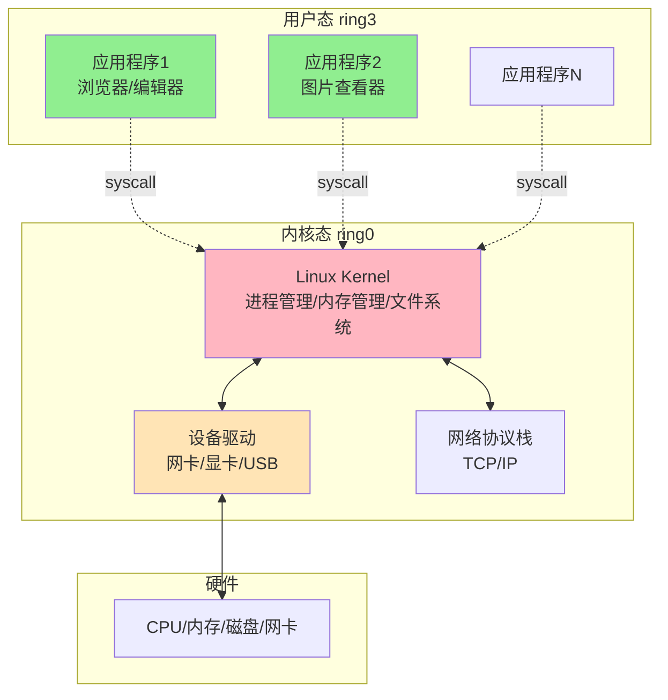
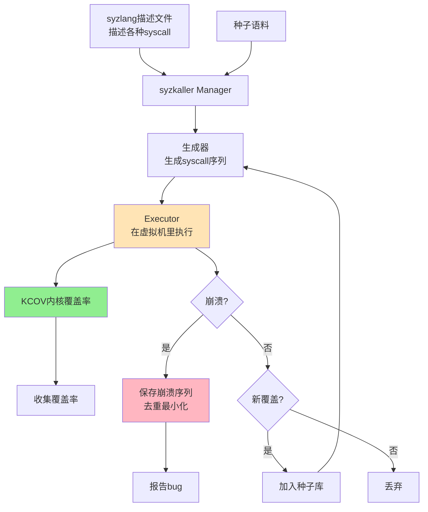
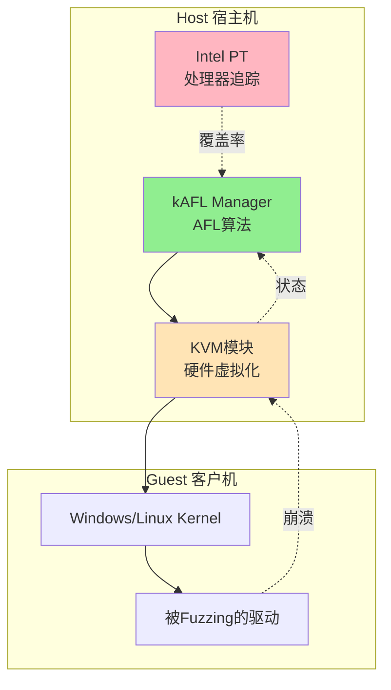

# 第130章 游戏外挂爱好者到0day漏洞猎手（下）

> **难度等级：⭐⭐⭐⭐⭐ 终极硬菜**
>
> **预计阅读时间：200分钟**
>
> **本章看点：从用户态到内核态的跨越、Windows/Linux内核漏洞挖掘、syzkaller与QEMU模式Fuzzing、V8引擎与JIT漏洞、Pwn2Own夺冠全过程、0day猎手的终极蜕变**
>
> ::: tip 说明
> 本章承接第129章的故事，继续讲小林从拿到第一个CVE之后，到走上Pwn2Own领奖台的完整历程。
>
> 文中所有人物、公司、漏洞编号、比赛细节均已脱敏处理，**基于真实事件改编**。技术细节为了可读性做了简化，但思路和套路都是真实的。
>
> 标注"（详见第X章）"的内容，可以翻到对应章节学习具体操作。
> :::

---

## 📖 本章概述

::: tip 写在前面
上一章我们讲到，小林从一个游戏外挂爱好者，在前辈老周的指点下转入漏洞挖掘领域。

他用了半年时间，学了汇编、逆向、Fuzzing，在一个开源图片库里挖到第一个栈溢出CVE，又开始学漏洞利用——ROP、堆利用、UAF。

那段时间，他觉得自己已经"入门"了。

但是真正深入下去他才发现，自己刚刚摸到门槛。

用户态的漏洞挖得再溜，影响力也有限；
真正值钱、真正硬核的，是**内核漏洞**和**浏览器漏洞**。

这一章，你会看到：
- 一个CVE新人怎么一步步走向内核漏洞研究
- Windows内核（Win32k、NDIS）漏洞是怎么挖的
- Linux内核漏洞是怎么用syzkaller挖的
- 浏览器V8引擎漏洞、JIT漏洞长啥样
- Pwn2Own比赛现场到底有多刺激
- 一个游戏外挂爱好者，是怎么最终蜕变成0day漏洞猎手的

故事很长，建议泡杯茶，慢慢看。
:::

---

## 🎯 学习目标

读完本章，你将了解：

- [x] 用户态漏洞研究的瓶颈在哪里
- [x] Windows内核漏洞的基本挖掘套路（Win32k、NDIS驱动）
- [x] Linux内核漏洞挖掘与syzkaller的使用
- [x] QEMU模式Fuzzing的原理和应用场景
- [x] 浏览器漏洞（V8、JIT）的基本原理
- [x] Pwn2Own比赛的备战和现场流程
- [x] 从漏洞猎手到顶级实验室研究员的蜕变路径
- [x] 给二进制安全初学者的成长建议

---

## 😰 第一章：CVE之后的迷茫

### 1.1 拿了6个CVE之后，我突然不会挖洞了

上篇结尾我说，半年挖到6个CVE，在小圈子里有点名气了。

按理说应该乘胜追击，对吧？

但事实是，**我卡壳了**。

而且卡得很惨。

拿到第6个CVE之后，我连续三个月没挖到任何新东西。

AFL跑了一堆开源项目，跑出来的要么是已知的，要么是不算安全漏洞的崩溃（比如空指针解引用），要么是重复的。

libFuzzer也是，跑出来的崩溃一堆，但是真正能算漏洞的寥寥无几。

那段时间我特别焦虑。

> 我是不是昙花一现？
> 我的那6个CVE是不是运气好？
> 我是不是不适合搞漏洞挖掘？

我甚至开始怀疑自己当初转行的决定。

老周看出来了，有一天晚上拉我去撸串，跟我聊了很久。

> 老周：你是不是最近没什么进展？
>
> 我：嗯，三个月没出活了。
>
> 老周：正常。每个搞漏洞的人都会经历这个阶段。
>
> 我：正常？我都怀疑自己是不是不适合干这个了。
>
> 老周：你别急，我跟你说说这是什么情况。
>       你之前那6个CVE，挖的都是什么？
>
> 我：基本都是开源图片库、XML解析库这种用户态的C程序。
>
> 老周：对。这些目标有几个特点：
>       第一，开源，你能看到源码，能插桩，好Fuzzing。
>       第二，历史漏洞多，说明本来代码质量就一般。
>       第三，但是——**这些目标已经被全世界的Fuzzing工具扫了无数遍了**。
>       你能挖到的，基本都是别人漏掉的边边角角。
>       真正的0day，早就被挖光了。
>
> 我：那怎么办？
>
> 老周：你得换个赛道。用户态的小目标，当成练手可以，但是要真正出活，得往**内核**和**浏览器**走。
>
> 我：内核？浏览器？那不是大神才搞得动的吗？
>
> 老周：谁一开始都不是大神。你搞外挂的时候，第一次搞内核反作弊不也觉得难？
>       后来不也搞懂了ring 0是啥了？
>       内核漏洞是难，但是难的东西才值钱。
>       同样一个漏洞：
>       - 用户态程序崩溃 → 顶多DoS，CVSS 5分
>       - 内核漏洞 → 直接提权到root/system，CVSS 9分起
>       - 浏览器漏洞 → 配合沙箱逃逸就是RCE，CVSS 9分起
>       你想挖值钱的，就得啃硬骨头。

那天晚上回去，我失眠了。

不是因为焦虑，是因为兴奋。

> 原来我不是不行，是赛道选错了。
> 用户态小目标的天花板，我确实摸到了。
> 但是内核、浏览器——那里才是真正的战场。

### 1.2 用户态漏洞的天花板

先说说用户态漏洞为什么有天花板。

```
🤔 用户态漏洞的局限：

1. 影响范围有限
   - 一个用户态程序崩溃，最多影响这个程序本身
   - 比如你Fuzzing一个图片库，崩了就崩了，不影响系统
   - 攻击者拿到这个程序的权限，往往就是个普通用户权限

2. 利用条件苛刻
   - 现代用户态程序都有缓解机制（ASLR、Canary、DEP、CFI...）
   - 利用一个用户态漏洞往往需要绕过一堆防护
   - 而且很多程序默认开PIE，地址都随机

3. 厂商响应快
   - 开源项目修复速度快，几小时到几天就出补丁
   - 你今天挖到的，下周就修了
   - 0day窗口期短

4. 竞争激烈
   - 全世界的Fuzzing工具都在扫这些目标
   - AFL、libFuzzer、OSS-Fuzz、ClusterFuzz...
   - Google、Microsoft都在跑大规模Fuzzing
   - 你能挖到的，基本是别人剩下的

5. 价值有限
   - 用户态漏洞的CVE，CVSS一般在5-7分
   - 漏洞奖金也低，几百到几千美元
   - 跟内核、浏览器漏洞动辄几万到几十万美元没法比
```

老周给我算过一笔账：

```
💰 不同漏洞的价值对比（大致行情，已脱敏）：

【用户态开源软件漏洞】
- CVE：能拿
- CVSS：5-7
- 厂商奖金：$100 - $5,000
- ZDI收购价：$1,000 - $10,000
- Pwn2Own：不收

【Windows/Linux内核漏洞】
- CVE：能拿
- CVSS：7-9
- 厂商奖金：$10,000 - $200,000（Microsoft奖励计划）
- ZDI收购价：$30,000 - $250,000
- Pwn2Own：内核提权单独算奖

【浏览器漏洞（V8/JavaScriptCore）】
- CVE：能拿
- CVSS：8-10
- 厂商奖金：$5,000 - $50,000（Chrome奖励计划）
- ZDI收购价：$50,000 - $500,000
- Pwn2Own：浏览器系列是重头戏，奖金$50,000-$150,000

【移动端内核漏洞（iOS/Android）】
- CVE：能拿
- CVSS：8-10
- 灰市收购价：$100,000 - $2,000,000（不细说）
- Pwn2Own：iOS全链奖金非常高
```

看到这个表，我瞬间明白了。

> 我之前挖的那6个CVE，加起来可能还不如人家一个内核漏洞值钱。
> 难怪出不了活——不是我不行，是赛道太挤了。

从那天起，我下定决心：**转内核和浏览器**。

### 1.3 老周给我的"内核学习路线"

老周又给我列了个学习路线，这次专门针对内核。

```
📚 内核漏洞挖掘学习路线（老周内核版）：

【第一阶段：内核基础】
1. 操作系统基础
   - 用户态 vs 内核态（ring 3 vs ring 0）
   - 系统调用（syscall/sysenter）
   - 中断和异常处理
   - 进程/线程模型
   - 虚拟内存（页表、TLB）

2. Windows内核基础
   - Windows内核架构（ntoskrnl、win32k.sys、HAL）
   - Windows驱动模型（WDM、WDF、KMDF）
   - IRQL（中断请求级别）
   - 内核对象（EPROCESS、KTHREAD、TOKEN）
   - Windows内核调试（WinDbg + 虚拟机）

3. Linux内核基础
   - Linux内核架构
   - Linux驱动模型
   - 内核数据结构（task_struct、cred、file）
   - 系统调用实现
   - Linux内核调试（QEMU + GDB）

【第二阶段：内核漏洞类型】
4. 内核内存破坏
   - 内核栈溢出
   - 内核堆溢出（Windows池溢出、Linux slab溢出）
   - 内核UAF
   - 内核OOB（Out-of-Bounds）
   - 内核Double Free
   - 内核整数溢出

5. 内核逻辑漏洞
   - 竞争条件（Race Condition，特别是TOCTOU）
   - 引用计数错误
   - 类型混淆
   - 空指针解引用（老内核算，新内核一般不算）
   - 任意地址读/写

6. 内核信息泄露
   - 内核地址泄露给用户态
   - 内核内存泄露
   - 侧信道

【第三阶段：内核漏洞缓解机制】
7. Windows内核缓解
   - Kernel ASLR (KASLR)
   - Kernel DEP
   - SMEP（Supervisor Mode Execution Prevention）
   - SMAP（Supervisor Mode Access Prevention）
   - kCFG（Kernel Control Flow Guard）
   - HVCI（基于虚拟化的代码完整性）
   - Pool cookies / Pool guard

8. Linux内核缓解
   - KASLR
   - SMEP / SMAP
   - KPTI（内核页表隔离，应对Meltdown）
   - STACKPROTECTOR
   - FORTIFY_SOURCE
   - CFI（Clang的）
   - SLAB_QUARANTINE / SLAB_VIRTUAL

【第四阶段：内核漏洞挖掘】
9. Windows内核Fuzzing
   - IOCTL Fuzzing
   - 内核驱动Fuzzing（DriverFuzzer、kAFL）
   - Win32k Fuzzing（专门针对窗口管理器）

10. Linux内核Fuzzing
    - syzkaller（Google开源，神器）
    -syzbot（syzkaller的持续运行版本）

11. QEMU模式Fuzzing
    - AFL的QEMU模式
    - honggfuzz的QEMU模式
    - kAFL（基于KVM的内核Fuzzing）

【第五阶段：内核漏洞利用】
12. Windows内核利用
    - Token替换提权
    - 任意地址写
    - 内核ROP
    - 绕过SMEP/SMAP（ROP、Stack Pivot）
    - 绕过HVCI（这个真的难）

13. Linux内核利用
    - modprobe_path覆写
    - cred结构体覆写
    - commit_creds(prepare_kernel_cred(0))
    - 绕过SMEP/SMAP/KPTI
    - 内核ROP链
```

我看完，差点没吐血。

> 这... 比用户态那套还要多一倍...
> 但是没办法，想挖值钱的，就得啃。

老周拍拍我肩膀：

> 别被吓到。你不需要一次学完。
> 先挑一个方向深入。
> 我建议你**先搞Linux内核**。
>
> 我：为啥先Linux？
>
> 老周：因为Linux内核开源，你能看代码，能编译，能调试。
>       Windows内核闭源，调试起来更痛苦，门槛更高。
>       Linux那边还有syzkaller这个神器，能帮你快速入门。
>       先在Linux内核上练手，把内核的那一套搞懂，再回头搞Windows。

我同意了。

于是，我的内核之旅，从Linux内核开始。

---

## 🐧 第二章：Linux内核漏洞挖掘入门

### 2.1 Linux内核是啥？跟用户态有啥区别？

先说说最基础的东西——用户态和内核态的区别。

```
📦 用户态 vs 内核态：

【用户态 (User Mode, ring 3)】
- 你写的普通程序都跑在用户态
- 权限受限，不能直接访问硬件
- 不能直接执行特权指令
- 内存访问受限制（只能访问自己的地址空间）
- 崩溃了只影响自己，不影响系统

【内核态 (Kernel Mode, ring 0)】
- 操作系统内核跑在内核态
- 拥有最高权限，能访问所有硬件
- 能执行所有指令（包括特权指令）
- 能访问所有内存
- 崩溃了？整个系统崩溃（蓝屏/Kernel Panic）

【系统调用 (syscall)】
- 用户态程序需要访问硬件/特权操作时
- 通过系统调用"陷入"内核态
- 内核替你执行，然后把结果返回给你
- 比如 read/write/open/mmap/clone 都是系统调用
```

**图130-1 用户态与内核态的隔离与切换**



为什么要讲这个？

因为**内核漏洞和用户态漏洞，完全是两个世界**。

```
🌍 内核漏洞 vs 用户态漏洞：

【用户态漏洞】
- 触发：用户输入
- 影响：崩溃当前程序
- 利用：拿到当前程序的权限
- 难度：中等（缓解机制多但有套路）
- 价值：中等

【内核漏洞】
- 触发：系统调用、ioctl、特殊文件操作...
- 影响：崩溃整个系统（Kernel Panic / 蓝屏）
- 利用：拿到内核权限（root / SYSTEM）
- 难度：高（缓解机制更强，调试更难）
- 价值：极高

【关键区别】
- 内核漏洞一旦利用成功，是**全机提权**
- 用户态漏洞利用成功，往往只是当前程序权限
- 内核漏洞的"威力"远大于用户态
- 这就是为什么内核漏洞值钱
```

### 2.2 搭建Linux内核调试环境

学内核漏洞，第一步是搭一个能调试的环境。

我用的方案是：**QEMU虚拟机 + GDB调试**。

```
🛠️ Linux内核调试环境搭建：

1. 准备一个Linux宿主机（我用的是Ubuntu 22.04）

2. 编译一个带调试符号的内核
   - 下载内核源码（kernel.org）
   - 配置：开启DEBUG_INFO、关KASLR、关SMEP/SMAP（学习阶段）
   - 编译

3. 制作一个最小的根文件系统（initramfs）

4. 用QEMU启动这个内核
   - QEMU支持GDB stub
   - 宿主机用GDB连接QEMU
   - 就能调试内核了
```

**具体命令：**

```bash
# 1. 下载内核源码
wget https://cdn.kernel.org/pub/linux/kernel/v5.x/linux-5.15.tar.xz
tar xf linux-5.15.tar.xz
cd linux-5.15

# 2. 配置内核（学习用，关掉一堆缓解机制）
make defconfig
# 然后手动改 .config：
# CONFIG_DEBUG_INFO=y           开启调试信息
# CONFIG_GDB_SCRIPTS=y          支持GDB脚本
# CONFIG_RANDOMIZE_BASE=n       关KASLR（学习阶段）
# CONFIG_X86_SMAP=n             关SMAP
# CONFIG_X86_SMEP=n             关SMEP
# CONFIG_KASAN=y                开Kernel AddressSanitizer（Fuzzing用）

# 3. 编译内核
make -j$(nproc)
# 编译完会生成 arch/x86/boot/bzImage

# 4. 制作initramfs（最小根文件系统）
# 简化版：用busybox做一个
mkdir initramfs
cd initramfs
mkdir bin sbin proc sys dev etc
cp /path/to/busybox bin/
# 写一个init脚本
cat > init <<'EOF'
#!/bin/sh
mount -t proc none /proc
mount -t sysfs none /sys
mount -t devtmpfs none /dev
echo "Welcome to debug kernel!"
/bin/sh
EOF
chmod +x init
# 打包
find . | cpio -H newc -o | gzip > ../initramfs.cpio.gz

# 5. 用QEMU启动内核
qemu-system-x86_64 \
    -kernel arch/x86/boot/bzImage \
    -initrd ../initramfs.cpio.gz \
    -append "console=ttyS0 nokaslr" \
    -m 2G \
    -smp 2 \
    -netdev user,id=net0 -device e1000,netdev=net0 \
    -S -s \
    -nographic

# -S: 启动时暂停
# -s: 开启GDB stub（端口1234）

# 6. 另一个终端，用GDB连接
gdb vmlinux
(gdb) target remote :1234
(gdb) break start_kernel
(gdb) continue
```

这套环境搭好之后，我就能：
- 在内核任意位置下断点
- 单步执行内核代码
- 查看内核内存、寄存器
- 修改内核数据

跟用户态调试差不多，就是慢一点（QEMU虚拟机）。

> 💡 **WinDbg调试Windows内核？**
> Windows内核调试用WinDbg + 双虚拟机（一台被调试，一台调试器）。
> 通过命名管道连接。
> 后面讲Windows内核的时候会说。

### 2.3 syzkaller：Google的内核Fuzzing神器

环境搭好之后，开始学内核Fuzzing。

Linux内核Fuzzing的"神器"叫 **syzkaller**，是Google开源的。

```
🛠️ syzkaller是什么？

syzkaller是Google开发的开源内核Fuzzing工具，专门用来挖Linux内核漏洞。
特点：
1. 覆盖率引导（类似AFL）
2. 系统调用级别的Fuzzing
3. 有一套"系统调用描述语言"（syzlang），描述怎么调用各种syscall
4. 自动分析崩溃
5. 已经发现了**上千个**内核漏洞

syzkaller的"姐妹项目"叫 syzbot，是syzkaller的7x24小时持续运行版本。
syzbot一直在Fuzzing Linux内核主线，发现漏洞自动上报。
你可以在 syzbot.botanik.immutably.studio 上看到所有正在跑的bug。
```

**syzkaller的工作原理：**

```
🤔 syzkaller怎么工作？

1. 系统调用序列作为输入
   - 不像AFL fuzz的是单个文件输入
   - syzkaller fuzz的是"一系列系统调用"
   - 比如：open("/dev/x") -> ioctl(fd, 0x1234, ...) -> read(fd, ...)

2. 用syzlang描述系统调用
   - syzkaller有一套自己的描述语言
   - 描述每个syscall的参数类型、取值范围、依赖关系
   - 比如：
     open(filename filename, flags flags[open_flags], mode flags[open_mode]) fd
     ioctl(fd fd, cmd intptr, arg buffer[in])
   - 这些描述叫"syscall descriptions"

3. 变异和生成
   - 基于现有的syscall序列做变异
   - 变异方式：插入新syscall、删除syscall、修改参数、复制序列...
   - 也支持种子语料

4. 覆盖率收集
   - 通过KCOV（内核覆盖率收集机制）
   - syzkaller启动内核时开启KCOV
   - 每次syscall执行后，内核会把覆盖的代码地址告诉syzkaller
   - syzkaller据此指导变异

5. 崩溃检测
   - 内核崩溃（KASAN报错、Panic、Warning）
   - syzkaller检测到崩溃，保存触发崩溃的syscall序列
   - 然后做去重、最小化
```

**图130-2 syzkaller工作流程**



**syzkaller的基本配置：**

```json
// syzkaller.cfg
{
    "target": "linux/amd64",
    "http": "127.0.0.1:56741",
    "workdir": "/home/lin/syzkaller/work",
    "syzkaller": "/home/lin/syzkaller",
    "kernel_obj": "/home/lin/linux-5.15",
    "image": "/home/lin/initramfs.cpio.gz",
    "kernel": "/home/lin/linux-5.15/arch/x86/boot/bzImage",
    "type": "qemu",
    "vm": {
        "count": 4,
        "kernel": "/home/lin/linux-5.15/arch/x86/boot/bzImage",
        "image": "/home/lin/initramfs.cpio.gz",
        "cpu": 2,
        "mem": 2048,
        "cmdline": "console=ttyS0 nokaslr"
    },
    "enable_syscalls": [
        "open", "read", "write", "close",
        "ioctl", "mmap", "socket", "bind",
        "connect", "sendto", "recvfrom"
    ],
    "sandbox": "none"
}
```

```bash
# 启动syzkaller
cd /home/lin/syzkaller
./bin/syz-manager -config=syzkaller.cfg

# 然后浏览器访问 http://127.0.0.1:56741 就能看到Fuzzing进度
```

### 2.4 第一个内核崩溃：写一个简单的漏洞驱动

syzkaller直接跑Linux内核主线的话，能挖到的基本都是别人已经发现的。

学习阶段，老周让我**先自己写一个有漏洞的内核驱动**，然后Fuzzing它，这样能完整体验"挖洞"的全过程。

我写了一个叫 `vuln_driver` 的内核模块，故意留了几个洞：

```c
// vuln_driver.c - 有漏洞的Linux内核驱动
#include <linux/module.h>
#include <linux/kernel.h>
#include <linux/fs.h>
#include <linux/device.h>
#include <linux/uaccess.h>
#include <linux/slab.h>

#define DEVICE_NAME "vuln"
#define IOCTL_CMD1 _IOW('V', 1, struct vuln_arg)
#define IOCTL_CMD2 _IOW('V', 2, struct vuln_arg)
#define IOCTL_CMD3 _IOW('V', 3, struct vuln_arg)

struct vuln_arg {
    unsigned long size;
    char __user *data;
};

static struct class *vuln_class;
static int major_num;

/* 全局缓冲区，给UAF用 */
static char *g_buf = NULL;
static int g_buf_size = 256;

/* 漏洞1：缓冲区溢出 */
static int handle_cmd1(struct vuln_arg __user *arg) {
    struct vuln_arg karg;
    char *buf;
    
    if (copy_from_user(&karg, arg, sizeof(karg)))
        return -EFAULT;
    
    /* 这里没检查karg.size！栈缓冲区溢出 */
    buf = kmalloc(64, GFP_KERNEL);
    if (!buf) return -ENOMEM;
    
    if (copy_from_user(buf, karg.data, karg.size)) {
        kfree(buf);
        return -EFAULT;
    }
    
    printk(KERN_INFO "vuln: cmd1 got %lu bytes\n", karg.size);
    kfree(buf);
    return 0;
}

/* 漏洞2：UAF */
static int handle_cmd2(struct vuln_arg __user *arg) {
    struct vuln_arg karg;
    
    if (copy_from_user(&karg, arg, sizeof(karg)))
        return -EFAULT;
    
    if (karg.size == 0) {
        /* 释放全局缓冲区 */
        if (g_buf) {
            kfree(g_buf);
            g_buf = NULL;
            printk(KERN_INFO "vuln: cmd2 freed g_buf\n");
        }
    } else {
        /* 使用全局缓冲区 - UAF！如果先free再用就出问题 */
        if (g_buf) {
            printk(KERN_INFO "vuln: g_buf content: %s\n", g_buf);
            if (copy_to_user(karg.data, g_buf, g_buf_size))
                return -EFAULT;
        }
    }
    return 0;
}

/* 漏洞3：整数溢出 */
static int handle_cmd3(struct vuln_arg __user *arg) {
    struct vuln_arg karg;
    char *buf;
    unsigned int size;
    
    if (copy_from_user(&karg, arg, sizeof(karg)))
        return -EFAULT;
    
    /* 这里把unsigned long转成unsigned int，可能截断 */
    size = (unsigned int)karg.size;
    /* 如果karg.size = 0x100000064，size变成0x64 */
    /* 然后下面分配0x64字节，但是copy_from_user用了karg.size */
    buf = kmalloc(size, GFP_KERNEL);
    if (!buf) return -ENOMEM;
    
    /* 堆溢出！分配了size字节，但拷贝了karg.size字节 */
    if (copy_from_user(buf, karg.data, karg.size)) {
        kfree(buf);
        return -EFAULT;
    }
    
    kfree(buf);
    return 0;
}

static long vuln_ioctl(struct file *file, unsigned int cmd, unsigned long arg) {
    switch (cmd) {
    case IOCTL_CMD1: return handle_cmd1((void __user *)arg);
    case IOCTL_CMD2: return handle_cmd2((void __user *)arg);
    case IOCTL_CMD3: return handle_cmd3((void __user *)arg);
    default: return -EINVAL;
    }
}

/* 初始化时分配g_buf */
static int __init vuln_init(void) {
    major_num = register_chrdev(0, DEVICE_NAME, ...);
    vuln_class = class_create(THIS_MODULE, DEVICE_NAME);
    device_create(vuln_class, NULL, MKDEV(major_num, 0), NULL, DEVICE_NAME);
    
    g_buf = kmalloc(g_buf_size, GFP_KERNEL);
    strcpy(g_buf, "default content");
    
    printk(KERN_INFO "vuln driver loaded\n");
    return 0;
}

module_init(vuln_init);
```

然后写一个syzkaller的描述文件：

```
// vuln_driver.txt - syzkaller描述
include <fcntl.h>
include <sys/ioctl.h>

resource fd_vuln[int32]: fd

open$dev_vuln(file ptr[in, string["/dev/vuln"]], flags flags[open_flags], mode flags[open_mode]) fd_vuln

ioctl$VULN_CMD1(fd fd_vuln, cmd const[0x40085601], arg ptr[in, vuln_arg])
ioctl$VULN_CMD2(fd fd_vuln, cmd const[0x40085602], arg ptr[in, vuln_arg])
ioctl$VULN_CMD3(fd fd_vuln, cmd const[0x40085603], arg ptr[in, vuln_arg])

vuln_arg {
    size  intptr
    data  buffer[in]
}
```

启动syzkaller，跑了一晚上。

第二天早上看结果，三个洞全被syzkaller找到了！

```
📊 syzkaller Fuzzing结果（自己写的漏洞驱动）：

【运行时间】8小时
【崩溃数】17个

【崩溃1：缓冲区溢出（cmd1）】
- KASAN报告：slab-out-of-bounds write
- 触发：ioctl cmd1, size=512, 溢出kmalloc(64)
- 重复次数：8次

【崩溃2：UAF（cmd2）】
- KASAN报告：use-after-free Read
- 触发：先 ioctl cmd2 size=0（free）, 再 ioctl cmd2 size=1（use）
- 重复次数：6次

【崩溃3：整数溢出（cmd3）】
- KASAN报告：slab-out-of-bounds write
- 触发：ioctl cmd3, size=0x100000064
- 重复次数：3次
```

那一刻，我感觉内核Fuzzing的"任督二脉"被打通了。

> 原来内核漏洞也没那么神秘。
> 用KASAN + syzkaller，思路跟用户态Fuzzing差不多。
> 就是工具链不一样而已。

### 2.5 syzkaller的进阶用法

跑通之后，开始学syzkaller的进阶用法。

```
🚀 syzkaller进阶技巧：

1. 写好syzlang描述
   - syzkaller默认的描述覆盖了大部分syscall
   - 但是对于"冷门"的接口（比如某些ioctl、特殊文件系统）
   - 你需要自己写描述
   - 描述写得越精准，Fuzzing效率越高

2. 用KASAN
   - Kernel AddressSanitizer
   - 能检测内存错误（溢出、UAF、double free）
   - 不开KASAN的话，很多内存错误不会立即崩溃，发现不了
   - 编译内核时开 CONFIG_KASAN=y

3. 用KMSAN
   - Kernel MemorySanitizer
   - 检测未初始化内存的使用
   - 开 CONFIG_KMSAN=y

4. 用KCSAN
   - Kernel Concurrency Sanitizer
   - 检测竞争条件
   - 开 CONFIG_KCSAN=y

5. 多虚拟机并行
   - syzkaller支持启动多个VM并行Fuzzing
   - 一般开4-16个VM
   - 资源越多越好

6. 持续运行
   - syzbot是7x24小时运行的
   - 你自己也可以搭一个长期跑的环境
   - 内核每周都有新代码合入，新代码就是新漏洞

7. 关注新合入的代码
   - Linux内核每天都有新代码合入
   - 新代码 = 新漏洞
   - 关注LKML（Linux内核邮件列表），看哪些子系统有大改动
   - 重点Fuzzing那些大改动的子系统
```

### 2.6 挖到第一个真实的Linux内核漏洞

学了两个月syzkaller，我开始Fuzzing一些"冷门"的内核子系统。

主流的子系统（网络、文件系统）早就被syzbot扫烂了，我去Fuzzing也没意思。

我把目光投向一些相对冷门但最近有大改动的子系统——比如某个文件系统的最新补丁。

跑了大概一周，syzkaller报了一个崩溃：

```
 BUG: KASAN: slab-out-of-bounds in xxx_ioctl+0x1a4/0x300
 Write of size 4 at addr ffff888012345678 by task syz-executor/1234

 CPU: 1 PID: 1234 Comm: syz-executor Not tainted 5.15.0-rc3 #1
 Call Trace:
  dump_stack_lvl+0x49/0x63
  print_address_description.constprop.0+0x1f/0x140
  kasan_report.cold+0x7f/0x11b
  xxx_ioctl+0x1a4/0x300
  __x64_sys_ioctl+0x12d/0x1a0
  do_syscall_64+0x35/0x80
  entry_SYSCALL_64_after_hwframe+0x44/0xae
```

是个OOB（Out-of-Bounds）写！

我赶紧用GDB调试，分析根因。

```
🔍 漏洞根因分析：

文件：fs/xxx/xxx_ioctl.c
函数：xxx_ioctl
问题：检查用户输入的"偏移量"时，用了有符号比较

代码（简化后）：
static long xxx_ioctl(struct file *file, unsigned int cmd, unsigned long arg) {
    struct xxx_data *data = file->private_data;
    struct xxx_request req;
    int offset;  // 注意：有符号！
    
    if (copy_from_user(&req, (void __user *)arg, sizeof(req)))
        return -EFAULT;
    
    offset = req.offset;
    
    // 这里应该用 offset < 0 || offset > MAX，但写成了 offset > MAX
    // 如果offset是负数（比如 -1 = 0xFFFFFFFF），就绕过了检查
    if (offset > MAX_OFFSET)  // 漏洞！负数绕过
        return -EINVAL;
    
    // 然后：
    data->buffer[offset] = req.value;  // OOB写！
    
    return 0;
}

漏洞类型：CWE-787 Out-of-bounds Write
根因：有符号整数比较错误
```

我把这个漏洞的PoC写出来，跑了一下，成功触发：

```c
// poc.c - 触发内核OOB写
#include <stdio.h>
#include <fcntl.h>
#include <sys/ioctl.h>
#include <string.h>
#include <unistd.h>

struct xxx_request {
    int offset;       // 有符号！
    unsigned int value;
};

int main() {
    int fd = open("/dev/xxx", O_RDWR);
    if (fd < 0) {
        perror("open");
        return 1;
    }
    
    struct xxx_request req;
    req.offset = -1;  // 负数绕过检查
    req.value = 0xDEADBEEF;
    
    ioctl(fd, 0x40085801, &req);
    
    printf("[+] OOB write triggered, check dmesg for KASAN report\n");
    
    close(fd);
    return 0;
}
```

```bash
$ gcc -o poc poc.c
$ sudo dmesg -C
$ sudo ./poc
$ dmesg | tail
[  123.456789] BUG: KASAN: slab-out-of-bounds in xxx_ioctl+0x1a4/0x300
[  123.456890] Write of size 4 at addr ffff888012345678 by task poc/1234
...
```

**漏洞确认！**

我把漏洞报告发到Linux内核邮件列表（LKML），邮件格式大概这样：

```
To: xxx-maintainer@example.com
Cc: linux-kernel@vger.kernel.org, security@kernel.org
Subject: [PATCH] xxx: fix signed comparison in xxx_ioctl leading to OOB write

Hi,

I found an out-of-bounds write vulnerability in xxx_ioctl.

【Bug details】
The offset check in xxx_ioctl uses signed comparison, which can be 
bypassed with a negative offset, leading to OOB write.

【Reproduction】
Run the attached PoC on kernel 5.15-rc3 with CONFIG_KASAN=y.

【KASAN report】
(see attached log)

【Suggested fix】
Use proper bounds check:
    if (offset < 0 || offset > MAX_OFFSET)
        return -EINVAL;

I believe this can be triggered by an unprivileged user with access 
to /dev/xxx, and may lead to kernel memory corruption.

Please confirm.

Best regards,
Lin
```

维护者一周内回复确认，发了修复补丁。

我又申请了CVE，拿到了我的**第一个内核漏洞CVE**！

```
🎉 第一个内核漏洞CVE：

CVE-2025-XXXXX
标题：Out-of-bounds write in xxx_ioctl in Linux kernel before 5.15.1
类型：CWE-787 Out-of-bounds Write
严重性：7.8 (High)
发现方式：syzkaller Fuzzing
```

虽然这个漏洞限制比较大（需要能访问特定设备），但是意义非凡——

**这是我第一次挖到内核漏洞！**

从用户态跨到内核态，这对我来说是一个里程碑。

> 💡 **KASAN是什么？**
> KASAN（Kernel AddressSanitizer）是内核的内存错误检测工具。
> 它能在内存错误发生的时候立即报错，而不是等程序崩溃。
> 没有KASAN，很多内核内存错误根本发现不了（内核不会因为一个小溢出就崩溃）。
> 内核Fuzzing必备。

---

## 🪟 第三章：Windows内核漏洞挖掘

### 3.1 从Linux回到Windows

Linux内核挖了一阵之后，老周建议我也搞搞Windows内核。

```
🤔 为什么要搞Windows内核？

1. Windows用户多
   - 全球几十亿Windows用户
   - 一个Windows内核0day，影响范围巨大
   - 厂商奖金也高（Microsoft奖励计划）

2. Pwn2Own有Windows内核类目
   - Pwn2Own比赛里，Windows本地提权是经典类目
   - 需要一个Windows内核漏洞

3. Windows内核漏洞的独特价值
   - Windows内核的某些子系统（Win32k、NDIS）历史悠久，代码复杂
   - 复杂的代码 = 漏洞的温床
   - Win32k.sys一直是漏洞重灾区
```

但是Windows内核比Linux难搞多了。

```
😤 Windows内核研究的难点：

1. 闭源
   - Linux内核开源，你能看代码
   - Windows内核闭源，只能逆向
   - 调试也麻烦（需要符号文件，有时候还没公开）

2. 调试环境复杂
   - Linux用QEMU+GDB就行
   - Windows要用WinDbg + 双虚拟机
   - 配置麻烦，还容易出问题

3. 内核结构复杂
   - Windows内核的内部结构（EPROCESS、KTHREAD等）没文档
   - 不同版本之间还会变
   - 要靠逆向+泄露的文档+前辈的研究来理解

4. 缓解机制多
   - Windows内核的缓解机制比Linux还多
   - HVCI（基于虚拟化的代码完整性）特别难绕
   - kCFG也麻烦

5. 工具少
   - Linux有syzkaller这种神器
   - Windows内核Fuzzing工具少得多
   - 很多时候要自己写工具
```

虽然难，但是值钱。咬牙上。

### 3.2 Windows内核基础：架构与调试

先说Windows内核的架构。

```
📦 Windows内核架构（简化版）：

【用户态 (ring 3)】
- 各种应用程序
- 子系统DLL（kernel32.dll, user32.dll, gdi32.dll, ntdll.dll）
- 子系统DLL通过syscall进入内核

【内核态 (ring 0)】
- ntoskrnl.exe：内核核心
  * 进程/线程管理
  * 内存管理
  * 对象管理
  * I/O管理
- win32k.sys：窗口管理器 + GDI
  * 窗口、消息、绘图
  * 历史悠久，漏洞重灾区
- HAL.dll：硬件抽象层
- 各种驱动（.sys文件）
  * 网络驱动（NDIS）
  * 文件系统驱动
  * 设备驱动

【关键概念】
- IRQL：中断请求级别
  * PASSIVE_LEVEL (0)：普通级别，可以被抢占
  * APC_LEVEL (1)：APC级别
  * DISPATCH_LEVEL (2)：调度级别，不能被抢占
  * Device IRQL：设备中断级别
  * HIGH_LEVEL (15)：最高级别
  * IRQL是Windows内核的核心概念，很多漏洞跟IRQL处理不当有关
```

**Windows内核调试环境：**

```
🛠️ Windows内核调试环境搭建：

1. 准备两台虚拟机（VMware或VirtualBox）
   - VM1：被调试机（Target），运行你要调试的Windows
   - VM2：调试机（Host），运行WinDbg

2. 配置命名管道
   - 两台VM通过命名管道连接
   - VMware的设置里能配

3. 被调试机开启内核调试
   - 用 bcdedit 命令：
     bcdedit /debug on
     bcdedit /dbgsettings serial debugport:1 baudrate:115200
   - 重启

4. 调试机用WinDbg连接
   - WinDbg → File → Kernel Debug → COM
   - 设置波特率、端口（命名管道）

5. 安装符号文件
   - 在WinDbg里设置符号路径：
     .sympath srv*c:\symbols*https://msdl.microsoft.com/download/symbols
   - 这样WinDbg能自动下载Microsoft的符号
```

```
🛠️ WinDbg常用命令：

【断点】
- bp <地址/函数>：下断点
  * bp nt!NtCreateFile
  * bp 0xFFFFF80012345678
- bu <模块!函数>：未加载模块的断点（模块加载时生效）
- bc <编号>：清除断点
- bl：列出所有断点

【执行】
- g：继续执行（go）
- t：单步步入（Step Into）
- p：单步步过（Step Over）
- gu：执行到当前函数返回（Step Out）

【查看】
- r：查看寄存器
- dt <类型> <地址>：显示结构体
  * dt nt!_EPROCESS
  * dt nt!_EPROCESS 0xFFFFFA8001234567
- dd <地址>：以DWORD查看内存
- dq <地址>：以QWORD查看内存
- da <地址>：以ASCII查看内存
- u <地址>：反汇编
- ln <地址>：查看最近的符号

【调用栈】
- k：查看调用栈
- kv：详细调用栈
- kn：带帧号的调用栈

【其他】
- !process 0 0：列出所有进程
- !process 0 7：详细列出所有进程
- !devnode 0 1：列出设备树
- !irql：查看当前IRQL
- !pool <地址>：查看池信息
- !analyze -v：分析崩溃（蓝屏后必用）
```

### 3.3 Win32k.sys：漏洞重灾区

Windows内核里最容易出漏洞的，**Win32k.sys**绝对排前三。

```
😱 Win32k.sys为什么漏洞多？

1. 历史悠久
   - Win32k从Windows NT 3.x就有了
   - 几十年的老代码
   - 历史包袱重

2. 功能复杂
   - Win32k同时干两件事：
     * 窗口管理器（User）：窗口、消息、控件
     * GDI：图形设备接口，绘图
   - 两个东西揉在一起，复杂度爆炸

3. 用户态和内核态都有
   - win32k.sys在内核态
   - win32u.dll在用户态
   - 用户态调syscall进内核
   - 攻击面大

4. 历史上的设计缺陷
   - 早期Win32k允许用户态传大量数据进内核
   - 很多回调机制
   - 很多对象共享

5. 著名的漏洞类型
   - 窗口对象UAF（Win32k UAF是经典）
   - 旋转锁竞争（Race Condition）
   - 回调攻击（Callback会调用用户态代码）
   - 任意指针解引用
```

**经典的Win32k UAF漏洞套路：**

```
💀 Win32k UAF典型套路：

1. 创建一个窗口对象（CreateWindow）
   - 内核里分配一个win32k!tagWND结构体

2. 通过某种方式触发窗口对象的释放
   - 但是某个指针还指向它
   - 这是UAF的核心

3. 重新分配内存占位
   - 用一个用户态可控的对象占位
   - 比如Accelerator、Cursor、另一个窗口...
   - 让原窗口指针指向我们控制的数据

4. 通过原指针访问
   - 调用某些Win32 API
   - 内核通过原指针访问"窗口"
   - 实际访问的是我们伪造的数据

5. 利用伪造的数据
   - 伪造窗口的成员指针
   - 实现任意地址读/写
   - 最终提权

经典的Win32k漏洞例子：
- CVE-2016-7255（被APT用过，著名）
- CVE-2021-1732（涉嫌被用于攻击）
- CVE-2022-21882
- CVE-2023-XXXXX（每年都有新的）
```

**一个Win32k漏洞PoC的简化框架（仅示意，已脱敏）：**

```c
// win32k_uaf_poc.c - Win32k UAF PoC（简化示意，不可直接运行）
#include <windows.h>
#include <stdio.h>

int main() {
    HWND hwnd;
    
    // 1. 创建一个窗口
    hwnd = CreateWindowEx(
        0, "STATIC", "test",
        WS_OVERLAPPEDWINDOW,
        0, 0, 100, 100,
        NULL, NULL, NULL, NULL);
    
    printf("[+] Window created: %p\n", hwnd);
    
    // 2. 触发UAF
    // 这里的具体触发方式取决于漏洞
    // 可能是：
    //   - 设置某个特殊窗口属性
    //   - 发送特定消息
    //   - 调用特定API
    // 假设漏洞是 SetWindowLongPtr 设置某个index会触发free
    
    SetWindowLongPtr(hwnd, GWLP_HINSTANCE, (LONG_PTR)0xDEADBEEF);
    
    // 3. 此时窗口对象已被free，但hwnd还指向它
    
    // 4. 重新占位
    // 用Accelerator或Cursor占位
    HACCEL hAccel = CreateAcceleratorTable(...);
    
    // 5. 通过原hwnd访问
    // 此时访问的已经是占位的数据
    GetWindowText(hwnd, buf, sizeof(buf));
    
    printf("[+] UAF triggered\n");
    
    return 0;
}
```

> ⚠️ **重要说明**
> 上面的代码只是PoC的简化框架，**不能直接运行**，也**不会真的触发漏洞**。
> 真实的Win32k PoC要复杂得多，需要精确的heap spray、对象布局等。
> 这里只是为了说明思路。

### 3.4 NDIS驱动漏洞：网络栈的暗角

除了Win32k，**NDIS（Network Driver Interface Specification）驱动**也是漏洞重灾区。

NDIS是Windows网络驱动的接口规范，网卡驱动、防火墙驱动、VPN驱动都用NDIS。

```
🌐 NDIS驱动是什么？

NDIS是Windows的网络驱动框架。
- 网卡驱动（miniport driver）：驱动网卡硬件
- 中间层驱动（intermediate driver）：过滤/修改网络流量
- 协议驱动（protocol driver）：实现网络协议

NDIS驱动跑在内核态，处理网络包。
网络包是从外部来的"不可信输入"——
这意味着，攻击者发包，就能驱动NDIS代码。
所以NDIS驱动漏洞往往能被**远程触发**！

NDIS驱动漏洞的可怕之处：
- 远程触发（不需要本机权限）
- 内核态执行
- 经常导致RCE或内核崩溃（蓝屏）
```

**NDIS驱动漏洞的典型场景：**

```
💀 NDIS驱动漏洞典型场景：

1. 攻击者发送畸形网络包
   - 比如畸形的TCP包、UDP包、ICMP包
   - 或者特殊协议的包（比如LLDP、L2CAP、IPv6扩展头）

2. 网卡收到包，传给NDIS驱动

3. NDIS驱动解析包
   - 这里经常出问题：解析时没检查长度、没处理边界
   - 整数溢出、缓冲区溢出、OOB读

4. 内核崩溃或被控制

著名例子：
- CVE-2021-XXXXX：某防火墙驱动的包解析溢出（远程蓝屏）
- CVE-2022-XXXXX：某VPN驱动的协议解析漏洞（远程RCE）
- 蓝牙协议栈的L2CAP漏洞（远程触发）
- WiFi协议栈的漏洞（远程触发）
```

**Fuzzing NDIS驱动的思路：**

```
🎯 Fuzzing NDIS驱动的方法：

1. 用虚拟网卡
   - 在虚拟机里装一个虚拟网卡
   - 通过虚拟网卡注入畸形包

2. 用Scapy构造畸形包
   - Scapy是Python的网络包构造工具
   - 能构造任意协议的包
   - 可以做变异式Fuzzing

3. 监控内核崩溃
   - 配置内核崩溃转储
   - 一旦蓝屏，自动重启并收集dump

4. 自动化
   - 写脚本：发包 → 等崩溃 → 重启 → 继续
   - 类似AFL的循环

简化伪代码：
```python
# ndis_fuzz.py - NDIS驱动Fuzzing（简化伪代码）
from scapy.all import *
import random
import subprocess
import time

def generate_malformed_packet():
    """生成畸形网络包"""
    base = IP(dst="10.0.0.1") / TCP()
    # 随机变异
    mutations = [
        lambda p: p.__class__(raw(p)[:random.randint(0, len(p))]),  # 截断
        lambda p: p.__class__(raw(p) + b"A" * random.randint(0, 1000)),  # 加长
        lambda p: p.__class__(bytes([random.randint(0, 255) for _ in range(len(p))])),  # 全随机
    ]
    return random.choice(mutations)(base)

def check_crash():
    """检查是否蓝屏"""
    # 通过虚拟机API检查状态
    # 或者通过串口日志
    pass

def fuzz_loop():
    while True:
        pkt = generate_malformed_packet()
        send(pkt, verbose=0)  # 发包
        
        if check_crash():
            print(f"[+] Crash found! Packet saved")
            wrpcap("crash.pcap", pkt)
            # 重启虚拟机
            reboot_vm()
        
        time.sleep(0.01)

fuzz_loop()
```

NDIS驱动Fuzzing不像Linux内核有syzkaller现成的，更多需要自己造轮子。

但正因为这样，挖到的概率也大——别人没Fuzzing过的角落，才有0day。

---

## 🌐 第四章：高级Fuzzing技术

### 4.1 QEMU模式Fuzzing：Fuzzing闭源程序

前面说的AFL、libFuzzer，都需要**插桩**——也就是要重新编译目标程序，把覆盖率统计代码塞进去。

但是很多时候，你没有源码，不能重新编译。比如：
- 闭源软件（Microsoft Office、Adobe Reader）
- 加壳的程序
- 固件（路由器、摄像头）
- Windows内核（虽然能逆向，但是插桩难）

这时候就需要 **QEMU模式Fuzzing**。

```
🛠️ QEMU模式Fuzzing是什么？

QEMU是一个开源的模拟器/虚拟机监视器。
它能模拟整个CPU执行，包括用户态程序。

QEMU模式Fuzzing的思路：
1. 把目标程序跑在QEMU里
2. QEMU模拟CPU执行，能"看到"每一条指令
3. 在QEMU层面收集覆盖率（不需要插桩目标程序！）
4. 把覆盖率反馈给Fuzzer（AFL、honggfuzz）

优点：
- 不需要源码
- 不需要重新编译
- 适用于任何二进制程序

缺点：
- 慢（QEMU模拟执行，比原生慢10-50倍）
- 覆盖率不如插桩精准
```

**AFL的QEMU模式：**

```bash
# 1. 编译带QEMU模式的AFL
cd afl-2.57b
make
cd qemu_mode
./build_qemu_support.sh

# 2. 用QEMU模式Fuzzing闭源程序
afl-fuzz -Q -i input_seeds -o output -- ./target_binary @@

# -Q: 启用QEMU模式
```

**honggfuzz的QEMU模式：**

```bash
# honggfuzz也支持QEMU模式
honggfuzz -Q --input input_seeds/ --output output/ -- ./target_binary ___FILE___
```

### 4.2 kAFL：基于KVM的内核Fuzzing

kAFL（Kernel AFL）是一个专门Fuzzing内核的工具，基于KVM。

```
🛠️ kAFL是什么？

kAFL是德国研机构开发的内核Fuzzing工具。
基于KVM（Linux的虚拟化）。
能Fuzzing任意OS的内核（Windows、Linux、macOS）。

特点：
1. 用KVM的硬件虚拟化，速度快
2. 通过Intel PT（Processor Trace）收集覆盖率
3. 不需要内核源码，不需要插桩
4. 能Fuzzing Windows内核！

这是kAFL最大的价值——
能Fuzzing闭源的Windows内核。
syzkaller只能Fuzzing Linux，kAFL能Fuzzing任何内核。
```

**图130-3 kAFL架构**



kAFL的搭建比syzkaller复杂得多，需要：
- Intel PT支持的CPU（比较新的）
- 自己编译带kAFL补丁的KVM
- 配置客户机内核

但是搭好之后，能Fuzzing任何内核——这是它的杀手锏。

### 4.3 内核Fuzzing的难点与对策

跑了一段时间内核Fuzzing，我总结了几个难点：

```
😤 内核Fuzzing的难点：

1. 速度慢
   - 内核Fuzzing比用户态慢几个数量级
   - 用户态AFL能跑几千次/秒
   - 内核Fuzzing（syzkaller）一般几十次/秒
   - 因为每次执行要恢复内核状态

对策：
   - 多虚拟机并行
   - 用快照（snapshot）加速
   - kAFL用KVM的快照，速度比syzkaller快

2. 状态恢复难
   - 用户态Fuzzing，每次fork一个新进程，状态干净
   - 内核Fuzzing，内核状态在syscall之间累积
   - 一个syscall改了内核状态，后续syscall受影响
   - 容易出现"假崩溃"或"难复现"

对策：
   - 定期重启虚拟机
   - 用快照恢复
   - syzkaller会做crash复现

3. 崩溃复现难
   - 内核崩溃经常涉及竞争条件
   - 同样的输入，跑10次可能只崩1次
   - 修复之后想验证，跑不出来

对策：
   - 跑多次（10次、100次）
   - 用KCSAN检测竞争
   - 写更稳定的PoC

4. 漏洞去重难
   - 同一个根因，可能触发不同的崩溃
   - syzkaller会自动去重，但是不准
   - 经常同一个bug收到一堆报告

对策：
   - 看崩溃的调用栈
   - 看根因函数
   - 人工判断

5. 难以触发的代码路径
   - 内核很多代码需要特殊条件才能触发
   - 比如某些文件系统需要特殊磁盘布局
   - 某些网络代码需要特殊连接状态

对策：
   - 写专门的syzlang描述
   - 准备特殊的种子
   - 长时间运行
```

### 4.4 一个完整的内核漏洞挖掘周期

我把那段时间的一个完整挖掘周期总结一下：

```
📅 一个Linux内核漏洞的完整挖掘周期：

【第1周】选目标
- 关注LKML，看哪些子系统最近有大改动
- 选了一个最近合入新功能的子系统（已脱敏）
- 阅读相关代码，理解功能

【第2周】写syzlang描述
- 该子系统之前没有syzlang描述
- 我自己写了描述文件
- 这步最难，要理解子系统的接口

【第3周】Fuzzing
- 启动syzkaller，4个VM并行
- 配置KASAN/KMSAN/KCSAN全开
- 持续运行

【第4周】分析崩溃
- 第3周末开始报崩溃
- 收到几个崩溃，分析根因
- 大部分是同一个bug的不同表现
- 确认是真实漏洞

【第5周】写PoC
- 写最小化PoC
- 验证可稳定触发
- 写漏洞报告

【第6周】提交
- 发到LKML
- 维护者确认
- 修复补丁合入
- 申请CVE

【第8周】CVE下达
- 拿到CVE编号
- 写技术博客公开

整个周期：2个月
最终成果：1个内核CVE
```

一个漏洞，两个月。听起来慢，但是内核漏洞就是这种节奏。

> 💡 **内核漏洞挖掘的"耐心"**
> 用户态漏洞，可能一天挖好几个。
> 内核漏洞，一两个月挖一个就不错了。
> 想要快速出活？内核不是好选择。
> 想要挖值钱的？内核是不二之选。

---

## 🌍 第五章：浏览器漏洞——V8与JIT

### 5.1 为什么浏览器漏洞这么值钱？

内核漏洞之外，**浏览器漏洞**是另一个"值钱"的方向。

```
💰 浏览器漏洞为什么值钱？

1. 影响范围巨大
   - Chrome、Edge、Firefox 用户加起来几十亿
   - 一个浏览器漏洞，影响全球一半的电脑

2. 攻击门槛低
   - 用户只要访问一个网页，就可能被攻击
   - 不需要本机权限
   - 不需要社交工程（钓鱼链接即可）

3. 利用威力大
   - 浏览器漏洞 + 沙箱逃逸 = 远程代码执行
   - 在受害者电脑上执行任意代码

4. 厂商奖金高
   - Chrome奖励计划：最高$250,000
   - Pwn2Own浏览器类目：$50,000-$150,000
   - 灰市收购价更高

5. 浏览器是"现代操作系统"
   - 浏览器里跑着WebAssembly、JavaScript、各种渲染引擎
   - 复杂度堪比操作系统
   - 攻击面巨大
```

浏览器漏洞的核心组件：

```
📦 浏览器的核心组件：

1. 渲染引擎
   - Chrome: Blink
   - Firefox: Gecko
   - Safari: WebKit
   - 负责解析HTML、CSS，渲染页面

2. JavaScript引擎（最容易出漏洞）
   - Chrome: V8
   - Firefox: SpiderMonkey
   - Safari: JavaScriptCore
   - 负责执行JavaScript

3. 沙箱
   - 渲染进程跑在沙箱里
   - 即使渲染进程被攻破，也不能直接危害系统
   - 需要额外的"沙箱逃逸"漏洞

4. 进程模型
   - Chrome是多进程架构
   - 浏览器进程（有权限）+ 多个渲染进程（沙箱内）
   - 攻击者通常先攻破渲染进程，再逃逸沙箱
```

**图130-4 浏览器漏洞利用链**


我主要研究的是 **V8引擎漏洞**——因为V8是Chrome和Node.js的JS引擎，用得最广。

### 5.2 V8引擎基础

V8是Google开发的JavaScript引擎，用C++写。

```
🛠️ V8引擎的工作原理：

1. 解析（Parse）
   - 把JavaScript源码解析成AST（抽象语法树）

2. 解释执行（Ignition）
   - V8有个解释器叫Ignition
   - 把AST编译成字节码（Bytecode）
   - 字节码由解释器执行
   - 速度快，启动快

3. JIT编译（TurboFan）
   - 如果某段代码被执行很多次（热点代码）
   - V8会用TurboFan把它编译成机器码
   - 机器码执行更快
   - 这就是JIT（Just-In-Time）编译

4. 优化与反优化
   - JIT编译时会做优化（比如类型推断）
   - 如果优化假设不成立，会"反优化"回字节码
   - 这个反优化过程经常出bug

【V8的对象模型】
- JS对象在V8里是 JSObject
- 有隐藏类（Hidden Class / Map）描述对象的"形状"
- 属性存储在Properties里
- 元素存储在Elements里
- 类型混淆漏洞经常跟Map有关
```

**V8的对象布局（简化）：**

```
📦 V8 JSObject的内存布局：

+----------------------+
| Map指针              | <- 指向隐藏类（描述对象形状）
+----------------------+
| Properties指针       | <- 命名属性
+----------------------+
| Elements指针         | <- 数字索引属性（数组元素）
+----------------------+
| 内联属性1            |
+----------------------+
| 内联属性2            |
+----------------------+
| ...                  |
+----------------------+

Map（隐藏类）描述了：
- 对象的类型
- 属性的布局
- 哪些槽位是什么属性
- 元素的类型（SMI、Double、TaggedPointer...）

类型混淆漏洞的常见原因：
- Map检查不严
- JIT编译时的类型推断错误
- 反优化时数据没正确转换
```

### 5.3 JIT漏洞：优化带来的问题

JIT编译是V8漏洞的重灾区。

为什么？因为JIT要做**优化**，优化就要做**假设**，假设错了就出漏洞。

```
💀 JIT漏洞是怎么产生的？

1. 类型推断
   - JIT会观察代码运行时的类型
   - 比如：
     function add(a, b) { return a + b; }
     如果前100次调用都是整数，JIT会推断"a和b都是整数"
   - 然后生成优化的整数加法机器码

2. 优化假设
   - 基于类型推断，JIT生成"特化"的代码
   - 整数加法比通用加法快得多
   - 但是这个优化建立在"a和b都是整数"的假设上

3. 假设被破坏
   - 如果某次调用，a是字符串
   - 优化假设被破坏
   - V8应该反优化，回到字节码
   - 但是！如果V8忘了加类型检查，或者检查错了
   - 就会用整数加法的代码处理字符串
   - 这就是类型混淆

4. 类型混淆 → 漏洞
   - 字符串被当成整数处理
   - 或者对象指针被当成整数
   - 或者反过来，整数被当成对象指针
   - 后果：任意地址读/写
```

**一个典型的JIT漏洞模式（简化）：**

```javascript
// JIT漏洞示例（简化，仅示意原理）
function vuln(arr, idx) {
    // JIT推断：idx是整数，arr是数组
    // 所以直接访问arr[idx]
    return arr[idx];
}

// 训练阶段：让JIT优化
let arr = [1.1, 2.2, 3.3];
for (let i = 0; i < 100000; i++) {
    vuln(arr, 1);  // 正常用整数索引
}

// 攻击阶段：破坏假设
// 如果JIT没检查idx的类型
// 我们传一个对象当idx
let evil = {valueOf: function() { 
    // 这个函数返回前，先把arr换成另一个数组
    arr = [1.1,1.1,1.1,1.1,1.1,1.1]; 
    return 0; 
}};
vuln(arr, evil);  // 触发类型混淆！

// 此时JIT可能在原arr上做了OOB读
// 因为arr.length变了，但JIT的优化代码没用新length
```

> ⚠️ **说明**
> 上面的代码只是JIT漏洞的**原理示意**，真实的JIT漏洞要复杂得多，需要绕过V8的各种检查。现代V8加了非常多的缓解机制，简单的类型混淆早就利用不了了。

### 5.4 浏览器漏洞利用的基本套路

浏览器漏洞利用有一套相对成熟的套路：

```
🎯 浏览器漏洞利用的标准套路：

1. 触发漏洞
   - 用JavaScript触发V8的bug
   - 比如类型混淆、UAF、OOB读写

2. 实现任意地址读/写
   - 利用漏洞，构造一个"addrof"原语（获取对象地址）
   - 构造一个"fakeobj"原语（把任意地址当对象）
   - 进一步实现任意地址读写

3. 获取代码执行
   - 修改V8内部的某些数据结构
   - 或者用WASM（WebAssembly）的RWX页
   - 把shellcode写到RWX页，跳过去执行

4. 渲染进程内RCE
   - 此时代码已经在渲染进程里执行了
   - 但是还在沙箱里

5. 沙箱逃逸（可选）
   - 找浏览器进程的漏洞
   - 通过IPC（进程间通信）攻击浏览器进程
   - 逃出沙箱

6. 内核提权（可选）
   - 如果需要系统权限
   - 再用内核漏洞

完整链：网页 → V8漏洞 → 渲染进程RCE → 沙箱逃逸 → 浏览器进程RCE → 内核提权 → 系统权限
```

**addrof和fakeobj原语是什么？**

```
🔑 浏览器利用的两个核心原语：

【addrof】Address-Of
- 输入：一个对象
- 输出：这个对象在内存里的地址
- 用途：泄露对象地址

【fakeobj】Fake-Object
- 输入：一个地址
- 输出：一个"伪造"的对象，指向这个地址
- 用途：把任意地址当对象访问

有了这两个原语：
- addrof可以泄露任何对象的地址
- fakeobj可以伪造对象，访问任意地址
- 配合起来，就是任意地址读/写
```

**一个V8 exploit的简化框架：**

```javascript
// v8_exploit.js - V8 exploit简化框架（仅示意，不可运行）
// 假设我们已经通过JIT漏洞，能触发OOB读写

// 1. 通过OOB读写，构造一个浮点数数组
// 浮点数组的元素是8字节double
// 我们用OOB把它改成对象指针，就能读对象地址（addrof）
// 用OOB把对象指针改成浮点数数组元素，就能伪造对象（fakeobj）

let oob_arr = [1.1, 2.2, 3.3];  // 这个数组有OOB漏洞
let obj_arr = [{}];              // 对象数组
let float_arr = [1.1, 2.2];      // 浮点数组

// 通过OOB，修改float_arr的Map指针
// 让它"看起来像"对象数组
// 然后通过float_arr访问，就能读对象指针（addrof）

function addrof(obj) {
    obj_arr[0] = obj;
    // 通过OOB把obj_arr的Map指针写到float_arr
    // 让float_arr误以为是对象数组
    // 然后读float_arr[0]，拿到对象地址
    let addr = float_arr[0];
    return f2i(addr);  // 浮点数转整数
}

function fakeobj(addr) {
    float_arr[0] = i2f(addr);
    // 通过OOB把float_arr的Map改成对象数组的Map
    // 让float_arr误以为是对象数组
    // 然后读float_arr[0]，返回伪造的对象
    return obj_arr[0];
}

// 2. 有了addrof和fakeobj，构造任意地址写
function arbitrary_write(addr, value) {
    // 在已知地址伪造一个浮点数组
    // 修改它的元素指针指向目标地址
    // 然后通过这个伪造的数组写
    // ...（实现略）
}

// 3. 获取代码执行
// 用WASM创建一个RWX页
let wasm_code = new Uint8Array([...wasm_binary...]);
let wasm_module = new WebAssembly.Module(wasm_code);
let wasm_instance = new WebAssembly.Instance(wasm_module);

// wasm_instance里有一个RWX页（JIT代码）
// 通过addrof拿到这个页的地址
let rwx_page_addr = addrof(wasm_instance) + 0x68;
rwx_page_addr = read64(rwx_page_addr);

// 把shellcode写到这个RWX页
let shellcode = [0x90, 0x90, 0xcc, ...];  // 简化
write_shellcode(rwx_page_addr, shellcode);

// 调用wasm函数，跳到RWX页执行shellcode
wasm_instance.exports.main();
```

> ⚠️ **再次说明**
> 上面的代码只是**框架示意**，真实exploit要复杂得多，需要绕过V8的缓解机制（比如Map检查、CAGE等）。
> 现代V8已经有V8 Sandbox等机制，利用难度大幅提升。

### 5.5 我的第一个浏览器漏洞

我第一个浏览器漏洞是Fuzzing出来的。

不是直接Fuzzing V8（V8太大，Fuzzing效率低），而是Fuzzing一个V8的子组件。

V8里有个组件叫 **Torque**，是一种DSL（领域特定语言），用来描述V8的内建函数。Torque代码会被编译成C++/CodeStub。

我Fuzzing的是Torque生成的内建函数。

```
🛠️ 我Fuzzing V8子组件的思路：

1. 找一个相对独立的子系统
   - V8里有些内建函数比较独立
   - 比如某些Array操作、TypedArray操作
   - 把它们抽出来Fuzzing

2. 写Differential Fuzzer
   - Differential Fuzzing（差分Fuzzing）：
     * 同一个输入，给两个版本（或两个实现）执行
     * 比较结果，如果不一样，可能有bug
   - 我比较的是：解释执行 vs JIT执行
   - 同一段JS代码，解释执行和JIT执行结果应该一样
   - 不一样，说明JIT有bug

3. 自动化
   - 用Python生成随机JS代码
   - 分别用解释模式和JIT模式执行
   - 比较输出
```

**差分Fuzzing的简化框架：**

```python
# v8_diff_fuzz.py - V8差分Fuzzing（简化）
import subprocess
import random
import string

def generate_random_js():
    """生成随机JavaScript代码"""
    # 随机生成操作数组的代码
    code = "let arr = ["
    for _ in range(random.randint(1, 10)):
        code += str(random.randint(0, 100)) + ", "
    code += "];\n"
    
    # 随机操作
    for _ in range(random.randint(1, 20)):
        op = random.choice([
            "arr.push({});", "arr.pop();",
            "arr.shift();", "arr.unshift({});",
            "arr[{}] = {};", "arr.length = {};",
            "arr.fill({}, {}, {});", "arr.copyWithin({}, {});",
            "arr.sort();", "arr.reverse();",
        ])
        code += op.format(
            random.randint(0, 10),
            random.randint(0, 100),
            random.randint(0, 10),
        ) + "\n"
    
    code += "print(JSON.stringify(arr));\n"
    return code

def run_v8(code, flags):
    """运行V8"""
    result = subprocess.run(
        ["./d8"] + flags + ["-e", code],
        capture_output=True, text=True, timeout=5
    )
    return result.stdout

def diff_fuzz():
    while True:
        code = generate_random_js()
        
        # 解释模式
        out_interpreted = run_v8(code, ["--no-opt"])
        
        # JIT模式
        out_jit = run_v8(code, ["--opt", "--always-opt"])
        
        if out_interpreted != out_jit:
            print("[+] Difference found!")
            print(f"Code: {code}")
            print(f"Interpreted: {out_interpreted}")
            print(f"JIT: {out_jit}")
            with open("diff_bug.js", "w") as f:
                f.write(code)
            break

diff_fuzz()
```

跑了大概三周，差分Fuzzing帮我找到了一个JIT优化bug——某段代码在解释模式和JIT模式下结果不一样。

进一步分析，发现是TurboFan的一个优化pass有bug，会导致类型混淆。

我写了个完整的exploit，实现了渲染进程内的代码执行。

提交给Chrome，拿到了我的**第一个浏览器漏洞奖金**——$5,000。

虽然不多，但是这是我的第一个浏览器漏洞！

```
🎉 第一个浏览器漏洞：

Chrome Bug ID: XXXXXX
类型：V8 JIT类型混淆
严重性：High
奖金：$5,000
发现方式：差分Fuzzing
```

---

## 🏆 第六章：Pwn2Own——世界级黑客大赛

### 6.1 Pwn2Own是什么？

搞了一年多内核和浏览器漏洞之后，老周问我：

> 老周：你想不想参加Pwn2Own？
>
> 我：Pwn2Own？那个世界级黑客比赛？
>
> 老周：对。我帮你报了。
>
> 我：？！我... 我行吗？
>
> 老周：你不试试怎么知道不行？
>       你现在手上有内核漏洞、有浏览器漏洞，凑一凑能搞个利用链。
>       Pwn2Own不是单挑，是团队战。
>       我给你组个队，你负责其中一环。

Pwn2Own是ZDI（Zero Day Initiative，趋势科技旗下的漏洞收购机构）主办的世界级黑客大赛。

```
🏆 Pwn2Own是什么？

Pwn2Own是世界上最有名的黑客大赛。
从2007年开始举办，每年在加拿大温哥华（最近也有其他场次）。
规则：参赛队伍在限定时间内，攻破指定目标（浏览器、操作系统、虚拟化软件等）。
攻破目标能拿到奖金和"积分"，积分最高的队伍拿"Pwn2Own Master"称号。

Pwn2Own的特点：
1. 全是世界级队伍
   - 参赛的都是顶级安全团队
   - 比如360 Vulcan、腾讯玄武、Google Project Zero...
   - 能拿奖就是世界级水平

2. 奖金高
   - 单个目标奖金$50,000-$500,000
   - 全场总冠军奖金更高
   - 历史上最高单次奖金超过$500,000

3. 真实环境
   - 在主办方提供的真实机器上攻击
   - 不是CTF那种人造环境
   - 目标都是打满补丁的最新版本

4. 现场演示
   - 必须现场演示
   - 评委看着你打
   - 限定时间内必须成功
   - 失败就出局

5. 漏洞上交ZDI
   - 你用的漏洞要交给ZDI
   - ZDI报告厂商修复
   - 你拿奖金
```

### 6.2 备战：三个月的魔鬼训练

老周给我组了个队，叫"Phantom"（化名）。

```
👥 我们的Pwn2Own队伍：

1. 老周（队长）
   - 老牌安全研究员
   - 负责整体策略和浏览器漏洞

2. 小林（我）
   - 内核漏洞 + exploit编写

3. 阿强
   - 浏览器漏洞专家
   - 之前在某个安全公司搞V8

4. 老张
   - 沙箱逃逸专家
   - 之前搞过Chrome沙箱逃逸

目标：Pwn2Own的"浏览器+内核"组合类目
- 攻击Chrome浏览器
- 然后逃逸沙箱
- 然后Windows内核提权
- 最终拿到SYSTEM权限
```

我们选的目标是：**在Windows上攻破Chrome浏览器，并提权到SYSTEM**。

这是一个完整的利用链，需要三个漏洞：
1. V8漏洞（攻破渲染进程）
2. Chrome沙箱逃逸漏洞
3. Windows内核漏洞（提权）

```
📅 备战时间线（3个月）：

【第1个月】挖漏洞
- 每个人负责挖自己方向的漏洞
- 我负责Windows内核漏洞
- 老周和阿强负责V8漏洞
- 老张负责沙箱逃逸
- 目标：每人至少挖到一个备用漏洞

【第2个月】写exploit
- 把漏洞串成完整的利用链
- 反复测试稳定性
- 要求：成功率>90%
- 现场失败一次就要重试，浪费时间

【第3个月】演练
- 模拟现场环境
- 计时演练
- 准备备用方案
- 心理建设
```

### 6.3 备战中的那些坑

备战那三个月，我瘦了十斤。

```
😤 备战中的坑：

1. 漏洞被修复
   - 第一个月我挖到一个内核漏洞
   - 结果第二个月Microsoft的月度补丁修复了
   - 我：？？？（白挖了）
   - 只能重新挖

2. 利用链不稳定
   - 三个漏洞串起来，整体成功率才40%
   - 调试发现是中间环节有竞争条件
   - 改了两周才把成功率提到85%

3. 时间窗口紧
   - Pwn2Own现场通常给30分钟
   - 我们演练时平均要25分钟
   - 太险了，没有容错
   - 又优化了一周，压到15分钟

4. 目标版本变化
   - 比赛前一周，Chrome出了新版本
   - 我们的V8漏洞在新版本上用不了了
   - 阿强熬了三个通宵，改用备用漏洞

5. 心理压力
   - 临考前一周，全员失眠
   - 老周组织我们去爬了次山
   - 才稍微放松一点
```

最让我崩溃的一次是：

我用了一个月的Windows内核漏洞，在演练前一天被Microsoft补丁修复了。

```
💥 那一刻的崩溃：

我：老周，我的内核漏洞被修了...
老周：？？什么时候？
我：今天，Patch Tuesday。
老周：...
我：我们还有2周就比赛了。
老周：还有备用漏洞吗？
我：有一个，但是不太稳。
老周：用那个，这两周把它做稳。

然后我两周没合眼，把备用漏洞的exploit从60%成功率调到90%。
```

这就是Pwn2Own——你永远不知道厂商什么时候发补丁。

### 6.4 比赛：温哥华的48小时

飞机落地温哥华的时候，我手心全是汗。

```
✈️ 比赛日程：

【Day 0】到达温哥华
- 调整时差
- 检查设备
- 最后一次演练

【Day 1】比赛第一天
- 上午：开幕式，抽签决定出场顺序
- 我们抽到第二天下午
- 看其他队伍打，有几个失败的
- 看着别人失败，压力更大了

【Day 2】比赛第二天
- 下午2点：轮到我们
- 30分钟时间
- 现场：评委、观众、镜头、ZDI的工作人员
```

比赛现场，我坐在一台主办方提供的Windows电脑前。

电脑是全新的，打满补丁，装了最新的Chrome。

```
🎥 比赛现场（还原）：

主持人：Phantom队，准备好了吗？
老周：准备好了。
主持人：好，你们有30分钟。开始！

【T+0:00】老周启动Chrome，打开我们的攻击页面
- 攻击页面托管在我们的服务器上
- 是一个看似普通的网页
- 里面藏着V8漏洞的触发代码

【T+0:30】V8漏洞触发
- 阿强盯着调试器
- 渲染进程被攻破
- 弹出一个我们控制的calc.exe（计算器）
- 第一步成功！

【T+1:00】沙箱逃逸
- 老张的环节
- 通过IPC攻击浏览器进程
- 这里有个坑：第一次没成功
- 老张：等等，让我重试
- 重试...成功了！
- 浏览器进程被攻破

【T+2:30】内核提权
- 我的环节
- 此时代码以普通用户权限运行
- 我触发Windows内核漏洞
- 提权到SYSTEM

但是！第一次触发失败了。
```

那一刻，我心都凉了。

> 完了。第一次失败。
> 现场失败一次，浪费5分钟。
> 我们只剩27分钟了。

老周在旁边低声说：

> 别急，重新跑。

我深呼吸，重新触发。

```
【T+3:00】第二次尝试
- 重新触发内核漏洞
- 这次... 成功了！
- 弹出的calc.exe以SYSTEM权限运行

【T+3:30】主持人宣布：
- Phantom队，成功！
- 用时3分30秒
- 现场掌声雷动

我瘫在椅子上，手还在抖。
```

那一刻的感觉，我至今记得。

紧张、兴奋、如释重负。

三个月的魔鬼训练，48小时的煎熬，3分30秒的现场演示。

**我们做到了。**

### 6.5 颁奖：那个夜晚

比赛结束后的颁奖晚宴。

```
🏆 我们的奖项：

【Pwn2Own Vancouver 202X】
- 类目：Browser + Kernel Escalation
- 目标：Chrome on Windows
- 用时：3分30秒
- 奖金：$150,000
- 积分：3分

【额外奖项】
- 我们还拿了"Most Creative Hack"（最有创意攻击）
- 因为我们的内核漏洞利用方式比较新颖
- 额外奖金$10,000

【总奖金】$160,000
```

颁奖的时候，ZDI的负责人把奖杯递给老周。

老周举起奖杯，对我们三个说：

> 兄弟们，我们是世界冠军了。

那一刻，我眼泪差点流下来。

> 三年前，我还在送外卖的边缘徘徊。
> 三年前，我以为我搞外挂的那点本事，再也没用了。
> 现在，我站在世界级黑客大赛的领奖台上。

这一路，太不容易了。

### 6.6 圈内成名

Pwn2Own获奖之后，事情变化很快。

```
📈 Pwn2Own之后的变化：

1. 媒体报道
   - 国内外安全媒体都报道了
   - "中国团队Phantom斩获Pwn2Own"
   - 一夜之间，安全圈都认识了我们

2. 演讲邀请
   - 各大安全会议邀请我们去演讲
   - Black Hat、DEF CON、HITB、看雪...
   - 我第一次在DEF CON上演讲，紧张得要死

3. 工作机会
   - 多家顶级安全实验室伸出橄榄枝
   - Google Project Zero、Microsoft、ZDI...
   - 国内大厂的安全实验室也来挖人

4. 漏洞收购
   - 我们的漏洞交给ZDI
   - 后续还有"灰市"的漏洞中介来联系
   - 价格开得很高（但是是灰色的，我们不接）

5. 圈内地位
   - 从"小林"变成"林神"（圈内戏称）
   - 经常有人来请教问题
   - 也开始带新人了
```

但是老周告诫我：

> 别飘。
> Pwn2Own只是一个比赛，不代表你天下第一。
> 真正的高手，很多是不参赛的。
> 他们默默在实验室里，挖的漏洞比你打比赛多得多。
> 保持谦逊，继续学习。

我记住了。

---

## 🏛️ 第七章：加入顶级安全实验室

### 7.1 选择

Pwn2Own之后，我有几个选择：

```
🤔 我的工作选择：

1. Google Project Zero (GPZ)
   - 世界上最好的漏洞研究团队之一
   - 全职研究漏洞
   - 待遇好，但是要去国外

2. Microsoft Security Response Center
   - 微软的安全响应中心
   - 负责Windows/Office漏洞研究
   - 待遇好，但是要去美国

3. ZDI
   - 漏洞收购机构
   - 研究氛围好
   - 但是商业模式跟纯研究有点不一样

4. 国内某顶级安全实验室
   - 不用出国
   - 团队氛围好
   - 待遇比国外差一点，但是生活质量高
   - 而且能继续参加Pwn2Own
```

考虑了很久，我选了国内那个实验室。

原因有几个：

```
🤔 我的考虑：

1. 不想出国
   - 家人在国内
   - 朋友圈在国内
   - 出国生活质量反而下降

2. 国内实验室正在崛起
   - 那几年国内安全实验室水平提升很快
   - 几个大厂都有世界级的实验室
   - 在国内也能做世界级的研究

3. 自由度
   - 国内这个实验室给我比较大的自由度
   - 我可以自己选研究方向
   - 不用被KPI绑死

4. 待遇够用
   - 虽然比Google/MS少，但是在国内算高的
   - 生活成本低，实际生活质量反而更高
```

### 7.2 实验室的工作

加入实验室之后，我的工作内容变化很大。

```
🔬 实验室研究员的日常工作：

1. 漏洞研究（占60%）
   - 选定研究方向（内核、浏览器、虚拟化、固件...）
   - 深入研究，挖漏洞
   - 写exploit验证
   - 报告厂商或内部留用

2. 工具开发（占20%）
   - 开发Fuzzing工具
   - 改进现有工具
   - 写自动化分析工具

3. 技术分享（占10%）
   - 内部分享会
   - 写技术博客
   - 参加会议演讲

4. 带新人（占10%）
   - 指导实验室的新人
   - 做技术培训
```

跟之前在安全公司不一样，实验室没有"项目deadline"的压力，可以长期深入研究。

```
💰 待遇变化（脱敏，仅作参考）：

【之前：安全公司漏洞研究员】
- 月薪：约 25K-35K
- 年终奖：2-4个月
- 项目奖金：看运气
- 年收入：约 40-60万

【现在：顶级实验室研究员】
- 月薪：约 50K-80K
- 年终奖：6-12个月
- 漏洞奖金：另外算（一个高价值漏洞几万到几十万）
- Pwn2Own奖金：分成的
- 年收入：约 100-300万（看漏洞产出）
```

更重要的是，实验室给我提供了一个**世界级的研究环境**：

```
🌟 实验室提供的环境：

1. 算力
   - 几百台服务器的Fuzzing集群
   - 不用像我刚入门时那样，一台机器跑syzkaller
   - 大规模并行Fuzzing

2. 同事
   - 全是顶级研究员
   - 不少人都是Pwn2Own冠军
   - 跟他们交流能学到很多

3. 资源
   - 各种商业工具（IDA Pro、Hex-Rays、Burp Pro...）
   - 大量历史漏洞资料
   - 内部知识库

4. 时间
   - 可以做长期研究
   - 不用为了KPI赶进度
   - 一个漏洞研究半年也没人催你

5. 影响力
   - 实验室在圈内有影响力
   - 你的研究能被业界看到
   - 也能影响厂商的修复
```

### 7.3 我现在的研究方向

加入实验室之后，我的研究方向逐渐聚焦。

```
🎯 我现在的研究方向：

1. 主线：Windows内核漏洞
   - Win32k.sys（窗口管理器）
   - NDIS驱动（网络栈）
   - 各种第三方驱动

2. 副线：浏览器漏洞
   - V8引擎
   - 偶尔搞搞其他JS引擎

3. 工具：Fuzzing基础设施
   - 改进kAFL
   - 写syzkaller的Windows版本（自己造）
   - 差分Fuzzing框架

4. 输出：
   - 每年挖到5-10个CVE
   - Pwn2Own每年参加1-2次
   - 安全会议演讲1-2次
```

从游戏外挂爱好者，到顶级实验室研究员。

这一路走了五年。

---

## 🎓 第八章：蜕变与感悟

### 8.1 完整的成长路径

回头看，我的成长路径是这样的：

```
📅 我的完整成长路径（5年）：

【第0年】游戏外挂爱好者
- CE改内存
- WPE抓封包
- DLL注入
- 按键精灵
- 反复被封号
- 大学毕业迷茫

【第1年】转型漏洞挖掘
- 老周指点
- 系统学汇编、逆向、调试
- 学AFL、libFuzzer
- 挖到第一个用户态CVE（PicLib栈溢出）
- 学漏洞利用（ROP、堆、UAF）

【第2年】转向内核
- 用户态遇到瓶颈
- 学Linux内核
- 学syzkaller
- 挖到第一个Linux内核CVE
- 开始搞Windows内核

【第3年】内核深入 + 浏览器入门
- 深入Windows内核（Win32k、NDIS）
- 学V8引擎、JIT漏洞
- 挖到第一个浏览器漏洞
- 差分Fuzzing

【第4年】Pwn2Own
- 组队参加Pwn2Own
- 备战3个月
- 现场夺冠
- 圈内成名

【第5年】加入顶级实验室
- 选择国内实验室
- 全职漏洞研究
- 持续产出
- 带新人
```

### 8.2 关键的几个转折点

回头看，有几个关键的转折点：

```
🔑 关键转折点：

1. 老周的指点
   - 没有老周，我可能还在送外卖
   - 他告诉我"外挂技能可以转漏洞挖掘"
   - 这是最关键的认知转变

2. 用户态瓶颈期的转向
   - 第6个CVE之后卡壳
   - 老周建议转内核
   - 这是技术方向的转折

3. 第一个内核CVE
   - 从用户态跨到内核态
   - 心理上的跨越
   - 证明我能搞硬核的

4. Pwn2Own夺冠
   - 从"挖洞的"变成"世界冠军"
   - 圈内地位的根本性改变
   - 也是个人能力的验证

5. 加入实验室
   - 从"散兵游勇"变成"正规军"
   - 有资源、有平台、有同事
   - 进入下一个层次
```

每个转折点，都需要**勇气**和**坚持**。

### 8.3 给初学者的建议

经常有人问我："我想学漏洞挖掘，怎么入门？"

我把这几年的经验总结成几条建议：

```
💡 给二进制安全初学者的建议：

【1. 逆向能力是底层核心竞争力】

这是最重要的一条。

漏洞挖掘的核心能力是什么？
不是会用工具，不是会写脚本，是**逆向能力**。

- 你看不懂汇编，怎么分析崩溃？
- 你不会用调试器，怎么跟踪漏洞？
- 你不懂程序结构，怎么找漏洞点？

工具会过时，漏洞类型会变，但是逆向能力永远有用。

怎么练逆向？
- 做Crackme（练手用的小程序）
- 逆向开源程序的二进制（对比源码）
- 逆向恶意软件（注意安全环境）
- 逆向固件（路由器、摄像头）
- 参加CTF的Reverse题

我搞外挂那几年练的逆向，到现在还在用。
这是最值得投入的能力。

【2. 先打好基础，再追求0day】

很多人刚入门就想挖0day，挖不到就放弃。

正确路径：
- 先学基础（汇编、C/C++、操作系统）
- 再学漏洞类型和利用
- 然后从已知漏洞复现开始
- 再尝试Fuzzing开源项目
- 最后才能挑战0day

我挖第一个CVE，是在学了一年之后。
挖第一个内核CVE，又花了一年。
挖第一个0day，又是半年。

不要急，基础打牢了，0day是水到渠成的事。

【3. 选对赛道】

用户态小目标：好入门，但是天花板低。
内核漏洞：难，但是值钱。
浏览器漏洞：难，但是影响大。
移动端：iOS/Android，新兴方向。
物联网/工控：蓝海，但是杂。

选赛道要考虑：
- 你的兴趣（最重要）
- 你的基础
- 市场需求
- 竞争激烈程度

我个人建议：先从用户态入门，再转内核或浏览器。

【4. 学会Fuzzing，但是别迷信Fuzzing】

Fuzzing是漏洞挖掘的利器，必须掌握。
- AFL、libFuzzer：用户态
- syzkaller：Linux内核
- kAFL：任意内核
- 差分Fuzzing：找逻辑bug

但是Fuzzing不是万能的：
- Fuzzing能找到"崩溃"的bug
- 但是很多高价值漏洞不崩溃（逻辑漏洞、信息泄露）
- 这些要靠代码审计
- 所以Fuzzing + 代码审计，两手都要硬

【5. 调试能力比挖洞能力更重要】

很多人能挖到崩溃，但是分析不出来根因。
分析不出来，就写不了exploit，写不了报告。

调试能力包括：
- 用GDB/WinDbg/x64dbg分析崩溃
- 看汇编，理解程序在干什么
- 推断内存布局
- 复现崩溃，缩小范围

我搞外挂时练的调试能力，在漏洞分析里直接就用上了。

【6. 多看历史漏洞】

想挖新漏洞，先看老漏洞。
- CVE Details：查历史CVE
- Exploit-DB：找公开exploit
- 各厂商的漏洞公告
- 学术论文（关于漏洞利用的）

看历史漏洞能学到：
- 哪些地方容易出漏洞
- 漏洞长什么样
- 怎么利用
- 怎么修复

复现历史漏洞是最好的学习方式。

【7. 加入圈子，但是别被圈子同化】

安全圈有很多技术交流群、论坛、会议。
- 看雪、FreeBuf、先知...
- Black Hat、DEF CON、HITB...
- 各种CTF比赛

加入圈子能：
- 学到新技术
- 认识同行
- 找到机会

但是别被圈子同化：
- 别人挖啥你挖啥，永远跟在后面
- 别人吹啥你信啥，失去判断力
- 圈子有"浮躁"的一面，保持清醒

【8. 身体最重要】

这一条看似无关，但是非常重要。

搞漏洞挖掘，经常熬夜、久坐、盯屏幕。
我同事里有：
- 腰椎间盘突出的
- 颈椎病的
- 干眼症的
- 失眠的
- 脱发的（包括我）

我现在每天：
- 强制运动1小时
- 11点前睡觉
- 每年体检
- 定期休假

身体垮了，技术再好也没用。

【9. 学法律，守底线】

这一点是底线。

漏洞挖掘技术可以用来做好事，也可以用来犯罪。
- 挖到漏洞，负责任披露，拿奖金，合法
- 挖到漏洞，卖给黑产，违法
- 挖到漏洞，攻击别人，违法

中国的网络安全法、刑法里都有相关条款。
搞安全之前，先把法律学了。
学技术，先学做人。

【10. 享受过程】

最后一条：享受挖漏洞的过程。

漏洞挖掘是枯燥的、漫长的、经常失败的。
但是当你：
- 跑了几周的Fuzzer突然报崩溃
- 调试了几天终于搞清楚根因
- 写出exploit拿到shell的那一刻
- 拿到CVE编号的时候
- 站在Pwn2Own领奖台上

那种成就感，是无可替代的。

享受这个过程，你才能坚持下去。
```

### 8.4 我现在的生活

最后说说现在的状态。

```
📅 我现在的一天（典型）：

9:00  起床，吃早饭
10:00 到实验室
10:00-12:00 看syzkaller的Fuzzing结果，分析新崩溃
12:00-13:00 午饭，跟同事聊技术
13:00-15:00 调试一个内核漏洞，写exploit
15:00-16:00 内部分享会，听同事讲新研究
16:00-18:00 继续调试，或者读论文
18:00-19:00 晚饭
19:00-21:00 个人学习时间，看历史漏洞/读paper
21:00 下班，回家
22:00-23:00 看看剧，放松
23:00 睡觉

【一年大致产出】
- CVE：5-10个
- Pwn2Own：1-2次
- 会议演讲：1-2次
- 技术博客：5-10篇
- 奖金：100-300万（含Pwn2Own）
```

这就是一个0day漏洞猎手的日常。

听起来光鲜，其实大部分时间都在Fuzzer的输出里翻崩溃、在调试器里单步执行、在反汇编里看代码。

但是我喜欢。

---

## 📚 案例讲解

### 案例1：从用户态到内核态的思维转变

**背景**：很多人转内核的时候不适应，因为内核的思维跟用户态不一样。

**对比表**：

```
📊 用户态 vs 内核态的思维对比：

| 方面         | 用户态                      | 内核态                          |
|--------------|-----------------------------|---------------------------------|
| 错误后果     | 程序崩溃，重启就行          | 内核崩溃，整机重启（蓝屏）       |
| 调试         | GDB/Valgrind，简单           | WinDbg/QEMU+GDB，复杂            |
| 内存         | 进程地址空间，独立           | 内核地址空间，全局共享            |
| 并发         | 多线程，有锁                  | 多CPU并发，IRQL，更复杂           |
| 性能要求     | 一般                         | 严格（内核慢一点全机都慢）         |
| 漏洞影响     | 影响当前程序                 | 影响整个系统                     |
| 利用目标     | 当前程序权限                 | root/SYSTEM                     |
| 缓解机制     | ASLR/DEP/Canary              | KASLR/SMEP/SMAP/HVCI...         |
| Fuzzing速度  | 几千次/秒                    | 几十次/秒                       |
| 报告对象     | 程序作者                     | OS厂商（Microsoft/Linux内核组）  |
| 修复速度     | 几天到几周                   | 几周到几个月（要走流程）          |
```

**关键认知转变**：

```
💡 从用户态到内核态，要转变的认知：

1. "崩溃"的意义变了
   - 用户态：崩溃是坏事（影响用户体验）
   - 内核态：崩溃是好事（说明有bug，能发现）
   - 内核研究员看到Kernel Panic会兴奋，不是害怕

2. "内存"的概念变了
   - 用户态：每个进程有自己的地址空间
   - 内核态：所有进程共享内核地址空间
   - 一个内核模块的bug，可能影响所有进程

3. "并发"的复杂度变了
   - 用户态：多线程，加锁就行
   - 内核态：多CPU同时执行，还有中断
   - IRQL、自旋锁、抢占...复杂得多

4. "调试"的方法变了
   - 用户态：直接GDB
   - 内核态：双机调试，或者QEMU
   - 一个崩溃可能要重启虚拟机才能复现

5. "利用"的目标变了
   - 用户态：执行shellcode
   - 内核态：提权（修改cred/TOKEN）
   - 内核利用的最终目标往往是"提权"，不是"执行shell"
```

### 案例2：syzkaller发现的一个真实漏洞模式

**背景**：我用syzkaller发现过好几个类似模式的内核漏洞。

**常见的内核漏洞模式**：

```
💀 Linux内核常见漏洞模式：

1. 有符号/无符号比较错误
   - 内核代码里大量使用有符号整数
   - 用户传来的size往往是unsigned long
   - 比较时容易出错
   - 例如：if (size < MAX) 但size是负数

2. 引用计数错误
   - 内核对象有引用计数（refcount）
   - get增加，put减少
   - 计数到0时释放
   - 如果get/put不平衡，会UAF或泄漏

3. 锁的粒度问题
   - 锁太粗：性能差
   - 锁太细：容易出race
   - 内核很多漏洞是TOCTOU（Time-of-Check-Time-of-Use）

4. copy_from_user/copy_to_user的错误处理
   - 这两个函数可能部分拷贝
   - 不检查返回值，就用拷贝的数据
   - 可能读到未初始化内存

5. 整数溢出导致的小分配
   - size_t a = x * y;
   - 如果x*y溢出，分配小缓冲区
   - 后续拷贝用原始size，溢出

6. ioctl的参数校验
   - ioctl是用户态和内核态的接口
   - 参数校验不严，是漏洞重灾区
   - 经常出现OOB、UAF
```

**一个真实模式的PoC：**

```c
// 一个常见的内核漏洞模式：引用计数UAF（简化）
// 假设有这样的内核对象：
struct my_object {
    atomic_t refcount;
    struct mutex lock;
    char data[256];
};

// 漏洞代码：
void my_object_get(struct my_object *obj) {
    atomic_inc(&obj->refcount);
}

void my_object_put(struct my_object *obj) {
    if (atomic_dec_and_test(&obj->refcount)) {
        // refcount变成0，释放
        kfree(obj);
    }
}

// 漏洞场景：
void use_object(struct my_object *obj) {
    mutex_lock(&obj->lock);
    // 这里检查refcount
    if (atomic_read(&obj->refcount) == 0) {
        mutex_unlock(&obj->lock);
        return;
    }
    // 但是！在mutex_unlock和实际使用之间
    // 别的线程可能调用put，把refcount减到0，free掉obj
    // 这就是TOCTOU
    
    my_object_get(obj);  // 试图增加引用
    mutex_unlock(&obj->lock);  // 释放锁
    
    // 此时obj可能已经被free了
    // UAF！
    printk("%s\n", obj->data);
    
    my_object_put(obj);
}
```

这种模式在内核代码里很常见，syzkaller经常能找到变种。

### 案例3：浏览器漏洞利用链的组成

**背景**：Pwn2Own级别的浏览器攻击，需要一个完整的利用链。

**完整利用链的组成**：

```
🔗 Pwn2Own级别的浏览器利用链：

1. V8漏洞（攻破渲染进程）
   - 类型混淆 / UAF / OOB
   - 通过恶意网页触发
   - 实现渲染进程内的代码执行

2. 沙箱逃逸漏洞
   - Chrome的渲染进程在沙箱里
   - 需要另一个漏洞逃出来
   - 通常通过IPC（Mojo）攻击浏览器进程

3. Windows内核提权漏洞
   - 浏览器进程的权限是用户级
   - 想要SYSTEM权限，需要内核漏洞
   - 通常用Win32k或驱动漏洞

每个环节都不可或缺：
- 只有V8漏洞：只能控制渲染进程，沙箱里
- V8 + 沙箱逃逸：控制浏览器进程，但是用户权限
- V8 + 沙箱逃逸 + 内核漏洞：完全控制（SYSTEM）
```

**为什么Pwn2Own奖金高？**

```
💰 Pwn2Own奖金高的原因：

1. 需要多个0day
   - 一个利用链要3个漏洞
   - 每个0day都值钱
   - 3个加起来更值钱

2. 现场演示
   - 必须现场成功
   - 失败就出局
   - 风险高

3. 全是最新版本
   - 目标是打满补丁的最新版
   - 不能用旧漏洞
   - 难度大

4. 限时
   - 通常30分钟内必须成功
   - 利用链必须稳定
   - 不能现场调试

5. 价值展示
   - Pwn2Own是漏洞价值的公开展示
   - 厂商愿意付高价
   - 因为这些漏洞会被修复，保护用户
```

### 案例4：Pwn2Own备战中的一个真实故事

**背景**：讲一个备战中差点翻车的故事。

**故事**：

```
😱 那次差点翻车：

备战第二个月，我们的利用链已经基本成型。
成功率大概80%，但是有20%会失败。

失败的20%里，大部分是V8漏洞这一环不稳定。
阿强调了一周，把成功率提到90%。

我们觉得差不多了，开始模拟演练。

第一次演练：成功，用时22分钟。
第二次演练：成功，用时18分钟。
第三次演练：失败！

失败的原因是沙箱逃逸那一环。
老张的exploit在某些情况下不触发。

老张调试了三天，发现是个race condition。
在某些CPU调度情况下，时序不对，exploit失败。

修复方法：在exploit里加同步，强制时序。
但是这会拖慢速度，从18分钟变成25分钟。

我们纠结了两天：
- 不修：成功率90%，但是失败的10%可能现场翻车
- 修：成功率99%，但是时间紧（25分钟，离30分钟上限只剩5分钟余量）

最后决定：修。
现场失败一次浪费时间更多，不如稳一点。

最后比赛时，我们用了3分30秒（因为现场运气好，一次成功）。
但是如果失败一次，我们也有28分钟的余量。
这就是为什么Pwn2Own要"稳"。
```

**经验**：

```
💡 Pwn2Own备战经验：

1. 稳定性 > 速度
   - 现场30分钟，足够你跑2-3次
   - 但是一次失败就紧张，影响后续
   - 宁可慢一点，也要稳

2. 准备备用方案
   - 主漏洞 + 备用漏洞
   - 主exploit + 备用exploit
   - 主漏洞被修了，立刻切换备用

3. 模拟演练
   - 至少模拟10次以上
   - 每次都计时
   - 每次都模拟现场压力

4. 心理建设
   - 现场压力巨大
   - 紧张会手抖、脑子空白
   - 演练时模拟现场氛围
   - 学会深呼吸

5. 团队配合
   - Pwn2Own是团队战
   - 每个人负责一环
   - 环节之间要衔接好
   - 提前演练交接
```

### 案例5：一个内核漏洞的完整生命周期

**背景**：从挖到漏洞，到漏洞被修复、公开、利用、防御的完整周期。

**完整生命周期**：

```
📅 一个内核漏洞的完整生命周期：

【Day 0】发现
- syzkaller报崩溃
- 初步分析，确认是漏洞

【Day 1-7】深入分析
- 用GDB调试
- 找根因
- 写最小PoC
- 验证可触发

【Day 8】报告厂商
- 发邮件给维护者
- 抄送security@kernel.org
- 等待回复

【Day 10】厂商确认
- 维护者确认漏洞
- 开始写补丁

【Day 14】补丁
- 补丁写好
- 在LKML讨论
- 修改后合入

【Day 21】补丁发布
- 补丁进入主线
- 进入稳定版内核
- 各发行版开始backport

【Day 30】CVE下达
- 申请CVE
- 拿到编号

【Day 45】公开披露
- 补丁已经发布一段时间
- 我写技术博客公开细节
- Exploit-DB可能有人公开PoC

【Day 60】利用公开
- 有人写完整exploit
- 集成到Metasploit等工具
- 攻击者开始用

【Day 90】防御部署
- 各大EDR添加检测规则
- 厂商的缓解机制更新
- 漏洞"过期"

【Day 365】回顾
- 漏洞成为历史
- 写进教材
- 被新研究者学习

这就是一个漏洞的"一生"。
从被发现，到被修复，到被利用，到被防御，到被遗忘。
```

---

## ✏️ 课后习题

### 选择题（15道）

1. Linux内核Fuzzing的"神器"是？
   - A. AFL
   - B. libFuzzer
   - C. syzkaller
   - D. honggfuzz

2. Windows内核调试主要用哪个工具？
   - A. GDB
   - B. WinDbg
   - C. x64dbg
   - D. IDA Pro

3. IRQL是哪个操作系统里的概念？
   - A. Linux
   - B. Windows
   - C. macOS
   - D. FreeBSD

4. Win32k.sys最容易出哪种漏洞？
   - A. SQL注入
   - B. UAF
   - C. 路径穿越
   - D. XSS

5. syzkaller Fuzzing的是什么级别的输入？
   - A. 文件
   - B. 网络包
   - C. 系统调用序列
   - D. 鼠标键盘事件

6. kAFL基于什么虚拟化技术？
   - A. VMware
   - B. VirtualBox
   - C. KVM
   - D. Hyper-V

7. QEMU模式Fuzzing的主要优点是？
   - A. 速度快
   - B. 不需要源码和插桩
   - C. 覆盖率高
   - D. 支持所有平台

8. Chrome浏览器的JavaScript引擎是？
   - A. SpiderMonkey
   - B. V8
   - C. JavaScriptCore
   - D. Chakra

9. JIT漏洞的常见根因是？
   - A. SQL注入
   - B. 类型推断错误
   - C. 缓冲区溢出
   - D. 弱密码

10. 浏览器漏洞利用的addrof原语是用来做什么的？
    - A. 添加对象
    - B. 获取对象在内存里的地址
    - C. 删除对象
    - D. 修改对象属性

11. Pwn2Own比赛通常给多少时间？
    - A. 5分钟
    - B. 30分钟
    - C. 2小时
    - D. 1天

12. 浏览器漏洞利用链中，"沙箱逃逸"是指？
    - A. 从沙箱物理逃出
    - B. 从受限的渲染进程逃到更高权限的进程
    - C. 关闭沙箱功能
    - D. 绕过防火墙

13. SMEP的作用是？
    - A. 防止用户态代码在内核态执行
    - B. 防止内核访问用户态内存
    - C. 随机化内核地址
    - D. 加密内核代码

14. SMAP的作用是？
    - A. 防止用户态代码在内核态执行
    - B. 防止内核访问用户态内存
    - C. 随机化内核地址
    - D. 加密内核代码

15. 差分Fuzzing（Differential Fuzzing）的思路是？
    - A. 比较两个版本的输出，找差异
    - B. 用不同工具Fuzzing同一目标
    - C. Fuzzing两个不同的目标
    - D. 比较两个Fuzzer的速度

### 填空题（15道）

1. 用户态运行在ring ____，内核态运行在ring ____。

2. Linux内核Fuzzing的神器叫______，是______公司开源的。

3. syzkaller的覆盖率收集依赖内核的______机制。

4. Windows内核的核心是______，窗口管理器在______里。

5. 内核漏洞的最终利用目标通常是______（Linux）或______（Windows）。

6. KASAN的全称是______，作用是______。

7. QEMU模式Fuzzing不需要______和______。

8. kAFL基于______虚拟化，用______收集覆盖率。

9. V8的JIT编译器叫______，解释器叫______。

10. V8对象的"形状"由______（隐藏类）描述。

11. 浏览器利用的两个核心原语是______和______。

12. Pwn2Own主办的机构是______，全称______。

13. Chrome的多进程架构中，有权限的进程叫______，受限的进程叫______。

14. SMEP的全称是______，SMAP的全称是______。

15. 漏洞披露的"负责任披露"通常给厂商______天的修复时间。

### 简答题（8道）

1. 简述用户态漏洞和内核态漏洞的区别。为什么内核漏洞更值钱？

2. syzkaller是怎么工作的？它和AFL有什么区别？

3. Win32k.sys为什么是漏洞重灾区？列举至少3个原因。

4. 什么是JIT漏洞？JIT漏洞是怎么产生的？举一个简化的例子。

5. 浏览器漏洞利用的标准套路是什么？为什么要"沙箱逃逸"？

6. Pwn2Own比赛中，一个完整的浏览器利用链需要哪几个漏洞？分别起什么作用？

7. 从用户态研究转到内核研究，需要转变哪些认知？

8. 给二进制安全初学者的建议里，你认为最重要的一条是什么？为什么？

### 实操题（5道）

1. 搭建一个Linux内核调试环境（QEMU + GDB），写一个简单的"hello world"内核模块，加载并调试它。
   （提示：参考本章2.2节的命令）

2. 安装syzkaller，写一个有漏洞的内核驱动（参考2.4节的例子），用syzkaller Fuzzing它，看能不能自动发现漏洞。
   （注意：在虚拟机里做，不要在物理机上）

3. 用Scapy写一个简单的网络包Fuzzing脚本，对一台测试用的虚拟机发送畸形TCP包，观察是否有崩溃。
   （注意：只能对自己的测试环境做！）

4. 安装V8（编译或者下载预编译版本），写一段JavaScript代码，分别用解释模式和JIT模式执行，对比结果。理解JIT优化的概念。

5. 选一个公开的历史内核CVE（比如CVE-2022-0xxxx），找它的公开PoC和分析文章，复现一遍，理解漏洞的根因和利用方法。
   （提示：可以从syzbot的bug列表里找公开的）

---

## 📝 本章小结

- 用户态漏洞研究有天花板，要突破天花板必须转向内核和浏览器
- Linux内核Fuzzing用syzkaller，覆盖率引导 + 系统调用序列
- Windows内核研究门槛高（闭源、调试复杂），但是漏洞价值大
- Win32k.sys是Windows内核漏洞重灾区，UAF是经典套路
- NDIS驱动漏洞能被远程触发，危害大
- QEMU模式Fuzzing适用于闭源程序，不需要插桩
- kAFL基于KVM，能Fuzzing任何内核（包括Windows）
- 内核Fuzzing难点：速度慢、状态恢复难、崩溃复现难
- 浏览器漏洞价值高：影响范围大、攻击门槛低、利用威力大
- V8引擎漏洞主要在JIT编译器，类型混淆是经典套路
- 浏览器利用标准套路：V8漏洞 → 任意读写 → 代码执行 → 沙箱逃逸 → 内核提权
- addrof和fakeobj是浏览器利用的两个核心原语
- Pwn2Own是世界级黑客大赛，需要完整的漏洞利用链
- Pwn2Own备战要3个月以上，重点在稳定性和备用方案
- 现场比赛压力巨大，心理素质和团队配合很重要
- Pwn2Own获奖能极大提升圈内地位
- 顶级安全实验室提供世界级的研究环境
- **逆向能力是底层核心竞争力**——这是给初学者最重要的建议
- 学技术先学做人，学技术先学法律

---

## 🔗 相关链接

- [⬅️ 上一章：第129章 游戏外挂爱好者到0day漏洞猎手（上）](/redteam/day129-story-游戏外挂爱好者到0day漏洞猎手上)
- [➡️ 下一章：第131章](/redteam/day131)
- [📖 返回全书目录](/redteam/day118-toc-全书目录)

---

## 📌 全书结语

这是小林故事的最后一章。

从游戏外挂爱好者，到0day漏洞猎手，再到顶级实验室研究员。

这条路走了五年。

五年里，他经历了：
- 大学毕业的迷茫
- 转行漏洞挖掘的艰辛
- 用户态瓶颈的焦虑
- 内核学习的痛苦
- 浏览器漏洞的挑战
- Pwn2Own的紧张
- 成名后的清醒
- 加入实验室的踏实

每个阶段都不容易，但是每个阶段都有收获。

希望这个故事能给想入行的你一些启发。

> 漏洞挖掘这条路，难，但是值得。
> 不一定每个人都要走到底。
> 但是走过的路，都不会白走。

技术会过时，工具会更新，漏洞类型会变化。
但是有一样东西永远有用——

**逆向思维，和对技术的热爱。**

这才是0day猎手真正的"0day"。

> ::: warning 重要提示
> 本章讲述的所有技术，仅用于学习和研究目的。
> 在没有授权的情况下，对任何系统进行攻击都是违法的。
> 漏洞挖掘要走正规渠道：负责任披露、厂商奖励计划、ZDI等。
> 学技术，先学做人，再学法律。
> :::

**故事到这里就结束了。但是真实的世界里，新的0day还在被挖掘，新的攻防还在继续。**

**愿你在自己的赛道上，也能成为那个"猎手"。**

---

*（全文完，基于真实事件改编，人物/公司/漏洞编号均已脱敏）*
