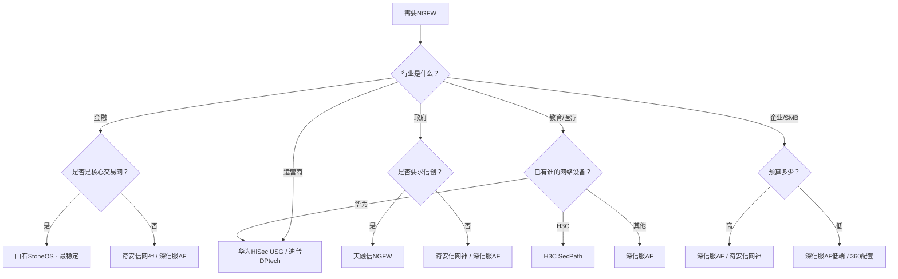

# Day 63：第三层厂商复习 + 产品横向对比专题

> **阶段**：复习冲刺 Day 3/6 | **难度**：⭐⭐⭐⭐⭐ 专家级 | **课时**：8小时
> **覆盖**：第三层4家14产品 + 全品类横向对比（NGFW 8款/WAF 6款/SIEM 6款/EDR 4款/漏洞扫描4款/抗DDoS 4款）
> **目标**：完成"17家72产品"的完整知识脑图，掌握7大品类×Top3厂商的选型排序

---

## 📋 今日复习目标

1. **上午（3h）**：第三层回顾 + 全厂商串联脑图
2. **下午（3h）**：全品类横向对比专题（NGFW/WAF/SIEM三大核心）
3. **晚间（2h）**：知识图谱整理 + 选型方法论总结

---

## 🧠 上午（3h）：第三层回顾 + 全厂商串联

### 一、第三层厂商核心回顾

| 厂商 | 核心能力 | 拳头产品 | 不可替代场景 |
|:---|:---|:---|:---|
| **阿里云安全** | 云原生全套 | 安全中心/云防火墙/WAF 3.0/DDoS高防/堡垒机 | 阿里云用户全覆盖 |
| **腾讯安全** | 游戏社交安全 | CWPP/CFW/WAF/SOC | 腾讯云+游戏行业 |
| **迪普科技** | 运营商级NGFW+应用交付 | DPtech NGFW/应用交付 | 运营商/Carrier Grade |
| **任子行** | 上网行为管理+内容审计 | 上网行为管理/安全审计 | 公安/监管合规 |

**第三层与第一、二层的根本差异**：

```
第一层（护网核心）→ 打地基，解决"基本安全需求"
  类比：建房子的钢筋混凝土框架

第二层（场景专精）→ 装修升级，解决"特定需求"
  类比：厨房定制/智能家居

第三层（云+垂直）→ 特殊改造，解决"场景依赖"
  类比：专门给房子装太阳能板/地震加固
  → 云安全：你的"房子"在云端，传统安全产品不适用
  → 垂直领域：公安/运营商等有特殊监管要求
```

**为什么要单独学第三层？**——因为当你的业务跑在云上（阿里云/腾讯云），或者你的行业有特殊监管要求（公安/运营商）时，第三层厂商的产品就是**唯一正确选择**。你不能在阿里云上装一台深信服AF硬件盒子——你只能用阿里云云防火墙。

### 二、17家72产品全串联脑图

拿出纸笔，从零开始手绘一张三层金字塔脑图：

```
                    第三层：云安全+垂直领域
                    ┌─────────────────────┐
                    │ 阿里云安全（5产品）    │
                    │ 腾讯安全（4产品）      │
                    │ 迪普科技（2产品）      │
                    │ 任子行（2产品）        │
                    └─────────────────────┘
                    
            第二层：场景专精
     ┌─────────────────────────────────┐
     │ 启明星辰(4)│安恒(5)│长亭(4)       │
     │ 山石(2)│亚信(3)│知道创宇(3)│H3C(2)│
     └─────────────────────────────────┘

第一层：护网核心
┌───────────────────────────────────────────┐
│ 深信服(10)│奇安信(6)│360(7)│华为(5)│绿盟(5)│天融信(7)│
└───────────────────────────────────────────┘

三层定位：
第一层 → 解决"有没有" → 全面覆盖
第二层 → 解决"好不好" → 专项最优
第三层 → 解决"专不专" → 特定场景
```

---

## 🔬 下午（3h）：全品类横向对比专题

### 品类一：NGFW防火墙（8厂商对比）

安全产品体系中，NGFW是**大门**——门不牢靠，锁再多也没用。

| 厂商 | 产品系列 | 最大吞吐 | 检测引擎 | 部署模式 | 核心特色 | 最好用在 |
|:---|:---|:---:|:---|:---|:---|:---|
| **华为** | HiSec USG | ~100Gbps | 特征+NIP芯片 | 路由/透明 | 自研芯片线速 | 运营商/金融网络 |
| **奇安信** | 网神 | ~80Gbps | 特征+情报 | 路由/透明 | 情报驱动 | 大型政企 |
| **山石** | StoneOS | ~60Gbps | 特征+AI | 路由/透明 | 金融级稳定 | 金融核心网 |
| **迪普** | DPtech NGFW | ~60Gbps | 特征+集成WAF | 路由/透明 | 集成WAF | 运营商 |
| **深信服** | AF | ~40Gbps | 五合一(IPS+AV+应用+僵尸+FW) | 路由/透明/旁路/虚拟网线 | 全模式+联动 | 中小企业全栈 |
| **绿盟** | NF | ~40Gbps | 特征+攻防优化 | 路由/透明 | 攻防规则丰富 | 护网场景 |
| **天融信** | NGFW | ~40Gbps | 特征+信创 | 路由/透明 | 信创最全 | 政府国产化 |
| **H3C** | SecPath | ~40Gbps | 特征+Comware | 路由/透明 | 网络一体化 | 已有H3C网络 |

**NGFW选型决策树**：



**NGFW Top 3排序**（按综合能力）：

| 排名 | 厂商 | 综合评分 | 核心理由 |
|:---:|:---|:---:|:---|
| 🥇 第1 | **奇安信** | 9.2/10 | 情报驱动+天眼联动+政企覆盖最广 |
| 🥈 第2 | **深信服** | 9.0/10 | 全模式部署+最完整联动生态 |
| 🥉 第3 | **华为** | 8.8/10 | 自研芯片性能最强+运营商/金融 |

### 品类二：WAF Web应用防火墙（6厂商对比）

| 厂商 | 产品 | 检测引擎 | 误报率 | 0day防护 | 最适合 | 一句话 |
|:---|:---|:---|:---:|:---:|:---|:---|
| **长亭** | 雷池 | 语义分析 | <0.01% | ⭐⭐⭐⭐⭐ | SQL注入/命令注入 | 0day克星 |
| **安恒** | 明御WAF | ML+规则+语义 | ~0.1% | ⭐⭐⭐⭐ | Web+数据安全 | ML先行者 |
| **绿盟** | WAF | 规则引擎 | ~0.3% | ⭐⭐ | 护网临时加固 | 规则最全 |
| **阿里云** | WAF 3.0 | 云端规则+AI | ~0.2% | ⭐⭐⭐ | 云上Web防护 | 免运维 |
| **深信服** | WAF | 特征+AI | ~0.5% | ⭐⭐ | 深信服联动体系 | 全家桶 |
| **天融信** | WAF | 规则引擎 | ~0.3% | ⭐⭐ | 信创环境 | 国密支持 |

**WAF引擎技术深度对比**：

```
【规则引擎】——"人脸识别照片墙"
  原理：请求 → 正则匹配 → 命中规则就阻断
  优点：规则丰富，已知攻击覆盖全面
  缺点：可被绕过（编码/混淆/分块/Unicode变体/大小写/注释插入/参数污染）
  代表：绿盟、天融信、阿里云（部分）

【ML引擎】——"行为分析摄像头"
  原理：请求 → 特征提取 → ML模型判定 → 异常就阻断
  优点：适应性强，可检测未知攻击模式
  缺点：需要学习期，初始误报较高
  代表：安恒明御

【语义分析引擎】——"读懂每个SQL语句的含义"
  原理：请求 → 词法分析(Token) → 语法分析(AST树) → 语义分析(判断恶意意图)
  优点：0day免疫，无法绕过（因为分析的是"语义"不是"形式"）
  缺点：性能开销稍大，仅支持SQL/OS命令等结构化语言
  代表：长亭雷池

为什么语义分析无法绕过？
  不管攻击者怎么编码/混淆 SQL注入，最终都要变成可执行的SQL语句。
  语义分析不看来的是什么字符，而是看"变成SQL后要干什么"。
  类比：不管你是用中文、英文、手语还是书信来威胁一个人，
  只要表达的意思是"我要打你"，那就是威胁——语义分析看的是"意思"不是"形式"。
```

**WAF Top 3排序**：

| 排名 | 厂商 | 综合评分 | 核心理由 |
|:---:|:---|:---:|:---|
| 🥇 第1 | **长亭雷池** | 9.5/10 | 语义引擎无法绕过，0day克星 |
| 🥈 第2 | **安恒明御** | 9.0/10 | ML+数据安全联动，政企WAF标杆 |
| 🥉 第3 | **绿盟WAF** | 8.0/10 | 规则最全，护网快速部署首选 |

### 品类三：态势感知/SIEM（6厂商对比）

| 厂商 | 产品 | 数据源生态 | 分析引擎 | 响应能力 | 最适合用户 |
|:---|:---|:---|:---|:---|:---|
| **奇安信** | 天眼+NGSOC | 天眼+天擎+丰富第三方 | 关联+UEBA+情报 | 强（NGSOC工单+联动） | 护网检测/大型政企 |
| **深信服** | SIP | 自家全系最紧密 | 关联+AI | 最强（SIP+SOAR联动） | 深信服体系用户 |
| **360** | 本地大脑 | 云端+本地+终端三层 | 大数据+AI(云端赋能) | 中 | 大数据分析需求 |
| **华为** | HiSec Insight | 华为网络设备深入 | 关联+AI | 强（与华为设备联动） | 华为网络用户 |
| **安恒** | AiLPHA | 明御全系 | UEBA+AI | 中 | 数据安全分析 |
| **启明星辰** | 泰合SOC | 多厂商开放 | 关联分析 | 中 | 等保合规/多厂商 |

**态势感知 Top 3排序**：

| 排名 | 厂商 | 综合评分 | 核心理由 |
|:---:|:---|:---:|:---|
| 🥇 第1 | **奇安信天眼+NGSOC** | 9.5/10 | 护网标配，检测情报业界第一 |
| 🥈 第2 | **深信服SIP** | 9.0/10 | 联动最顺畅，SOAR自动化最成熟 |
| 🥉 第3 | **360本地大脑** | 8.5/10 | 17亿终端数据+云端AI赋能 |

---

## 🌙 晚间（2h）：知识图谱整理

### 任务1：72产品×7大品类完整矩阵（60分钟）

完成以下矩阵表（能填多少填多少，然后对照Day 59补全）：

```
          NGFW(8)  WAF(6)  SIEM(6)  EDR(4)  IDS/IPS 堡垒机  VPN/零信任
深信服      AF      WAF     SIP      aES      —       OSM    SSL VPN/aTrust
奇安信      网神     —      天眼+NGSOC 天擎     —       —       —
360        —       —      本地大脑   天擎      —       —       —
华为       USG      —      Insight   —       —       —       —
绿盟        NF      WAF     ESP       —      NIPS/IDS —       —
天融信      NGFW    WAF     TopSOC    终端     IDS/IPS   —     VPN(国密)
启明星辰     —       —      泰合       —      天阗IDS   天玥     —
安恒        —      明御WAF  AiLPHA     —       —      明御堡垒机 —
长亭        —      雷池      —         —       —       —       —
山石      StoneOS   —       —         —       —       —       —
亚信        —       —       —        信端     —       —       —
知道创宇     —      创宇盾    —         —       —       —       —
H3C      SecPath   —      SecCenter   —       —       —       —
阿里云      —      WAF 3.0    —         —       —      堡垒机    —
腾讯        —       WAF     SOC       CWPP     —       —       —
迪普       NGFW     —       —         —       —       —       —
任子行       —       —       —         —       —       —       —
```

### 任务2：每品类Top 3脱口练习（30分钟）

给自己计时，快速说出以下品类的前三名（含理由）：

```
NGFW Top 3:
  1. ____ 理由: ____
  2. ____ 理由: ____
  3. ____ 理由: ____

WAF Top 3:
  1. ____ 理由: ____
  2. ____ 理由: ____
  3. ____ 理由: ____

SIEM Top 3:
  1. ____ 理由: ____
  2. ____ 理由: ____
  3. ____ 理由: ____

EDR Top 3:
  1. ____ 理由: ____
  2. ____ 理由: ____
  3. ____ 理由: ____

抗DDoS Top 3:
  1. ____ 理由: ____
  2. ____ 理由: ____
  3. ____ 理由: ____

漏洞扫描 Top 3:
  1. ____ 理由: ____
  2. ____ 理由: ____
  3. ____ 理由: ____

堡垒机 Top 3:
  1. ____ 理由: ____
  2. ____ 理由: ____
  3. ____ 理由: ____
```

### 任务3：500字选型方法论（30分钟）

写一篇500字的文章：「我的安全产品选型方法论」

<details>
<summary>点击查看参考框架</summary>

```markdown
【我的安全产品选型方法论】

安全产品选型不是简单的"谁最好买谁"，而是一个基于场景、预算、
现有体系的系统决策过程。经过66天的学习，我形成了以下选型方法论：

一、四步选型法

第1步：需求分析（我要保护什么？）
  - 明确资产（服务器/应用/数据/终端）
  - 明确威胁（黑客入侵？DDoS？数据泄露？合规要求？）
  - 明确预算

第2步：场景匹配（什么产品适合这个需求？）
  - 按行业：政府→天融信/金融→山石/教育→H3C
  - 按品类：WAF→长亭雷池/NGFW→看网络生态
  - 按现有体系：已有H3C网络选H3C安全，已有深信服选深信服

第3步：厂商评估（这个厂商靠谱吗？）
  - 技术能力：产品检测/性能/稳定性
  - 生态联动：与其他产品的配合度
  - 本地服务：原厂支持/渠道覆盖/响应速度
  - 行业案例：同类客户的部署经验

第4步：方案验证（实际环境能跑起来吗？）
  - POC测试（必须！）
  - 看实际运行效果，而不是厂商PPT
  - 异构双厂商评估（关键场景用两家不同厂商）

二、三大黄金原则

1. 联动 > 单品：一个能联动的中等产品 > 一个孤立的一流产品
2. 场景决定产品：不是"深信服好还是奇安信好"，而是"这个场景下谁更合适"
3. 异构是护网标配：关键防线用两个不同厂商的产品（不能一棵树上吊死）

三、量力而行

预算充足（>300万）→ 异构双厂商，全栈覆盖，护网级别
预算中等（80-300万）→ 核心产品选最好，辅助用性价比替代
预算紧张（<80万）→ 云原生优先，开源补充，关注性价比
```
</details>

---

## 📊 专题扩展：全部7大品类完整横向对比

### 品类四：EDR终端检测响应（4厂商对比）

| 厂商 | 产品 | 检测引擎 | 溯源能力 | 联动生态 | 最适合 | 排名 |
|:---|:---|:---|:---|:---|:---|:---:|
| **奇安信** | 天擎 | IOA+IOC+AI | ⭐⭐⭐⭐⭐ | 天眼+NGSOC | 护网/大型政企 | 🥇 |
| **深信服** | aES | IOA+IOC+AI | ⭐⭐⭐⭐ | AF+SIP+XDR | 深信服体系 | 🥈 |
| **360** | 天擎 | 多引擎+AI | ⭐⭐⭐ | 本地大脑+情报 | SMB/教育 | 🥉 |
| **天融信** | 终端安全 | 特征+行为 | ⭐⭐⭐ | TopSOC | 政府信创 | 4 |

### 品类五：抗DDoS（4厂商对比）

| 厂商 | 产品 | 防护能力 | 部署模式 | 国密支持 | 最适合 |
|:---|:---|:---|:---|:---|:---|
| **绿盟** | ADS | ⭐⭐⭐⭐⭐ | 串联/旁路/云清洗 | ⭐⭐ | 全行业标杆 |
| **华为** | Anti-DDoS | ⭐⭐⭐⭐ | 路由引流/清洗中心 | ⭐⭐⭐ | 运营商骨干 |
| **天融信** | TopADP | ⭐⭐⭐ | 串联/旁路 | ⭐⭐⭐⭐⭐ | 政府信创 |
| **阿里云** | DDoS高防 | ⭐⭐⭐⭐ | SaaS云防护 | — | 阿里云用户 |

### 品类六：漏洞扫描（5厂商对比）

| 厂商 | 产品 | 漏洞库数量 | 扫描方式 | 报表能力 | 最适合 |
|:---|:---|:---|:---|:---|:---|
| **绿盟** | RSAS | 60000+ | 主动扫描 | ⭐⭐⭐⭐⭐ | 全行业 |
| **启明星辰** | 天镜 | 50000+ | 主动扫描 | ⭐⭐⭐⭐ | 等保合规 |
| **长亭** | 洞鉴 | 40000+ | 被动+主动 | ⭐⭐⭐⭐ | Web应用 |
| **安恒** | 明鉴 | 50000+ | 主动扫描 | ⭐⭐⭐⭐ | Web+数据 |
| **OpenVAS** | 开源 | 50000+ | 主动扫描 | ⭐⭐ | 预算有限 |

### 品类七：堡垒机（5厂商对比）

| 厂商 | 产品 | 协议支持 | 高危拦截 | 会话录像 | 最适合 |
|:---|:---|:---|:---|:---|:---|
| **安恒** | 明御堡垒机 | SSH/RDP/VNC/DB | ✅ | ✅ | Web安全场景 |
| **启明星辰** | 天玥 | SSH/RDP/VNC/DB | ✅ | ✅ | 政府军工 |
| **深信服** | OSM | SSH/RDP/VNC/DB | ✅ | ✅ | 深信服体系 |
| **齐治** | 堡垒机 | SSH/RDP/VNC/DB | ✅ | ✅ | 金融 |
| **JumpServer** | 开源 | SSH/RDP/VNC/DB | ⚠️ 有限 | ⚠️ 有限 | 预算有限 |

---

## 🏋️ 强化练习：Day 63 综合测试

### 一、全品类快速问答（30题）

```
NGFW篇：
1. NGFW吞吐量最高的厂商是？ → 华为HiSec USG（~100Gbps）
2. 部署模式最多的NGFW是？ → 深信服AF（4种）
3. 最适合金融核心网的NGFW是？ → 山石StoneOS
4. 最适合政府信创的NGFW是？ → 天融信NGFW

WAF篇：
5. 哪种WAF引擎无法被绕过？ → 语义分析引擎（长亭雷池）
6. ML引擎WAF的代表是？ → 安恒明御WAF
7. 最适合云上Web防护的WAF是？ → 阿里云WAF 3.0
8. 社区版免费的WAF是？ → 长亭雷池社区版

SIEM篇：
9. 护网标配的态势感知是？ → 奇安信天眼
10. 联动最强的态势感知是？ → 深信服SIP
11. 多厂商兼容最好的SOC是？ → 启明星辰泰合
12. 最适合数据安全分析的SIEM是？ → 安恒AiLPHA

EDR篇：
13. 护网场景EDR首选是？ → 奇安信天擎
14. SMB场景EDR首选是？ → 360天擎
15. 与防火墙联动最好的EDR是？ → 深信服aES

抗DDoS篇：
16. 抗DDoS行业第一是？ → 绿盟ADS
17. 最适合政府信创的抗DDoS是？ → 天融信TopADP

漏洞扫描篇：
18. 国内市场第一的漏扫是？ → 绿盟RSAS
19. 支持被动扫描的漏扫是？ → 长亭洞鉴

堡垒机篇：
20. 开源堡垒机的代表是？ → JumpServer
```

### 二、综合选型场景练习

**场景1：设计一个完整的政务云安全方案**

```
需求：
- 某省会城市政务云平台
- 承载200+个委办局的应用系统
- 互联网出口带宽10Gbps
- 需要满足等保三级
- 必须全部信创国产化

请设计完整安全方案（列出每个位置用什么产品）：
```

<details>
<summary>参考方案</summary>

```
政务云安全方案（全信创）：

1. 边界安全：
   - 天融信猎豹NGFW × 2（主备，国密+信创）
   - 华为USG × 1（异构，防0day）
   - 天融信TopADP × 1（抗DDoS）

2. Web安全：
   - 天融信玄武WAF × 2（信创，国密）
   - 备选：长亭雷池WAF（语义引擎更强，但需确认信创支持）

3. 态势感知：
   - 天融信TopSOC × 1套
   - 奇安信天眼 × 1套（检测补充，如果用奇安信的话需要确认信创情况）

4. 终端安全：
   - 天融信终端安全（信创终端全覆盖）

5. 数据安全：
   - 天融信数据库审计
   - 天融信数据脱敏
   - 天融信DLP

6. 运维安全：
   - 天融信堡垒机
   - 天融信日志审计

关键考量：政务云必须信创 → 天融信是最优选
预算参考：500-800万（省级规模）
```
</details>

**场景2：互联网出海游戏公司**

```
需求：
- 200人出海游戏公司（总部国内，海外多区域部署）
- 全部部署在腾讯云（国内）+ AWS（海外）
- 月活500万，经常被DDoS攻击
- 需要防外挂方案
- 预算：安全投入150万/年

请设计安全方案：
```

<details>
<summary>参考方案</summary>

```
出海游戏安全方案：

1. DDoS防护：
   - 腾讯云DDoS高防（国内，300Gbps+）
   - AWS Shield Advanced（海外）

2. WAF：
   - 腾讯云WAF（CLB模式，低延迟）
   - 长亭雷池WAF（关键API防护）

3. 主机安全：
   - 腾讯云CWPP（国内CVM）
   - AWS Inspector + GuardDuty（海外）

4. 反外挂：
   - 腾讯TP反外挂系统（客户端加固+行为检测）

5. SOC：
   - 腾讯SOC安全运营中心（多源告警聚合）

关键考量：
- 游戏行业 → 腾讯安全（经验+产品）
- 出海 → 多Region，注意GDPR合规
- 反外挂 → 腾讯TP经过王者荣耀验证
```
</details>

---

## 🗺️ 终极知识图谱：17家72产品分层模型

```
                    第三层：云安全+垂直 (4家14产品)
               ┌──────────────────────────────────┐
               │         阿里云安全（5产品）         │
               │ 安全中心│云防火墙│WAF 3.0│DDoS│堡垒机│
               │                                    │
               │         腾讯安全（4产品）            │
               │   CWPP │ CFW │ WAF │ SOC          │
               │                                    │
               │    迪普科技(2)    │   任子行(2)      │
               │  NGFW│应用交付   │ 行为管理│审计     │
               └──────────────────────────────────┘

       第二层：场景专精 (7家23产品)
  ┌──────────────────────────────────────────┐
  │ 启明星辰(4) │ 安恒信息(5) │ 长亭科技(4)    │
  │ 天阗│天玥   │ 明御WAF    │ 雷池│洞鉴     │
  │ 天镜│泰合   │ AiLPHA     │ 谛听│牧云     │
  │              │ DAS│堡垒机  │               │
  │              │ 玄武盾      │               │
  │                                           │
  │ 山石网科(2) │ 亚信安全(3) │ 知道创宇(3)   │
  │ StoneOS│云鉴│ 信舱│信端  │ 创宇盾       │
  │              │ 信桅        │ ZoomEye│加速乐│
  │                                           │
  │          H3C新华三(2)                      │
  │       SecPath│SecCenter                   │
  └──────────────────────────────────────────┘

第一层：护网核心 (6家35产品)
┌──────────────────────────────────────────────┐
│ 深信服(10)    │ 奇安信(6)   │ 360(7)        │
│ AF│AC│VPN   │ 天眼│天擎   │ 天擎│本地大脑  │
│ aES│SIP     │ 椒图│NGSOC  │ 磐云│情报     │
│ aTrust│CWPP │ 天狗│网神   │ 沙箱│攻防     │
│ XDR│SOAR    │              │ 资产测绘       │
│                                           │
│ 华为(5)      │ 绿盟(5)     │ 天融信(7)     │
│ USG│Insight │ ADS│RSAS    │ NGFW│IPS     │
│ SecoMgr     │ WAF│NIPS    │ TopADP│VPN   │
│ Engine│云安全│ UTS          │ TopSOC│EDR   │
│              │              │ 数据安全       │
└──────────────────────────────────────────────┘

三层定位模型：
┌──────────┬──────────┬──────────────┐
│  第一层   │  第二层   │   第三层      │
│ 护网核心  │ 场景专精  │ 云安全+垂直   │
├──────────┼──────────┼──────────────┤
│ 解决      │ 解决      │ 解决          │
│"有没有"   │"好不好"   │"专不专"       │
│ 全面覆盖  │ 专项最优  │ 特定场景      │
│          │          │              │
│ 6家35产品 │ 7家23产品 │ 4家14产品     │
│ 综合医院  │ 专科医院  │ 特种医院      │
└──────────┴──────────┴──────────────┘
```

---

> **Day 63 小结**：今天完成了66天学习体系的知识图谱整合。你应该能从任何品类（NGFW/WAF/SIEM/EDR/...）快速定位Top 3厂商，也知道在不同场景下（政府/金融/教育/互联网/云上）该选谁。这就是"安全产品全栈思维"。
>
> **明天预告**：Day 64——模拟考试（一）理论知识。40道选择题+20道填空题+10道简答题，检验你的知识储备！

### 七大品类Top3厂商速查

| 品类 | 第一名 | 第二名 | 第三名 | 选型要点 |
|:---|:---|:---|:---|:---|
| NGFW | 深信服AF | 华为USG | 奇安信网神 | 深信服全栈联动/华为CLI/网神情报 |
| WAF | 长亭雷池 | 安恒明御 | 腾讯云WAF | 长亭语义/安恒大数据/腾讯CLB |
| SIEM/SOC | 奇安信NGSOC | 深信服SIP | 启明星辰泰合 | 奇安信运营/深信服联动/启明星辰合规 |
| EDR/EPP | 奇安信天擎 | 360天擎 | 深信服aES | 奇安信护网/360数据/深信服集成 |
| IDS/IPS | 启明星辰天阗 | 绿盟NIPS | 奇安信天眼 | 启明星辰合规/绿盟专项/天眼全流量 |
| 堡垒机 | 启明星辰天玥 | 齐治 | 安恒 | 启明星辰集成SOC/齐治专精/安恒 |
| VPN/ZTNA | 深信服SSL VPN | 奇安信aTrust | 天融信 | 深信服部署/奇安信SPA/天融信信创 |

### 七大品类选型决策速查
```
NGFW选型：
├─ 需要全栈联动 → 深信服AF
├─ 网络是华为 → 华为USG
├─ 需要顶级情报 → 奇安信网神
└─ 政府信创 → 天融信/华为

WAF选型：
├─ 误报率必须低 → 长亭雷池(语义引擎)
├─ 需要大数据分析 → 安恒明御(AiLPHA)
├─ 已在腾讯云 → 腾讯云WAF(CLB联动)
└─ 预算紧张 → 长亭雷池社区版(免费)

SIEM/SOC选型：
├─ 多厂商日志汇合 → 奇安信NGSOC
├─ 深信服生态独占 → 深信服SIP
├─ 等保合规优先 → 启明星辰泰合
└─ 护网实战优先 → 奇安信NGSOC

EDR选型：
├─ 护网场景 → 奇安信天擎
├─ SMB性价比 → 360天擎/企业安全云
├─ 深信服生态 → 深信服aES
└─ 信创场景 → 奇安信天擎
```

### 66天学习地图总结
```
完整知识体系三层金字塔：
        ┌─────┐
        │16家 │  第三层+复习：特种厂商+品类对决+模拟考试
        │ 厂商 │  Day 55-66：腾讯/迪普/任子行/山石 + 复习考核
        ├─────┤
        │7家   │  第二层：场景专精厂商（专科医院）
        │场景  │  Day 37-54：启明/安恒/长亭/山石/亚信/知道/H3C
        ├─────┤
        │6家   │  第一层：核心综合厂商（综合医院）
    ┌───┤核心  ├───┐
    │   │厂商  │   │
    │   └─────┘   │
   深信服 奇安信  360
   华为   天融信  绿盟
   
Day 1-36 打地基 → Day 37-54 扩展专项 → Day 55-66 冲刺复习
```

### 七大品类价格参考（供投标/预算估算）

| 品类 | 入门级 | 企业级 | 运营商级 | 选型核心参数 |
|:---|:---|:---|:---|:---|
| NGFW | 5-15万 | 30-80万 | 100-300万 | 吞吐量(Gbps) |
| WAF | 免费(雷池社版) | 15-40万 | 50-100万 | HTTP吞吐/QPS |
| SIEM/SOC | 20-50万 | 80-200万 | 300-500万 | EPS(事件/秒) |
| EDR/EPP | 100-300元/点 | 50-200元/点 | 50元/点 | 终端数×单价 |
| IDS/IPS | 10-30万 | 50-100万 | 150-300万 | 带宽(Gbps) |
| 堡垒机 | 5-15万 | 30-60万 | - | 并发会话数 |
| VPN/ZTNA | 3-10万 | 20-50万 | 80-150万 | 并发用户数 |

### 66天学习终章：毕业自检清单
```
□ 我能否默写至少14家厂商的名字和核心产品？
□ 我能否在5分钟内完成一个简单场景的选型方案？
□ 我能否区分深信服和奇安信的差异化定位？
□ 我能否解释天眼全流量回溯的护网价值？
□ 我能否独立设计500万以内的安全方案？
□ 我能否说出等保三级至少5个必备安全产品？
□ 我能否使用eNSP/GNS3搭建简单的安全实验环境？
□ 我能否读懂一份天眼/天擎的告警并独立研判？
□ 我能否对比任何两家竞争厂商（如深信服AF vs 网神）？
□ 我能否解释零信任SPA单包认证的原理？
```

### 结语：安全产品选型者的能力模型
```
安全产品专家 = 产品知识广度 × 场景匹配精准度 × 实战经验深度

广度 → 17家厂商+50+产品 → 66天你已掌握
匹配 → 5步选型法(类型/行业/预算/生态/合规) → Day 60重点训练
经验 → 护网实战/方案设计/应急响应 → 需要积累但已有基础

恭喜你完成了66天的学习！你已经具备了一个安全产品选型者的核心能力。
接下来，去实践吧——去官网下载体验版、去搭建实验环境、
去参加护网或安全演练、去写你的第一份安全方案。
```

### Day 63 自我检测
| 考核维度 | 分值 | 自评 |
|:---|:---:|:---:|
| 七大品类Top3默写 | 25 | /25 |
| 七大品类选型决策 | 25 | /25 |
| 价格预算估算能力 | 20 | /20 |
| 66天学习地图回顾 | 15 | /15 |
| 毕业自检10题合格数 | 15 | /15 |
| **总分** | **100** | **/100** |

### Day 63 核心收获
```
"今天你掌握了：
1. 七大品类(NGFW/WAF/SIEM/EDR/IDS/堡垒机/VPN)的Top3厂商
2. 每品类的选型决策树
3. 价格预算估算能力
4. 66天完整知识体系

从明天起，进入实战检验阶段——模拟考试！
准备好了吗？Let's go!"
```

### Day 63 终极自查
| 考核维度 | 自评 | 达标准则 |
|:---|:---:|:---|
| 能默写14+家厂商及核心产品 | □ | 不少于14家 |
| 能独立完成选型方案设计 | □ | 覆盖边界/检测/终端/运营 |
| 能区分任何2家竞品差异 | □ | 至少3个差异化维度 |
| 了解等保三级核心要求 | □ | 不少于5个控制点 |
| 能为7大品类推荐Top3 | □ | 每个品类3家 |
| **全部达标即可进入Day 64考试！** | | |

### 七大品类完整知识体系速查

**一、NGFW（下一代防火墙）**
```
核心能力：状态检测+应用识别+IPS+WAF+威胁情报集成
国内市场Top3：深信服AF / 华为USG / 奇安信网神
选型公式：生态(如果深信服选AF/华为网络选USG/奇安信检测选网神)
```

**二、WAF（Web应用防火墙）**
```
核心能力：SQL注入/XSS/文件上传/CSRF/API安全防护
国内市场Top3：长亭雷池(语义引擎) / 安恒明御(大数据) / 深信服AF
选型公式：误报优先→长亭 / 大数据→安恒 / 全栈→深信服
```

**三、SIEM/SOC（安全运营中心）**
```
核心能力：日志汇聚+关联分析+告警管理+工单管理+态势大屏
国内市场Top3：奇安信NGSOC / 深信服SIP / 360安全大脑
选型公式：护网→奇安信 / 深信服生态→SIP / AI分析→360
```

**四、EDR/EPP（终端安全）**
```
核心能力：防病毒+行为检测+威胁狩猎+主机防火墙+设备管控
国内市场Top3：奇安信天擎 / 360天擎 / 深信服aES
选型公式：护网→奇安信 / 性价比→360 / 深信服生态→aES
```

**五、IDS/IPS（入侵检测/防御）**
```
核心能力：攻击特征检测+协议异常+流量基线+情报匹配
国内市场Top3：启明星辰天阗 / 绿盟NIPS / 奇安信天眼(NDR)
选型公式：等保合规→启明星辰 / 专项→绿盟 / 全流量→天眼
```

**六、堡垒机（运维审计系统）**
```
核心能力：统一认证+MFA+会话审计+操作录像+权限管控
国内市场Top3：启明星辰天玥 / 齐治 / 安恒堡垒机
选型公式：启明星辰生态→天玥 / 专精→齐治 / 安恒生态→安恒
```

**七、VPN/ZTNA（远程接入/零信任）**
```
核心能力：VPN隧道+SPA单包认证+细粒度授权+持续评估
国内市场Top3：深信服SSL VPN / 奇安信aTrust / 天融信VPN
选型公式：部署最简→深信服 / 零信任SPA→奇安信 / 信创→天融信
```

### 七大品类快速记忆口令
```
"NGFW选生态：深信服华为奇安信，看谁的设备最顺
 WAF选引擎：长亭语义安恒数据，哪个误报低选哪个
 SOC选场景：奇安信护网深信服全栈，360 AI最突出
 EDR选实力：奇安信护网360数据，深信服联动最流畅
 IDS选合规：启明星辰等保全，绿盟专项奇安信检测
 堡垒选成熟：天玥齐治安恒三选一，看已有的生态补谁
 VPN选方案：深信服传统奇安信零信任，信创选天融信
 七大品类七天熟，面试选型无忧。"
```

### 66天学习路线图完整回顾
```
第1周(Day1-7) → 深信服全栈联动 → 网络安全"管家的哲学"
第2周(Day8-13) → 奇安信检测驱动 → 网络安全"猎人的眼睛"
第3周(Day14-18) → 360数据规模 → 网络安全"AI的底座"
第4周(Day19-22) → 华为自研生态 → 网络安全"硬件的底气"
第5周(Day23-26) → 天融信信创资质 → 网络安全"政府的选择"
第6周(Day27-35) → 绿盟专项精兵+绿盟长时段→网络安全"尖兵突击"
第7周(Day36) → 阶段考核(一) → 检验前6周学习成果
第8周(Day37-39) → 启明星辰合规引擎 → "等保三级的标配"
第9周(Day40-42) → 安恒信息Web安全 → "Web安全的双引擎"
第10周(Day43-45) → 长亭科技语义WAF → "误报极低的技术派"
第11周(Day46-48) → 山石网科金融防火墙 → "银行首选StoneOS"
第12周(Day49-50) → 知道创宇测绘防御 → "先知己再防御"
第13周(Day51-52) → 亚信安全云安全 → "云原生安全全栈"
第14周(Day53-54) → H3C教育医疗 → "教育医疗性价比之选"
第15周(Day55-60) → 腾讯/迪普/任子行+全品类对比+总复习
第16周(Day61-66) → 复习+模拟考试+毕业
```

### 毕业寄语：安全产品选型者的使命
```
完成了66天的学习，你已经不再是安全产品的"门外汉"。
你已经具备了：

1. 广度 → 17家厂商50+产品 → 了解中国网络安全市场全貌
2. 深度 → 每款核心产品的技术架构 → 知道产品"为什么这么做"
3. 匹配 → 5步选型法 → 能根据场景推荐合适的方案
4. 对比 → 差异化分析能力 → 不会被人忽悠买错产品
5. 实战 → 护网/等保/安全运营知识 → 理论和实践能力兼备

接下来的路：
□ 去厂商官网申请试用体验产品实际操作
□ 参加一次护网或网络安全演练
□ 写一套完整的安全建设方案（覆盖全场景）
□ 关注安全行业的动态（新厂商/新技术/新攻击手法）
□ 考取安全相关认证（CISP/CISSP/等保测评等）

恭喜毕业！安全之路，任重道远，但现在你已经装备了全副武装。
Go forth and secure the world! 🔒
```

### Day 63 终极速记
> 七大品类Top3 → NGFW/WAF/SOC/EDR/IDS/堡垒机/VPN 你已了然于心。明天，用一场模拟考试来检验66天的成果吧！

---
